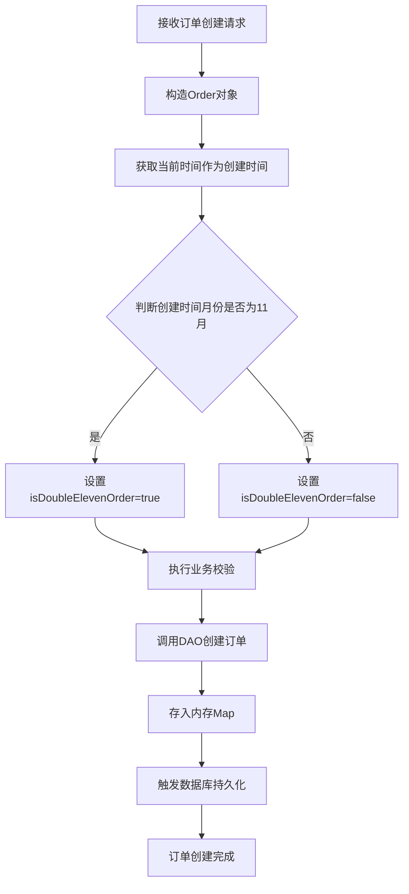
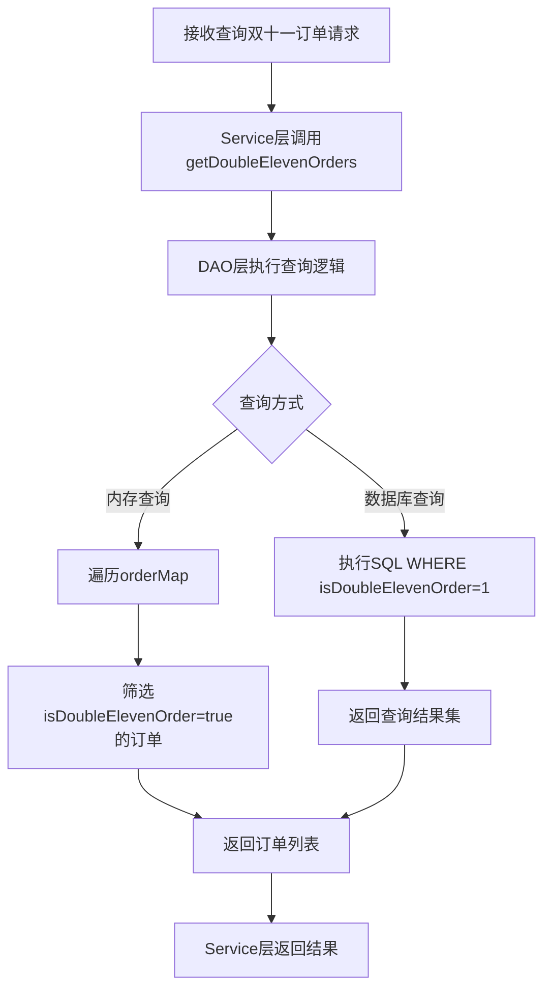

# 订单双十一标签功能设计

## 需求概述

为订单管理系统增加双十一标签功能,实现对双十一期间创建的订单进行自动标记,便于后续的订单查询、统计和分析。

## 功能目标

- 为订单实体增加双十一标签字段
- 根据订单创建时间自动判断并设置双十一标签
- 支持按双十一标签查询订单
- 持久化标签数据到数据库

## 业务规则

### 双十一标签判断规则

订单创建时间满足以下条件时自动打上双十一标签:

- 订单创建月份为11月(不限具体日期)
- 时间范围: 11月1日 00:00:00 至 11月30日 23:59:59

判断逻辑:
- 提取订单创建时间的月份
- 月份为11时,标记为双十一订单
- 标签值为布尔类型: true表示是双十一订单,false表示非双十一订单

### 标签用途

双十一标签主要用于:
- 订单查询和筛选
- 订单数据统计分析
- 不影响订单的业务流程和状态变更

## 数据模型变更

### Order实体扩展

需要在Order实体中增加以下字段:

| 字段名 | 类型 | 说明 | 默认值 |
|--------|------|------|--------|
| isDoubleElevenOrder | Boolean | 是否为双十一订单 | false |

字段特性:
- 该字段在订单创建时自动计算并设置
- 一旦设置后不再改变,即使订单更新时间也不影响标签值
- 该字段参与数据库持久化

### 数据库表结构变更

需要在数据库表 `order0713` 中增加以下列:

| 列名 | 数据类型 | 约束 | 说明 |
|------|----------|------|------|
| isDoubleElevenOrder | INTEGER | NOT NULL DEFAULT 0 | 双十一标签,0表示否,1表示是 |

说明:
- SQLite使用INTEGER类型存储布尔值
- 0表示false,1表示true
- 设置默认值为0,确保数据完整性

## 功能模块设计

### 实体层变更

Order实体需要进行以下调整:

#### 新增字段
- 添加 isDoubleElevenOrder 字段及其getter/setter方法

#### 构造函数调整
- 全参构造函数增加 isDoubleElevenOrder 参数
- 基础构造函数在创建时自动计算并设置双十一标签

#### 标签计算逻辑
在实体中提供标签判断方法:
- 输入: 订单创建时间
- 输出: 是否为双十一订单的布尔值
- 逻辑: 判断月份是否为11

### 数据访问层变更

OrderDAO需要进行以下调整:

#### 数据库初始化
- initTable方法中,在CREATE TABLE语句中增加 isDoubleElevenOrder 列定义

#### 数据持久化
- saveToDatabase方法中,在INSERT语句中增加 isDoubleElevenOrder 字段的写入
- 将布尔值转换为整型(true→1, false→0)

#### 数据加载
- loadFromDatabase方法中,在SELECT查询后增加 isDoubleElevenOrder 字段的读取
- 将整型转换为布尔值(1→true, 0→false)

#### 查询方法
新增双十一订单查询方法:
- 方法名: getDoubleElevenOrders
- 输入: 无参数
- 输出: 双十一订单列表
- 实现: 遍历内存中的订单,筛选 isDoubleElevenOrder 为 true 的订单

可选的数据库查询方法:
- 方法名: getDoubleElevenOrdersFromDB
- 输入: 无参数
- 输出: 双十一订单列表
- 实现: 执行SQL查询 WHERE isDoubleElevenOrder = 1

### 业务逻辑层变更

OrderService需要进行以下调整:

#### 订单创建
- createOrder方法中,确保订单对象在创建时已正确设置双十一标签
- 标签设置在Order构造时自动完成,Service层无需额外处理

#### 双十一订单查询
新增查询方法:
- 方法名: getDoubleElevenOrders
- 输入: 无参数
- 输出: 双十一订单列表
- 实现: 调用DAO层的查询方法
- 用途: 为上层提供双十一订单统计和分析接口

#### 订单更新
- updateOrder方法保持现有逻辑不变
- 双十一标签一旦创建不随订单更新而改变

## 数据流转流程

### 订单创建流程

### 双十一订单查询流程

## 数据迁移策略

对于已存在的历史订单数据,需要进行数据迁移:

### 迁移时机
- 在系统升级部署时执行一次性迁移

### 迁移步骤
1. 执行ALTER TABLE为表增加 isDoubleElevenOrder 列,默认值为0
2. 执行UPDATE语句更新历史订单的标签值
3. 更新条件: 根据createTime字段提取月份和日期
4. 符合条件的订单将 isDoubleElevenOrder 设置为1

### 迁移SQL示例结构

更新语句需要:
- 目标表: order0713
- 更新字段: isDoubleElevenOrder
- 更新条件: 从createTime字段提取月份=11的记录
- 更新值: 设置为1

### 迁移验证
- 统计迁移前后双十一订单数量
- 抽样检查部分订单的标签正确性
- 验证新增订单的标签自动设置功能

## 功能边界

### 包含的功能
- 自动识别和标记双十一订单
- 查询双十一订单列表
- 数据库持久化标签信息

### 不包含的功能
- 不支持其他营销活动标签(如618、双十二等)
- 不支持手动修改标签
- 标签不影响订单状态流转和业务逻辑
- 不提供标签的统计分析功能(仅提供查询能力)

## 系统影响分析

### 性能影响
- 订单创建时增加日期判断逻辑,时间复杂度O(1),性能影响可忽略
- 查询双十一订单时遍历内存Map,时间复杂度O(n),n为订单总数
- 数据库增加一个整型列,存储空间增加最小

### 兼容性
- 新增字段有默认值,不影响现有订单创建流程
- 现有查询方法不受影响
- 需要进行数据库表结构升级和历史数据迁移

### 扩展性
- 当前设计仅支持双十一标签
- 如需支持多种营销标签,需要重新设计为标签集合或标签表结构

## 测试要点

### 单元测试

#### Order实体测试
- 测试11月任意日期创建的订单标签为true
- 测试非11月创建的订单标签为false
- 测试11月1日和11月30日边界日期的订单
- 测试跨年份的11月订单标签正确性

#### OrderDAO测试
- 测试数据库表创建包含新列
- 测试双十一订单保存和加载的正确性
- 测试查询双十一订单方法返回正确结果

#### OrderService测试
- 测试创建双十一订单的完整流程
- 测试查询双十一订单服务方法
- 测试订单更新不改变双十一标签

### 集成测试
- 测试订单从创建到持久化的完整流程
- 测试系统重启后双十一标签数据的正确加载
- 测试混合查询(包含双十一和非双十一订单)的准确性

### 边界测试
- 测试11月1日 00:00:00 的订单
- 测试11月30日 23:59:59 的订单
- 测试10月31日和12月1日的订单
- 测试跨年份不同年份的11月订单
