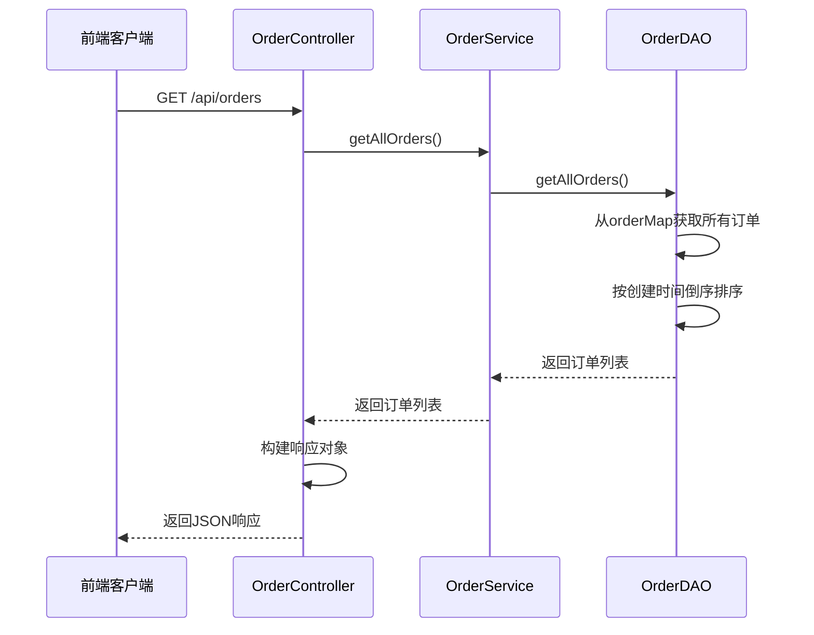
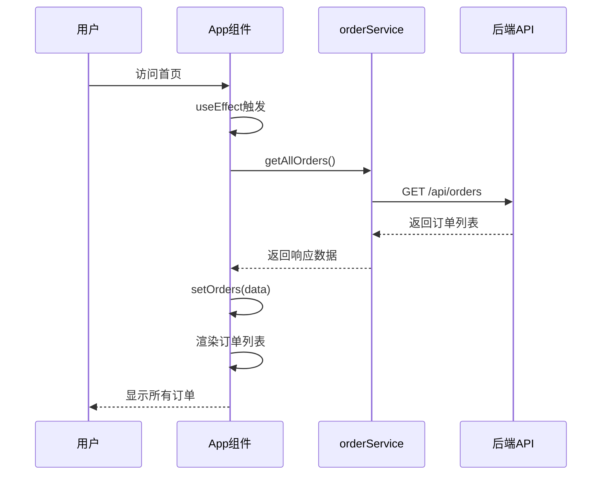
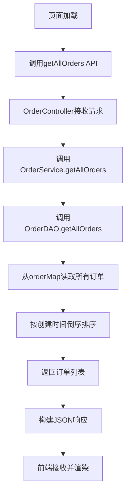

# 订单管理系统首页显示所有订单列表

## 功能概述

在订单管理系统首页,用户无需输入用户ID即可直接查看系统中所有订单的列表信息,提升操作便捷性和数据可见性。

## 业务价值

- 管理员可快速浏览全局订单情况
- 无需记忆特定用户ID即可查看订单数据
- 提升系统首页的信息展示能力
- 便于数据监控和运营分析

## 功能需求

### 核心需求

系统首页加载时自动展示所有订单列表,包含以下信息:
- 订单ID
- 用户ID
- 商品ID
- 购买数量
- 订单总金额
- 订单状态(待支付/已支付/已发货/已完成/已取消)
- 创建时间
- 支付时间

### 用户体验需求

- 页面加载时自动获取并显示所有订单
- 订单列表按创建时间倒序排列(最新订单在前)
- 支持现有的订单操作功能(支付、发货、完成、删除)
- 保留现有的按用户ID查询功能

## 功能边界

### 包含范围

- 后端提供获取所有订单的API接口
- 前端首页自动调用并展示所有订单
- 订单列表默认排序规则
- 兼容现有订单操作流程

### 不包含范围

- 订单列表分页功能(后续扩展)
- 订单筛选和排序功能(后续扩展)
- 订单数据导出功能(后续扩展)
- 订单统计分析功能(后续扩展)

## 系统设计

### 架构影响范围

涉及的模块:
- 数据访问层: OrderDAO
- 业务逻辑层: OrderService
- API控制层: OrderController
- 前端展示层: App.js, orderService.js

### API设计

#### 获取所有订单接口

**接口说明**: 获取系统中所有订单列表

| 项目 | 内容 |
|------|------|
| 请求方法 | GET |
| 请求路径 | /api/orders |
| 请求参数 | 无 |
| 响应格式 | JSON |

**响应数据结构**:

| 字段 | 类型 | 说明 |
|------|------|------|
| success | Boolean | 请求是否成功 |
| data | Array | 订单对象数组 |
| count | Integer | 订单总数 |

**订单对象结构**:

| 字段 | 类型 | 说明 |
|------|------|------|
| orderId | String | 订单ID |
| userId | String | 用户ID |
| productId | String | 商品ID |
| quantity | Integer | 购买数量 |
| totalAmount | BigDecimal | 订单总金额 |
| status | Integer | 订单状态 |
| createTime | LocalDateTime | 创建时间 |
| payTime | LocalDateTime | 支付时间 |
| updateTime | LocalDateTime | 更新时间 |

**响应示例**:

成功响应结构:
- success字段值为true
- data字段包含订单对象数组
- count字段包含订单总数
- HTTP状态码为200

异常响应结构:
- success字段值为false
- message字段包含错误描述信息
- HTTP状态码为500

### 数据访问层设计

#### OrderDAO新增方法

**方法定义**:

| 项目 | 内容 |
|------|------|
| 方法名称 | getAllOrders |
| 返回类型 | List\<Order\> |
| 参数 | 无 |
| 功能描述 | 获取内存中所有订单并按创建时间倒序排列 |

**处理逻辑**:

1. 从内存orderMap中获取所有订单
2. 按创建时间降序排序(最新订单在前)
3. 处理createTime为null的情况(排在末尾)
4. 返回排序后的订单列表

**边界情况**:

| 场景 | 处理方式 |
|------|----------|
| orderMap为空 | 返回空列表 |
| createTime为null | 使用nullsLast排在末尾 |

### 业务逻辑层设计

#### OrderService新增方法

**方法定义**:

| 项目 | 内容 |
|------|------|
| 方法名称 | getAllOrders |
| 返回类型 | List\<Order\> |
| 参数 | 无 |
| 功能描述 | 获取所有订单列表 |

**业务规则**:

- 直接委托给OrderDAO.getAllOrders方法
- 无需额外的业务校验
- 保持与现有方法一致的调用模式

### API控制层设计

#### OrderController新增接口

**接口定义**:

| 项目 | 内容 |
|------|------|
| 请求映射 | GET /api/orders |
| 方法名称 | getAllOrders |
| 返回类型 | ResponseEntity\<Map\<String, Object\>\> |

**处理流程**:

**响应构建逻辑**:

正常情况:
- 设置success为true
- 设置data为订单列表
- 设置count为订单数量
- 返回HTTP 200状态码

异常情况:
- 捕获异常并设置success为false
- 设置message为异常信息
- 返回HTTP 500状态码

### 前端设计

#### 页面加载流程

#### orderService.js扩展

**新增方法**:

| 项目 | 内容 |
|------|------|
| 方法名称 | getAllOrders |
| 请求类型 | GET |
| 请求路径 | /api/orders |
| 返回类型 | Promise |

#### App.js页面改造

**状态管理**:

| 状态变量 | 类型 | 用途 |
|----------|------|------|
| orders | Array | 存储订单列表数据 |
| loading | Boolean | 控制加载状态显示 |
| message | Object | 显示操作反馈信息 |

**生命周期处理**:

在组件挂载时(useEffect):
1. 检查后端连接状态
2. 自动调用getAllOrders获取所有订单
3. 设置loading状态
4. 更新orders状态
5. 显示加载结果消息

**用户交互优化**:

| 场景 | 处理方式 |
|------|----------|
| 首次加载 | 自动显示所有订单 |
| 按用户ID查询后 | 显示筛选后的订单 |
| 创建订单后 | 刷新显示所有订单 |
| 订单操作后 | 刷新当前视图(全部或筛选) |

**显示逻辑调整**:

当前显示逻辑:
- orders为空且未搜索: 提示"请输入用户ID查询订单"
- orders为空且已搜索: 提示"暂无订单数据"

调整后显示逻辑:
- orders为空: 提示"暂无订单数据"
- orders有数据: 显示订单列表表格
- loading为true: 显示"加载中..."

## 数据流设计

### 页面初始化数据流

### 订单操作后刷新流程

当用户执行订单操作(支付、发货、完成、删除)后:

场景1 - 当前显示全部订单:
- 重新调用getAllOrders刷新列表

场景2 - 当前显示筛选订单:
- 调用getOrdersByUserId刷新当前用户订单列表

判断依据:
- 检查searchUserId状态变量是否有值
- 有值则调用按用户ID查询
- 无值则调用获取全部订单

## 兼容性考虑

### 向后兼容

- 保留现有的按用户ID查询功能
- 保留现有的订单操作功能
- 保留现有的API接口路径
- 前端查询栏保持可用

### 功能共存

| 功能 | 触发条件 | 数据来源 |
|------|----------|----------|
| 显示所有订单 | 页面加载/创建订单后 | GET /api/orders |
| 显示用户订单 | 点击查询按钮 | GET /api/orders/user/:userId |
| 刷新所有订单 | searchUserId为空时操作后刷新 | GET /api/orders |
| 刷新用户订单 | searchUserId有值时操作后刷新 | GET /api/orders/user/:userId |

## 非功能性需求

### 性能考虑

- 内存数据读取性能: O(n) - 遍历所有订单
- 排序性能: O(n log n) - 基于时间排序
- 适用数据量: 当前适合中小规模订单数据(< 10000条)

### 数据一致性

- 数据源为内存orderMap
- 与数据库保持同步通过saveToDatabase和loadFromDatabase
- 订单操作后自动触发saveToDatabase

### 扩展性预留

当订单量增长时,可扩展以下能力:
- 分页查询机制
- 服务端排序和筛选
- 缓存策略优化
- 数据库索引优化

## 测试验证点

### 后端测试点

| 测试项 | 验证内容 |
|--------|----------|
| 空订单列表 | 返回空数组,count为0 |
| 单个订单 | 正确返回订单数据 |
| 多个订单 | 按创建时间倒序排列 |
| null时间处理 | createTime为null的订单排在末尾 |
| 异常处理 | 返回错误响应和状态码 |

### 前端测试点

| 测试项 | 验证内容 |
|--------|----------|
| 首次加载 | 自动显示所有订单 |
| 空数据显示 | 正确显示"暂无订单数据" |
| 加载状态 | 加载中显示loading提示 |
| 表格渲染 | 所有字段正确显示 |
| 操作按钮 | 根据状态显示正确操作 |

### 集成测试点

| 测试项 | 验证内容 |
|--------|----------|
| 端到端流程 | 页面加载到数据展示完整流程 |
| 创建订单刷新 | 创建后自动刷新显示新订单 |
| 查询功能兼容 | 按用户ID查询功能正常 |
| 操作后刷新 | 订单操作后正确刷新列表 |

## 实施优先级

### 核心实施内容(必须)

1. OrderDAO.getAllOrders方法实现
2. OrderService.getAllOrders方法实现
3. OrderController GET /api/orders接口实现
4. orderService.js getAllOrders方法实现
5. App.js页面加载时调用getAllOrders

### 可选优化内容

1. 添加订单总数显示
2. 优化加载动画效果
3. 添加刷新按钮手动刷新

## 风险与约束

### 技术风险

| 风险 | 影响 | 缓解措施 |
|------|------|----------|
| 订单量过大导致加载慢 | 用户体验下降 | 后续引入分页功能 |
| 内存数据与数据库不一致 | 数据准确性问题 | 确保操作后调用saveToDatabase |

### 业务约束

- 当前设计适用于中小规模订单数据
- 不涉及权限控制,所有用户可见所有订单
- 不涉及敏感数据脱敏处理
