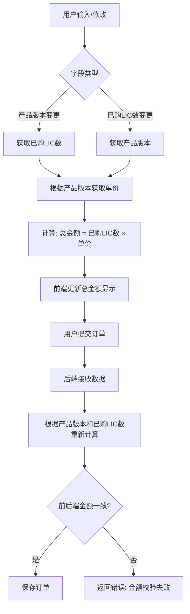
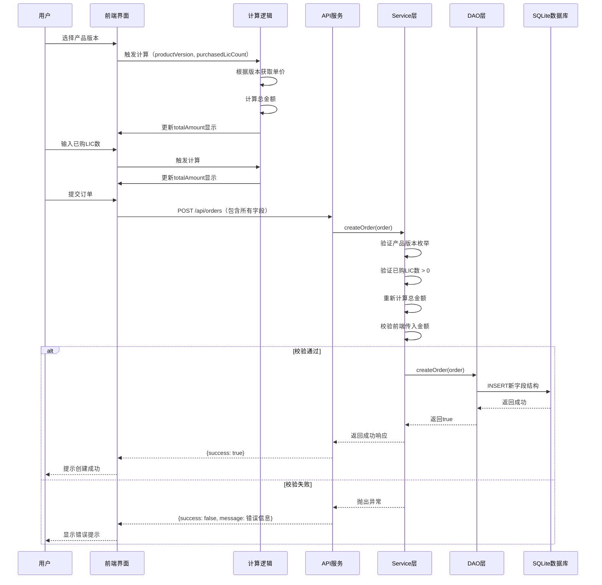

# 订单字段重命名与计算规则调整设计文档

## 一、需求概述

对现有订单管理系统进行字段重命名和金额计算规则调整，以适配软件产品许可证销售业务场景。

### 核心变更内容

1. 字段重命名：将通用订单字段改为软件许可证业务专用字段
2. 新增字段：增加"已购LIC数"字段用于计算总金额
3. 产品限定：将商品ID改为产品版本枚举，限定为三个特定产品
4. 计算规则：基于产品版本和已购LIC数实现差异化定价

## 二、字段映射关系

### 2.1 字段重命名映射表

| 原字段名称 | 原数据库字段 | 新字段名称 | 新数据库字段 | 数据类型 | 说明 |
|---------|------------|---------|------------|---------|------|
| 订单ID | orderId | CID | cid | String | 客户合同标识 |
| 用户ID | userId | 客户名称 | customerName | String | 购买方名称 |
| 商品ID | productId | 产品版本 | productVersion | String | 限定枚举值 |
| 数量 | quantity | 研发规模 | devScale | Integer | 团队规模数值 |
| - | - | 已购LIC数 | purchasedLicCount | Integer | 实际购买许可证数量（新增） |
| 总金额 | totalAmount | 总金额 | totalAmount | BigDecimal | 保持不变 |

### 2.2 保留字段

以下字段保持原有命名和逻辑不变：

- status（订单状态）
- description（订单描述）
- createTime（创建时间）
- payTime（支付时间）
- updateTime（更新时间）

## 三、产品版本枚举定义

### 3.1 可选产品版本

| 产品代码 | 产品名称 | 单价（元/LIC） | 计算倍数 |
|---------|---------|--------------|---------|
| QODER | Qoder | 20 × 7 = 140 | 固定倍数140 |
| LINGMA_ENTERPRISE | 灵码企业版 | 79 | 单倍79 |
| LINGMA_EXCLUSIVE | 灵码专属版 | 159 | 单倍159 |

### 3.2 枚举验证规则

- 前端：使用下拉选择框（select），限定用户只能选择三个预定义选项
- 后端：在Service层和Controller层进行白名单验证，拒绝非法值
- 数据库：productVersion字段存储枚举代码（如"QODER"）

## 四、总金额计算规则

### 4.1 计算公式

总金额计算基于产品版本和已购LIC数：

```
总金额 = 已购LIC数 × 产品单价

其中产品单价根据产品版本确定：
- 灵码企业版：单价 = 79元
- 灵码专属版：单价 = 159元
- Qoder：单价 = 20 × 7 = 140元
```

### 4.2 计算触发时机

| 触发场景 | 计算位置 | 说明 |
|---------|---------|------|
| 创建订单时 | 前端自动计算 | 用户选择产品版本或输入已购LIC数时实时计算 |
| 创建订单提交 | 后端校验计算 | 接收请求时重新计算并校验前端传值准确性 |
| 更新订单时 | 前端自动计算 + 后端校验 | 修改产品版本或已购LIC数时同步触发 |

### 4.3 计算逻辑流程



### 4.4 边界情况处理

| 场景 | 处理策略 |
|------|---------|
| 已购LIC数为0或负数 | 前端禁止输入，后端抛出参数校验异常 |
| 已购LIC数为空 | 前端默认值为1，后端强制校验非空 |
| 产品版本未选择 | 前端必填项验证，后端返回400错误 |
| 产品版本非法值 | 后端拒绝请求并返回枚举值列表提示 |
| 前后端计算金额不一致 | 后端以重新计算结果为准，记录日志并返回警告 |

## 五、数据库变更设计

### 5.1 表结构变更

对orders表执行以下ALTER TABLE操作：

| 操作类型 | SQL语句目的 | 说明 |
|---------|------------|------|
| 重命名列 | orderId → cid | 客户合同ID |
| 重命名列 | userId → customerName | 客户名称 |
| 重命名列 | productId → productVersion | 产品版本代码 |
| 重命名列 | quantity → devScale | 研发规模 |
| 新增列 | 添加purchasedLicCount | 已购LIC数，Integer类型，非空 |

### 5.2 数据迁移策略

| 迁移项 | 策略 | 说明 |
|-------|------|------|
| 已有订单数据 | purchasedLicCount初始值设为devScale的值 | 保证历史数据兼容 |
| productVersion值 | 将历史productId映射为"LINGMA_EXCLUSIVE" | 默认为灵码专属版 |
| 总金额重算 | 根据新规则重新计算并更新totalAmount | 确保数据一致性 |

### 5.3 变更后表结构

| 字段名 | 数据类型 | 约束 | 默认值 | 说明 |
|-------|---------|------|--------|------|
| cid | TEXT | PRIMARY KEY | - | 客户合同ID |
| customerName | TEXT | NOT NULL | - | 客户名称 |
| productVersion | TEXT | NOT NULL | - | 产品版本枚举 |
| devScale | INTEGER | NOT NULL | - | 研发规模 |
| purchasedLicCount | INTEGER | NOT NULL | - | 已购LIC数 |
| totalAmount | REAL | NOT NULL | - | 订单总金额 |
| status | INTEGER | NOT NULL | 0 | 订单状态 |
| description | TEXT | - | - | 订单描述 |
| createTime | TEXT | NOT NULL | - | 创建时间（ISO格式字符串） |
| payTime | TEXT | - | - | 支付时间 |
| updateTime | TEXT | - | - | 更新时间 |

## 六、后端实体类调整

### 6.1 Order实体类字段调整

字段变更对照：

| 原属性名 | 新属性名 | 类型 | 注释更新 |
|---------|---------|------|---------|
| orderId | cid | String | 客户合同ID（Customer ID） |
| userId | customerName | String | 客户名称 |
| productId | productVersion | String | 产品版本（枚举值） |
| quantity | devScale | Integer | 研发规模 |
| - | purchasedLicCount | Integer | 已购LIC数（新增） |

### 6.2 构造函数调整

需要更新的构造函数：

1. 无参构造函数：保持不变，用于Jackson反序列化
2. 全参构造函数：增加purchasedLicCount参数
3. 基础字段构造函数：增加purchasedLicCount参数

### 6.3 Getter/Setter方法

所有重命名字段需同步更新对应的getter和setter方法名称。

## 七、后端业务逻辑调整

### 7.1 OrderService服务层

#### 创建订单逻辑增强

新增验证规则：

| 验证项 | 验证逻辑 | 错误提示 |
|-------|---------|---------|
| 产品版本合法性 | 必须为QODER/LINGMA_ENTERPRISE/LINGMA_EXCLUSIVE之一 | "产品版本不合法，仅支持：Qoder、灵码企业版、灵码专属版" |
| 已购LIC数合法性 | 必须 > 0 | "已购LIC数必须大于0" |
| 研发规模合法性 | 必须 > 0 | "研发规模必须大于0" |
| 总金额校验 | 根据产品版本和已购LIC数重新计算，与传入值比对 | "总金额计算错误，应为：{计算值}" |

#### 金额计算工具方法

新增私有方法用于计算总金额：

- 方法名称：calculateTotalAmount
- 入参：productVersion（产品版本）、purchasedLicCount（已购LIC数）
- 返回值：BigDecimal类型的总金额
- 计算逻辑：
  - 根据productVersion确定单价
  - 返回 单价 × purchasedLicCount

### 7.2 OrderDAO数据访问层

#### SQL语句调整

所有涉及字段的SQL语句需同步更新字段名：

| 操作类型 | 受影响方法 | 调整内容 |
|---------|-----------|---------|
| INSERT | createOrder | 更新列名，增加purchasedLicCount列 |
| UPDATE | updateOrder | 更新SET子句列名 |
| SELECT | getOrder, getOrdersByUserId, getAllOrders | 更新SELECT列名和WHERE条件 |
| DELETE | deleteOrder | 更新WHERE条件中的主键列名 |

#### 数据库初始化调整

DBUtil类中的建表语句需同步更新为新表结构。

### 7.3 OrderController控制器层

#### 请求参数验证

在Controller层增加参数验证注解或手动校验：

- 产品版本：不为空，且在枚举范围内
- 已购LIC数：不为空，大于0
- CID：不为空，符合命名规范

#### 响应数据映射

确保返回的JSON字段名与前端约定一致。

## 八、前端调整设计

### 8.1 表单字段更新

#### 创建订单表单

| 原字段标签 | 新字段标签 | 输入类型 | 验证规则 |
|-----------|-----------|---------|---------|
| 订单ID | CID | text | 必填 |
| 用户ID | 客户名称 | text | 必填 |
| 商品ID | 产品版本 | select（下拉选择） | 必填，三选一 |
| 数量 | 研发规模 | number | 必填，≥1 |
| - | 已购LIC数 | number | 必填，≥1 |
| 总金额 | 总金额 | number | 只读，自动计算 |

#### 产品版本下拉选项

```
下拉选项配置：
- 选项1：显示文本="Qoder"，值="QODER"
- 选项2：显示文本="灵码企业版"，值="LINGMA_ENTERPRISE"
- 选项3：显示文本="灵码专属版"，值="LINGMA_EXCLUSIVE"
```

### 8.2 自动计算逻辑

#### 前端计算函数

- 函数名称：calculateTotalAmount
- 触发时机：产品版本变更、已购LIC数变更
- 输入参数：productVersion, purchasedLicCount
- 计算逻辑：
  - 根据productVersion获取单价（QODER=140, LINGMA_ENTERPRISE=79, LINGMA_EXCLUSIVE=159）
  - 返回：单价 × purchasedLicCount
- 输出结果：更新totalAmount表单字段

#### 表单状态管理

formData状态对象结构更新：

| 字段名 | 类型 | 默认值 | 说明 |
|-------|------|--------|------|
| cid | string | '' | CID |
| customerName | string | '' | 客户名称 |
| productVersion | string | 'LINGMA_EXCLUSIVE' | 产品版本，默认灵码专属版 |
| devScale | number | 1 | 研发规模 |
| purchasedLicCount | number | 1 | 已购LIC数 |
| totalAmount | number | 159 | 总金额，根据默认值计算 |
| status | number | 0 | 订单状态 |
| description | string | '' | 订单描述 |

### 8.3 订单列表展示

#### 表格列头更新

| 原列名 | 新列名 |
|-------|-------|
| 订单ID | CID |
| 用户ID | 客户名称 |
| 商品ID | 产品版本 |
| 数量 | 研发规模 |
| - | 已购LIC数（新增列） |
| 总金额 | 总金额 |

#### 产品版本显示映射

显示时将枚举代码转换为中文名称：

- QODER → "Qoder"
- LINGMA_ENTERPRISE → "灵码企业版"
- LINGMA_EXCLUSIVE → "灵码专属版"

### 8.4 API服务层调整

orderService.js中的请求参数对象字段名需同步更新：

- orderId → cid
- userId → customerName
- productId → productVersion
- quantity → devScale
- 新增：purchasedLicCount

## 九、数据流转示意图



## 十、测试验证要点

### 10.1 单元测试覆盖

| 测试类 | 测试场景 | 验证点 |
|-------|---------|--------|
| OrderServiceTest | 产品版本枚举验证 | 非法版本抛异常 |
| OrderServiceTest | 已购LIC数边界值 | 0和负数抛异常 |
| OrderServiceTest | 总金额计算准确性 | 三种产品分别验证计算结果 |
| OrderServiceTest | 前后端金额一致性校验 | 不一致时抛异常 |
| OrderDAOTest | 新增字段持久化 | purchasedLicCount正确保存 |
| OrderDAOTest | 字段重命名后CRUD | 所有操作使用新字段名 |

### 10.2 集成测试场景

| 测试场景 | 验证目标 |
|---------|---------|
| 创建Qoder订单 | 已购LIC数×140 = 总金额 |
| 创建灵码企业版订单 | 已购LIC数×79 = 总金额 |
| 创建灵码专属版订单 | 已购LIC数×159 = 总金额 |
| 提交非法产品版本 | 后端返回400错误 |
| 已购LIC数为0 | 前端禁止提交，后端拒绝 |
| 前端篡改金额 | 后端重新计算并返回错误 |

### 10.3 前端UI验证

| 验证项 | 预期行为 |
|-------|---------|
| 产品版本下拉框 | 仅显示三个选项 |
| 选择产品后金额变化 | 实时更新总金额 |
| 修改已购LIC数 | 实时重新计算总金额 |
| 总金额字段状态 | 只读，不可手动输入 |
| 订单列表新列显示 | 已购LIC数列正确显示 |
| 产品版本显示 | 显示中文名称而非代码 |

## 十一、实施风险与应对

### 11.1 数据兼容性风险

| 风险 | 影响 | 应对措施 |
|------|------|---------|
| 历史数据字段缺失 | 查询旧订单失败 | 数据迁移时为purchasedLicCount设置默认值 |
| productVersion为旧值 | 计算逻辑异常 | 迁移时统一映射为合法枚举值 |
| SQLite不支持重命名列 | 变更失败 | 采用创建新表+数据迁移+删除旧表方案 |

### 11.2 前后端同步风险

| 风险 | 影响 | 应对措施 |
|------|------|---------|
| 前端先上线 | 后端接收不到新字段 | 先部署后端，确认后再部署前端 |
| API字段名不匹配 | 数据传递失败 | 部署前进行接口联调测试 |
| 计算规则不一致 | 数据错误 | 前后端使用相同常量配置单价 |

### 11.3 业务逻辑风险

| 风险 | 影响 | 应对措施 |
|------|------|---------|
| 产品单价变更 | 硬编码难以维护 | 将单价配置化，便于后续调整 |
| 新增产品版本 | 需修改多处代码 | 设计预留扩展性，使用配置文件管理产品列表 |
| 计算精度问题 | 金额误差 | 使用BigDecimal进行所有金额计算 |

## 十二、实施步骤建议

### 阶段一：数据库变更

1. 备份现有数据库
2. 执行表结构变更操作
3. 执行数据迁移脚本
4. 验证数据完整性

### 阶段二：后端代码调整

1. 更新Order实体类
2. 修改OrderDAO的SQL语句
3. 调整OrderService业务逻辑
4. 增加产品版本验证和金额计算方法
5. 更新OrderController参数映射
6. 编写并执行单元测试

### 阶段三：前端代码调整

1. 更新表单字段和状态管理
2. 实现产品版本下拉选择
3. 实现自动计算逻辑
4. 更新订单列表展示
5. 调整API服务层字段映射
6. 前端UI功能测试

### 阶段四：集成验证

1. 前后端联调测试
2. 执行集成测试用例
3. 回归测试原有功能
4. 性能测试

### 阶段五：上线部署

1. 生产环境数据库变更
2. 后端服务发布
3. 前端应用发布
4. 线上验证
5. 监控观察

## 十三、配置化扩展建议

为提高系统可维护性，建议将产品版本和单价配置化：

### 产品配置表设计

| 字段名 | 类型 | 说明 |
|-------|------|------|
| productCode | TEXT | 产品代码（主键） |
| productName | TEXT | 产品显示名称 |
| unitPrice | REAL | 单价（元） |
| isActive | INTEGER | 是否启用（0/1） |

### 配置示例数据

| productCode | productName | unitPrice | isActive |
|------------|-------------|-----------|----------|
| QODER | Qoder | 140 | 1 |
| LINGMA_ENTERPRISE | 灵码企业版 | 79 | 1 |
| LINGMA_EXCLUSIVE | 灵码专属版 | 159 | 1 |

通过配置表实现：
- 动态调整产品单价
- 灵活上下架产品
- 方便新增产品版本
- 降低代码维护成本
