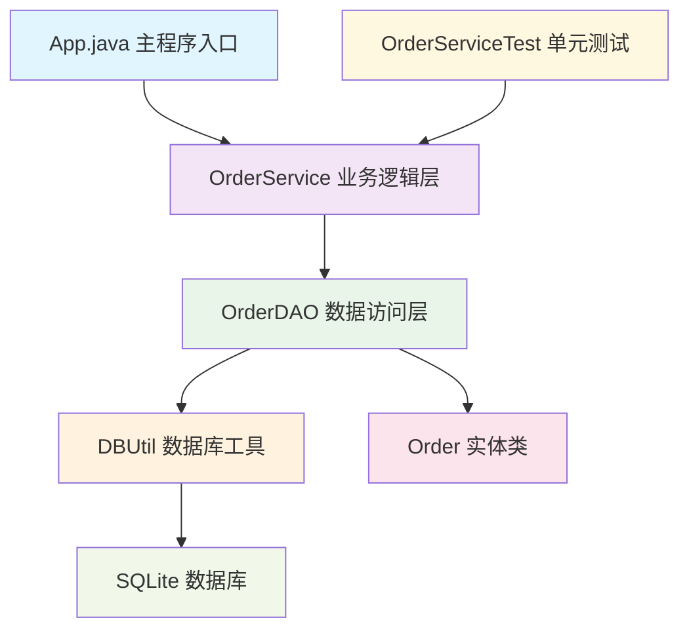
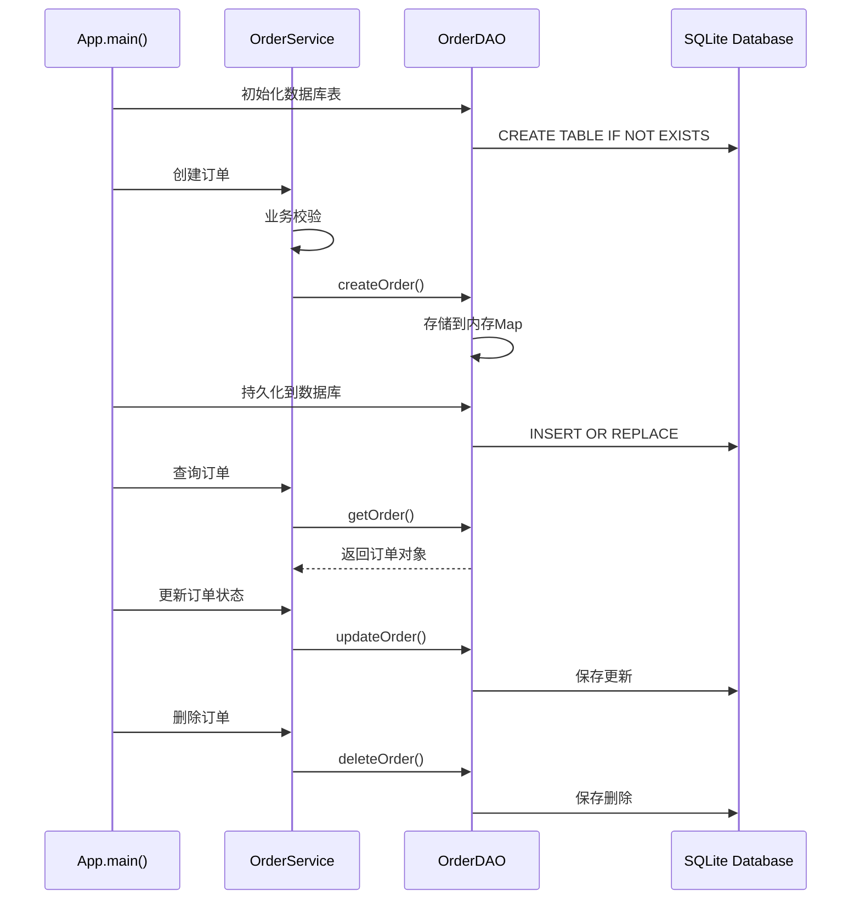

# 0713demo 项目工程解析

## 概述

这是一个基于Java和SQLite的简单订单管理系统演示项目。项目采用分层架构模式，展示了如何实现一个轻量级的订单管理应用，包含基本的CRUD操作和单元测试。

主要特点：
- 基于Java 8开发
- 使用SQLite轻量级数据库
- 采用DAO（数据访问对象）设计模式
- 包含完整的单元测试用例
- 使用Maven进行依赖管理和项目构建

## 架构设计



### 分层结构

1. **表现层（Main）**：`App.java` - 主程序入口，演示系统功能
2. **业务逻辑层（Service）**：`OrderService.java` - 处理订单相关业务逻辑
3. **数据访问层（DAO）**：`OrderDAO.java` - 封装数据库操作
4. **实体层（Entity）**：`Order.java` - 订单数据模型
5. **工具层（Util）**：`DBUtil.java` - 数据库连接管理

### 核心组件说明

#### 1. 订单实体 (Order.java)
- 包含完整的订单信息字段：订单ID、用户ID、商品ID、数量、金额、状态、时间戳等
- 支持多种构造方式，提供便捷的对象创建
- 订单状态定义：0-待支付, 1-已支付, 2-已发货, 3-已完成, 4-已取消

#### 2. 数据访问层 (OrderDAO.java)
- 实现订单的CRUD操作：创建、查询、更新、删除
- 采用内存+数据库双重存储机制，提高访问性能
- 支持批量数据持久化操作
- 自动初始化数据库表结构

#### 3. 业务逻辑层 (OrderService.java)
- 封装业务规则和验证逻辑
- 数量和金额校验
- 订单状态控制（已完成订单不可修改，已支付订单不可删除）
- 与数据访问层解耦

#### 4. 数据库工具 (DBUtil.java)
- 统一管理SQLite数据库连接
- 简化数据库操作的复杂性

### 技术栈

- **开发语言**：Java 8
- **数据库**：SQLite 3.36.0.3
- **测试框架**：JUnit 5.8.1
- **构建工具**：Maven 3.x
- **设计模式**：DAO模式、分层架构模式

### 项目运行流程



### 测试策略

项目包含完整的单元测试：
- **OrderServiceTest.java**：针对业务逻辑层的测试
- 使用Mock对象模拟数据访问层
- 覆盖正常流程和异常情况
- 验证业务规则的正确性

### 运行说明

1. **构建项目**：`mvn clean compile`
2. **运行测试**：`mvn test`
3. **打包应用**：`mvn package`
4. **运行应用**：`java -cp target/classes com.example.demo.App`

### 数据库结构

项目使用SQLite数据库，表结构如下：
```sql
CREATE TABLE order0713(
    orderId TEXT PRIMARY KEY,
    userId TEXT,
    productId TEXT,
    quantity INTEGER,
    totalAmount TEXT,
    status INTEGER,
    createTime TEXT,
    payTime TEXT,
    updateTime TEXT
);
```

这个项目是一个很好的Java基础项目示例，展示了企业级应用开发的基本架构和最佳实践。