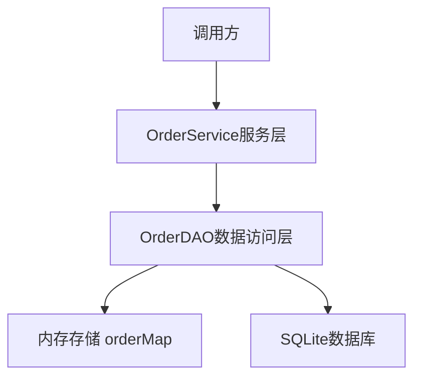
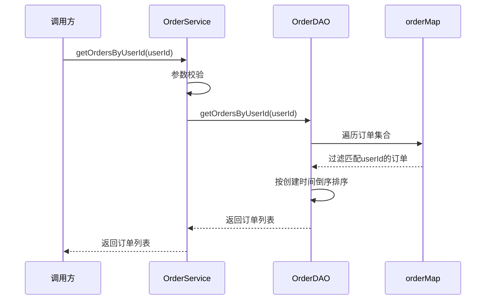

# 按用户ID查询订单列表功能设计

## 功能概述

为订单管理系统添加按用户ID查询订单列表的功能,支持用户查询属于自己的所有订单,提升系统的查询能力和用户体验。

## 需求分析

### 功能需求

- 支持通过用户ID查询该用户的所有订单
- 返回订单列表,包含订单的完整信息
- 当用户无订单时,返回空列表而非null
- 查询结果按订单创建时间倒序排列(最新的订单排在前面)

### 非功能需求

- 查询性能:支持高效的批量查询
- 数据一致性:从内存和数据库中准确查询数据
- 可扩展性:为后续添加过滤条件(如按状态筛选)预留扩展空间

## 设计方案

### 整体架构

功能采用分层架构设计,遵循现有系统的三层结构:

### 数据流程

### 核心设计

#### 数据访问层 (OrderDAO)

**方法签名**

| 方法名 | 参数 | 返回值 | 说明 |
|--------|------|--------|------|
| getOrdersByUserId | String userId | List&lt;Order&gt; | 根据用户ID查询订单列表 |

**实现逻辑**

- 遍历内存中的orderMap,筛选出userId匹配的订单
- 使用流式操作过滤和排序数据
- 按订单创建时间(createTime)降序排序
- 返回不可变列表,防止外部修改

**边界处理**

- 当userId为null或空字符串时,返回空列表
- 当没有匹配的订单时,返回空列表(非null)
- 处理createTime为null的情况,将其排在最后

#### 服务层 (OrderService)

**方法签名**

| 方法名 | 参数 | 返回值 | 说明 |
|--------|------|--------|------|
| getOrdersByUserId | String userId | List&lt;Order&gt; | 获取用户的订单列表 |

**业务规则**

- 参数校验:userId不能为null或空字符串
- 委托给DAO层执行查询操作
- 可在此层添加业务级别的过滤逻辑(如仅返回未取消的订单)
- 支持后续扩展分页、状态过滤等功能

**异常处理**

- 当userId为null或空字符串时,抛出IllegalArgumentException
- 明确的异常信息便于调用方定位问题

### 排序规则

订单列表按以下规则排序:

1. 主要排序字段:createTime(创建时间)
2. 排序方向:降序(DESC),最新的订单排在最前面
3. 空值处理:createTime为null的订单排在列表末尾

排序逻辑示例:

### 数据模型

利用现有的Order实体,无需新增字段:

| 字段 | 类型 | 说明 | 在查询中的作用 |
|------|------|------|----------------|
| orderId | String | 订单唯一标识 | 唯一标识每个订单 |
| userId | String | 用户ID | 查询过滤条件 |
| productId | String | 商品ID | 订单详情 |
| quantity | Integer | 购买数量 | 订单详情 |
| totalAmount | BigDecimal | 订单总金额 | 订单详情 |
| status | Integer | 订单状态 | 订单详情 |
| createTime | LocalDateTime | 创建时间 | 排序依据 |
| payTime | LocalDateTime | 支付时间 | 订单详情 |
| updateTime | LocalDateTime | 更新时间 | 订单详情 |

## 扩展性考虑

### 预留扩展点

1. **状态过滤**:支持查询特定状态的订单
2. **时间范围查询**:支持按创建时间范围过滤
3. **分页支持**:当订单量增大时,支持分页查询
4. **排序选项**:支持按不同字段排序(金额、状态等)

### 未来增强方向

- 添加数据库索引优化查询性能(在userId字段上建立索引)
- 支持组合查询条件(用户ID + 订单状态 + 时间范围)
- 引入缓存机制减少频繁查询的开销
- 支持返回订单统计信息(总数、总金额等)

## 测试策略

### 单元测试覆盖场景

#### DAO层测试

| 测试场景 | 输入 | 预期输出 |
|----------|------|----------|
| 查询存在订单的用户 | userId = "user001" | 返回该用户的所有订单 |
| 查询不存在订单的用户 | userId = "user999" | 返回空列表 |
| userId为null | userId = null | 返回空列表 |
| userId为空字符串 | userId = "" | 返回空列表 |
| 验证排序正确性 | 多个订单不同创建时间 | 按createTime降序排列 |
| createTime为null的订单 | 部分订单createTime为null | null值排在末尾 |

#### Service层测试

| 测试场景 | 输入 | 预期输出 |
|----------|------|----------|
| 正常查询 | userId = "user001" | 返回订单列表 |
| userId为null | userId = null | 抛出IllegalArgumentException |
| userId为空字符串 | userId = "" | 抛出IllegalArgumentException |

### 集成测试场景

- 创建多个用户的订单,验证查询隔离性
- 验证与现有CRUD操作的兼容性
- 验证数据库持久化后的查询一致性

## 实现优先级

1. **P0(核心功能)**:DAO层查询方法实现
2. **P0(核心功能)**:Service层封装和参数校验
3. **P1(质量保障)**:单元测试覆盖
4. **P2(功能完善)**:集成测试和边界场景验证

## 风险与限制

### 已知限制

- 当前基于内存查询,订单量过大时可能影响性能
- 未实现数据库直接查询,重启后需要先加载数据到内存

### 风险缓解

- 建议在订单量超过10000时考虑引入数据库查询或分页机制
- 保持DAO层接口设计的灵活性,便于后续优化存储策略
