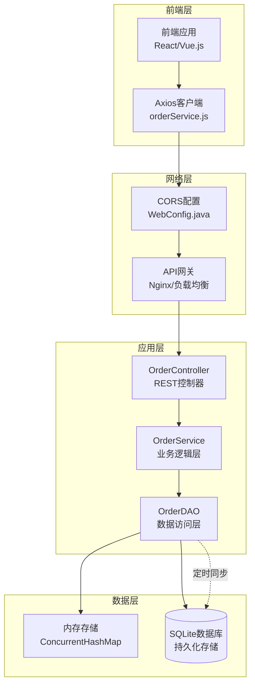
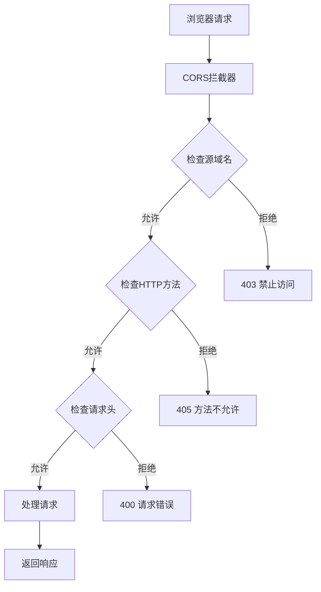
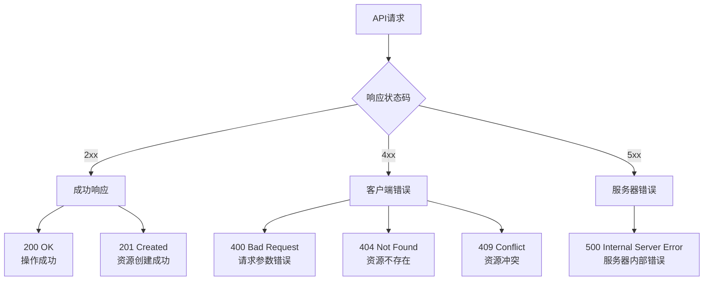
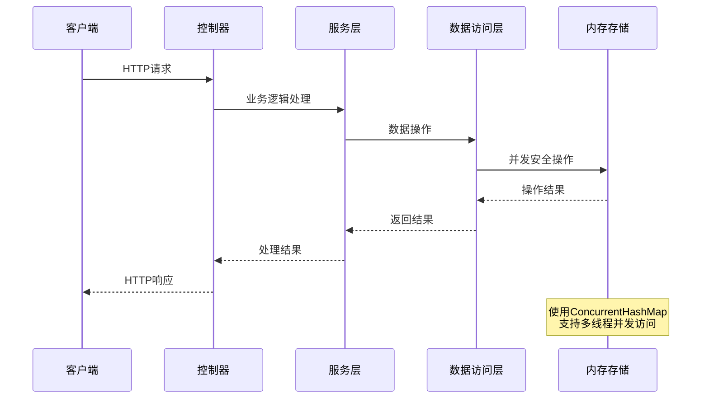

# API接口参考

<cite>
**本文档中引用的文件**
- [OrderController.java](file://src/main/java/com/example/demo/controller/OrderController.java)
- [WebConfig.java](file://src/main/java/com/example/demo/config/WebConfig.java)
- [OrderService.java](file://src/main/java/com/example/demo/service/OrderService.java)
- [OrderDAO.java](file://src/main/java/com/example/demo/dao/OrderDAO.java)
- [Order.java](file://src/main/java/com/example/demo/entity/Order.java)
- [orderService.js](file://frontend/src/services/orderService.js)
- [App.java](file://src/main/java/com/example/demo/App.java)
- [application.properties](file://src/main/resources/application.properties)
- [OrderControllerIT.java](file://src/test/java/com/example/demo/controller/OrderControllerIT.java)
</cite>

## 目录
1. [简介](#简介)
2. [系统架构概览](#系统架构概览)
3. [CORS跨域配置](#cors跨域配置)
4. [API端点详细说明](#api端点详细说明)
5. [请求响应格式规范](#请求响应格式规范)
6. [错误处理机制](#错误处理机制)
7. [使用示例](#使用示例)
8. [性能考虑](#性能考虑)
9. [故障排除指南](#故障排除指南)
10. [总结](#总结)

## 简介

本API是一个基于Spring Boot框架构建的RESTful订单管理系统，提供了完整的订单生命周期管理功能。系统采用分层架构设计，包含控制器层、服务层和数据访问层，支持完整的CRUD操作和业务规则验证。

### 主要特性
- **RESTful设计**：遵循REST架构原则，提供标准的HTTP方法接口
- **完整CRUD**：支持订单的创建、读取、更新、删除操作
- **业务规则验证**：内置订单状态管理和业务逻辑控制
- **跨域支持**：通过CORS配置支持前端跨域访问
- **健康监控**：提供系统健康检查接口

## 系统架构概览



**图表来源**
- [OrderController.java](file://src/main/java/com/example/demo/controller/OrderController.java#L18-L21)
- [WebConfig.java](file://src/main/java/com/example/demo/config/WebConfig.java#L14-L26)
- [OrderService.java](file://src/main/java/com/example/demo/service/OrderService.java#L13-L21)
- [OrderDAO.java](file://src/main/java/com/example/demo/dao/OrderDAO.java#L18-L21)

**章节来源**
- [OrderController.java](file://src/main/java/com/example/demo/controller/OrderController.java#L1-L173)
- [WebConfig.java](file://src/main/java/com/example/demo/config/WebConfig.java#L1-L28)
- [OrderService.java](file://src/main/java/com/example/demo/service/OrderService.java#L1-L114)
- [OrderDAO.java](file://src/main/java/com/example/demo/dao/OrderDAO.java#L1-L248)

## CORS跨域配置

系统通过Spring Boot的CORS配置支持跨域访问，确保前端应用能够正常访问后端API。

### 配置详情



**图表来源**
- [WebConfig.java](file://src/main/java/com/example/demo/config/WebConfig.java#L18-L24)

### CORS配置参数

| 配置项 | 值 | 说明 |
|--------|-----|------|
| 映射路径 | `/api/**` | 所有以/api开头的路径 |
| 允许源 | `*` | 允许来自任何域名的请求 |
| 允许方法 | `GET, POST, PUT, DELETE, OPTIONS` | 支持的标准HTTP方法 |
| 允许头 | `*` | 允许所有请求头 |
| 最大预检缓存时间 | `3600秒` | 预检请求缓存时间 |

**章节来源**
- [WebConfig.java](file://src/main/java/com/example/demo/config/WebConfig.java#L14-L26)

## API端点详细说明

### 1. 创建订单 - POST /api/orders

创建新的订单记录，支持批量创建和单个创建。

#### HTTP请求
- **方法**: `POST`
- **路径**: `/api/orders`
- **内容类型**: `application/json`

#### 请求头
```http
Content-Type: application/json
Accept: application/json
```

#### 请求体格式
```json
{
  "orderId": "string",
  "userId": "string",
  "productId": "string", 
  "quantity": "integer",
  "totalAmount": "decimal",
  "status": "integer",
  "description": "string",
  "createTime": "datetime",
  "payTime": "datetime",
  "updateTime": "datetime"
}
```

#### 请求参数说明

| 字段名 | 类型 | 必填 | 默认值 | 说明 |
|--------|------|------|--------|------|
| orderId | string | 是 | - | 订单唯一标识符 |
| userId | string | 是 | - | 用户ID |
| productId | string | 是 | - | 商品ID |
| quantity | integer | 是 | - | 购买数量（必须>0） |
| totalAmount | decimal | 是 | - | 订单总金额（必须>0） |
| status | integer | 否 | 0 | 订单状态(0-待支付,1-已支付,2-已发货,3-已完成,4-已取消) |
| description | string | 否 | - | 订单描述 |
| createTime | datetime | 否 | 当前时间 | 创建时间 |
| payTime | datetime | 否 | null | 支付时间 |
| updateTime | datetime | 否 | null | 更新时间 |

#### 响应码说明

| 响应码 | 状态 | 说明 |
|--------|------|------|
| 201 | Created | 订单创建成功 |
| 400 | Bad Request | 请求参数错误 |
| 409 | Conflict | 订单已存在 |
| 500 | Internal Server Error | 服务器内部错误 |

#### 成功响应示例
```json
{
  "success": true,
  "message": "订单创建成功",
  "data": {
    "orderId": "ORD-20241111-001",
    "userId": "USER-20241111-001",
    "productId": "PROD-20241111-001",
    "quantity": 2,
    "totalAmount": 318.00,
    "status": 0,
    "description": "测试订单",
    "createTime": "2024-11-11T10:30:00.000",
    "payTime": null,
    "updateTime": null
  }
}
```

#### 错误响应示例
```json
{
  "success": false,
  "message": "购买数量必须大于0"
}
```

**章节来源**
- [OrderController.java](file://src/main/java/com/example/demo/controller/OrderController.java#L35-L56)
- [OrderService.java](file://src/main/java/com/example/demo/service/OrderService.java#L28-L38)

### 2. 获取所有订单 - GET /api/orders

获取系统中的所有订单列表，按创建时间降序排列。

#### HTTP请求
- **方法**: `GET`
- **路径**: `/api/orders`
- **内容类型**: `application/json`

#### 请求头
```http
Accept: application/json
```

#### 响应码说明

| 响应码 | 状态 | 说明 |
|--------|------|------|
| 200 | OK | 获取成功 |
| 500 | Internal Server Error | 服务器内部错误 |

#### 响应体格式
```json
{
  "success": true,
  "data": [
    {
      "orderId": "ORD-20241111-001",
      "userId": "USER-20241111-001",
      "productId": "PROD-20241111-001",
      "quantity": 2,
      "totalAmount": 318.00,
      "status": 0,
      "description": "测试订单",
      "createTime": "2024-11-11T10:30:00.000",
      "payTime": null,
      "updateTime": null
    }
  ],
  "count": 1
}
```

**章节来源**
- [OrderController.java](file://src/main/java/com/example/demo/controller/OrderController.java#L61-L75)
- [OrderService.java](file://src/main/java/com/example/demo/service/OrderService.java#L111-L113)

### 3. 查询单个订单 - GET /api/orders/{orderId}

根据订单ID获取指定订单的详细信息。

#### HTTP请求
- **方法**: `GET`
- **路径**: `/api/orders/{orderId}`
- **内容类型**: `application/json`

#### 路径参数

| 参数名 | 类型 | 必填 | 说明 |
|--------|------|------|------|
| orderId | string | 是 | 订单唯一标识符 |

#### 响应码说明

| 响应码 | 状态 | 说明 |
|--------|------|------|
| 200 | OK | 订单存在且获取成功 |
| 404 | Not Found | 订单不存在 |
| 500 | Internal Server Error | 服务器内部错误 |

#### 成功响应示例
```json
{
  "success": true,
  "data": {
    "orderId": "ORD-20241111-001",
    "userId": "USER-20241111-001", 
    "productId": "PROD-20241111-001",
    "quantity": 2,
    "totalAmount": 318.00,
    "status": 0,
    "description": "测试订单",
    "createTime": "2024-11-11T10:30:00.000",
    "payTime": null,
    "updateTime": null
  }
}
```

#### 错误响应示例
```json
{
  "success": false,
  "message": "订单不存在"
}
```

**章节来源**
- [OrderController.java](file://src/main/java/com/example/demo/controller/OrderController.java#L80-L93)
- [OrderService.java](file://src/main/java/com/example/demo/service/OrderService.java#L45-L47)

### 4. 按用户ID查询订单 - GET /api/orders/user/{userId}

根据用户ID获取该用户的所有订单列表。

#### HTTP请求
- **方法**: `GET`
- **路径**: `/api/orders/user/{userId}`
- **内容类型**: `application/json`

#### 路径参数

| 参数名 | 类型 | 必填 | 说明 |
|--------|------|------|------|
| userId | string | 是 | 用户唯一标识符 |

#### 响应码说明

| 响应码 | 状态 | 说明 |
|--------|------|------|
| 200 | OK | 获取成功 |
| 400 | Bad Request | 用户ID为空 |
| 500 | Internal Server Error | 服务器内部错误 |

#### 响应体格式
```json
{
  "success": true,
  "data": [
    {
      "orderId": "ORD-20241111-001",
      "userId": "USER-20241111-001",
      "productId": "PROD-20241111-001",
      "quantity": 2,
      "totalAmount": 318.00,
      "status": 0,
      "description": "测试订单",
      "createTime": "2024-11-11T10:30:00.000",
      "payTime": null,
      "updateTime": null
    }
  ],
  "count": 1
}
```

#### 错误响应示例
```json
{
  "success": false,
  "message": "用户ID不能为空"
}
```

**章节来源**
- [OrderController.java](file://src/main/java/com/example/demo/controller/OrderController.java#L98-L112)
- [OrderService.java](file://src/main/java/com/example/demo/service/OrderService.java#L98-L105)

### 5. 更新订单 - PUT /api/orders/{orderId}

更新指定订单的信息，支持部分更新。

#### HTTP请求
- **方法**: `PUT`
- **路径**: `/api/orders/{orderId}`
- **内容类型**: `application/json`

#### 路径参数

| 参数名 | 类型 | 必填 | 说明 |
|--------|------|------|------|
| orderId | string | 是 | 订单唯一标识符 |

#### 请求头
```http
Content-Type: application/json
Accept: application/json
```

#### 请求体格式
```json
{
  "userId": "string",
  "productId": "string",
  "quantity": "integer",
  "totalAmount": "decimal",
  "status": "integer",
  "description": "string",
  "createTime": "datetime",
  "payTime": "datetime",
  "updateTime": "datetime"
}
```

#### 更新规则

| 字段 | 更新规则 | 特殊处理 |
|------|----------|----------|
| orderId | 自动设置为路径参数值 | 不可更改 |
| status | 可更新，但已完成订单不可修改 | 完成状态订单保护 |
| createTime | 自动生成 | 不可手动设置 |
| updateTime | 自动更新 | 自动设置当前时间 |
| payTime | 可更新 | 支付完成后可设置 |

#### 响应码说明

| 响应码 | 状态 | 说明 |
|--------|------|------|
| 200 | OK | 订单更新成功 |
| 404 | Not Found | 订单不存在或无法更新 |
| 400 | Bad Request | 请求参数错误 |
| 500 | Internal Server Error | 服务器内部错误 |

#### 成功响应示例
```json
{
  "success": true,
  "message": "订单更新成功",
  "data": {
    "orderId": "ORD-20241111-001",
    "userId": "USER-20241111-001",
    "productId": "PROD-20241111-002",
    "quantity": 3,
    "totalAmount": 477.00,
    "status": 1,
    "description": "更新后的测试订单",
    "createTime": "2024-11-11T10:30:00.000",
    "payTime": "2024-11-11T11:00:00.000",
    "updateTime": "2024-11-11T11:30:00.000"
  }
}
```

#### 错误响应示例
```json
{
  "success": false,
  "message": "订单不存在或无法更新"
}
```

**章节来源**
- [OrderController.java](file://src/main/java/com/example/demo/controller/OrderController.java#L117-L141)
- [OrderService.java](file://src/main/java/com/example/demo/service/OrderService.java#L63-L74)

### 6. 删除订单 - DELETE /api/orders/{orderId}

删除指定订单，支持软删除和硬删除。

#### HTTP请求
- **方法**: `DELETE`
- **路径**: `/api/orders/{orderId}`
- **内容类型**: `application/json`

#### 路径参数

| 参数名 | 类型 | 必填 | 说明 |
|--------|------|------|------|
| orderId | string | 是 | 订单唯一标识符 |

#### 删除规则

| 订单状态 | 是否可删除 | 说明 |
|----------|------------|------|
| 待支付(0) | ✓ | 可以正常删除 |
| 已支付(1) | ✗ | 已支付订单不能删除 |
| 已发货(2) | ✓ | 可以删除 |
| 已完成(3) | ✗ | 完成订单不能删除 |
| 已取消(4) | ✓ | 可以删除 |

#### 响应码说明

| 响应码 | 状态 | 说明 |
|--------|------|------|
| 200 | OK | 订单删除成功 |
| 400 | Bad Request | 订单不存在或无法删除(已支付订单不能删除) |
| 500 | Internal Server Error | 服务器内部错误 |

#### 成功响应示例
```json
{
  "success": true,
  "message": "订单删除成功"
}
```

#### 错误响应示例
```json
{
  "success": false,
  "message": "订单不存在或无法删除(已支付订单不能删除)"
}
```

**章节来源**
- [OrderController.java](file://src/main/java/com/example/demo/controller/OrderController.java#L146-L160)
- [OrderService.java](file://src/main/java/com/example/demo/service/OrderService.java#L81-L90)

### 7. 健康检查 - GET /api/orders/health

系统健康状态检查接口，用于监控服务可用性。

#### HTTP请求
- **方法**: `GET`
- **路径**: `/api/orders/health`
- **内容类型**: `application/json`

#### 响应码说明

| 响应码 | 状态 | 说明 |
|--------|------|------|
| 200 | OK | 服务运行正常 |

#### 响应体格式
```json
{
  "success": true,
  "message": "订单服务运行正常"
}
```

**章节来源**
- [OrderController.java](file://src/main/java/com/example/demo/controller/OrderController.java#L165-L171)

## 请求响应格式规范

### 统一响应格式

所有API接口都遵循统一的响应格式：

```json
{
  "success": "boolean",
  "message": "string",
  "data": "any",
  "count": "integer"
}
```

### 响应字段说明

| 字段名 | 类型 | 必填 | 说明 |
|--------|------|------|------|
| success | boolean | 是 | 操作是否成功 |
| message | string | 否 | 操作结果描述信息 |
| data | any | 否 | 实际返回的数据内容 |
| count | integer | 否 | 数据条目数量（适用于列表） |

### 状态码分类



**图表来源**
- [OrderController.java](file://src/main/java/com/example/demo/controller/OrderController.java#L38-L56)
- [OrderController.java](file://src/main/java/com/example/demo/controller/OrderController.java#L65-L75)

## 错误处理机制

### 错误类型分类

| 错误类型 | HTTP状态码 | 描述 | 示例场景 |
|----------|------------|------|----------|
| 参数验证错误 | 400 | 请求参数不符合要求 | 数量为负数、金额为零 |
| 资源不存在 | 404 | 请求的资源不存在 | 查询不存在的订单 |
| 资源冲突 | 409 | 资源已存在或状态冲突 | 创建重复订单 |
| 业务规则违反 | 400 | 违反业务规则 | 已支付订单不能删除 |
| 服务器内部错误 | 500 | 服务器处理过程中出错 | 数据库连接失败 |

### 错误响应格式

```json
{
  "success": false,
  "message": "具体的错误描述信息"
}
```

### 常见错误场景

#### 订单创建错误
```json
{
  "success": false,
  "message": "购买数量必须大于0"
}
```

#### 订单更新错误
```json
{
  "success": false,
  "message": "订单不存在或无法更新"
}
```

#### 订单删除错误
```json
{
  "success": false,
  "message": "订单不存在或无法删除(已支付订单不能删除)"
}
```

**章节来源**
- [OrderController.java](file://src/main/java/com/example/demo/controller/OrderController.java#L47-L56)
- [OrderController.java](file://src/main/java/com/example/demo/controller/OrderController.java#L131-L140)
- [OrderController.java](file://src/main/java/com/example/demo/controller/OrderController.java#L156-L159)

## 使用示例

### curl命令示例

#### 1. 创建订单
```bash
# 创建新订单
curl -X POST http://localhost:9090/api/orders \
  -H "Content-Type: application/json" \
  -d '{
    "orderId": "ORD-20241111-001",
    "userId": "USER-20241111-001",
    "productId": "PROD-20241111-001",
    "quantity": 2,
    "totalAmount": 318.00,
    "description": "测试订单"
  }'

# 响应：
# {
#   "success": true,
#   "message": "订单创建成功",
#   "data": {...}
# }
```

#### 2. 获取所有订单
```bash
# 获取所有订单列表
curl -X GET http://localhost:9090/api/orders \
  -H "Accept: application/json"
```

#### 3. 查询单个订单
```bash
# 根据订单ID查询
curl -X GET http://localhost:9090/api/orders/ORD-20241111-001 \
  -H "Accept: application/json"
```

#### 4. 按用户ID查询订单
```bash
# 根据用户ID查询订单列表
curl -X GET http://localhost:9090/api/orders/user/USER-20241111-001 \
  -H "Accept: application/json"
```

#### 5. 更新订单
```bash
# 更新订单信息
curl -X PUT http://localhost:9090/api/orders/ORD-20241111-001 \
  -H "Content-Type: application/json" \
  -d '{
    "status": 1,
    "description": "已支付订单"
  }'
```

#### 6. 删除订单
```bash
# 删除订单
curl -X DELETE http://localhost:9090/api/orders/ORD-20241111-001 \
  -H "Accept: application/json"
```

#### 7. 健康检查
```bash
# 检查服务状态
curl -X GET http://localhost:9090/api/orders/health \
  -H "Accept: application/json"
```

### JavaScript Axios调用示例

#### 1. 导入和配置
```javascript
// orderService.js
import axios from 'axios';

const API_BASE_URL = 'http://localhost:9090/api';

const api = axios.create({
  baseURL: API_BASE_URL,
  headers: {
    'Content-Type': 'application/json',
  },
});

export const orderService = {
  // 创建订单
  createOrder: (orderData) => {
    return api.post('/orders', orderData);
  },

  // 获取订单详情
  getOrder: (orderId) => {
    return api.get(`/orders/${orderId}`);
  },

  // 获取所有订单列表
  getAllOrders: () => {
    return api.get('/orders');
  },

  // 根据用户ID获取订单列表
  getOrdersByUserId: (userId) => {
    return api.get(`/orders/user/${userId}`);
  },

  // 更新订单
  updateOrder: (orderId, orderData) => {
    return api.put(`/orders/${orderId}`, orderData);
  },

  // 删除订单
  deleteOrder: (orderId) => {
    return api.delete(`/orders/${orderId}`);
  },

  // 健康检查
  healthCheck: () => {
    return api.get('/orders/health');
  },
};

export default orderService;
```

#### 2. 使用示例

```javascript
import orderService from './services/orderService';

// 创建订单示例
async function createSampleOrder() {
  try {
    const orderData = {
      orderId: `ORD-${Date.now()}`,
      userId: `USER-${Date.now()}`,
      productId: `PROD-${Date.now()}`,
      quantity: 2,
      totalAmount: 318.00,
      description: '测试订单'
    };

    const response = await orderService.createOrder(orderData);
    console.log('订单创建成功:', response.data);
  } catch (error) {
    console.error('创建订单失败:', error.response?.data || error.message);
  }
}

// 获取订单列表示例
async function fetchOrders() {
  try {
    const response = await orderService.getAllOrders();
    console.log('订单列表:', response.data.data);
    console.log('订单总数:', response.data.count);
  } catch (error) {
    console.error('获取订单列表失败:', error.response?.data || error.message);
  }
}

// 更新订单示例
async function updateOrderStatus(orderId) {
  try {
    const updateData = {
      status: 1, // 设置为已支付
      description: '已支付订单'
    };

    const response = await orderService.updateOrder(orderId, updateData);
    console.log('订单更新成功:', response.data);
  } catch (error) {
    console.error('更新订单失败:', error.response?.data || error.message);
  }
}

// 删除订单示例
async function deleteOrder(orderId) {
  try {
    const response = await orderService.deleteOrder(orderId);
    console.log('订单删除成功:', response.data);
  } catch (error) {
    console.error('删除订单失败:', error.response?.data || error.message);
  }
}

// 健康检查示例
async function checkHealth() {
  try {
    const response = await orderService.healthCheck();
    console.log('服务状态:', response.data.message);
  } catch (error) {
    console.error('健康检查失败:', error.response?.data || error.message);
  }
}
```

**章节来源**
- [orderService.js](file://frontend/src/services/orderService.js#L1-L49)
- [OrderControllerIT.java](file://src/test/java/com/example/demo/controller/OrderControllerIT.java#L35-L58)

## 性能考虑

### 数据存储优化

1. **内存优先策略**
   - 使用`ConcurrentHashMap`作为主要存储容器
   - 支持高并发读写操作
   - 内存访问速度优于磁盘I/O

2. **批量操作支持**
   - 支持批量插入和更新操作
   - 减少数据库交互次数
   - 提高大批量数据处理效率

3. **时间戳优化**
   - 使用`LocalDateTime`进行时间处理
   - 支持多种时间格式解析
   - 自动时间戳管理

### 并发控制



**图表来源**
- [OrderDAO.java](file://src/main/java/com/example/demo/dao/OrderDAO.java#L18-L21)
- [OrderController.java](file://src/main/java/com/example/demo/controller/OrderController.java#L23-L30)

### 缓存策略

1. **内存缓存**
   - 所有数据存储在内存中
   - 高速访问性能
   - 支持热数据快速检索

2. **数据库同步**
   - 定期将内存数据持久化到SQLite
   - 支持系统重启后数据恢复
   - 异步批量写入机制

## 故障排除指南

### 常见问题及解决方案

#### 1. CORS跨域问题
**症状**: 浏览器控制台显示跨域错误
**原因**: CORS配置不正确或未启用
**解决方案**: 
- 检查`WebConfig.java`中的CORS配置
- 确认前端请求的域名在允许列表中
- 验证请求方法是否在允许范围内

#### 2. 服务启动失败
**症状**: 应用无法正常启动
**原因**: 
- 端口9090被占用
- 数据库连接失败
- 配置文件错误

**解决方案**:
```bash
# 检查端口占用
netstat -an | grep 9090

# 查看应用日志
tail -f logs/app.log

# 检查配置文件
cat src/main/resources/application.properties
```

#### 3. 订单创建失败
**症状**: POST请求返回400错误
**原因**:
- 订单ID重复
- 数量或金额参数无效
- 必填字段缺失

**解决方案**:
```javascript
// 检查请求数据格式
console.log('请求数据:', JSON.stringify(orderData));

// 验证必填字段
const requiredFields = ['orderId', 'userId', 'productId', 'quantity', 'totalAmount'];
requiredFields.forEach(field => {
  if (!orderData[field]) {
    console.error(`缺少必填字段: ${field}`);
  }
});
```

#### 4. 数据一致性问题
**症状**: 内存数据与数据库不一致
**原因**: 系统异常关闭或同步失败

**解决方案**:
```bash
# 检查数据库状态
sqlite3 db/order_management.db ".tables"

# 手动触发数据同步
# 在OrderDAO中调用saveToDatabase()方法
```

### 调试工具和技巧

#### 1. 日志配置
```properties
# application.properties
logging.level.com.example.demo=DEBUG
logging.level.org.springframework.web=INFO
```

#### 2. 健康检查监控
```bash
# 定期健康检查脚本
#!/bin/bash
RESPONSE=$(curl -s -o /dev/null -w "%{http_code}" http://localhost:9090/api/orders/health)
if [ $RESPONSE -eq 200 ]; then
    echo "服务正常"
else
    echo "服务异常，状态码: $RESPONSE"
fi
```

#### 3. 性能监控
```bash
# 监控API响应时间
time curl -s -o /dev/null -w "%{time_total}" http://localhost:9090/api/orders
```

**章节来源**
- [WebConfig.java](file://src/main/java/com/example/demo/config/WebConfig.java#L14-L26)
- [App.java](file://src/main/java/com/example/demo/App.java#L17-L23)
- [OrderControllerIT.java](file://src/test/java/com/example/demo/controller/OrderControllerIT.java#L165-L175)

## 总结

本API文档详细介绍了基于Spring Boot构建的订单管理系统的RESTful接口规范。系统具有以下特点：

### 核心优势
1. **完整的CRUD功能**：支持订单的创建、读取、更新、删除操作
2. **严格的业务规则**：内置订单状态管理和业务逻辑控制
3. **良好的扩展性**：分层架构设计便于功能扩展
4. **完善的错误处理**：统一的响应格式和详细的错误信息
5. **跨域支持**：通过CORS配置支持前端跨域访问

### 技术特色
- **内存优先存储**：使用ConcurrentHashMap提供高性能访问
- **异步数据持久化**：定期将内存数据同步到SQLite数据库
- **统一响应格式**：标准化的JSON响应结构
- **全面的测试覆盖**：包含单元测试和集成测试

### 使用建议
1. **生产环境部署**：建议配置适当的日志级别和监控
2. **性能优化**：根据实际负载调整并发参数
3. **安全考虑**：在生产环境中启用HTTPS和身份验证
4. **数据备份**：定期备份SQLite数据库文件

通过本API文档，开发者可以快速理解和使用订单管理系统的各项功能，构建稳定可靠的订单管理应用。