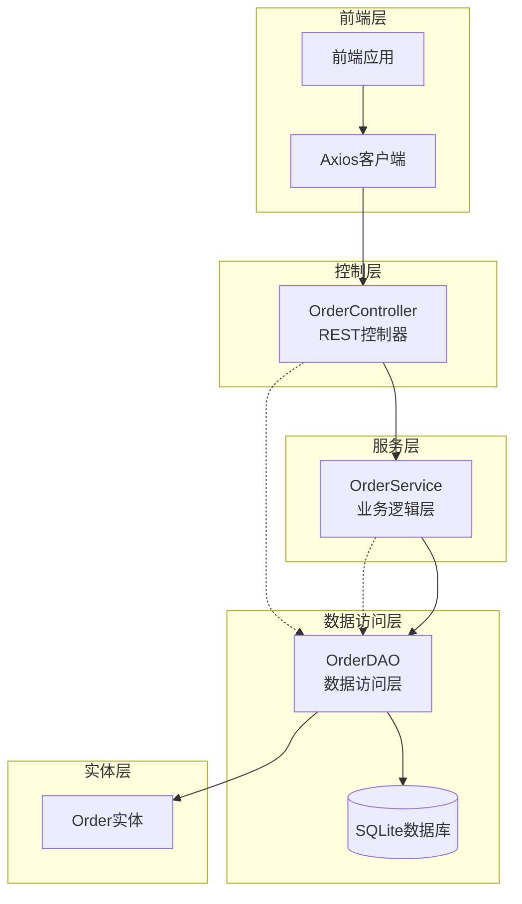
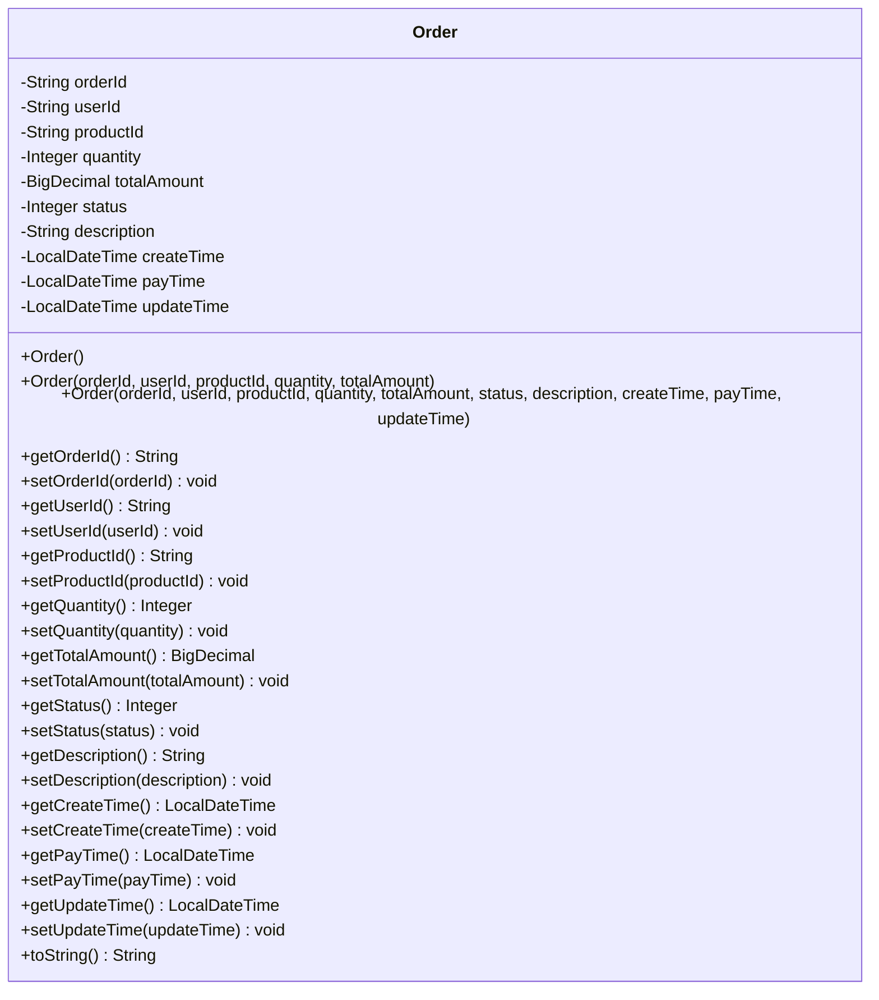
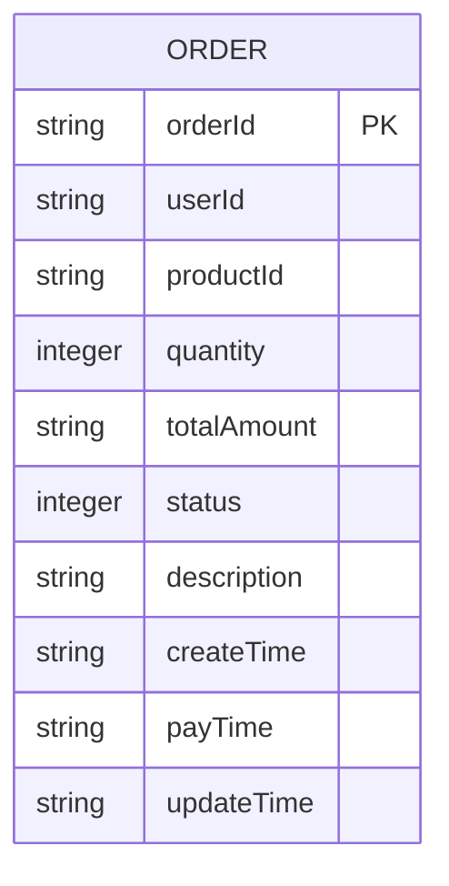
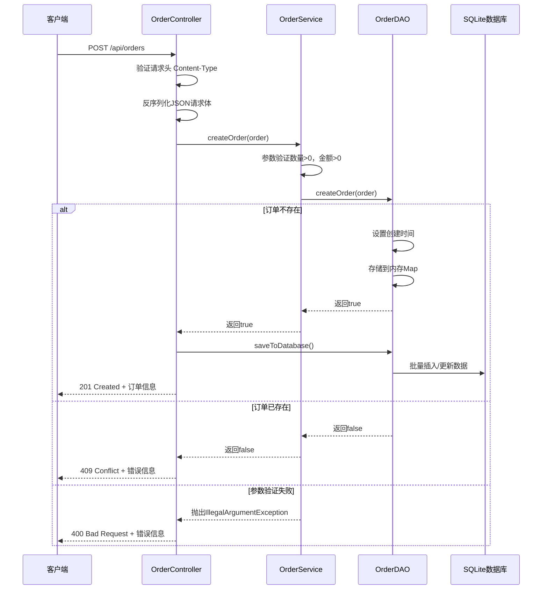

# 创建订单接口

<cite>
**本文档中引用的文件**
- [OrderController.java](file://src/main/java/com/example/demo/controller/OrderController.java)
- [OrderService.java](file://src/main/java/com/example/demo/service/OrderService.java)
- [OrderDAO.java](file://src/main/java/com/example/demo/dao/OrderDAO.java)
- [Order.java](file://src/main/java/com/example/demo/entity/Order.java)
- [orderService.js](file://frontend/src/services/orderService.js)
- [OrderControllerIT.java](file://src/test/java/com/example/demo/controller/OrderControllerIT.java)
- [OrderServiceTest.java](file://src/test/java/com/example/demo/service/OrderServiceTest.java)
- [DBUtil.java](file://src/main/java/com/example/demo/dao/DBUtil.java)
- [pom.xml](file://pom.xml)
- [application.properties](file://src/main/resources/application.properties)
</cite>

## 目录
1. [接口概述](#接口概述)
2. [技术架构](#技术架构)
3. [接口规范](#接口规范)
4. [数据模型](#数据模型)
5. [业务流程](#业务流程)
6. [错误处理](#错误处理)
7. [使用示例](#使用示例)
8. [测试验证](#测试验证)
9. [性能考虑](#性能考虑)
10. [故障排除](#故障排除)

## 接口概述

POST `/api/orders` 接口是一个RESTful API端点，用于创建新的订单记录。该接口采用标准的HTTP协议，支持JSON格式的数据交换，实现了完整的订单创建流程，包括参数验证、业务逻辑处理和数据持久化。

### 主要特性

- **幂等性保证**：通过订单ID唯一性检查防止重复创建
- **参数验证**：严格的输入参数校验机制
- **状态管理**：预设的订单状态流转控制
- **错误处理**：完善的异常捕获和错误响应机制
- **数据持久化**：基于SQLite的可靠数据存储

## 技术架构

系统采用分层架构设计，确保关注点分离和代码可维护性：



**图表来源**
- [OrderController.java](file://src/main/java/com/example/demo/controller/OrderController.java#L18-L30)
- [OrderService.java](file://src/main/java/com/example/demo/service/OrderService.java#L13-L21)
- [OrderDAO.java](file://src/main/java/com/example/demo/dao/OrderDAO.java#L18-L21)

### 架构层次说明

1. **控制层（OrderController）**：负责HTTP请求处理、响应格式化和异常转换
2. **服务层（OrderService）**：实现核心业务逻辑和参数验证
3. **数据访问层（OrderDAO）**：处理数据持久化和数据库操作
4. **实体层（Order）**：定义订单数据结构和业务规则

**章节来源**
- [OrderController.java](file://src/main/java/com/example/demo/controller/OrderController.java#L18-L30)
- [OrderService.java](file://src/main/java/com/example/demo/service/OrderService.java#L13-L21)
- [OrderDAO.java](file://src/main/java/com/example/demo/dao/OrderDAO.java#L18-L21)

## 接口规范

### 请求规范

| 属性 | 值 |
|------|-----|
| **HTTP方法** | POST |
| **URL路径** | `/api/orders` |
| **Content-Type** | `application/json` |
| **认证要求** | 否 |
| **跨域支持** | 是（允许所有源） |

### 请求体结构

| 字段名 | 类型 | 必填 | 描述 | 示例值 |
|--------|------|------|------|--------|
| `orderId` | String | 是 | 订单唯一标识符 | `"ORD-20241103-001"` |
| `userId` | String | 是 | 用户唯一标识符 | `"USER-20241103-001"` |
| `productId` | String | 是 | 商品唯一标识符 | `"PROD-20241103-001"` |
| `quantity` | Integer | 是 | 购买数量 | `2` |
| `totalAmount` | BigDecimal | 是 | 订单总金额 | `318.00` |
| `status` | Integer | 否 | 订单状态（默认0） | `0` |
| `description` | String | 否 | 订单描述信息 | `"测试订单描述"` |

### 状态码说明

| HTTP状态码 | 响应含义 | 错误原因 |
|------------|----------|----------|
| **201** | 创建成功 | 订单创建成功，返回完整订单信息 |
| **400** | 参数校验失败 | 输入参数无效或不符合业务规则 |
| **409** | 订单已存在 | 订单ID重复，无法创建新订单 |
| **500** | 服务器内部错误 | 系统异常或数据库操作失败 |

**章节来源**
- [OrderController.java](file://src/main/java/com/example/demo/controller/OrderController.java#L35-L55)

## 数据模型

### Order实体类结构



**图表来源**
- [Order.java](file://src/main/java/com/example/demo/entity/Order.java#L9-L162)

### 订单状态定义

| 状态值 | 状态名称 | 描述 |
|--------|----------|------|
| **0** | PENDING | 待支付（默认状态） |
| **1** | CONFIRMED | 已支付 |
| **2** | SHIPPED | 已发货 |
| **3** | DELIVERED | 已完成 |
| **4** | CANCELLED | 已取消 |

### 数据库表结构



**图表来源**
- [OrderDAO.java](file://src/main/java/com/example/demo/dao/OrderDAO.java#L29-L42)

**章节来源**
- [Order.java](file://src/main/java/com/example/demo/entity/Order.java#L9-L162)
- [OrderDAO.java](file://src/main/java/com/example/demo/dao/OrderDAO.java#L29-L42)

## 业务流程

### 订单创建完整流程



**图表来源**
- [OrderController.java](file://src/main/java/com/example/demo/controller/OrderController.java#L36-L55)
- [OrderService.java](file://src/main/java/com/example/demo/service/OrderService.java#L28-L37)
- [OrderDAO.java](file://src/main/java/com/example/demo/dao/OrderDAO.java#L165-L174)

### 业务规则验证

系统在订单创建过程中执行以下验证规则：

1. **数量验证**：购买数量必须大于0
2. **金额验证**：订单总金额必须大于0
3. **唯一性验证**：订单ID必须唯一
4. **状态默认值**：未指定状态时，默认为待支付（0）

**章节来源**
- [OrderController.java](file://src/main/java/com/example/demo/controller/OrderController.java#L36-L55)
- [OrderService.java](file://src/main/java/com/example/demo/service/OrderService.java#L28-L37)
- [OrderDAO.java](file://src/main/java/com/example/demo/dao/OrderDAO.java#L165-L174)

## 错误处理

### 异常类型及处理策略

| 异常类型 | HTTP状态码 | 错误消息 | 处理方式 |
|----------|------------|----------|----------|
| **IllegalArgumentException** | 400 | "购买数量必须大于0" | 参数校验失败 |
| **IllegalArgumentException** | 400 | "订单金额必须大于0" | 参数校验失败 |
| **Exception** | 400 | "创建失败: {具体错误}" | 通用参数错误 |
| **RuntimeException** | 500 | "服务器内部错误" | 系统异常 |

### 错误响应格式

```json
{
  "success": false,
  "message": "错误描述信息",
  "data": null
}
```

### 成功响应格式

```json
{
  "success": true,
  "message": "订单创建成功",
  "data": {
    "orderId": "ORD-20241103-001",
    "userId": "USER-20241103-001",
    "productId": "PROD-20241103-001",
    "quantity": 2,
    "totalAmount": 318.00,
    "status": 0,
    "description": "测试订单描述",
    "createTime": "2024-11-03T10:30:00.000",
    "payTime": null,
    "updateTime": null
  }
}
```

**章节来源**
- [OrderController.java](file://src/main/java/com/example/demo/controller/OrderController.java#L36-L55)

## 使用示例

### curl命令示例

#### 创建有效订单

```bash
curl -X POST http://localhost:9090/api/orders \
  -H "Content-Type: application/json" \
  -d '{
    "orderId": "ORD-20241103-001",
    "userId": "USER-20241103-001",
    "productId": "PROD-20241103-001",
    "quantity": 2,
    "totalAmount": 318.00,
    "description": "测试订单"
  }'
```

#### 创建数量为0的订单（失败示例）

```bash
curl -X POST http://localhost:9090/api/orders \
  -H "Content-Type: application/json" \
  -d '{
    "orderId": "ORD-20241103-002",
    "userId": "USER-20241103-002",
    "productId": "PROD-20241103-002",
    "quantity": 0,
    "totalAmount": 0.00
  }'
```

### Axios调用代码示例

#### JavaScript实现

```javascript
// 使用Axios创建订单
async function createOrder(orderData) {
  try {
    const response = await axios.post('http://localhost:9090/api/orders', orderData, {
      headers: {
        'Content-Type': 'application/json'
      }
    });
    
    if (response.data.success) {
      console.log('订单创建成功:', response.data.data);
      return response.data.data;
    } else {
      console.error('订单创建失败:', response.data.message);
      throw new Error(response.data.message);
    }
  } catch (error) {
    console.error('API调用错误:', error.response?.data || error.message);
    throw error;
  }
}

// 使用示例
const order = {
  orderId: 'ORD-20241103-003',
  userId: 'USER-20241103-003',
  productId: 'PROD-20241103-003',
  quantity: 1,
  totalAmount: 159.00,
  description: '测试订单'
};

createOrder(order)
  .then(order => console.log('订单详情:', order))
  .catch(error => console.error('创建失败:', error));
```

#### React Hook实现

```javascript
import { useState } from 'react';
import axios from 'axios';

const useCreateOrder = () => {
  const [loading, setLoading] = useState(false);
  const [error, setError] = useState(null);
  const [order, setOrder] = useState(null);

  const createOrder = async (orderData) => {
    setLoading(true);
    setError(null);
    
    try {
      const response = await axios.post('http://localhost:9090/api/orders', orderData, {
        headers: {
          'Content-Type': 'application/json'
        }
      });
      
      if (response.data.success) {
        setOrder(response.data.data);
        return response.data.data;
      } else {
        throw new Error(response.data.message);
      }
    } catch (error) {
      setError(error.message);
      throw error;
    } finally {
      setLoading(false);
    }
  };

  return { createOrder, loading, error, order };
};
```

**章节来源**
- [orderService.js](file://frontend/src/services/orderService.js#L14-L16)
- [OrderControllerIT.java](file://src/test/java/com/example/demo/controller/OrderControllerIT.java#L35-L57)

## 测试验证

### 单元测试覆盖

系统提供了全面的单元测试和集成测试，确保接口的正确性和稳定性：

#### OrderService测试案例

| 测试场景 | 预期结果 | 验证要点 |
|----------|----------|----------|
| 创建有效订单 | 返回true | 参数验证、业务逻辑 |
| 数量≤0的订单 | 抛出IllegalArgumentException | 参数校验 |
| 金额≤0的订单 | 抛出IllegalArgumentException | 参数校验 |
| 重复订单ID | 返回false | 唯一性约束 |

#### OrderController集成测试

| 测试场景 | HTTP状态码 | 验证内容 |
|----------|------------|----------|
| 有效订单创建 | 201 | 成功响应、订单信息 |
| 数量为0的订单 | 400 | 错误消息、参数验证 |
| 金额为负数的订单 | 400 | 错误消息、参数验证 |
| 订单已存在 | 409 | 冲突响应、错误信息 |

### 测试数据示例

#### 有效订单测试数据

```json
{
  "orderId": "IT-1234567890",
  "userId": "user-it-1234567890",
  "productId": "product-it-1234567890",
  "quantity": 2,
  "totalAmount": 318.00,
  "description": "集成测试订单"
}
```

#### 失败订单测试数据

```json
{
  "orderId": "IT-002",
  "userId": "user-it-002",
  "productId": "product-it-002",
  "quantity": 0,
  "totalAmount": 0.00
}
```

**章节来源**
- [OrderServiceTest.java](file://src/test/java/com/example/demo/service/OrderServiceTest.java#L40-L78)
- [OrderControllerIT.java](file://src/test/java/com/example/demo/controller/OrderControllerIT.java#L35-L82)

## 性能考虑

### 数据库优化策略

1. **批量操作**：使用PreparedStatement批量插入数据
2. **索引优化**：为常用查询字段建立索引
3. **连接池管理**：合理配置数据库连接池
4. **内存缓存**：使用ConcurrentHashMap进行内存缓存

### 并发处理

- **线程安全**：OrderDAO使用ConcurrentHashMap确保并发安全
- **乐观锁**：通过订单ID唯一性避免并发冲突
- **事务管理**：数据库层面的原子性保证

### 性能监控指标

| 指标类型 | 监控内容 | 建议阈值 |
|----------|----------|----------|
| 响应时间 | API响应延迟 | < 100ms |
| 吞吐量 | 每秒请求数 | > 1000 RPS |
| 错误率 | 失败请求比例 | < 1% |
| 资源使用 | CPU/Memory占用 | < 80% |

## 故障排除

### 常见问题及解决方案

#### 1. 订单创建失败

**症状**：收到400错误，提示参数校验失败

**可能原因**：
- 购买数量小于等于0
- 订单总金额小于等于0
- 订单ID重复

**解决步骤**：
1. 检查请求参数的有效性
2. 验证订单ID的唯一性
3. 确认数据格式正确

#### 2. 数据持久化失败

**症状**：订单创建成功但数据库中无数据

**可能原因**：
- 数据库连接异常
- 文件权限问题
- 磁盘空间不足

**解决步骤**：
1. 检查数据库连接状态
2. 验证test.db文件权限
3. 监控磁盘空间使用情况

#### 3. 前端调用失败

**症状**：CORS错误或网络请求超时

**解决步骤**：
1. 确认后端服务已启动
2. 检查防火墙设置
3. 验证网络连接

### 调试工具和技巧

#### 后端调试

```bash
# 查看应用日志
tail -f logs/application.log

# 检查数据库连接
sqlite3 test.db ".tables"

# 监控系统资源
htop
```

#### 前端调试

```javascript
// 添加调试信息
console.log('请求参数:', orderData);
console.log('响应数据:', response.data);

// 错误处理增强
axios.interceptors.response.use(
  response => response,
  error => {
    console.error('API错误:', {
      status: error.response?.status,
      data: error.response?.data,
      url: error.config.url
    });
    return Promise.reject(error);
  }
);
```

**章节来源**
- [OrderController.java](file://src/main/java/com/example/demo/controller/OrderController.java#L51-L55)
- [DBUtil.java](file://src/main/java/com/example/demo/dao/DBUtil.java#L15-L18)

## 总结

POST `/api/orders` 接口是一个功能完善、设计合理的订单创建API。它采用了分层架构设计，实现了严格的参数验证、完善的错误处理和可靠的数据持久化。通过本文档提供的详细说明和示例，开发者可以快速理解和使用该接口，同时系统提供的测试用例和故障排除指南有助于确保系统的稳定运行。

该接口的设计充分考虑了实际业务需求，具有良好的扩展性和维护性，是构建现代电商系统的重要基础组件。