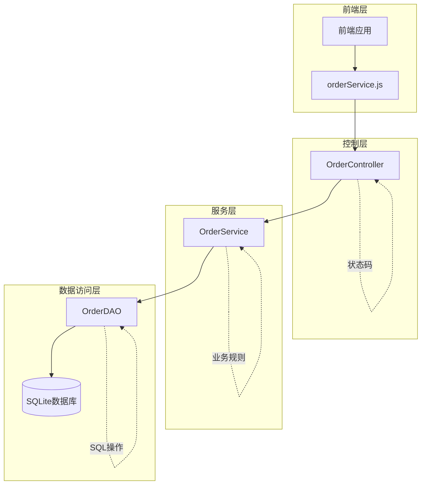
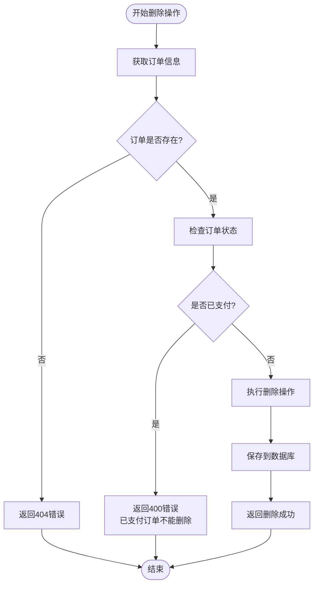
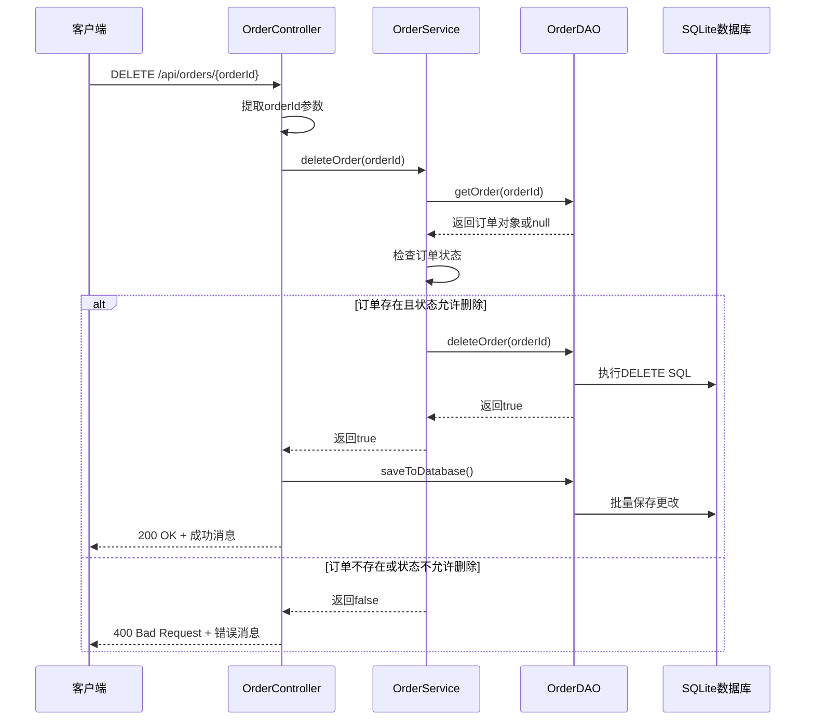
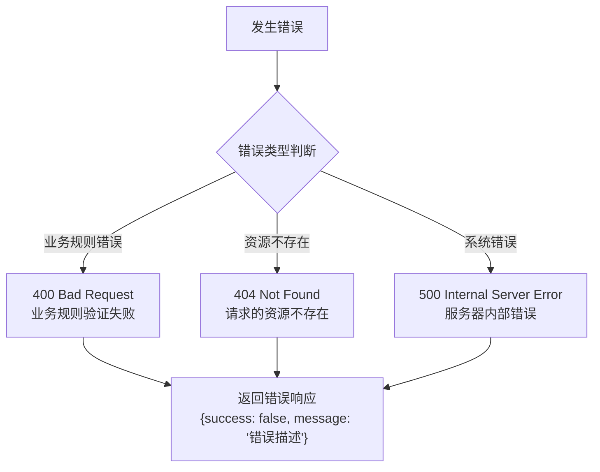
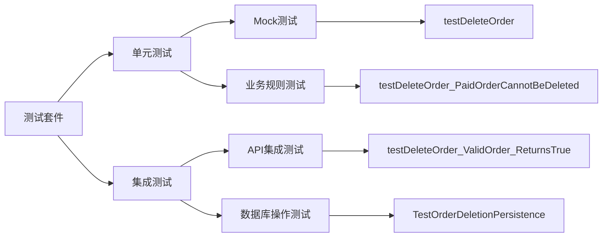

# 删除订单接口

<cite>
**本文档中引用的文件**
- [OrderController.java](file://src/main/java/com/example/demo/controller/OrderController.java)
- [OrderService.java](file://src/main/java/com/example/demo/service/OrderService.java)
- [OrderDAO.java](file://src/main/java/com/example/demo/dao/OrderDAO.java)
- [orderService.js](file://frontend/src/services/orderService.js)
- [Order.java](file://src/main/java/com/example/demo/entity/Order.java)
- [DBUtil.java](file://src/main/java/com/example/demo/dao/DBUtil.java)
- [OrderControllerIT.java](file://src/test/java/com/example/demo/controller/OrderControllerIT.java)
- [AIOrderServiceTest.java](file://src/test/java/com/example/demo/service/ai_test/AIOrderServiceTest.java)
</cite>

## 目录
1. [接口概述](#接口概述)
2. [技术架构](#技术架构)
3. [接口规范](#接口规范)
4. [业务逻辑分析](#业务逻辑分析)
5. [数据流分析](#数据流分析)
6. [错误处理机制](#错误处理机制)
7. [前端集成指南](#前端集成指南)
8. [测试用例分析](#测试用例分析)
9. [最佳实践建议](#最佳实践建议)
10. [故障排除指南](#故障排除指南)

## 接口概述

DELETE /api/orders/{orderId} 是一个RESTful API接口，用于删除指定ID的订单记录。该接口采用HTTP DELETE方法，通过路径参数传递订单ID，支持完整的订单删除功能，包括业务规则验证和数据库操作。

### 核心特性
- **幂等性保证**：支持重复删除操作的安全处理
- **业务规则验证**：防止已支付订单被删除
- **事务一致性**：确保数据库操作的原子性
- **状态反馈**：提供清晰的操作结果响应

## 技术架构



**图表来源**
- [OrderController.java](file://src/main/java/com/example/demo/controller/OrderController.java#L146-L159)
- [OrderService.java](file://src/main/java/com/example/demo/service/OrderService.java#L81-L90)
- [OrderDAO.java](file://src/main/java/com/example/demo/dao/OrderDAO.java#L206-L211)

**章节来源**
- [OrderController.java](file://src/main/java/com/example/demo/controller/OrderController.java#L146-L159)
- [OrderService.java](file://src/main/java/com/example/demo/service/OrderService.java#L81-L90)
- [OrderDAO.java](file://src/main/java/com/example/demo/dao/OrderDAO.java#L206-L211)

## 接口规范

### 请求信息

| 属性 | 值 |
|------|-----|
| **HTTP方法** | DELETE |
| **请求路径** | `/api/orders/{orderId}` |
| **路径参数** | `orderId` (String类型) |
| **内容类型** | 无（无请求体） |
| **认证要求** | 否 |

### 路径参数说明

| 参数名 | 类型 | 必填 | 描述 |
|--------|------|------|------|
| `orderId` | String | 是 | 要删除的订单唯一标识符 |

### 响应状态码

| 状态码 | 响应内容 | 描述 |
|--------|----------|------|
| **200 OK** | `{"success": true, "message": "订单删除成功"}` | 订单删除成功 |
| **400 Bad Request** | `{"success": false, "message": "订单不存在或无法删除(已支付订单不能删除)"}` | 订单不存在或违反业务规则 |
| **404 Not Found** | `{"success": false, "message": "订单不存在"}` | 订单在系统中不存在 |

### 响应体结构

```json
{
  "success": true,
  "message": "订单删除成功"
}
```

**章节来源**
- [OrderController.java](file://src/main/java/com/example/demo/controller/OrderController.java#L146-L159)

## 业务逻辑分析

### 删除规则验证

系统实现了严格的业务规则来确保数据完整性：



**图表来源**
- [OrderService.java](file://src/main/java/com/example/demo/service/OrderService.java#L81-L90)
- [OrderDAO.java](file://src/main/java/com/example/demo/dao/OrderDAO.java#L206-L211)

### 订单状态定义

| 状态值 | 状态名称 | 可删除性 | 描述 |
|--------|----------|----------|------|
| 0 | 待支付 | ✅ 可删除 | 新创建的订单，未进行支付 |
| 1 | 已支付 | ❌ 不可删除 | 完成支付流程的订单 |
| 2 | 已发货 | ✅ 可删除 | 已发货但未完成的订单 |
| 3 | 已完成 | ✅ 可删除 | 完成交易的订单 |
| 4 | 已取消 | ✅ 可删除 | 用户主动取消的订单 |

**章节来源**
- [OrderService.java](file://src/main/java/com/example/demo/service/OrderService.java#L81-L90)
- [Order.java](file://src/main/java/com/example/demo/entity/Order.java#L25-L27)

## 数据流分析

### 删除操作流程图



**图表来源**
- [OrderController.java](file://src/main/java/com/example/demo/controller/OrderController.java#L146-L159)
- [OrderService.java](file://src/main/java/com/example/demo/service/OrderService.java#L81-L90)
- [OrderDAO.java](file://src/main/java/com/example/demo/dao/OrderDAO.java#L206-L211)

### 数据库操作细节

系统使用SQLite数据库存储订单信息，DELETE操作通过以下步骤执行：

1. **订单存在性检查**：验证订单ID是否存在
2. **状态验证**：确保订单不是已支付状态
3. **物理删除**：从内存映射中移除订单记录
4. **持久化保存**：批量更新数据库

**章节来源**
- [OrderDAO.java](file://src/main/java/com/example/demo/dao/OrderDAO.java#L206-L211)
- [DBUtil.java](file://src/main/java/com/example/demo/dao/DBUtil.java#L10-L18)

## 错误处理机制

### 异常情况分类

| 错误类型 | HTTP状态码 | 错误消息 | 处理方式 |
|----------|------------|----------|----------|
| 订单不存在 | 404 | "订单不存在" | 直接返回错误 |
| 已支付订单删除 | 400 | "订单不存在或无法删除(已支付订单不能删除)" | 业务规则拒绝 |
| 数据库异常 | 500 | "数据库操作失败" | 系统级错误处理 |

### 错误处理流程



**章节来源**
- [OrderController.java](file://src/main/java/com/example/demo/controller/OrderController.java#L146-L159)

## 前端集成指南

### JavaScript API调用示例

前端通过orderService.js提供的deleteOrder方法调用此接口：

```javascript
// 基本调用方式
orderService.deleteOrder('ORDER12345')
    .then(response => {
        console.log('删除成功:', response.data.message);
        // 刷新订单列表
        refreshOrderList();
    })
    .catch(error => {
        console.error('删除失败:', error.response?.data?.message);
        // 显示错误提示
        showErrorNotification(error.response?.data?.message);
    });
```

### 前端最佳实践

1. **删除确认对话框**
```javascript
const confirmDelete = async (orderId) => {
    const confirmed = await showConfirmationDialog('确定要删除此订单吗？');
    if (confirmed) {
        try {
            await orderService.deleteOrder(orderId);
            showSuccessNotification('订单删除成功');
            refreshOrderList(); // 刷新列表
        } catch (error) {
            showErrorNotification('删除失败，请重试');
        }
    }
};
```

2. **加载状态管理**
```javascript
const handleDelete = async (orderId) => {
    setLoading(true);
    try {
        await orderService.deleteOrder(orderId);
        // 立即从UI移除，提升用户体验
        removeOrderFromUI(orderId);
    } catch (error) {
        setError(error.response?.data?.message);
    } finally {
        setLoading(false);
    }
};
```

**章节来源**
- [orderService.js](file://frontend/src/services/orderService.js#L38-L41)

## 测试用例分析

### 单元测试覆盖

系统提供了全面的单元测试来验证删除功能：

| 测试用例 | 测试场景 | 预期结果 | 测试文件 |
|----------|----------|----------|----------|
| TC007 | 删除待支付订单 | 返回true，删除成功 | AIOrderServiceTest.java |
| TC008 | 删除已支付订单 | 返回false，业务规则阻止 | AIOrderServiceTest.java |
| IT-001 | DELETE接口正常响应 | 200 OK + 成功消息 | OrderControllerIT.java |

### 集成测试验证



**图表来源**
- [AIOrderServiceTest.java](file://src/test/java/com/example/demo/service/ai_test/AIOrderServiceTest.java#L196-L217)
- [OrderControllerIT.java](file://src/test/java/com/example/demo/controller/OrderControllerIT.java#L1-L175)

**章节来源**
- [AIOrderServiceTest.java](file://src/test/java/com/example/demo/service/ai_test/AIOrderServiceTest.java#L196-L217)
- [OrderControllerIT.java](file://src/test/java/com/example/demo/controller/OrderControllerIT.java#L1-L175)

## 最佳实践建议

### 开发建议

1. **前端确认机制**
   - 在执行删除操作前显示确认对话框
   - 提供撤销操作的可能性
   - 明确告知用户删除操作的不可逆性

2. **用户体验优化**
   - 实现即时UI反馈（立即从列表中移除）
   - 提供删除进度指示器
   - 显示删除后的状态变化

3. **错误处理策略**
   - 分别处理网络错误和业务错误
   - 提供友好的错误消息
   - 实现自动重试机制（对于临时性错误）

### 安全考虑

1. **权限验证**
   - 确保只有授权用户可以删除订单
   - 实现基于角色的访问控制

2. **审计日志**
   - 记录所有删除操作
   - 包含操作时间、用户信息和订单详情

3. **数据备份**
   - 实现软删除机制作为硬删除的补充
   - 定期备份重要订单数据

## 故障排除指南

### 常见问题及解决方案

| 问题描述 | 可能原因 | 解决方案 |
|----------|----------|----------|
| 删除接口返回404 | 订单ID不存在 | 检查订单ID的有效性 |
| 删除接口返回400 | 已支付订单尝试删除 | 确认订单状态为待支付 |
| 删除操作无效果 | 数据库连接问题 | 检查数据库连接状态 |
| 响应超时 | 数据库性能问题 | 优化数据库查询和索引 |

### 调试步骤

1. **检查请求参数**
   ```bash
   curl -X DELETE http://localhost:9090/api/orders/INVALID_ID
   ```

2. **验证订单状态**
   ```bash
   curl http://localhost:9090/api/orders/ORDER12345
   ```

3. **检查数据库状态**
   ```sql
   SELECT * FROM order0713 WHERE orderId = 'ORDER12345';
   ```

### 性能监控

建议监控以下指标：
- 删除操作的平均响应时间
- 删除成功率统计
- 数据库连接池使用情况
- 内存使用情况（特别是大量订单时）

**章节来源**
- [OrderController.java](file://src/main/java/com/example/demo/controller/OrderController.java#L146-L159)
- [OrderService.java](file://src/main/java/com/example/demo/service/OrderService.java#L81-L90)