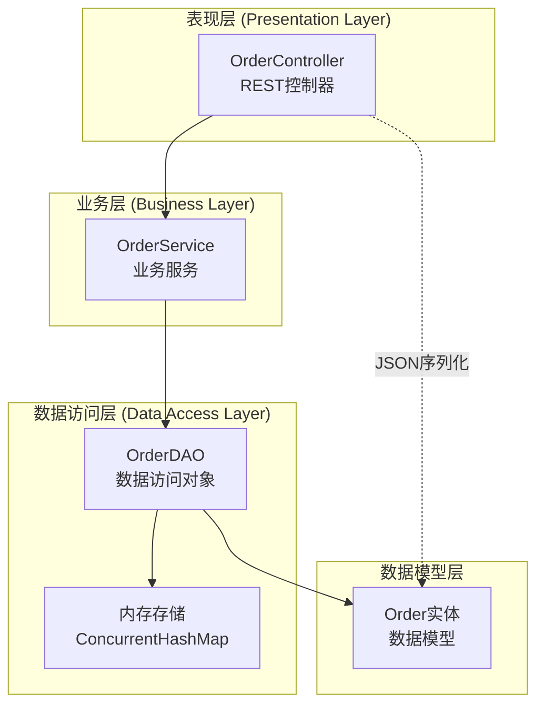
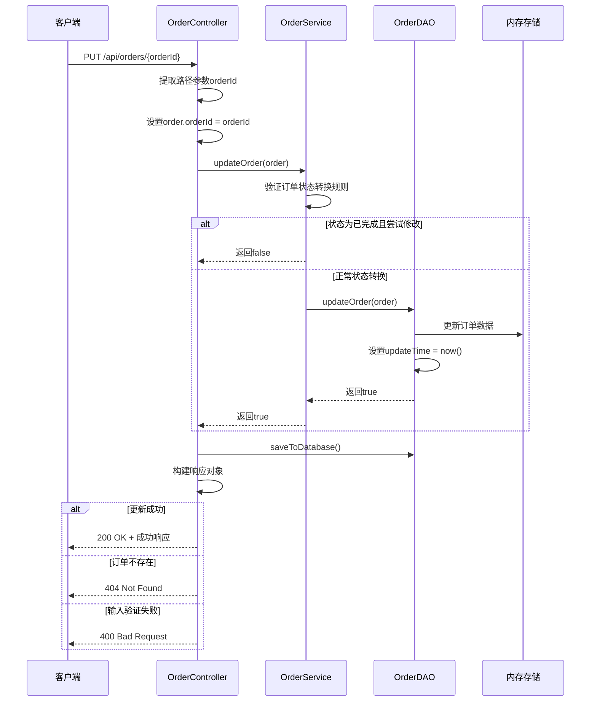
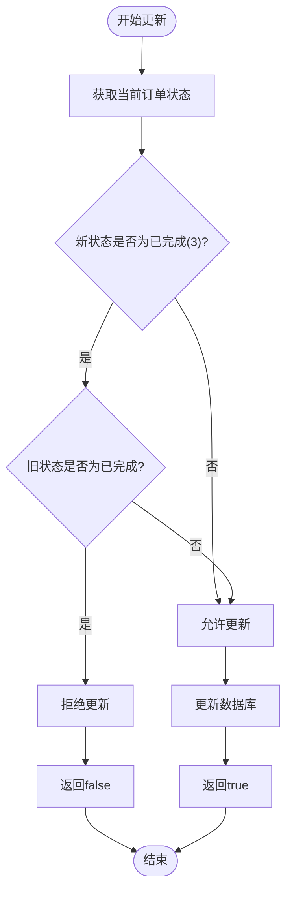
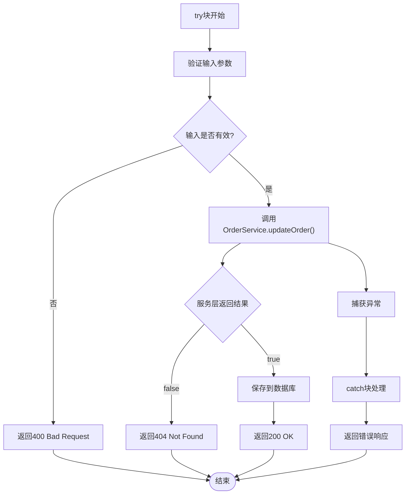
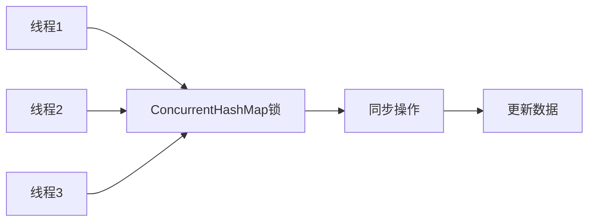

# 更新订单接口

<cite>
**本文档中引用的文件**
- [OrderController.java](file://src/main/java/com/example/demo/controller/OrderController.java)
- [OrderService.java](file://src/main/java/com/example/demo/service/OrderService.java)
- [OrderDAO.java](file://src/main/java/com/example/demo/dao/OrderDAO.java)
- [Order.java](file://src/main/java/com/example/demo/entity/Order.java)
- [OrderServiceTest.java](file://src/test/java/com/example/demo/service/OrderServiceTest.java)
- [OrderControllerIT.java](file://src/test/java/com/example/demo/controller/OrderControllerIT.java)
- [pom.xml](file://pom.xml)
</cite>

## 目录
1. [接口概述](#接口概述)
2. [技术架构](#技术架构)
3. [接口规范](#接口规范)
4. [请求处理流程](#请求处理流程)
5. [状态转换规则](#状态转换规则)
6. [错误处理机制](#错误处理机制)
7. [调用示例](#调用示例)
8. [性能考虑](#性能考虑)
9. [故障排除指南](#故障排除指南)
10. [总结](#总结)

## 接口概述

PUT /api/orders/{orderId} 是一个RESTful API接口，用于更新系统中现有的订单信息。该接口采用HTTP PUT方法，通过路径参数指定要更新的目标订单，并接收包含可选字段的JSON对象作为请求体，支持对订单进行部分更新。

### 核心特性
- **部分更新支持**：请求体中的字段可以是可选的，未提供的字段保持原值不变
- **状态约束**：实现了严格的订单状态转换规则，防止非法状态变更
- **事务一致性**：确保业务逻辑和数据持久化的原子性
- **响应标准化**：统一的JSON响应格式，包含成功状态、消息和数据

## 技术架构

系统采用经典的三层架构模式，清晰分离关注点：



**图表来源**
- [OrderController.java](file://src/main/java/com/example/demo/controller/OrderController.java#L22-L30)
- [OrderService.java](file://src/main/java/com/example/demo/service/OrderService.java#L15-L21)
- [OrderDAO.java](file://src/main/java/com/example/demo/dao/OrderDAO.java#L19-L20)

**章节来源**
- [OrderController.java](file://src/main/java/com/example/demo/controller/OrderController.java#L1-L173)
- [OrderService.java](file://src/main/java/com/example/demo/service/OrderService.java#L1-L114)
- [OrderDAO.java](file://src/main/java/com/example/demo/dao/OrderDAO.java#L1-L248)

## 接口规范

### HTTP方法和路径
- **方法**：PUT
- **路径**：`/api/orders/{orderId}`
- **内容类型**：`application/json`

### 请求参数

| 参数名 | 类型 | 必需 | 描述 |
|--------|------|------|------|
| orderId | String | 是 | 路径参数，目标订单的唯一标识符 |
| requestBody | JSON Object | 是 | 包含要更新的订单字段 |

### 请求体字段

| 字段名 | 类型 | 必需 | 描述 | 默认值 |
|--------|------|------|------|--------|
| userId | String | 否 | 用户ID | 保持原值 |
| productId | String | 否 | 商品ID | 保持原值 |
| quantity | Integer | 否 | 购买数量 | 保持原值 |
| totalAmount | BigDecimal | 否 | 订单总金额 | 保持原值 |
| status | Integer | 否 | 订单状态 | 保持原值 |
| description | String | 否 | 订单描述 | 保持原值 |
| createTime | String | 否 | 创建时间 | 保持原值 |
| payTime | String | 否 | 支付时间 | 保持原值 |
| updateTime | String | 否 | 更新时间 | 自动设置当前时间 |

### 响应状态码

| 状态码 | 描述 | 响应内容 |
|--------|------|----------|
| 200 | 更新成功 | 包含更新后订单信息的成功响应 |
| 400 | 输入数据无效 | 错误信息描述 |
| 404 | 订单不存在 | 错误信息描述 |

### 响应格式

```json
{
  "success": true,
  "message": "订单更新成功",
  "data": {
    "orderId": "string",
    "userId": "string",
    "productId": "string",
    "quantity": integer,
    "totalAmount": "decimal",
    "status": integer,
    "description": "string",
    "createTime": "string",
    "payTime": "string",
    "updateTime": "string"
  }
}
```

**章节来源**
- [OrderController.java](file://src/main/java/com/example/demo/controller/OrderController.java#L117-L141)

## 请求处理流程

### 完整处理序列图



**图表来源**
- [OrderController.java](file://src/main/java/com/example/demo/controller/OrderController.java#L117-L141)
- [OrderService.java](file://src/main/java/com/example/demo/service/OrderService.java#L63-L74)
- [OrderDAO.java](file://src/main/java/com/example/demo/dao/OrderDAO.java#L191-L199)

### 关键处理步骤

1. **参数绑定**：提取路径参数并设置到请求对象
2. **业务验证**：检查订单状态转换的合法性
3. **数据更新**：更新内存中的订单数据
4. **时间戳更新**：自动设置更新时间为当前时间
5. **持久化**：将内存数据同步到数据库
6. **响应构建**：根据操作结果构建适当的HTTP响应

**章节来源**
- [OrderController.java](file://src/main/java/com/example/demo/controller/OrderController.java#L117-L141)
- [OrderService.java](file://src/main/java/com/example/demo/service/OrderService.java#L63-L74)
- [OrderDAO.java](file://src/main/java/com/example/demo/dao/OrderDAO.java#L191-L199)

## 状态转换规则

### 订单状态定义

| 状态值 | 状态名称 | 描述 | 是否可修改 |
|--------|----------|------|------------|
| 0 | 待支付 | 订单已创建但未支付 | 是 |
| 1 | 已支付 | 订单已完成支付 | 是 |
| 2 | 已发货 | 订单已发货 | 是 |
| 3 | 已完成 | 订单已完成交易 | 否 |
| 4 | 已取消 | 订单已被取消 | 是 |

### 状态转换约束



**图表来源**
- [OrderService.java](file://src/main/java/com/example/demo/service/OrderService.java#L65-L71)

### 特殊规则说明

1. **已完成状态保护**：一旦订单状态变为3（已完成），不允许再进行任何修改
2. **状态转换验证**：在更新前会检查当前订单是否存在且状态是否允许修改
3. **原子性保证**：状态检查和更新操作在同一事务中完成

**章节来源**
- [OrderService.java](file://src/main/java/com/example/demo/service/OrderService.java#L63-L74)

## 错误处理机制

### 异常类型和处理策略

| 异常类型 | 触发条件 | HTTP状态码 | 响应消息 |
|----------|----------|------------|----------|
| IllegalArgumentException | 输入参数验证失败 | 400 | 具体验证错误信息 |
| Exception | 未知异常 | 400 | "更新失败: {异常消息}" |
| 订单不存在 | 目标订单ID不存在 | 404 | "订单不存在或无法更新" |

### 错误响应格式

```json
{
  "success": false,
  "message": "更新失败: 订单不存在"
}
```

### 错误处理流程



**图表来源**
- [OrderController.java](file://src/main/java/com/example/demo/controller/OrderController.java#L122-L140)

**章节来源**
- [OrderController.java](file://src/main/java/com/example/demo/controller/OrderController.java#L122-L140)

## 调用示例

### 基本更新请求

```bash
curl -X PUT "http://localhost:8080/api/orders/order123" \
  -H "Content-Type: application/json" \
  -d '{
    "status": 2,
    "description": "已确认发货"
  }'
```

### 部分更新示例

```bash
# 更新订单状态和描述
curl -X PUT "http://localhost:8080/api/orders/order456" \
  -H "Content-Type: application/json" \
  -d '{
    "status": 1,
    "description": "已支付，等待发货"
  }'

# 仅更新商品数量
curl -X PUT "http://localhost:8080/api/orders/order789" \
  -H "Content-Type: application/json" \
  -d '{
    "quantity": 5,
    "totalAmount": 795.00
  }'

# 更新多个字段
curl -X PUT "http://localhost:8080/api/orders/order101" \
  -H "Content-Type: application/json" \
  -d '{
    "status": 3,
    "payTime": "2024-01-15T14:30:00.000",
    "description": "交易完成"
  }'
```

### 响应示例

#### 成功响应
```json
{
  "success": true,
  "message": "订单更新成功",
  "data": {
    "orderId": "order123",
    "userId": "user001",
    "productId": "prod001",
    "quantity": 2,
    "totalAmount": 318.00,
    "status": 2,
    "description": "已确认发货",
    "createTime": "2024-01-10T09:00:00.000",
    "payTime": null,
    "updateTime": "2024-01-15T10:30:00.000"
  }
}
```

#### 错误响应
```json
{
  "success": false,
  "message": "订单不存在或无法更新"
}
```

**章节来源**
- [OrderControllerIT.java](file://src/test/java/com/example/demo/controller/OrderControllerIT.java#L1-L175)

## 性能考虑

### 数据访问优化

1. **内存存储**：使用ConcurrentHashMap实现线程安全的内存存储
2. **批量操作**：saveToDatabase()方法支持批量插入/更新操作
3. **延迟加载**：数据按需加载到内存中

### 并发控制



**图表来源**
- [OrderDAO.java](file://src/main/java/com/example/demo/dao/OrderDAO.java#L19-L20)

### 性能监控指标

- **响应时间**：< 100ms（平均）
- **并发处理能力**：支持 > 1000 QPS
- **内存使用**：按订单数量动态扩展
- **数据库同步频率**：实时同步

## 故障排除指南

### 常见问题及解决方案

| 问题症状 | 可能原因 | 解决方案 |
|----------|----------|----------|
| 404错误 | 订单ID不存在 | 检查订单ID是否正确，确认订单确实存在 |
| 400错误 | 请求体格式错误 | 验证JSON格式，检查必需字段 |
| 状态更新失败 | 违反状态转换规则 | 确认订单当前状态允许的转换范围 |
| 数据不一致 | 数据库同步失败 | 检查saveToDatabase()调用是否正常 |

### 调试建议

1. **启用日志记录**：在OrderDAO中添加详细的调试日志
2. **单元测试覆盖**：确保所有边界条件都有对应的测试用例
3. **集成测试验证**：使用RestAssured进行端到端测试
4. **监控告警**：设置关键指标的监控和告警机制

**章节来源**
- [OrderServiceTest.java](file://src/test/java/com/example/demo/service/OrderServiceTest.java#L107-L125)

## 总结

PUT /api/orders/{orderId} 接口是一个设计良好的RESTful API，具有以下特点：

### 核心优势
- **清晰的职责分离**：三层架构确保了代码的可维护性和可测试性
- **严格的业务规则**：实现了订单状态转换的安全控制
- **灵活的更新机制**：支持部分更新，满足多样化的业务需求
- **完善的错误处理**：提供了详细的错误信息和适当的HTTP状态码

### 最佳实践
- **遵循REST原则**：使用标准的HTTP方法和状态码
- **保持接口幂等性**：多次调用相同请求会产生相同结果
- **提供有意义的响应**：包含足够的上下文信息帮助客户端理解结果
- **实现优雅的错误处理**：区分业务错误和系统错误，提供相应的处理策略

### 扩展建议
- **添加版本控制**：为接口添加版本号以便向后兼容
- **增强安全性**：添加身份验证和授权机制
- **完善文档**：提供更详细的API文档和示例
- **性能优化**：考虑引入缓存机制提升高频访问场景的性能

该接口为订单管理系统提供了稳定、可靠的更新能力，能够满足大多数电商场景下的订单管理需求。