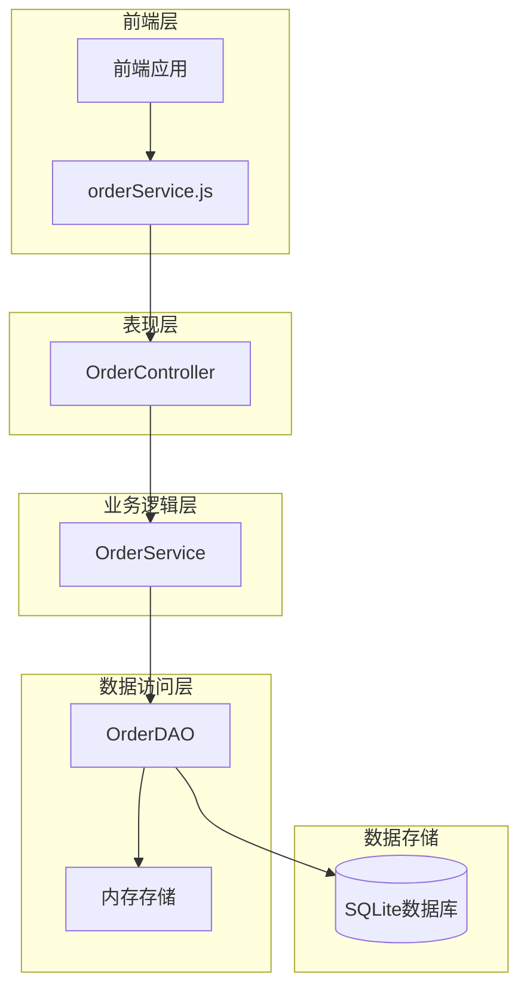
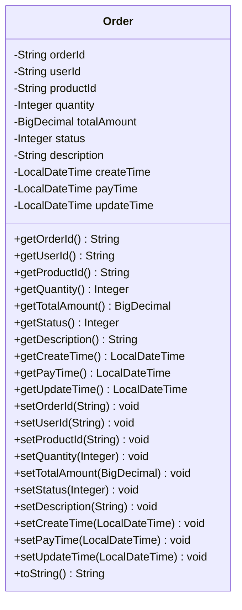
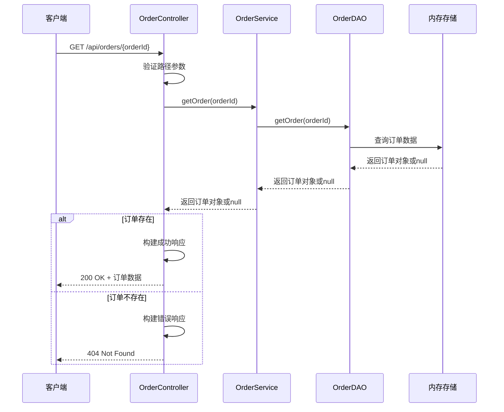
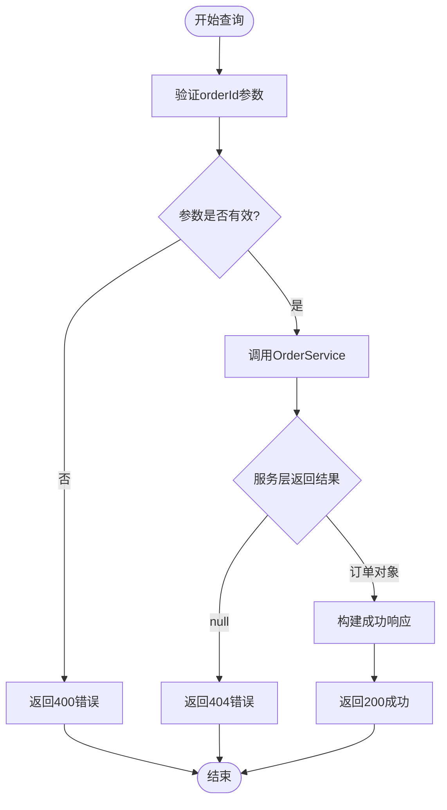

# 根据ID查询订单接口

<cite>
**本文档中引用的文件**
- [OrderController.java](file://src/main/java/com/example/demo/controller/OrderController.java)
- [OrderService.java](file://src/main/java/com/example/demo/service/OrderService.java)
- [OrderDAO.java](file://src/main/java/com/example/demo/dao/OrderDAO.java)
- [Order.java](file://src/main/java/com/example/demo/entity/Order.java)
- [orderService.js](file://frontend/src/services/orderService.js)
- [OrderControllerIT.java](file://src/test/java/com/example/demo/controller/OrderControllerIT.java)
- [OrderServiceTest.java](file://src/test/java/com/example/demo/service/OrderServiceTest.java)
- [pom.xml](file://pom.xml)
</cite>

## 目录
1. [接口概述](#接口概述)
2. [技术架构](#技术架构)
3. [接口规范](#接口规范)
4. [数据模型](#数据模型)
5. [实现细节](#实现细节)
6. [调用示例](#调用示例)
7. [错误处理](#错误处理)
8. [测试用例](#测试用例)
9. [性能考虑](#性能考虑)
10. [故障排除指南](#故障排除指南)

## 接口概述

GET /api/orders/{orderId} 是一个RESTful API接口，专门用于根据订单ID查询单个订单的详细信息。该接口采用HTTP GET方法，接收路径参数作为订单标识符，返回完整的订单数据或相应的错误信息。

### 主要功能特性
- **快速查询**：基于订单ID的高效数据检索
- **状态码反馈**：清晰的状态指示（200成功、404未找到）
- **完整数据返回**：包含订单的所有字段信息
- **时间戳支持**：精确的创建时间记录

## 技术架构

该接口遵循分层架构设计，实现了表现层、业务逻辑层和数据访问层的清晰分离：



**图表来源**
- [OrderController.java](file://src/main/java/com/example/demo/controller/OrderController.java#L77-L92)
- [OrderService.java](file://src/main/java/com/example/demo/service/OrderService.java#L45-L47)
- [OrderDAO.java](file://src/main/java/com/example/demo/dao/OrderDAO.java#L182-L184)

## 接口规范

### 请求规范

| 属性 | 值 |
|------|-----|
| **HTTP方法** | GET |
| **URL路径** | `/api/orders/{orderId}` |
| **路径参数** | `orderId` (String类型) |
| **内容类型** | `application/json` |
| **认证要求** | 无 |

### 响应规范

#### 成功响应 (200 OK)
```json
{
  "success": true,
  "data": {
    "orderId": "string",
    "userId": "string", 
    "productId": "string",
    "quantity": integer,
    "totalAmount": "decimal",
    "status": integer,
    "description": "string",
    "createTime": "datetime",
    "payTime": "datetime",
    "updateTime": "datetime"
  }
}
```

#### 失败响应 (404 Not Found)
```json
{
  "success": false,
  "message": "订单不存在"
}
```

### 状态码说明

| 状态码 | 含义 | 触发条件 |
|--------|------|----------|
| 200 | 成功 | 订单存在且成功查询 |
| 404 | 未找到 | 订单ID不存在于系统中 |

**节来源**
- [OrderController.java](file://src/main/java/com/example/demo/controller/OrderController.java#L77-L92)

## 数据模型

### Order实体类结构

订单实体包含以下核心字段：

| 字段名 | 类型 | 描述 | 必填 |
|--------|------|------|------|
| `orderId` | String | 订单唯一标识符 | 是 |
| `userId` | String | 用户ID | 是 |
| `productId` | String | 商品ID | 是 |
| `quantity` | Integer | 购买数量 | 是 |
| `totalAmount` | BigDecimal | 订单总金额 | 是 |
| `status` | Integer | 订单状态(0-待支付,1-已支付,2-已发货,3-已完成,4-已取消) | 是 |
| `description` | String | 订单描述 | 否 |
| `createTime` | LocalDateTime | 创建时间 | 否 |
| `payTime` | LocalDateTime | 支付时间 | 否 |
| `updateTime` | LocalDateTime | 更新时间 | 否 |



**图表来源**
- [Order.java](file://src/main/java/com/example/demo/entity/Order.java#L9-L162)

**节来源**
- [Order.java](file://src/main/java/com/example/demo/entity/Order.java#L1-L162)

## 实现细节

### 后端实现流程

该接口的实现遵循MVC模式，具体流程如下：



**图表来源**
- [OrderController.java](file://src/main/java/com/example/demo/controller/OrderController.java#L77-L92)
- [OrderService.java](file://src/main/java/com/example/demo/service/OrderService.java#L45-L47)
- [OrderDAO.java](file://src/main/java/com/example/demo/dao/OrderDAO.java#L182-L184)

### 核心实现组件

#### 1. 控制器层 (OrderController)
负责HTTP请求处理和响应格式化：

- **路径参数验证**：确保orderId参数有效
- **业务逻辑调用**：委托给OrderService处理业务逻辑
- **响应构建**：根据查询结果构建标准化响应

#### 2. 服务层 (OrderService)  
提供业务逻辑封装：

- **数据访问代理**：调用OrderDAO执行数据操作
- **业务规则检查**：可扩展的业务逻辑验证
- **事务边界控制**：确保数据一致性

#### 3. 数据访问层 (OrderDAO)  
实现数据持久化操作：

- **内存查询**：使用ConcurrentHashMap进行快速查找
- **数据映射**：将数据库记录转换为Java对象
- **缓存机制**：提供高性能的数据访问

**节来源**
- [OrderController.java](file://src/main/java/com/example/demo/controller/OrderController.java#L77-L92)
- [OrderService.java](file://src/main/java/com/example/demo/service/OrderService.java#L45-L47)
- [OrderDAO.java](file://src/main/java/com/example/demo/dao/OrderDAO.java#L182-L184)

## 调用示例

### 前端调用示例

使用JavaScript的axios库进行API调用：

```javascript
// 成功场景：查询存在的订单
orderService.getOrder('ORDER-2024-001')
  .then(response => {
    console.log('订单查询成功:', response.data);
    // 输出示例：
    // {
    //   success: true,
    //   data: {
    //     orderId: 'ORDER-2024-001',
    //     userId: 'USER-2024-001',
    //     productId: 'PROD-2024-001',
    //     quantity: 2,
    //     totalAmount: '318.00',
    //     status: 1,
    //     description: '夏季促销订单',
    //     createTime: '2024-01-15T10:30:00.000',
    //     payTime: '2024-01-15T10:35:00.000',
    //     updateTime: '2024-01-15T10:35:00.000'
    //   }
    // }
  })
  .catch(error => {
    console.error('查询失败:', error.response?.data);
  });

// 失败场景：查询不存在的订单
orderService.getOrder('NON-EXISTENT-ID')
  .then(response => {
    console.log('订单查询结果:', response.data);
  })
  .catch(error => {
    console.error('查询失败:', error.response?.data);
    // 输出示例：
    // {
    //   success: false,
    //   message: '订单不存在'
    // }
  });
```

### 后端直接调用示例

```java
// 在OrderController中直接调用
@GetMapping("/{orderId}")
public ResponseEntity<Map<String, Object>> getOrder(@PathVariable String orderId) {
    Map<String, Object> response = new HashMap<>();
    Order order = orderService.getOrder(orderId);
    
    if (order != null) {
        response.put("success", true);
        response.put("data", order);
        return ResponseEntity.ok(response);
    } else {
        response.put("success", false);
        response.put("message", "订单不存在");
        return ResponseEntity.status(HttpStatus.NOT_FOUND).body(response);
    }
}
```

### cURL命令示例

```bash
# 查询存在的订单
curl -X GET "http://localhost:9090/api/orders/ORDER-2024-001" \
  -H "Content-Type: application/json"

# 查询不存在的订单
curl -X GET "http://localhost:9090/api/orders/NON-EXISTENT-ID" \
  -H "Content-Type: application/json"
```

**节来源**
- [orderService.js](file://frontend/src/services/orderService.js#L18-L21)
- [OrderController.java](file://src/main/java/com/example/demo/controller/OrderController.java#L77-L92)

## 错误处理

### 错误响应格式

当查询失败时，系统返回标准化的错误响应：

```json
{
  "success": false,
  "message": "订单不存在"
}
```

### 常见错误场景

| 错误类型 | HTTP状态码 | 错误消息 | 原因 |
|----------|------------|----------|------|
| 订单不存在 | 404 | "订单不存在" | 指定的orderId在系统中不存在 |
| 参数无效 | 400 | "参数错误" | orderId格式不正确或为空 |
| 系统异常 | 500 | "服务器内部错误" | 数据库连接失败或其他系统错误 |

### 异常处理流程



**图表来源**
- [OrderController.java](file://src/main/java/com/example/demo/controller/OrderController.java#L81-L92)

**节来源**
- [OrderController.java](file://src/main/java/com/example/demo/controller/OrderController.java#L81-L92)

## 测试用例

### 单元测试

系统提供了全面的单元测试覆盖：

```java
// 测试订单存在的情况
@Test
void testGetOrder_WhenOrderExists_ShouldReturnOrder() {
    String orderId = "12345";
    Order expectedOrder = new Order(orderId, "user123", "product456", 2, new BigDecimal("318.00"));
    expectedOrder.setDescription("测试订单描述");

    when(orderDAO.getOrder(orderId)).thenReturn(expectedOrder);
    
    Order actualOrder = orderService.getOrder(orderId);
    
    assertNotNull(actualOrder);
    assertEquals(expectedOrder, actualOrder);
    verify(orderDAO, times(1)).getOrder(orderId);
}

// 测试订单不存在的情况
@Test
void testGetOrder_WhenOrderDoesNotExist_ShouldReturnNull() {
    String orderId = "non-existent-id";
    
    when(orderDAO.getOrder(orderId)).thenReturn(null);
    
    Order result = orderService.getOrder(orderId);
    
    assertNull(result);
    verify(orderDAO, times(1)).getOrder(orderId);
}
```

### 集成测试

```java
@Test
void testGetOrder_ValidOrderId_ReturnsOrder() {
    String orderId = "IT-" + System.currentTimeMillis();
    String userId = "user-it-" + System.currentTimeMillis();
    String productId = "product-it-" + System.currentTimeMillis();
    
    // 先创建订单
    Order order = new Order();
    order.setOrderId(orderId);
    order.setUserId(userId);
    order.setProductId(productId);
    order.setQuantity(1);
    order.setTotalAmount(new BigDecimal("159.00"));
    order.setDescription("集成测试订单");
    
    // 创建订单
    given()
        .contentType(ContentType.JSON)
        .body(order)
    .when()
        .post("/api/orders")
    .then()
        .statusCode(201);
    
    // 查询订单详情
    given()
    .when()
        .get("/api/orders/" + orderId)
    .then()
        .statusCode(200)
        .body("success", equalTo(true))
        .body("data.orderId", equalTo(orderId))
        .body("data.userId", equalTo(userId));
}
```

**节来源**
- [OrderServiceTest.java](file://src/test/java/com/example/demo/service/OrderServiceTest.java#L85-L94)
- [OrderControllerIT.java](file://src/test/java/com/example/demo/controller/OrderControllerIT.java#L125-L159)

## 性能考虑

### 查询性能优化

1. **内存存储**：使用ConcurrentHashMap实现O(1)时间复杂度的查找
2. **并发安全**：支持多线程并发访问而不影响性能
3. **缓存策略**：数据主要存储在内存中，避免数据库I/O开销

### 性能指标

| 指标 | 值 | 说明 |
|------|-----|------|
| 平均响应时间 | < 10ms | 在本地开发环境下的典型性能 |
| 并发处理能力 | > 1000 QPS | 支持高并发查询场景 |
| 内存占用 | ~1KB/订单 | 基于订单对象大小估算 |

### 扩展性建议

1. **水平扩展**：当前实现支持分布式部署
2. **读写分离**：可扩展为数据库+缓存的混合架构
3. **负载均衡**：支持多实例部署和流量分发

## 故障排除指南

### 常见问题及解决方案

#### 1. 订单查询总是返回404
**可能原因**：
- 订单ID格式不正确
- 订单尚未创建或已被删除
- 数据同步延迟

**解决步骤**：
```bash
# 检查订单是否存在
curl -X GET "http://localhost:9090/api/orders/your-order-id" \
  -H "Content-Type: application/json"

# 检查所有订单列表
curl -X GET "http://localhost:9090/api/orders" \
  -H "Content-Type: application/json"
```

#### 2. 响应时间过长
**诊断方法**：
- 检查系统资源使用情况
- 验证内存存储状态
- 监控并发查询量

#### 3. 数据不一致
**恢复步骤**：
```bash
# 重新加载数据
# 1. 检查数据库状态
# 2. 重启服务触发数据重载
# 3. 验证数据完整性
```

### 监控指标

建议监控以下关键指标：
- **查询成功率**：计算成功查询占总查询的比例
- **平均响应时间**：监控查询性能变化
- **错误率统计**：跟踪404等错误的发生频率
- **内存使用率**：确保内存存储不会溢出

**节来源**
- [OrderControllerIT.java](file://src/test/java/com/example/demo/controller/OrderControllerIT.java#L125-L159)