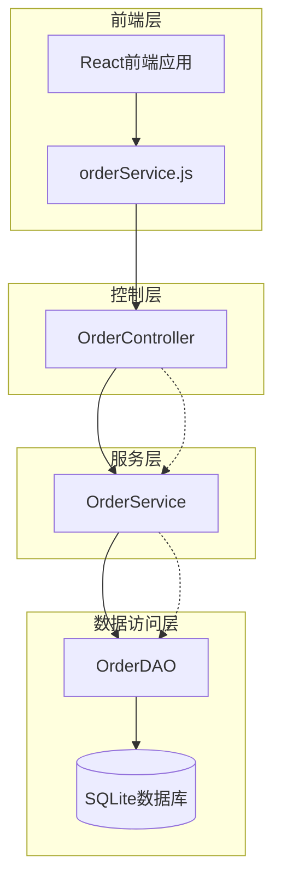
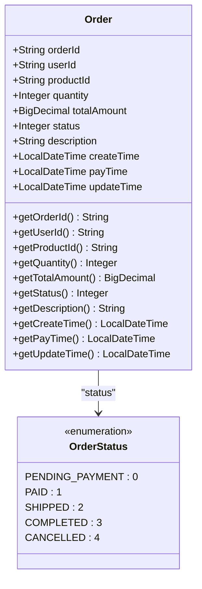
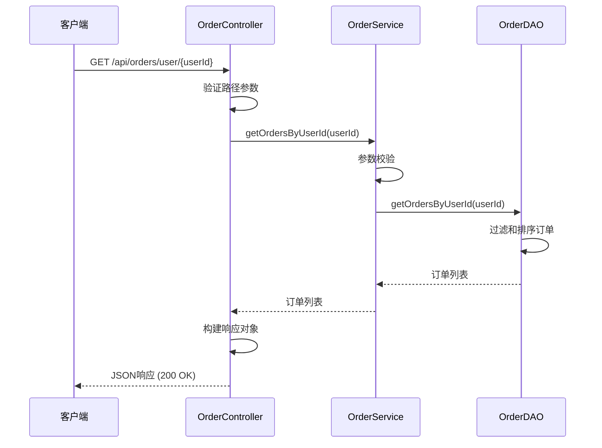
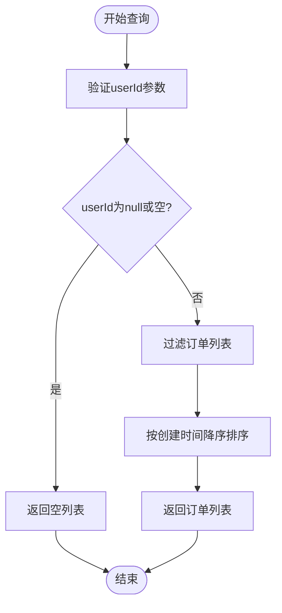
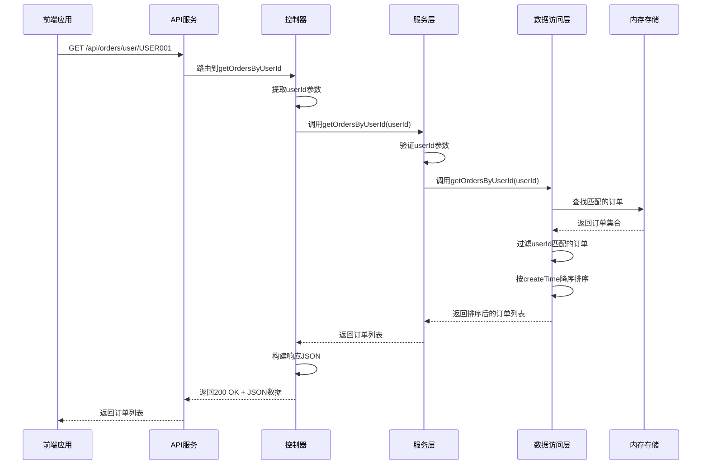
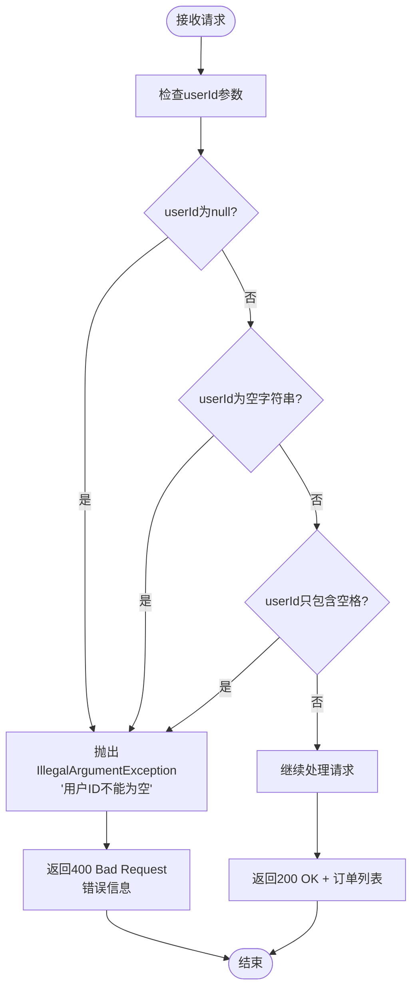
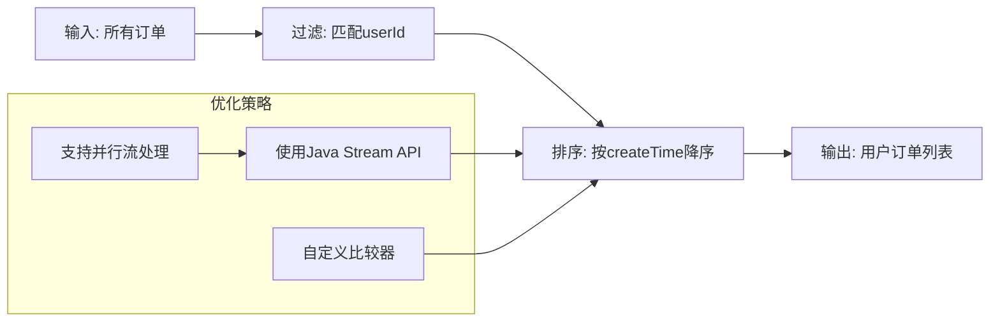

# GET /api/orders/user/{userId} 接口详细文档

<cite>
**本文档引用的文件**
- [OrderController.java](file://src/main/java/com/example/demo/controller/OrderController.java)
- [OrderService.java](file://src/main/java/com/example/demo/service/OrderService.java)
- [OrderDAO.java](file://src/main/java/com/example/demo/dao/OrderDAO.java)
- [orderService.js](file://frontend/src/services/orderService.js)
- [Order.java](file://src/main/java/com/example/demo/entity/Order.java)
- [DBUtil.java](file://src/main/java/com/example/demo/dao/DBUtil.java)
- [App.js](file://frontend/src/App.js)
</cite>

## 目录
1. [接口概述](#接口概述)
2. [技术架构](#技术架构)
3. [接口规范](#接口规范)
4. [核心组件分析](#核心组件分析)
5. [数据流程](#数据流程)
6. [JavaScript调用示例](#javascript调用示例)
7. [前端使用场景](#前端使用场景)
8. [错误处理](#错误处理)
9. [性能考虑](#性能考虑)
10. [最佳实践](#最佳实践)

## 接口概述

GET /api/orders/user/{userId} 是一个RESTful API接口，专门用于根据用户ID查询该用户的所有订单记录。该接口采用分层架构设计，实现了清晰的职责分离，确保了系统的可维护性和扩展性。

### 主要特性
- **请求方法**: GET
- **路径参数**: `{userId}` - 用户唯一标识符
- **响应格式**: JSON数组，包含用户的所有订单信息
- **状态码**: 成功时返回200 OK
- **数据排序**: 按订单创建时间降序排列（最新订单在前）

## 技术架构

系统采用经典的三层架构模式，确保了业务逻辑与数据访问的分离：



**图表来源**
- [OrderController.java](file://src/main/java/com/example/demo/controller/OrderController.java#L95-L112)
- [OrderService.java](file://src/main/java/com/example/demo/service/OrderService.java#L92-L105)
- [OrderDAO.java](file://src/main/java/com/example/demo/dao/OrderDAO.java#L214-L233)

## 接口规范

### 请求规范

| 属性 | 值 |
|------|-----|
| **HTTP方法** | GET |
| **URL路径** | `/api/orders/user/{userId}` |
| **路径参数** | `userId` (String) - 用户唯一标识符 |
| **认证要求** | 无特殊认证要求 |
| **内容类型** | 无请求体 |

### 响应规范

#### 成功响应 (200 OK)
```json
{
  "success": true,
  "data": [
    {
      "orderId": "ORD001",
      "userId": "USER001",
      "productId": "PROD001",
      "quantity": 2,
      "totalAmount": 318.00,
      "status": 1,
      "description": "夏季促销订单",
      "createTime": "2024-01-15T14:30:00.000",
      "payTime": "2024-01-15T14:35:00.000",
      "updateTime": "2024-01-15T14:35:00.000"
    }
  ],
  "count": 1
}
```

#### 响应字段说明

| 字段名 | 类型 | 描述 |
|--------|------|------|
| `success` | Boolean | 操作是否成功 |
| `data` | Array | 订单列表数组 |
| `count` | Integer | 订单数量 |

### 订单实体结构



**图表来源**
- [Order.java](file://src/main/java/com/example/demo/entity/Order.java#L1-L162)

**章节来源**
- [OrderController.java](file://src/main/java/com/example/demo/controller/OrderController.java#L95-L112)
- [Order.java](file://src/main/java/com/example/demo/entity/Order.java#L1-L162)

## 核心组件分析

### 控制器层 (OrderController)

控制器负责处理HTTP请求和响应，实现了接口的入口点：



**图表来源**
- [OrderController.java](file://src/main/java/com/example/demo/controller/OrderController.java#L95-L112)
- [OrderService.java](file://src/main/java/com/example/demo/service/OrderService.java#L92-L105)
- [OrderDAO.java](file://src/main/java/com/example/demo/dao/OrderDAO.java#L214-L233)

### 服务层 (OrderService)

服务层实现了业务逻辑，包括参数验证和调用数据访问层：

#### 关键特性
- **参数验证**: 确保userId不为空或空白字符串
- **异常处理**: 抛出IllegalArgumentException异常
- **数据转换**: 将DAO层返回的数据直接传递给控制器

### 数据访问层 (OrderDAO)

数据访问层负责实际的数据操作，使用内存中的ConcurrentHashMap模拟数据库：

#### 查询逻辑


**图表来源**
- [OrderDAO.java](file://src/main/java/com/example/demo/dao/OrderDAO.java#L214-L233)

**章节来源**
- [OrderController.java](file://src/main/java/com/example/demo/controller/OrderController.java#L95-L112)
- [OrderService.java](file://src/main/java/com/example/demo/service/OrderService.java#L92-L105)
- [OrderDAO.java](file://src/main/java/com/example/demo/dao/OrderDAO.java#L214-L233)

## 数据流程

### 完整的数据处理流程



**图表来源**
- [OrderController.java](file://src/main/java/com/example/demo/controller/OrderController.java#L95-L112)
- [OrderService.java](file://src/main/java/com/example/demo/service/OrderService.java#L92-L105)
- [OrderDAO.java](file://src/main/java/com/example/demo/dao/OrderDAO.java#L214-L233)

## JavaScript调用示例

### 基本调用方式

```javascript
// 使用封装的服务层
import orderService from './services/orderService';

// 获取用户订单
async function getUserOrders(userId) {
  try {
    const response = await orderService.getOrdersByUserId(userId);
    
    if (response.data.success) {
      console.log(`找到 ${response.data.count} 个订单`);
      return response.data.data;
    } else {
      console.error('查询失败:', response.data.message);
      return [];
    }
  } catch (error) {
    console.error('网络错误:', error.message);
    return [];
  }
}

// 使用Axios直接调用
import axios from 'axios';

async function getUserOrdersDirectly(userId) {
  try {
    const response = await axios.get(`/api/orders/user/${userId}`);
    return response.data;
  } catch (error) {
    console.error('请求失败:', error.response?.data?.message || error.message);
    return { success: false, message: '请求失败' };
  }
}
```

### 错误处理示例

```javascript
// 带有完整错误处理的调用
async function fetchUserOrdersWithRetry(userId, maxRetries = 3) {
  let retries = 0;
  
  while (retries < maxRetries) {
    try {
      const response = await orderService.getOrdersByUserId(userId);
      
      if (!response.data.success) {
        throw new Error(response.data.message || '查询失败');
      }
      
      return {
        success: true,
        orders: response.data.data,
        count: response.data.count
      };
      
    } catch (error) {
      retries++;
      console.warn(`第 ${retries} 次尝试失败:`, error.message);
      
      if (retries >= maxRetries) {
        return {
          success: false,
          message: `请求失败，已重试 ${maxRetries} 次`,
          orders: [],
          count: 0
        };
      }
      
      // 等待后重试
      await new Promise(resolve => setTimeout(resolve, 1000 * retries));
    }
  }
}
```

**章节来源**
- [orderService.js](file://frontend/src/services/orderService.js#L28-L31)

## 前端使用场景

### 用户登录后自动加载订单

在实际应用中，该接口通常在用户登录后自动调用，以显示用户的订单历史：

```javascript
// 在用户登录后自动加载订单
class OrderManager {
  constructor() {
    this.orders = [];
    this.loading = false;
    this.error = null;
  }
  
  async loadUserOrders(userId) {
    this.loading = true;
    this.error = null;
    
    try {
      const response = await orderService.getOrdersByUserId(userId);
      
      if (response.data.success) {
        this.orders = response.data.data;
        this.error = null;
      } else {
        this.error = response.data.message;
      }
    } catch (error) {
      this.error = '加载订单失败，请检查网络连接';
    } finally {
      this.loading = false;
    }
  }
  
  // 在React组件中使用
  render() {
    if (this.loading) {
      return <div className="loading">加载中...</div>;
    }
    
    if (this.error) {
      return <div className="error">{this.error}</div>;
    }
    
    if (this.orders.length === 0) {
      return <div className="no-orders">暂无订单记录</div>;
    }
    
    return (
      <div className="orders-list">
        {this.orders.map(order => (
          <div key={order.orderId} className="order-item">
            <h3>订单: {order.orderId}</h3>
            <p>金额: ¥{order.totalAmount}</p>
            <p>状态: {this.getStatusText(order.status)}</p>
            <p>创建时间: {this.formatDate(order.createTime)}</p>
          </div>
        ))}
      </div>
    );
  }
}
```

### 实时订单更新

```javascript
// 实现定时刷新功能
class RealtimeOrderManager {
  constructor(userId, interval = 300000) { // 5分钟
    this.userId = userId;
    this.interval = interval;
    this.timer = null;
    this.orders = [];
  }
  
  startAutoRefresh() {
    this.loadOrders(); // 立即加载一次
    this.timer = setInterval(() => this.loadOrders(), this.interval);
  }
  
  stopAutoRefresh() {
    if (this.timer) {
      clearInterval(this.timer);
      this.timer = null;
    }
  }
  
  async loadOrders() {
    try {
      const response = await orderService.getOrdersByUserId(this.userId);
      
      if (response.data.success) {
        // 检查是否有新订单
        const newOrders = response.data.data.filter(
          newOrder => !this.orders.some(oldOrder => oldOrder.orderId === newOrder.orderId)
        );
        
        if (newOrders.length > 0) {
          console.log(`发现 ${newOrders.length} 个新订单`);
          // 触发通知或其他UI更新
        }
        
        this.orders = response.data.data;
      }
    } catch (error) {
      console.error('自动刷新订单失败:', error);
    }
  }
}
```

**章节来源**
- [App.js](file://frontend/src/App.js#L105-L128)

## 错误处理

### 参数验证错误

当userId参数无效时，系统会抛出IllegalArgumentException异常：



**图表来源**
- [OrderService.java](file://src/main/java/com/example/demo/service/OrderService.java#L98-L104)

### 异常处理策略

| 异常类型 | HTTP状态码 | 错误信息 | 处理建议 |
|----------|------------|----------|----------|
| IllegalArgumentException | 400 | "用户ID不能为空" | 前端验证用户ID有效性 |
| NullPointerException | 400 | "用户ID不能为空" | 检查请求参数 |
| 数据库异常 | 500 | "数据库操作失败" | 后端日志记录和监控 |

### 前端错误处理

```javascript
// 完整的错误处理示例
class OrderApiHandler {
  static async getOrdersSafe(userId) {
    try {
      // 参数验证
      if (!userId || typeof userId !== 'string' || userId.trim() === '') {
        throw new Error('用户ID无效');
      }
      
      const response = await orderService.getOrdersByUserId(userId);
      
      if (!response.data.success) {
        throw new Error(response.data.message || '查询失败');
      }
      
      return {
        success: true,
        orders: response.data.data,
        count: response.data.count
      };
      
    } catch (error) {
      console.error('获取订单失败:', error);
      
      return {
        success: false,
        orders: [],
        count: 0,
        error: error.message,
        errorCode: this.getErrorCode(error)
      };
    }
  }
  
  static getErrorCode(error) {
    if (error.message.includes('用户ID不能为空')) {
      return 'INVALID_USER_ID';
    }
    if (error.message.includes('网络')) {
      return 'NETWORK_ERROR';
    }
    return 'UNKNOWN_ERROR';
  }
}
```

**章节来源**
- [OrderService.java](file://src/main/java/com/example/demo/service/OrderService.java#L98-L104)
- [OrderController.java](file://src/main/java/com/example/demo/controller/OrderController.java#L101-L111)

## 性能考虑

### 查询优化

由于OrderDAO使用内存中的ConcurrentHashMap存储数据，查询性能非常高：

- **时间复杂度**: O(n)，其中n是订单总数
- **空间复杂度**: O(n)，存储所有订单数据
- **并发安全性**: 使用ConcurrentHashMap确保线程安全

### 排序优化



**图表来源**
- [OrderDAO.java](file://src/main/java/com/example/demo/dao/OrderDAO.java#L225-L232)

### 扩展性考虑

对于大规模数据集，可以考虑以下优化方案：
- **分页查询**: 添加limit和offset参数
- **索引优化**: 在数据库中为userId字段建立索引
- **缓存机制**: 实现Redis缓存减少数据库访问

## 最佳实践

### 接口使用建议

1. **参数验证**: 始终验证userId的有效性
2. **错误处理**: 实现完善的错误处理机制
3. **性能监控**: 监控接口响应时间和成功率
4. **日志记录**: 记录关键操作和异常信息

### 安全考虑

1. **输入验证**: 防止SQL注入和XSS攻击
2. **权限控制**: 确保用户只能访问自己的订单
3. **数据脱敏**: 敏感信息进行适当脱敏处理

### 开发建议

```javascript
// 推荐的开发模式
class OrderApiClient {
  constructor(apiBaseUrl = '/api') {
    this.baseUrl = apiBaseUrl;
    this.cache = new Map();
    this.cacheTimeout = 5 * 60 * 1000; // 5分钟
  }
  
  async getOrders(userId, forceRefresh = false) {
    const cacheKey = `orders_${userId}`;
    
    // 缓存命中且未过期
    if (!forceRefresh && this.cache.has(cacheKey)) {
      const cached = this.cache.get(cacheKey);
      if (Date.now() - cached.timestamp < this.cacheTimeout) {
        return cached.data;
      }
    }
    
    try {
      const response = await orderService.getOrdersByUserId(userId);
      
      if (response.data.success) {
        const result = {
          orders: response.data.data,
          count: response.data.count,
          timestamp: Date.now()
        };
        
        this.cache.set(cacheKey, result);
        return result;
      }
      
      throw new Error(response.data.message || '查询失败');
      
    } catch (error) {
      console.error('获取订单失败:', error);
      throw error;
    }
  }
  
  clearCache() {
    this.cache.clear();
  }
  
  invalidateCache(userId) {
    this.cache.delete(`orders_${userId}`);
  }
}
```

### 监控和告警

```javascript
// 监控埋点
class OrderApiMonitor {
  static trackSuccess(userId, duration) {
    console.log(`订单查询成功: userId=${userId}, duration=${duration}ms`);
    // 发送到监控系统
  }
  
  static trackFailure(userId, error, duration) {
    console.error(`订单查询失败: userId=${userId}, error=${error}, duration=${duration}ms`);
    // 发送到告警系统
  }
  
  static async measurePerformance(userId) {
    const start = performance.now();
    
    try {
      const result = await orderService.getOrdersByUserId(userId);
      const duration = performance.now() - start;
      
      if (result.data.success) {
        this.trackSuccess(userId, duration);
      } else {
        this.trackFailure(userId, result.data.message, duration);
      }
      
      return result;
    } catch (error) {
      const duration = performance.now() - start;
      this.trackFailure(userId, error.message, duration);
      throw error;
    }
  }
}
```

**章节来源**
- [OrderDAO.java](file://src/main/java/com/example/demo/dao/OrderDAO.java#L225-L232)
- [orderService.js](file://frontend/src/services/orderService.js#L28-L31)