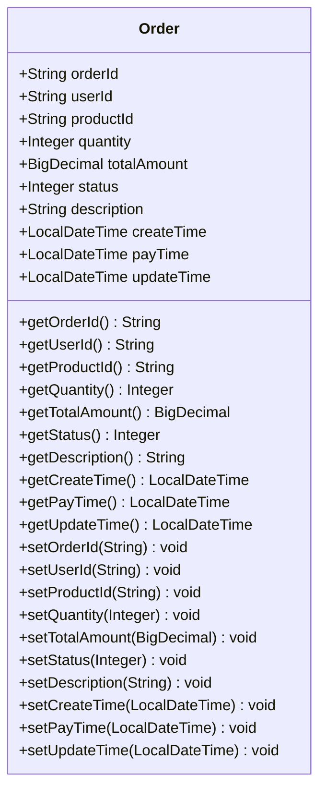
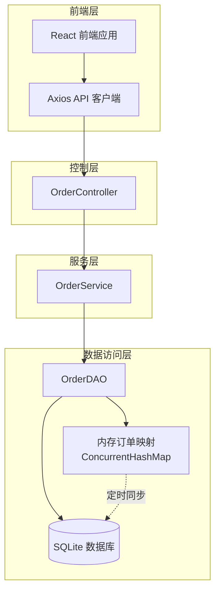
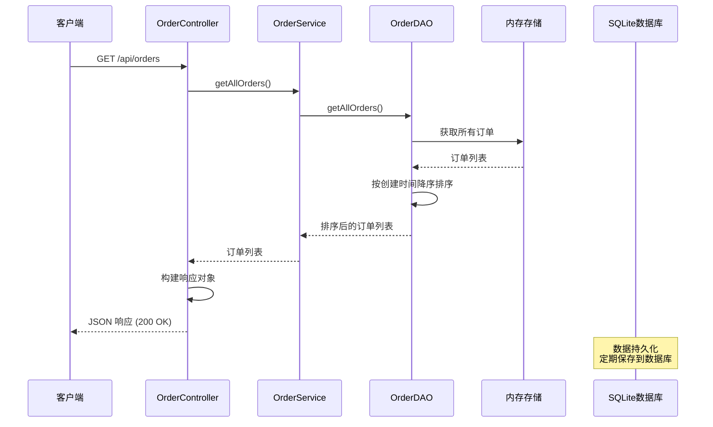
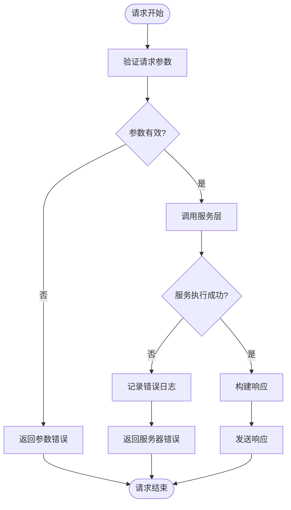

# GET /api/orders 接口详细文档

<cite>
**本文档引用的文件**
- [OrderController.java](file://src/main/java/com/example/demo/controller/OrderController.java)
- [OrderService.java](file://src/main/java/com/example/demo/service/OrderService.java)
- [OrderDAO.java](file://src/main/java/com/example/demo/dao/OrderDAO.java)
- [Order.java](file://src/main/java/com/example/demo/entity/Order.java)
- [orderService.js](file://frontend/src/services/orderService.js)
- [API1111.md](file://API1111.md)
- [使用说明.md](file://使用说明.md)
</cite>

## 目录
1. [接口概述](#接口概述)
2. [请求规范](#请求规范)
3. [响应格式](#响应格式)
4. [数据模型](#数据模型)
5. [架构设计](#架构设计)
6. [实现细节](#实现细节)
7. [前端调用示例](#前端调用示例)
8. [性能优化建议](#性能优化建议)
9. [错误处理](#错误处理)
10. [最佳实践](#最佳实践)

## 接口概述

GET /api/orders 是一个RESTful API接口，用于获取系统中所有订单的完整列表。该接口采用标准的HTTP GET方法，无需任何路径参数，返回JSON格式的订单列表数据。

### 核心特性
- **请求方法**: GET
- **URL路径**: `/api/orders`
- **响应状态码**: 200 OK 表示成功
- **数据来源**: 基于内存中的订单映射表（ConcurrentHashMap）
- **数据持久化**: 通过SQLite数据库进行持久化存储

## 请求规范

### HTTP 方法
```
GET /api/orders
```

### 请求头
```
Accept: application/json
Content-Type: application/json
```

### 路径参数
无路径参数

### 查询参数
无查询参数

## 响应格式

### 成功响应 (200 OK)

```json
{
  "success": true,
  "data": [
    {
      "orderId": "ORD001",
      "userId": "USER001",
      "productId": "PROD001",
      "quantity": 2,
      "totalAmount": 199.98,
      "status": 1,
      "description": "订单描述",
      "createTime": "2025-11-11T10:00:00",
      "payTime": "2025-11-11T10:30:00",
      "updateTime": "2025-11-11T10:30:00"
    }
  ],
  "count": 10,
  "message": null
}
```

### 响应字段说明

| 字段名 | 类型 | 描述 |
|--------|------|------|
| success | boolean | 操作是否成功的标志，成功时为true |
| data | Array | 订单对象数组，包含所有订单信息 |
| count | integer | 订单总数，等于data数组长度 |
| message | string/null | 错误消息，成功时为null |

## 数据模型

### Order 实体结构



**图表来源**
- [Order.java](file://src/main/java/com/example/demo/entity/Order.java#L1-L162)

### 订单状态枚举

| 状态值 | 状态名称 | 描述 |
|--------|----------|------|
| 0 | 待支付 | 订单已创建但未支付 |
| 1 | 已支付 | 订单已完成支付 |
| 2 | 已发货 | 订单已发货给客户 |
| 3 | 已完成 | 订单已完成交易 |
| 4 | 已取消 | 订单已被取消 |

## 架构设计

### 系统架构图



**图表来源**
- [OrderController.java](file://src/main/java/com/example/demo/controller/OrderController.java#L1-L173)
- [OrderService.java](file://src/main/java/com/example/demo/service/OrderService.java#L1-L114)
- [OrderDAO.java](file://src/main/java/com/example/demo/dao/OrderDAO.java#L1-L248)

### 数据流图



**图表来源**
- [OrderController.java](file://src/main/java/com/example/demo/controller/OrderController.java#L58-L74)
- [OrderService.java](file://src/main/java/com/example/demo/service/OrderService.java#L111-L113)
- [OrderDAO.java](file://src/main/java/com/example/demo/dao/OrderDAO.java#L235-L247)

## 实现细节

### 控制器层实现

OrderController 中的 getAllOrders 方法负责处理HTTP请求并返回标准化的响应格式：

**节来源**
- [OrderController.java](file://src/main/java/com/example/demo/controller/OrderController.java#L58-L74)

### 服务层实现

OrderService 的 getAllOrders 方法调用 OrderDAO 获取所有订单：

**节来源**
- [OrderService.java](file://src/main/java/com/example/demo/service/OrderService.java#L111-L113)

### 数据访问层实现

OrderDAO 使用 ConcurrentHashMap 作为内存存储，提供高效的订单管理：

**节来源**
- [OrderDAO.java](file://src/main/java/com/example/demo/dao/OrderDAO.java#L235-L247)

### 数据持久化机制

系统采用内存优先的架构，通过以下机制确保数据持久化：

1. **内存存储**: 使用 ConcurrentHashMap 存储所有订单
2. **批量保存**: 定期将内存数据保存到SQLite数据库
3. **批量加载**: 应用启动时从数据库加载数据到内存

**节来源**
- [OrderDAO.java](file://src/main/java/com/example/demo/dao/OrderDAO.java#L48-L78)
- [OrderDAO.java](file://src/main/java/com/example/demo/dao/OrderDAO.java#L80-L158)

## 前端调用示例

### Axios 调用

```javascript
// 使用 orderService.js 中的封装
import orderService from './services/orderService';

// 获取所有订单
async function fetchAllOrders() {
  try {
    const response = await orderService.getAllOrders();
    console.log('订单总数:', response.data.count);
    console.log('订单列表:', response.data.data);
    return response.data.data;
  } catch (error) {
    console.error('获取订单列表失败:', error);
    throw error;
  }
}
```

**节来源**
- [orderService.js](file://frontend/src/services/orderService.js#L23-L26)

### 原生 Fetch 示例

```javascript
// 使用原生 Fetch API
async function fetchOrdersWithFetch() {
  try {
    const response = await fetch('http://localhost:9090/api/orders', {
      method: 'GET',
      headers: {
        'Content-Type': 'application/json'
      }
    });
    
    if (!response.ok) {
      throw new Error(`HTTP error! status: ${response.status}`);
    }
    
    const data = await response.json();
    return data.data;
  } catch (error) {
    console.error('获取订单列表失败:', error);
    throw error;
  }
}
```

### curl 命令示例

```bash
# 获取所有订单列表
curl -X GET "http://localhost:9090/api/orders" \
  -H "Content-Type: application/json"

# 带详细输出的 curl 命令
curl -v -X GET "http://localhost:9090/api/orders" \
  -H "Content-Type: application/json"
```

## 性能优化建议

### 大数据量场景下的优化策略

当系统中订单数量达到数千甚至数万条时，需要考虑以下优化措施：

#### 1. 分页查询实现

```javascript
// 前端分页示例
async function fetchOrdersWithPagination(page = 1, pageSize = 50) {
  try {
    const response = await orderService.getAllOrders();
    const allOrders = response.data.data;
    
    // 实现客户端分页
    const startIndex = (page - 1) * pageSize;
    const endIndex = Math.min(startIndex + pageSize, allOrders.length);
    
    return {
      currentPage: page,
      pageSize: pageSize,
      totalCount: allOrders.length,
      totalPages: Math.ceil(allOrders.length / pageSize),
      orders: allOrders.slice(startIndex, endIndex)
    };
  } catch (error) {
    console.error('分页获取订单失败:', error);
    throw error;
  }
}
```

#### 2. 服务端分页优化

```java
// OrderController.java 中的改进版本
@GetMapping(params = {"page", "size"})
public ResponseEntity<Map<String, Object>> getPaginatedOrders(
        @RequestParam(defaultValue = "0") int page,
        @RequestParam(defaultValue = "50") int size) {
    Map<String, Object> response = new HashMap<>();
    try {
        List<Order> allOrders = orderService.getAllOrders();
        
        // 服务端分页
        int total = allOrders.size();
        int fromIndex = Math.min(page * size, total);
        int toIndex = Math.min(fromIndex + size, total);
        
        List<Order> paginatedOrders = allOrders.subList(fromIndex, toIndex);
        
        response.put("success", true);
        response.put("data", paginatedOrders);
        response.put("totalCount", total);
        response.put("currentPage", page);
        response.put("pageSize", size);
        return ResponseEntity.ok(response);
    } catch (Exception e) {
        response.put("success", false);
        response.put("message", e.getMessage());
        return ResponseEntity.status(HttpStatus.INTERNAL_SERVER_ERROR).body(response);
    }
}
```

#### 3. 缓存策略

```java
// 添加缓存支持
@Cacheable(value = "orders", key = "'all'")
public List<Order> getAllOrders() {
    return getOrderDAO().getAllOrders();
}
```

#### 4. 异步加载

```javascript
// 使用 Web Workers 进行异步处理
async function fetchLargeOrderList() {
  // 在 Web Worker 中处理大量数据
  const worker = new Worker('./orderWorker.js');
  
  worker.postMessage({ action: 'fetchAllOrders' });
  
  worker.onmessage = function(e) {
    if (e.data.type === 'orders') {
      console.log('处理完成的订单:', e.data.orders);
    }
  };
}
```

### 性能监控指标

| 指标类型 | 监控项 | 建议阈值 |
|----------|--------|----------|
| 响应时间 | 接口响应时间 | < 100ms |
| 内存使用 | 订单对象内存占用 | < 100MB |
| 数据量 | 单次查询订单数 | < 1000条 |
| 并发性 | 同时处理请求数 | < 100个 |

## 错误处理

### 常见错误场景

#### 1. 数据库连接异常

```json
{
  "success": false,
  "data": null,
  "count": 0,
  "message": "数据库连接失败: Connection refused"
}
```

#### 2. 内存不足异常

```json
{
  "success": false,
  "data": null,
  "count": 0,
  "message": "内存不足，无法加载所有订单"
}
```

#### 3. 系统内部错误

```json
{
  "success": false,
  "data": null,
  "count": 0,
  "message": "服务器内部错误: Unexpected error occurred"
}
```

### 错误处理流程



**图表来源**
- [OrderController.java](file://src/main/java/com/example/demo/controller/OrderController.java#L62-L74)

## 最佳实践

### 1. 请求频率控制

```javascript
// 防抖处理防止频繁请求
let lastFetchTime = 0;
const debounceDelay = 30000; // 30秒

async function safeFetchOrders() {
  const now = Date.now();
  if (now - lastFetchTime < debounceDelay) {
    console.log('请求过于频繁，请稍后再试');
    return;
  }
  
  try {
    const orders = await fetchAllOrders();
    lastFetchTime = now;
    return orders;
  } catch (error) {
    console.error('获取订单失败:', error);
  }
}
```

### 2. 数据缓存策略

```javascript
// 实现本地缓存
const ORDER_CACHE_KEY = 'order_cache';
const CACHE_EXPIRATION = 5 * 60 * 1000; // 5分钟

function getCachedOrders() {
  const cachedData = localStorage.getItem(ORDER_CACHE_KEY);
  if (cachedData) {
    const { data, timestamp } = JSON.parse(cachedData);
    if (Date.now() - timestamp < CACHE_EXPIRATION) {
      return data;
    }
  }
  return null;
}

function cacheOrders(orders) {
  localStorage.setItem(ORDER_CACHE_KEY, JSON.stringify({
    data: orders,
    timestamp: Date.now()
  }));
}
```

### 3. 错误边界处理

```javascript
// React 组件中的错误边界
class OrdersList extends React.Component {
  state = {
    orders: [],
    error: null,
    loading: false
  };

  async componentDidMount() {
    await this.fetchOrders();
  }

  async fetchOrders() {
    this.setState({ loading: true, error: null });
    
    try {
      const orders = await fetchAllOrders();
      this.setState({ orders, loading: false });
      cacheOrders(orders); // 缓存数据
    } catch (error) {
      this.setState({ 
        error: '无法加载订单列表，请检查网络连接',
        loading: false 
      });
    }
  }

  render() {
    if (this.state.error) {
      return (
        <div className="error-message">
          <p>{this.state.error}</p>
          <button onClick={() => this.fetchOrders()}>
            重试
          </button>
        </div>
      );
    }

    if (this.state.loading) {
      return <div className="loading">加载中...</div>;
    }

    return (
      <div className="orders-container">
        {/* 渲染订单列表 */}
      </div>
    );
  }
}
```

### 4. 监控和日志

```javascript
// 添加请求监控
function logOrderRequest(method, url, duration, success) {
  const logEntry = {
    timestamp: new Date().toISOString(),
    method: method,
    url: url,
    duration: duration,
    success: success,
    userAgent: navigator.userAgent
  };
  
  // 发送到监控服务
  fetch('/api/logs', {
    method: 'POST',
    headers: { 'Content-Type': 'application/json' },
    body: JSON.stringify(logEntry)
  });
}

// 使用示例
async function monitoredFetchOrders() {
  const startTime = performance.now();
  
  try {
    const result = await fetchAllOrders();
    const duration = performance.now() - startTime;
    logOrderRequest('GET', '/api/orders', duration, true);
    return result;
  } catch (error) {
    const duration = performance.now() - startTime;
    logOrderRequest('GET', '/api/orders', duration, false);
    throw error;
  }
}
```

**节来源**
- [API1111.md](file://API1111.md#L428-L462)

## 总结

GET /api/orders 接口是一个设计良好的RESTful API，具有以下特点：

1. **简洁性**: 采用标准的HTTP GET方法，无需复杂参数
2. **一致性**: 响应格式统一，便于前端处理
3. **可扩展性**: 支持未来添加分页、过滤等功能
4. **可靠性**: 提供完善的错误处理和状态码
5. **性能**: 内存存储保证高性能，SQLite持久化确保数据安全

通过合理的前端缓存、错误处理和性能优化策略，该接口能够满足大多数业务场景的需求，同时为未来的功能扩展提供了良好的基础。