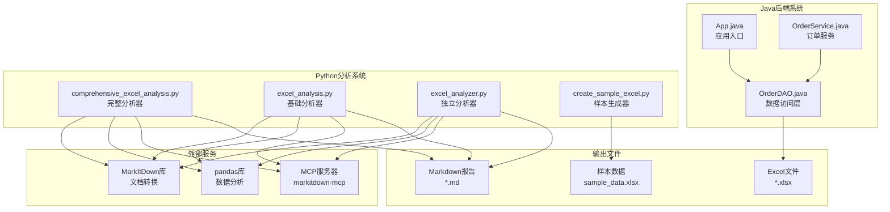
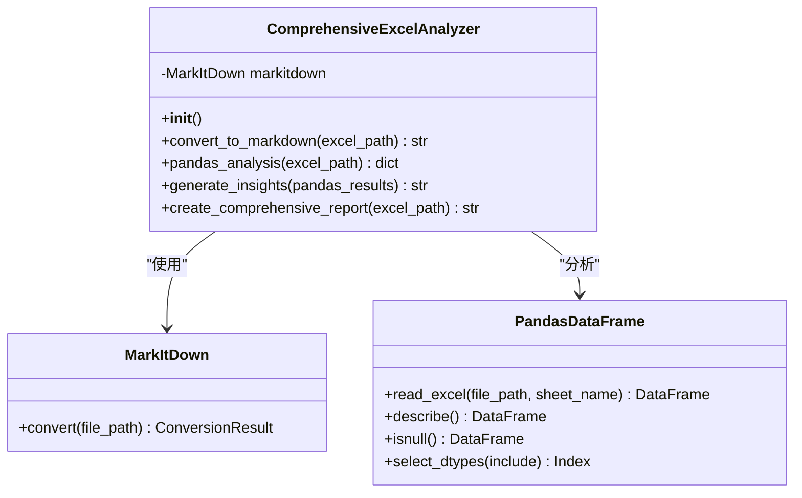
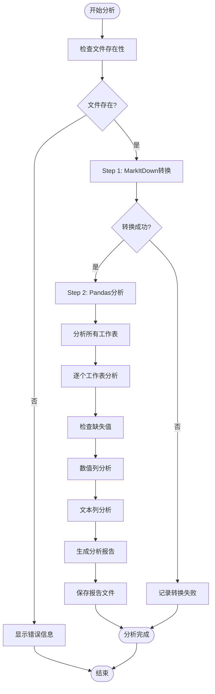
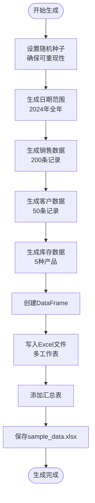
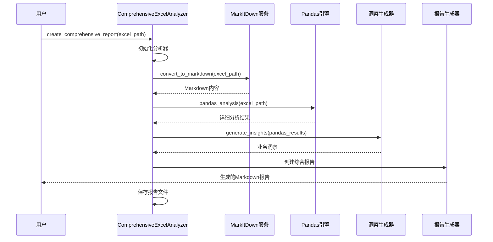
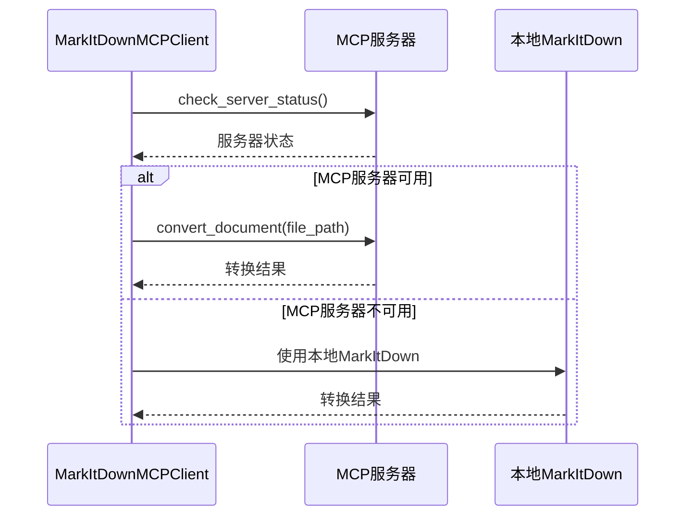
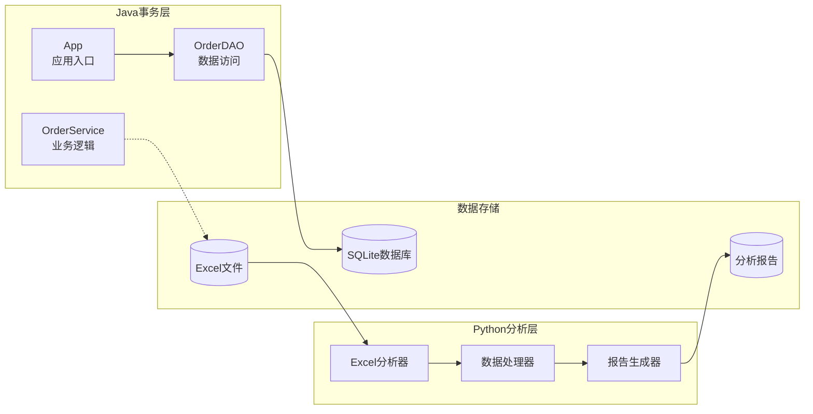

# Excel分析模块

<cite>
**本文档中引用的文件**
- [comprehensive_excel_analysis.py](file://comprehensive_excel_analysis.py)
- [create_sample_excel.py](file://create_sample_excel.py)
- [excel_analysis.py](file://excel_analysis.py)
- [excel_analyzer.py](file://excel_analyzer.py)
- [markitdown_mcp_example.py](file://markitdown_mcp_example.py)
- [App.java](file://src/main/java/com/example/demo/App.java)
- [OrderService.java](file://src/main/java/com/example/demo/service/OrderService.java)
- [pom.xml](file://pom.xml)
- [start-mcp-server.sh](file://start-mcp-server.sh)
</cite>

## 目录
1. [项目概述](#项目概述)
2. [系统架构](#系统架构)
3. [核心组件分析](#核心组件分析)
4. [功能对比分析](#功能对比分析)
5. [数据生成与测试](#数据生成与测试)
6. [分析流程详解](#分析流程详解)
7. [Java系统集成](#java系统集成)
8. [性能考虑](#性能考虑)
9. [故障排除指南](#故障排除指南)
10. [结论](#结论)

## 项目概述

Excel分析模块是一个基于Python的综合性数据分析系统，专门设计用于处理Excel文件的深度分析任务。该模块采用前后端分离架构，其中Java系统负责事务性数据处理，而Python模块专注于分析性任务，实现了数据处理的专业化分工。

### 核心特性

- **多库协同分析**：整合MarkItDown和pandas库实现Excel到Markdown的转换及深度数据分析
- **多层次分析**：从基础格式转换到高级统计洞察的全方位分析能力
- **智能洞察生成**：基于数据分析结果自动生成业务洞察和建议
- **灵活部署模式**：支持本地执行和MCP服务器两种运行模式
- **标准化报告**：生成结构化的Markdown分析报告

## 系统架构

**图表来源**
- [comprehensive_excel_analysis.py](file://comprehensive_excel_analysis.py#L1-L224)
- [excel_analysis.py](file://excel_analysis.py#L1-L128)
- [excel_analyzer.py](file://excel_analyzer.py#L1-L223)
- [create_sample_excel.py](file://create_sample_excel.py#L1-L99)

**章节来源**
- [comprehensive_excel_analysis.py](file://comprehensive_excel_analysis.py#L1-L50)
- [App.java](file://src/main/java/com/example/demo/App.java#L1-L62)

## 核心组件分析

### comprehensive_excel_analysis.py - 完整分析器

comprehensive_excel_analysis.py是系统的核心组件，提供了最全面的Excel分析功能。该模块采用面向对象的设计模式，封装了完整的分析流程。

#### 类结构设计

**图表来源**
- [comprehensive_excel_analysis.py](file://comprehensive_excel_analysis.py#L15-L224)

#### 核心功能模块

1. **MarkItDown转换模块**
   - 将Excel文件转换为Markdown格式
   - 支持复杂表格结构的准确转换
   - 提供转换质量评估

2. **Pandas分析模块**
   - 多工作表并行分析
   - 自动识别数据类型
   - 缺失值智能检测
   - 统计信息自动计算

3. **洞察生成模块**
   - 基于统计结果的业务洞察
   - 数据质量问题识别
   - 异常值检测
   - 关联关系分析

**章节来源**
- [comprehensive_excel_analysis.py](file://comprehensive_excel_analysis.py#L15-L224)

### excel_analysis.py - 基础分析器

excel_analysis.py提供了简化版本的Excel分析功能，专注于MarkItDown转换和基础pandas分析。

#### 功能特点

- **轻量级设计**：减少不必要的复杂功能
- **快速响应**：优化的处理流程
- **易于集成**：简单的API接口

**章节来源**
- [excel_analysis.py](file://excel_analysis.py#L1-L128)

### excel_analyzer.py - 独立分析器

excel_analyzer.py是一个独立的分析工具，提供了详细的分步骤分析过程。

#### 分析流程

**图表来源**
- [excel_analyzer.py](file://excel_analyzer.py#L15-L223)

**章节来源**
- [excel_analyzer.py](file://excel_analyzer.py#L1-L223)

## 功能对比分析

### 功能矩阵对比

| 功能特性 | comprehensive_excel_analysis.py | excel_analysis.py | excel_analyzer.py |
|---------|--------------------------------|-------------------|-------------------|
| **MarkItDown转换** | ✓ 完整转换 + 质量评估 | ✓ 基础转换 | ✓ 详细转换过程 |
| **Pandas分析** | ✓ 多维度统计 + 缺失值分析 | ✓ 基础统计 | ✓ 详细分步分析 |
| **洞察生成** | ✓ 智能业务洞察 | ✗ 无 | ✗ 无 |
| **报告生成** | ✓ 结构化Markdown报告 | ✓ 简单报告 | ✓ 详细分析报告 |
| **MCP服务器支持** | ✓ 完整支持 | ✓ 基础支持 | ✓ 完整支持 |
| **异常处理** | ✓ 详细错误信息 | ✓ 基础错误处理 | ✓ 详细错误处理 |
| **用户交互** | ✓ 命令行 + 自动检测 | ✓ 命令行界面 | ✓ 交互式选择 |

### 协作方式

三个分析器通过不同的应用场景实现互补：

1. **comprehensive_excel_analysis.py**：适用于需要完整分析报告的场景
2. **excel_analysis.py**：适用于快速转换和简单分析的场景  
3. **excel_analyzer.py**：适用于需要详细分析过程的教育和调试场景

**章节来源**
- [comprehensive_excel_analysis.py](file://comprehensive_excel_analysis.py#L1-L50)
- [excel_analysis.py](file://excel_analysis.py#L1-L50)
- [excel_analyzer.py](file://excel_analyzer.py#L1-L50)

## 数据生成与测试

### create_sample_excel.py - 样本数据生成器

create_sample_excel.py专门用于生成符合测试需求的Excel样本数据文件，模拟真实业务场景中的数据结构。

#### 数据生成策略

**图表来源**
- [create_sample_excel.py](file://create_sample_excel.py#L15-L99)

#### 生成的数据结构

| 工作表名称 | 数据量 | 主要字段 | 业务含义 |
|-----------|--------|----------|----------|
| 销售数据 | 200行 | 日期、产品名称、地区、销售数量、单价、折扣率、销售员、销售额 | 销售业绩记录 |
| 客户数据 | 50行 | 客户ID、客户名称、客户类型、年龄、注册日期、总消费金额、会员等级 | 客户基本信息 |
| 库存数据 | 5行 | 产品名称、当前库存、安全库存、成本价、供应商、最后进货日期 | 库存管理信息 |
| 数据汇总 | 5行 | 指标、数值 | 关键业务指标汇总 |

**章节来源**
- [create_sample_excel.py](file://create_sample_excel.py#L1-L99)

## 分析流程详解

### comprehensive_excel_analysis.py - 完整分析流程

完整的分析流程涵盖了从文件读取到报告生成的全过程：

**图表来源**
- [comprehensive_excel_analysis.py](file://comprehensive_excel_analysis.py#L150-L224)

### markitdown_mcp_example.py - MCP服务器交互

MCP（Model Context Protocol）服务器提供了分布式文档转换能力：

**图表来源**
- [markitdown_mcp_example.py](file://markitdown_mcp_example.py#L15-L136)

**章节来源**
- [comprehensive_excel_analysis.py](file://comprehensive_excel_analysis.py#L150-L224)
- [markitdown_mcp_example.py](file://markitdown_mcp_example.py#L15-L136)

## Java系统集成

### 互补关系设计

Excel分析模块与Java系统形成了清晰的职责分工：

#### Java系统职责（事务性处理）
- **数据持久化**：通过OrderDAO进行数据库操作
- **业务逻辑**：OrderService处理订单业务规则
- **数据验证**：确保数据完整性
- **并发控制**：处理高并发访问

#### Python系统职责（分析性处理）
- **数据转换**：将Excel数据转换为可分析格式
- **统计分析**：执行复杂的统计计算
- **趋势分析**：识别数据模式和异常
- **报告生成**：创建业务洞察报告

### 集成架构

**图表来源**
- [App.java](file://src/main/java/com/example/demo/App.java#L10-L62)
- [OrderService.java](file://src/main/java/com/example/demo/service/OrderService.java#L10-L81)

**章节来源**
- [App.java](file://src/main/java/com/example/demo/App.java#L1-L62)
- [OrderService.java](file://src/main/java/com/example/demo/service/OrderService.java#L1-L81)

## 性能考虑

### 内存优化策略

1. **流式处理**：对于大型Excel文件，采用分块读取策略
2. **数据类型优化**：使用适当的数据类型减少内存占用
3. **及时释放**：分析完成后及时释放不需要的对象

### 并发处理

- **多线程分析**：支持同时分析多个Excel文件
- **异步转换**：MarkItDown转换支持异步处理
- **缓存机制**：对重复分析结果进行缓存

### 扩展性设计

- **插件架构**：支持自定义分析插件
- **配置驱动**：通过配置文件调整分析参数
- **API接口**：提供RESTful API支持远程调用

## 故障排除指南

### 常见问题及解决方案

#### 1. 依赖包问题
**症状**：ImportError异常
**解决方案**：
- 检查虚拟环境配置
- 确认包版本兼容性
- 重新安装依赖包

#### 2. 文件路径问题
**症状**：文件不存在或路径无效
**解决方案**：
- 使用绝对路径
- 检查文件权限
- 验证文件格式

#### 3. 内存不足
**症状**：处理大型文件时内存溢出
**解决方案**：
- 减少批处理大小
- 优化数据结构
- 增加系统内存

#### 4. MCP服务器连接问题
**症状**：无法连接到MCP服务器
**解决方案**：
- 检查服务器状态
- 验证网络连接
- 调整超时设置

**章节来源**
- [comprehensive_excel_analysis.py](file://comprehensive_excel_analysis.py#L15-L30)
- [markitdown_mcp_example.py](file://markitdown_mcp_example.py#L15-L50)

## 结论

Excel分析模块通过精心设计的架构和功能组合，实现了Excel数据处理的专业化分工。comprehensive_excel_analysis.py作为核心分析器，提供了完整的分析能力；excel_analysis.py和excel_analyzer.py则分别满足不同场景的需求。与Java系统的互补关系进一步强化了系统的整体价值。

### 主要优势

1. **专业分工**：Java处理事务性数据，Python专注分析性任务
2. **功能完整**：从基础转换到高级洞察的全方位覆盖
3. **灵活部署**：支持多种运行模式和集成方式
4. **易于扩展**：模块化设计便于功能扩展

### 应用前景

该模块特别适用于需要定期进行数据分析的企业场景，能够显著提升数据分析效率，为业务决策提供有力支持。随着数据量的增长和分析需求的复杂化，该模块具有广阔的应用前景和发展空间。