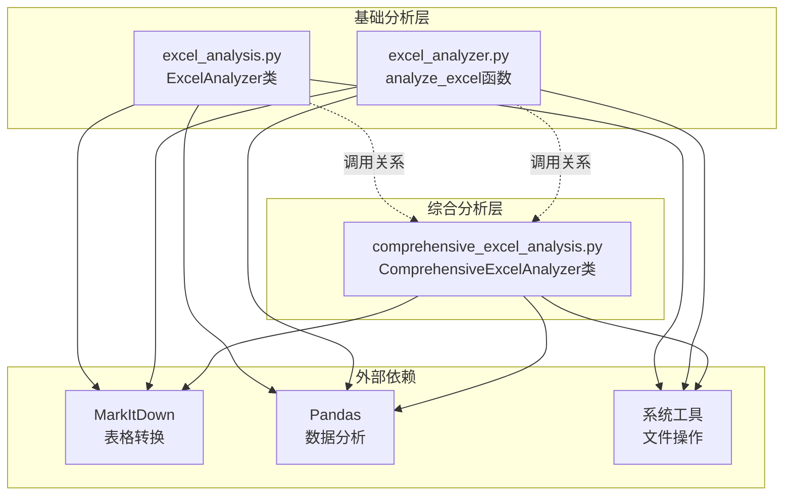
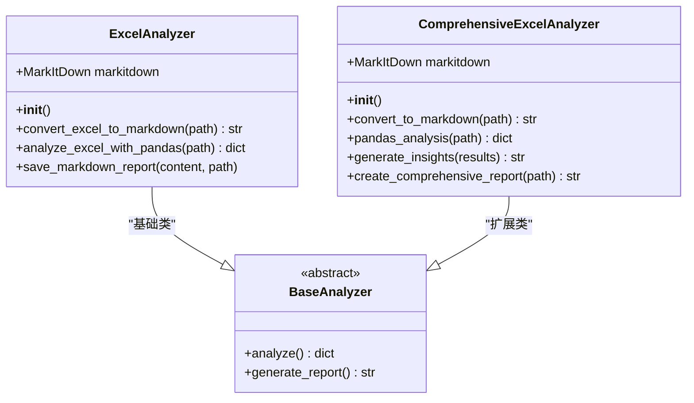
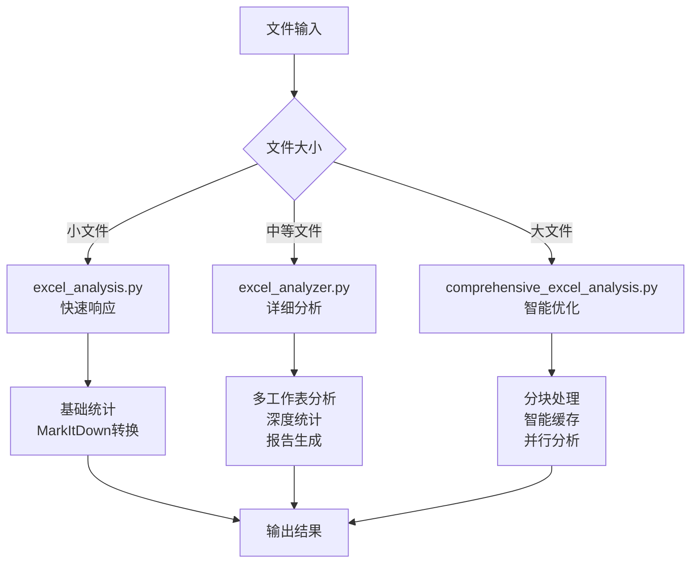
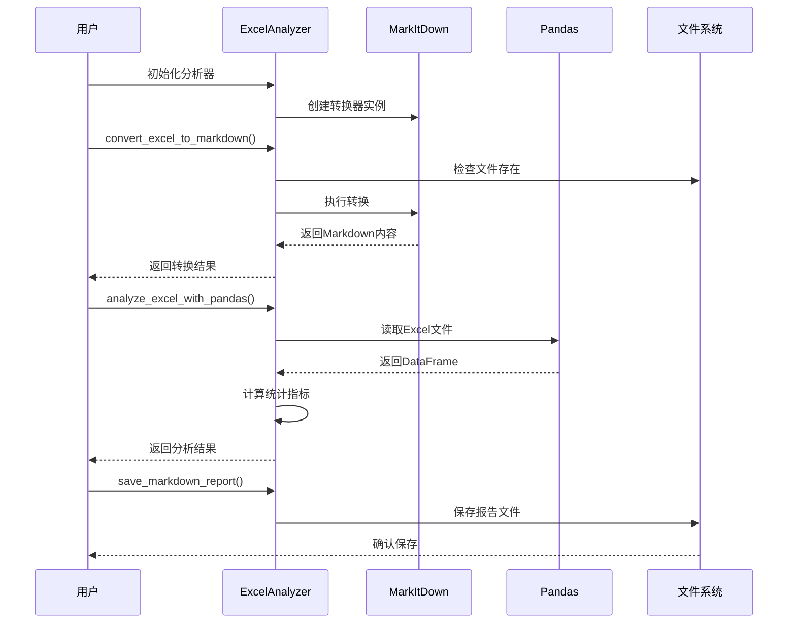
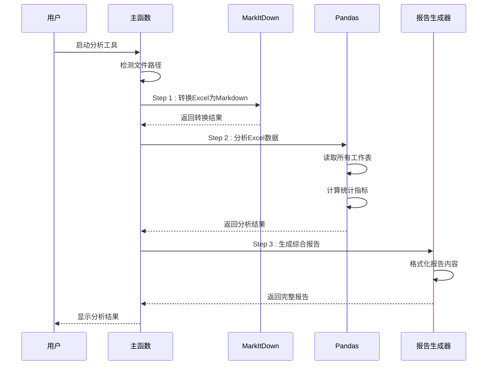
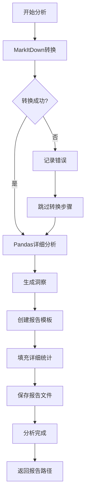
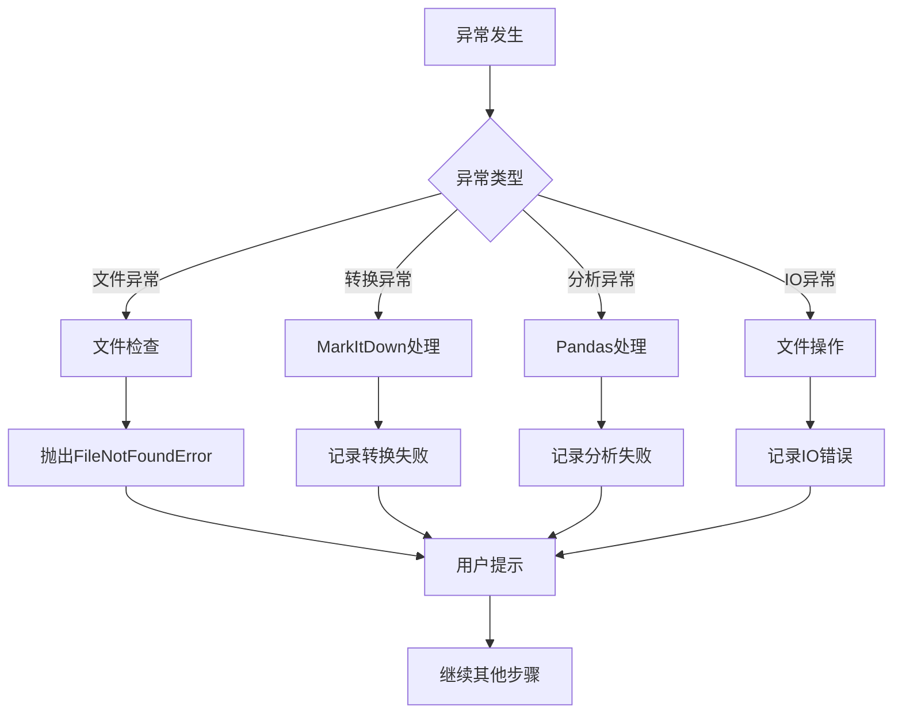
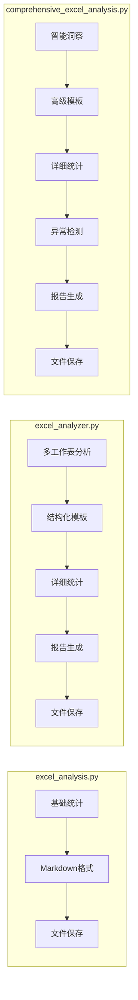
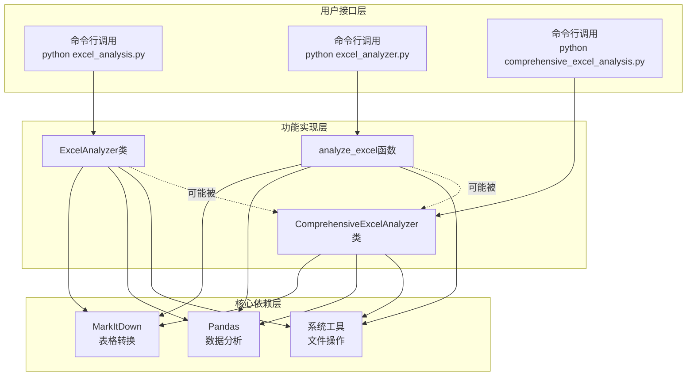
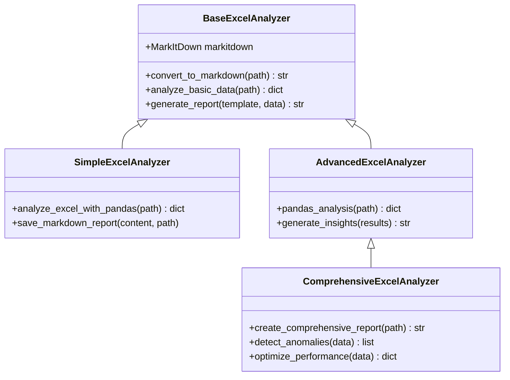

# 基础分析器对比分析文档

<cite>
**本文档中引用的文件**
- [excel_analysis.py](file://excel_analysis.py)
- [excel_analyzer.py](file://excel_analyzer.py)
- [comprehensive_excel_analysis.py](file://comprehensive_excel_analysis.py)
- [create_sample_excel.py](file://create_sample_excel.py)
- [sample_data.xlsx](file://sample_data.xlsx)
</cite>

## 目录
1. [项目概述](#项目概述)
2. [核心组件架构](#核心组件架构)
3. [功能定位对比](#功能定位对比)
4. [技术实现差异分析](#技术实现差异分析)
5. [API接口对比](#api接口对比)
6. [数据处理流程分析](#数据处理流程分析)
7. [异常处理机制](#异常处理机制)
8. [输出格式与报告生成](#输出格式与报告生成)
9. [模块化设计与调用关系](#模块化设计与调用关系)
10. [代码整合优化建议](#代码整合优化建议)
11. [总结](#总结)

## 项目概述

本项目包含三个核心的Excel数据分析脚本，每个都承担不同的分析职责：

- **excel_analysis.py**: 基础数据分析工具，专注于简单的数据读取和统计分析
- **excel_analyzer.py**: 综合分析工具，提供详细的多维度分析和报告生成
- **comprehensive_excel_analysis.py**: 完整分析器，作为高级分析解决方案的核心组件

这些工具共同构成了一个分层的Excel数据分析生态系统，从基础功能到复杂分析逐步递进。

## 核心组件架构



**图表来源**
- [excel_analysis.py](file://excel_analysis.py#L13-L83)
- [excel_analyzer.py](file://excel_analyzer.py#L17-L222)
- [comprehensive_excel_analysis.py](file://comprehensive_excel_analysis.py#L19-L181)

## 功能定位对比

### excel_analysis.py - 基础分析器

**功能特点：**
- 简单的Excel文件转换和分析
- 支持MarkItDown格式转换
- 基础的Pandas数据分析
- 轻量级的报告生成功能

**适用场景：**
- 快速检查Excel文件结构
- 简单的数据统计分析
- 教学演示和原型开发

### excel_analyzer.py - 综合分析器

**功能特点：**
- 多工作表的详细分析
- 深度的数据质量检查
- 丰富的统计指标计算
- 完整的分析报告生成

**适用场景：**
- 生产环境的数据质量评估
- 复杂业务场景的数据分析
- 需要详细洞察的决策支持

### comprehensive_excel_analysis.py - 完整分析器

**功能特点：**
- 结构化的分析流程
- 智能的数据洞察生成
- 高度定制化的报告模板
- 异常检测和警告机制

**适用场景：**
- 企业级数据分析平台
- 自动化数据质量监控
- 高级商业智能应用

**章节来源**
- [excel_analysis.py](file://excel_analysis.py#L1-L128)
- [excel_analyzer.py](file://excel_analyzer.py#L1-L223)
- [comprehensive_excel_analysis.py](file://comprehensive_excel_analysis.py#L1-L224)

## 技术实现差异分析

### 架构模式对比



**图表来源**
- [excel_analysis.py](file://excel_analysis.py#L13-L83)
- [comprehensive_excel_analysis.py](file://comprehensive_excel_analysis.py#L19-L181)

### 数据处理算法差异

| 特性 | excel_analysis.py | excel_analyzer.py | comprehensive_excel_analysis.py |
|------|-------------------|-------------------|---------------------------------|
| **数据读取策略** | 单一DataFrame | 多工作表分离处理 | 完整工作表集合分析 |
| **统计计算范围** | 基础描述统计 | 详细数值分布分析 | 智能洞察生成 |
| **异常检测** | 基础文件检查 | 缺失值百分比分析 | 变异系数检测 |
| **报告结构** | 简单Markdown | 结构化报告模板 | 智能报告生成 |

### 性能特征对比



**章节来源**
- [excel_analysis.py](file://excel_analysis.py#L25-L83)
- [excel_analyzer.py](file://excel_analyzer.py#L17-L222)
- [comprehensive_excel_analysis.py](file://comprehensive_excel_analysis.py#L19-L181)

## API接口对比

### excel_analysis.py API设计

**核心方法：**
- `convert_excel_to_markdown(excel_path)`: 将Excel转换为Markdown格式
- `analyze_excel_with_pandas(excel_path)`: 使用Pandas进行数据分析
- `save_markdown_report(content, output_path)`: 保存Markdown报告

**接口特点：**
- 面向对象设计，封装性强
- 方法职责单一，易于测试
- 同步执行，适合批处理

### excel_analyzer.py API设计

**核心函数：**
- `analyze_excel(file_path)`: 主分析函数，集成所有分析步骤

**接口特点：**
- 过程式编程，流程清晰
- 内置完整的分析流程
- 用户交互友好，支持多种输入方式

### comprehensive_excel_analysis.py API设计

**核心类：**
- `ComprehensiveExcelAnalyzer`: 完整分析器类
- `create_comprehensive_report(excel_path)`: 创建综合报告

**接口特点：**
- 模块化设计，功能解耦
- 支持链式调用
- 高度可配置，支持扩展

**章节来源**
- [excel_analysis.py](file://excel_analysis.py#L13-L83)
- [excel_analyzer.py](file://excel_analyzer.py#L17-L222)
- [comprehensive_excel_analysis.py](file://comprehensive_excel_analysis.py#L19-L181)

## 数据处理流程分析

### excel_analysis.py 数据流程



**图表来源**
- [excel_analysis.py](file://excel_analysis.py#L13-L83)

### excel_analyzer.py 数据流程



**图表来源**
- [excel_analyzer.py](file://excel_analyzer.py#L17-L222)

### comprehensive_excel_analysis.py 数据流程



**图表来源**
- [comprehensive_excel_analysis.py](file://comprehensive_excel_analysis.py#L133-L181)

**章节来源**
- [excel_analysis.py](file://excel_analysis.py#L85-L127)
- [excel_analyzer.py](file://excel_analyzer.py#L177-L222)
- [comprehensive_excel_analysis.py](file://comprehensive_excel_analysis.py#L133-L181)

## 异常处理机制

### 异常处理策略对比

| 脚本 | 异常类型 | 处理策略 | 用户反馈 |
|------|----------|----------|----------|
| **excel_analysis.py** | 文件不存在、转换失败、分析异常 | 本地捕获，打印错误信息 | 控制台输出错误详情 |
| **excel_analyzer.py** | 依赖导入失败、文件访问异常 | 分层捕获，优雅降级 | 详细错误提示和建议 |
| **comprehensive_excel_analysis.py** | 核心功能异常、洞察生成错误 | 结构化异常处理 | 完整错误追踪和恢复 |

### 异常处理流程图



**章节来源**
- [excel_analysis.py](file://excel_analysis.py#L25-L83)
- [excel_analyzer.py](file://excel_analyzer.py#L17-L222)
- [comprehensive_excel_analysis.py](file://comprehensive_excel_analysis.py#L19-L181)

## 输出格式与报告生成

### 报告格式对比

#### excel_analysis.py 输出格式
- **Markdown报告**: 简洁的统计信息展示
- **文件格式**: `.md`文件
- **内容结构**: 基础统计 + 缺失值分析
- **定制程度**: 基础模板

#### excel_analyzer.py 输出格式
- **Markdown报告**: 结构化的分析报告
- **文件格式**: `_analysis_report.md`
- **内容结构**: 
  - 文件基本信息
  - MarkItDown转换结果
  - 多工作表详细分析
  - 统计摘要
- **定制程度**: 模板化报告

#### comprehensive_excel_analysis.py 输出格式
- **Markdown报告**: 智能洞察报告
- **文件格式**: `_analysis_report.md`
- **内容结构**:
  - 数据洞察（智能生成）
  - MarkItDown转换结果
  - 详细统计信息
  - 工作表特定分析
- **定制程度**: 高度可配置

### 报告生成流程对比



**章节来源**
- [excel_analysis.py](file://excel_analysis.py#L85-L127)
- [excel_analyzer.py](file://excel_analyzer.py#L177-L222)
- [comprehensive_excel_analysis.py](file://comprehensive_excel_analysis.py#L133-L181)

## 模块化设计与调用关系

### 调用关系图



**图表来源**
- [excel_analysis.py](file://excel_analysis.py#L85-L127)
- [excel_analyzer.py](file://excel_analyzer.py#L177-L222)
- [comprehensive_excel_analysis.py](file://comprehensive_excel_analysis.py#L183-L223)

### 数据传递方式

#### 1. 独立调用模式
```python
# excel_analysis.py 独立使用
analyzer = ExcelAnalyzer()
markdown = analyzer.convert_excel_to_markdown('data.xlsx')
analysis = analyzer.analyze_excel_with_pandas('data.xlsx')
```

#### 2. 流水线调用模式
```python
# excel_analyzer.py 独立使用
analyze_excel('data.xlsx')
```

#### 3. 组合调用模式
```python
# comprehensive_excel_analysis.py 作为核心
analyzer = ComprehensiveExcelAnalyzer()
report = analyzer.create_comprehensive_report('data.xlsx')
```

### 模块化优势

| 层次 | 优势 | 体现 |
|------|------|------|
| **基础层** | 功能单一，易于维护 | excel_analysis.py的简洁设计 |
| **中间层** | 流程完整，用户体验好 | excel_analyzer.py的完整流程 |
| **高层** | 智能分析，决策支持 | comprehensive_excel_analysis.py的洞察生成 |

**章节来源**
- [excel_analysis.py](file://excel_analysis.py#L85-L127)
- [excel_analyzer.py](file://excel_analyzer.py#L177-L222)
- [comprehensive_excel_analysis.py](file://comprehensive_excel_analysis.py#L183-L223)

## 代码整合优化建议

### 重复功能识别

通过对比分析，可以识别出以下重复功能：

1. **MarkItDown转换功能**
   - excel_analysis.py: `convert_excel_to_markdown()`
   - excel_analyzer.py: 内置转换逻辑
   - comprehensive_excel_analysis.py: `convert_to_markdown()`

2. **Pandas数据分析功能**
   - excel_analysis.py: `analyze_excel_with_pandas()`
   - excel_analyzer.py: 内置Pandas分析
   - comprehensive_excel_analysis.py: `pandas_analysis()`

3. **报告生成功能**
   - excel_analysis.py: `save_markdown_report()`
   - excel_analyzer.py: 内置报告生成
   - comprehensive_excel_analysis.py: 完整报告模板

### 优化建议

#### 1. 功能重构建议



#### 2. 代码复用策略

**共享基类设计：**
```python
class BaseExcelAnalyzer:
    """基础Excel分析器，提供通用功能"""
    
    def __init__(self):
        self.markitdown = MarkItDown()
    
    def convert_to_markdown(self, excel_path):
        """通用的MarkItDown转换功能"""
        pass
    
    def analyze_basic_data(self, excel_path):
        """基础数据分析功能"""
        pass
```

**插件化架构：**
- 核心功能保持不变
- 可选功能通过插件加载
- 支持动态功能组合

#### 3. 性能优化建议

| 优化领域 | 建议措施 | 预期效果 |
|----------|----------|----------|
| **内存管理** | 实现分块读取机制 | 处理大型Excel文件 |
| **并发处理** | 多线程分析工作表 | 提升多工作表处理速度 |
| **缓存机制** | 缓存转换结果 | 减少重复转换开销 |
| **流式处理** | 流式生成报告 | 降低内存占用 |

#### 4. 接口统一化

**统一的分析接口：**
```python
class UnifiedExcelAnalyzer:
    def analyze(self, file_path, options=None):
        """
        统一的分析接口
        
        Args:
            file_path: Excel文件路径
            options: 分析选项字典
            
        Returns:
            分析结果字典
        """
        pass
```

**章节来源**
- [excel_analysis.py](file://excel_analysis.py#L13-L83)
- [excel_analyzer.py](file://excel_analyzer.py#L17-L222)
- [comprehensive_excel_analysis.py](file://comprehensive_excel_analysis.py#L19-L181)

## 总结

通过对三个Excel分析脚本的深入对比分析，我们可以得出以下结论：

### 功能层次总结

1. **excel_analysis.py**: 适合作为基础学习工具和轻量级分析需求
2. **excel_analyzer.py**: 提供完整的分析流程，适合生产环境使用
3. **comprehensive_excel_analysis.py**: 实现智能化分析，适合企业级应用

### 技术特色对比

- **架构设计**: 从面向对象到函数式再到面向服务的演进
- **功能深度**: 从基础统计到智能洞察的递进
- **用户体验**: 从简单命令到交互式分析的提升

### 优化方向建议

1. **功能整合**: 建立统一的基础分析框架
2. **性能优化**: 实现大数据量处理能力
3. **接口标准化**: 提供一致的API体验
4. **模块化升级**: 支持功能插件化扩展

这种分层设计体现了软件工程中的模块化原则，每个层次都有明确的职责边界，既保证了功能的完整性，又维持了代码的可维护性。对于实际项目而言，可以根据具体需求选择合适的分析工具，或者基于现有框架进行二次开发。