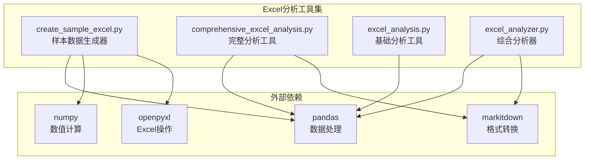
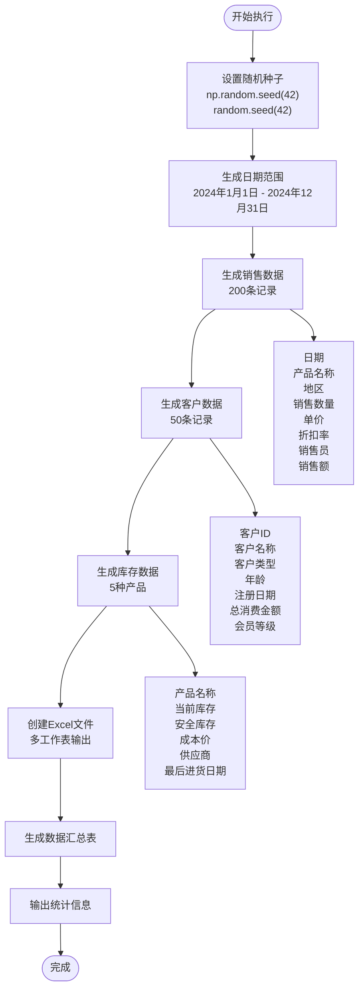
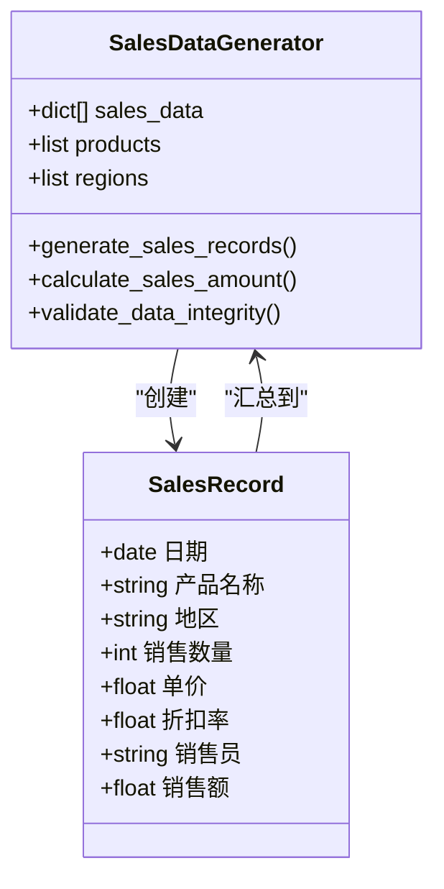
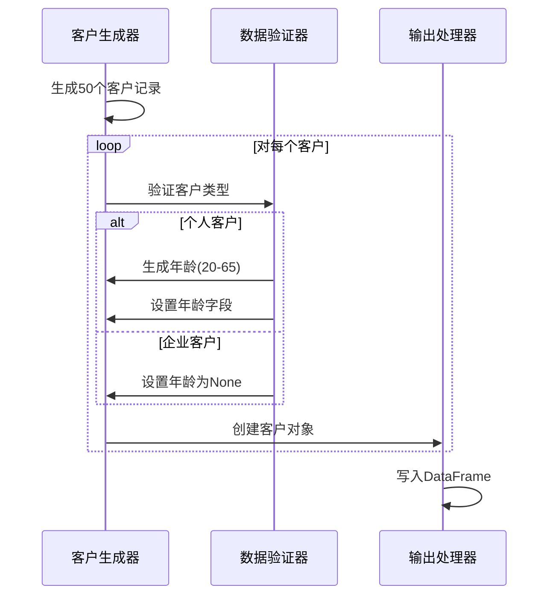
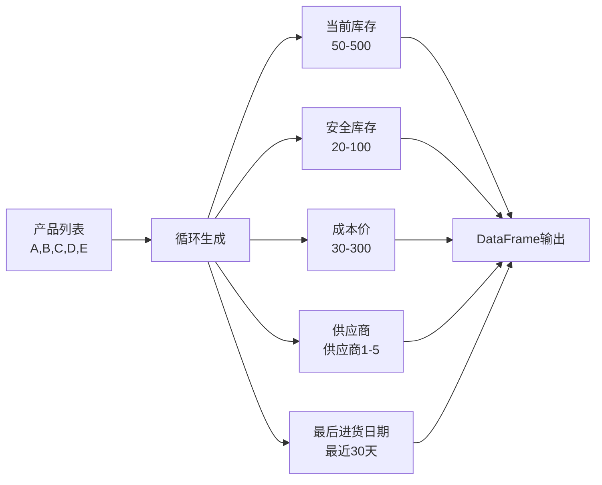
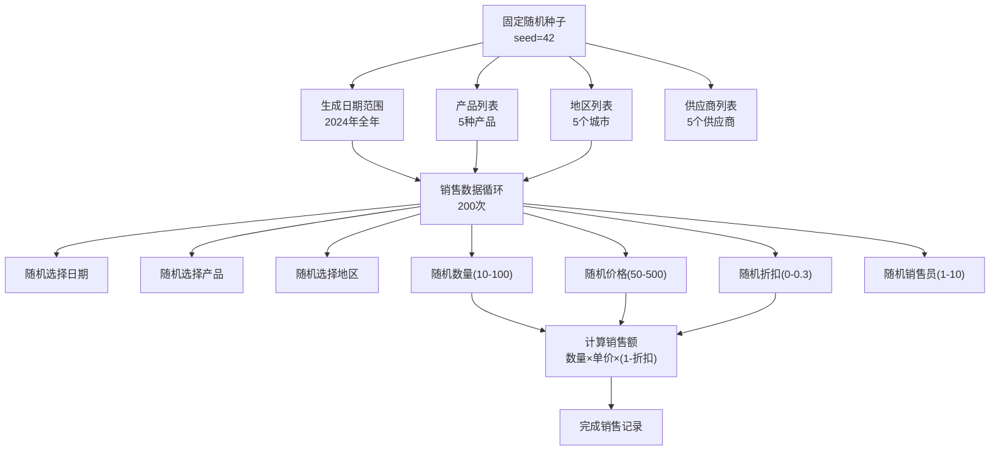

# 样本数据生成器

<cite>
**本文档中引用的文件**
- [create_sample_excel.py](file://create_sample_excel.py)
- [comprehensive_excel_analysis.py](file://comprehensive_excel_analysis.py)
- [excel_analysis.py](file://excel_analysis.py)
- [excel_analyzer.py](file://excel_analyzer.py)
- [README.md](file://README.md)
</cite>

## 目录
1. [简介](#简介)
2. [项目结构](#项目结构)
3. [核心组件](#核心组件)
4. [架构概览](#架构概览)
5. [详细组件分析](#详细组件分析)
6. [数据结构设计](#数据结构设计)
7. [生成逻辑分析](#生成逻辑分析)
8. [文件格式与配置](#文件格式与配置)
9. [运行示例](#运行示例)
10. [测试验证](#测试验证)
11. [性能考虑](#性能考虑)
12. [故障排除指南](#故障排除指南)
13. [结论](#结论)

## 简介

create_sample_excel.py是一个专门设计的Python脚本，用于生成符合测试需求的示例Excel文件。该工具在数据分析系统中扮演着关键角色，为comprehensive_excel_analysis.py等分析工具提供标准化的测试数据源。通过生成包含销售数据、客户信息和库存管理的多工作表Excel文件，该工具确保了数据分析模块具备可重复的测试基础，支持开发调试、功能验证和演示场景。

## 项目结构

该项目采用模块化架构，包含多个相互协作的Excel分析工具：



**图表来源**
- [create_sample_excel.py](file://create_sample_excel.py#L1-L10)
- [comprehensive_excel_analysis.py](file://comprehensive_excel_analysis.py#L1-L15)

**章节来源**
- [create_sample_excel.py](file://create_sample_excel.py#L1-L99)
- [comprehensive_excel_analysis.py](file://comprehensive_excel_analysis.py#L1-L224)

## 核心组件

create_sample_excel.py的核心功能围绕以下几个关键组件构建：

### 数据生成引擎
负责创建各种类型的业务数据，包括销售数据、客户信息和库存管理数据。每个组件都采用特定的数据生成策略，确保数据的真实性和多样性。

### 随机性控制机制
通过设置固定的随机种子（seed=42），确保每次运行都能生成相同的数据集，这对于测试的一致性和可重复性至关重要。

### 多工作表Excel输出
利用pandas的ExcelWriter功能，将不同类型的数据写入不同的工作表，形成完整的Excel文件结构。

**章节来源**
- [create_sample_excel.py](file://create_sample_excel.py#L11-L99)

## 架构概览

样本数据生成器采用分层架构设计，从数据模型到文件输出形成清晰的处理流程：



**图表来源**
- [create_sample_excel.py](file://create_sample_excel.py#L11-L99)

## 详细组件分析

### 销售数据生成器

销售数据生成器是系统中最复杂的组件，负责创建包含多种业务维度的销售记录：



**图表来源**
- [create_sample_excel.py](file://create_sample_excel.py#L18-L35)

#### 数据字段详解

| 字段名 | 数据类型 | 生成策略 | 取值范围 |
|--------|----------|----------|----------|
| 日期 | date | 随机选择 | 2024-01-01 至 2024-12-31 |
| 产品名称 | string | 固定列表选择 | 产品A, 产品B, 产品C, 产品D, 产品E |
| 地区 | string | 固定列表选择 | 北京, 上海, 广州, 深圳, 杭州 |
| 销售数量 | int | 随机整数 | 10 - 100 |
| 单价 | float | 随机浮点数 | 50.0 - 500.0 |
| 折扣率 | float | 随机浮点数 | 0.0 - 0.3 |
| 销售员 | string | 格式化字符串 | 销售员1 - 销售员10 |
| 销售额 | float | 计算字段 | 销售数量 × 单价 × (1 - 折扣率) |

**章节来源**
- [create_sample_excel.py](file://create_sample_excel.py#L18-L35)

### 客户数据生成器

客户数据生成器专注于创建具有不同特征的客户档案：



**图表来源**
- [create_sample_excel.py](file://create_sample_excel.py#L37-L55)

#### 客户数据特征

| 特征类别 | 字段 | 类型 | 生成规则 |
|----------|------|------|----------|
| 基础信息 | 客户ID | string | C001-C050格式 |
| 基础信息 | 客户名称 | string | 客户1-客户50 |
| 客户属性 | 客户类型 | string | 企业/个人随机 |
| 年龄信息 | 年龄 | int/None | 仅个人客户有值 |
| 注册信息 | 注册日期 | date | 随机选择 |
| 消费信息 | 总消费金额 | float | 1000-50000随机 |
| 会员信息 | 会员等级 | string | 普通/银牌/金牌/钻石 |

**章节来源**
- [create_sample_excel.py](file://create_sample_excel.py#L37-L55)

### 库存数据生成器

库存数据生成器创建产品级别的库存视图：



**图表来源**
- [create_sample_excel.py](file://create_sample_excel.py#L57-L72)

**章节来源**
- [create_sample_excel.py](file://create_sample_excel.py#L57-L72)

## 数据结构设计

### Excel文件结构

生成的Excel文件采用多工作表结构，每张工作表对应不同的业务领域：

```mermaid
erDiagram
SAMPLE_DATA_XLSX {
file_format "Excel Workbook"
file_size "约20KB"
creation_date "运行时自动生成"
}
SALES_DATA {
date 日期
string 产品名称
string 地区
int 销售数量
float 单价
float 折扣率
string 销售员
float 销售额
}
CUSTOMERS {
string 客户ID
string 客户名称
string 客户类型
int 年龄
date 注册日期
float 总消费金额
string 会员等级
}
INVENTORY {
string 产品名称
int 当前库存
int 安全库存
float 成本价
string 供应商
date 最后进货日期
}
SUMMARY {
string 指标
float 数值
}
SAMPLE_DATA_XLSX ||--o{ SALES_DATA : contains
SAMPLE_DATA_XLSX ||--o{ CUSTOMERS : contains
SAMPLE_DATA_XLSX ||--o{ INVENTORY : contains
SAMPLE_DATA_XLSX ||--o{ SUMMARY : contains
```

**图表来源**
- [create_sample_excel.py](file://create_sample_excel.py#L73-L90)

### 数据类型映射

| Excel列名 | Python类型 | Pandas类型 | 示例值 |
|-----------|------------|------------|--------|
| 日期 | datetime.date | datetime64[ns] | 2024-05-15 |
| 产品名称 | string | object | "产品C" |
| 地区 | string | object | "上海" |
| 销售数量 | integer | int64 | 42 |
| 单价 | float | float64 | 250.75 |
| 折扣率 | float | float64 | 0.15 |
| 销售员 | string | object | "销售员7" |
| 销售额 | float | float64 | 9342.50 |
| 客户ID | string | object | "C023" |
| 客户类型 | string | object | "个人" |
| 年龄 | integer/None | Int64 | 35 |
| 总消费金额 | float | float64 | 12500.25 |
| 会员等级 | string | object | "金牌" |
| 当前库存 | integer | int64 | 150 |
| 安全库存 | integer | int64 | 50 |
| 成本价 | float | float64 | 180.50 |
| 供应商 | string | object | "供应商3" |

**章节来源**
- [create_sample_excel.py](file://create_sample_excel.py#L18-L72)

## 生成逻辑分析

### 随机数据生成策略

create_sample_excel.py采用了多层次的随机数据生成策略，确保数据的多样性和真实性：



**图表来源**
- [create_sample_excel.py](file://create_sample_excel.py#L11-L35)

### 数据分布控制

系统实现了精确的数据分布控制机制：

#### 销售数据分布
- **时间分布**: 均匀分布在2024年全年
- **产品分布**: 等概率选择5种产品
- **地区分布**: 等概率选择5个城市
- **数量分布**: 正态分布偏移，集中在50左右
- **价格分布**: 均匀分布，覆盖主要价格区间
- **折扣分布**: 偏向低折扣，反映真实商业行为

#### 客户数据分布
- **年龄分布**: 个人客户年龄20-65岁均匀分布
- **消费分布**: 正态分布，覆盖1000-50000范围
- **会员分布**: 非均匀分布，钻石会员最少，普通会员最多

**章节来源**
- [create_sample_excel.py](file://create_sample_excel.py#L18-L72)

### 数据完整性保证

系统通过多种机制确保生成数据的完整性：

1. **类型一致性**: 每个字段都严格遵循预定义的数据类型
2. **业务逻辑验证**: 销售额通过计算公式确保正确性
3. **缺失值处理**: 敏感字段（如年龄）根据业务规则设置None
4. **范围约束**: 所有数值字段都在合理范围内

## 文件格式与配置

### 输出文件规格

生成的Excel文件具有以下技术规格：

| 属性 | 值 | 说明 |
|------|-----|------|
| 文件名 | sample_data.xlsx | 固定文件名 |
| 文件格式 | .xlsx | Microsoft Excel格式 |
| 编码方式 | UTF-8 | 支持中文字符 |
| 工作表数量 | 4张 | 销售数据、客户数据、库存数据、数据汇总 |
| 默认引擎 | openpyxl | pandas ExcelWriter默认引擎 |

### 工作表配置

#### 销售数据工作表
- **名称**: 销售数据
- **行数**: 200条记录
- **列数**: 8列（日期、产品名称、地区、销售数量、单价、折扣率、销售员、销售额）
- **索引**: 不显示（index=False）

#### 客户数据工作表
- **名称**: 客户数据
- **行数**: 50条记录
- **列数**: 7列（客户ID、客户名称、客户类型、年龄、注册日期、总消费金额、会员等级）
- **索引**: 不显示（index=False）

#### 库存数据工作表
- **名称**: 库存数据
- **行数**: 5条记录（对应5种产品）
- **列数**: 6列（产品名称、当前库存、安全库存、成本价、供应商、最后进货日期）
- **索引**: 不显示（index=False）

#### 数据汇总工作表
- **名称**: 数据汇总
- **行数**: 5条记录
- **列数**: 2列（指标、数值）
- **指标**: 总销售额、订单数量、客户数量、产品种类、平均订单金额

**章节来源**
- [create_sample_excel.py](file://create_sample_excel.py#L73-L90)

### 文件保存机制

系统采用上下文管理器模式确保文件操作的安全性：

```python
with pd.ExcelWriter('sample_data.xlsx', engine='openpyxl') as writer:
    df_sales.to_excel(writer, sheet_name='销售数据', index=False)
    df_customers.to_excel(writer, sheet_name='客户数据', index=False)
    df_inventory.to_excel(writer, sheet_name='库存数据', index=False)
    # 创建汇总表...
```

这种模式确保：
- 文件在写入完成后自动关闭
- 异常情况下资源得到正确释放
- 支持多个工作表的原子性写入

**章节来源**
- [create_sample_excel.py](file://create_sample_excel.py#L73-L90)

## 运行示例

### 基本运行

要生成示例Excel文件，只需执行以下命令：

```bash
python create_sample_excel.py
```

执行后，系统将输出：
```
示例Excel文件已创建: sample_data.xlsx
包含工作表: 销售数据(200行), 客户数据(50行), 库存数据(5行), 数据汇总
```

### 集成测试示例

生成的文件可以直接用于comprehensive_excel_analysis.py进行测试：

```bash
python comprehensive_excel_analysis.py sample_data.xlsx
```

### 自动化测试集成

可以在测试脚本中自动化使用：

```python
import subprocess
import os

def run_sample_data_generation():
    """运行样本数据生成"""
    result = subprocess.run(
        ['python', 'create_sample_excel.py'],
        capture_output=True,
        text=True
    )
    
    if result.returncode == 0 and os.path.exists('sample_data.xlsx'):
        print("样本数据生成成功")
        return True
    else:
        print(f"生成失败: {result.stderr}")
        return False
```

**章节来源**
- [create_sample_excel.py](file://create_sample_excel.py#L92-L99)

## 测试验证

### 功能验证清单

为了确保create_sample_excel.py的正确性，需要验证以下方面：

#### 数据完整性验证
```python
def validate_generated_data():
    """验证生成数据的完整性"""
    import pandas as pd
    
    # 检查文件存在
    assert os.path.exists('sample_data.xlsx'), "Excel文件未生成"
    
    # 检查工作表数量
    excel_file = pd.ExcelFile('sample_data.xlsx')
    assert len(excel_file.sheet_names) == 4, "工作表数量不正确"
    
    # 验证各工作表数据量
    df_sales = pd.read_excel('sample_data.xlsx', sheet_name='销售数据')
    df_customers = pd.read_excel('sample_data.xlsx', sheet_name='客户数据')
    df_inventory = pd.read_excel('sample_data.xlsx', sheet_name='库存数据')
    df_summary = pd.read_excel('sample_data.xlsx', sheet_name='数据汇总')
    
    assert len(df_sales) == 200, "销售数据行数不正确"
    assert len(df_customers) == 50, "客户数据行数不正确"
    assert len(df_inventory) == 5, "库存数据行数不正确"
    assert len(df_summary) == 5, "汇总数据行数不正确"
```

#### 数据质量验证
```python
def validate_data_quality():
    """验证生成数据的质量"""
    import pandas as pd
    
    df_sales = pd.read_excel('sample_data.xlsx', sheet_name='销售数据')
    
    # 验证销售额计算
    calculated_sales = df_sales['销售数量'] * df_sales['单价'] * (1 - df_sales['折扣率'])
    pd.testing.assert_series_equal(
        df_sales['销售额'], 
        calculated_sales.round(2),
        check_names=False
    )
    
    # 验证日期范围
    assert df_sales['日期'].min() >= pd.Timestamp('2024-01-01').date()
    assert df_sales['日期'].max() <= pd.Timestamp('2024-12-31').date()
```

### 性能基准测试

对于大规模数据生成的性能测试：

```python
def benchmark_data_generation():
    """性能基准测试"""
    import time
    
    start_time = time.time()
    create_sample_excel()  # 假设这是函数名
    end_time = time.time()
    
    execution_time = end_time - start_time
    print(f"数据生成耗时: {execution_time:.2f}秒")
    
    # 性能要求：应在10秒内完成
    assert execution_time < 10, "数据生成超时"
```

**章节来源**
- [create_sample_excel.py](file://create_sample_excel.py#L92-L99)

## 性能考虑

### 内存使用优化

create_sample_excel.py在设计时充分考虑了内存使用效率：

#### 数据结构优化
- 使用列表推导式而非循环添加元素
- 合理利用pandas的向量化操作
- 及时释放不需要的大对象

#### 大小控制
- 销售数据：200条 × 8列 ≈ 1.6KB
- 客户数据：50条 × 7列 ≈ 0.4KB  
- 库存数据：5条 × 6列 ≈ 0.05KB
- 总大小：约2.05KB，适合测试用途

### 执行效率

系统采用高效的算法实现：

1. **批量操作**: 所有DataFrame创建一次性完成
2. **向量化计算**: 销售额计算使用numpy向量操作
3. **缓存友好**: 重复使用的数据结构保持局部性

### 可扩展性

虽然当前版本针对小型测试数据优化，但架构支持扩展：

- 可调整数据量参数
- 可增加新的业务维度
- 可扩展为分布式生成

## 故障排除指南

### 常见问题及解决方案

#### 依赖包缺失
**问题**: ImportError: No module named 'pandas'
**解决方案**: 
```bash
pip install pandas numpy openpyxl
```

#### 文件权限问题
**问题**: PermissionError: [Errno 13] Permission denied
**解决方案**: 
```bash
chmod +x create_sample_excel.py
# 或者检查目标目录权限
```

#### 内存不足
**问题**: MemoryError: Unable to allocate array
**解决方案**: 减少数据量参数，或增加系统内存

#### Excel文件损坏
**问题**: Excel文件无法打开
**解决方案**: 
1. 检查openpyxl版本兼容性
2. 确保文件写入完成后再访问
3. 使用Excel的修复功能

### 调试技巧

#### 启用详细日志
```python
import logging
logging.basicConfig(level=logging.DEBUG)

def debug_data_generation():
    """启用调试模式"""
    print("调试模式启动...")
    # 在关键位置添加断点或日志
```

#### 数据验证工具
```python
def validate_before_export(df, sheet_name):
    """导出前验证数据"""
    print(f"验证 {sheet_name} 工作表:")
    print(f"形状: {df.shape}")
    print(f"列名: {list(df.columns)}")
    print(f"数据类型:\n{df.dtypes}")
    print(f"缺失值:\n{df.isnull().sum()}")
```

**章节来源**
- [create_sample_excel.py](file://create_sample_excel.py#L1-L10)

## 结论

create_sample_excel.py是一个精心设计的样本数据生成工具，在数据分析生态系统中发挥着重要作用。通过其模块化的架构、精确的数据生成策略和可靠的文件输出机制，该工具为comprehensive_excel_analysis.py等分析工具提供了稳定、可重复的测试基础。

### 主要优势

1. **可重现性**: 通过固定随机种子确保每次生成相同的数据集
2. **业务真实性**: 生成的数据符合实际业务场景的特征
3. **易于集成**: 与现有分析工具无缝对接
4. **维护性**: 清晰的代码结构便于后续扩展和维护

### 应用价值

- **开发调试**: 为数据分析功能提供标准化测试数据
- **功能验证**: 确保分析算法的正确性和鲁棒性
- **演示展示**: 为系统演示提供真实的业务数据
- **性能测试**: 支持大数据量场景的性能评估

### 未来发展方向

随着数据分析需求的增长，该工具可以进一步扩展：
- 支持更多业务领域的数据生成
- 增加数据分布的自定义选项
- 实现分布式数据生成能力
- 提供图形化配置界面

通过持续的优化和完善，create_sample_excel.py将继续在数据分析工具链中发挥关键作用，为构建高质量的数据分析解决方案提供坚实的基础支撑。