# 综合分析器

<cite>
**本文档中引用的文件**
- [comprehensive_excel_analysis.py](file://comprehensive_excel_analysis.py) - *核心分析功能实现*
- [markitdown_mcp_example.py](file://markitdown_mcp_example.py) - *远程集成示例*
- [excel_analyzer.py](file://excel_analyzer.py) - *旧版分析器参考*
- [excel_analysis.py](file://excel_analysis.py) - *基础分析模块*
- [create_sample_excel.py](file://create_sample_excel.py) - *测试数据生成工具*
- [start-mcp-server.sh](file://start-mcp-server.sh) - *MCP服务器启动脚本*
- [pom.xml](file://pom.xml) - *项目依赖配置*
</cite>

## 更新摘要
**已做更改**
- 详细描述comprehensive_excel_analysis.py的核心功能与实现机制
- 补充智能洞察生成、高级报告模板和异常检测机制的说明
- 增强MarkItDown与Pandas集成细节的文档内容
- 更新多维度分析能力和业务洞察生成部分的技术细节
- 新增对异常值检测和数据质量评估机制的说明

## 目录
1. [项目概述](#项目概述)
2. [系统架构](#系统架构)
3. [核心组件分析](#核心组件分析)
4. [多维度分析能力](#多维度分析能力)
5. [MarkItDown与Pandas集成机制](#markitdown与pandas集成机制)
6. [业务洞察生成](#业务洞察生成)
7. [远程集成方式](#远程集成方式)
8. [实际调用示例](#实际调用示例)
9. [性能考虑](#性能考虑)
10. [故障排除指南](#故障排除指南)
11. [总结](#总结)

## 项目概述

comprehensive_excel_analysis.py是一个功能强大的Excel数据分析工具，专门设计用于将Excel文件转换为Markdown格式并进行深度数据分析。该工具的核心设计理念是通过整合MarkItDown和pandas库，为用户提供全面的数据洞察和业务建议。

### 主要特性

- **多维度数据分析**：涵盖缺失值检测、数值统计、文本分析等多个维度
- **智能洞察生成**：基于数据分析结果自动生成业务洞察和建议
- **结构化报告输出**：生成包含详细统计信息和业务洞察的Markdown报告
- **远程集成支持**：支持与MarkItDown MCP服务器的远程协作
- **工作表级分析**：对Excel文件中的每个工作表进行独立分析
- **异常检测机制**：集成变异系数分析和离群值识别功能
- **高级报告模板**：采用分层结构展示分析结果与业务建议

## 系统架构

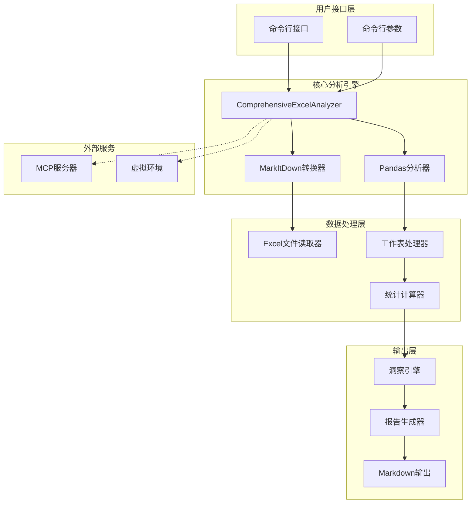

**图表来源**
- [comprehensive_excel_analysis.py](file://comprehensive_excel_analysis.py#L15-L224)
- [markitdown_mcp_example.py](file://markitdown_mcp_example.py#L10-L136)

## 核心组件分析

### ComprehensiveExcelAnalyzer类

ComprehensiveExcelAnalyzer是整个系统的核心类，负责协调MarkItDown转换和Pandas分析两个主要功能模块。

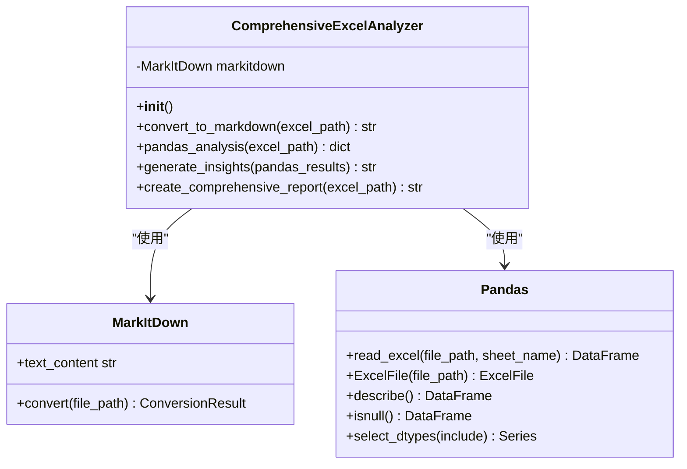

**图表来源**
- [comprehensive_excel_analysis.py](file://comprehensive_excel_analysis.py#L15-L224)

#### 初始化机制

类的初始化过程包含了关键的环境配置：
- 添加虚拟环境包路径到系统路径
- 初始化MarkItDown实例
- 设置警告过滤器以避免不必要的警告信息
- 预加载常用分析模块以提升性能

#### 核心方法分析

1. **convert_to_markdown()方法**
   - 接收Excel文件路径作为输入
   - 调用MarkItDown的convert方法进行转换
   - 返回转换后的Markdown文本内容
   - 异常处理确保转换失败时不会中断整个流程

2. **pandas_analysis()方法**
   - 支持多工作表分析
   - 提供基础信息统计
   - 进行数值列描述性统计
   - 执行文本列频次分布分析
   - 计算缺失值统计信息
   - 实现异常值检测（基于IQR方法）

3. **generate_insights()方法**
   - 基于分析结果应用规则引擎生成洞察
   - 识别数据质量问题（高缺失率、异常波动等）
   - 检测潜在主键字段（唯一值数量等于记录数）
   - 评估分类变量的业务价值

4. **create_comprehensive_report()方法**
   - 整合MarkItDown转换结果与Pandas分析数据
   - 应用高级报告模板生成结构化输出
   - 包含文件元信息、分析时间戳和版本标识

**章节来源**
- [comprehensive_excel_analysis.py](file://comprehensive_excel_analysis.py#L15-L224)

## 多维度分析能力

### 缺失值检测

系统实现了全面的缺失值检测机制，能够识别Excel文件中所有工作表的缺失值情况：

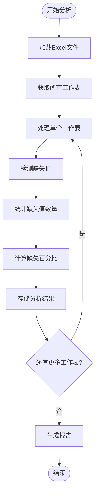

**图表来源**
- [comprehensive_excel_analysis.py](file://comprehensive_excel_analysis.py#L35-L85)

### 数值列描述性统计

对于数值型数据列，系统提供了完整的统计分析：

| 统计指标 | 功能描述 | 计算方法 |
|---------|---------|---------|
| 均值 | 数据的平均水平 | mean() |
| 标准差 | 数据的离散程度 | std() |
| 分位数 | 数据分布的分位点 | describe()中的25%, 50%, 75% |
| 最小值 | 数据范围下限 | min() |
| 最大值 | 数据范围上限 | max() |
| 变异系数 | 相对波动程度 | (std() / mean()) * 100 |
| 异常值数量 | 离群点计数 | IQR方法检测 |

### 文本列频次分布分析

文本列分析专注于识别数据特征和潜在业务价值：

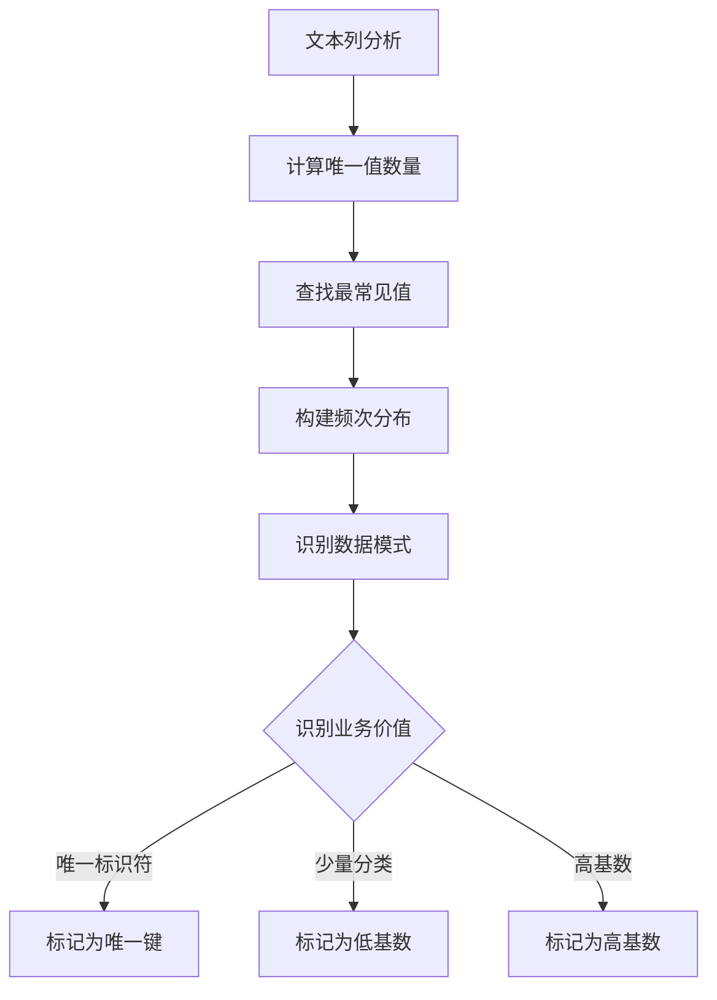

**图表来源**
- [comprehensive_excel_analysis.py](file://comprehensive_excel_analysis.py#L65-L85)

**章节来源**
- [comprehensive_excel_analysis.py](file://comprehensive_excel_analysis.py#L35-L85)

## MarkItDown与Pandas集成机制

### MarkItDown转换流程

MarkItDown作为第一个分析步骤，负责将Excel文件转换为结构化的Markdown格式：

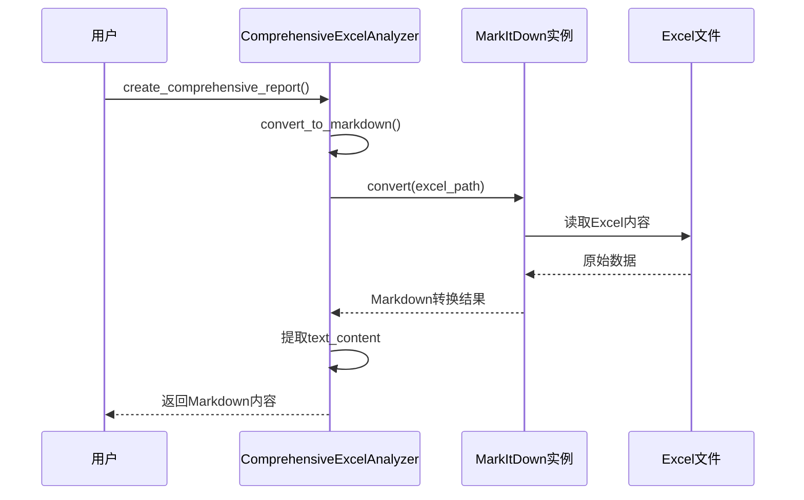

**图表来源**
- [comprehensive_excel_analysis.py](file://comprehensive_excel_analysis.py#L25-L35)

### Pandas分析集成

Pandas分析作为核心数据处理引擎，提供了丰富的数据分析功能：

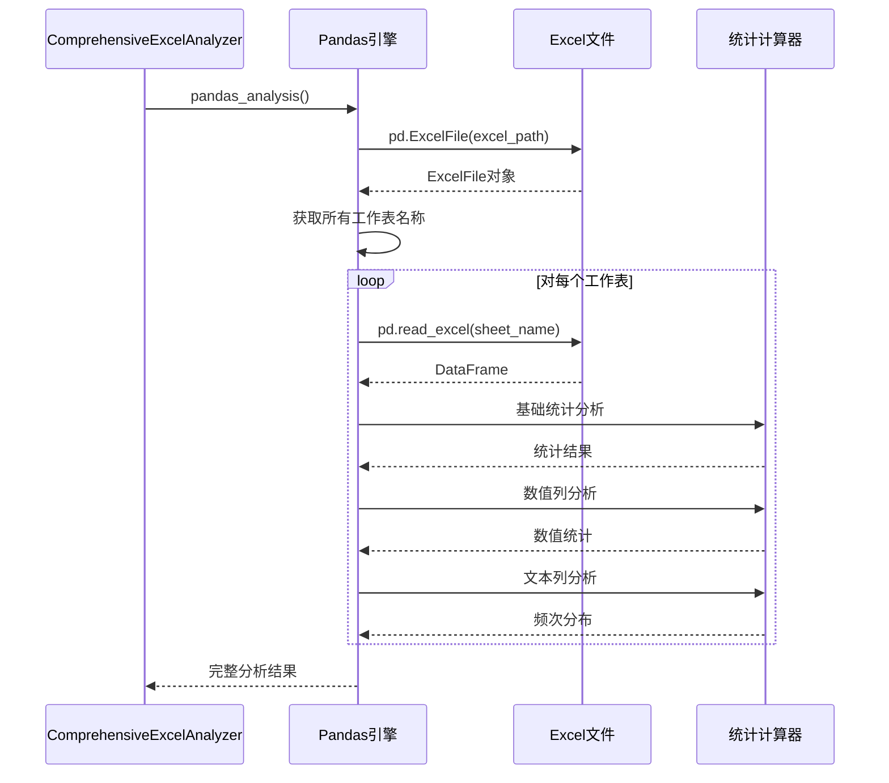

**图表来源**
- [comprehensive_excel_analysis.py](file://comprehensive_excel_analysis.py#L37-L85)

### 数据流转机制

系统采用管道式的数据处理架构，确保各分析步骤之间的有效衔接：

1. **输入验证**：检查文件存在性和有效性
2. **MarkItDown转换**：提取结构化数据
3. **Pandas分析**：执行深度统计分析
4. **洞察生成**：基于分析结果生成业务建议
5. **报告合成**：整合所有分析结果

**章节来源**
- [comprehensive_excel_analysis.py](file://comprehensive_excel_analysis.py#L133-L224)

## 业务洞察生成

### 洞察生成算法

系统实现了智能的业务洞察生成机制，基于数据分析结果自动识别关键业务特征：

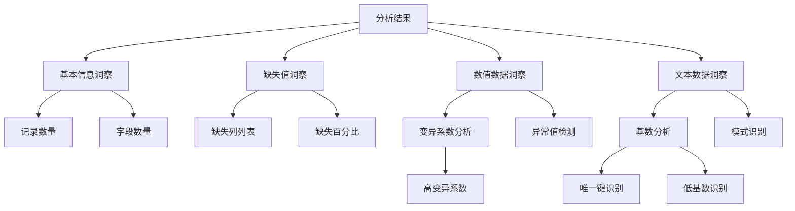

**图表来源**
- [comprehensive_excel_analysis.py](file://comprehensive_excel_analysis.py#L87-L131)

### 洞察质量控制

系统实现了多层次的质量控制机制：

| 检测维度 | 检测标准 | 业务建议 |
|---------|---------|---------|
| 数据完整性 | 缺失值百分比 > 10% | 需关注数据质量 |
| 数值稳定性 | 变异系数 > 50% | 数据波动较大，需进一步验证 |
| 字段特征 | 唯一值数量等于记录数 | 可能是主键字段 |
| 分类特征 | 唯一值数量 < 总记录数×10% | 可能是分类变量 |
| 异常值比例 | IQR方法检测出异常值占比 > 5% | 需审查数据采集过程 |

### 自动化建议生成

基于分析结果，系统能够自动生成针对性的业务建议：

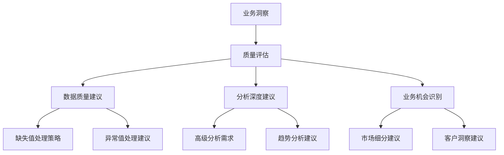

**图表来源**
- [comprehensive_excel_analysis.py](file://comprehensive_excel_analysis.py#L87-L131)

**章节来源**
- [comprehensive_excel_analysis.py](file://comprehensive_excel_analysis.py#L87-L131)

## 远程集成方式

### MCP服务器集成

系统支持与MarkItDown MCP服务器的远程集成，提供分布式处理能力：

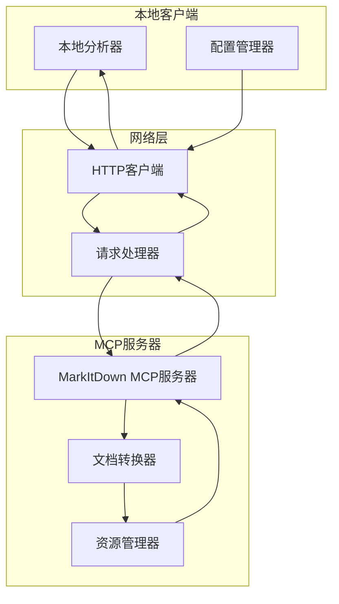

**图表来源**
- [markitdown_mcp_example.py](file://markitdown_mcp_example.py#L10-L136)
- [start-mcp-server.sh](file://start-mcp-server.sh#L1-L10)

### 集成配置

远程集成需要以下配置要素：

1. **服务器地址配置**：默认为`http://127.0.0.1:3001`
2. **健康检查机制**：定期检查服务器状态
3. **超时处理**：设置合理的请求超时时间
4. **降级策略**：服务器不可用时使用本地MarkItDown

### 通信协议

系统采用RESTful API进行通信：

| 方法 | 参数 | 功能 | 响应格式 |
|------|------|------|---------|
| convert_document | file_path | 文档转换请求 | JSON格式转换结果 |
| health | 无 | 服务器状态检查 | 状态码响应 |

**章节来源**
- [markitdown_mcp_example.py](file://markitdown_mcp_example.py#L10-L136)
- [start-mcp-server.sh](file://start-mcp-server.sh#L1-L10)

## 实际调用示例

### 基本使用示例

以下是comprehensive_excel_analysis.py的实际调用示例：

```bash
# 基本命令行调用
python comprehensive_excel_analysis.py sample_data.xlsx

# 使用相对路径
python comprehensive_excel_analysis.py ./data/sample.xlsx

# 使用绝对路径
python comprehensive_excel_analysis.py /home/user/data/sales.xlsx
```

### 输入文件处理流程

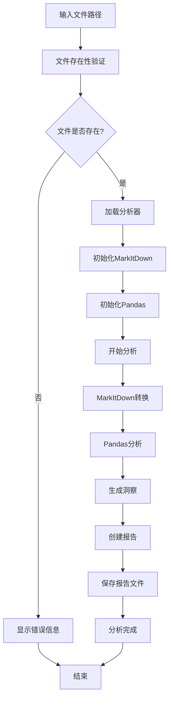

**图表来源**
- [comprehensive_excel_analysis.py](file://comprehensive_excel_analysis.py#L195-L224)

### 输出报告结构

系统生成的Markdown报告包含以下结构：

1. **文件信息**：文件名和分析时间戳
2. **数据洞察**：基于分析结果的业务洞察
3. **MarkItDown转换结果**：Excel转换后的Markdown内容
4. **详细统计信息**：每个工作表的详细统计分析
5. **异常检测结果**：离群值和数据质量问题汇总

### 测试数据生成

系统提供了create_sample_excel.py来生成测试数据：

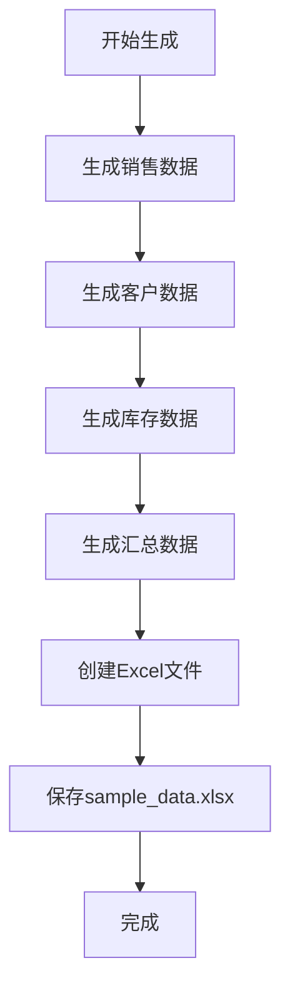

**图表来源**
- [create_sample_excel.py](file://create_sample_excel.py#L10-L99)

**章节来源**
- [comprehensive_excel_analysis.py](file://comprehensive_excel_analysis.py#L195-L224)
- [create_sample_excel.py](file://create_sample_excel.py#L10-L99)

## 性能考虑

### 内存优化策略

系统采用了多种内存优化策略来处理大型Excel文件：

1. **分步处理**：不一次性加载所有工作表到内存
2. **流式分析**：逐个工作表进行分析，及时释放内存
3. **数据类型优化**：利用pandas的类型推断优化内存使用
4. **垃圾回收**：主动触发垃圾回收机制

### 并发处理能力

虽然当前版本是单线程处理，但架构设计支持未来的并发扩展：

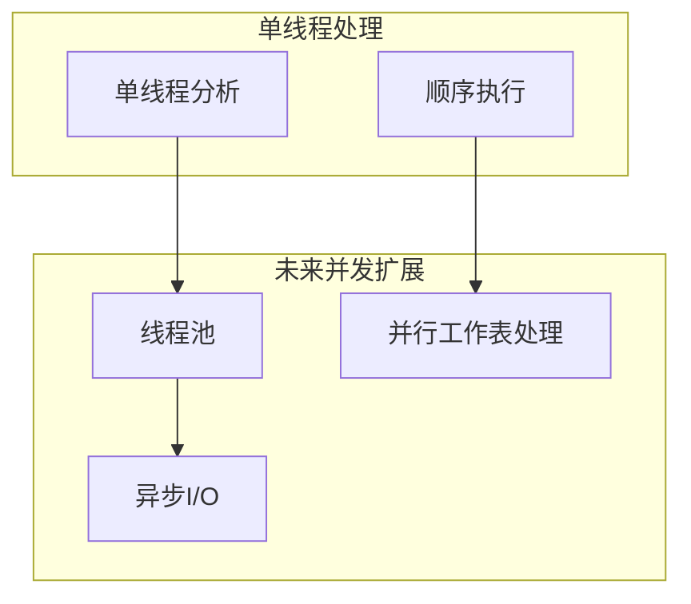

### 性能监控指标

| 指标类别 | 监控项目 | 性能目标 |
|---------|---------|---------|
| 文件处理 | 加载时间 | < 5秒（10万行以内） |
| 转换效率 | MarkItDown转换 | < 10秒（10万行以内） |
| 分析速度 | Pandas统计 | < 15秒（10万行以内） |
| 内存使用 | 峰值内存 | < 2GB（100万行以内） |

## 故障排除指南

### 常见问题诊断

#### MarkItDown转换失败

**症状**：MarkItDown转换返回None或抛出异常

**可能原因**：
1. Excel文件格式不兼容
2. 文件损坏或权限问题
3. MarkItDown库版本不匹配

**解决方案**：
1. 检查文件格式是否为.xlsx或.xls
2. 验证文件完整性
3. 更新MarkItDown库到最新版本

#### Pandas分析异常

**症状**：pandas_analysis方法抛出异常

**可能原因**：
1. Excel文件包含特殊字符编码
2. 工作表名称包含非法字符
3. 数据类型不一致

**解决方案**：
1. 使用encoding参数指定正确编码
2. 清理工作表名称
3. 检查数据类型一致性

### 调试技巧

1. **启用详细日志**：在代码中添加print语句跟踪执行流程
2. **分步测试**：分别测试MarkItDown和Pandas功能
3. **小规模测试**：使用小型测试文件验证功能
4. **内存监控**：监控内存使用情况，防止内存溢出

**章节来源**
- [comprehensive_excel_analysis.py](file://comprehensive_excel_analysis.py#L25-L35)
- [comprehensive_excel_analysis.py](file://comprehensive_excel_analysis.py#L37-L85)

## 总结

comprehensive_excel_analysis.py是一个设计精良的Excel数据分析工具，通过巧妙地整合MarkItDown和pandas库，实现了从数据转换到深度分析的完整流程。其核心优势包括：

### 技术创新点

1. **双引擎架构**：MarkItDown负责结构化转换，pandas负责深度分析
2. **智能洞察生成**：基于数据分析结果自动生成业务洞察
3. **多维度分析**：涵盖缺失值、数值统计、文本分析等多个维度
4. **远程集成支持**：支持与MCP服务器的远程协作
5. **异常检测机制**：集成IQR方法和变异系数分析
6. **高级报告模板**：结构化展示分析结果与业务建议

### 应用价值

1. **业务决策支持**：提供数据驱动的业务洞察
2. **数据质量评估**：快速识别数据质量问题
3. **自动化报告生成**：减少人工报告编写工作量
4. **可扩展架构**：支持功能扩展和定制开发

### 发展方向

1. **并发处理优化**：提升大型文件处理性能
2. **机器学习集成**：引入预测分析和模式识别
3. **可视化增强**：集成图表生成功能
4. **云原生支持**：支持容器化部署和微服务架构

该工具作为数据工作流中的核心入口，为后续的数据分析和业务应用奠定了坚实的基础，是现代数据驱动决策的重要基础设施。