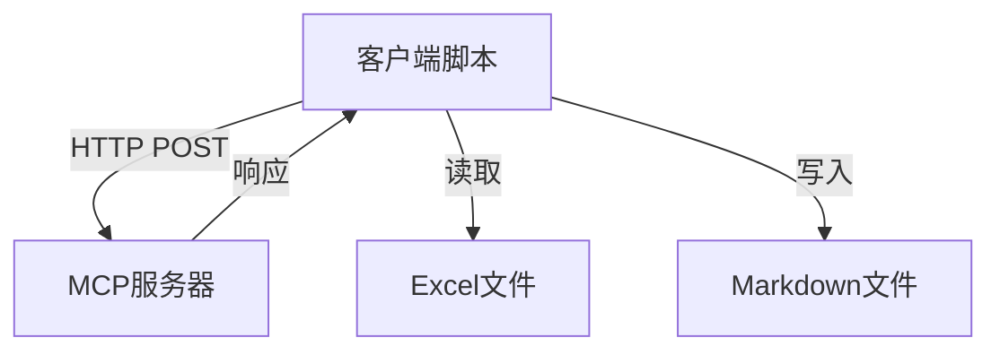
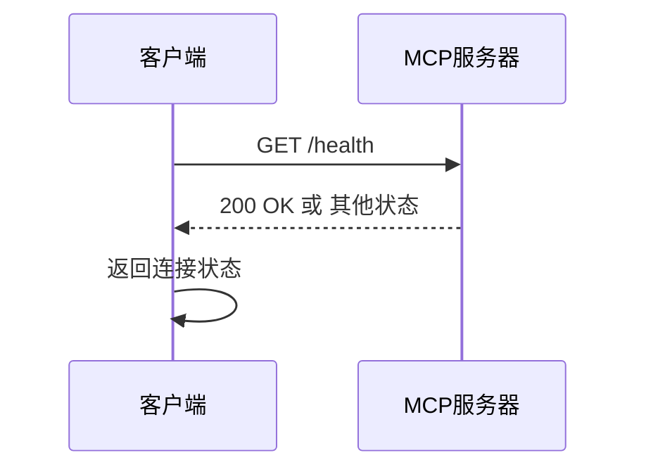
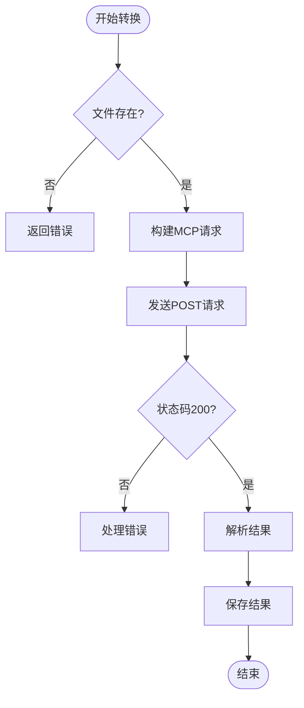
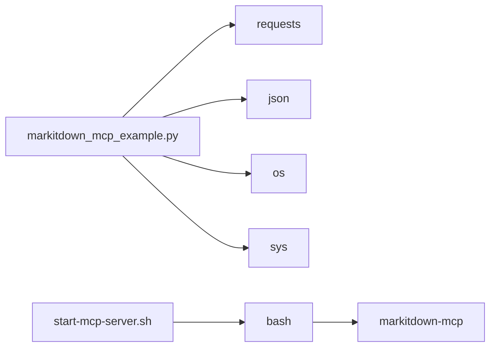

# MCP客户端调用指南

<cite>
**本文档引用的文件**  
- [markitdown_mcp_example.py](file://markitdown_mcp_example.py)
- [start-mcp-server.sh](file://start-mcp-server.sh)
- [test_data.xlsx](file://test_data.xlsx)
</cite>

## 目录
1. [简介](#简介)
2. [项目结构](#项目结构)
3. [核心组件](#核心组件)
4. [架构概述](#架构概述)
5. [详细组件分析](#详细组件分析)
6. [依赖分析](#依赖分析)
7. [性能考虑](#性能考虑)
8. [故障排除指南](#故障排除指南)
9. [结论](#结论)

## 简介
本文档深入解析`markitdown_mcp_example.py`客户端脚本的实现逻辑与使用方法。该脚本用于与MCP服务器交互，将Excel文件转换为Markdown格式。文档涵盖HTTP请求构造、响应处理、异常捕获及重试策略等内容，帮助开发者集成此客户端到自动化流程中。

## 项目结构
本项目包含多个Python脚本和配置文件，主要功能围绕Excel文件处理和MCP服务调用展开。核心文件包括客户端示例脚本、服务器启动脚本和测试数据文件。

**Section sources**
- [markitdown_mcp_example.py](file://markitdown_mcp_example.py#L1-L135)
- [start-mcp-server.sh](file://start-mcp-server.sh#L1-L9)

## 核心组件

`MarkItDownMCPClient`类是本脚本的核心，提供服务器状态检查和文档转换功能。客户端通过HTTP协议与MCP服务器通信，支持可配置的服务地址。

**Section sources**
- [markitdown_mcp_example.py](file://markitdown_mcp_example.py#L10-L62)

## 架构概述

**Diagram sources**
- [markitdown_mcp_example.py](file://markitdown_mcp_example.py#L10-L62)
- [start-mcp-server.sh](file://start-mcp-server.sh#L1-L9)

## 详细组件分析

### 客户端初始化分析
`MarkItDownMCPClient`类的构造函数接受基础URL参数，默认指向本地3001端口。这种设计允许在不同环境中灵活配置服务地址。

**Section sources**
- [markitdown_mcp_example.py](file://markitdown_mcp_example.py#L10-L13)

### 服务器状态检查分析

**Diagram sources**
- [markitdown_mcp_example.py](file://markitdown_mcp_example.py#L15-L20)

### 文档转换流程分析

**Diagram sources**
- [markitdown_mcp_example.py](file://markitdown_mcp_example.py#L22-L55)

## 依赖分析

**Diagram sources**
- [markitdown_mcp_example.py](file://markitdown_mcp_example.py#L1-L8)
- [start-mcp-server.sh](file://start-mcp-server.sh#L1-L9)

## 性能考虑
脚本设置了30秒的请求超时时间，避免长时间等待。对于大文件转换，建议根据网络状况调整超时设置。批量处理时应考虑适当的间隔时间，防止服务器过载。

## 故障排除指南
常见问题包括服务器未启动、文件路径错误和网络连接问题。脚本提供了详细的错误信息输出，帮助快速定位问题。当MCP服务器不可用时，脚本还提供了使用标准markitdown功能的备选方案。

**Section sources**
- [markitdown_mcp_example.py](file://markitdown_mcp_example.py#L64-L99)

## 结论
`markitdown_mcp_example.py`提供了一个完整的MCP客户端实现示例，展示了如何与MCP服务器交互进行文档转换。通过合理配置和错误处理，该脚本可轻松集成到各种自动化流程中，实现Excel到Markdown的批量转换。