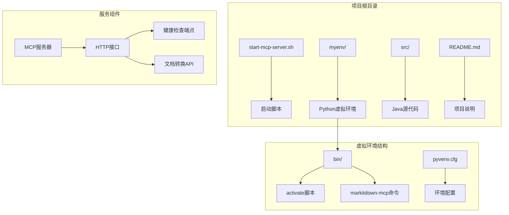
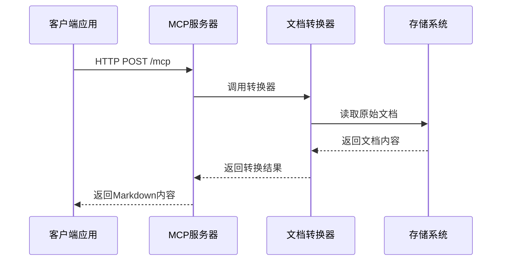
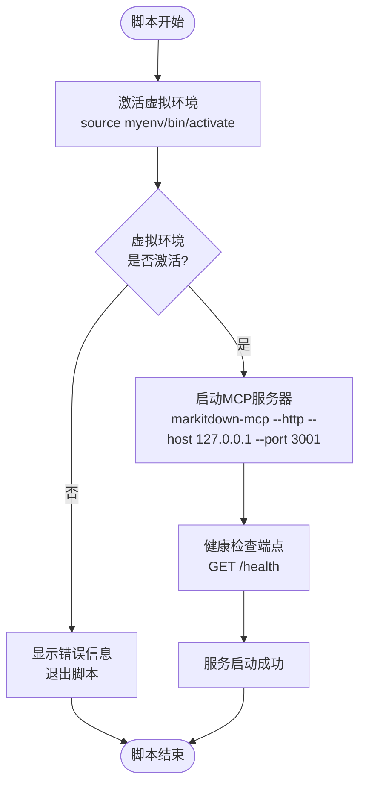
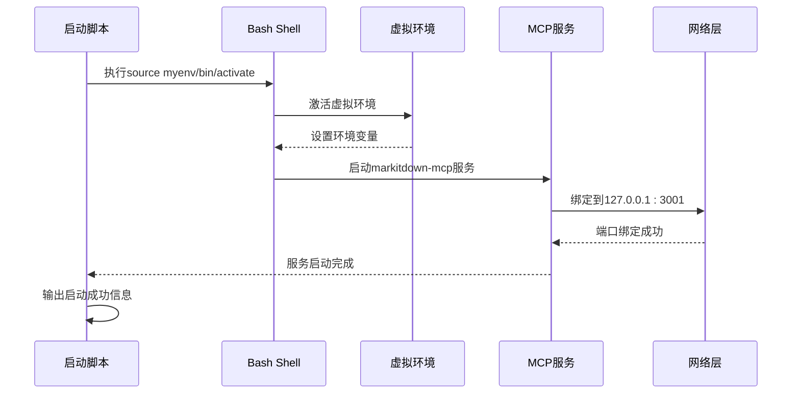
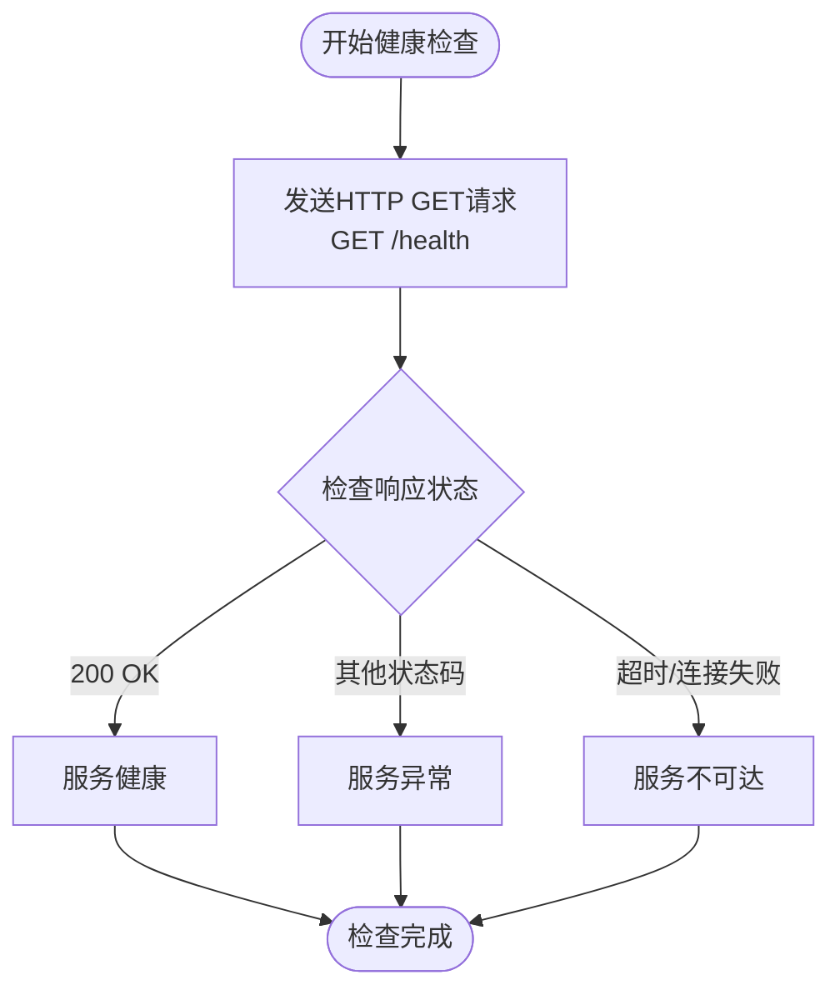

# MCP服务端配置与启动

<cite>
**本文档中引用的文件**
- [start-mcp-server.sh](file://start-mcp-server.sh)
- [markitdown_mcp_example.py](file://markitdown_mcp_example.py)
- [myenv/bin/activate.csh](file://myenv/bin/activate.csh)
- [myenv/bin/Activate.ps1](file://myenv/bin/Activate.ps1)
- [myenv/pyvenv.cfg](file://myenv/pyvenv.cfg)
- [myenv/lib/python3.13/site-packages/markitdown_mcp/__main__.py](file://myenv/lib/python3.13/site-packages/markitdown_mcp/__main__.py)
</cite>

## 目录
1. [简介](#简介)
2. [项目结构概览](#项目结构概览)
3. [MCP服务概述](#mcp服务概述)
4. [start-mcp-server.sh脚本详解](#start-mcp-serversh脚本详解)
5. [环境变量与配置参数](#环境变量与配置参数)
6. [服务启动流程](#服务启动流程)
7. [健康检查机制](#健康检查机制)
8. [常见问题排查](#常见问题排查)
9. [服务监控与日志](#服务监控与日志)
10. [最佳实践建议](#最佳实践建议)

## 简介

MarkItDown Conversion Protocol (MCP) 是一个用于文档转换的服务协议，支持将各种格式的文档转换为Markdown格式。本文档详细说明了如何通过 `start-mcp-server.sh` 脚本部署和启动MCP服务，包括环境配置、端口设置、健康检查机制以及故障排除指南。

MCP服务采用HTTP协议提供文档转换功能，支持多种输入格式（Excel、Word、PDF等），并通过RESTful API接口对外提供服务。

## 项目结构概览



**图表来源**
- [start-mcp-server.sh](file://start-mcp-server.sh#L1-L9)
- [myenv/pyvenv.cfg](file://myenv/pyvenv.cfg#L1-L4)

**章节来源**
- [start-mcp-server.sh](file://start-mcp-server.sh#L1-L9)

## MCP服务概述

MCP（MarkItDown Conversion Protocol）是一个专门设计用于文档转换的服务，具有以下核心特性：

### 主要功能
- **多格式支持**：支持Excel、Word、PDF等多种文档格式的转换
- **HTTP API**：提供RESTful风格的HTTP接口
- **实时转换**：支持实时文档转换和预览
- **可扩展架构**：支持插件式扩展和自定义转换器

### 技术架构


**图表来源**
- [markitdown_mcp_example.py](file://markitdown_mcp_example.py#L25-L50)

## start-mcp-server.sh脚本详解

### 脚本结构分析

`start-mcp-server.sh` 是一个简洁而高效的启动脚本，负责激活虚拟环境并启动MCP服务。



**图表来源**
- [start-mcp-server.sh](file://start-mcp-server.sh#L1-L9)

### 核心配置参数

#### 默认端口配置
- **默认主机地址**：`127.0.0.1`（本地回环地址）
- **默认端口号**：`3001`
- **协议类型**：HTTP

#### 命令行参数解析
脚本使用 `markitdown-mcp` 命令启动服务，支持以下参数：
- `--http`：启用HTTP协议
- `--host`：指定监听主机地址
- `--port`：指定监听端口号

**章节来源**
- [start-mcp-server.sh](file://start-mcp-server.sh#L1-L9)

## 环境变量与配置参数

### 虚拟环境配置

项目使用Python虚拟环境来隔离依赖关系，确保MCP服务的稳定运行。

#### 虚拟环境路径
- **激活脚本路径**：`myenv/bin/activate`
- **Python版本**：3.13.x
- **站点包路径**：`myenv/lib/python3.13/site-packages`

#### 环境变量设置
```bash
# 虚拟环境根目录
VIRTUAL_ENV="/Users/yuxiao/Downloads/0713demo/myenv"

# Python可执行文件路径
PYTHON_EXECUTABLE="/opt/homebrew/opt/python@3.13/bin/python3.13"

# 系统路径优先级
PATH="$VIRTUAL_ENV/bin:$PATH"
```

### 端口配置详解

#### 默认配置
- **主机地址**：`127.0.0.1`（仅本地访问）
- **端口号**：`3001`
- **协议**：HTTP

#### 自定义配置选项
可以通过修改启动脚本来自定义端口配置：

```bash
# 自定义端口配置示例
markitdown-mcp --http --host 0.0.0.0 --port 9090
```

**章节来源**
- [myenv/pyvenv.cfg](file://myenv/pyvenv.cfg#L1-L4)
- [myenv/bin/activate.csh](file://myenv/bin/activate.csh#L10-L15)

## 服务启动流程

### 启动序列图



**图表来源**
- [start-mcp-server.sh](file://start-mcp-server.sh#L1-L9)

### 启动过程详解

#### 第一阶段：环境准备
1. **虚拟环境激活**：通过 `source myenv/bin/activate` 命令激活Python虚拟环境
2. **路径更新**：更新系统的 `PATH` 变量，优先使用虚拟环境中的Python和工具
3. **依赖加载**：加载MCP服务所需的所有Python包和模块

#### 第二阶段：服务启动
1. **命令执行**：调用 `markitdown-mcp` 命令启动服务
2. **参数解析**：解析命令行参数，设置服务配置
3. **网络绑定**：绑定到指定的主机和端口
4. **服务初始化**：初始化各个服务组件和转换器

#### 第三阶段：健康检查
1. **端点可用性**：验证 `/health` 端点是否响应
2. **服务状态**：确认服务处于运行状态
3. **功能测试**：基本的功能可用性测试

**章节来源**
- [start-mcp-server.sh](file://start-mcp-server.sh#L1-L9)

## 健康检查机制

### 健康检查端点

MCP服务提供了标准化的健康检查机制，通过HTTP GET请求访问 `/health` 端点来验证服务状态。

#### 检查方法
```python
def check_server_status(self):
    """检查服务器状态"""
    try:
        response = requests.get(f"{self.base_url}/health", timeout=5)
        return response.status_code == 200
    except:
        return False
```

#### 响应格式
- **成功响应**：HTTP 200 OK
- **失败响应**：HTTP 500 或其他错误状态码
- **超时处理**：5秒超时限制

### 健康检查流程



**图表来源**
- [markitdown_mcp_example.py](file://markitdown_mcp_example.py#L18-L22)

### 健康检查客户端实现

客户端通过以下方式执行健康检查：

1. **基础URL配置**：默认使用 `http://127.0.0.1:3001`
2. **超时设置**：5秒超时限制
3. **异常处理**：捕获所有网络异常
4. **状态判断**：仅接受200状态码表示服务正常

**章节来源**
- [markitdown_mcp_example.py](file://markitdown_mcp_example.py#L18-L22)

## 常见问题排查

### 端口占用问题

#### 问题症状
- 服务启动失败，提示端口被占用
- 启动后立即停止运行
- 连接超时错误

#### 排查步骤
1. **检查端口占用**
   ```bash
   lsof -i :3001
   netstat -an | grep 3001
   ```

2. **更换端口配置**
   修改启动脚本中的端口号：
   ```bash
   markitdown-mcp --http --host 127.0.0.1 --port 9090
   ```

3. **终止占用进程**
   ```bash
   kill -9 $(lsof -t -i:3001)
   ```

### Python依赖缺失

#### 问题症状
- 启动时提示找不到模块
- 导入错误或版本不兼容
- 服务启动后立即崩溃

#### 解决方案
1. **检查虚拟环境**
   ```bash
   source myenv/bin/activate
   pip list | grep markitdown
   ```

2. **重新安装依赖**
   ```bash
   pip install markitdown-mcp
   ```

3. **验证Python版本**
   ```bash
   python --version
   # 确保使用Python 3.13.x
   ```

### 虚拟环境未激活

#### 问题症状
- 找不到 `markitdown-mcp` 命令
- Python包导入失败
- 环境变量未正确设置

#### 解决方案
1. **手动激活虚拟环境**
   ```bash
   source myenv/bin/activate
   ```

2. **检查激活状态**
   ```bash
   echo $VIRTUAL_ENV
   # 应该显示myenv路径
   ```

3. **重新创建虚拟环境**
   ```bash
   python -m venv myenv
   source myenv/bin/activate
   pip install markitdown-mcp
   ```

### 权限问题

#### 问题症状
- 脚本执行权限不足
- 无法绑定到指定端口
- 文件读写权限错误

#### 解决方案
1. **赋予执行权限**
   ```bash
   chmod +x start-mcp-server.sh
   ```

2. **以管理员身份运行**
   ```bash
   sudo ./start-mcp-server.sh
   ```

3. **检查文件权限**
   ```bash
   ls -la myenv/
   ```

### 日志分析

#### 成功启动日志示例
```
激活虚拟环境...
启动MCP Server...
INFO:     Started server process [12345]
INFO:     Waiting for application startup.
INFO:     Application startup complete.
INFO:     Uvicorn running on http://127.0.0.1:3001 (Press CTRL+C to quit)
```

#### 失败启动日志示例
```
激活虚拟环境...
启动MCP Server...
ERROR:    Error loading ASGI app. Could not import module 'markitdown_mcp'.
ERROR:    Failed to start server.
```

**章节来源**
- [start-mcp-server.sh](file://start-mcp-server.sh#L1-L9)

## 服务监控与日志

### 日志输出机制

MCP服务采用结构化日志记录，支持不同级别的日志输出：

#### 日志级别
- **INFO**：服务启动、配置加载、正常操作
- **WARNING**：潜在问题、配置警告
- **ERROR**：错误事件、异常情况
- **DEBUG**：调试信息、详细跟踪

#### 日志格式
```
[时间戳] [日志级别] [模块名称] 消息内容
```

### 性能监控指标

#### 关键性能指标
- **响应时间**：文档转换平均响应时间
- **吞吐量**：每分钟处理的文档数量
- **错误率**：转换失败的比例
- **资源使用**：CPU、内存、磁盘使用情况

#### 监控端点
```bash
# 获取服务统计信息
curl http://127.0.0.1:3001/stats

# 查看当前连接数
curl http://127.0.0.1:3001/metrics
```

### 故障恢复机制

#### 自动重启策略
- **健康检查间隔**：30秒
- **最大重试次数**：3次
- **重启间隔**：60秒

#### 降级处理
当服务出现严重错误时，自动切换到安全模式：
1. 停止新请求处理
2. 完成正在进行的请求
3. 记录错误日志
4. 尝试自动恢复

## 最佳实践建议

### 部署建议

#### 生产环境配置
1. **使用非默认端口**：避免与系统服务冲突
2. **启用HTTPS**：在生产环境中启用SSL加密
3. **配置防火墙**：限制访问来源IP
4. **设置负载均衡**：支持高并发访问

#### 监控配置
1. **定期健康检查**：每30秒检查一次服务状态
2. **日志轮转**：定期清理和归档日志文件
3. **性能告警**：设置响应时间和错误率阈值
4. **备份策略**：定期备份配置和数据

### 安全考虑

#### 访问控制
- **认证机制**：实现API密钥或OAuth认证
- **速率限制**：防止滥用和DDoS攻击
- **CORS配置**：限制跨域请求来源
- **输入验证**：严格验证上传的文档格式

#### 数据保护
- **敏感信息过滤**：自动移除文档中的敏感内容
- **传输加密**：使用TLS 1.2+加密传输
- **存储安全**：加密存储临时文件
- **审计日志**：记录所有重要操作

### 性能优化

#### 资源配置
- **内存分配**：根据文档大小调整内存限制
- **并发处理**：合理设置并发连接数
- **缓存策略**：缓存常用转换结果
- **异步处理**：支持大文件的异步转换

#### 网络优化
- **压缩传输**：启用gzip压缩
- **连接复用**：使用HTTP/2协议
- **CDN加速**：对于静态资源使用CDN
- **地理位置**：就近部署服务节点

### 维护计划

#### 定期维护任务
1. **依赖更新**：定期更新Python包和系统依赖
2. **安全补丁**：及时应用安全更新
3. **性能调优**：根据使用情况优化配置
4. **容量规划**：评估和扩展资源需求

#### 版本管理
- **版本标记**：为每次部署创建版本标签
- **回滚机制**：快速回滚到稳定版本
- **测试验证**：在部署前进行充分测试
- **变更记录**：详细记录每次变更内容

通过遵循这些最佳实践，可以确保MCP服务的稳定性、安全性和高性能运行，为用户提供可靠的文档转换服务。