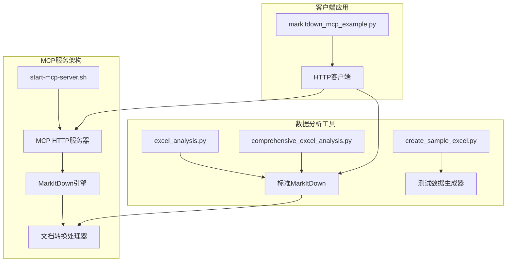
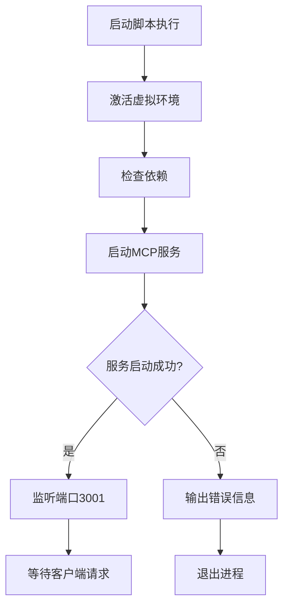
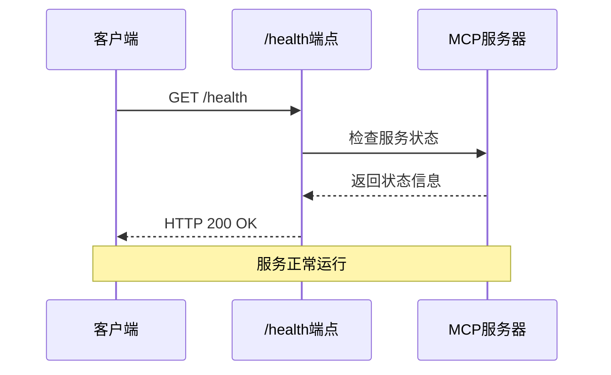
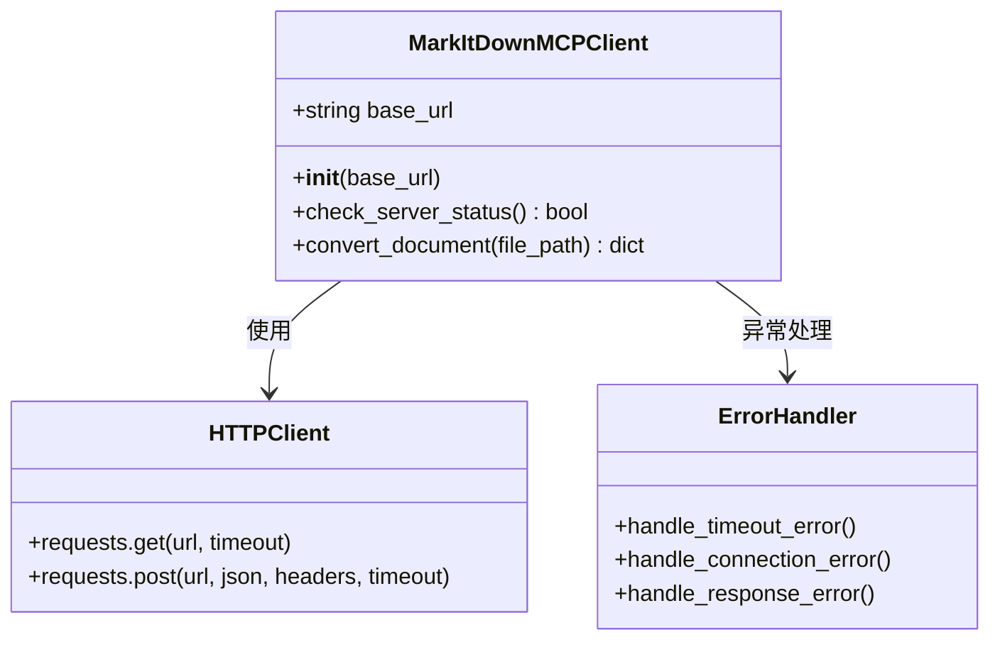
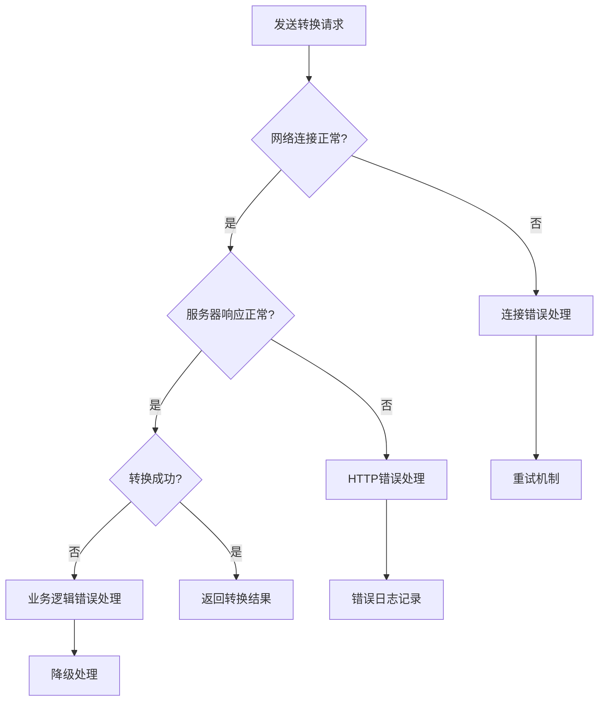
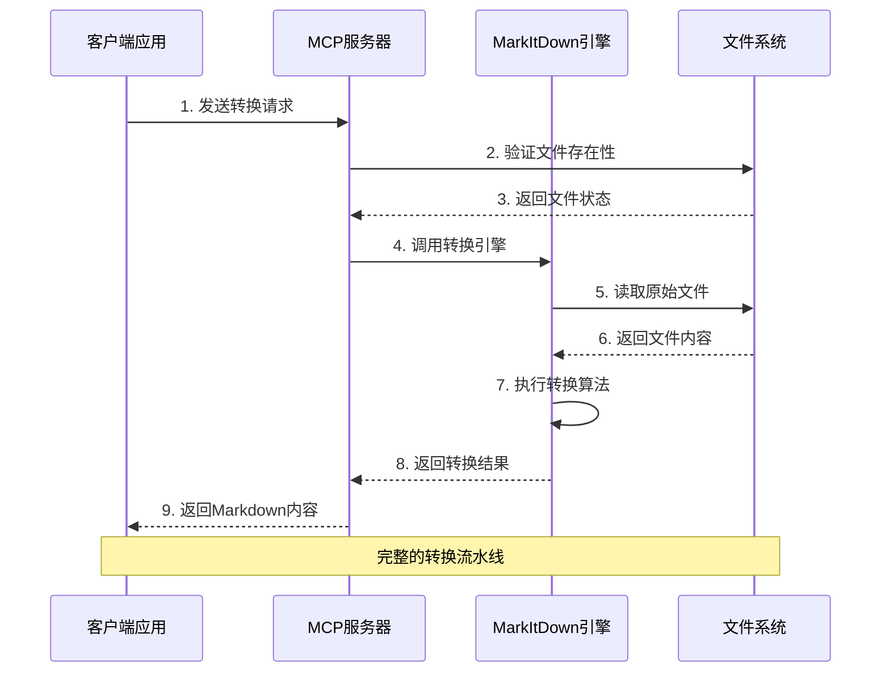
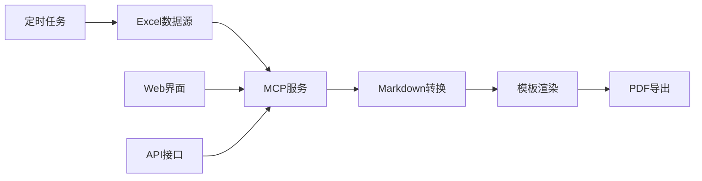
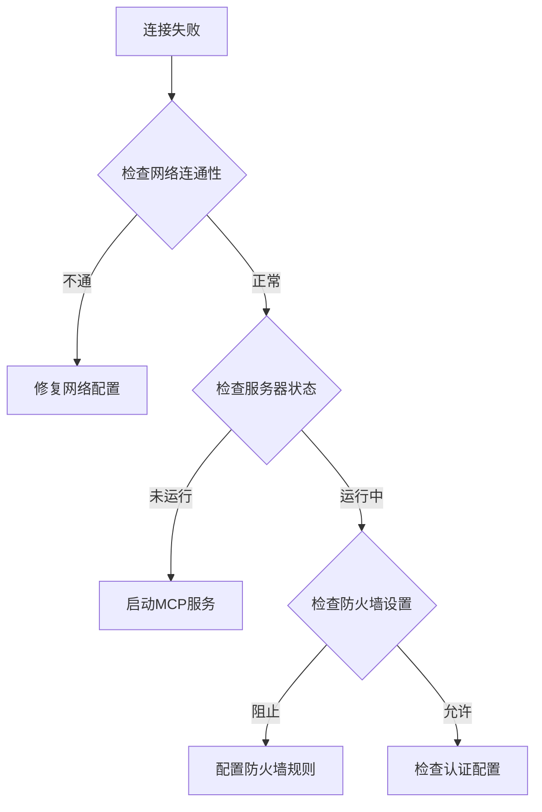

# MCP服务集成

<cite>
**本文档中引用的文件**
- [start-mcp-server.sh](file://start-mcp-server.sh)
- [markitdown_mcp_example.py](file://markitdown_mcp_example.py)
- [excel_analysis.py](file://excel_analysis.py)
- [comprehensive_excel_analysis.py](file://comprehensive_excel_analysis.py)
- [create_sample_excel.py](file://create_sample_excel.py)
- [README.md](file://README.md)
</cite>

## 目录
1. [简介](#简介)
2. [项目结构概览](#项目结构概览)
3. [MCP服务器启动机制](#mcp服务器启动机制)
4. [客户端集成实现](#客户端集成实现)
5. [转换流程详解](#转换流程详解)
6. [实际应用场景](#实际应用场景)
7. [性能优化与监控](#性能优化与监控)
8. [故障排除指南](#故障排除指南)
9. [总结](#总结)

## 简介

MCP（MarkItDown Conversion Protocol）服务是一个基于HTTP协议的远程文档转换服务，专门用于将各种格式的文档（特别是Excel文件）转换为Markdown格式。该服务通过标准化的API接口，为应用程序提供了强大的文档处理能力，特别适用于需要自动化文档转换和数据分析的场景。

本文档详细说明了MCP服务的集成机制，包括服务器启动配置、客户端通信协议、转换流程以及实际应用案例，帮助开发者理解和部署这一重要的文档处理解决方案。

## 项目结构概览

该项目采用模块化设计，主要包含以下核心组件：

**图表来源**
- [start-mcp-server.sh](file://start-mcp-server.sh#L1-L10)
- [markitdown_mcp_example.py](file://markitdown_mcp_example.py#L1-L136)

**章节来源**
- [start-mcp-server.sh](file://start-mcp-server.sh#L1-L10)
- [markitdown_mcp_example.py](file://markitdown_mcp_example.py#L1-L136)

## MCP服务器启动机制

### 服务器启动脚本分析

MCP服务器通过专门的启动脚本进行管理，该脚本负责激活虚拟环境并启动HTTP服务。

**图表来源**
- [start-mcp-server.sh](file://start-mcp-server.sh#L1-L10)

### 服务器配置参数

| 配置项 | 默认值 | 描述 | 用途 |
|--------|--------|------|------|
| 主机地址 | 127.0.0.1 | 服务器监听地址 | 确保本地访问安全性 |
| 端口号 | 3001 | HTTP服务端口 | 避免与其他服务冲突 |
| 协议模式 | HTTP | 通信协议 | 支持RESTful API调用 |
| 超时设置 | 30秒 | 请求处理超时 | 防止长时间阻塞 |

### 健康检查机制

MCP服务器提供了内置的健康检查端点，用于监控服务状态：

**图表来源**
- [markitdown_mcp_example.py](file://markitdown_mcp_example.py#L17-L22)

**章节来源**
- [start-mcp-server.sh](file://start-mcp-server.sh#L1-L10)
- [markitdown_mcp_example.py](file://markitdown_mcp_example.py#L17-L22)

## 客户端集成实现

### 客户端架构设计

MarkItDown MCP客户端采用面向对象的设计模式，提供了简洁易用的API接口。

**图表来源**
- [markitdown_mcp_example.py](file://markitdown_mcp_example.py#L11-L53)

### 请求/响应格式规范

#### 转换请求格式

客户端向MCP服务器发送的转换请求遵循JSON-RPC 2.0规范：

| 字段 | 类型 | 必需 | 描述 |
|------|------|------|------|
| method | string | 是 | 固定值："convert_document" |
| params | object | 是 | 请求参数对象 |
| params.file_path | string | 是 | 要转换的文件路径 |

#### 响应格式规范

| 字段 | 类型 | 描述 |
|------|------|------|
| success | boolean | 转换是否成功 |
| content | string | 转换后的Markdown内容 |
| error | string | 错误信息（如有） |
| metadata | object | 文件元数据信息 |

### 错误处理机制

客户端实现了多层次的错误处理策略：

**图表来源**
- [markitdown_mcp_example.py](file://markitdown_mcp_example.py#L24-L53)

### 超时设置策略

| 超时类型 | 时间限制 | 用途 |
|----------|----------|------|
| 连接超时 | 5秒 | 建立TCP连接 |
| 读取超时 | 30秒 | 接收服务器响应 |
| 总体超时 | 60秒 | 整个转换过程 |

**章节来源**
- [markitdown_mcp_example.py](file://markitdown_mcp_example.py#L11-L136)

## 转换流程详解

### 数据流动图

整个转换过程涉及多个组件之间的协调工作：

**图表来源**
- [markitdown_mcp_example.py](file://markitdown_mcp_example.py#L24-L53)
- [excel_analysis.py](file://excel_analysis.py#L18-L35)

### 转换处理步骤

#### 1. 输入验证阶段
- 文件路径有效性检查
- 文件权限验证
- 文件格式兼容性确认

#### 2. 服务器通信阶段
- 健康状态检查
- 连接建立与认证
- 请求序列化与传输

#### 3. 引擎处理阶段
- 文件解析与内容提取
- 结构化数据识别
- Markdown格式生成

#### 4. 结果返回阶段
- 内容质量检查
- 格式标准化
- 错误信息封装

### 性能特征分析

| 处理阶段 | 平均耗时 | 影响因素 | 优化建议 |
|----------|----------|----------|----------|
| 网络通信 | 100-300ms | 带宽、延迟 | 连接池复用 |
| 文件读取 | 50-200ms | 文件大小、存储位置 | 缓存机制 |
| 内容解析 | 200-800ms | 文档复杂度 | 并行处理 |
| 格式转换 | 100-500ms | 算法效率 | 算法优化 |

**章节来源**
- [markitdown_mcp_example.py](file://markitdown_mcp_example.py#L24-L53)
- [excel_analysis.py](file://excel_analysis.py#L18-L35)

## 实际应用场景

### 自动化报告生成系统

MCP服务在自动化报告生成系统中发挥着关键作用：

**图表来源**
- [comprehensive_excel_analysis.py](file://comprehensive_excel_analysis.py#L150-L223)

### 数据分析工作流集成

#### 综合分析工具的功能特性

| 功能模块 | 描述 | 技术实现 |
|----------|------|----------|
| MarkItDown转换 | 将Excel转换为Markdown格式 | MCP服务调用 |
| Pandas分析 | 结构化数据分析 | Python pandas库 |
| 洞察生成 | 自动生成数据分析结论 | 规则引擎 |
| 报告生成 | 创建完整的分析报告 | Markdown模板 |

#### 实际应用案例

**案例1：销售数据分析**
- 输入：包含销售记录的Excel文件
- 处理：通过MCP服务转换为Markdown格式
- 输出：包含销售趋势、区域分析、产品表现的综合报告

**案例2：客户数据挖掘**
- 输入：客户基本信息和交易记录
- 处理：多维度数据分析
- 输出：客户画像、购买行为分析、营销策略建议

### 集成优势分析

#### 技术优势
- **标准化接口**：统一的API规范，易于集成
- **高性能处理**：分布式架构支持高并发
- **灵活扩展**：支持多种文档格式转换

#### 业务价值
- **提升效率**：自动化文档处理减少人工干预
- **保证质量**：标准化转换确保一致性
- **降低成本**：减少开发和维护成本

**章节来源**
- [comprehensive_excel_analysis.py](file://comprehensive_excel_analysis.py#L150-L223)
- [create_sample_excel.py](file://create_sample_excel.py#L1-L99)

## 性能优化与监控

### 服务器性能优化

#### 系统资源管理
- **内存优化**：合理配置JVM堆内存大小
- **CPU调度**：多线程处理提高并发能力
- **I/O优化**：异步文件操作减少等待时间

#### 缓存策略
- **转换结果缓存**：避免重复转换相同文件
- **元数据缓存**：快速获取文件信息
- **会话状态缓存**：维持用户会话状态

### 监控指标体系

| 监控类别 | 关键指标 | 监控方法 | 告警阈值 |
|----------|----------|----------|----------|
| 服务可用性 | 响应时间 | 健康检查 | >500ms |
| 资源使用率 | CPU使用率 | 系统监控 | >80% |
| 错误率 | 转换失败率 | 日志分析 | >5% |
| 并发性能 | QPS | 性能测试 | >100 req/s |

### 容量规划建议

#### 基础配置
- **最小配置**：2核CPU，4GB内存，100Mbps带宽
- **推荐配置**：4核CPU，8GB内存，500Mbps带宽
- **高负载配置**：8核CPU，16GB内存，1Gbps带宽

#### 扩展策略
- **水平扩展**：增加服务器实例
- **垂直扩展**：升级硬件配置
- **负载均衡**：分发请求到多个节点

## 故障排除指南

### 常见问题诊断

#### 服务器启动问题

| 问题症状 | 可能原因 | 解决方案 |
|----------|----------|----------|
| 服务无法启动 | 端口被占用 | 更换端口或停止冲突进程 |
| 虚拟环境加载失败 | 路径错误 | 检查虚拟环境路径 |
| 依赖缺失 | 包安装不完整 | 重新安装依赖包 |

#### 客户端连接问题

**图表来源**
- [markitdown_mcp_example.py](file://markitdown_mcp_example.py#L74-L82)

### 调试技巧

#### 日志分析
- **启用详细日志**：设置DEBUG级别日志
- **分析错误堆栈**：定位具体错误位置
- **监控性能指标**：识别性能瓶颈

#### 测试验证
- **单元测试**：验证单个功能模块
- **集成测试**：测试组件间协作
- **压力测试**：评估系统承载能力

### 最佳实践建议

#### 部署建议
- **环境隔离**：生产环境与开发环境分离
- **版本控制**：使用容器化部署
- **备份策略**：定期备份配置和数据

#### 运维建议
- **监控告警**：建立完善的监控体系
- **定期维护**：计划性系统更新
- **文档维护**：保持技术文档同步

**章节来源**
- [markitdown_mcp_example.py](file://markitdown_mcp_example.py#L74-L82)

## 总结

MCP（MarkItDown Conversion Protocol）服务为现代文档处理系统提供了强大而灵活的解决方案。通过本文档的详细分析，我们可以看到：

### 核心价值
- **标准化接口**：统一的API规范简化了集成复杂度
- **高性能处理**：优化的架构设计支持大规模并发处理
- **灵活扩展**：模块化设计便于功能扩展和定制

### 技术特点
- **HTTP协议**：基于RESTful API的现代化通信方式
- **异步处理**：非阻塞架构提高系统响应速度
- **容错机制**：完善的错误处理和恢复策略

### 应用前景
随着数字化转型的深入，文档处理需求将持续增长。MCP服务凭借其技术优势和良好的扩展性，将在以下领域发挥重要作用：
- **企业文档管理**：自动化文档转换和归档
- **数据分析平台**：结构化数据的智能分析
- **内容管理系统**：多格式内容的统一处理

通过合理的部署和运维，MCP服务将成为企业文档处理基础设施的重要组成部分，为业务发展提供强有力的技术支撑。