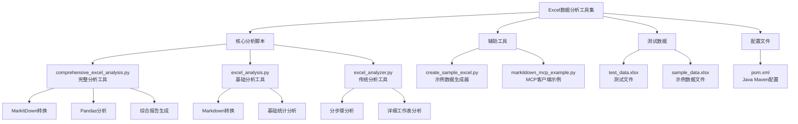
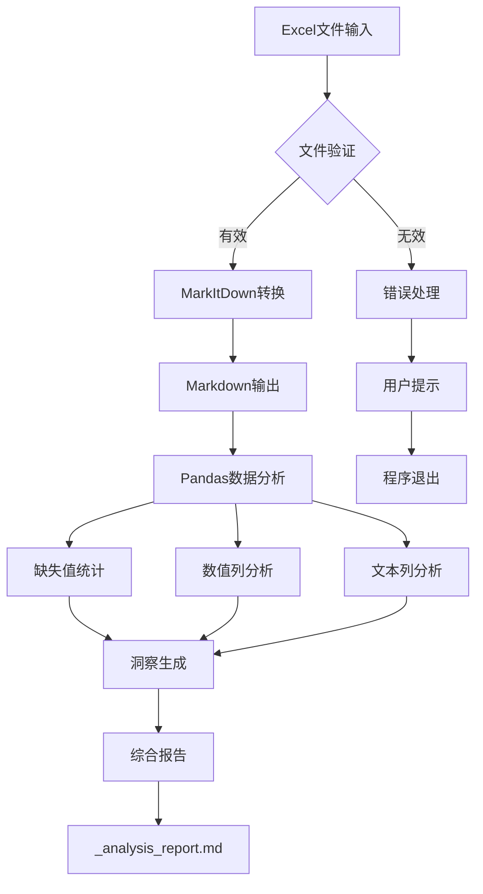
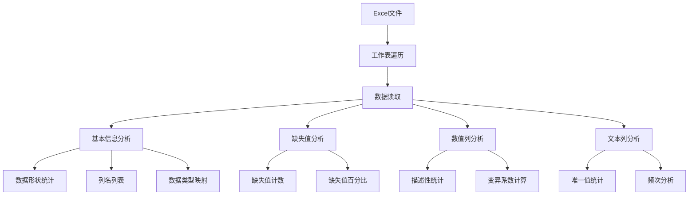

# Excel数据分析流程操作手册

<cite>
**本文档中引用的文件**
- [comprehensive_excel_analysis.py](file://comprehensive_excel_analysis.py)
- [excel_analysis.py](file://excel_analysis.py)
- [excel_analyzer.py](file://excel_analyzer.py)
- [markitdown_mcp_example.py](file://markitdown_mcp_example.py)
- [create_sample_excel.py](file://create_sample_excel.py)
- [pom.xml](file://pom.xml)
- [test_data.xlsx](file://test_data.xlsx)
- [sample_data.xlsx](file://sample_data.xlsx)
</cite>

## 目录
1. [简介](#简介)
2. [系统要求](#系统要求)
3. [项目结构](#项目结构)
4. [核心功能概述](#核心功能概述)
5. [详细使用指南](#详细使用指南)
6. [分析流程详解](#分析流程详解)
7. [报告解读指南](#报告解读指南)
8. [故障排除](#故障排除)
9. [最佳实践](#最佳实践)
10. [总结](#总结)

## 简介

本操作手册指导用户使用Excel数据分析工具进行综合性的数据探索和分析。该工具集成了MarkItDown和Pandas两大核心组件，能够将Excel文件转换为Markdown格式，执行多维度数据分析，并生成包含数据洞察建议的综合分析报告。

### 主要特性
- **自动化Excel转换**：使用MarkItDown将Excel表格转换为结构化的Markdown格式
- **全面数据分析**：利用Pandas进行缺失值统计、数值列描述性统计、文本列频次分析
- **智能洞察生成**：基于分析结果自动生成数据质量评估和业务洞察
- **多工作表支持**：支持分析包含多个工作表的Excel文件
- **交互式和批处理模式**：支持命令行参数传入和交互式输入

## 系统要求

### 环境要求
- **Python版本**：3.13或更高版本
- **操作系统**：Windows、macOS或Linux
- **内存要求**：至少512MB可用内存
- **磁盘空间**：至少100MB可用空间

### 依赖包
系统需要以下Python包：
- `markitdown`：Excel到Markdown转换引擎
- `pandas`：数据分析和处理库
- `numpy`：数值计算支持
- `openpyxl`：Excel文件读写支持
- `requests`：MCP服务器通信（可选）

### 虚拟环境配置
项目包含预配置的虚拟环境：
- 虚拟环境路径：`/Users/yuxiao/Downloads/0713demo/myenv`
- Python版本：3.13.5
- 包管理器：pip

**节来源**
- [comprehensive_excel_analysis.py](file://comprehensive_excel_analysis.py#L1-L20)
- [excel_analyzer.py](file://excel_analyzer.py#L1-L15)

## 项目结构



**图表来源**
- [comprehensive_excel_analysis.py](file://comprehensive_excel_analysis.py#L1-L30)
- [excel_analysis.py](file://excel_analysis.py#L1-L30)
- [excel_analyzer.py](file://excel_analyzer.py#L1-L30)

**节来源**
- [comprehensive_excel_analysis.py](file://comprehensive_excel_analysis.py#L1-L50)
- [excel_analysis.py](file://excel_analysis.py#L1-L50)
- [excel_analyzer.py](file://excel_analyzer.py#L1-L50)

## 核心功能概述

### 功能架构图



**图表来源**
- [comprehensive_excel_analysis.py](file://comprehensive_excel_analysis.py#L25-L100)

### 主要模块功能

| 模块 | 功能描述 | 输入 | 输出 |
|------|----------|------|------|
| MarkItDown转换器 | 将Excel表格转换为Markdown格式 | Excel文件路径 | Markdown文本内容 |
| Pandas分析器 | 执行多维度数据分析 | Excel文件路径 | 结构化分析结果 |
| 洞察生成器 | 基于分析结果生成业务洞察 | 分析结果字典 | 文本形式的洞察建议 |
| 报告生成器 | 创建综合分析报告 | 分析结果 + Markdown内容 | HTML格式报告文件 |

**节来源**
- [comprehensive_excel_analysis.py](file://comprehensive_excel_analysis.py#L25-L150)

## 详细使用指南

### 启动方式

#### 方法一：命令行参数传入文件路径
```bash
python comprehensive_excel_analysis.py /path/to/your/excel_file.xlsx
```

#### 方法二：交互式输入文件路径
```bash
python comprehensive_excel_analysis.py
```
系统将提示输入Excel文件路径。

#### 方法三：使用默认测试文件
如果当前目录存在`test_data.xlsx`文件，系统会自动使用该文件进行分析。

### 运行环境准备

1. **激活虚拟环境**
   ```bash
   source /Users/yuxiao/Downloads/0713demo/myenv/bin/activate
   ```

2. **验证依赖包安装**
   ```bash
   python -c "import markitdown, pandas; print('依赖包检查通过')"
   ```

3. **检查Python版本**
   ```bash
   python --version
   # 应显示Python 3.13.x
   ```

### 基本操作流程


**图表来源**
- [comprehensive_excel_analysis.py](file://comprehensive_excel_analysis.py#L180-L224)

**节来源**
- [comprehensive_excel_analysis.py](file://comprehensive_excel_analysis.py#L180-L224)

## 分析流程详解

### 第一阶段：MarkItDown转换（Excel → Markdown）

#### 转换过程
MarkItDown模块负责将Excel表格转换为结构化的Markdown格式，便于后续分析和处理。

**转换特点**：
- 保持表格结构和内容完整性
- 支持复杂表格格式
- 自动生成Markdown语法
- 处理特殊字符和编码

#### 转换示例
原始Excel表格：
| 日期       | 产品   | 销售额  |
|------------|--------|---------|
| 2024-01-01 | 产品A  | 1000.00 |
| 2024-01-02 | 产品B  | 1500.50 |

转换后的Markdown：
```
| 日期       | 产品   | 销售额  |
|------------|--------|---------|
| 2024-01-01 | 产品A  | 1000.00 |
| 2024-01-02 | 产品B  | 1500.50 |
```

### 第二阶段：Pandas多维度数据分析

#### 数据分析层次结构



**图表来源**
- [comprehensive_excel_analysis.py](file://comprehensive_excel_analysis.py#L55-L120)

#### 分析维度详解

##### 1. 缺失值统计
- **统计指标**：每列的缺失值数量和百分比
- **阈值设置**：超过5%的缺失值会被标记为警告
- **处理建议**：根据缺失比例提供数据清洗建议

##### 2. 数值列描述性统计
- **基础统计**：均值、中位数、标准差、最小值、最大值
- **波动性分析**：通过变异系数识别不稳定的数据字段
- **异常检测**：识别可能的异常值和数据质量问题

##### 3. 文本列频次分析
- **唯一值统计**：识别潜在的唯一标识符字段
- **分类分布**：分析文本字段的分类密度
- **高频值提取**：找出最常见的几个值及其占比

### 第三阶段：综合分析报告生成

#### 报告结构
```
# Excel数据分析报告
## 文件信息
- 文件名: [原文件名]
- 分析时间: [YYYY-MM-DD HH:MM:SS]

## 数据洞察
- 数据完整性评估
- 数值字段波动性分析
- 分类字段分布特征
- 潜在业务洞察

## MarkItDown转换结果
[Markdown格式的表格内容]

## 详细统计信息
### 工作表1
- 形状: [行数] 行 × [列数] 列
- 列名: [列名列表]
- 数值列统计: [统计信息]
```

#### 洞察生成规则

| 数据特征 | 洞察类型 | 生成条件 |
|----------|----------|----------|
| 缺失值比例 > 5% | 数据质量警告 | 缺失值统计显示高缺失率 |
| 变异系数 > 50% | 波动性警告 | 数值列统计显示高标准差 |
| 唯一值数量 = 行数 | 唯一标识符 | 文本列统计显示无重复值 |
| 唯一值数量 < 行数×0.1 | 分类字段 | 文本列统计显示低分类密度 |

**节来源**
- [comprehensive_excel_analysis.py](file://comprehensive_excel_analysis.py#L125-L180)

## 报告解读指南

### 关键信息解读

#### 1. 数据完整性评估
```
- ✅ 数据完整，无缺失值
```
**解读**：所有字段都包含完整数据，无需担心数据缺失问题。

```
- ⚠️ 发现数据缺失: [字段名1], [字段名2]
```
**解读**：某些字段存在缺失值，需要考虑数据清洗或补充策略。

#### 2. 数值字段波动性分析
```
- 🎯 [字段名] 数据波动较大 (变异系数: 65.3%)
```
**解读**：该字段的标准差相对于平均值较高，可能存在异常值或数据质量问题，建议深入调查。

#### 3. 分类字段分布特征
```
- 🔑 [字段名] 可能是唯一标识符
```
**解读**：该字段的唯一值数量等于总记录数，很可能是主键或唯一标识符。

```
- 📂 [字段名] 具有较少的分类值 (7种)
```
**解读**：该字段的分类较为集中，可能适合进行分组分析或聚类分析。

### 报告文件结构

#### 生成的文件
- **主报告**：`[文件名]_analysis_report.md`
- **中间产物**：Markdown格式的表格内容
- **临时文件**：转换过程中的中间数据

#### 报告内容组织
1. **文件元信息**：文件名、分析时间、系统信息
2. **数据洞察**：基于分析结果的业务洞察
3. **技术细节**：MarkItDown转换结果和详细统计
4. **可视化建议**：推荐的数据可视化方案

**节来源**
- [comprehensive_excel_analysis.py](file://comprehensive_excel_analysis.py#L125-L180)

## 故障排除

### 常见错误及解决方案

#### 1. 依赖包缺失错误

**错误信息**：
```
ImportError: No module named 'markitdown'
```

**解决方案**：
```bash
# 激活虚拟环境
source /Users/yuxiao/Downloads/0713demo/myenv/bin/activate

# 安装缺失的包
pip install markitdown pandas numpy openpyxl
```

#### 2. 文件路径无效

**错误信息**：
```
❌ 文件不存在或路径无效
```

**解决方案**：
- 检查文件路径是否正确
- 确认文件确实存在于指定位置
- 使用绝对路径而非相对路径
- 验证文件权限是否允许读取

#### 3. MarkItDown转换失败

**错误信息**：
```
❌ MarkItDown转换失败: [具体错误信息]
```

**解决方案**：
- 检查Excel文件格式是否正确
- 确认文件未被其他程序占用
- 尝试使用不同的Excel版本
- 检查文件是否损坏

#### 4. Pandas分析异常

**错误信息**：
```
❌ Pandas分析失败: [具体错误信息]
```

**解决方案**：
- 检查Excel文件的工作表结构
- 确认数据类型一致性
- 减少单个工作表的数据量
- 更新pandas到最新版本

### 错误处理流程


**图表来源**
- [comprehensive_excel_analysis.py](file://comprehensive_excel_analysis.py#L180-L224)

### 调试技巧

#### 1. 启用详细日志
在脚本开头添加调试信息：
```python
import logging
logging.basicConfig(level=logging.DEBUG)
```

#### 2. 分阶段测试
- 单独测试MarkItDown转换功能
- 单独测试Pandas分析功能
- 单独测试报告生成功能

#### 3. 数据验证
- 检查输入文件的完整性
- 验证工作表的数量和命名
- 确认数据类型的合理性

**节来源**
- [comprehensive_excel_analysis.py](file://comprehensive_excel_analysis.py#L180-L224)

## 最佳实践

### 数据准备最佳实践

#### 1. 文件命名规范
- 使用描述性的文件名
- 避免特殊字符和空格
- 推荐格式：`项目名称_日期_数据类型.xlsx`

#### 2. 数据组织规范
- 每个工作表专注于单一主题
- 使用清晰的列标题
- 保持数据类型一致性
- 避免混合数据类型的列

#### 3. 数据质量检查
- 在分析前手动检查数据完整性
- 确保没有隐藏的空行或空列
- 验证数据范围的合理性

### 分析流程优化

#### 1. 批处理策略
```bash
# 批量分析多个文件
for file in *.xlsx; do
    python comprehensive_excel_analysis.py "$file"
done
```

#### 2. 自动化集成
- 将分析脚本集成到ETL管道
- 设置定期自动分析任务
- 配置邮件通知机制

#### 3. 结果管理
- 定期备份分析报告
- 建立版本控制机制
- 维护分析历史记录

### 性能优化建议

#### 1. 内存管理
- 处理大型文件时启用流式处理
- 及时释放不需要的数据对象
- 监控内存使用情况

#### 2. 并行处理
- 对多个工作表并行分析
- 使用多线程处理独立的分析任务
- 优化I/O操作性能

#### 3. 缓存策略
- 缓存MarkItDown转换结果
- 复用Pandas分析中间结果
- 实现增量分析机制

**节来源**
- [comprehensive_excel_analysis.py](file://comprehensive_excel_analysis.py#L1-L50)

## 总结

Excel数据分析工具提供了完整的数据探索和分析解决方案，通过MarkItDown和Pandas的有机结合，实现了从数据转换到智能洞察的全流程自动化。

### 核心优势
- **全面性**：涵盖数据转换、分析、洞察生成的完整流程
- **智能化**：基于数据分析结果自动生成业务洞察
- **易用性**：支持多种启动方式和交互模式
- **扩展性**：模块化设计便于功能扩展和定制

### 应用场景
- **数据质量评估**：快速识别数据完整性问题
- **业务洞察发现**：从数据中挖掘有价值的业务信息
- **数据治理支持**：为数据标准化和规范化提供依据
- **决策支持**：为业务决策提供数据驱动的见解

### 发展方向
- **机器学习集成**：引入预测模型和异常检测算法
- **可视化增强**：集成图表生成功能
- **云端部署**：支持云平台部署和分布式处理
- **API接口**：提供RESTful API接口便于集成

通过遵循本操作手册的指导原则和最佳实践，用户可以充分发挥该工具的潜力，实现高效、准确的Excel数据分析工作。