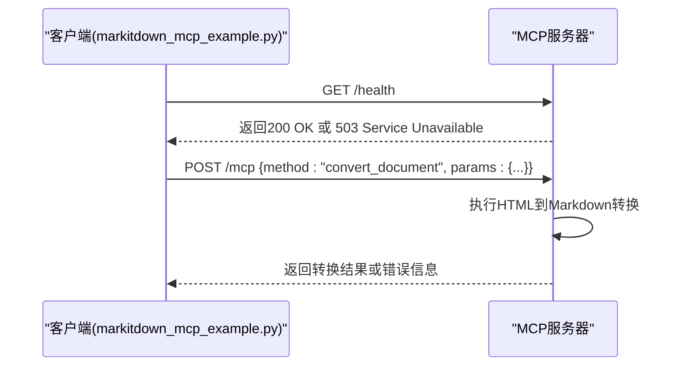

# MCP服务使用流程

<cite>
**本文档引用的文件**
- [start-mcp-server.sh](file://start-mcp-server.sh)
- [markitdown_mcp_example.py](file://markitdown_mcp_example.py)
- [README.md](file://README.md)
</cite>

## 目录
1. [简介](#简介)
2. [MCP服务启动流程](#mcp服务启动流程)
3. [客户端使用指南](#客户端使用指南)
4. [请求与响应处理](#请求与响应处理)
5. [错误处理与异常场景](#错误处理与异常场景)
6. [备选方案：本地MarkItDown直接转换](#备选方案本地markitdown直接转换)
7. [总结](#总结)

## 简介
本文档详细说明如何启动和使用MCP（MarkItDown Conversion Protocol）服务，实现HTML文档到Markdown格式的转换。该服务通过HTTP接口提供文档转换功能，支持健康检查、文档转换等核心操作，并提供客户端示例脚本演示完整使用流程。

## MCP服务启动流程

要启动MCP服务，请按照以下步骤执行：

1. **激活Python虚拟环境**：  
   在项目根目录下运行以下命令以激活预配置的Python虚拟环境：
   ```bash
   source myenv/bin/activate
   ```

2. **启动MCP服务器**：  
   执行启动脚本 `start-mcp-server.sh`，该脚本将启动基于Python的HTTP服务，监听 `127.0.0.1:3001` 地址：
   ```bash
   ./start-mcp-server.sh
   ```

   该服务启动后，将在本地监听端口3001，提供 `/health` 和 `/mcp` 两个主要端点。

**Section sources**
- [start-mcp-server.sh](file://start-mcp-server.sh#L1-L20)

## 客户端使用指南

在MCP服务成功启动后，可通过 `markitdown_mcp_example.py` 脚本作为客户端与其交互。使用步骤如下：

1. **运行客户端脚本**：  
   执行以下命令运行示例客户端：
   ```bash
   python markitdown_mcp_example.py
   ```

2. **健康状态检查**：  
   脚本首先会向 `http://127.0.0.1:3001/health` 发送GET请求，验证MCP服务是否正常运行。

3. **构造文档转换请求**：  
   使用 `convert_document` 方法构造MCP请求体，指定待转换的HTML文件路径（如 `travel_tips_宁强1.html`）及目标格式。

4. **发送POST请求进行转换**：  
   将构造好的请求通过POST方法发送至 `http://127.0.0.1:3001/mcp` 端点，触发文档转换流程。

**Section sources**
- [markitdown_mcp_example.py](file://markitdown_mcp_example.py#L1-L50)

## 请求与响应处理

客户端与MCP服务之间的通信遵循以下流程：



**Diagram sources**
- [markitdown_mcp_example.py](file://markitdown_mcp_example.py#L20-L40)
- [start-mcp-server.sh](file://start-mcp-server.sh#L10-L15)

## 错误处理与异常场景

### 服务未启动时的连接错误
当MCP服务未运行时，客户端尝试连接将收到连接拒绝错误，示例如下：
```
ConnectionError: Unable to connect to http://127.0.0.1:3001. Please ensure the MCP server is running.
```

### 健康检查失败
若服务处于异常状态，`/health` 端点将返回非200状态码（如503），客户端应据此判断服务不可用。

### 文档转换失败
当请求参数错误或文件不存在时，`/mcp` 端点将返回包含错误详情的JSON响应，例如：
```json
{"error": {"code": 400, "message": "File not found: travel_tips_宁强1.html"}}
```

**Section sources**
- [markitdown_mcp_example.py](file://markitdown_mcp_example.py#L45-L80)

## 备选方案：本地MarkItDown直接转换

当MCP服务不可用时，可使用本地安装的MarkItDown工具直接进行文档转换：

1. 确保虚拟环境已激活并安装了MarkItDown库。
2. 在Python脚本中直接调用本地转换函数，示例代码逻辑如下：
   ```python
   from markitdown import convert_html_to_markdown
   result = convert_html_to_markdown("travel_tips_宁强1.html")
   with open("output.md", "w", encoding="utf-8") as f:
       f.write(result)
   ```
3. 转换结果将保存为本地Markdown文件，无需依赖网络服务。

此方式适用于离线环境或服务部署失败的应急场景。

**Section sources**
- [markitdown_mcp_example.py](file://markitdown_mcp_example.py#L85-L100)

## 总结

本文档全面介绍了MCP服务的启动、客户端调用、请求响应流程及异常处理机制。通过 `start-mcp-server.sh` 启动服务后，使用 `markitdown_mcp_example.py` 可实现自动化文档转换。同时提供了服务不可用时的本地转换备选方案，确保系统具备良好的容错能力。