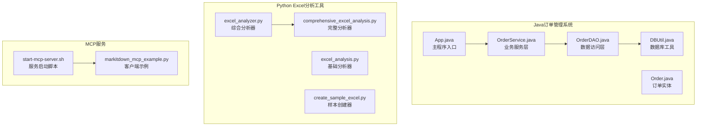
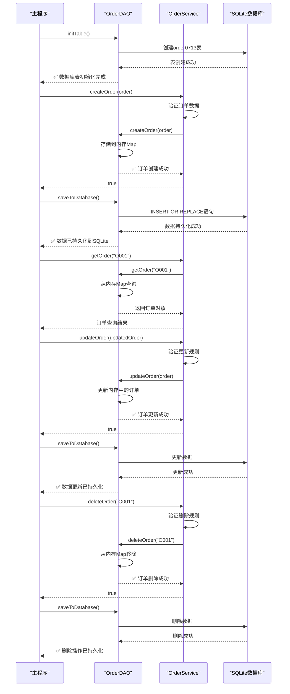
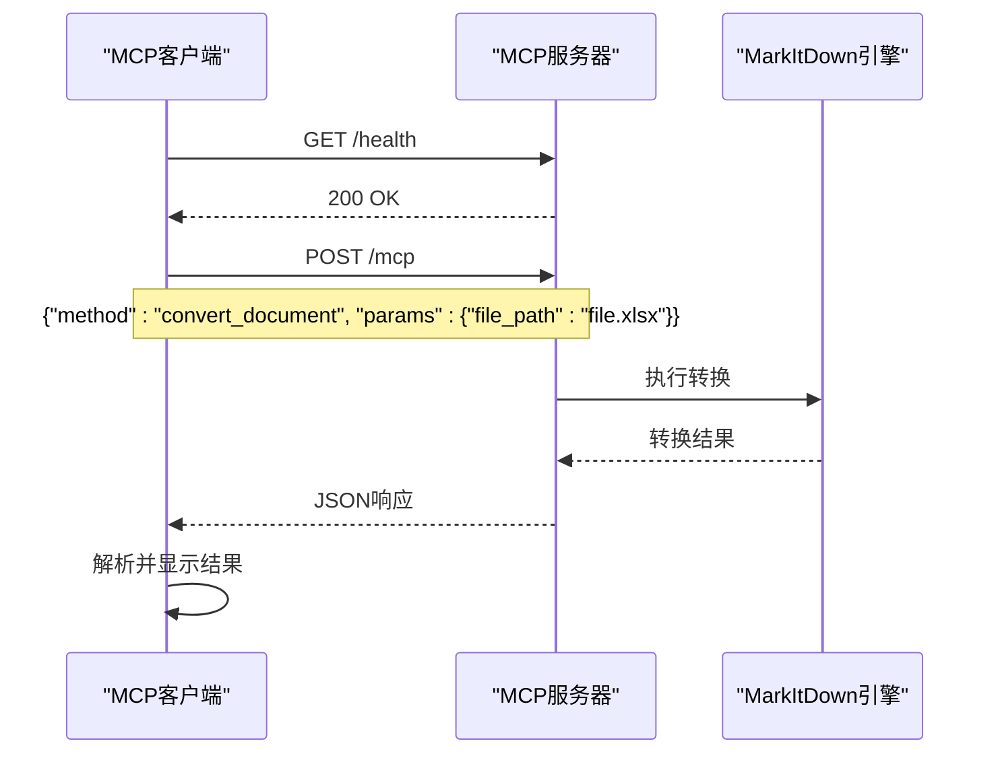

# 使用指南

<cite>
**本文档中引用的文件**
- [README.md](file://README.md)
- [App.java](file://src/main/java/com/example/demo/App.java)
- [Order.java](file://src/main/java/com/example/demo/entity/Order.java)
- [OrderService.java](file://src/main/java/com/example/demo/service/OrderService.java)
- [OrderDAO.java](file://src/main/java/com/example/demo/dao/OrderDAO.java)
- [DBUtil.java](file://src/main/java/com/example/demo/dao/DBUtil.java)
- [comprehensive_excel_analysis.py](file://comprehensive_excel_analysis.py)
- [excel_analysis.py](file://excel_analysis.py)
- [excel_analyzer.py](file://excel_analyzer.py)
- [create_sample_excel.py](file://create_sample_excel.py)
- [markitdown_mcp_example.py](file://markitdown_mcp_example.py)
- [start-mcp-server.sh](file://start-mcp-server.sh)
</cite>

## 目录
1. [简介](#简介)
2. [项目结构概览](#项目结构概览)
3. [订单管理流程](#订单管理流程)
4. [Excel分析流程](#excel分析流程)
5. [MCP服务使用流程](#mcp服务使用流程)
6. [常见问题解决方案](#常见问题解决方案)
7. [总结](#总结)

## 简介

本指南为开发者提供了三个核心工作流的操作说明，涵盖了Java订单管理系统、Python Excel数据分析工具和MarkItDown MCP服务的完整使用流程。每个流程都包含详细的步骤说明、输入输出示例和故障排除指导。

## 项目结构概览

该项目采用分层架构设计，包含以下主要组件：



**图表来源**
- [App.java](file://src/main/java/com/example/demo/App.java#L1-L62)
- [Order.java](file://src/main/java/com/example/demo/entity/Order.java#L1-L143)
- [OrderService.java](file://src/main/java/com/example/demo/service/OrderService.java#L1-L81)
- [OrderDAO.java](file://src/main/java/com/example/demo/dao/OrderDAO.java#L1-L148)

**章节来源**
- [App.java](file://src/main/java/com/example/demo/App.java#L1-L62)
- [Order.java](file://src/main/java/com/example/demo/entity/Order.java#L1-L143)
- [OrderService.java](file://src/main/java/com/example/demo/service/OrderService.java#L1-L81)
- [OrderDAO.java](file://src/main/java/com/example/demo/dao/OrderDAO.java#L1-L148)

## 订单管理流程

### 流程概述

订单管理流程展示了Java应用程序的核心功能，包括订单的创建、查询、更新和删除操作。该流程基于App.java的main方法，演示了完整的订单生命周期管理。

### 操作步骤

#### 1. 环境准备

确保Java开发环境已正确配置：
- JDK 11或更高版本
- Maven构建工具
- SQLite数据库支持

#### 2. 启动应用程序

```bash
# 进入项目根目录
cd /Users/yuxiao/Downloads/0713demo1103

# 编译Java代码
mvn compile

# 运行主程序
java -cp target/classes com.example.demo.App
```

#### 3. 执行订单操作序列

应用程序按照以下顺序执行订单操作：



**图表来源**
- [App.java](file://src/main/java/com/example/demo/App.java#L10-L55)
- [OrderService.java](file://src/main/java/com/example/demo/service/OrderService.java#L15-L80)
- [OrderDAO.java](file://src/main/java/com/example/demo/dao/OrderDAO.java#L20-L147)

#### 4. 预期输出结果

执行完成后，控制台将显示以下输出：

```
✅ 数据库表初始化完成
✅ 订单创建成功
✅ 数据已持久化到SQLite
🔍 查询结果: Order{orderId='O001', userId='U100', productId='P200', quantity=2, totalAmount=99.99, status=0, createTime=..., payTime=null, updateTime=...}
✅ 订单更新成功
✅ 数据更新已持久化
✅ 订单删除成功
✅ 删除操作已持久化
```

#### 5. 结果验证方法

- **数据库验证**：检查`test.db`文件中的`order0713`表是否为空
- **内存验证**：确认OrderDAO的orderMap中不再包含订单ID为"O001"的记录
- **状态验证**：验证订单状态按预期变化（创建→更新→删除）

**章节来源**
- [App.java](file://src/main/java/com/example/demo/App.java#L10-L55)
- [Order.java](file://src/main/java/com/example/demo/entity/Order.java#L15-L142)
- [OrderService.java](file://src/main/java/com/example/demo/service/OrderService.java#L15-L80)
- [OrderDAO.java](file://src/main/java/com/example/demo/dao/OrderDAO.java#L20-L147)

## Excel分析流程

### 流程概述

Excel分析流程提供了三种不同的数据分析工具，支持从简单的基本分析到复杂的综合报告生成。用户可以根据需求选择合适的分析工具。

### 操作步骤

#### 1. 准备测试数据

首先创建示例Excel文件：

```bash
# 运行样本创建脚本
python create_sample_excel.py
```

这将生成包含销售数据、客户数据、库存数据和汇总信息的`sample_data.xlsx`文件。

#### 2. 基础分析流程

使用`excel_analysis.py`进行快速分析：

```bash
# 基础分析
python excel_analysis.py sample_data.xlsx

# 或者不带参数，手动输入文件路径
python excel_analysis.py
```

**预期输出**：
```
Excel数据分析工具
=================
请输入Excel文件路径: sample_data.xlsx

1. 使用MarkItDown转换Excel为Markdown:
转换成功！
转换后的Markdown内容（前100字符）...

2. 使用Pandas进行数据分析:
分析结果:
  文件名: sample_data.xlsx
  数据形状: 行数: 200, 列数: 7
  列名: ['日期', '产品名称', '地区', '销售数量', '单价', '折扣率', '销售员']
  基本统计: {...}
  缺失值: {...}
```

#### 3. 综合分析流程

使用`excel_analyzer.py`进行深度分析：

```bash
# 综合分析
python excel_analyzer.py sample_data.xlsx

# 或使用命令行参数
python excel_analyzer.py sample_data.xlsx
```

**预期输出**：
```
🎯 Excel数据分析工具
==================================================
📁 分析文件: sample_data.xlsx

🔄 步骤1: 使用MarkItDown转换Excel为Markdown格式
----------------------------------------
✅ 转换成功!

📋 表格内容:
| 列1 | 列2 | 列3 |
|-----|-----|-----|
| ... |

📊 步骤2: 使用Pandas进行数据分析
----------------------------------------
📋 工作表数量: 4
工作表名称: 销售数据, 客户数据, 库存数据, 数据汇总

🔍 分析工作表: 销售数据
--------------------
• 数据形状: 200 行 × 7 列
• 列名: 日期, 产品名称, 地区, 销售数量, 单价, 折扣率, 销售员
⚠️  发现缺失值:
    折扣率: 5 个 (2.5%)
...
```

#### 4. 完整分析流程

使用`comprehensive_excel_analysis.py`生成详细报告：

```bash
# 完整分析
python comprehensive_excel_analysis.py sample_data.xlsx

# 或使用默认测试文件
python comprehensive_excel_analysis.py
```

**预期输出**：
```
🎯 开始分析文件: sample_data.xlsx
==================================================
📊 Excel数据分析工具已初始化
🔄 正在使用MarkItDown转换: sample_data.xlsx
📈 正在使用Pandas分析: sample_data.xlsx

## 销售数据 工作表洞察
- 📊 包含 200 条记录和 7 个字段
- ⚠️ 发现数据缺失: 折扣率
- 📈 数值字段: 销售数量, 单价, 折扣率, 销售额
  - 🎯 销售数量 数据波动较大 (变异系数: 45.2%)

📄 分析报告已保存: sample_data_analysis_report.md
```

### 输入输出示例

#### 输入文件结构
生成的`sample_data.xlsx`包含四个工作表：
- **销售数据**：200行×7列，包含销售交易记录
- **客户数据**：50行×7列，包含客户信息
- **库存数据**：5行×6列，包含产品库存信息
- **数据汇总**：5行×2列，包含关键指标汇总

#### 输出报告结构
生成的Markdown报告包含：
- 文件基本信息
- MarkItDown转换结果
- 数据洞察分析
- 详细统计信息
- 工作表特定分析

**章节来源**
- [create_sample_excel.py](file://create_sample_excel.py#L1-L99)
- [excel_analysis.py](file://excel_analysis.py#L1-L128)
- [excel_analyzer.py](file://excel_analyzer.py#L1-L223)
- [comprehensive_excel_analysis.py](file://comprehensive_excel_analysis.py#L1-L224)

## MCP服务使用流程

### 流程概述

MCP（Model Context Protocol）服务提供了一个标准化的接口来处理文档转换任务。该流程包括启动MCP服务器、配置客户端连接和执行文档转换请求。

### 操作步骤

#### 1. 启动MCP服务器

```bash
# 激活虚拟环境并启动服务器
cd /Users/yuxiao/Downloads/0713demo1103
source start-mcp-server.sh
```

**预期输出**：
```
激活虚拟环境...
启动MCP Server...
```

服务器将在本地启动，监听HTTP请求。

#### 2. 验证服务器状态

```bash
# 检查服务器是否正常运行
curl http://127.0.0.1:3001/health
```

**预期响应**：
```
200 OK
```

#### 3. 执行文档转换

使用`markitdown_mcp_example.py`发送转换请求：

```bash
# 使用默认测试文件
python markitdown_mcp_example.py

# 或指定特定文件
python markitdown_mcp_example.py sample_data.xlsx
```

**预期输出**：
```
🚀 MarkItDown MCP 客户端示例
==================================================
🔍 检查MCP服务器状态...
✅ MCP服务器运行正常

📋 转换结果:
{
  "text_content": "# 转换后的Markdown内容...",
  "metadata": {
    "conversion_time": "...",
    "original_format": "excel",
    "estimated_size": "..."
  }
}

🎉 示例完成!
```

#### 4. 降级处理机制

如果MCP服务器不可用，客户端会自动降级到标准MarkItDown模式：

```bash
# 当MCP服务器不可用时的输出
⚠️ MCP服务器未运行或无法连接
请先启动服务器: markitdown-mcp --http

📋 使用标准MarkItDown进行转换
🔄 转换文件: test_data.xlsx
✅ 转换成功!
📋 结果:
# MarkItDown 转换结果

源文件: test_data.xlsx

| 表格标题 |
|----------|
| 数据内容 |
```

### 通信协议



**图表来源**
- [markitdown_mcp_example.py](file://markitdown_mcp_example.py#L15-L50)
- [start-mcp-server.sh](file://start-mcp-server.sh#L1-L10)

### 常见问题解决方案

#### 1. 服务器启动失败
**问题**：MCP服务器无法启动
**解决方案**：
- 检查虚拟环境是否正确激活
- 确认端口3001未被占用
- 验证markitdown-mcp包已安装

#### 2. 连接超时
**问题**：客户端无法连接到服务器
**解决方案**：
- 确认服务器已在后台运行
- 检查防火墙设置
- 验证网络连接

#### 3. 转换失败
**问题**：文档转换过程中出现错误
**解决方案**：
- 检查文件格式是否受支持
- 验证文件路径是否正确
- 查看服务器日志获取详细错误信息

**章节来源**
- [markitdown_mcp_example.py](file://markitdown_mcp_example.py#L1-L136)
- [start-mcp-server.sh](file://start-mcp-server.sh#L1-L10)

## 常见问题解决方案

### Java订单管理系统

#### 1. 数据库连接失败
**症状**：`java.sql.SQLException: Access denied for user`
**解决方案**：
- 检查DBUtil.java中的数据库URL配置
- 确认SQLite驱动已正确添加到项目依赖
- 验证目标目录具有写入权限

#### 2. 订单状态异常
**症状**：订单状态不符合预期
**解决方案**：
- 检查OrderService中的业务规则逻辑
- 验证状态转换的有效性
- 确认更新操作的原子性

### Python Excel分析工具

#### 1. 依赖包缺失
**症状**：ImportError: No module named 'markitdown'
**解决方案**：
- 激活正确的虚拟环境
- 安装所需依赖：`pip install markitdown pandas openpyxl`
- 检查PYTHONPATH配置

#### 2. 文件格式不支持
**症状**：Excel文件无法读取
**解决方案**：
- 确认文件格式为.xlsx或.xls
- 检查文件是否损坏
- 验证文件编码格式

### MCP服务

#### 1. 服务端口冲突
**症状**：端口3001已被占用
**解决方案**：
- 修改start-mcp-server.sh中的端口号
- 使用`lsof -i :3001`查找占用进程
- 重启系统释放端口

#### 2. 转换性能问题
**症状**：大文件转换耗时过长
**解决方案**：
- 增加服务器内存配置
- 优化MarkItDown转换参数
- 考虑分块处理大型文件

## 总结

本指南详细介绍了三个核心工作流的操作方法：

1. **订单管理流程**：展示了Java应用程序的完整订单生命周期管理，包括CRUD操作和数据库持久化
2. **Excel分析流程**：提供了从基础到高级的多种数据分析工具，支持多种输出格式
3. **MCP服务流程**：演示了现代化的文档转换服务架构，具备降级处理能力

每个流程都包含了详细的步骤说明、预期输出和故障排除指导，帮助开发者快速上手并解决常见问题。建议开发者根据实际需求选择合适的工作流，并参考相应的最佳实践进行部署和维护。