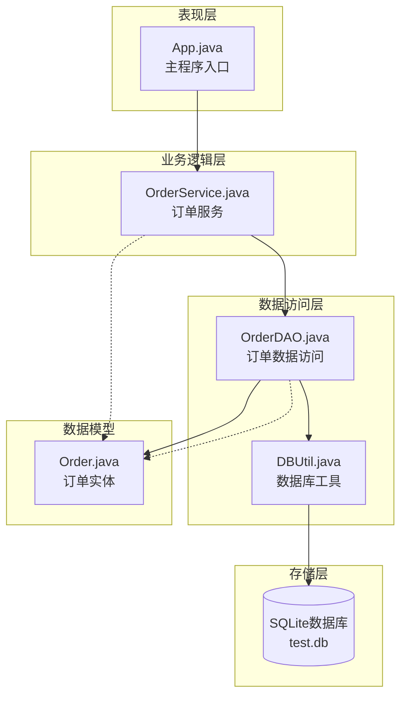
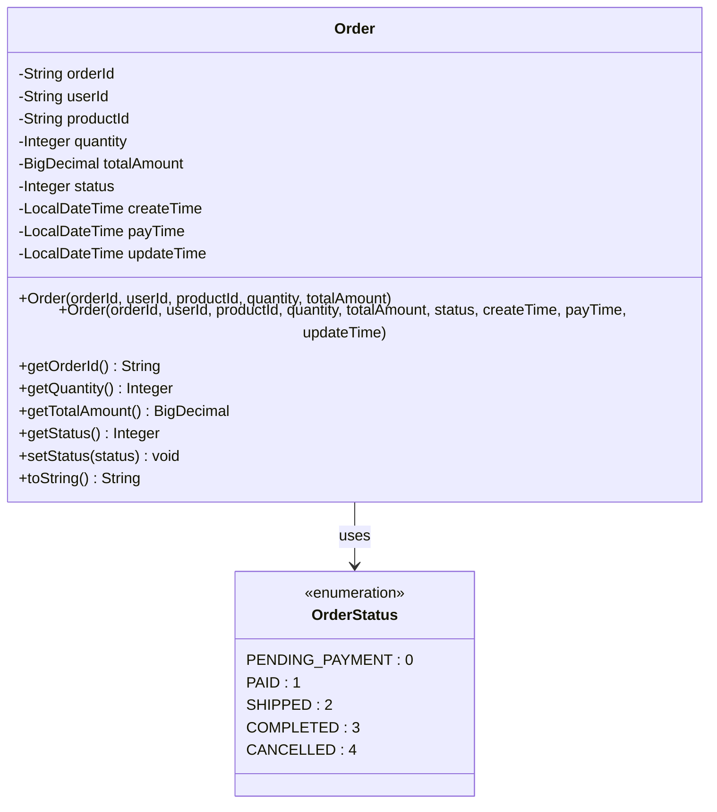
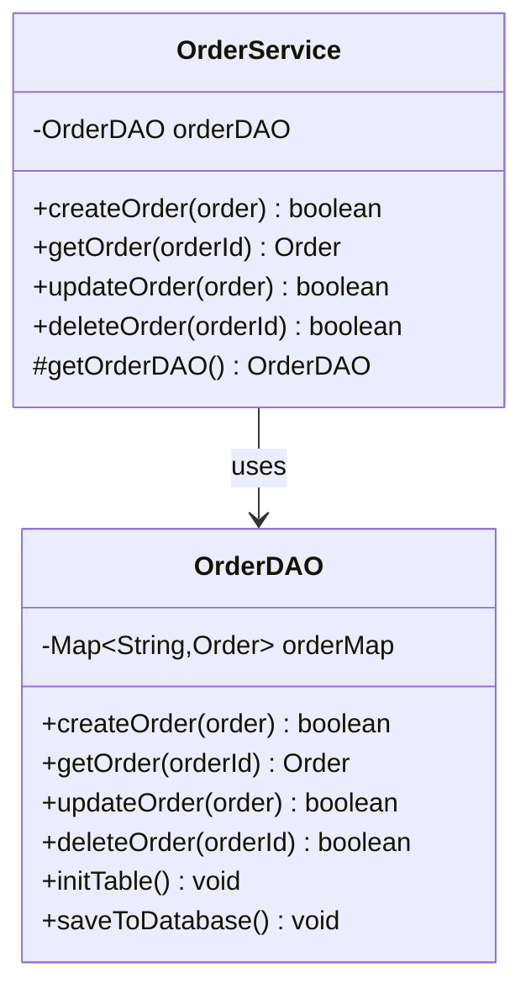
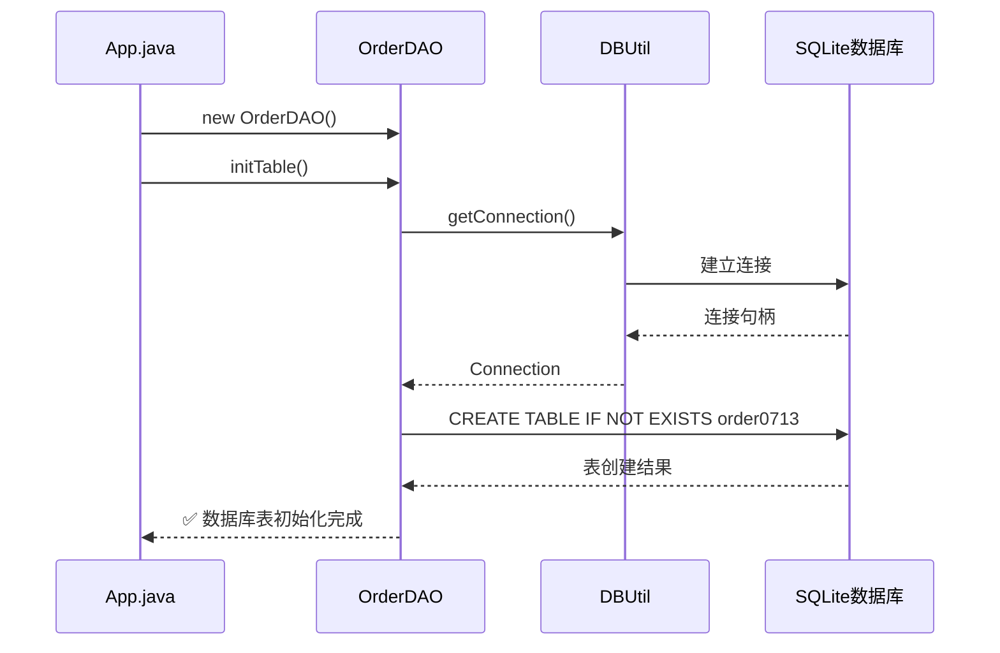
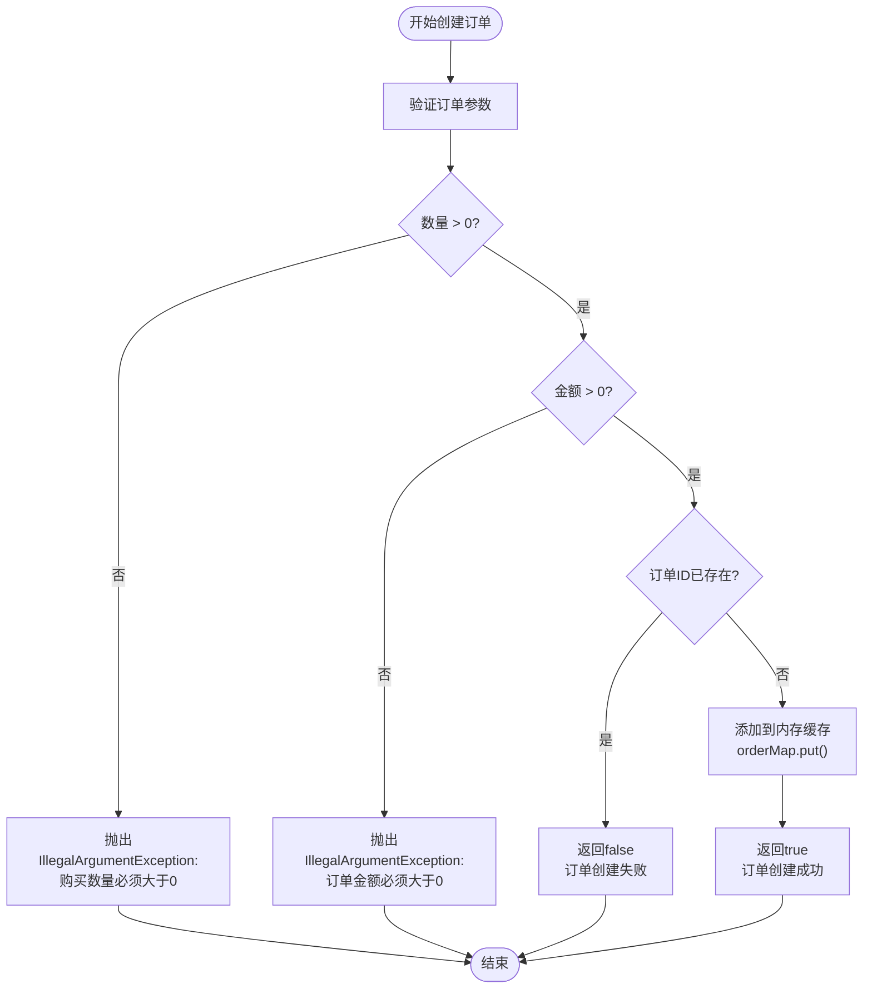
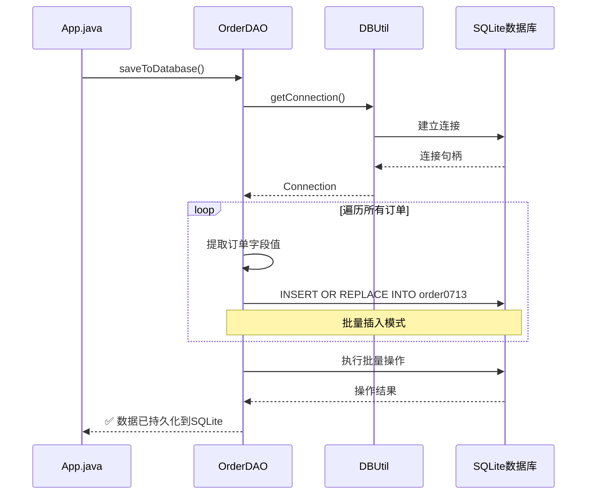
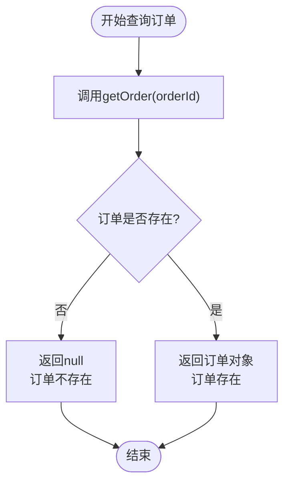
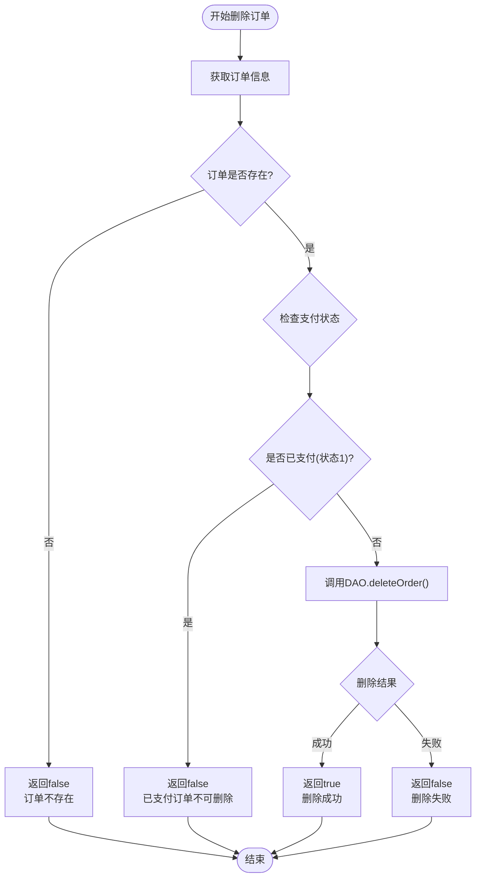
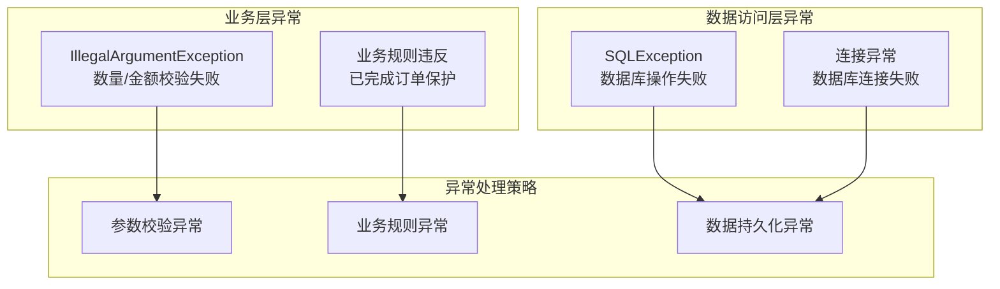

# 订单管理操作流程

<cite>
**本文档引用的文件**
- [App.java](file://src/main/java/com/example/demo/App.java)
- [OrderService.java](file://src/main/java/com/example/demo/service/OrderService.java)
- [OrderDAO.java](file://src/main/java/com/example/demo/dao/OrderDAO.java)
- [Order.java](file://src/main/java/com/example/demo/entity/Order.java)
- [DBUtil.java](file://src/main/java/com/example/demo/dao/DBUtil.java)
- [OrderServiceTest.java](file://src/test/java/com/example/demo/service/OrderServiceTest.java)
- [pom.xml](file://pom.xml)
</cite>

## 目录
1. [系统概述](#系统概述)
2. [架构设计](#架构设计)
3. [核心组件详解](#核心组件详解)
4. [订单管理操作流程](#订单管理操作流程)
5. [业务规则与异常处理](#业务规则与异常处理)
6. [数据持久化机制](#数据持久化机制)
7. [常见问题与解决方案](#常见问题与解决方案)
8. [最佳实践建议](#最佳实践建议)

## 系统概述

本订单管理系统采用分层架构设计，包含三个主要层次：
- **表现层（App.java）**：提供主程序入口和用户交互接口
- **业务逻辑层（OrderService.java）**：实现订单业务规则和控制逻辑
- **数据访问层（OrderDAO.java）**：负责数据的存储、检索和持久化

系统支持完整的订单生命周期管理，包括创建、查询、更新、删除等操作，并实现了严格的业务规则约束。

## 架构设计



**图表来源**
- [App.java](file://src/main/java/com/example/demo/App.java#L1-L62)
- [OrderService.java](file://src/main/java/com/example/demo/service/OrderService.java#L1-L81)
- [OrderDAO.java](file://src/main/java/com/example/demo/dao/OrderDAO.java#L1-L148)
- [DBUtil.java](file://src/main/java/com/example/demo/dao/DBUtil.java#L1-L19)

**章节来源**
- [App.java](file://src/main/java/com/example/demo/App.java#L1-L62)
- [OrderService.java](file://src/main/java/com/example/demo/service/OrderService.java#L1-L81)
- [OrderDAO.java](file://src/main/java/com/example/demo/dao/OrderDAO.java#L1-L148)

## 核心组件详解

### Order实体类

Order实体类定义了订单的核心属性和业务规则：



**图表来源**
- [Order.java](file://src/main/java/com/example/demo/entity/Order.java#L1-L143)

### OrderService业务服务

OrderService负责实现业务逻辑和规则验证：



**图表来源**
- [OrderService.java](file://src/main/java/com/example/demo/service/OrderService.java#L1-L81)
- [OrderDAO.java](file://src/main/java/com/example/demo/dao/OrderDAO.java#L1-L148)

**章节来源**
- [Order.java](file://src/main/java/com/example/demo/entity/Order.java#L1-L143)
- [OrderService.java](file://src/main/java/com/example/demo/service/OrderService.java#L1-L81)
- [OrderDAO.java](file://src/main/java/com/example/demo/dao/OrderDAO.java#L1-L148)

## 订单管理操作流程

### 1. 初始化数据库连接



**图表来源**
- [App.java](file://src/main/java/com/example/demo/App.java#L12-L13)
- [OrderDAO.java](file://src/main/java/com/example/demo/dao/OrderDAO.java#L18-L32)
- [DBUtil.java](file://src/main/java/com/example/demo/dao/DBUtil.java#L14-L16)

**操作步骤：**
1. 创建OrderDAO实例
2. 调用`initTable()`方法初始化数据库表结构
3. 预期输出：`✅ 数据库表初始化完成`

**数据表结构：**
| 字段名 | 类型 | 约束 | 描述 |
|--------|------|------|------|
| orderId | TEXT | PRIMARY KEY | 订单唯一标识符 |
| userId | TEXT | - | 用户ID |
| productId | TEXT | - | 商品ID |
| quantity | INTEGER | - | 购买数量 |
| totalAmount | TEXT | - | 订单总金额（字符串存储） |
| status | INTEGER | - | 订单状态（0-待支付, 1-已支付, 2-已发货, 3-已完成, 4-已取消） |
| createTime | TEXT | - | 创建时间（ISO格式字符串） |
| payTime | TEXT | - | 支付时间（ISO格式字符串） |
| updateTime | TEXT | - | 更新时间（ISO格式字符串） |

**章节来源**
- [App.java](file://src/main/java/com/example/demo/App.java#L12-L13)
- [OrderDAO.java](file://src/main/java/com/example/demo/dao/OrderDAO.java#L18-L32)

### 2. 创建订单



**图表来源**
- [OrderService.java](file://src/main/java/com/example/demo/service/OrderService.java#L15-L28)

**代码示例路径：**
- [App.java](file://src/main/java/com/example/demo/App.java#L18-L25)
- [OrderService.java](file://src/main/java/com/example/demo/service/OrderService.java#L15-L28)

**预期输出：**
- 成功：`✅ 订单创建成功`
- 失败：`❌ 订单创建失败`

**业务校验规则：**
1. **数量校验**：购买数量必须大于0
2. **金额校验**：订单总金额必须大于0
3. **重复性校验**：订单ID必须唯一

**章节来源**
- [App.java](file://src/main/java/com/example/demo/App.java#L18-L25)
- [OrderService.java](file://src/main/java/com/example/demo/service/OrderService.java#L15-L28)

### 3. 数据持久化到SQLite



**图表来源**
- [App.java](file://src/main/java/com/example/demo/App.java#L27-L28)
- [OrderDAO.java](file://src/main/java/com/example/demo/dao/OrderDAO.java#L34-L72)
- [DBUtil.java](file://src/main/java/com/example/demo/dao/DBUtil.java#L14-L16)

**操作步骤：**
1. 调用`saveToDatabase()`方法
2. 遍历内存中的所有订单
3. 使用`INSERT OR REPLACE`语句进行批量写入
4. 预期输出：`✅ 数据已持久化到SQLite`

**数据转换规则：**
- `LocalDateTime`类型转换为ISO格式字符串
- `BigDecimal`类型转换为字符串存储
- 空值保持为NULL

**章节来源**
- [App.java](file://src/main/java/com/example/demo/App.java#L27-L28)
- [OrderDAO.java](file://src/main/java/com/example/demo/dao/OrderDAO.java#L34-L72)

### 4. 查询订单



**图表来源**
- [OrderService.java](file://src/main/java/com/example/demo/service/OrderService.java#L30-L33)
- [OrderDAO.java](file://src/main/java/com/example/demo/dao/OrderDAO.java#L104-L107)

**代码示例路径：**
- [App.java](file://src/main/java/com/example/demo/App.java#L30-L31)
- [OrderService.java](file://src/main/java/com/example/demo/service/OrderService.java#L30-L33)

**预期输出：**
- 存在：`🔍 查询结果: Order{orderId='O001', userId='U100', productId='P200', quantity=2, totalAmount=99.99, status=0, createTime=..., payTime=null, updateTime=null}`
- 不存在：`🔍 查询结果: 未找到`

**章节来源**
- [App.java](file://src/main/java/com/example/demo/App.java#L30-L31)
- [OrderService.java](file://src/main/java/com/example/demo/service/OrderService.java#L30-L33)
- [OrderDAO.java](file://src/main/java/com/example/demo/dao/OrderDAO.java#L104-L107)

### 5. 更新订单状态

```mermaid
flowchart TD
Start([开始更新订单]) --> CheckStatus{"检查新状态"}
CheckStatus --> |已完成(3)| GetExisting["获取现有订单"]
CheckStatus --> |其他状态| DirectUpdate["直接调用DAO.updateOrder()"]
GetExisting --> CompareStatus{"现有状态是否为已完成?"}
CompareStatus --> |是| ReturnFalse["返回false<br/>已完成订单不可修改"]
CompareStatus --> |否| CallDAO["调用DAO.updateOrder()"]
DirectUpdate --> CallDAO
CallDAO --> CheckResult{"更新结果"}
CheckResult --> |成功| ReturnTrue["返回true<br/>更新成功"]
CheckResult --> |失败| ReturnFalse2["返回false<br/>更新失败"]
ReturnFalse --> End([结束])
ReturnTrue --> End
ReturnFalse2 --> End
```

**图表来源**
- [OrderService.java](file://src/main/java/com/example/demo/service/OrderService.java#L46-L62)

**代码示例路径：**
- [App.java](file://src/main/java/com/example/demo/App.java#L34-L38)
- [OrderService.java](file://src/main/java/com/example/demo/service/OrderService.java#L46-L62)

**业务规则：**
1. **已完成订单保护**：状态为3（已完成）的订单不可修改
2. **状态变更验证**：只有状态发生变化时才进行检查
3. **支付状态限制**：已支付（状态1）的订单可以正常更新

**预期输出：**
- 成功：`✅ 订单更新成功`
- 失败：`❌ 订单更新失败`

**章节来源**
- [App.java](file://src/main/java/com/example/demo/App.java#L34-L38)
- [OrderService.java](file://src/main/java/com/example/demo/service/OrderService.java#L46-L62)

### 6. 删除订单



**图表来源**
- [OrderService.java](file://src/main/java/com/example/demo/service/OrderService.java#L64-L76)

**代码示例路径：**
- [App.java](file://src/main/java/com/example/demo/App.java#L40-L42)
- [OrderService.java](file://src/main/java/com/example/demo/service/OrderService.java#L64-L76)

**业务规则：**
1. **支付保护**：状态为1（已支付）的订单不可删除
2. **存在性检查**：不存在的订单无法删除
3. **级联删除**：删除操作仅影响当前订单

**预期输出：**
- 成功：`✅ 订单删除成功`
- 失败：`❌ 订单删除失败`

**章节来源**
- [App.java](file://src/main/java/com/example/demo/App.java#L40-L42)
- [OrderService.java](file://src/main/java/com/example/demo/service/OrderService.java#L64-L76)

## 业务规则与异常处理

### 异常处理机制

系统实现了多层次的异常处理机制：



**图表来源**
- [OrderService.java](file://src/main/java/com/example/demo/service/OrderService.java#L17-L22)
- [OrderDAO.java](file://src/main/java/com/example/demo/dao/OrderDAO.java#L18-L32)
- [OrderDAO.java](file://src/main/java/com/example/demo/dao/OrderDAO.java#L74-L87)

### 业务规则验证表

| 规则类型 | 验证条件 | 异常信息 | 处理方式 |
|----------|----------|----------|----------|
| 数量校验 | quantity <= 0 | "购买数量必须大于0" | 抛出IllegalArgumentException |
| 金额校验 | totalAmount <= 0 | "订单金额必须大于0" | 抛出IllegalArgumentException |
| 重复创建 | orderId已存在 | - | 返回false，不抛异常 |
| 状态保护 | 已完成订单修改 | - | 返回false，不抛异常 |
| 删除保护 | 已支付订单删除 | - | 返回false，不抛异常 |

**章节来源**
- [OrderService.java](file://src/main/java/com/example/demo/service/OrderService.java#L17-L22)
- [OrderService.java](file://src/main/java/com/example/demo/service/OrderService.java#L46-L62)
- [OrderService.java](file://src/main/java/com/example/demo/service/OrderService.java#L64-L76)

## 数据持久化机制

### 内存缓存与数据库同步

系统采用内存缓存+数据库持久化的双重存储策略：

```mermaid
graph LR
subgraph "内存层"
MC[内存缓存<br/>ConcurrentHashMap]
end
subgraph "持久化层"
DB[(SQLite数据库<br/>test.db)]
end
subgraph "操作流程"
OP[业务操作] --> MC
MC --> |saveToDatabase()| DB
DB --> |loadFromDatabase()| MC
end
MC -.->|create/update/delete| MC
MC -.->|saveToDatabase()| DB
```

**图表来源**
- [OrderDAO.java](file://src/main/java/com/example/demo/dao/OrderDAO.java#L14-L16)
- [OrderDAO.java](file://src/main/java/com/example/demo/dao/OrderDAO.java#L34-L72)
- [OrderDAO.java](file://src/main/java/com/example/demo/dao/OrderDAO.java#L89-L102)

### 数据转换与存储格式

| Java类型 | 存储格式 | 转换方式 | 注意事项 |
|----------|----------|----------|----------|
| LocalDateTime | ISO格式字符串 | `toString()` | 保持时区信息 |
| BigDecimal | 字符串 | `toString()` | 避免精度丢失 |
| Integer | 整数 | 直接存储 | 标准SQL类型 |
| String | 文本 | 直接存储 | 最大长度限制 |

**章节来源**
- [OrderDAO.java](file://src/main/java/com/example/demo/dao/OrderDAO.java#L34-L72)
- [OrderDAO.java](file://src/main/java/com/example/demo/dao/OrderDAO.java#L89-L102)

## 常见问题与解决方案

### 问题1：创建重复订单失败

**症状**：`❌ 订单创建失败`

**原因分析**：
- 订单ID已经存在于系统中
- `createOrder()`方法检测到重复ID

**解决方案**：
```java
// 检查订单是否存在
Order existingOrder = orderService.getOrder("O001");
if (existingOrder == null) {
    // 创建新订单
    boolean created = orderService.createOrder(newOrder);
} else {
    // 处理重复订单情况
    System.out.println("订单已存在: " + existingOrder.toString());
}
```

**预防措施**：
- 使用UUID生成唯一订单ID
- 在创建前检查订单是否存在

### 问题2：更新已完成订单失败

**症状**：`❌ 订单更新失败`

**原因分析**：
- 尝试修改状态为3（已完成）的订单
- 系统阻止已完成订单的修改

**解决方案**：
```java
// 检查订单状态
Order order = orderService.getOrder("O001");
if (order != null && order.getStatus() == 3) {
    System.out.println("已完成订单不可修改");
} else {
    // 执行更新操作
    order.setStatus(2); // 修改为已发货
    orderService.updateOrder(order);
}
```

### 问题3：删除已支付订单失败

**症状**：`❌ 订单删除失败`

**原因分析**：
- 订单状态为1（已支付）
- 系统保护已支付订单不被删除

**解决方案**：
```java
// 检查订单支付状态
Order order = orderService.getOrder("O001");
if (order != null && order.getStatus() == 1) {
    System.out.println("已支付订单不能删除，请先取消支付");
} else {
    // 执行删除操作
    orderService.deleteOrder("O001");
}
```

### 问题4：数据库连接失败

**症状**：`数据库初始化失败: ...`

**原因分析**：
- SQLite驱动未正确配置
- 数据库文件路径错误
- 权限不足

**解决方案**：
1. 检查pom.xml中的依赖配置
2. 验证数据库文件路径
3. 确保有文件写入权限

**章节来源**
- [OrderService.java](file://src/main/java/com/example/demo/service/OrderService.java#L46-L62)
- [OrderService.java](file://src/main/java/com/example/demo/service/OrderService.java#L64-L76)
- [OrderDAO.java](file://src/main/java/com/example/demo/dao/OrderDAO.java#L18-L32)

## 最佳实践建议

### 1. 订单ID生成策略
- 使用UUID确保唯一性
- 考虑业务含义的前缀编码
- 实现幂等性检查

### 2. 异常处理最佳实践
```java
try {
    boolean result = orderService.createOrder(order);
    if (!result) {
        // 处理订单已存在的情况
        handleDuplicateOrder(order.getOrderId());
    }
} catch (IllegalArgumentException ex) {
    // 处理业务参数异常
    handleBusinessValidationException(ex);
}
```

### 3. 数据一致性保证
- 使用事务机制确保操作原子性
- 实现乐观锁防止并发冲突
- 定期备份数据库文件

### 4. 性能优化建议
- 合理使用内存缓存减少数据库访问
- 批量操作提高性能
- 实现适当的索引策略

### 5. 监控与日志
- 记录关键操作的日志
- 监控异常发生频率
- 实现健康检查机制

通过遵循这些最佳实践，可以构建一个稳定、高效、可维护的订单管理系统。