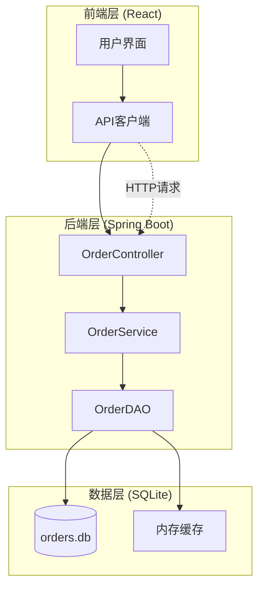

# 订单管理系统 - 使用说明与常见问题解答

<cite>
**本文档引用的文件**
- [使用说明.md](file://使用说明.md)
- [README.md](file://README.md)
- [OrderController.java](file://src/main/java/com/example/demo/controller/OrderController.java)
- [OrderService.java](file://src/main/java/com/example/demo/service/OrderService.java)
- [OrderDAO.java](file://src/main/java/com/example/demo/dao/OrderDAO.java)
- [Order.java](file://src/main/java/com/example/demo/entity/Order.java)
- [WebConfig.java](file://src/main/java/com/example/demo/config/WebConfig.java)
- [DBUtil.java](file://src/main/java/com/example/demo/dao/DBUtil.java)
- [App.js](file://frontend/src/App.js)
- [orderService.js](file://frontend/src/services/orderService.js)
- [pom.xml](file://pom.xml)
</cite>

## 目录
1. [项目概述](#项目概述)
2. [系统架构](#系统架构)
3. [业务规则详解](#业务规则详解)
4. [快速开始指南](#快速开始指南)
5. [API接口文档](#api接口文档)
6. [前端功能说明](#前端功能说明)
7. [快速测试流程](#快速测试流程)
8. [注意事项](#注意事项)
9. [常见问题解答](#常见问题解答)
10. [故障排除指南](#故障排除指南)
11. [停止服务方法](#停止服务方法)

## 项目概述

本项目是一个完整的全栈订单管理系统，采用现代化的技术栈构建：

### 技术架构
- **后端**: Spring Boot REST API (端口: 8080)
- **前端**: React Web应用 (端口: 3000)
- **数据库**: SQLite (数据持久化)
- **跨域支持**: 已配置CORS支持跨域访问

### 核心特性
- 实时订单管理
- 状态流转控制
- 数据持久化存储
- 前后端分离架构

**章节来源**
- [使用说明.md](file://使用说明.md#L1-L10)
- [pom.xml](file://pom.xml#L1-L50)

## 系统架构



**图表来源**
- [OrderController.java](file://src/main/java/com/example/demo/controller/OrderController.java#L1-L173)
- [OrderService.java](file://src/main/java/com/example/demo/service/OrderService.java#L1-L114)
- [OrderDAO.java](file://src/main/java/com/example/demo/dao/OrderDAO.java#L1-L248)

### 架构特点
1. **分层设计**: 清晰的三层架构分离
2. **数据持久化**: 内存+数据库双重存储
3. **跨域支持**: 完整的CORS配置
4. **状态管理**: 完整的订单状态流转

**章节来源**
- [WebConfig.java](file://src/main/java/com/example/demo/config/WebConfig.java#L1-L28)
- [OrderDAO.java](file://src/main/java/com/example/demo/dao/OrderDAO.java#L18-L46)

## 业务规则详解

### 订单状态说明

| 状态值 | 状态名称 | 描述 | 可操作性 |
|--------|----------|------|----------|
| 0 | 待支付 | 新创建的订单，等待用户付款 | 可删除、可修改 |
| 1 | 已支付 | 用户已完成付款 | 可发货、可修改 |
| 2 | 已发货 | 商家已发货 | 可完成、不可修改 |
| 3 | 已完成 | 订单已完成交易 | 不可修改 |
| 4 | 已取消 | 订单被取消 | 不可修改 |

### 关键业务规则

#### 创建订单规则
1. **数量验证**: 购买数量必须大于0
2. **金额验证**: 订单总金额必须大于0
3. **唯一性**: 订单ID必须唯一

#### 删除订单规则
1. **状态限制**: 只有待支付状态（status=0）的订单可以删除
2. **安全性**: 已支付订单（status=1）不能删除

#### 更新订单规则
1. **状态保护**: 已完成订单（status=3）不能修改
2. **状态流转**: 支持按顺序的状态更新

**章节来源**
- [OrderService.java](file://src/main/java/com/example/demo/service/OrderService.java#L28-L70)
- [OrderDAO.java](file://src/main/java/com/example/demo/dao/OrderDAO.java#L165-L211)

## 快速开始指南

### 环境要求
- Java JDK 1.8 或更高版本
- Node.js (用于前端开发)
- Maven (用于后端构建)

### 启动步骤

#### 1. 后端服务启动
```bash
# 进入项目根目录
cd 0713demo1103

# 启动Spring Boot应用
mvn spring-boot:run
```

#### 2. 前端服务启动
```bash
# 进入前端目录
cd frontend

# 安装依赖
npm install

# 启动React开发服务器
npm start
```

### 服务状态检查
- **后端**: http://localhost:8080/api/orders/health
- **前端**: http://localhost:3000

**章节来源**
- [使用说明.md](file://使用说明.md#L10-L18)

## API接口文档

### 健康检查
```http
GET /api/orders/health
```
**响应示例**:
```json
{
  "success": true,
  "message": "订单服务运行正常"
}
```

### 创建订单
```http
POST /api/orders
Content-Type: application/json

{
  "orderId": "ORD001",
  "userId": "USER001",
  "productId": "PROD001",
  "quantity": 2,
  "totalAmount": 199.98,
  "status": 0
}
```

### 查询订单详情
```http
GET /api/orders/{orderId}
```

### 根据用户ID查询订单列表
```http
GET /api/orders/user/{userId}
```

### 更新订单
```http
PUT /api/orders/{orderId}
Content-Type: application/json

{
  "userId": "USER001",
  "productId": "PROD001",
  "quantity": 3,
  "totalAmount": 299.97,
  "status": 1
}
```

### 删除订单
```http
DELETE /api/orders/{orderId}
```

**章节来源**
- [使用说明.md](file://使用说明.md#L20-L78)
- [OrderController.java](file://src/main/java/com/example/demo/controller/OrderController.java#L35-L172)

## 前端功能说明

### 订单创建功能
1. 填写订单ID、用户ID、商品ID
2. 输入数量和总金额
3. 选择订单状态
4. 点击"创建订单"按钮

### 订单查询功能
1. 在搜索栏输入用户ID
2. 点击"查询"按钮
3. 查看该用户的所有订单

### 订单管理功能
- **支付**: 待支付订单可以点击"支付"按钮
- **发货**: 已支付订单可以点击"发货"按钮
- **完成**: 已发货订单可以点击"完成"按钮
- **删除**: 仅待支付订单可以删除

**章节来源**
- [使用说明.md](file://使用说明.md#L79-L96)
- [App.js](file://frontend/src/App.js#L1-L427)

## 快速测试流程

### 测试数据准备
- **订单ID**: ORD001
- **用户ID**: USER001
- **商品ID**: PROD001
- **数量**: 2
- **总金额**: 199.98

### 测试步骤

#### 步骤1: 创建测试订单
1. 打开前端应用 (http://localhost:3000)
2. 填写订单信息
3. 点击"创建订单"按钮
4. 验证创建成功消息

#### 步骤2: 查询订单
1. 在搜索框输入用户ID: USER001
2. 点击"查询"按钮
3. 验证显示创建的订单

#### 步骤3: 状态流转测试
1. 点击"支付"按钮
2. 点击"发货"按钮
3. 点击"完成"按钮
4. 验证状态正确更新

#### 步骤4: 删除功能测试
1. 创建一个新的待支付订单
2. 点击"删除"按钮
3. 验证订单成功删除

**章节来源**
- [使用说明.md](file://使用说明.md#L111-L132)

## 注意事项

### 系统要求
1. **端口占用**: 确保8080和3000端口未被占用
2. **数据持久化**: 数据会持久化保存在 `orders.db` 文件中
3. **服务依赖**: 前端和后端需同时运行才能正常工作
4. **跨域支持**: 已配置CORS支持跨域访问

### 开发环境配置
- **Java版本**: JDK 1.8+
- **Node版本**: 14.0+
- **Maven版本**: 3.6+

### 生产环境建议
- 使用独立的数据库服务器
- 配置SSL证书
- 实施适当的监控和日志记录

**章节来源**
- [使用说明.md](file://使用说明.md#L167-L173)

## 常见问题解答

### Q1: 为什么无法连接到后端服务？

**可能原因**:
1. 后端服务未启动
2. 端口8080被占用
3. 网络配置问题

**解决方法**:
1. 检查后端服务是否正常启动
2. 使用 `netstat -an | grep 8080` 检查端口占用
3. 确认防火墙设置允许8080端口通信

### Q2: 创建订单时出现"数量必须大于0"错误？

**原因**: 提交的订单数量小于或等于0

**解决方法**: 确保订单数量字段填写大于0的有效数值

### Q3: 删除订单时提示"已支付订单不能删除"？

**原因**: 尝试删除非待支付状态的订单

**解决方法**: 只能删除状态为待支付（status=0）的订单

### Q4: 更新订单时提示"已完成订单不能修改"？

**原因**: 尝试修改已完成状态（status=3）的订单

**解决方法**: 已完成订单无法修改，需要重新创建新订单

### Q5: 前端页面显示"后端未连接"？

**原因**: 前端无法连接到后端API

**解决方法**: 
1. 检查后端服务是否启动
2. 确认CORS配置正确
3. 检查网络连接

**章节来源**
- [OrderService.java](file://src/main/java/com/example/demo/service/OrderService.java#L28-L70)
- [OrderDAO.java](file://src/main/java/com/example/demo/dao/OrderDAO.java#L165-L211)

## 故障排除指南

### 连接问题诊断

#### 1. 检查后端服务状态
```bash
# 检查进程
ps aux | grep java

# 检查端口监听
netstat -an | grep 8080
```

#### 2. 检查数据库连接
```bash
# 检查数据库文件是否存在
ls -la orders.db

# 检查数据库文件权限
chmod 644 orders.db
```

#### 3. 检查CORS配置
确认 `WebConfig.java` 中的CORS配置正确：
- 允许的域名: "*" (生产环境建议指定具体域名)
- 允许的方法: GET, POST, PUT, DELETE, OPTIONS
- 允许的头部: "*" (生产环境建议指定具体头部)

### 性能问题排查

#### 1. 数据库性能
- 检查数据库文件大小
- 监控数据库查询性能
- 考虑定期备份和清理

#### 2. 内存使用
- 监控内存使用情况
- 检查是否有内存泄漏
- 考虑调整JVM参数

### 日志分析

#### 后端日志位置
- Spring Boot默认日志输出到控制台
- 可通过 `application.properties` 配置文件日志级别

#### 前端日志
- 浏览器开发者工具控制台
- 网络面板检查API请求

**章节来源**
- [WebConfig.java](file://src/main/java/com/example/demo/config/WebConfig.java#L14-L27)
- [DBUtil.java](file://src/main/java/com/example/demo/dao/DBUtil.java#L10-L18)

## 停止服务方法

### 停止后端服务
在运行后端服务的终端窗口中，按下 `Ctrl + C` 组合键。

### 停止前端服务
在运行前端服务的终端窗口中，按下 `Ctrl + C` 组合键。

### 强制终止
如果上述方法无效，可以使用以下命令强制终止服务：

```bash
# 查找Java进程
ps aux | grep java

# 终止特定进程 (替换PID为实际进程号)
kill -9 PID

# 查找Node进程
ps aux | grep node

# 终止Node进程
kill -9 NODE_PID
```

### 清理资源
- 确保所有数据库连接已关闭
- 清理临时文件
- 关闭浏览器标签页

**章节来源**
- [使用说明.md](file://使用说明.md#L159-L166)

## 总结

本订单管理系统提供了完整的订单生命周期管理功能，包括创建、查询、更新和删除操作。系统采用前后端分离架构，具有良好的扩展性和维护性。

### 关键特性
- 完整的业务规则验证
- 状态流转控制
- 数据持久化存储
- 跨域访问支持
- 实时状态更新

### 最佳实践
1. 始终遵循业务规则进行操作
2. 定期备份数据库文件
3. 监控系统性能指标
4. 及时处理异常情况

通过遵循本文档的指导，您可以顺利使用和维护这个订单管理系统。