# API客户端封装

<cite>
**本文档中引用的文件**
- [orderService.js](file://frontend/src/services/orderService.js)
- [App.js](file://frontend/src/App.js)
- [package.json](file://frontend/package.json)
- [OrderController.java](file://src/main/java/com/example/demo/controller/OrderController.java)
- [OrderService.java](file://src/main/java/com/example/demo/service/OrderService.java)
- [Order.java](file://src/main/java/com/example/demo/entity/Order.java)
- [OrderDAO.java](file://src/main/java/com/example/demo/dao/OrderDAO.java)
- [WebConfig.java](file://src/main/java/com/example/demo/config/WebConfig.java)
</cite>

## 目录
1. [简介](#简介)
2. [项目架构概览](#项目架构概览)
3. [Axios客户端配置](#axios客户端配置)
4. [核心API方法封装](#核心api方法封装)
5. [请求拦截与响应处理](#请求拦截与响应处理)
6. [错误处理机制](#错误处理机制)
7. [前端组件集成](#前端组件集成)
8. [实际调用示例](#实际调用示例)
9. [可复用性设计](#可复用性设计)
10. [最佳实践建议](#最佳实践建议)

## 简介

orderService.js是一个专门负责与后端REST API进行通信的前端服务模块，采用Axios库实现HTTP请求的封装。该模块提供了完整的订单管理API接口，包括创建订单、查询订单、更新订单和删除订单等功能，确保前端调用的健壮性和可维护性。

## 项目架构概览

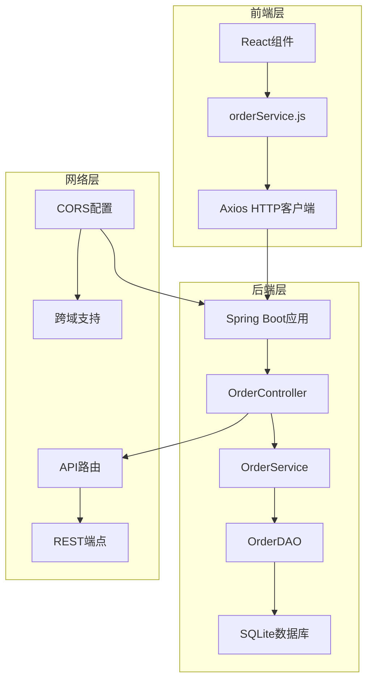

**图表来源**
- [orderService.js](file://frontend/src/services/orderService.js#L1-L49)
- [OrderController.java](file://src/main/java/com/example/demo/controller/OrderController.java#L1-L173)
- [WebConfig.java](file://src/main/java/com/example/demo/config/WebConfig.java#L1-L27)

## Axios客户端配置

### 基础配置

orderService.js使用Axios库创建了一个专门的HTTP客户端实例，配置了统一的基础URL和请求头：

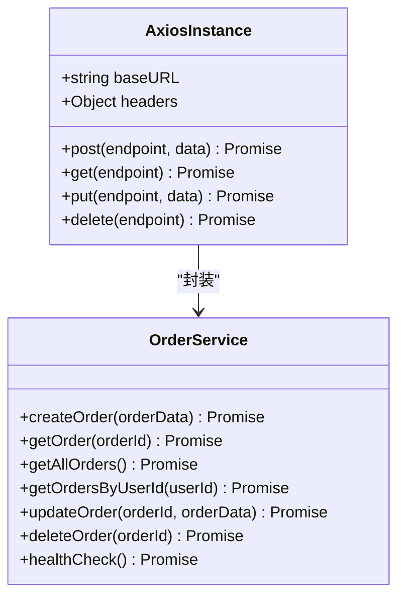

**图表来源**
- [orderService.js](file://frontend/src/services/orderService.js#L3-L10)

### 配置特性

| 配置项 | 值 | 说明 |
|--------|-----|------|
| baseURL | 'http://localhost:9090/api' | 后端API基础URL |
| Content-Type | 'application/json' | 请求内容类型 |
| 超时设置 | 默认30秒 | HTTP请求超时时间 |

**章节来源**
- [orderService.js](file://frontend/src/services/orderService.js#L3-L10)

## 核心API方法封装

### 方法映射关系

orderService.js提供了六个核心API方法，每个方法都对应一个特定的HTTP操作：

| 方法名 | HTTP方法 | 端点路径 | 功能描述 |
|--------|----------|----------|----------|
| createOrder | POST | /orders | 创建新订单 |
| getOrder | GET | /orders/{orderId} | 获取订单详情 |
| getAllOrders | GET | /orders | 获取所有订单列表 |
| getOrdersByUserId | GET | /orders/user/{userId} | 根据用户ID查询订单 |
| updateOrder | PUT | /orders/{orderId} | 更新订单信息 |
| deleteOrder | DELETE | /orders/{orderId} | 删除订单 |
| healthCheck | GET | /orders/health | 健康检查 |

### 方法实现模式

所有API方法都遵循相同的实现模式：

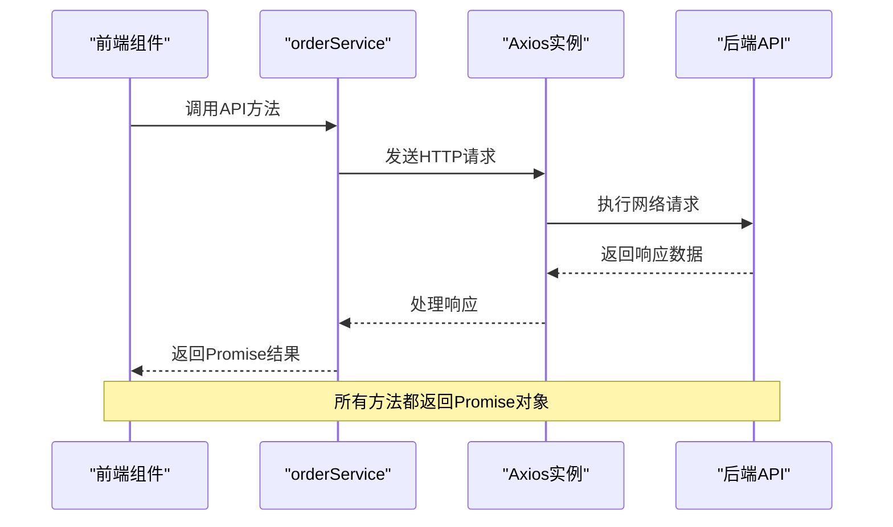

**图表来源**
- [orderService.js](file://frontend/src/services/orderService.js#L14-L46)

**章节来源**
- [orderService.js](file://frontend/src/services/orderService.js#L12-L46)

## 请求拦截与响应处理

### 请求拦截机制

虽然当前版本的orderService.js没有显式的请求拦截器配置，但Axios提供了强大的拦截器机制，可以在需要时扩展：

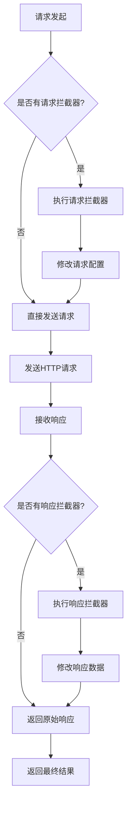

### 响应数据标准化

所有API方法都返回标准化的Promise对象，确保前端调用的一致性：

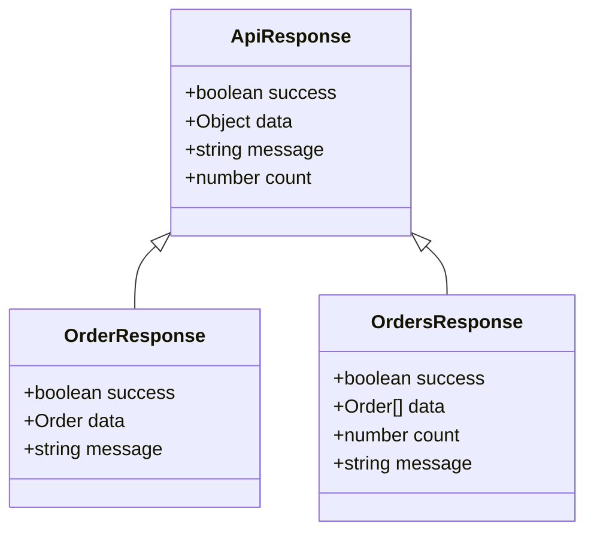

**图表来源**
- [OrderController.java](file://src/main/java/com/example/demo/controller/OrderController.java#L37-L55)

## 错误处理机制

### 异常处理策略

orderService.js通过Promise链实现了完善的错误处理机制：

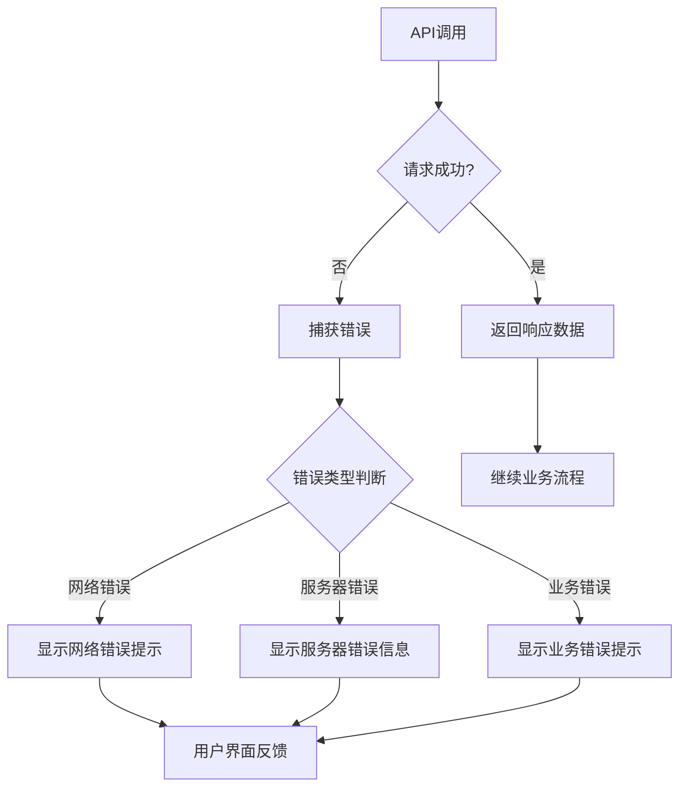

### 错误类型分类

| 错误类型 | 处理方式 | 用户反馈 |
|----------|----------|----------|
| 网络连接失败 | 显示"无法连接到后端服务" | 界面提示 |
| 请求超时 | 显示"请求超时，请重试" | 加载动画 |
| 服务器内部错误 | 显示具体错误消息 | 错误弹窗 |
| 业务逻辑错误 | 显示业务错误信息 | 错误提示 |

**章节来源**
- [App.js](file://frontend/src/App.js#L28-L38)
- [App.js](file://frontend/src/App.js#L41-L52)

## 前端组件集成

### 导入和使用方式

orderService.js作为独立的服务模块，通过ES6模块系统被前端组件导入和使用：

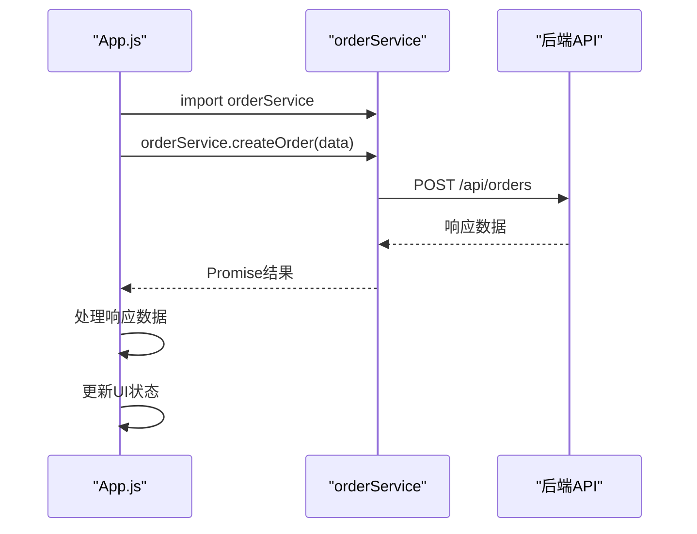

**图表来源**
- [App.js](file://frontend/src/App.js#L1-L4)

### 组件间通信

orderService.js与React组件之间的交互遵循单向数据流原则：

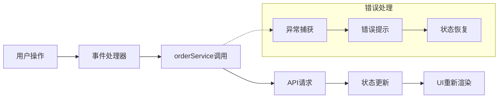

**章节来源**
- [App.js](file://frontend/src/App.js#L3-L4)

## 实际调用示例

### 创建订单示例

以下是创建订单的实际调用流程：

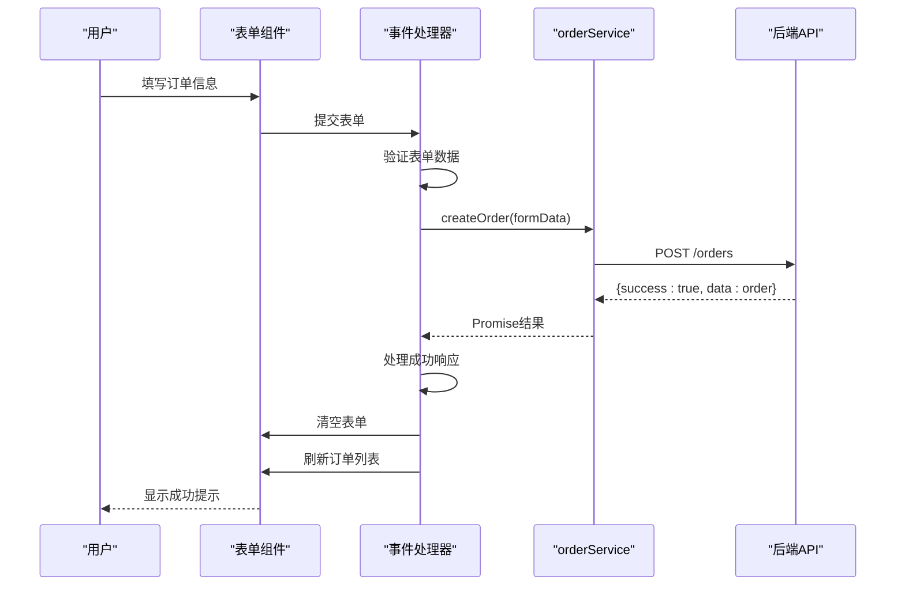

**图表来源**
- [App.js](file://frontend/src/App.js#L78-L98)

### 查询订单示例

查询订单的调用流程展示了异步数据加载的处理：

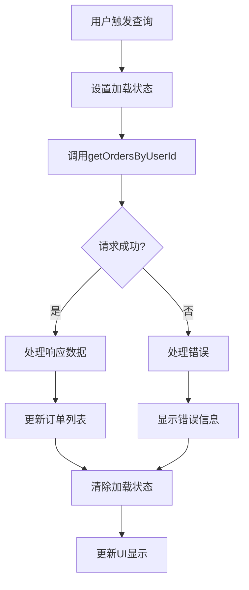

**图表来源**
- [App.js](file://frontend/src/App.js#L105-L128)

### 错误处理示例

错误处理的完整流程确保用户体验的连续性：

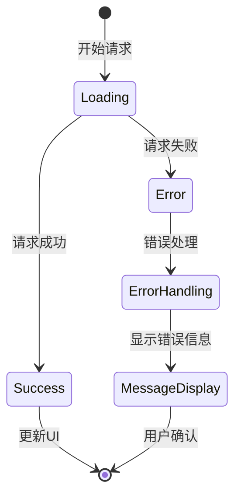

**章节来源**
- [App.js](file://frontend/src/App.js#L100-L102)
- [App.js](file://frontend/src/App.js#L123-L125)

## 可复用性设计

### 模块化架构

orderService.js采用了高度模块化的架构设计，具有以下特点：

| 设计原则 | 实现方式 | 优势 |
|----------|----------|------|
| 单一职责 | 每个方法专注于特定API端点 | 易于维护和测试 |
| 接口抽象 | 统一的Promise返回模式 | 前端调用一致性 |
| 配置集中 | 基础URL和配置集中管理 | 方便全局修改 |
| 依赖注入 | 通过ES6模块导出 | 支持测试和扩展 |

### 扩展性设计

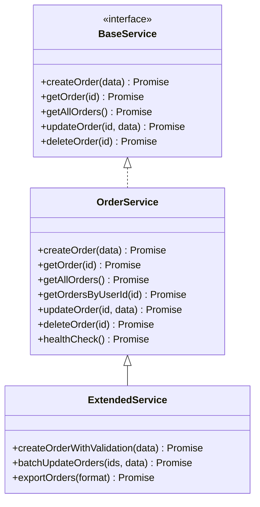

**图表来源**
- [orderService.js](file://frontend/src/services/orderService.js#L12-L46)

### 跨组件复用

orderService.js可以在多个React组件中复用：

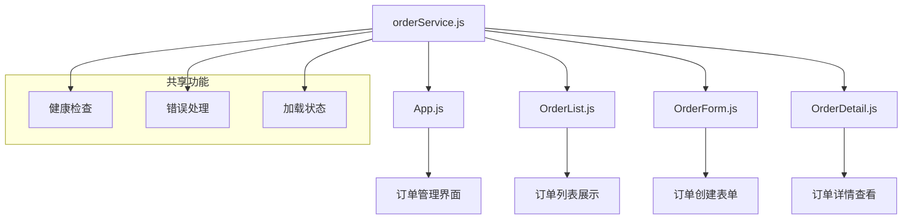

**章节来源**
- [orderService.js](file://frontend/src/services/orderService.js#L1-L49)

## 最佳实践建议

### 性能优化建议

1. **请求缓存**: 对于频繁查询的数据，可以实现本地缓存机制
2. **批量操作**: 对于大量数据的操作，考虑使用批量API
3. **防抖处理**: 对于搜索和查询操作，实施防抖机制减少不必要的请求

### 安全性考虑

1. **数据验证**: 在前端进行基本的数据验证
2. **错误信息**: 避免在错误信息中暴露敏感的系统信息
3. **认证令牌**: 如果需要，可以添加认证令牌的自动管理

### 可维护性建议

1. **文档同步**: 保持API文档与代码实现的同步
2. **类型定义**: 考虑添加TypeScript类型定义
3. **单元测试**: 为orderService编写单元测试

### 错误处理最佳实践

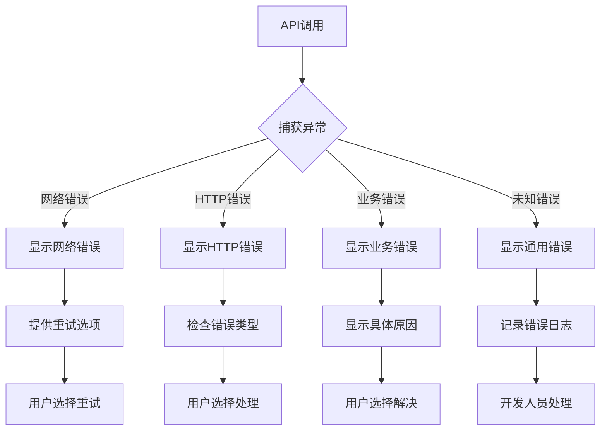

通过以上设计和实现，orderService.js提供了一个健壮、可维护且易于使用的API客户端封装，为整个订单管理系统的前后端解耦提供了坚实的基础。