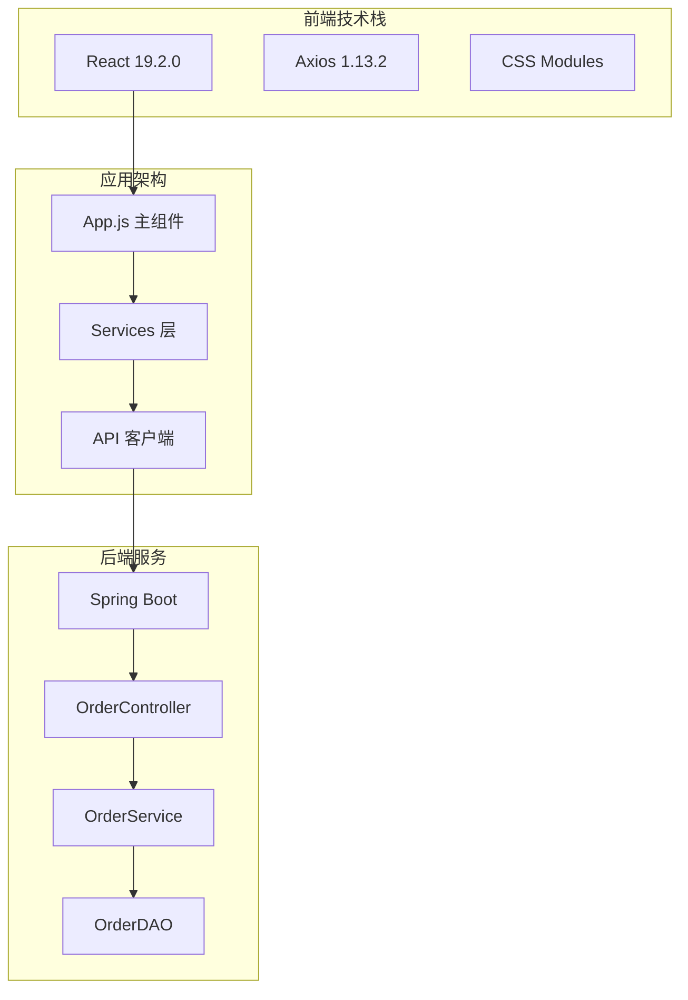
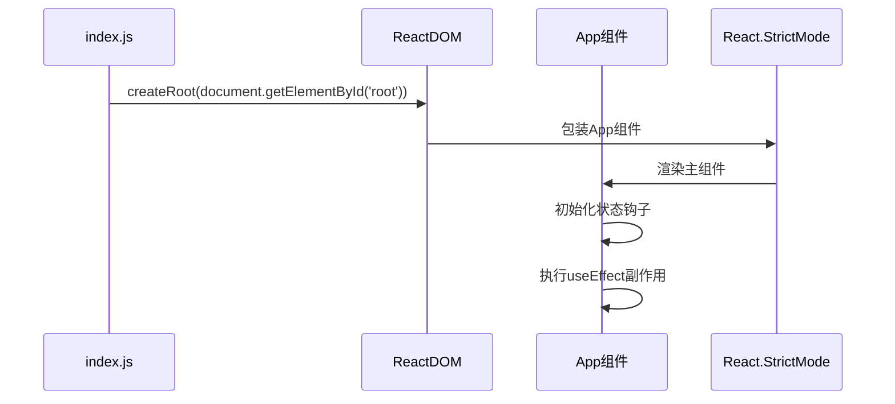
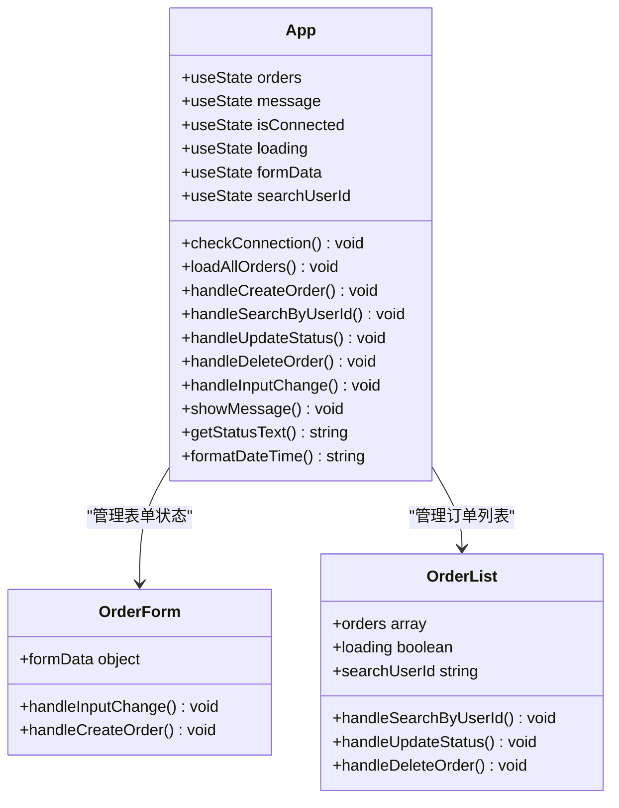
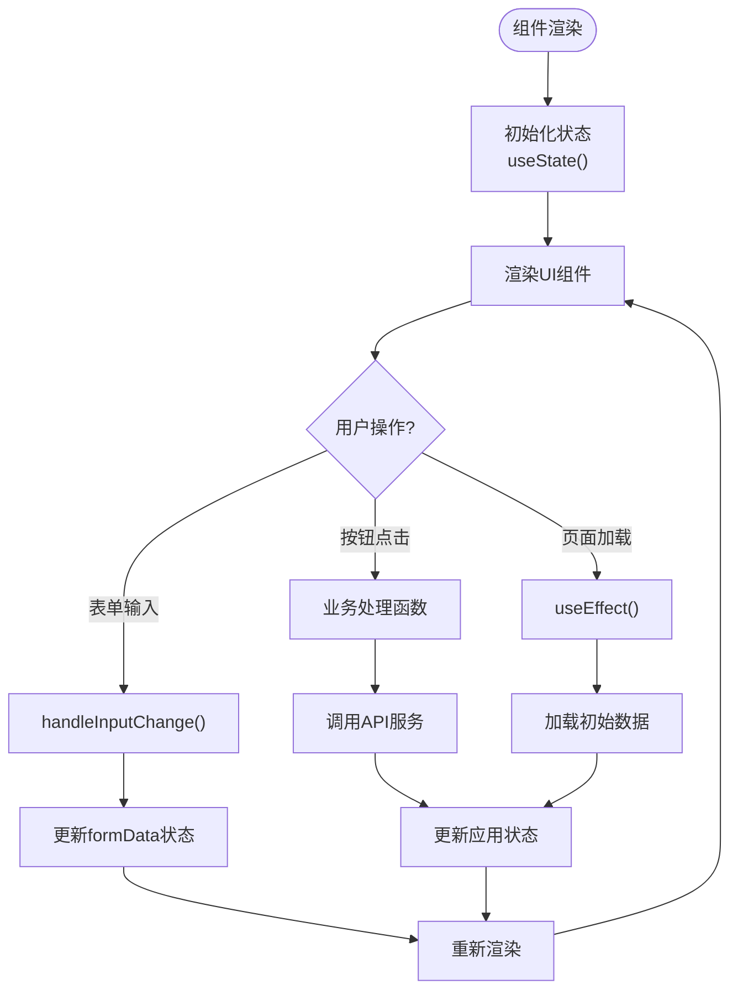
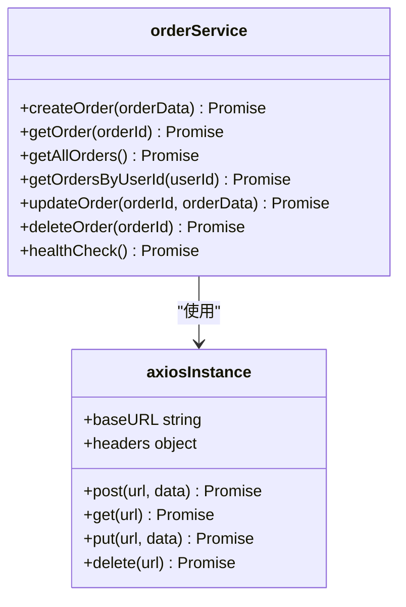
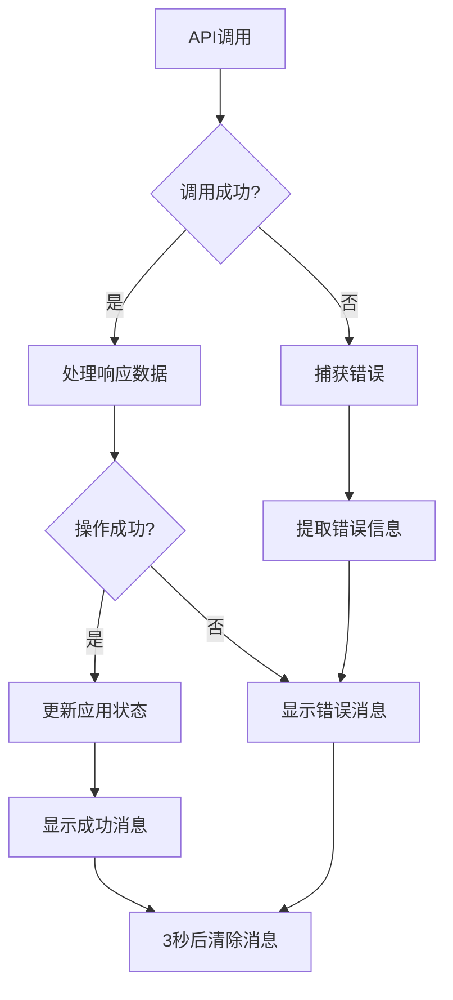
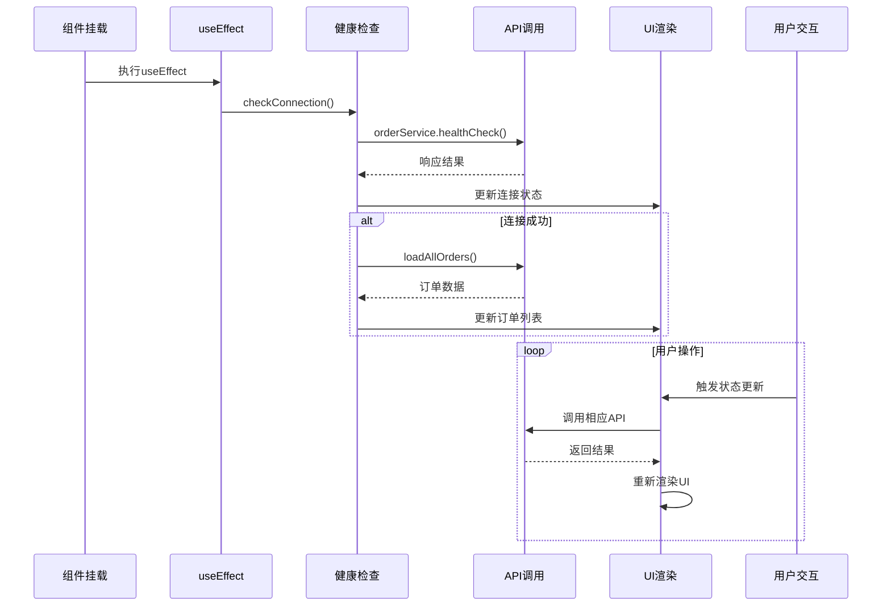
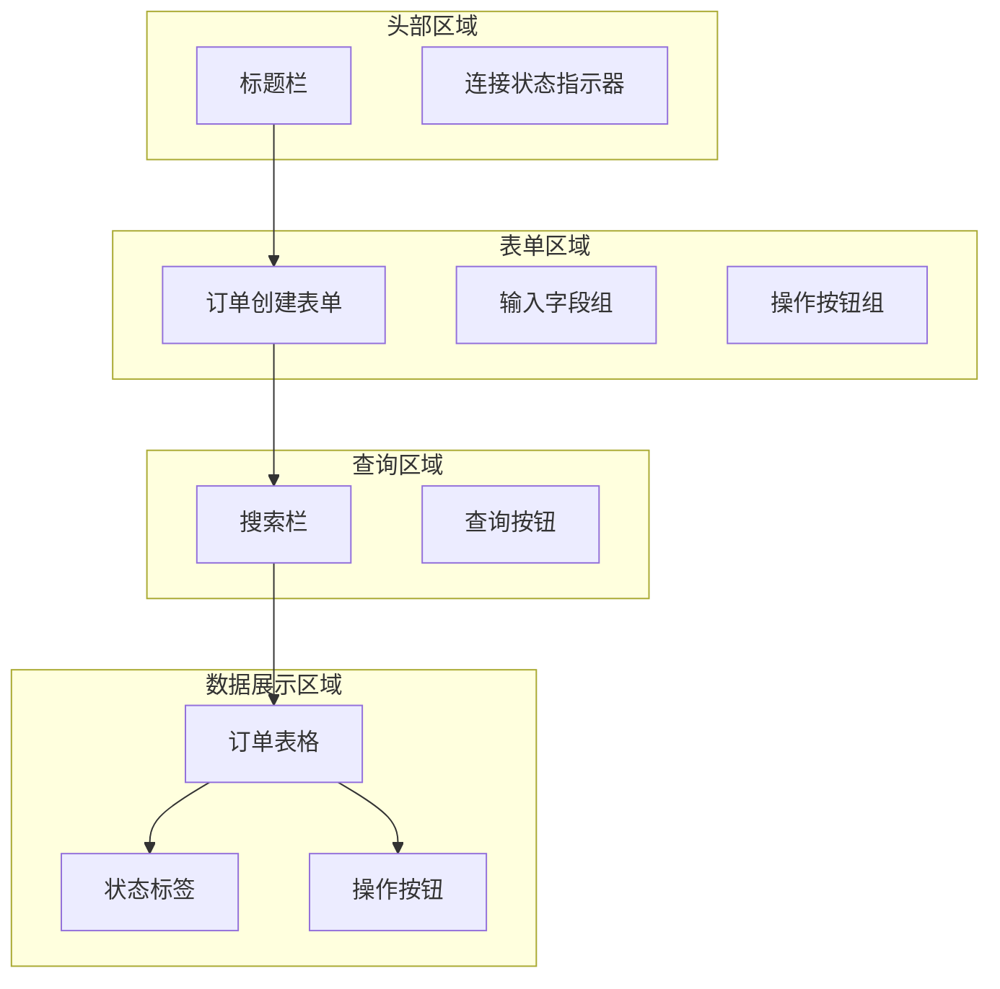
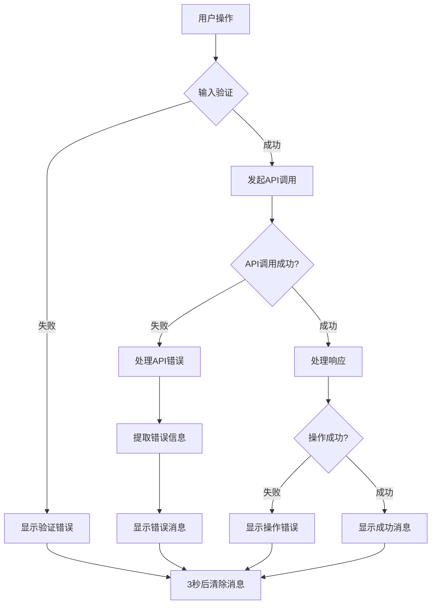

# 前端架构设计文档

<cite>
**本文档引用的文件**
- [App.js](file://frontend/src/App.js)
- [orderService.js](file://frontend/src/services/orderService.js)
- [App.css](file://frontend/src/App.css)
- [index.js](file://frontend/src/index.js)
- [package.json](file://frontend/package.json)
- [OrderController.java](file://src/main/java/com/example/demo/controller/OrderController.java)
- [OrderService.java](file://src/main/java/com/example/demo/service/OrderService.java)
</cite>

## 目录
1. [项目概述](#项目概述)
2. [技术栈架构](#技术栈架构)
3. [应用入口与初始化](#应用入口与初始化)
4. [核心组件架构](#核心组件架构)
5. [状态管理机制](#状态管理机制)
6. [API客户端封装](#api客户端封装)
7. [组件生命周期与数据流](#组件生命周期与数据流)
8. [用户界面设计](#用户界面设计)
9. [错误处理与用户体验](#错误处理与用户体验)
10. [性能优化策略](#性能优化策略)
11. [总结](#总结)

## 项目概述

本项目是一个基于React的订单管理系统前端应用，采用现代化的前端架构设计，实现了完整的订单管理功能，包括订单创建、查询、更新和删除等核心业务操作。系统通过Axios封装的API客户端与后端Spring Boot服务进行通信，提供了良好的用户体验和健壮的错误处理机制。

## 技术栈架构

**图表来源**
- [App.js](file://frontend/src/App.js#L1-L10)
- [orderService.js](file://frontend/src/services/orderService.js#L1-L49)
- [package.json](file://frontend/package.json#L6-L12)

**章节来源**
- [package.json](file://frontend/package.json#L1-L41)
- [App.js](file://frontend/src/App.js#L1-L10)

## 应用入口与初始化

应用采用标准的React应用结构，通过ReactDOM进行根组件渲染：

**图表来源**
- [index.js](file://frontend/src/index.js#L7-L12)
- [App.js](file://frontend/src/App.js#L24-L26)

应用初始化过程包含以下关键步骤：
1. **组件挂载**：通过ReactDOM.createRoot创建应用根节点
2. **严格模式**：启用React.StrictMode进行开发时的额外检查
3. **状态初始化**：在App组件中初始化所有必要的状态变量
4. **副作用执行**：通过useEffect钩子执行初始数据加载

**章节来源**
- [index.js](file://frontend/src/index.js#L1-L18)
- [App.js](file://frontend/src/App.js#L5-L26)

## 核心组件架构

App.js作为整个应用的主组件，采用了函数式组件和Hooks的设计模式：

**图表来源**
- [App.js](file://frontend/src/App.js#L5-L21)
- [App.js](file://frontend/src/App.js#L28-L174)

### 组件职责划分

1. **状态管理区**：负责管理应用的核心状态
   - `orders`: 存储订单列表数据
   - `message`: 控制消息提示显示
   - `isConnected`: 跟踪后端连接状态
   - `loading`: 显示加载状态
   - `formData`: 管理表单输入数据
   - `searchUserId`: 存储搜索用户ID

2. **业务逻辑区**：实现各种业务操作
   - 订单CRUD操作
   - 搜索功能
   - 状态更新
   - 错误处理

3. **UI渲染区**：负责界面展示
   - 表单组件
   - 订单表格
   - 消息提示
   - 加载状态

**章节来源**
- [App.js](file://frontend/src/App.js#L5-L21)
- [App.js](file://frontend/src/App.js#L28-L174)

## 状态管理机制

系统采用React Hooks进行状态管理，实现了响应式的状态更新机制：

**图表来源**
- [App.js](file://frontend/src/App.js#L5-L21)
- [App.js](file://frontend/src/App.js#L62-L76)

### 状态更新流程

1. **状态初始化**：组件首次渲染时通过useState初始化所有状态变量
2. **用户交互**：用户操作触发相应的事件处理器
3. **状态更新**：事件处理器调用setXXX函数更新状态
4. **自动重渲染**：React检测到状态变化后自动重新渲染组件
5. **UI联动**：新的状态值反映在界面上

### 状态类型分析

| 状态类型 | 用途 | 更新时机 |
|---------|------|----------|
| orders | 存储订单数据 | API调用成功后 |
| message | 消息提示 | 操作成功/失败时 |
| isConnected | 连接状态 | 健康检查完成后 |
| loading | 加载状态 | API请求开始/结束 |
| formData | 表单数据 | 用户输入变化 |
| searchUserId | 搜索条件 | 用户输入搜索关键词 |

**章节来源**
- [App.js](file://frontend/src/App.js#L5-L21)
- [App.js](file://frontend/src/App.js#L62-L76)

## API客户端封装

orderService.js提供了对后端REST API的完整封装，实现了统一的API调用接口：

**图表来源**
- [orderService.js](file://frontend/src/services/orderService.js#L12-L46)

### API方法映射

| 方法名 | HTTP方法 | URL路径 | 功能描述 |
|--------|----------|---------|----------|
| createOrder | POST | `/api/orders` | 创建新订单 |
| getOrder | GET | `/api/orders/{orderId}` | 获取订单详情 |
| getAllOrders | GET | `/api/orders` | 获取所有订单 |
| getOrdersByUserId | GET | `/api/orders/user/{userId}` | 根据用户ID查询订单 |
| updateOrder | PUT | `/api/orders/{orderId}` | 更新订单信息 |
| deleteOrder | DELETE | `/api/orders/{orderId}` | 删除订单 |
| healthCheck | GET | `/api/orders/health` | 健康检查 |

### 错误处理机制

**图表来源**
- [App.js](file://frontend/src/App.js#L41-L54)
- [App.js](file://frontend/src/App.js#L80-L102)

**章节来源**
- [orderService.js](file://frontend/src/services/orderService.js#L1-L49)

## 组件生命周期与数据流

应用的生命周期遵循React组件的典型生命周期模式，结合了现代Hooks特性：

**图表来源**
- [App.js](file://frontend/src/App.js#L24-L26)
- [App.js](file://frontend/src/App.js#L28-L39)
- [App.js](file://frontend/src/App.js#L41-L54)

### 生命周期关键节点

1. **组件挂载阶段**（Mount）
   - 初始化所有状态变量
   - 设置事件监听器
   - 执行初始数据加载

2. **副作用执行阶段**（useEffect）
   - 自动执行健康检查
   - 建立与后端的连接
   - 加载初始订单数据

3. **数据流转阶段**
   - 用户操作触发状态更新
   - 状态变化驱动UI重新渲染
   - API调用获取最新数据

4. **持续交互阶段**
   - 实时响应用户操作
   - 动态更新界面状态
   - 保持与后端的数据同步

**章节来源**
- [App.js](file://frontend/src/App.js#L24-L26)
- [App.js](file://frontend/src/App.js#L28-L39)
- [App.js](file://frontend/src/App.js#L41-L54)

## 用户界面设计

应用采用现代化的响应式设计，提供了直观易用的用户界面：

### 主要界面元素

**图表来源**
- [App.js](file://frontend/src/App.js#L193-L424)
- [App.css](file://frontend/src/App.css#L1-L253)

### 界面设计特点

1. **响应式布局**：采用CSS Grid和Flexbox实现自适应布局
2. **状态指示**：通过颜色和图标直观显示连接状态和订单状态
3. **用户反馈**：实时的消息提示系统
4. **操作引导**：清晰的操作按钮和输入验证

### 样式系统

| 组件类别 | 样式特点 | 设计原则 |
|---------|----------|----------|
| 表单组件 | 圆角边框，阴影效果 | 提升可读性和美观性 |
| 按钮组件 | 颜色区分功能，悬停效果 | 引导用户操作 |
| 状态标签 | 彩色标识，语义化 | 快速识别状态 |
| 数据表格 | 斑马纹，悬停高亮 | 提高数据可读性 |

**章节来源**
- [App.js](file://frontend/src/App.js#L193-L424)
- [App.css](file://frontend/src/App.css#L1-L253)

## 错误处理与用户体验

系统实现了完善的错误处理机制和用户体验设计：

**图表来源**
- [App.js](file://frontend/src/App.js#L57-L59)
- [App.js](file://frontend/src/App.js#L80-L102)

### 错误处理策略

1. **输入验证**：在表单提交前进行数据验证
2. **网络错误**：处理API调用失败的情况
3. **业务错误**：处理业务规则违反的情况
4. **系统错误**：处理服务器内部错误

### 用户体验设计

| 错误类型 | 处理方式 | 用户体验 |
|---------|----------|----------|
| 输入验证错误 | 实时提示 | 即时反馈，避免无效提交 |
| 网络连接错误 | 显示连接状态 | 明确告知问题原因 |
| 业务操作错误 | 具体错误信息 | 帮助用户理解问题所在 |
| 系统内部错误 | 通用错误提示 | 保持界面友好性 |

**章节来源**
- [App.js](file://frontend/src/App.js#L57-L59)
- [App.js](file://frontend/src/App.js#L80-L102)
- [App.js](file://frontend/src/App.js#L105-L128)

## 性能优化策略

系统采用了多种性能优化策略来提升用户体验：

### 状态更新优化

1. **批量状态更新**：合理组织状态更新顺序，减少不必要的重渲染
2. **状态分割**：将不相关的状态独立管理，避免全局状态波动
3. **记忆化处理**：对复杂计算结果进行缓存

### API调用优化

1. **请求去重**：避免重复的相同API请求
2. **加载状态管理**：显示适当的加载指示器
3. **错误边界**：防止单个API错误影响整个应用

### UI渲染优化

1. **条件渲染**：仅渲染必要的UI组件
2. **虚拟滚动**：对于大量数据采用虚拟滚动技术
3. **懒加载**：按需加载非关键资源

## 总结

本前端架构设计体现了现代React应用的最佳实践：

### 架构优势

1. **模块化设计**：清晰的组件分工和职责分离
2. **状态管理**：基于Hooks的状态管理模式，简化了复杂应用的状态管理
3. **API封装**：统一的API客户端封装，便于维护和扩展
4. **用户体验**：完善的错误处理和用户反馈机制
5. **性能优化**：合理的优化策略确保应用流畅运行

### 技术特色

- **函数式组件**：充分利用React Hooks的现代化开发模式
- **响应式设计**：提供良好的移动端和桌面端体验
- **类型安全**：通过TypeScript支持（虽然当前版本未使用）
- **测试友好**：清晰的组件结构便于单元测试

### 扩展性考虑

- **插件化架构**：易于添加新的功能模块
- **配置化设计**：支持不同环境的配置需求
- **国际化支持**：预留国际化扩展空间
- **主题定制**：支持用户自定义界面主题

这套前端架构为订单管理系统的稳定运行提供了坚实的技术基础，同时为未来的功能扩展和性能优化留下了充足的空间。