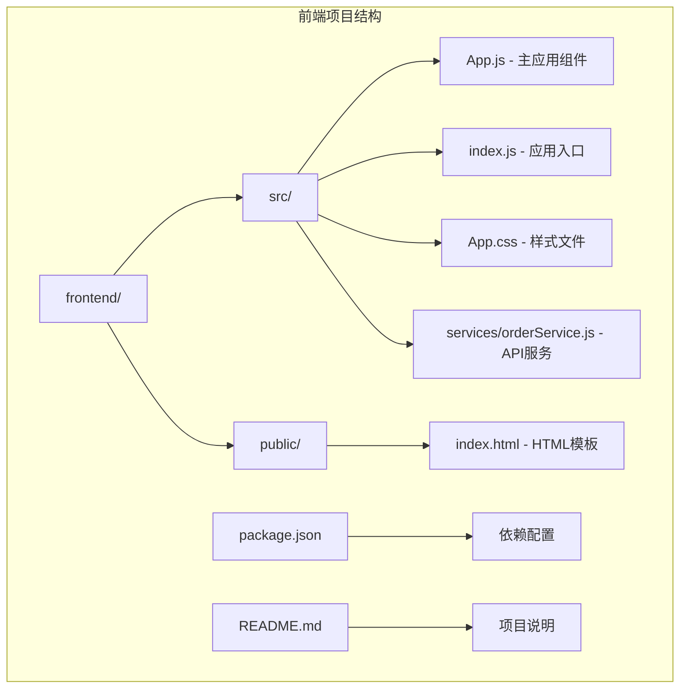
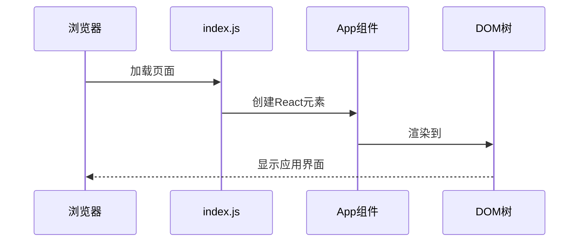
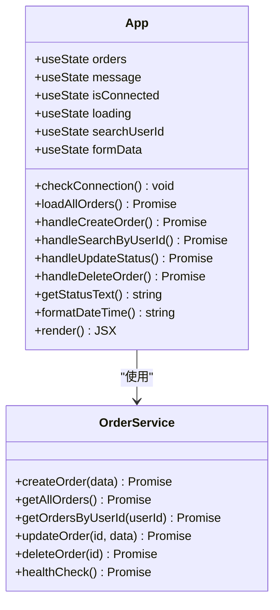
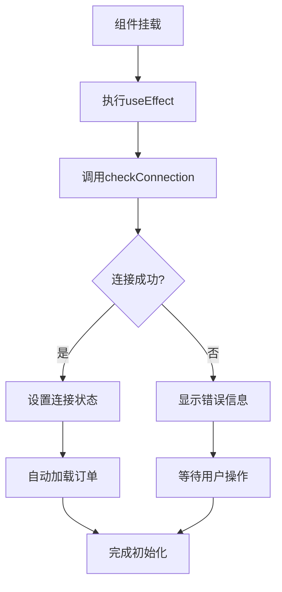
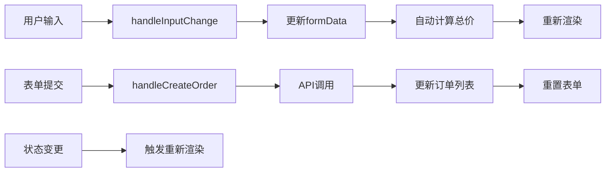
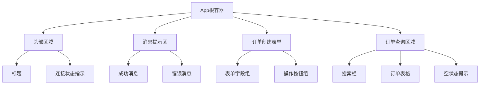
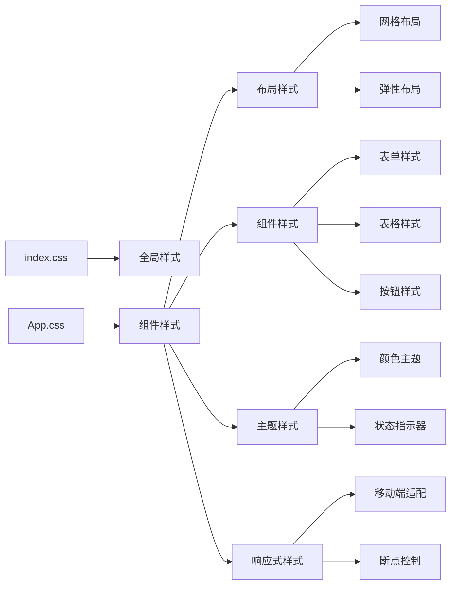
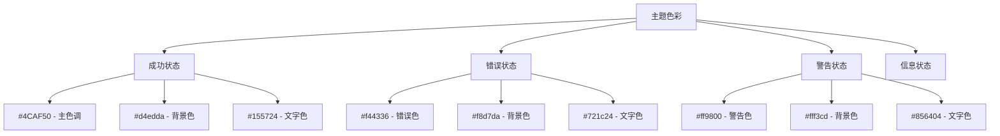
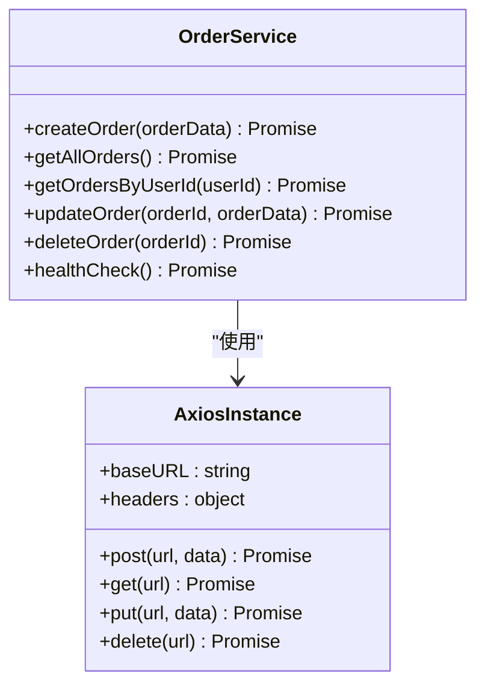

# 前端组件结构

<cite>
**本文档中引用的文件**
- [App.js](file://frontend/src/App.js)
- [index.js](file://frontend/src/index.js)
- [App.css](file://frontend/src/App.css)
- [orderService.js](file://frontend/src/services/orderService.js)
- [index.html](file://frontend/public/index.html)
- [package.json](file://frontend/package.json)
</cite>

## 目录
1. [项目概述](#项目概述)
2. [项目结构分析](#项目结构分析)
3. [应用入口点分析](#应用入口点分析)
4. [主应用组件App.js深度解析](#主应用组件appjs深度解析)
5. [状态管理机制](#状态管理机制)
6. [组件渲染逻辑](#组件渲染逻辑)
7. [样式系统](#样式系统)
8. [服务层架构](#服务层架构)
9. [总结](#总结)

## 项目概述

这是一个基于React 19.2.0构建的订单管理系统前端应用，采用现代React函数式组件和Hooks模式开发。项目使用Create React App框架，集成了Axios进行HTTP请求处理，提供了完整的订单管理功能，包括订单创建、查询、更新和删除操作。

## 项目结构分析



**图表来源**
- [App.js](file://frontend/src/App.js#L1-L10)
- [index.js](file://frontend/src/index.js#L1-L18)
- [orderService.js](file://frontend/src/services/orderService.js#L1-L49)

**章节来源**
- [package.json](file://frontend/package.json#L1-L41)
- [index.html](file://frontend/public/index.html#L1-L44)

## 应用入口点分析

应用的入口点位于`index.js`文件，负责将React应用渲染到DOM中。

### 入口点实现特点

1. **React 18+并发特性支持**：使用`ReactDOM.createRoot()`替代传统的`render()`方法
2. **严格模式包装**：在`React.StrictMode`中包裹应用，启用额外的开发时检查
3. **DOM挂载点**：通过`document.getElementById('root')`定位挂载点

### 渲染流程



**图表来源**
- [index.js](file://frontend/src/index.js#L7-L11)
- [index.html](file://frontend/public/index.html#L31)

**章节来源**
- [index.js](file://frontend/src/index.js#L1-L18)
- [index.html](file://frontend/public/index.html#L30-L32)

## 主应用组件App.js深度解析

App.js是整个应用的核心组件，采用函数式组件和React Hooks模式实现复杂的状态管理和业务逻辑。

### 组件架构概览



**图表来源**
- [App.js](file://frontend/src/App.js#L5-L427)
- [orderService.js](file://frontend/src/services/orderService.js#L12-L48)

### 核心状态定义

App组件定义了多个状态变量，每个都有特定的用途：

| 状态变量 | 类型 | 初始值 | 用途 |
|---------|------|--------|------|
| `orders` | Array | `[]` | 存储订单列表数据 |
| `message` | Object | `{text: '', type: ''}` | 错误提示消息 |
| `isConnected` | Boolean | `false` | 后端连接状态指示 |
| `loading` | Boolean | `false` | 加载状态指示 |
| `searchUserId` | String | `''` | 用户ID搜索输入 |
| `formData` | Object | 订单表单默认值 | 新建订单表单数据 |

**章节来源**
- [App.js](file://frontend/src/App.js#L6-L21)

### 生命周期管理

组件使用`useEffect`钩子实现生命周期管理：



**图表来源**
- [App.js](file://frontend/src/App.js#L23-L38)

**章节来源**
- [App.js](file://frontend/src/App.js#L23-L38)

## 状态管理机制

### React Hooks使用模式

App组件充分利用了React Hooks来管理各种状态：

#### 1. 状态声明模式
```javascript
const [orders, setOrders] = useState([]);
const [formData, setFormData] = useState(initialFormState);
```

#### 2. 异步状态更新模式
```javascript
const loadAllOrders = async () => {
  setLoading(true);
  try {
    // API调用和状态更新
  } catch (error) {
    // 错误处理
  } finally {
    setLoading(false);
  }
};
```

#### 3. 状态组合模式
表单数据的状态管理展示了复杂的对象状态更新：
- 支持动态字段更新
- 自动计算相关字段（如总价）
- 类型转换处理

**章节来源**
- [App.js](file://frontend/src/App.js#L6-L21)
- [App.js](file://frontend/src/App.js#L41-L55)
- [App.js](file://frontend/src/App.js#L62-L76)

### 状态更新策略



**图表来源**
- [App.js](file://frontend/src/App.js#L62-L76)
- [App.js](file://frontend/src/App.js#L78-L98)

## 组件渲染逻辑

### 主界面布局结构

App组件采用分块渲染的方式组织界面：



**图表来源**
- [App.js](file://frontend/src/App.js#L193-L424)

### 条件渲染逻辑

组件实现了复杂的条件渲染逻辑：

#### 1. 连接状态渲染
```javascript
<div className={`connection-status ${isConnected ? 'connected' : 'disconnected'}`}>
  {isConnected ? '✅ 后端已连接' : '❌ 后端未连接'}
</div>
```

#### 2. 加载状态渲染
```javascript
{loading ? (
  <div className="loading">加载中...</div>
) : orders.length > 0 ? (
  // 渲染订单表格
) : (
  <div className="no-orders">暂无订单数据</div>
)}
```

#### 3. 动作按钮条件渲染
```javascript
{order.status === 0 && (
  <button onClick={() => handleUpdateStatus(order.orderId, 1)}>
    支付
  </button>
)}
```

**章节来源**
- [App.js](file://frontend/src/App.js#L196-L206)
- [App.js](file://frontend/src/App.js#L341-L421)

### 表单交互机制

#### 输入字段绑定
所有表单字段都采用受控组件模式：
- `onChange`事件处理
- 实时状态同步
- 自动验证和格式化

#### 特殊字段处理
- **数量字段**：自动计算总价（数量 × 159）
- **状态字段**：下拉选择框，对应不同订单状态
- **只读字段**：总价字段自动计算，用户不可编辑

**章节来源**
- [App.js](file://frontend/src/App.js#L208-L323)

## 样式系统

### CSS架构设计

项目采用模块化的CSS架构：



**图表来源**
- [App.css](file://frontend/src/App.css#L1-L253)

### 样式分类体系

| 样式类别 | 文件位置 | 主要功能 | 关键类名 |
|---------|----------|----------|----------|
| 布局样式 | App.css | 页面整体布局 | `.App`, `.header`, `.order-form` |
| 表单样式 | App.css | 表单元素样式 | `.form-row`, `.form-group`, `.button-group` |
| 按钮样式 | App.css | 操作按钮样式 | `.btn`, `.btn-primary`, `.btn-danger` |
| 状态样式 | App.css | 状态指示器 | `.status-badge`, `.status-0`到`.status-4` |
| 响应式样式 | App.css | 移动端适配 | 媒体查询规则 |

### 主题色彩系统



**图表来源**
- [App.css](file://frontend/src/App.css#L91-L253)

**章节来源**
- [App.css](file://frontend/src/App.css#L1-L253)

## 服务层架构

### API服务封装

orderService模块提供了统一的API访问接口：



**图表来源**
- [orderService.js](file://frontend/src/services/orderService.js#L12-L48)

### API端点映射

| 方法名 | HTTP方法 | 端点路径 | 功能描述 |
|--------|----------|----------|----------|
| `createOrder` | POST | `/api/orders` | 创建新订单 |
| `getAllOrders` | GET | `/api/orders` | 获取所有订单 |
| `getOrdersByUserId` | GET | `/api/orders/user/:userId` | 根据用户ID查询订单 |
| `updateOrder` | PUT | `/api/orders/:orderId` | 更新订单信息 |
| `deleteOrder` | DELETE | `/api/orders/:orderId` | 删除订单 |
| `healthCheck` | GET | `/api/orders/health` | 健康检查 |

### 错误处理机制

服务层实现了统一的错误处理：
- API响应格式标准化
- 错误信息提取和传递
- 网络异常捕获

**章节来源**
- [orderService.js](file://frontend/src/services/orderService.js#L1-L49)

## 总结

该前端项目展现了现代React应用的最佳实践：

### 技术亮点
1. **函数式组件+Hooks模式**：完全采用React 18+的新特性
2. **状态管理**：合理使用多个useState和useEffect
3. **组件化设计**：清晰的职责分离和模块化结构
4. **用户体验**：完善的错误提示和加载状态处理
5. **样式架构**：模块化CSS和响应式设计

### 架构优势
- **可维护性**：清晰的状态管理和组件职责划分
- **可扩展性**：模块化的服务层设计
- **用户体验**：丰富的交互反馈和状态指示
- **代码质量**：类型安全和错误处理机制

### 开发体验
- **TypeScript友好**：虽然使用JavaScript，但有良好的类型推导
- **测试支持**：包含完整的测试基础设施
- **开发工具**：集成Create React App提供的开发工具

这个项目为React前端开发提供了优秀的参考范例，展示了如何构建一个功能完整、用户体验良好的现代Web应用。