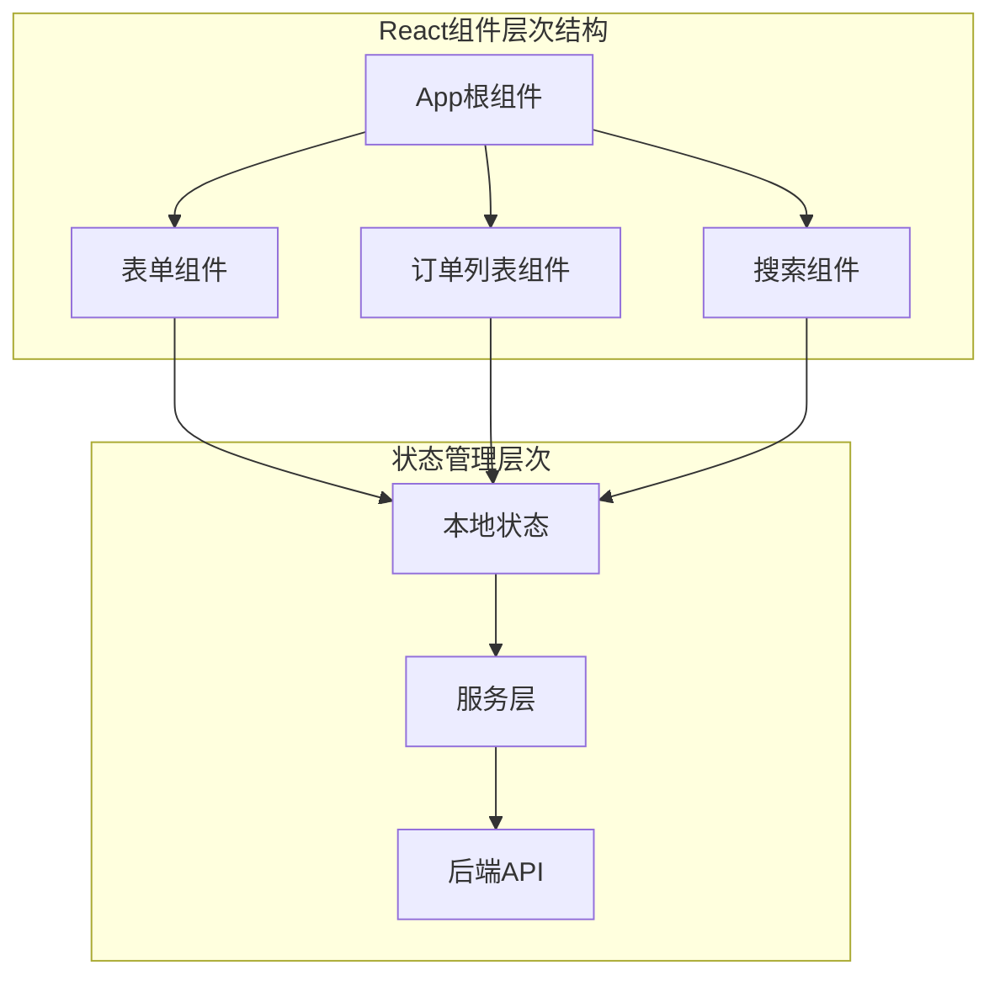
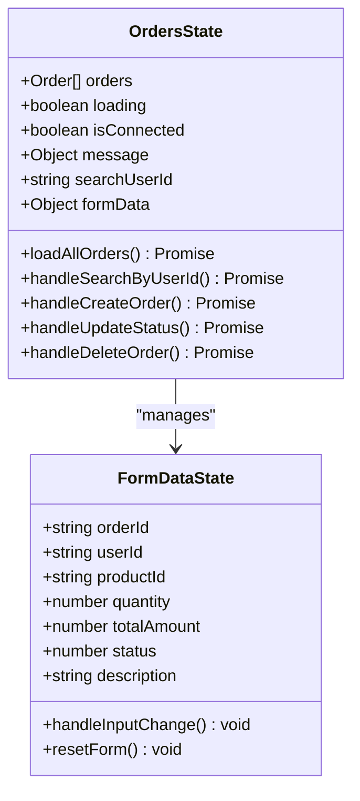
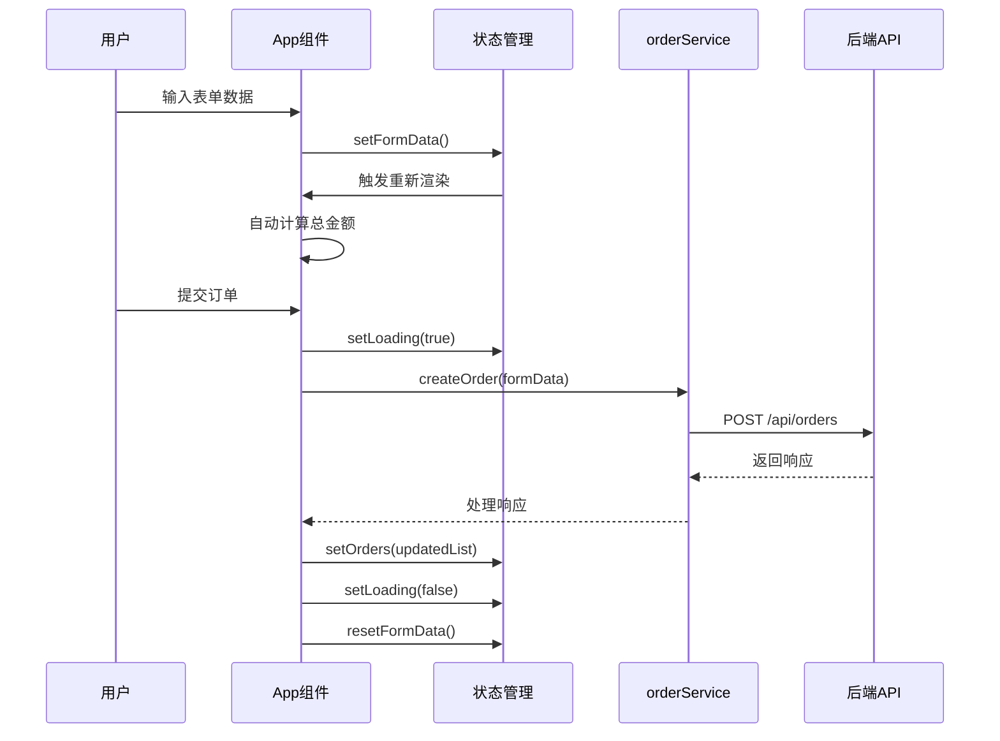
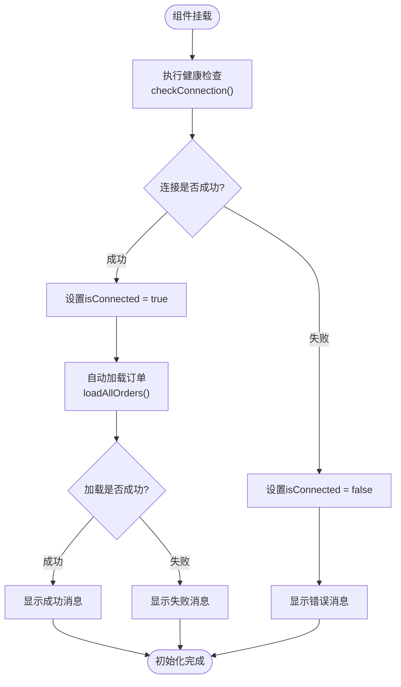
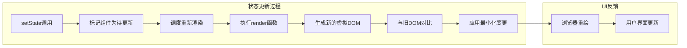

# 状态管理机制

<cite>
**本文档引用的文件**
- [App.js](file://frontend/src/App.js)
- [App.test.js](file://frontend/src/App.test.js)
- [orderService.js](file://frontend/src/services/orderService.js)
- [package.json](file://frontend/package.json)
- [App.css](file://frontend/src/App.css)
- [index.css](file://frontend/src/index.css)
- [setupTests.js](file://frontend/src/setupTests.js)
</cite>

## 目录
1. [项目概述](#项目概述)
2. [状态管理架构](#状态管理架构)
3. [核心状态变量详解](#核心状态变量详解)
4. [响应式数据流机制](#响应式数据流机制)
5. [生命周期管理](#生命周期管理)
6. [状态更新与UI重渲染](#状态更新与ui重渲染)
7. [测试策略与可测试性](#测试策略与可测试性)
8. [常见问题与解决方案](#常见问题与解决方案)
9. [最佳实践建议](#最佳实践建议)

## 项目概述

本项目是一个基于React的订单管理系统，采用现代React Hooks模式实现状态管理。系统通过`useState`和`useEffect` Hook构建了完整的响应式数据流，实现了前后端分离的订单管理功能。

### 技术栈概览

- **前端框架**: React 19.2.0
- **HTTP客户端**: Axios 1.13.2
- **测试框架**: @testing-library/react 16.3.0
- **状态管理**: React Hooks (useState, useEffect)

**章节来源**
- [package.json](file://frontend/package.json#L1-L41)

## 状态管理架构

### 整体架构设计



**图表来源**
- [App.js](file://frontend/src/App.js#L5-L21)

### 状态分层管理

系统采用分层的状态管理模式：

1. **组件级状态**: 在App组件内部维护的局部状态
2. **服务层状态**: 通过orderService处理的异步状态
3. **应用级状态**: 全局性的连接状态和消息状态

## 核心状态变量详解

### 订单状态管理



**图表来源**
- [App.js](file://frontend/src/App.js#L5-L21)

#### 1. 订单列表状态 (`orders`)
- **类型**: `Array<Order>`
- **初始值**: `[]` (空数组)
- **用途**: 存储从后端获取的所有订单数据
- **更新机制**: 通过`setOrders()`函数更新
- **依赖关系**: 影响订单表格的渲染和搜索结果展示

#### 2. 加载状态 (`loading`)
- **类型**: `boolean`
- **初始值**: `false`
- **用途**: 控制加载指示器的显示
- **更新机制**: 在异步操作开始时设置为`true`，结束时设置为`false`
- **UI反馈**: 显示"加载中..."提示

#### 3. 连接状态 (`isConnected`)
- **类型**: `boolean`
- **初始值**: `false`
- **用途**: 标识与后端服务的连接状态
- **更新机制**: 通过健康检查接口自动更新
- **视觉反馈**: 显示连接状态图标和颜色

#### 4. 消息状态 (`message`)
- **类型**: `Object {text: string, type: string}`
- **初始值**: `{text: '', type: ''}`
- **用途**: 显示系统通知和错误信息
- **更新机制**: 通过`showMessage()`函数更新
- **自动清除**: 3秒后自动清空

#### 5. 搜索状态 (`searchUserId`)
- **类型**: `string`
- **初始值**: `''` (空字符串)
- **用途**: 存储用户输入的搜索条件
- **更新机制**: 通过`setSearchUserId()`函数更新
- **搜索触发**: 用户按下回车键或点击查询按钮时触发

#### 6. 表单状态 (`formData`)
- **类型**: `Object`
- **初始值**: 包含订单创建所需的所有字段
- **用途**: 维护订单创建表单的数据状态
- **字段详情**:
  - `orderId`: 订单ID
  - `userId`: 用户ID
  - `productId`: 商品ID
  - `quantity`: 数量，默认1
  - `totalAmount`: 总金额，根据数量自动计算
  - `status`: 订单状态，默认0（待支付）
  - `description`: 订单描述

**章节来源**
- [App.js](file://frontend/src/App.js#L5-L21)

## 响应式数据流机制

### 数据流向图



**图表来源**
- [App.js](file://frontend/src/App.js#L62-L98)
- [orderService.js](file://frontend/src/services/orderService.js#L14-L16)

### 状态更新流程

#### 1. 表单输入处理
当用户在表单中输入时，`handleInputChange`函数被触发：

- **状态读取**: 从`formData`中读取当前状态
- **状态合并**: 使用扩展运算符合并新的输入值
- **自动计算**: 如果是数量字段，自动计算总金额
- **状态更新**: 调用`setFormData()`更新状态

#### 2. 异步操作状态管理
对于所有异步操作（创建、更新、删除订单），系统遵循统一的状态管理模式：

- **开始前**: 设置`loading = true`
- **执行中**: 显示加载指示器
- **成功后**: 更新相关状态，显示成功消息
- **失败后**: 显示错误消息，恢复原始状态
- **完成后**: 设置`loading = false`

#### 3. 错误处理机制
系统实现了完善的错误处理机制：

- **网络错误**: 捕获Axios请求错误
- **API错误**: 处理后端返回的业务错误
- **用户错误**: 验证用户输入的有效性
- **状态恢复**: 错误发生时恢复到稳定状态

**章节来源**
- [App.js](file://frontend/src/App.js#L62-L98)
- [App.js](file://frontend/src/App.js#L80-L102)

## 生命周期管理

### 组件挂载时的初始化流程



**图表来源**
- [App.js](file://frontend/src/App.js#L23-L38)

### useEffect Hook的使用

#### 1. 初始化副作用
```javascript
useEffect(() => {
    checkConnection();
}, []);
```

- **依赖数组**: 空数组表示只在组件挂载时执行一次
- **执行时机**: DOM渲染完成后立即执行
- **副作用**: 检查后端连接并自动加载订单数据

#### 2. 状态同步机制
虽然代码中没有显式的依赖数组，但所有状态更新都遵循以下原则：

- **状态驱动**: 状态变更自动触发重新渲染
- **响应式更新**: 新的状态值立即反映在UI上
- **一致性保证**: 状态变更后UI保持同步

**章节来源**
- [App.js](file://frontend/src/App.js#L23-L26)

## 状态更新与UI重渲染

### React状态更新机制



### 状态更新触发的UI变化

#### 1. 订单列表更新
- **状态变更**: `setOrders(newOrders)`
- **UI影响**: 订单表格重新渲染，显示最新的订单数据
- **性能优化**: 只更新发生变化的订单行

#### 2. 加载状态切换
- **状态变更**: `setLoading(true/false)`
- **UI影响**: 显示/隐藏加载指示器
- **用户体验**: 避免用户重复提交表单

#### 3. 连接状态反馈
- **状态变更**: `setIsConnected(true/false)`
- **UI影响**: 更新连接状态图标和颜色
- **功能影响**: 控制可用的功能按钮

#### 4. 表单状态同步
- **状态变更**: `setFormData(newFormData)`
- **UI影响**: 表单字段同步更新
- **实时计算**: 数量变化时自动更新金额

### 渲染优化策略

#### 1. 条件渲染
系统使用多种条件渲染策略：

```javascript
// 加载状态控制
{loading ? (
  <div className="loading">加载中...</div>
) : orders.length > 0 ? (
  <div className="orders-table">...</div>
) : (
  <div className="no-orders">暂无订单数据</div>
)}
```

#### 2. 状态隔离
不同状态的变化不会相互干扰：
- 订单状态变化不影响表单状态
- 搜索状态变化不影响连接状态
- 错误状态变化不影响正常状态

**章节来源**
- [App.js](file://frontend/src/App.js#L341-L421)

## 测试策略与可测试性

### 当前测试现状分析

目前项目的测试覆盖存在以下特点：

#### 1. 基础测试结构
```javascript
test('renders learn react link', () => {
  render(<App />);
  const linkElement = screen.getByText(/learn react/i);
  expect(linkElement).toBeInTheDocument();
});
```

- **测试目的**: 验证组件能够正确渲染
- **测试范围**: 基础渲染功能
- **局限性**: 缺乏对状态管理逻辑的测试

#### 2. 测试环境配置
- **测试库**: @testing-library/react
- **断言库**: @testing-library/jest-dom
- **模拟支持**: 支持DOM模拟和事件模拟

### 状态管理的可测试性设计

#### 1. 函数式设计
所有状态更新逻辑都封装在纯函数中：

- **可预测性**: 相同输入产生相同输出
- **独立性**: 不依赖外部状态
- **可测试性**: 易于单元测试

#### 2. 服务层抽象
orderService提供了清晰的接口：

- **接口稳定**: API接口相对稳定
- **易于模拟**: 可以轻松模拟服务响应
- **测试隔离**: 服务层可以独立测试

#### 3. 状态验证点
关键状态变化点可以进行测试：

- **连接状态**: 验证健康检查后的状态变化
- **订单状态**: 验证订单加载后的状态更新
- **错误状态**: 验证错误处理后的状态恢复

### 改进建议

#### 1. 添加状态管理测试
```javascript
// 示例：连接状态测试
test('should update connection status on health check', async () => {
  // 模拟健康检查成功
  orderService.healthCheck.mockResolvedValue({ success: true });
  
  render(<App />);
  
  // 验证连接状态
  await waitFor(() => expect(isConnected).toBe(true));
});
```

#### 2. 表单状态测试
```javascript
// 示例：表单输入测试
test('should update form data on input change', () => {
  render(<App />);
  
  const input = screen.getByLabelText('订单ID');
  fireEvent.change(input, { target: { value: 'TEST001' } });
  
  expect(formData.orderId).toBe('TEST001');
});
```

**章节来源**
- [App.test.js](file://frontend/src/App.test.js#L1-L9)
- [setupTests.js](file://frontend/src/setupTests.js#L1-L5)

## 常见问题与解决方案

### 1. 闭包陷阱（Closure Trap）

#### 问题描述
在事件处理器中使用过期的状态值：

```javascript
// 错误示例：闭包陷阱
const handleClick = () => {
  console.log(orders); // 可能是过期的orders
};
```

#### 解决方案
使用函数式更新：

```javascript
// 正确做法：使用函数式更新
const handleUpdateOrders = () => {
  setOrders(prevOrders => [...prevOrders, newOrder]);
};
```

### 2. 状态更新顺序问题

#### 问题描述
多个状态更新之间的依赖关系：

```javascript
// 错误示例：状态更新顺序不确定
setLoading(true);
setOrders([]); // 可能在setLoading之前执行
```

#### 解决方案
使用单一状态更新：

```javascript
// 正确做法：原子性状态更新
setLoading(true);
try {
  const response = await orderService.getAllOrders();
  setOrders(response.data.data);
} finally {
  setLoading(false);
}
```

### 3. 异步状态更新问题

#### 问题描述
异步操作中的状态竞态条件：

```javascript
// 错误示例：竞态条件
let localOrders = orders;
setTimeout(() => {
  setOrders([...localOrders, newOrder]); // 可能基于过期数据
}, 100);
```

#### 解决方案
使用最新状态：

```javascript
// 正确做法：使用最新状态
const handleAsyncOperation = async () => {
  setLoading(true);
  try {
    const response = await orderService.createOrder(formData);
    // 基于最新状态更新
    setOrders(prevOrders => [...prevOrders, response.data]);
  } finally {
    setLoading(false);
  }
};
```

### 4. 状态重置问题

#### 问题描述
复杂状态对象的重置：

```javascript
// 错误示例：部分重置
setFormData({
  ...formData,
  orderId: '', // 忘记重置其他字段
});
```

#### 解决方案
使用完整重置：

```javascript
// 正确做法：完整重置
setFormData({
  orderId: '',
  userId: '',
  productId: '',
  quantity: 1,
  totalAmount: 159,
  status: 0,
  description: ''
});
```

### 5. 性能优化问题

#### 问题描述
不必要的重新渲染：

```javascript
// 错误示例：频繁的状态更新
const handleChange = (e) => {
  setFormData({...formData, [e.target.name]: e.target.value});
  // 可能导致多次重新渲染
};
```

#### 解决方案
批量更新或使用防抖：

```javascript
// 正确做法：批量更新
const handleChange = (e) => {
  const { name, value } = e.target;
  let newFormData = {...formData, [name]: value};
  
  if (name === 'quantity') {
    newFormData.totalAmount = parseInt(value) * 159;
  }
  
  setFormData(newFormData);
};
```

## 最佳实践建议

### 1. 状态设计原则

#### 单一职责原则
每个状态变量应该有明确的单一职责：

```javascript
// 好的做法：职责分离
const [orders, setOrders] = useState([]);
const [loading, setLoading] = useState(false);
const [error, setError] = useState(null);

// 避免：状态聚合
const [appState, setAppState] = useState({
  orders: [],
  loading: false,
  error: null,
  // 更多状态...
});
```

#### 状态最小化原则
只存储必要的状态信息：

```javascript
// 好的做法：最小化状态
const [searchTerm, setSearchTerm] = useState('');

// 避免：冗余状态
const [searchTerm, setSearchTerm] = useState('');
const [filteredOrders, setFilteredOrders] = useState(orders); // 冗余
```

### 2. 状态更新优化

#### 1. 批量更新
减少状态更新次数：

```javascript
// 好的做法：批量更新
const handleBatchUpdate = () => {
  setOrders(newOrders);
  setLoading(false);
  showMessage('批量更新成功');
};
```

#### 2. 条件更新
只有在状态确实改变时才更新：

```javascript
// 好的做法：条件更新
const updateIfChanged = (newState) => {
  if (JSON.stringify(state) !== JSON.stringify(newState)) {
    setState(newState);
  }
};
```

### 3. 错误处理最佳实践

#### 1. 分层错误处理
在不同层次处理不同类型错误：

```javascript
// 应用层错误处理
const handleError = (error) => {
  if (error.response) {
    // API错误
    showMessage(error.response.data.message, 'error');
  } else if (error.request) {
    // 网络错误
    showMessage('网络连接失败，请检查您的网络', 'error');
  } else {
    // 其他错误
    showMessage('系统错误，请稍后重试', 'error');
  }
};
```

#### 2. 状态恢复机制
确保错误后系统能够恢复：

```javascript
// 好的做法：错误恢复
const safeOperation = async (operation) => {
  setLoading(true);
  try {
    return await operation();
  } catch (error) {
    handleError(error);
    throw error; // 重新抛出以便调用者处理
  } finally {
    setLoading(false);
  }
};
```

### 4. 性能监控

#### 1. 状态更新监控
监控状态更新频率和性能：

```javascript
// 开发环境监控
if (process.env.NODE_ENV === 'development') {
  console.log('State updated:', { orders, loading, error });
}
```

#### 2. 渲染性能优化
识别和优化慢的渲染：

```javascript
// 使用React.memo优化子组件
const OrderItem = React.memo(({ order }) => {
  return <div>{order.id}</div>;
});
```

### 5. 可维护性考虑

#### 1. 状态命名规范
使用清晰的状态命名：

```javascript
// 好的做法：语义化命名
const [isLoading, setIsLoading] = useState(false);
const [selectedOrder, setSelectedOrder] = useState(null);
const [errorMessage, setErrorMessage] = useState('');

// 避免：模糊命名
const [flag, setFlag] = useState(false);
const [data, setData] = useState(null);
const [msg, setMsg] = useState('');
```

#### 2. 状态文档化
为复杂状态添加注释：

```javascript
/**
 * 订单状态管理
 * - orders: 当前显示的订单列表
 * - loading: 是否正在加载数据
 * - error: 最近的错误信息
 * - selectedOrderId: 当前选中的订单ID
 */
const [orders, setOrders] = useState([]);
const [loading, setLoading] = useState(false);
const [error, setError] = useState(null);
const [selectedOrderId, setSelectedOrderId] = useState(null);
```

通过遵循这些最佳实践，可以构建更加健壮、可维护和高性能的状态管理系统。状态管理不仅仅是数据存储，更是整个应用程序可靠性和用户体验的基础。