# 后端架构设计文档

<cite>
**本文档引用的文件**
- [App.java](file://src/main/java/com/example/demo/App.java)
- [OrderController.java](file://src/main/java/com/example/demo/controller/OrderController.java)
- [OrderService.java](file://src/main/java/com/example/demo/service/OrderService.java)
- [OrderDAO.java](file://src/main/java/com/example/demo/dao/OrderDAO.java)
- [Order.java](file://src/main/java/com/example/demo/entity/Order.java)
- [WebConfig.java](file://src/main/java/com/example/demo/config/WebConfig.java)
- [DBUtil.java](file://src/main/java/com/example/demo/dao/DBUtil.java)
- [application.properties](file://src/main/resources/application.properties)
- [pom.xml](file://pom.xml)
- [DesignDoc1110.md](file://DesignDoc1110.md)
- [OrderControllerIT.java](file://src/test/java/com/example/demo/controller/OrderControllerIT.java)
</cite>

## 目录
1. [系统概述](#系统概述)
2. [项目结构分析](#项目结构分析)
3. [启动类架构](#启动类架构)
4. [控制层设计](#控制层设计)
5. [服务层设计](#服务层设计)
6. [数据访问层设计](#数据访问层设计)
7. [实体模型设计](#实体模型设计)
8. [架构依赖关系](#架构依赖关系)
9. [数据流分析](#数据流分析)
10. [性能与优化考虑](#性能与优化考虑)
11. [总结](#总结)

## 系统概述

本系统是一个基于Spring Boot框架构建的订单管理系统，采用经典的三层架构模式（Controller-Service-DAO），使用SQLite作为数据存储解决方案。系统实现了完整的RESTful API，支持订单的创建、查询、更新和删除等核心业务功能。

### 技术栈特点
- **Spring Boot 2.7.14**：提供快速开发和部署能力
- **SQLite数据库**：轻量级、嵌入式数据库，适合小型应用
- **JDBC操作**：直接数据库访问，避免ORM复杂性
- **内存缓存+持久化**：提升性能的同时保证数据一致性

## 项目结构分析

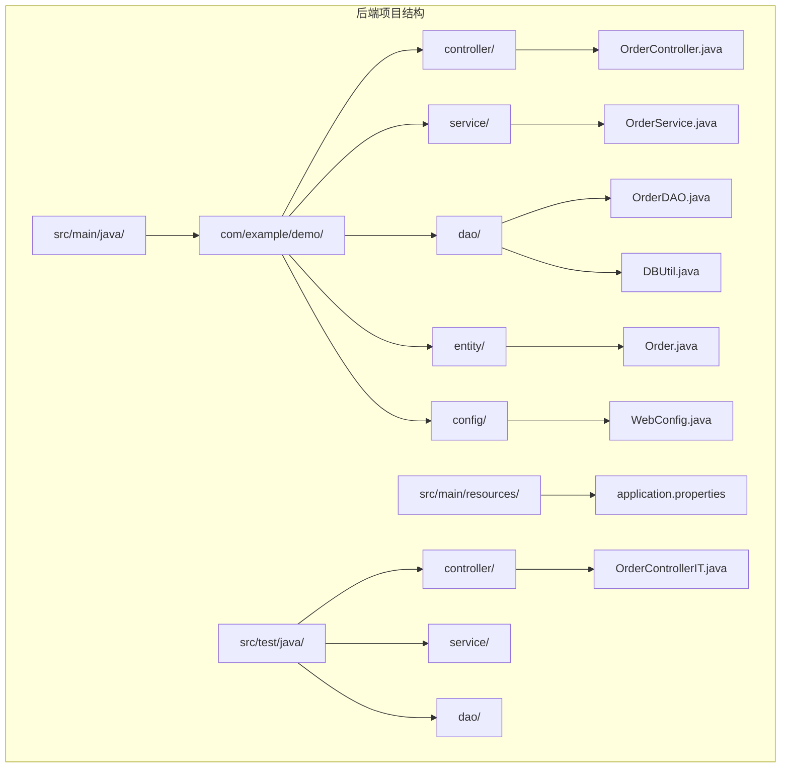

**图表来源**
- [App.java](file://src/main/java/com/example/demo/App.java#L1-L24)
- [OrderController.java](file://src/main/java/com/example/demo/controller/OrderController.java#L1-L173)
- [OrderService.java](file://src/main/java/com/example/demo/service/OrderService.java#L1-L114)
- [OrderDAO.java](file://src/main/java/com/example/demo/dao/OrderDAO.java#L1-L248)

**章节来源**
- [App.java](file://src/main/java/com/example/demo/App.java#L1-L24)
- [OrderController.java](file://src/main/java/com/example/demo/controller/OrderController.java#L1-L173)
- [OrderService.java](file://src/main/java/com/example/demo/service/OrderService.java#L1-L114)
- [OrderDAO.java](file://src/main/java/com/example/demo/dao/OrderDAO.java#L1-L248)

## 启动类架构

### App.java - Spring Boot主类

App.java作为Spring Boot应用的入口点，负责应用上下文的初始化和Bean的配置。

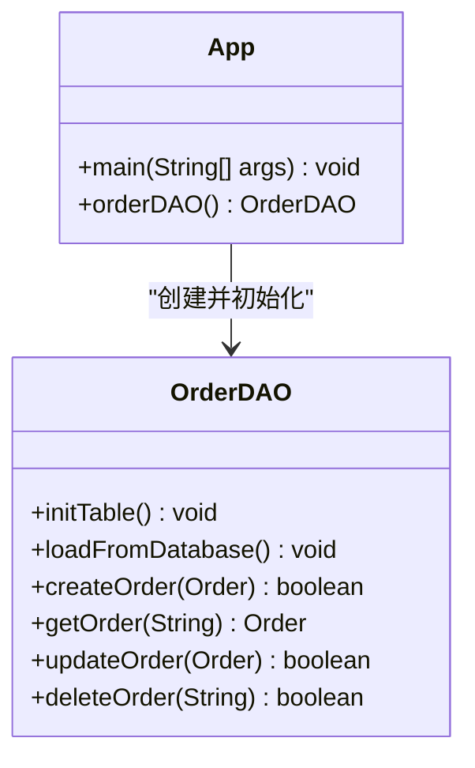

**图表来源**
- [App.java](file://src/main/java/com/example/demo/App.java#L11-L24)
- [OrderDAO.java](file://src/main/java/com/example/demo/dao/OrderDAO.java#L18-L248)

#### 核心职责分析

1. **应用启动引导**：通过`@SpringBootApplication`注解启用Spring Boot自动配置
2. **Bean生命周期管理**：通过`@Bean`注解配置OrderDAO Bean
3. **数据初始化**：在应用启动时执行数据库表初始化和数据加载

#### 关键特性

- **自动配置**：利用Spring Boot的自动配置机制
- **依赖注入**：通过构造函数注入OrderDAO依赖
- **数据预加载**：启动时从SQLite数据库加载数据到内存

**章节来源**
- [App.java](file://src/main/java/com/example/demo/App.java#L11-L24)
- [application.properties](file://src/main/resources/application.properties#L1-L5)

## 控制层设计

### OrderController.java - RESTful API控制器

OrderController是系统的HTTP请求入口，负责处理所有与订单相关的RESTful API请求。

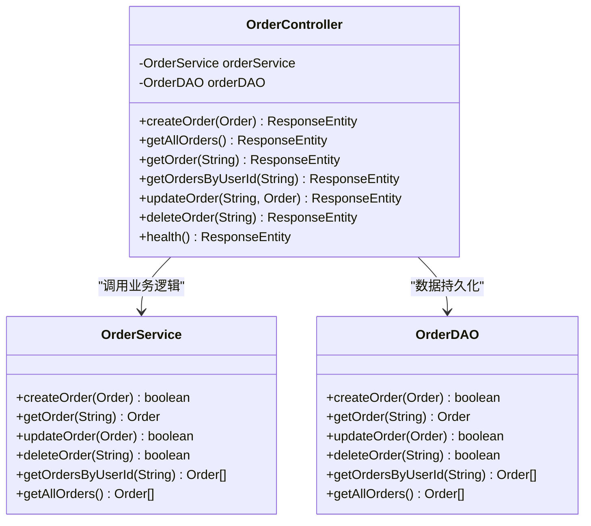

**图表来源**
- [OrderController.java](file://src/main/java/com/example/demo/controller/OrderController.java#L18-L173)
- [OrderService.java](file://src/main/java/com/example/demo/service/OrderService.java#L13-L114)
- [OrderDAO.java](file://src/main/java/com/example/demo/dao/OrderDAO.java#L18-L248)

#### RESTful API设计原则

1. **统一资源定位**：所有API路径以`/api/orders`开头
2. **HTTP方法语义**：
   - `POST`：创建订单
   - `GET`：查询订单
   - `PUT`：更新订单
   - `DELETE`：删除订单
3. **跨域支持**：通过`@CrossOrigin`注解支持前端跨域访问

#### 请求处理流程

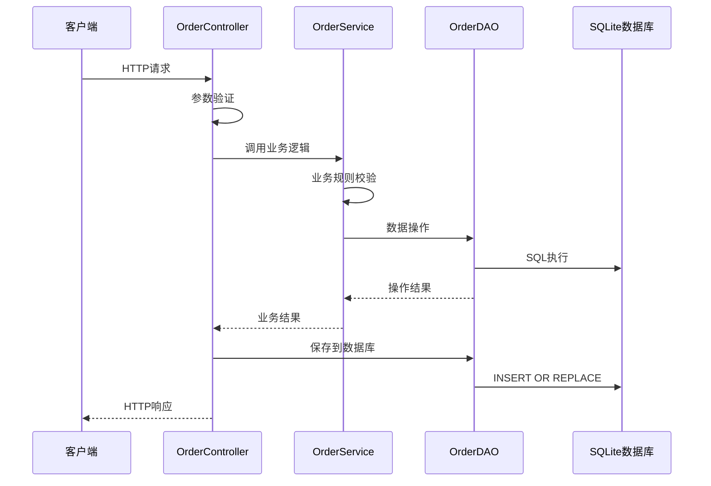

**图表来源**
- [OrderController.java](file://src/main/java/com/example/demo/controller/OrderController.java#L35-L55)
- [OrderService.java](file://src/main/java/com/example/demo/service/OrderService.java#L28-L37)
- [OrderDAO.java](file://src/main/java/com/example/demo/dao/OrderDAO.java#L51-L77)

#### 核心业务规则实现

1. **订单创建校验**：
   - 购买数量必须大于0
   - 订单金额必须大于0
   - 不能创建重复订单

2. **订单更新规则**：
   - 已完成订单（status=3）不能修改
   - 只能更新存在的订单

3. **订单删除规则**：
   - 已支付订单（status=1）不能删除
   - 只能删除存在的订单

**章节来源**
- [OrderController.java](file://src/main/java/com/example/demo/controller/OrderController.java#L35-L171)
- [WebConfig.java](file://src/main/java/com/example/demo/config/WebConfig.java#L14-L26)

## 服务层设计

### OrderService.java - 业务逻辑层

OrderService实现了系统的核心业务逻辑，负责处理业务规则和数据校验。

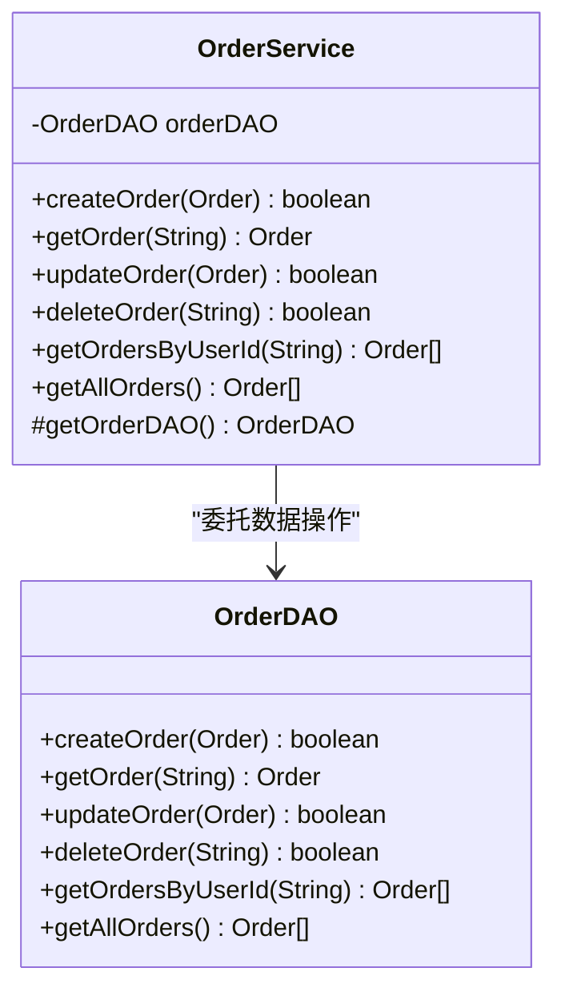

**图表来源**
- [OrderService.java](file://src/main/java/com/example/demo/service/OrderService.java#L13-L114)
- [OrderDAO.java](file://src/main/java/com/example/demo/dao/OrderDAO.java#L18-L248)

#### 业务逻辑实现特点

1. **参数校验**：在业务层进行数据完整性检查
2. **业务规则**：实现订单状态变更的业务约束
3. **异常处理**：统一的异常处理和错误信息返回
4. **测试友好**：提供protected方法便于单元测试

#### 核心业务规则

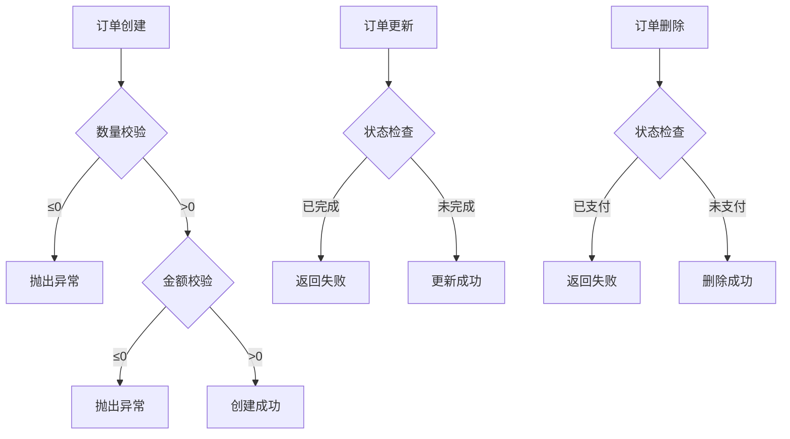

**图表来源**
- [OrderService.java](file://src/main/java/com/example/demo/service/OrderService.java#L28-L90)

**章节来源**
- [OrderService.java](file://src/main/java/com/example/demo/service/OrderService.java#L13-L114)

## 数据访问层设计

### OrderDAO.java - 数据访问对象

OrderDAO实现了数据访问层的功能，负责与SQLite数据库交互并维护内存缓存。

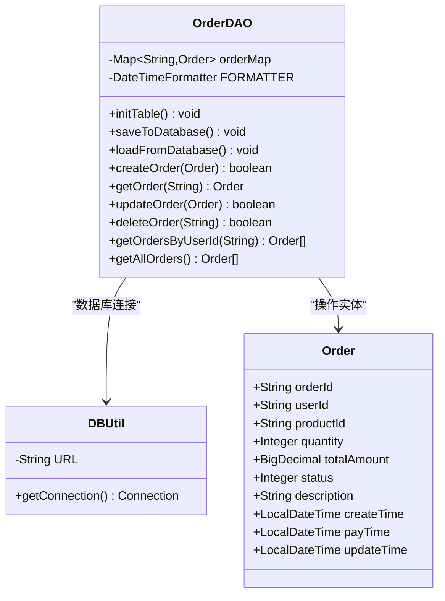

**图表来源**
- [OrderDAO.java](file://src/main/java/com/example/demo/dao/OrderDAO.java#L18-L248)
- [DBUtil.java](file://src/main/java/com/example/demo/dao/DBUtil.java#L9-L19)
- [Order.java](file://src/main/java/com/example/demo/entity/Order.java#L7-L162)

#### 数据持久化策略

1. **内存缓存**：使用ConcurrentHashMap作为高性能内存存储
2. **批量操作**：通过PreparedStatement批量插入和更新
3. **事务一致性**：确保内存数据与数据库的一致性
4. **时间格式处理**：支持多种时间格式的解析和序列化

#### 数据库操作流程

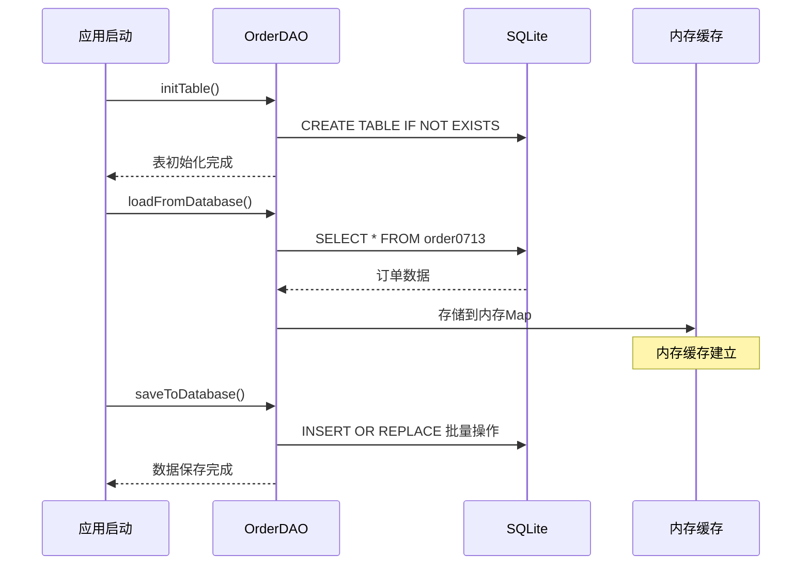

**图表来源**
- [OrderDAO.java](file://src/main/java/com/example/demo/dao/OrderDAO.java#L28-L77)
- [OrderDAO.java](file://src/main/java/com/example/demo/dao/OrderDAO.java#L83-L157)

#### 核心数据操作方法

| 方法名 | 功能描述 | 性能特点 |
|--------|----------|----------|
| `createOrder()` | 创建新订单，检查重复性 | O(1) 查找，O(1) 插入 |
| `getOrder()` | 根据ID获取订单 | O(1) 查找 |
| `updateOrder()` | 更新订单信息 | O(1) 查找，O(1) 更新 |
| `deleteOrder()` | 删除订单 | O(1) 查找，O(1) 删除 |
| `getOrdersByUserId()` | 按用户ID查询订单 | O(n) 过滤，O(n log n) 排序 |
| `getAllOrders()` | 获取所有订单 | O(n log n) 排序 |

**章节来源**
- [OrderDAO.java](file://src/main/java/com/example/demo/dao/OrderDAO.java#L18-L248)
- [DBUtil.java](file://src/main/java/com/example/demo/dao/DBUtil.java#L9-L19)

## 实体模型设计

### Order.java - 订单实体类

Order类是系统的核心数据模型，定义了订单的所有属性和相关操作。

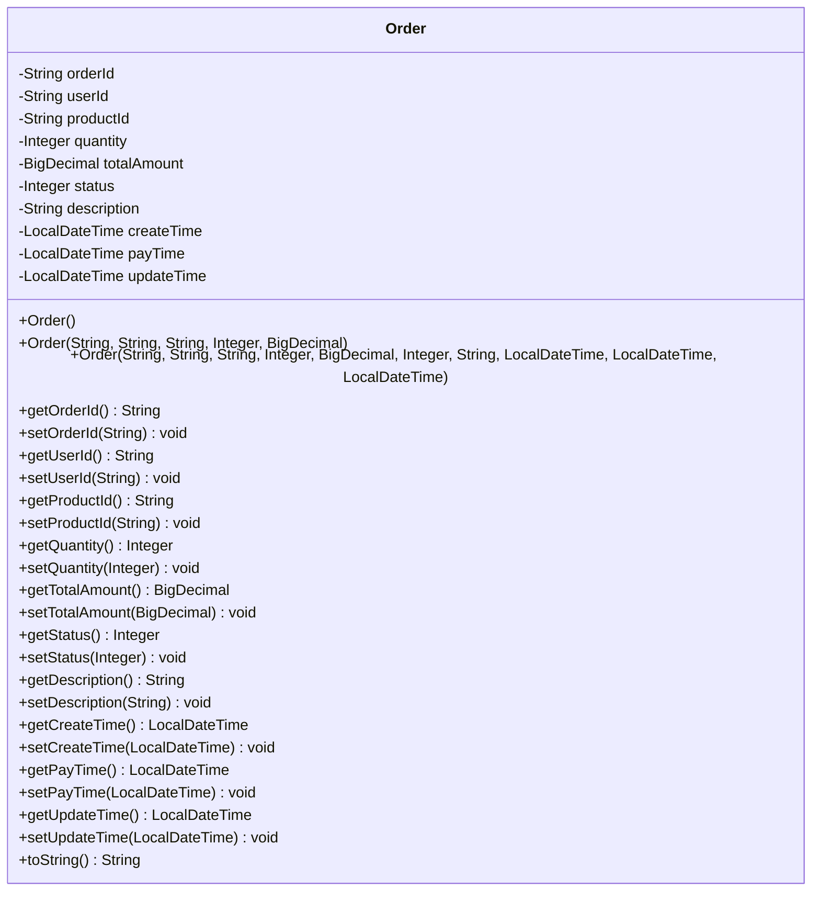

**图表来源**
- [Order.java](file://src/main/java/com/example/demo/entity/Order.java#L7-L162)

#### 订单状态定义

| 状态值 | 状态名称 | 业务含义 |
|--------|----------|----------|
| 0 | 待支付 | 订单已创建但未支付 |
| 1 | 已支付 | 订单已完成支付 |
| 2 | 已发货 | 订单已发货给客户 |
| 3 | 已完成 | 订单交易完成 |
| 4 | 已取消 | 订单被取消 |

#### 构造函数设计

系统提供了三种构造函数：
1. **无参构造函数**：用于Jackson反序列化
2. **基础构造函数**：包含必要字段
3. **全参数构造函数**：包含所有字段

**章节来源**
- [Order.java](file://src/main/java/com/example/demo/entity/Order.java#L7-L162)

## 架构依赖关系

### 组件间依赖图

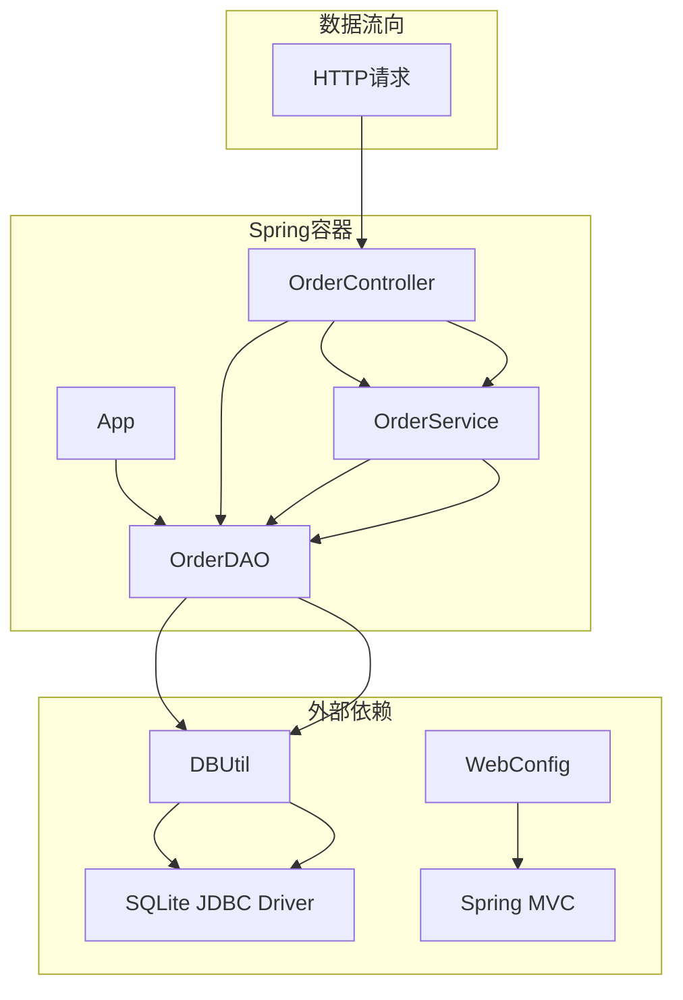

**图表来源**
- [App.java](file://src/main/java/com/example/demo/App.java#L18-L23)
- [OrderController.java](file://src/main/java/com/example/demo/controller/OrderController.java#L23-L30)
- [OrderService.java](file://src/main/java/com/example/demo/service/OrderService.java#L16-L21)

### 依赖注入关系

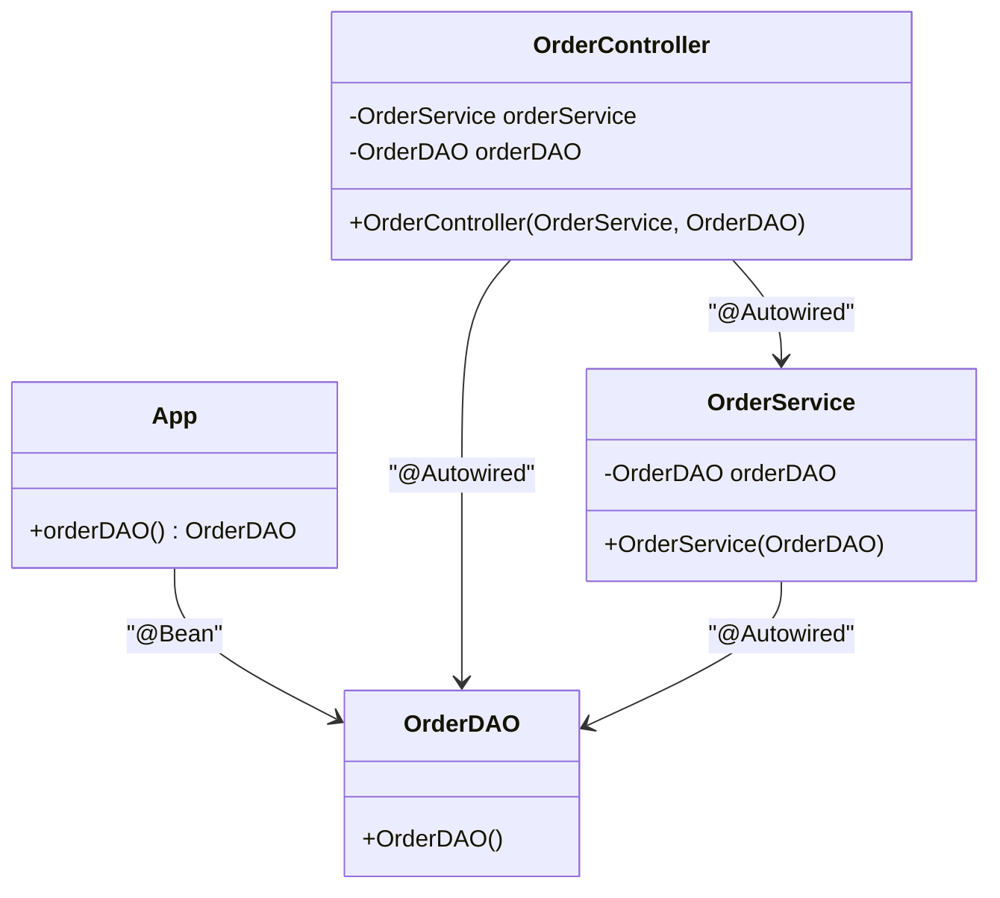

**图表来源**
- [App.java](file://src/main/java/com/example/demo/App.java#L18-L23)
- [OrderController.java](file://src/main/java/com/example/demo/controller/OrderController.java#L23-L30)
- [OrderService.java](file://src/main/java/com/example/demo/service/OrderService.java#L16-L21)

**章节来源**
- [App.java](file://src/main/java/com/example/demo/App.java#L18-L23)
- [OrderController.java](file://src/main/java/com/example/demo/controller/OrderController.java#L23-L30)
- [OrderService.java](file://src/main/java/com/example/demo/service/OrderService.java#L16-L21)

## 数据流分析

### 完整数据流图

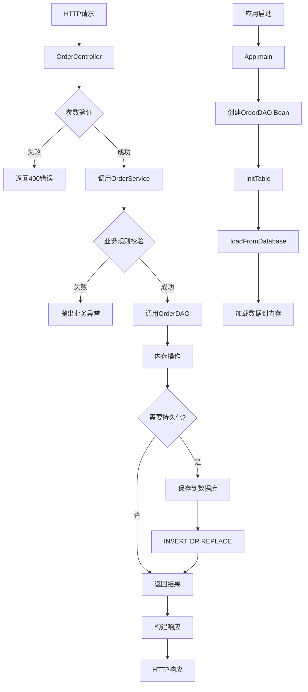

**图表来源**
- [OrderController.java](file://src/main/java/com/example/demo/controller/OrderController.java#L35-L55)
- [OrderService.java](file://src/main/java/com/example/demo/service/OrderService.java#L28-L37)
- [OrderDAO.java](file://src/main/java/com/example/demo/dao/OrderDAO.java#L51-L77)

### 数据一致性保障机制

1. **内存缓存**：提供快速访问性能
2. **批量持久化**：减少数据库I/O次数
3. **事务边界**：确保操作的原子性
4. **异常回滚**：失败时保持数据一致性

**章节来源**
- [OrderController.java](file://src/main/java/com/example/demo/controller/OrderController.java#L35-L55)
- [OrderDAO.java](file://src/main/java/com/example/demo/dao/OrderDAO.java#L51-L77)

## 性能与优化考虑

### 性能优化策略

1. **内存缓存**：使用ConcurrentHashMap提供O(1)查找性能
2. **批量操作**：PreparedStatement批量插入提升吞吐量
3. **懒加载**：应用启动时异步加载数据
4. **连接池**：SQLite JDBC驱动内置连接池

### 并发处理

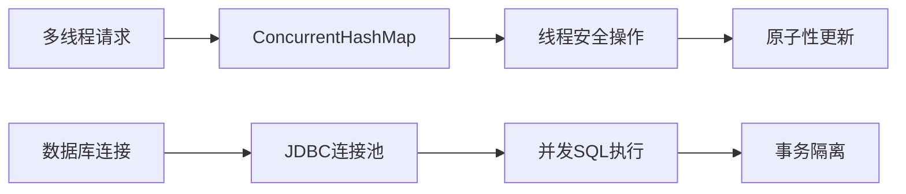

### 扩展性考虑

1. **模块化设计**：各层职责清晰，易于扩展
2. **接口抽象**：DAO层接口便于替换实现
3. **配置化**：通过application.properties配置系统参数
4. **监控支持**：提供健康检查接口

**章节来源**
- [OrderDAO.java](file://src/main/java/com/example/demo/dao/OrderDAO.java#L19-L20)
- [application.properties](file://src/main/resources/application.properties#L1-L5)

## 总结

本系统采用了经典的三层架构设计，通过清晰的职责分离实现了良好的可维护性和可扩展性：

### 架构优势

1. **清晰的分层**：Controller-Service-DAO三层架构，职责明确
2. **数据一致性**：内存缓存与数据库的同步机制
3. **业务规则**：在Service层实现业务逻辑，便于维护
4. **RESTful设计**：符合现代API设计规范
5. **测试友好**：良好的依赖注入设计便于单元测试

### 技术特色

1. **Spring Boot集成**：简化配置和部署
2. **SQLite轻量化**：适合小型应用场景
3. **内存+持久化**：平衡性能和数据持久性
4. **跨域支持**：便于前后端分离开发

### 应用场景

该架构特别适合以下场景：
- 小型到中型的订单管理系统
- 需要快速原型开发的应用
- 对数据一致性要求较高的业务场景
- 需要良好测试覆盖的项目

通过这种设计，系统在保持简单性的同时，具备了良好的扩展性和维护性，为后续的功能扩展奠定了坚实的基础。