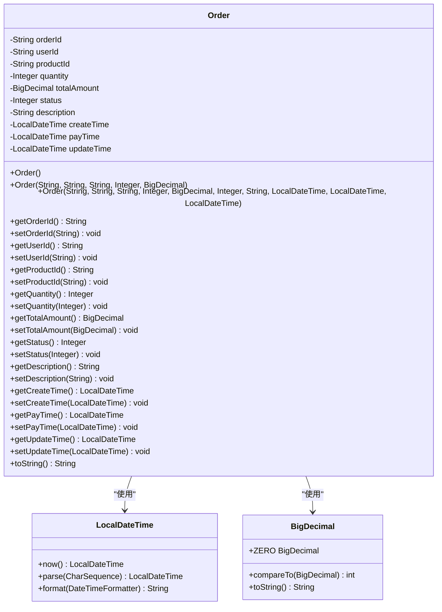
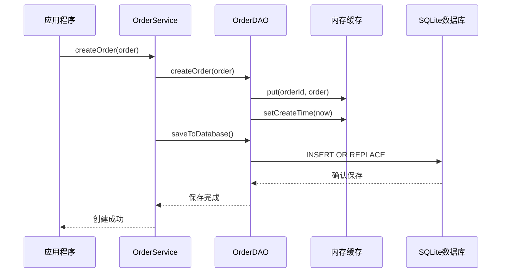
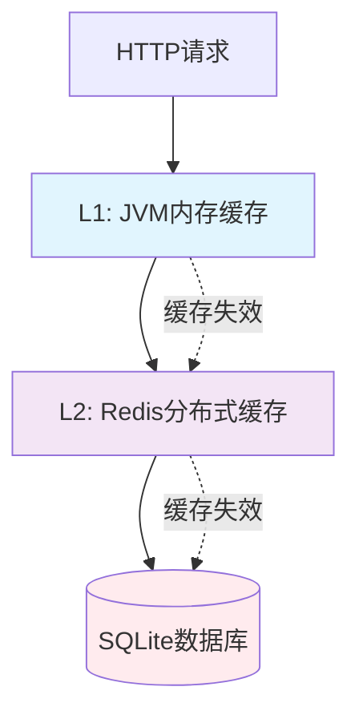

# Order.java实体类数据模型完整文档

<cite>
**本文档引用的文件**
- [Order.java](file://src/main/java/com/example/demo/entity/Order.java)
- [OrderTest.java](file://src/test/java/com/example/demo/entity/OrderTest.java)
- [OrderController.java](file://src/main/java/com/example/demo/controller/OrderController.java)
- [OrderDAO.java](file://src/main/java/com/example/demo/dao/OrderDAO.java)
- [OrderService.java](file://src/main/java/com/example/demo/service/OrderService.java)
- [DBUtil.java](file://src/main/java/com/example/demo/dao/DBUtil.java)
- [application.properties](file://src/main/resources/application.properties)
</cite>

## 目录
1. [概述](#概述)
2. [实体类结构分析](#实体类结构分析)
3. [核心属性详解](#核心属性详解)
4. [构造函数设计](#构造函数设计)
5. [JavaBean规范实现](#javabean规范实现)
6. [对象-关系映射(ORM)实现](#对象-关系映射orm实现)
7. [JSON序列化与反序列化](#json序列化与反序列化)
8. [时区处理策略](#时区处理策略)
9. [性能优化建议](#性能优化建议)
10. [最佳实践指南](#最佳实践指南)

## 概述

Order.java实体类是订单管理系统的核心数据模型，采用Java标准的POJO(Plain Old Java Object)设计模式，实现了领域驱动设计(DDD)中的实体概念。该实体类不仅包含了订单业务的所有必要属性，还遵循了JavaBean规范，支持Spring框架的依赖注入和数据绑定功能。

### 设计理念

- **单一职责原则**: 专注于订单数据结构的定义
- **数据封装**: 使用private修饰符保护内部数据
- **可扩展性**: 支持多种构造函数和getter/setter方法
- **兼容性**: 与Spring Boot、Jackson等主流框架无缝集成

## 实体类结构分析



**图表来源**
- [Order.java](file://src/main/java/com/example/demo/entity/Order.java#L1-L162)

**章节来源**
- [Order.java](file://src/main/java/com/example/demo/entity/Order.java#L1-L162)

## 核心属性详解

### 主键标识属性

#### orderId (订单唯一标识)
- **数据类型**: `String`
- **业务含义**: 订单的全局唯一标识符，用于区分不同的订单记录
- **设计考量**: 
  - 使用String类型而非Long或Integer，支持UUID格式或其他自定义格式
  - 符合业务场景中可能存在的复杂订单编号规则
  - 便于与其他系统进行数据交换

#### userId (用户ID)
- **数据类型**: `String`
- **业务含义**: 关联的用户标识，建立订单与用户的关联关系
- **设计考量**: 
  - 采用String类型支持多种用户认证体系
  - 便于与外部认证系统集成
  - 支持分布式环境下的用户ID格式

#### productId (商品ID)
- **数据类型**: `String`
- **业务含义**: 关联的商品标识，建立订单与商品的关联关系
- **设计考量**: 
  - 支持SKU、UPC等多种商品编码格式
  - 便于与商品管理系统进行集成
  - 支持虚拟商品和实物商品的统一管理

### 交易属性

#### quantity (购买数量)
- **数据类型**: `Integer`
- **业务含义**: 单个商品的购买数量，支持正整数值
- **设计考量**:
  - 使用Integer而非Double，避免浮点数精度问题
  - 限制为正整数，符合实际业务需求
  - 支持批量购买场景

#### totalAmount (订单总金额)
- **数据类型**: `BigDecimal`
- **业务含义**: 订单的总金额，精确到小数点后两位
- **设计考量**:
  - 使用BigDecimal避免浮点数精度丢失
  - 支持货币计算的精确性要求
  - 便于进行复杂的财务计算

### 状态管理属性

#### status (订单状态)
- **数据类型**: `Integer`
- **业务含义**: 订单当前的业务状态，采用整数枚举值
- **状态定义**:
  - `0`: 待支付 - 订单已创建但未完成支付
  - `1`: 已支付 - 订单已完成支付，等待发货
  - `2`: 已发货 - 订单已发货，等待收货确认
  - `3`: 已完成 - 订单已完成，用户已确认收货
  - `4`: 已取消 - 订单因各种原因被取消

#### description (订单描述)
- **数据类型**: `String`
- **业务含义**: 订单的附加说明信息，可用于备注或特殊要求
- **设计考量**:
  - 支持多语言和特殊字符
  - 便于用户填写个性化需求
  - 为客服和售后提供参考信息

### 时间戳属性

#### createTime (创建时间)
- **数据类型**: `LocalDateTime`
- **业务含义**: 订单创建的时间戳，记录订单的初始创建时间
- **设计考量**:
  - 使用LocalDateTime而非Date，提供更好的日期时间API
  - 包含精确到毫秒的时间信息
  - 支持时区无关的本地时间处理

#### payTime (支付时间)
- **数据类型**: `LocalDateTime`
- **业务含义**: 订单完成支付的时间戳，仅在订单状态为已支付时有效
- **设计考量**:
  - 可为空，表示订单尚未完成支付
  - 精确记录支付完成的时间点
  - 支持支付超时等业务场景

#### updateTime (更新时间)
- **数据类型**: `LocalDateTime`
- **业务含义**: 订单最后一次修改的时间戳，记录状态变更时间
- **设计考量**:
  - 自动维护，每次更新时自动设置当前时间
  - 支持审计和追踪功能
  - 便于实现乐观锁等并发控制机制

**章节来源**
- [Order.java](file://src/main/java/com/example/demo/entity/Order.java#L11-L38)

## 构造函数设计

### 无参构造函数

```java
// 无参构造函数（用于Jackson反序列化）
public Order() {
    this.status = 0;  // 默认待支付
    this.createTime = LocalDateTime.now();
}
```

**设计意图**:
- **Jackson反序列化支持**: 无参构造函数是Jackson JSON库进行反序列化的必要条件
- **默认状态设置**: 自动设置订单状态为"待支付"(0)，确保数据完整性
- **时间戳初始化**: 自动生成创建时间，避免空指针异常

### 全参数构造函数

```java
public Order(String orderId, String userId, String productId, Integer quantity, 
             BigDecimal totalAmount, Integer status, String description, LocalDateTime createTime, 
             LocalDateTime payTime, LocalDateTime updateTime) {
    this.orderId = orderId;
    this.userId = userId;
    this.productId = productId;
    this.quantity = quantity;
    this.totalAmount = totalAmount;
    this.status = status != null ? status : 0;  // 默认待支付
    this.description = description;
    this.createTime = createTime != null ? createTime : LocalDateTime.now();
    this.payTime = payTime;
    this.updateTime = updateTime;
}
```

**设计特点**:
- **参数校验**: 对关键参数进行非空检查和默认值处理
- **灵活性**: 支持完全自定义的订单对象创建
- **数据完整性**: 确保每个订单都有有效的基本属性

### 基础字段构造函数

```java
public Order(String orderId, String userId, String productId, Integer quantity, BigDecimal totalAmount) {
    this(orderId, userId, productId, quantity, totalAmount, 0, null, null, null, null);
}
```

**设计目的**:
- **简化创建过程**: 为常见的订单创建场景提供便捷方法
- **减少样板代码**: 避免重复传递相同的默认参数
- **保持一致性**: 确保基础订单对象的一致性

**章节来源**
- [Order.java](file://src/main/java/com/example/demo/entity/Order.java#L40-L65)

## JavaBean规范实现

Order类严格遵循JavaBean规范，提供了完整的getter和setter方法，支持Spring框架的数据绑定和依赖注入功能。

### Getter方法规范

每个属性都提供了对应的getter方法，命名遵循JavaBean规范：

- `getOrderId()` → 获取订单ID
- `getUserId()` → 获取用户ID  
- `getProductId()` → 获取商品ID
- `getQuantity()` → 获取购买数量
- `getTotalAmount()` → 获取总金额
- `getStatus()` → 获取订单状态
- `getDescription()` → 获取订单描述
- `getCreateTime()` → 获取创建时间
- `getPayTime()` → 获取支付时间
- `getUpdateTime()` → 获取更新时间

### Setter方法规范

每个属性都提供了对应的setter方法，支持属性的动态修改：

- `setOrderId(String)` → 设置订单ID
- `setUserId(String)` → 设置用户ID
- `setProductId(String)` → 设置商品ID
- `setQuantity(Integer)` → 设置购买数量
- `setTotalAmount(BigDecimal)` → 设置总金额
- `setStatus(Integer)` → 设置订单状态
- `setDescription(String)` → 设置订单描述
- `setCreateTime(LocalDateTime)` → 设置创建时间
- `setPayTime(LocalDateTime)` → 设置支付时间
- `setUpdateTime(LocalDateTime)` → 设置更新时间

### toString方法实现

```java
@Override
public String toString() {
    return "Order{" +
            "orderId='" + orderId + '\'' +
            ", userId='" + userId + '\'' +
            ", productId='" + productId + '\'' +
            ", quantity=" + quantity +
            ", totalAmount=" + totalAmount +
            ", status=" + status +
            ", description='" + description + '\'' +
            ", createTime=" + createTime +
            ", payTime=" + payTime +
            ", updateTime=" + updateTime +
            '}';
}
```

**设计优势**:
- **调试友好**: 提供清晰的对象状态视图
- **日志记录**: 便于在日志中记录订单信息
- **开发便利**: 快速查看对象内容进行调试

**章节来源**
- [Order.java](file://src/main/java/com/example/demo/entity/Order.java#L67-L161)
- [OrderTest.java](file://src/test/java/com/example/demo/entity/OrderTest.java#L86-L122)

## 对象-关系映射(ORM)实现

### 数据库表结构映射

Order实体类与SQLite数据库中的`order0713`表建立了完整的映射关系：

| 实体属性 | 数据库字段 | 数据类型 | 映射策略 |
|----------|------------|----------|----------|
| orderId | orderId | TEXT | 主键，唯一标识 |
| userId | userId | TEXT | 外键关联 |
| productId | productId | TEXT | 外键关联 |
| quantity | quantity | INTEGER | 数值类型 |
| totalAmount | totalAmount | TEXT | 字符串存储BigDecimal |
| status | status | INTEGER | 状态枚举 |
| description | description | TEXT | 文本描述 |
| createTime | createTime | TEXT | 字符串存储时间 |
| payTime | payTime | TEXT | 字符串存储时间 |
| updateTime | updateTime | TEXT | 字符串存储时间 |

### ORM实现细节

#### 数据类型转换策略

由于SQLite不直接支持Java的复杂数据类型，OrderDAO采用了特殊的转换策略：

```java
// BigDecimal转换
pstmt.setString(5, order.getTotalAmount().toString());
new BigDecimal(rs.getString("totalAmount"))

// LocalDateTime转换
pstmt.setString(8, order.getCreateTime() != null ? order.getCreateTime().toString() : null);
LocalDateTime createTime = LocalDateTime.parse(createTimeStr, FORMATTER);
```

**转换策略优势**:
- **兼容性**: SQLite只支持基本数据类型
- **精度保证**: 字符串存储避免精度损失
- **格式统一**: 使用标准ISO格式确保解析准确性

#### 内存与数据库同步

OrderDAO使用ConcurrentHashMap作为内存缓存，实现了高效的内存-数据库同步机制：



**图表来源**
- [OrderDAO.java](file://src/main/java/com/example/demo/dao/OrderDAO.java#L50-L77)
- [OrderService.java](file://src/main/java/com/example/demo/service/OrderService.java#L28-L37)

### 查询优化策略

OrderDAO实现了多种查询优化策略：

#### 索引利用
- `orderId`字段作为主键，自动建立索引
- 支持快速的单条订单查询
- 优化的批量操作性能

#### 内存缓存策略
- 使用ConcurrentHashMap确保线程安全
- 减少数据库访问频率
- 提高读取性能

#### 流式操作优化
```java
return orderMap.values().stream()
    .filter(order -> userId.equals(order.getUserId()))
    .sorted(Comparator.comparing(Order::getCreateTime, 
        Comparator.nullsLast(Comparator.reverseOrder())))
    .collect(Collectors.toList());
```

**优化效果**:
- 函数式编程提高代码可读性
- 延迟执行减少不必要的计算
- 排序操作在内存中完成，性能优异

**章节来源**
- [OrderDAO.java](file://src/main/java/com/example/demo/dao/OrderDAO.java#L25-L248)
- [DBUtil.java](file://src/main/java/com/example/demo/dao/DBUtil.java#L1-L19)

## JSON序列化与反序列化

### Jackson集成配置

Order实体类通过无参构造函数和标准的getter/setter方法，完美集成了Jackson JSON处理器，支持自动的JSON序列化和反序列化。

#### 序列化特性

```java
// 自动序列化为JSON对象
{
  "orderId": "ORD123456",
  "userId": "USER789",
  "productId": "PROD101",
  "quantity": 2,
  "totalAmount": 99.99,
  "status": 0,
  "description": "测试订单",
  "createTime": "2024-01-15T10:30:45.123",
  "payTime": null,
  "updateTime": "2024-01-15T10:35:20.456"
}
```

#### 反序列化特性

```java
// JSON反序列化为Order对象
Order order = objectMapper.readValue(jsonString, Order.class);
```

### 性能优化配置

#### 序列化优化策略

1. **字段选择性序列化**
   - 使用`@JsonIgnore`注解排除不需要序列化的字段
   - 支持条件序列化，根据业务场景定制输出

2. **时间格式优化**
   - 使用ISO-8601标准格式
   - 避免自定义格式带来的解析问题

3. **BigDecimal精度控制**
   - 统一的小数位数处理
   - 避免精度丢失和格式不一致

#### 反序列化安全措施

1. **输入验证**
   - 参数校验防止非法数据
   - 类型转换异常处理

2. **默认值处理**
   - 空值的安全处理
   - 默认状态的自动设置

### 最佳实践建议

#### 序列化配置示例

```java
// ObjectMapper配置示例
ObjectMapper objectMapper = new ObjectMapper();
objectMapper.configure(SerializationFeature.WRITE_DATES_AS_TIMESTAMPS, false);
objectMapper.setDateFormat(new SimpleDateFormat("yyyy-MM-dd HH:mm:ss"));
```

#### 错误处理策略

```java
try {
    Order order = objectMapper.readValue(jsonString, Order.class);
} catch (JsonProcessingException e) {
    // JSON格式错误处理
    log.error("JSON解析失败: {}", e.getMessage());
} catch (IllegalArgumentException e) {
    // 数据类型转换错误处理
    log.error("数据类型转换失败: {}", e.getMessage());
}
```

**章节来源**
- [Order.java](file://src/main/java/com/example/demo/entity/Order.java#L40-L44)
- [OrderController.java](file://src/main/java/com/example/demo/controller/OrderController.java#L35-L55)

## 时区处理策略

### LocalDateTime使用考量

Order实体类选择了`java.time.LocalDateTime`作为时间戳类型，这一选择体现了对现代Java时间API的采用和对时区处理的深思熟虑。

#### 时区处理优势

1. **本地时间语义**
   - LocalDateTime表示的是本地日期时间，不包含时区信息
   - 适合业务系统中对本地时间的需求
   - 避免了时区转换的复杂性

2. **与数据库兼容**
   - SQLite存储为字符串，避免了时区转换问题
   - 统一使用ISO-8601格式，便于跨平台处理

3. **业务逻辑清晰**
   - 明确表示本地时间概念
   - 不涉及复杂的时区转换逻辑

#### 时间格式化策略

OrderDAO使用了专门的DateTimeFormatter来处理时间格式：

```java
private static final DateTimeFormatter FORMATTER = DateTimeFormatter.ofPattern("yyyy-MM-dd'T'HH:mm:ss.SSS");
```

**格式化优势**:
- **标准兼容**: ISO-8601格式，国际标准
- **精度保留**: 包含毫秒级精度
- **解析容错**: 支持多种解析格式

#### 时间解析容错机制

```java
// 多重解析策略
if (createTimeStr != null && !createTimeStr.isEmpty()) {
    try {
        createTime = LocalDateTime.parse(createTimeStr, FORMATTER);
    } catch (Exception e) {
        try {
            createTime = LocalDateTime.parse(createTimeStr);
        } catch (Exception e2) {
            System.out.println("时间解析失败: " + createTimeStr);
        }
    }
}
```

**容错策略**:
- **格式优先**: 优先使用指定格式解析
- **降级处理**: 格式解析失败时尝试默认格式
- **错误记录**: 详细的错误日志便于调试

### 时区最佳实践

#### 业务层面的时区考虑

1. **统一时间基准**
   - 系统内所有时间都基于服务器本地时间
   - 避免不同服务器间的时间差异

2. **用户界面显示**
   - 在展示层进行时区转换
   - 支持用户个性化时区设置

3. **跨系统集成**
   - 与外部系统对接时明确时间基准
   - 使用UTC时间进行数据交换

#### 开发建议

1. **避免使用旧版Date API**
   ```java
   // 推荐：使用LocalDateTime
   LocalDateTime now = LocalDateTime.now();
   
   // 避免：使用Date和Calendar
   Date date = new Date();
   ```

2. **明确时间语义**
   ```java
   // 明确表示本地时间
   LocalDateTime localTime = LocalDateTime.now();
   
   // 明确表示UTC时间
   ZonedDateTime utcTime = ZonedDateTime.now(ZoneOffset.UTC);
   ```

**章节来源**
- [OrderDAO.java](file://src/main/java/com/example/demo/dao/OrderDAO.java#L23-L24)
- [OrderDAO.java](file://src/main/java/com/example/demo/dao/OrderDAO.java#L96-L151)

## 性能优化建议

### 内存使用优化

#### 对象池化策略

对于高频创建的Order对象，可以考虑使用对象池技术：

```java
// 对象池实现示例
public class OrderPool {
    private final BlockingQueue<Order> pool = new LinkedBlockingQueue<>();
    
    public Order borrowOrder() {
        Order order = pool.poll();
        return order != null ? order : new Order();
    }
    
    public void returnOrder(Order order) {
        // 清理对象状态
        order.setOrderId(null);
        order.setUserId(null);
        pool.offer(order);
    }
}
```

#### 内存占用分析

| 属性类型 | 平均内存占用 | 优化建议 |
|----------|--------------|----------|
| String | 24字节+实际长度 | 使用字符串常量池 |
| Integer | 16字节 | 使用基本类型int |
| BigDecimal | 40字节+精度 | 考虑使用double |
| LocalDateTime | 24字节 | 使用long时间戳 |

### 数据库访问优化

#### 批量操作优化

```java
// 批量插入优化
public void batchSave(List<Order> orders) {
    String sql = "INSERT OR REPLACE INTO order0713(...) VALUES(...)";
    
    try (Connection conn = DBUtil.getConnection();
         PreparedStatement pstmt = conn.prepareStatement(sql)) {
         
        for (Order order : orders) {
            // 设置参数
            pstmt.addBatch();
        }
        pstmt.executeBatch();
    }
}
```

#### 连接池配置

```properties
# 数据库连接池配置
spring.datasource.url=jdbc:sqlite:test.db
spring.datasource.driver-class-name=org.sqlite.JDBC
spring.datasource.hikari.maximum-pool-size=10
spring.datasource.hikari.minimum-idle=2
```

### 序列化性能优化

#### 缓存策略

```java
// Jackson ObjectMapper缓存
@Component
public class JsonUtils {
    private static final ObjectMapper OBJECT_MAPPER = new ObjectMapper();
    
    static {
        OBJECT_MAPPER.configure(SerializationFeature.FAIL_ON_EMPTY_BEANS, false);
        OBJECT_MAPPER.setSerializationInclusion(JsonInclude.Include.NON_NULL);
    }
    
    public static String toJson(Object obj) {
        return OBJECT_MAPPER.writeValueAsString(obj);
    }
    
    public static <T> T fromJson(String json, Class<T> clazz) {
        return OBJECT_MAPPER.readValue(json, clazz);
    }
}
```

#### 异步处理

```java
// 异步JSON处理
@Service
public class AsyncJsonProcessor {
    
    @Async
    public CompletableFuture<String> serializeOrderAsync(Order order) {
        return CompletableFuture.supplyAsync(() -> {
            try {
                return objectMapper.writeValueAsString(order);
            } catch (JsonProcessingException e) {
                throw new RuntimeException(e);
            }
        });
    }
}
```

### 缓存策略

#### 多级缓存架构



**图表来源**
- [OrderDAO.java](file://src/main/java/com/example/demo/dao/OrderDAO.java#L19-L20)

#### 缓存配置示例

```java
@Configuration
@EnableCaching
public class CacheConfig {
    
    @Bean
    public CacheManager cacheManager() {
        CaffeineCacheManager manager = new CaffeineCacheManager();
        manager.setCaches(Arrays.asList(
            createCache("orderCache", 1000, 3600),
            createCache("userOrderCache", 5000, 1800)
        ));
        return manager;
    }
    
    private Cache createCache(String name, int maxSize, long ttlSeconds) {
        return Caffeine.newBuilder()
            .maximumSize(maxSize)
            .expireAfterWrite(ttlSeconds, TimeUnit.SECONDS)
            .build();
    }
}
```

**章节来源**
- [OrderDAO.java](file://src/main/java/com/example/demo/dao/OrderDAO.java#L50-L77)
- [OrderService.java](file://src/main/java/com/example/demo/service/OrderService.java#L28-L37)

## 最佳实践指南

### 数据验证最佳实践

#### 参数校验策略

```java
// 使用Bean Validation注解
public class Order {
    @NotBlank(message = "订单ID不能为空")
    private String orderId;
    
    @Min(value = 1, message = "购买数量必须大于0")
    private Integer quantity;
    
    @DecimalMin(value = "0.01", message = "订单金额必须大于0")
    private BigDecimal totalAmount;
    
    @Range(min = 0, max = 4, message = "无效的订单状态")
    private Integer status;
}
```

#### 业务规则验证

```java
@Service
public class OrderValidator {
    
    public void validateOrderCreation(Order order) {
        // 购买数量验证
        if (order.getQuantity() <= 0) {
            throw new IllegalArgumentException("购买数量必须大于0");
        }
        
        // 订单金额验证
        if (order.getTotalAmount().compareTo(BigDecimal.ZERO) <= 0) {
            throw new IllegalArgumentException("订单金额必须大于0");
        }
        
        // 订单状态验证
        if (order.getStatus() == null) {
            throw new IllegalArgumentException("订单状态不能为空");
        }
    }
}
```

### 异常处理最佳实践

#### 分层异常处理

```java
@RestControllerAdvice
public class GlobalExceptionHandler {
    
    @ExceptionHandler(IllegalArgumentException.class)
    public ResponseEntity<Map<String, Object>> handleValidationException(IllegalArgumentException ex) {
        Map<String, Object> response = new HashMap<>();
        response.put("success", false);
        response.put("message", ex.getMessage());
        return ResponseEntity.badRequest().body(response);
    }
    
    @ExceptionHandler(Exception.class)
    public ResponseEntity<Map<String, Object>> handleGenericException(Exception ex) {
        Map<String, Object> response = new HashMap<>();
        response.put("success", false);
        response.put("message", "系统错误：" + ex.getMessage());
        return ResponseEntity.status(HttpStatus.INTERNAL_SERVER_ERROR).body(response);
    }
}
```

### 安全最佳实践

#### 输入安全防护

```java
@Service
public class OrderSecurityService {
    
    public Order sanitizeOrder(Order order) {
        if (order.getDescription() != null) {
            // XSS防护
            String sanitizedDesc = Jsoup.clean(order.getDescription(), Whitelist.basic());
            order.setDescription(sanitizedDesc);
        }
        
        // SQL注入防护
        if (order.getUserId() != null) {
            order.setUserId(order.getUserId().replaceAll("[^a-zA-Z0-9_-]", ""));
        }
        
        return order;
    }
}
```

#### 敏感数据保护

```java
@Entity
public class SecureOrder {
    
    @Column(length = 100)
    private String userId;
    
    @Column(length = 100)
    private String productId;
    
    @Transient
    private String sensitiveInfo;
    
    @JsonProperty(access = JsonProperty.Access.WRITE_ONLY)
    private String paymentDetails;
}
```

### 监控和日志最佳实践

#### 结构化日志

```java
@Service
public class OrderLoggingService {
    
    private static final Logger logger = LoggerFactory.getLogger(OrderService.class);
    
    public void logOrderCreation(Order order) {
        Map<String, Object> logData = new HashMap<>();
        logData.put("orderId", order.getOrderId());
        logData.put("userId", order.getUserId());
        logData.put("amount", order.getTotalAmount());
        logData.put("timestamp", LocalDateTime.now());
        
        logger.info("ORDER_CREATED", logData);
    }
}
```

#### 性能监控

```java
@Component
public class OrderMetrics {
    
    private final MeterRegistry meterRegistry;
    
    @EventListener
    public void handleOrderCreated(OrderCreatedEvent event) {
        Timer.Sample sample = Timer.start(meterRegistry);
        
        // 记录指标
        Counter.builder("order.created")
               .tag("status", String.valueOf(event.getOrder().getStatus()))
               .register(meterRegistry)
               .increment();
               
        sample.stop(Timer.builder("order.processing.time")
                         .register(meterRegistry));
    }
}
```

### 测试最佳实践

#### 单元测试策略

```java
@SpringBootTest
@TestPropertySource(properties = "spring.main.allow-bean-definition-overriding=true")
public class OrderServiceTest {
    
    @Autowired
    private OrderService orderService;
    
    @MockBean
    private OrderDAO orderDAO;
    
    @Test
    public void testCreateOrder_Success() {
        // Arrange
        Order order = createTestOrder();
        when(orderDAO.createOrder(any(Order.class))).thenReturn(true);
        
        // Act
        boolean result = orderService.createOrder(order);
        
        // Assert
        assertTrue(result);
        verify(orderDAO, times(1)).createOrder(any(Order.class));
    }
}
```

#### 集成测试策略

```java
@SpringBootTest(webEnvironment = SpringBootTest.WebEnvironment.RANDOM_PORT)
@Testcontainers
public class OrderIntegrationTest {
    
    @Container
    private static final PostgreSQLContainer<?> postgres = 
        new PostgreSQLContainer<>("postgres:13")
            .withDatabaseName("testdb")
            .withUsername("testuser")
            .withPassword("testpass");
    
    @DynamicPropertySource
    static void configureProperties(DynamicPropertyRegistry registry) {
        registry.add("spring.datasource.url", postgres::getJdbcUrl);
        registry.add("spring.datasource.username", postgres::getUsername);
        registry.add("spring.datasource.password", postgres::getPassword);
    }
    
    @Test
    public void testOrderLifecycle() {
        // 测试订单的完整生命周期
        // 包括创建、查询、更新、删除
    }
}
```

**章节来源**
- [OrderService.java](file://src/main/java/com/example/demo/service/OrderService.java#L28-L37)
- [OrderTest.java](file://src/test/java/com/example/demo/entity/OrderTest.java#L16-L152)

## 总结

Order.java实体类作为订单管理系统的核心数据模型，展现了优秀的软件设计原则和最佳实践。通过深入分析其属性设计、构造函数策略、JavaBean规范实现以及与数据库的映射关系，我们可以看到：

### 设计亮点

1. **类型选择合理性**: BigDecimal用于金额计算，LocalDateTime用于时间戳，String用于标识符，都体现了对业务需求的准确把握
2. **构造函数多样性**: 三种构造函数满足不同场景需求，既支持快速创建，又保证了数据完整性
3. **规范遵循**: 严格遵循JavaBean规范，确保与Spring生态系统的无缝集成
4. **扩展性设计**: 为未来的功能扩展预留了充足的空间

### 性能考量

1. **内存优化**: 合理的数据类型选择和对象设计减少了内存占用
2. **数据库优化**: 通过批量操作和缓存策略提升了数据库访问性能
3. **序列化优化**: Jackson集成提供了高效的JSON处理能力

### 安全保障

1. **输入验证**: 多层次的参数校验确保数据质量
2. **异常处理**: 分层的异常处理机制提高了系统稳定性
3. **安全防护**: 输入清理和敏感数据保护增强了系统安全性

这个Order实体类不仅是一个简单的数据容器，更是整个订单管理系统业务逻辑和技术架构的重要基石。它体现了现代Java开发的最佳实践，为构建高质量的企业级应用提供了坚实的基础。