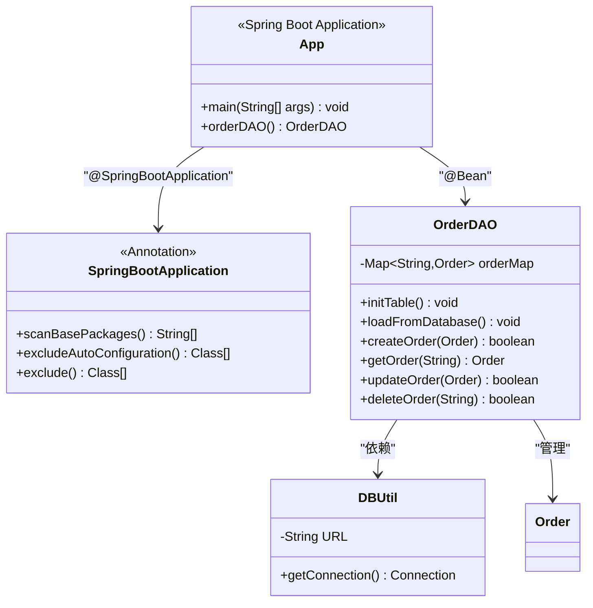
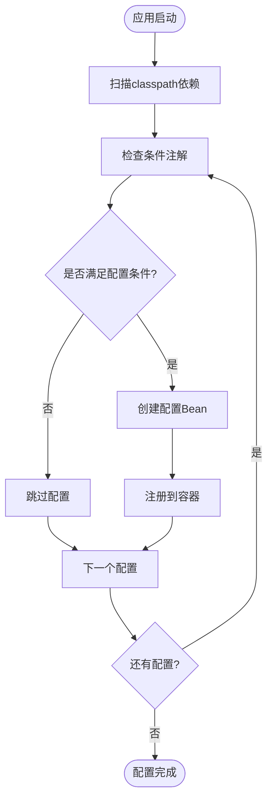
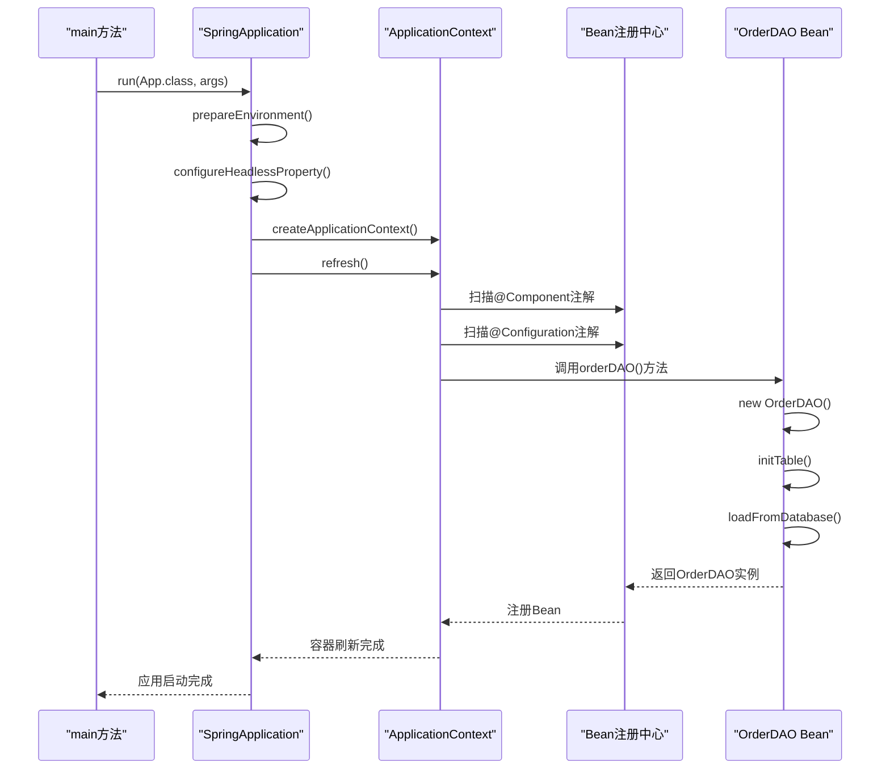
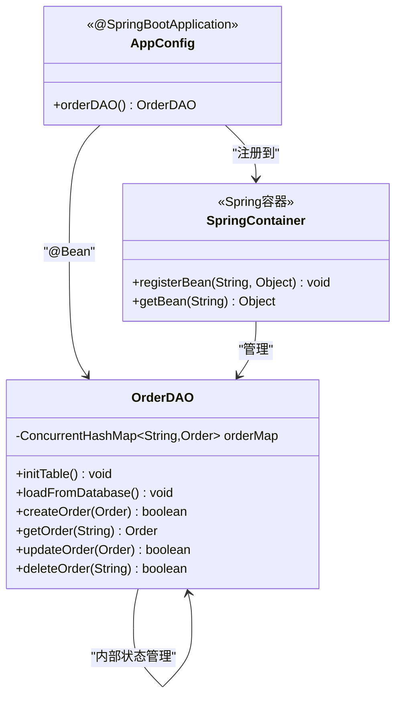
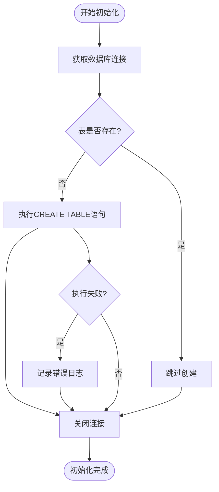
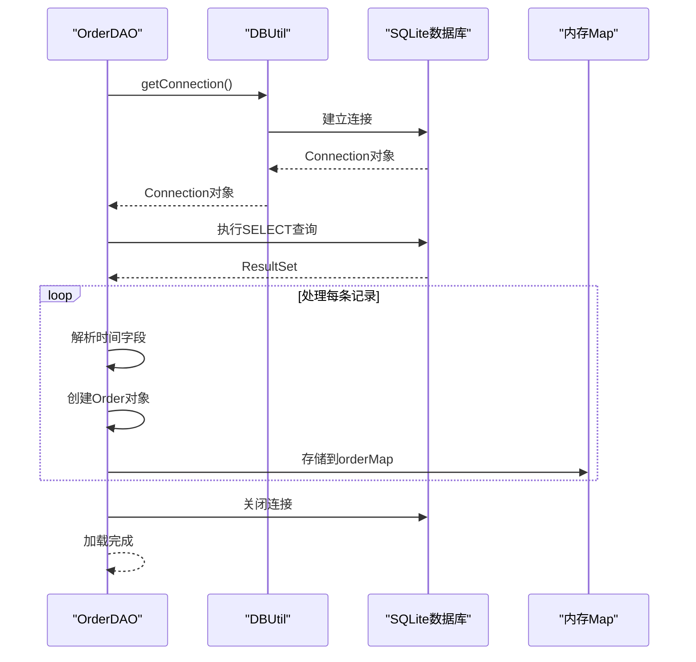
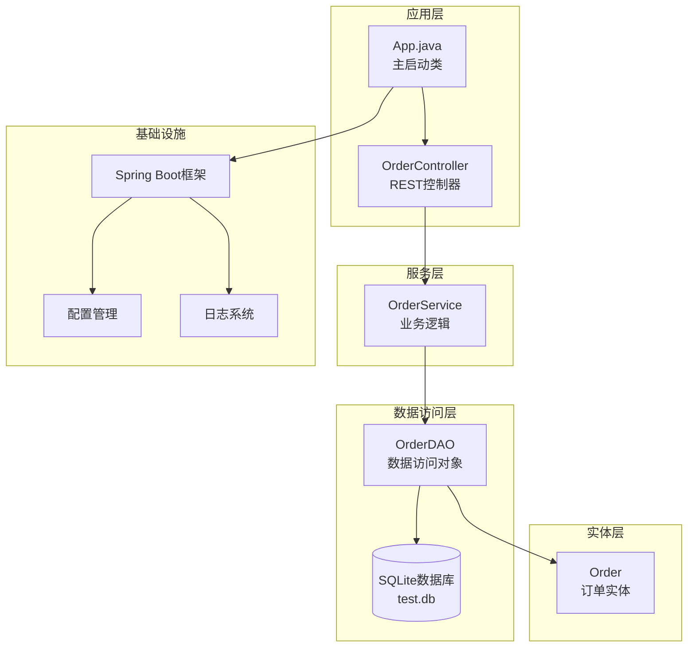
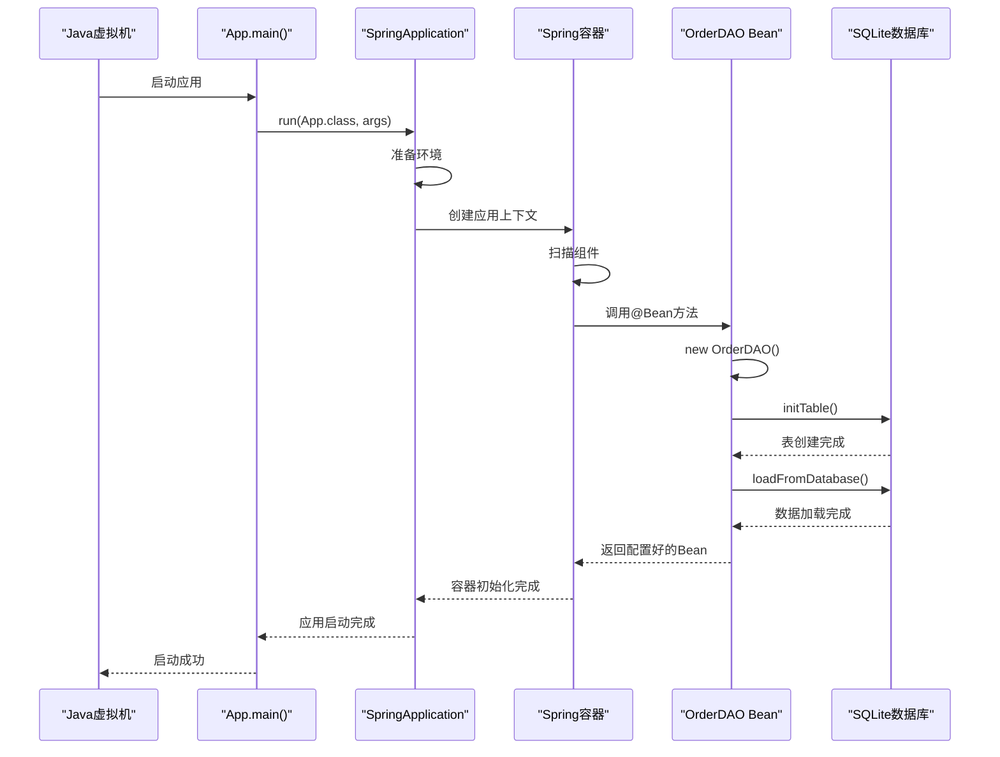

# 应用启动类架构文档

<cite>
**本文档引用的文件**
- [App.java](file://src/main/java/com/example/demo/App.java)
- [pom.xml](file://pom.xml)
- [application.properties](file://src/main/resources/application.properties)
- [OrderDAO.java](file://src/main/java/com/example/demo/dao/OrderDAO.java)
- [DBUtil.java](file://src/main/java/com/example/demo/dao/DBUtil.java)
- [Order.java](file://src/main/java/com/example/demo/entity/Order.java)
- [AppTest.java](file://src/test/java/com/example/demo/AppTest.java)
</cite>

## 目录
1. [项目概述](#项目概述)
2. [App.java核心架构](#appjava核心架构)
3. [Spring Boot自动配置机制](#spring-boot自动配置机制)
4. [应用启动流程分析](#应用启动流程分析)
5. [Bean注册与依赖注入](#bean注册与依赖注入)
6. [数据库初始化与数据加载](#数据库初始化与数据加载)
7. [系统架构图](#系统架构图)
8. [启动时序图](#启动时序图)
9. [常见启动问题排查](#常见启动问题排查)
10. [最佳实践建议](#最佳实践建议)

## 项目概述

本项目是一个基于Spring Boot框架的订单管理系统，采用前后端分离架构。App.java作为Spring Boot应用的主启动类，负责应用的引导和初始化工作。该项目使用SQLite数据库进行数据持久化，通过OrderDAO类实现数据访问层功能。

**章节来源**
- [App.java](file://src/main/java/com/example/demo/App.java#L1-L24)
- [pom.xml](file://pom.xml#L1-L136)

## App.java核心架构

App.java是整个Spring Boot应用的核心入口点，采用了简洁而高效的架构设计：



**图表来源**
- [App.java](file://src/main/java/com/example/demo/App.java#L11-L24)
- [OrderDAO.java](file://src/main/java/com/example/demo/dao/OrderDAO.java#L18-L248)
- [DBUtil.java](file://src/main/java/com/example/demo/dao/DBUtil.java#L10-L19)

### 注解分析

#### @SpringBootApplication注解
@SpringBootApplication注解是Spring Boot的核心注解，它是一个复合注解，包含以下三个重要注解的功能：

1. **@SpringBootConfiguration**: 标识这是一个Spring Boot配置类
2. **@EnableAutoConfiguration**: 启用Spring Boot的自动配置机制
3. **@ComponentScan**: 启用组件扫描，默认扫描当前包及其子包下的所有组件

该注解使得App.java能够自动发现和配置应用中的其他组件，包括控制器、服务、数据访问对象等。

#### @Bean注解
@Bean注解用于声明方法返回的对象应该被注册为Spring容器中的Bean。在orderDAO()方法中：
- 创建OrderDAO实例
- 调用initTable()方法初始化数据库表结构
- 调用loadFromDatabase()方法从数据库加载数据到内存
- 将配置好的OrderDAO实例返回给Spring容器管理

**章节来源**
- [App.java](file://src/main/java/com/example/demo/App.java#L11-L24)

## Spring Boot自动配置机制

Spring Boot的自动配置机制通过@EnableAutoConfiguration注解实现，它能够根据classpath中的依赖自动配置应用程序。虽然App.java中没有显式使用@EnableAutoConfiguration，但@SpringBootApplication注解已经包含了这一功能。

### 自动配置的工作原理



### 组件扫描范围

@ComponentScan注解默认扫描App类所在包及其子包下的所有组件。在这个项目中，它会扫描以下包结构：
- `com.example.demo.config`: 配置类
- `com.example.demo.controller`: 控制器
- `com.example.demo.dao`: 数据访问对象
- `com.example.demo.entity`: 实体类
- `com.example.demo.service`: 服务层

**章节来源**
- [App.java](file://src/main/java/com/example/demo/App.java#L11-L15)

## 应用启动流程分析

SpringApplication.run()方法是Spring Boot应用启动的核心入口，它执行以下关键步骤：



**图表来源**
- [App.java](file://src/main/java/com/example/demo/App.java#L13-L15)

### 启动阶段详解

1. **环境准备阶段**:
   - 设置系统属性和环境变量
   - 加载配置文件
   - 配置日志系统

2. **应用上下文创建阶段**:
   - 创建合适的ApplicationContext实例
   - 配置Bean定义源
   - 加载配置类

3. **Bean注册阶段**:
   - 扫描@Component注解的类
   - 注册@Configuration注解的配置类
   - 执行@Bean注解的方法

4. **Bean初始化阶段**:
   - 初始化OrderDAO Bean
   - 执行数据库表初始化
   - 加载历史数据到内存

**章节来源**
- [App.java](file://src/main/java/com/example/demo/App.java#L13-L15)

## Bean注册与依赖注入

### OrderDAO Bean的注册过程

OrderDAO Bean的注册体现了Spring Boot的依赖注入机制：



**图表来源**
- [App.java](file://src/main/java/com/example/demo/App.java#L17-L23)
- [OrderDAO.java](file://src/main/java/com/example/demo/dao/OrderDAO.java#L18-L248)

### Bean的作用域

OrderDAO Bean被注册为单例模式（Singleton），这意味着在整个应用生命周期中只有一个OrderDAO实例存在。这种设计的优势包括：

1. **内存效率**: 避免重复创建昂贵的对象
2. **数据一致性**: 确保所有组件访问的是同一份数据
3. **性能优化**: 减少对象创建和垃圾回收的开销

### 依赖注入的应用

OrderDAO Bean可以被其他组件通过依赖注入的方式使用：

```java
// 示例：在服务类中注入OrderDAO
@Service
public class OrderService {
    private final OrderDAO orderDAO;
    
    @Autowired
    public OrderService(OrderDAO orderDAO) {
        this.orderDAO = orderDAO;
    }
}
```

**章节来源**
- [App.java](file://src/main/java/com/example/demo/App.java#L17-L23)

## 数据库初始化与数据加载

### 数据库初始化流程

OrderDAO的initTable()方法负责初始化SQLite数据库表结构：



**图表来源**
- [OrderDAO.java](file://src/main/java/com/example/demo/dao/OrderDAO.java#L28-L46)

### 表结构设计

Order表包含以下字段：

| 字段名 | 类型 | 描述 |
|--------|------|------|
| orderId | TEXT | 订单ID（主键） |
| userId | TEXT | 用户ID |
| productId | TEXT | 商品ID |
| quantity | INTEGER | 购买数量 |
| totalAmount | TEXT | 总金额（字符串存储） |
| status | INTEGER | 订单状态 |
| description | TEXT | 订单描述 |
| createTime | TEXT | 创建时间 |
| payTime | TEXT | 支付时间 |
| updateTime | TEXT | 更新时间 |

### 数据加载机制

loadFromDatabase()方法实现了从SQLite数据库到内存的数据迁移：



**图表来源**
- [OrderDAO.java](file://src/main/java/com/example/demo/dao/OrderDAO.java#L83-L158)
- [DBUtil.java](file://src/main/java/com/example/demo/dao/DBUtil.java#L16-L18)

### 数据持久化策略

系统采用了混合存储策略：
1. **内存存储**: 使用ConcurrentHashMap存储活跃订单，提供快速访问
2. **持久化存储**: 通过saveToDatabase()方法定期将内存数据同步到SQLite数据库
3. **事务处理**: 使用PreparedStatement批量插入确保数据一致性

**章节来源**
- [OrderDAO.java](file://src/main/java/com/example/demo/dao/OrderDAO.java#L28-L158)

## 系统架构图



**图表来源**
- [App.java](file://src/main/java/com/example/demo/App.java#L1-L24)
- [OrderDAO.java](file://src/main/java/com/example/demo/dao/OrderDAO.java#L1-L248)
- [application.properties](file://src/main/resources/application.properties#L1-L5)

## 启动时序图



**图表来源**
- [App.java](file://src/main/java/com/example/demo/App.java#L13-L23)

## 常见启动问题排查

### 1. 数据库连接问题

**症状**: 应用启动时出现数据库连接异常

**排查步骤**:
1. 检查SQLite驱动是否正确引入
2. 验证数据库文件(test.db)是否存在
3. 确认数据库文件权限设置

**解决方案**:
```xml
<!-- 确保pom.xml中包含SQLite驱动 -->
<dependency>
    <groupId>org.xerial</groupId>
    <artifactId>sqlite-jdbc</artifactId>
    <version>3.36.0.3</version>
</dependency>
```

### 2. Bean注册失败

**症状**: OrderDAO Bean无法正确注册

**排查步骤**:
1. 检查App.java类路径是否正确
2. 确认@ComponentScan范围是否包含OrderDAO
3. 验证@Bean方法签名是否正确

### 3. 内存溢出问题

**症状**: 应用启动后内存使用过高

**排查步骤**:
1. 检查OrderMap大小限制
2. 监控数据库查询结果集大小
3. 优化数据加载策略

### 4. 端口冲突

**症状**: 应用启动失败，提示端口已被占用

**解决方案**:
修改application.properties中的端口配置：
```properties
server.port=9091  # 修改为其他可用端口
```

**章节来源**
- [application.properties](file://src/main/resources/application.properties#L1-L5)
- [DBUtil.java](file://src/main/java/com/example/demo/dao/DBUtil.java#L11-L18)

## 最佳实践建议

### 1. 配置管理
- 使用application.properties集中管理配置
- 对敏感信息使用环境变量或加密配置
- 提供开发、测试、生产环境的不同配置文件

### 2. 异常处理
- 在数据库操作中添加更完善的异常处理
- 记录详细的错误日志便于问题排查
- 提供优雅的错误响应给客户端

### 3. 性能优化
- 考虑使用连接池管理数据库连接
- 实现缓存机制减少数据库访问频率
- 对大数据量操作使用分页或异步处理

### 4. 测试策略
- 编写全面的单元测试覆盖核心功能
- 使用集成测试验证数据库交互
- 实现监控和健康检查机制

### 5. 安全考虑
- 添加必要的安全配置
- 实现输入验证防止SQL注入
- 考虑添加认证授权机制

**章节来源**
- [App.java](file://src/main/java/com/example/demo/App.java#L1-L24)
- [OrderDAO.java](file://src/main/java/com/example/demo/dao/OrderDAO.java#L1-L248)

## 结论

App.java作为Spring Boot应用的主启动类，通过简洁的设计实现了复杂的应用引导功能。它不仅展示了Spring Boot自动配置的强大能力，还体现了良好的软件架构设计原则。通过@SprinBootApplication注解的使用，开发者可以快速搭建功能完整的企业级应用；通过@Bean注解的巧妙运用，实现了数据访问层的优雅初始化。

该架构设计具有以下优势：
1. **简洁性**: 只需少量代码即可完成应用启动
2. **可扩展性**: 易于添加新的功能模块
3. **可维护性**: 清晰的职责分离和依赖关系
4. **可靠性**: 完善的错误处理和资源管理

对于后续开发，建议继续遵循这些设计原则，同时关注性能优化和安全性改进，以构建更加健壮和高效的应用系统。