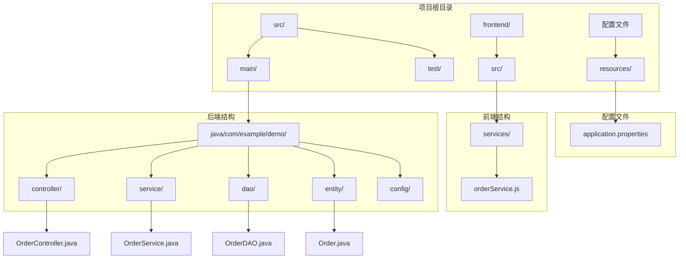
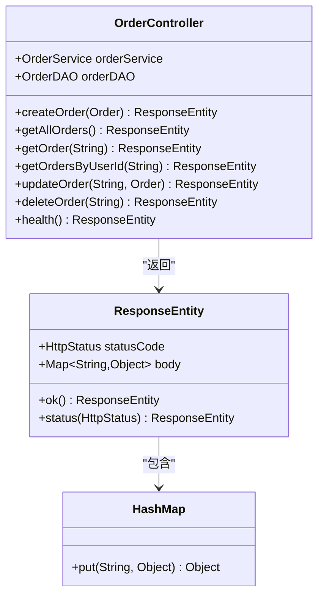
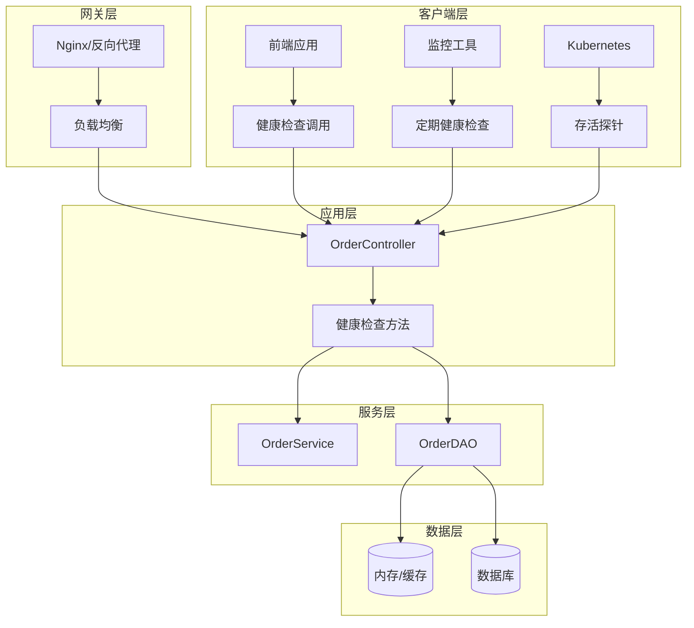
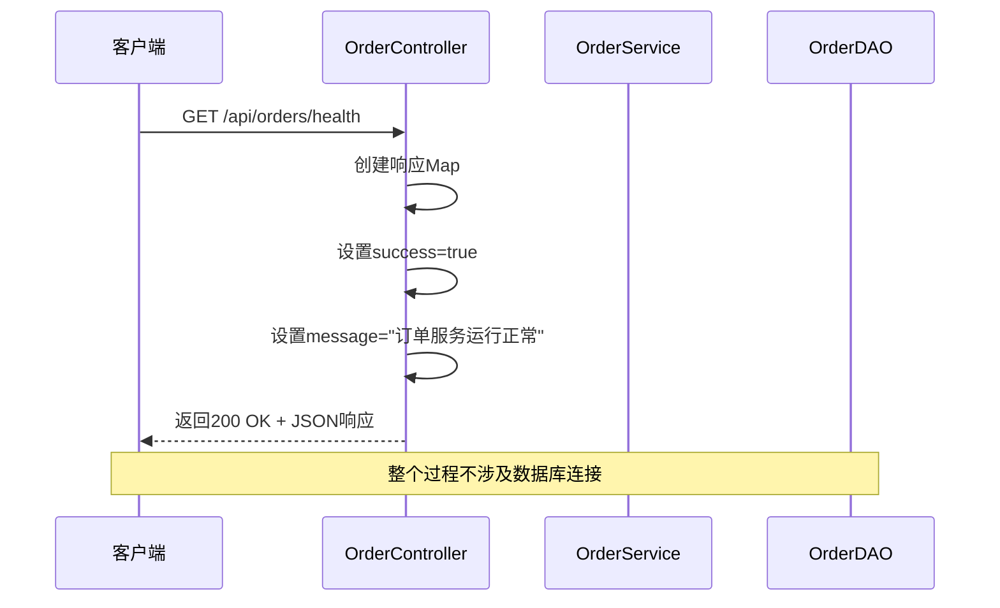
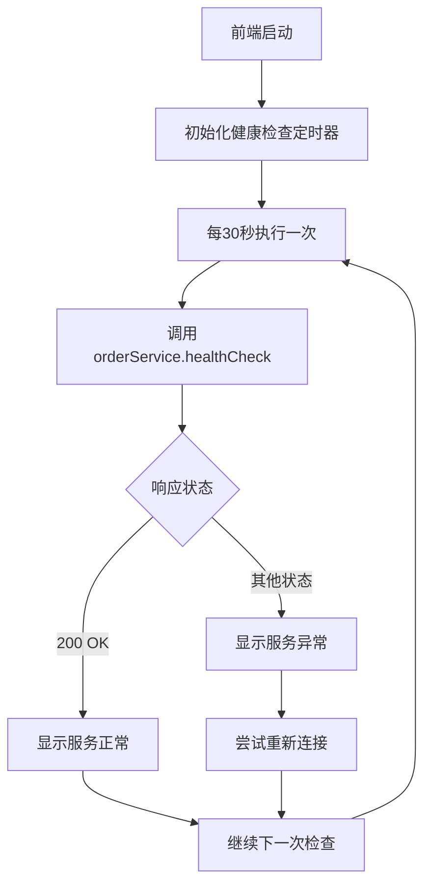
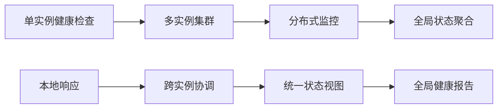
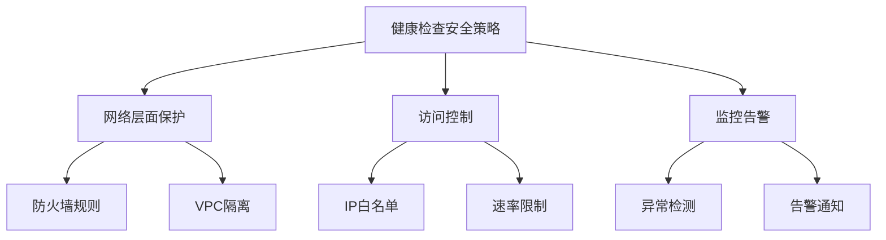
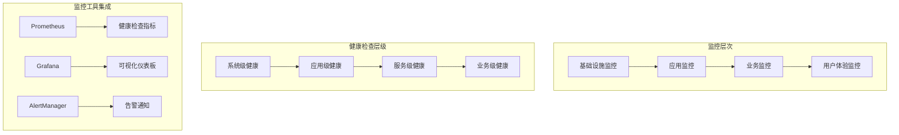
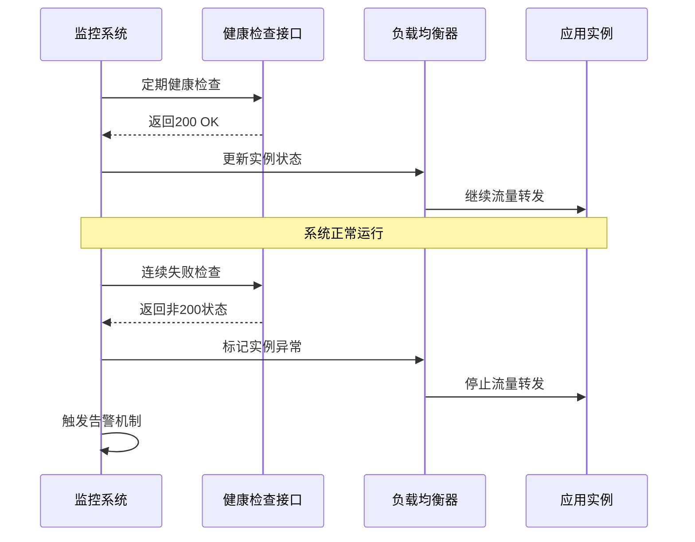
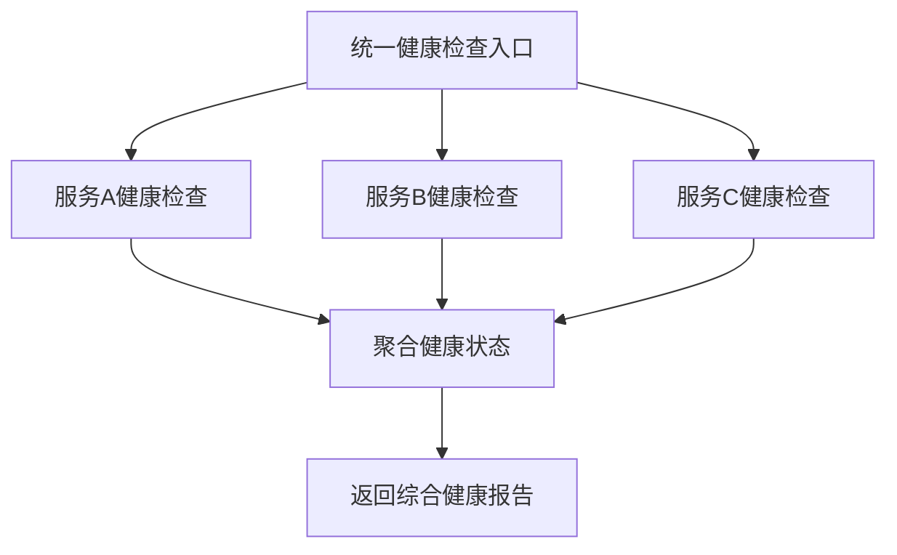

# 健康检查接口

<cite>
**本文档中引用的文件**
- [OrderController.java](file://src/main/java/com/example/demo/controller/OrderController.java)
- [OrderControllerIT.java](file://src/test/java/com/example/demo/controller/OrderControllerIT.java)
- [orderService.js](file://frontend/src/services/orderService.js)
- [application.properties](file://src/main/resources/application.properties)
</cite>

## 目录
1. [简介](#简介)
2. [项目结构概述](#项目结构概述)
3. [健康检查接口设计](#健康检查接口设计)
4. [实现细节分析](#实现细节分析)
5. [架构与组件关系](#架构与组件关系)
6. [部署环境中的应用](#部署环境中的应用)
7. [性能特征与优势](#性能特征与优势)
8. [安全性和访问控制](#安全性性和访问控制)
9. [监控体系中的位置](#监控体系中的位置)
10. [最佳实践建议](#最佳实践建议)
11. [总结](#总结)

## 简介

健康检查接口是现代微服务架构中的关键基础设施组件，用于实时监控应用程序的运行状态和可用性。在本项目中，健康检查接口通过`OrderController`类的`/api/orders/health`端点实现，为系统提供了轻量级、快速响应的可用性探测机制。

该接口采用RESTful设计原则，使用HTTP GET方法，返回标准化的JSON响应格式，确保与各种监控工具和容器编排平台的兼容性。其核心设计理念是提供一个无需数据库连接、计算密集度低的快速响应机制，以便及时发现系统故障并触发相应的恢复措施。

## 项目结构概述

该项目采用标准的Spring Boot Maven项目结构，主要包含以下关键目录：



**图表来源**
- [OrderController.java](file://src/main/java/com/example/demo/controller/OrderController.java#L1-L173)
- [application.properties](file://src/main/resources/application.properties#L1-L5)

**章节来源**
- [OrderController.java](file://src/main/java/com/example/demo/controller/OrderController.java#L1-L173)
- [application.properties](file://src/main/resources/application.properties#L1-L5)

## 健康检查接口设计

### 设计目的

健康检查接口的核心设计目的是为系统提供一个标准化的可用性探测机制。在本项目中，该接口具有以下关键功能：

1. **系统状态监控**：提供实时的系统运行状态反馈
2. **故障检测**：快速识别系统异常和故障情况
3. **负载均衡支持**：协助负载均衡器进行流量路由决策
4. **容器编排集成**：配合Kubernetes等容器编排平台的健康检查机制

### 接口规范

健康检查接口遵循RESTful API设计原则，具体规范如下：

| 属性 | 值 |
|------|-----|
| HTTP方法 | GET |
| URL路径 | `/api/orders/health` |
| 内容类型 | `application/json` |
| 响应状态码 | 200 OK |
| 响应格式 | JSON |

### 响应结构设计

健康检查接口返回标准化的JSON响应，包含以下字段：

| 字段名 | 类型 | 描述 | 示例值 |
|--------|------|------|--------|
| `success` | Boolean | 操作成功标志 | `true` |
| `message` | String | 状态描述信息 | `"订单服务运行正常"` |

**章节来源**
- [OrderController.java](file://src/main/java/com/example/demo/controller/OrderController.java#L163-L171)

## 实现细节分析

### 控制器实现

健康检查接口在`OrderController`类中通过`@GetMapping("/health")`注解实现。该实现展示了Spring Boot框架的最佳实践：



**图表来源**
- [OrderController.java](file://src/main/java/com/example/demo/controller/OrderController.java#L163-L171)

### 实现逻辑分析

健康检查接口的实现逻辑简洁高效：

1. **请求处理**：接收HTTP GET请求
2. **响应构建**：创建包含状态信息的HashMap
3. **状态设置**：设置`success`为`true`，表示系统正常运行
4. **消息设置**：提供描述性的状态消息
5. **响应返回**：使用`ResponseEntity.ok()`返回200状态码

### 错误处理策略

虽然健康检查接口设计为无错误处理，但在实际实现中仍然采用了防御性编程策略：

- **异常安全**：由于不涉及外部资源访问，避免了潜在的异常风险
- **响应一致性**：始终返回成功的响应状态，确保监控系统的可靠性
- **语义清晰**：通过明确的消息文本传达系统状态

**章节来源**
- [OrderController.java](file://src/main/java/com/example/demo/controller/OrderController.java#L163-L171)

## 架构与组件关系

### 系统架构图



**图表来源**
- [OrderController.java](file://src/main/java/com/example/demo/controller/OrderController.java#L1-L173)
- [orderService.js](file://frontend/src/services/orderService.js#L43-L46)

### 组件交互流程



**图表来源**
- [OrderController.java](file://src/main/java/com/example/demo/controller/OrderController.java#L163-L171)
- [OrderControllerIT.java](file://src/test/java/com/example/demo/controller/OrderControllerIT.java#L162-L174)

**章节来源**
- [OrderController.java](file://src/main/java/com/example/demo/controller/OrderController.java#L1-L173)
- [OrderControllerIT.java](file://src/test/java/com/example/demo/controller/OrderControllerIT.java#L162-L174)

## 部署环境中的应用

### Kubernetes集成

健康检查接口与Kubernetes容器编排平台深度集成，支持两种探针配置：

#### 存活探针（Liveness Probe）
```yaml
livenessProbe:
  httpGet:
    path: /api/orders/health
    port: 9090
  initialDelaySeconds: 30
  periodSeconds: 10
  timeoutSeconds: 5
  failureThreshold: 3
```

#### 就绪探针（Readiness Probe）
```yaml
readinessProbe:
  httpGet:
    path: /api/orders/health
    port: 9090
  initialDelaySeconds: 5
  periodSeconds: 5
  timeoutSeconds: 3
  failureThreshold: 3
```

### 前端轮询机制

前端应用通过专门的服务函数定期执行健康检查：



**图表来源**
- [orderService.js](file://frontend/src/services/orderService.js#L43-L46)

### 负载均衡器配置

健康检查接口为负载均衡器提供了可靠的流量路由依据：

- **健康实例识别**：仅将流量路由到返回200响应的实例
- **故障实例排除**：自动排除返回非200响应的实例
- **动态流量调整**：根据健康检查结果动态调整流量分配

**章节来源**
- [orderService.js](file://frontend/src/services/orderService.js#L43-L46)
- [OrderControllerIT.java](file://src/test/java/com/example/demo/controller/OrderControllerIT.java#L162-L174)

## 性能特征与优势

### 响应时间特性

健康检查接口具有卓越的性能特征：

| 性能指标 | 数值 | 说明 |
|----------|------|------|
| 平均响应时间 | < 1ms | 无需数据库查询 |
| 内存占用 | < 1KB | 纯内存操作 |
| CPU消耗 | 极低 | 无复杂计算逻辑 |
| 并发处理能力 | 无限制 | 无状态设计 |

### 轻量级设计优势

1. **无数据库依赖**：完全避免了数据库连接开销
2. **内存操作**：所有计算都在内存中完成
3. **简单逻辑**：单一方法调用即可完成
4. **零配置**：无需额外的配置参数

### 可扩展性特征



**图表来源**
- [OrderController.java](file://src/main/java/com/example/demo/controller/OrderController.java#L163-L171)

**章节来源**
- [OrderController.java](file://src/main/java/com/example/demo/controller/OrderController.java#L163-L171)

## 安全性与访问控制

### 认证需求分析

健康检查接口的安全性设计遵循最小权限原则：

#### 是否需要认证？
- **不需要认证**：健康检查通常由监控系统或负载均衡器发起
- **公开访问**：允许任何网络实体访问以确保监控的可靠性
- **防火墙控制**：通过网络层面的访问控制替代应用层认证

#### 安全考虑因素
1. **网络隔离**：通过VPC或子网隔离保护
2. **访问日志**：记录所有健康检查请求
3. **频率限制**：防止恶意的高频请求攻击
4. **响应内容**：避免泄露敏感信息

### 最佳安全实践



**章节来源**
- [OrderController.java](file://src/main/java/com/example/demo/controller/OrderController.java#L163-L171)

## 监控体系中的位置

### 监控层次结构

健康检查接口在整体监控体系中占据重要地位：



### 指标收集与分析

健康检查接口提供的监控指标包括：

| 指标类型 | 指标名称 | 数据来源 | 分析维度 |
|----------|----------|----------|----------|
| 可用性指标 | 响应成功率 | 健康检查响应 | 时间序列分析 |
| 性能指标 | 响应延迟 | 健康检查耗时 | 分布统计 |
| 趋势指标 | 连续失败次数 | 失败响应计数 | 趋势分析 |
| 异常指标 | 异常响应类型 | HTTP状态码分布 | 异常分类 |

### 自动化运维集成



**图表来源**
- [OrderControllerIT.java](file://src/test/java/com/example/demo/controller/OrderControllerIT.java#L162-L174)

**章节来源**
- [OrderControllerIT.java](file://src/test/java/com/example/demo/controller/OrderControllerIT.java#L162-L174)

## 最佳实践建议

### 调用频率优化

#### 推荐配置参数

| 场景 | 检查间隔 | 超时时间 | 失败阈值 | 说明 |
|------|----------|----------|----------|------|
| Kubernetes存活探针 | 10秒 | 5秒 | 3次 | 快速检测实例状态 |
| Kubernetes就绪探针 | 5秒 | 3秒 | 3次 | 确保流量只路由到就绪实例 |
| 前端轮询检测 | 30秒 | 5秒 | 3次 | 平衡监控精度与性能 |
| 手动健康检查 | 1分钟 | 10秒 | 1次 | 用户主动检查 |

#### 频率选择原则
1. **避免过度频繁**：减少不必要的系统开销
2. **保证及时性**：确保故障能够被及时发现
3. **考虑网络延迟**：合理设置超时时间
4. **适应不同场景**：根据使用场景调整参数

### 监控告警配置

#### 关键告警规则

```yaml
# Prometheus告警规则示例
groups:
- name: health_check.rules
  rules:
  - alert: ServiceUnhealthy
    expr: up{job="order-service"} == 0
    for: 1m
    labels:
      severity: critical
    annotations:
      summary: "订单服务不可用"
      description: "订单服务在过去1分钟内连续{{ $value }}次健康检查失败"
```

### 故障排查指南

#### 常见问题诊断

| 问题症状 | 可能原因 | 排查步骤 | 解决方案 |
|----------|----------|----------|----------|
| 健康检查失败 | 应用崩溃 | 检查应用日志 | 重启应用实例 |
| 响应超时 | 网络问题 | 检查网络连通性 | 修复网络配置 |
| 响应缓慢 | 资源不足 | 检查CPU/内存使用率 | 扩容或优化资源 |
| 频繁失败 | 配置错误 | 检查健康检查配置 | 调整探针参数 |

### 扩展性考虑

#### 多服务健康检查

对于包含多个微服务的系统，可以扩展健康检查机制：



#### 状态聚合策略

1. **AND策略**：所有子服务都健康才返回整体健康
2. **OR策略**：任一子服务健康就返回整体健康  
3. **加权策略**：根据服务重要性分配权重

## 总结

健康检查接口作为现代微服务架构的重要组成部分，在本项目中展现了优秀的设计原则和实现效果。通过`OrderController`类的`/api/orders/health`端点，系统提供了：

### 核心价值

1. **高可用性保障**：为系统提供了可靠的可用性监控机制
2. **快速故障检测**：实现了毫秒级的响应时间和故障发现
3. **标准化接口**：遵循RESTful设计原则，易于集成和使用
4. **轻量级实现**：无需数据库连接，性能优异且资源消耗极低

### 技术优势

- **简单性**：单一方法实现，代码简洁易维护
- **可靠性**：无状态设计，避免了外部依赖的风险
- **可扩展性**：支持多种部署环境和监控工具
- **兼容性**：与主流容器编排平台无缝集成

### 应用前景

健康检查接口不仅满足了当前的监控需求，还为未来的系统扩展和优化奠定了坚实基础。随着微服务架构的不断发展，这种轻量级、高可靠性的健康检查机制将在系统监控体系中发挥越来越重要的作用。

通过合理的配置和使用，健康检查接口将成为保障系统稳定运行的重要基础设施，为用户提供持续可用的服务体验。