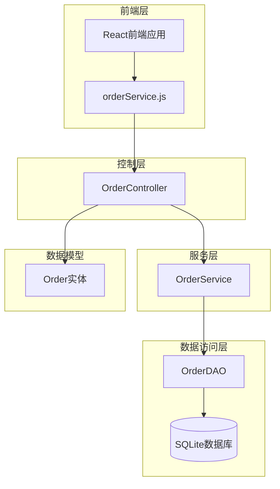
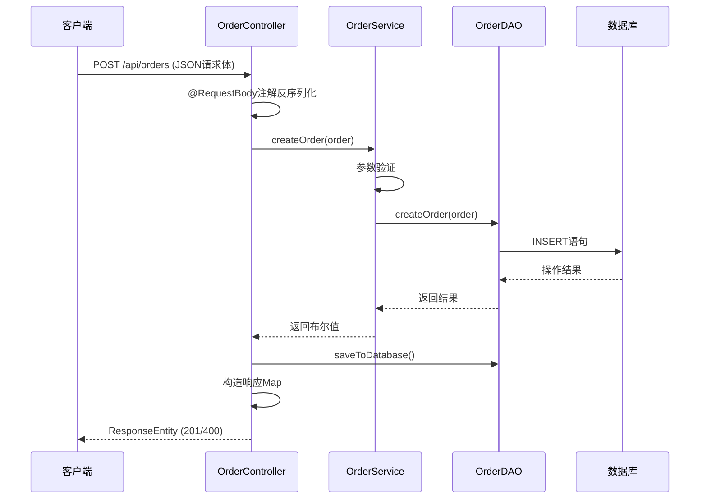
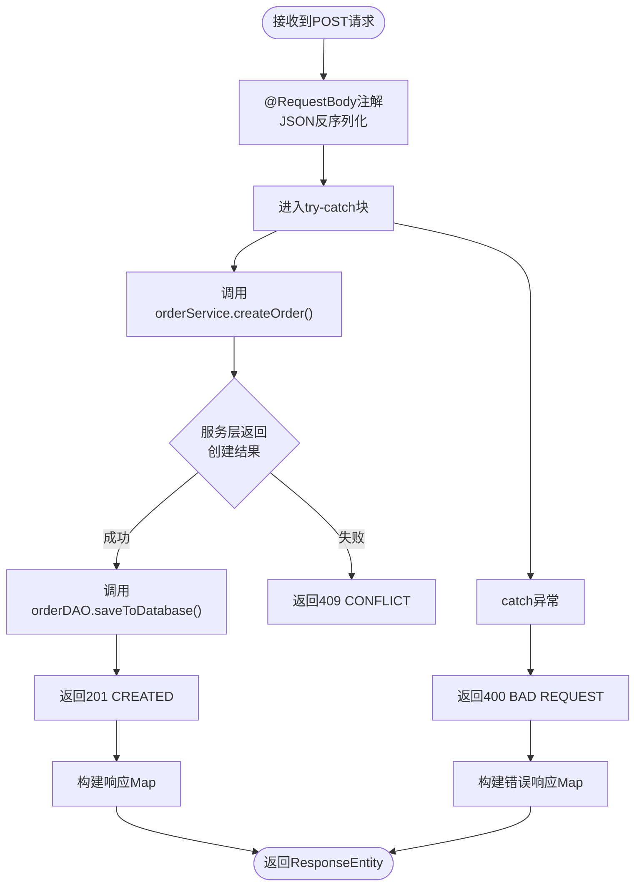
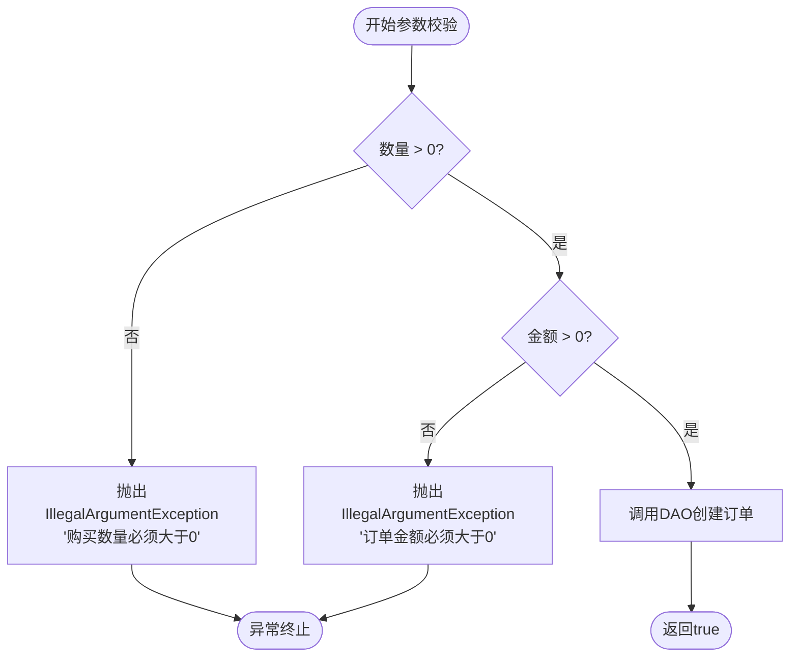
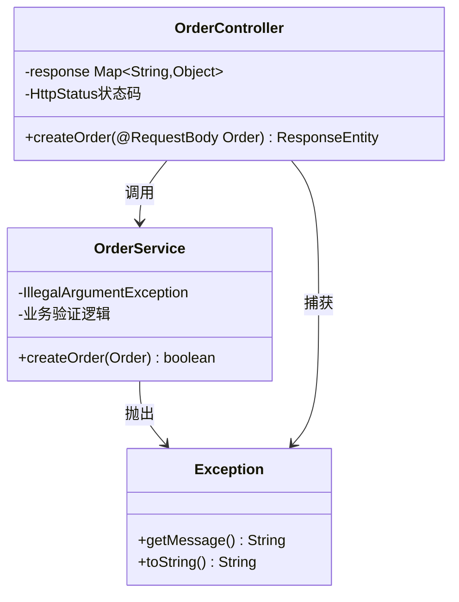
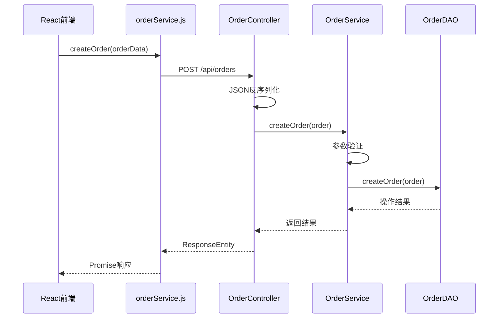
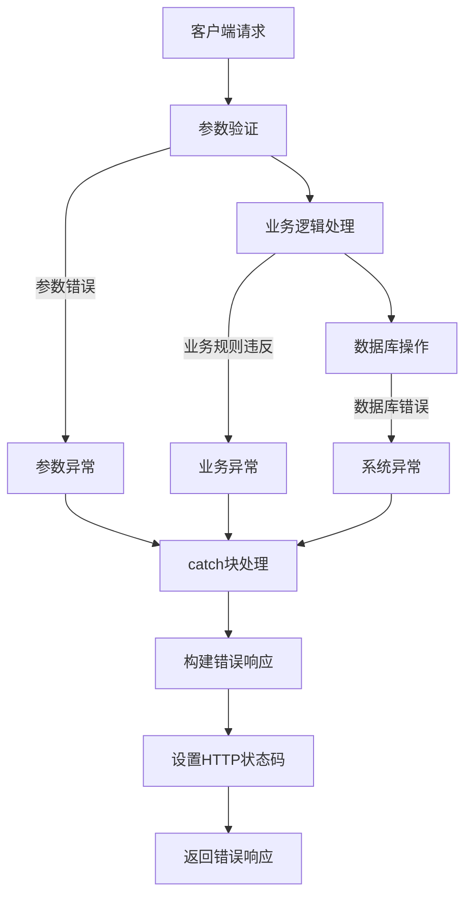

# 创建订单接口

<cite>
**本文档中引用的文件**
- [OrderController.java](file://src/main/java/com/example/demo/controller/OrderController.java)
- [OrderService.java](file://src/main/java/com/example/demo/service/OrderService.java)
- [Order.java](file://src/main/java/com/example/demo/entity/Order.java)
- [orderService.js](file://frontend/src/services/orderService.js)
- [OrderControllerIT.java](file://src/test/java/com/example/demo/controller/OrderControllerIT.java)
- [AIOrderServiceTest.java](file://src/test/java/com/example/demo/service/ai_test/AIOrderServiceTest.java)
- [pom.xml](file://pom.xml)
</cite>

## 目录
1. [简介](#简介)
2. [项目结构概览](#项目结构概览)
3. [核心组件分析](#核心组件分析)
4. [架构概览](#架构概览)
5. [详细组件分析](#详细组件分析)
6. [API调用示例](#api调用示例)
7. [异常处理机制](#异常处理机制)
8. [性能考虑](#性能考虑)
9. [故障排除指南](#故障排除指南)
10. [结论](#结论)

## 简介

本文档详细解析了Spring Boot项目中OrderController的订单创建功能，重点说明了`@PostMapping("/")`方法的实现机制。该接口负责接收前端发送的JSON格式订单请求，通过`@RequestBody`注解进行参数绑定和反序列化，执行业务逻辑验证，并返回标准化的响应格式。

## 项目结构概览

该项目采用标准的Spring Boot MVC架构，主要包含以下模块：



**图表来源**
- [OrderController.java](file://src/main/java/com/example/demo/controller/OrderController.java#L1-L173)
- [OrderService.java](file://src/main/java/com/example/demo/service/OrderService.java#L1-L114)
- [Order.java](file://src/main/java/com/example/demo/entity/Order.java#L1-L162)

**章节来源**
- [OrderController.java](file://src/main/java/com/example/demo/controller/OrderController.java#L1-L173)
- [OrderService.java](file://src/main/java/com/example/demo/service/OrderService.java#L1-L114)

## 核心组件分析

### OrderController - 订单控制器

OrderController是REST API的主要入口点，负责处理HTTP请求并返回标准化响应。其核心特性包括：

- **RESTful设计**：遵循REST架构原则，使用HTTP方法映射相应的业务操作
- **统一响应格式**：所有API响应都采用统一的Map结构，包含success、message和data字段
- **状态码管理**：根据业务结果返回适当的HTTP状态码
- **跨域支持**：启用CORS支持，允许前端应用跨域访问

### OrderService - 业务逻辑层

OrderService封装了订单创建的核心业务逻辑，包括：

- **参数验证**：对订单数量和金额进行有效性检查
- **业务规则**：确保订单数据符合业务规范
- **事务管理**：协调数据访问层的操作
- **异常处理**：捕获并转换业务异常为可理解的错误信息

### Order实体 - 数据模型

Order实体定义了订单的数据结构，包含：

- **基础属性**：订单ID、用户ID、商品ID等核心字段
- **业务属性**：数量、金额、状态等业务相关字段
- **时间戳**：创建时间、支付时间、更新时间
- **默认值**：提供合理的默认初始化值

**章节来源**
- [OrderController.java](file://src/main/java/com/example/demo/controller/OrderController.java#L18-L30)
- [OrderService.java](file://src/main/java/com/example/demo/service/OrderService.java#L13-L21)
- [Order.java](file://src/main/java/com/example/demo/entity/Order.java#L9-L60)

## 架构概览

系统采用分层架构设计，清晰分离关注点：



**图表来源**
- [OrderController.java](file://src/main/java/com/example/demo/controller/OrderController.java#L35-L56)
- [OrderService.java](file://src/main/java/com/example/demo/service/OrderService.java#L28-L38)

## 详细组件分析

### @PostMapping("/") 方法实现

#### 请求处理流程



**图表来源**
- [OrderController.java](file://src/main/java/com/example/demo/controller/OrderController.java#L35-L56)

#### @RequestBody注解的使用

`@RequestBody`注解是Spring MVC的核心功能，它实现了以下关键特性：

- **自动类型转换**：将JSON请求体自动转换为Java对象
- **字段映射**：根据JSON属性名自动匹配Order实体的字段
- **数据验证**：触发Bean Validation机制进行参数校验
- **异常处理**：在反序列化失败时抛出相应异常

#### Order对象反序列化过程

反序列化过程涉及多个步骤：

1. **JSON解析**：Spring使用Jackson库解析JSON字符串
2. **类型匹配**：将JSON属性映射到Order实体的对应字段
3. **类型转换**：自动处理基本类型和复杂类型的转换
4. **默认值处理**：使用Order类的无参构造函数设置默认值

#### 参数校验逻辑

OrderService中的参数校验确保了数据的有效性：



**图表来源**
- [OrderService.java](file://src/main/java/com/example/demo/service/OrderService.java#L28-L38)

**章节来源**
- [OrderController.java](file://src/main/java/com/example/demo/controller/OrderController.java#L35-L56)
- [OrderService.java](file://src/main/java/com/example/demo/service/OrderService.java#L28-L38)

### 统一响应机制

#### 成功响应结构

当订单创建成功时，系统返回以下结构：

| 字段 | 类型 | 描述 | 示例值 |
|------|------|------|--------|
| success | Boolean | 操作是否成功 | true |
| message | String | 操作结果描述 | "订单创建成功" |
| data | Order | 创建的订单对象 | 包含完整订单信息 |

#### 错误响应结构

当发生错误时，系统返回标准化的错误响应：

| 字段 | 类型 | 描述 | 示例值 |
|------|------|------|--------|
| success | Boolean | 操作是否成功 | false |
| message | String | 错误描述信息 | "创建失败: 购买数量必须大于0" |

#### 状态码设计

- **201 Created**：订单创建成功，资源已成功创建
- **400 Bad Request**：客户端请求参数错误或格式不正确
- **409 Conflict**：订单已存在，违反业务约束
- **500 Internal Server Error**：服务器内部错误

**章节来源**
- [OrderController.java](file://src/main/java/com/example/demo/controller/OrderController.java#L37-L56)

### 异常处理机制

#### 异常分类处理

系统采用分层异常处理策略：



**图表来源**
- [OrderController.java](file://src/main/java/com/example/demo/controller/OrderController.java#L51-L55)
- [OrderService.java](file://src/main/java/com/example/demo/service/OrderService.java#L30-L35)

#### 异常处理策略

1. **业务异常**：由OrderService抛出，包含具体的业务错误信息
2. **系统异常**：由Spring框架或底层库抛出，提供通用的错误描述
3. **参数异常**：通过Bean Validation机制捕获，提供参数级别的错误信息

**章节来源**
- [OrderController.java](file://src/main/java/com/example/demo/controller/OrderController.java#L51-L55)
- [OrderService.java](file://src/main/java/com/example/demo/service/OrderService.java#L30-L35)

## API调用示例

### curl命令示例

#### 成功创建订单

```bash
curl -X POST http://localhost:9090/api/orders \
  -H "Content-Type: application/json" \
  -d '{
    "orderId": "ORD-20241113-001",
    "userId": "USER-20241113-001",
    "productId": "PROD-20241113-001",
    "quantity": 2,
    "totalAmount": 318.00,
    "description": "测试订单"
  }'
```

#### 失败场景示例

##### 数量为零

```bash
curl -X POST http://localhost:9090/api/orders \
  -H "Content-Type: application/json" \
  -d '{
    "orderId": "ORD-20241113-002",
    "userId": "USER-20241113-002",
    "productId": "PROD-20241113-002",
    "quantity": 0,
    "totalAmount": 100.00
  }'
```

##### 金额为负数

```bash
curl -X POST http://localhost:9090/api/orders \
  -H "Content-Type: application/json" \
  -d '{
    "orderId": "ORD-20241113-003",
    "userId": "USER-20241113-003",
    "productId": "PROD-20241113-003",
    "quantity": 2,
    "totalAmount": -100.00
  }'
```

### JavaScript Fetch示例

#### 基本订单创建

```javascript
// 使用orderService.js中的createOrder函数
const orderData = {
    orderId: `ORD-${Date.now()}`,
    userId: `USER-${Date.now()}`,
    productId: `PROD-${Date.now()}`,
    quantity: 2,
    totalAmount: 318.00,
    description: "通过JavaScript创建的订单"
};

orderService.createOrder(orderData)
    .then(response => {
        if (response.data.success) {
            console.log("订单创建成功:", response.data.data);
        } else {
            console.error("订单创建失败:", response.data.message);
        }
    })
    .catch(error => {
        console.error("API调用错误:", error);
    });
```

#### 错误处理示例

```javascript
// 处理数量为零的情况
const invalidOrder = {
    orderId: `ORD-${Date.now()}`,
    userId: `USER-${Date.now()}`,
    productId: `PROD-${Date.now()}`,
    quantity: 0, // 无效的数量
    totalAmount: 100.00
};

orderService.createOrder(invalidOrder)
    .then(response => {
        if (!response.data.success) {
            console.error("错误信息:", response.data.message);
            // 显示给用户的具体错误提示
            alert(`订单创建失败: ${response.data.message}`);
        }
    });
```

### 与前端orderService.js的对应关系

OrderController的`createOrder`方法与前端的`orderService.createOrder`函数形成完整的API调用链：



**图表来源**
- [orderService.js](file://frontend/src/services/orderService.js#L14-L16)
- [OrderController.java](file://src/main/java/com/example/demo/controller/OrderController.java#L35-L56)

**章节来源**
- [orderService.js](file://frontend/src/services/orderService.js#L14-L16)
- [OrderControllerIT.java](file://src/test/java/com/example/demo/controller/OrderControllerIT.java#L46-L57)

## 异常处理机制

### 异常类型分析

系统中的异常处理涵盖了多个层面：

#### 业务异常

业务异常由OrderService抛出，主要包括：

- **数量验证异常**：当订单数量小于等于0时抛出
- **金额验证异常**：当订单金额小于等于0时抛出
- **状态验证异常**：当订单状态不符合业务规则时抛出

#### 系统异常

系统异常包括：

- **网络异常**：连接超时、网络中断等
- **数据库异常**：SQL语法错误、约束违反等
- **序列化异常**：JSON格式错误、类型转换失败等

### 异常处理流程



**图表来源**
- [OrderController.java](file://src/main/java/com/example/demo/controller/OrderController.java#L51-L55)

**章节来源**
- [OrderController.java](file://src/main/java/com/example/demo/controller/OrderController.java#L51-L55)
- [OrderService.java](file://src/main/java/com/example/demo/service/OrderService.java#L30-L35)

## 性能考虑

### 响应时间优化

1. **异步处理**：对于非关键路径的操作可以考虑异步处理
2. **缓存策略**：对频繁访问的订单数据实施缓存
3. **连接池管理**：合理配置数据库连接池参数
4. **批量操作**：支持批量创建订单以提高吞吐量

### 内存使用优化

1. **对象复用**：重用Order对象以减少GC压力
2. **流式处理**：对于大数据量的订单处理采用流式方式
3. **内存监控**：定期监控JVM内存使用情况

### 并发处理

1. **线程安全**：确保OrderService的线程安全性
2. **锁机制**：在必要时使用适当的锁策略
3. **乐观锁**：对于并发更新场景采用乐观锁机制

## 故障排除指南

### 常见问题及解决方案

#### 400 Bad Request错误

**症状**：客户端收到400状态码，响应中包含错误信息

**可能原因**：
- JSON格式错误
- 必填字段缺失
- 数据类型不匹配
- 参数值超出范围

**解决方法**：
1. 检查JSON格式是否正确
2. 验证所有必填字段是否存在
3. 确认数据类型与Order实体定义一致
4. 检查数值范围是否符合要求

#### 409 Conflict错误

**症状**：订单已存在，无法重复创建

**可能原因**：
- 订单ID重复
- 业务规则冲突
- 数据一致性问题

**解决方法**：
1. 生成唯一的订单ID
2. 检查业务规则约束
3. 清理数据一致性问题

#### 500 Internal Server Error

**症状**：服务器内部错误

**可能原因**：
- 数据库连接失败
- 代码逻辑错误
- 系统资源不足

**解决方法**：
1. 检查数据库连接状态
2. 查看服务器日志
3. 监控系统资源使用情况

### 调试技巧

1. **日志记录**：在关键位置添加详细的日志记录
2. **断点调试**：在IDE中设置断点进行逐步调试
3. **单元测试**：编写针对性的单元测试验证功能
4. **集成测试**：使用Postman或curl进行API测试

**章节来源**
- [OrderControllerIT.java](file://src/test/java/com/example/demo/controller/OrderControllerIT.java#L46-L122)

## 结论

OrderController的订单创建功能展现了Spring Boot框架的强大能力，通过以下特性实现了高质量的API设计：

### 设计优势

1. **RESTful架构**：遵循REST原则，提供直观的API接口
2. **统一响应格式**：标准化的响应结构便于前端处理
3. **完善的异常处理**：多层次的异常处理机制确保系统稳定性
4. **参数验证**：严格的参数验证保证数据质量
5. **状态码规范**：合理的HTTP状态码使用提升用户体验

### 最佳实践

1. **分层架构**：清晰的分层设计便于维护和扩展
2. **依赖注入**：使用Spring的依赖注入简化组件管理
3. **测试覆盖**：完整的单元测试和集成测试确保代码质量
4. **文档完善**：清晰的代码注释和测试用例便于理解

### 改进建议

1. **参数校验增强**：可以引入更复杂的业务规则验证
2. **性能监控**：添加APM工具进行性能监控
3. **API版本控制**：为API添加版本号支持向后兼容
4. **安全加固**：添加必要的安全防护措施

该实现为构建可靠的订单管理系统提供了坚实的基础，同时展示了现代Java Web开发的最佳实践。