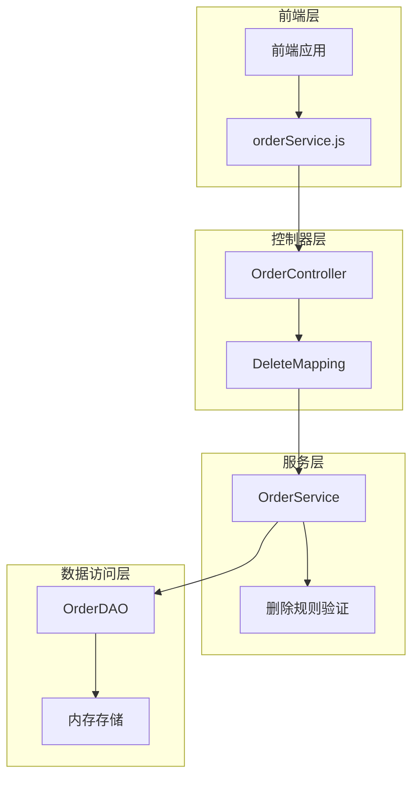
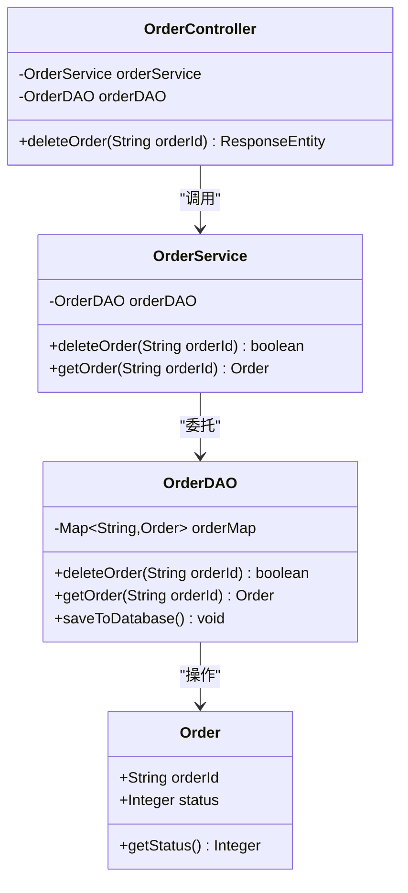
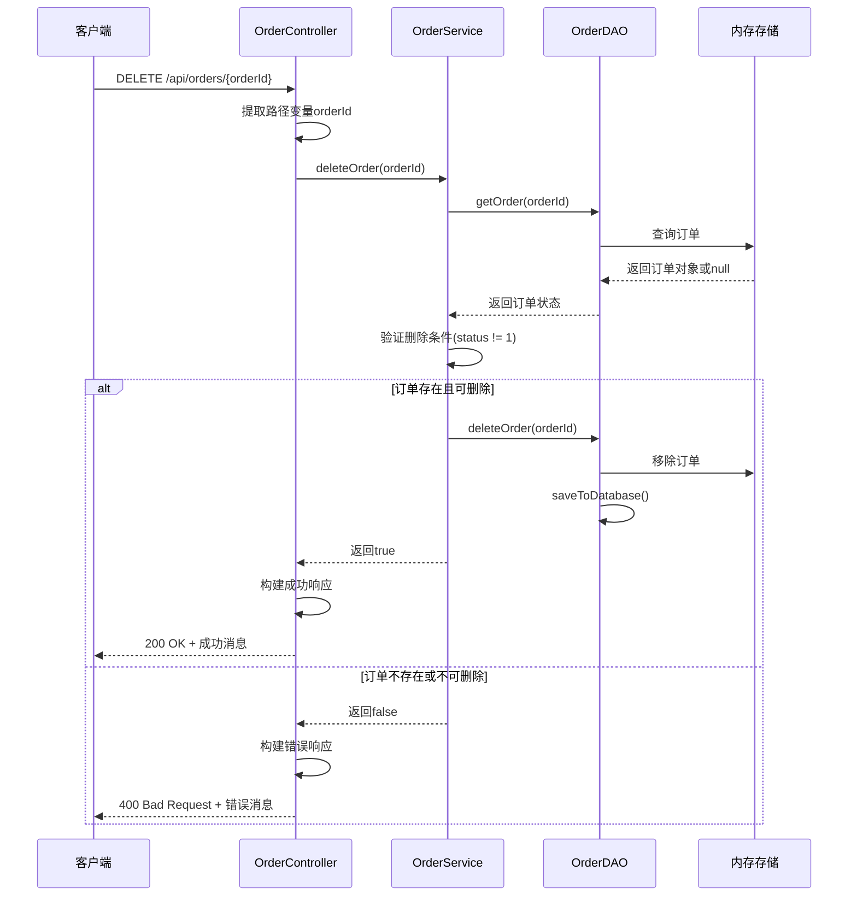
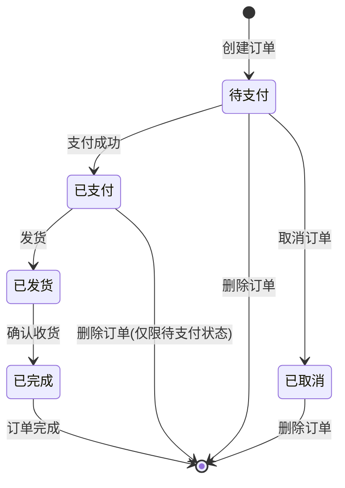
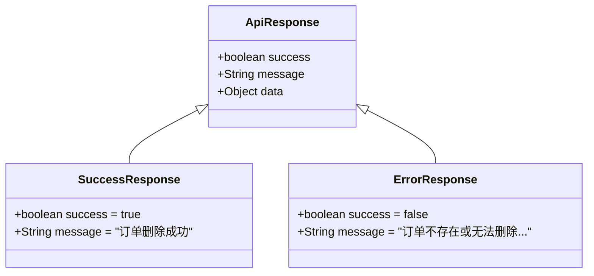
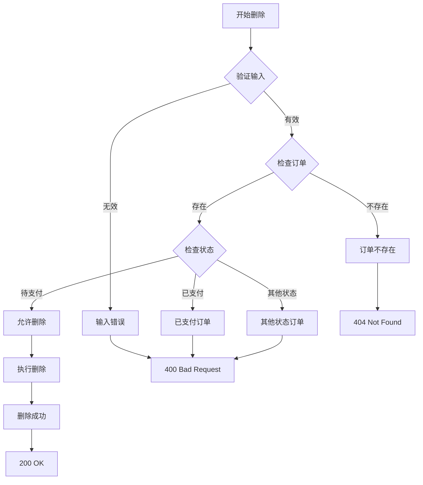

# 删除订单接口

<cite>
**本文档中引用的文件**
- [OrderController.java](file://src/main/java/com/example/demo/controller/OrderController.java)
- [OrderService.java](file://src/main/java/com/example/demo/service/OrderService.java)
- [OrderDAO.java](file://src/main/java/com/example/demo/dao/OrderDAO.java)
- [orderService.js](file://frontend/src/services/orderService.js)
- [Order.java](file://src/main/java/com/example/demo/entity/Order.java)
- [AI_OrderService_测试用例.md](file://src/main/java/com/example/demo/service/ai_docs/com/example/demo/service/AI_OrderService_测试用例.md)
</cite>

## 目录
1. [概述](#概述)
2. [接口架构](#接口架构)
3. [核心工作机制](#核心工作机制)
4. [RESTful设计原则](#restful设计原则)
5. [幂等性特征](#幂等性特征)
6. [响应状态码规范](#响应状态码规范)
7. [前端集成方式](#前端集成方式)
8. [错误处理机制](#错误处理机制)
9. [最佳实践建议](#最佳实践建议)
10. [总结](#总结)

## 概述

OrderController中的删除订单接口是一个典型的RESTful API端点，负责处理订单的逻辑删除操作。该接口通过`@DeleteMapping("/{orderId}")`注解定义，接收订单ID作为路径变量，调用OrderService执行删除逻辑，并根据业务规则返回相应的HTTP状态码和响应信息。

该接口实现了完整的订单生命周期管理，支持对不同状态订单的删除控制，确保系统数据的一致性和业务规则的完整性。

## 接口架构

### 后端架构层次



**图表来源**
- [OrderController.java](file://src/main/java/com/example/demo/controller/OrderController.java#L143-L172)
- [OrderService.java](file://src/main/java/com/example/demo/service/OrderService.java#L76-L90)
- [OrderDAO.java](file://src/main/java/com/example/demo/dao/OrderDAO.java#L201-L212)

### 接口定义结构



**图表来源**
- [OrderController.java](file://src/main/java/com/example/demo/controller/OrderController.java#L23-L30)
- [OrderService.java](file://src/main/java/com/example/demo/service/OrderService.java#L15-L21)
- [OrderDAO.java](file://src/main/java/com/example/demo/dao/OrderDAO.java#L19-L21)

**章节来源**
- [OrderController.java](file://src/main/java/com/example/demo/controller/OrderController.java#L143-L172)
- [OrderService.java](file://src/main/java/com/example/demo/service/OrderService.java#L76-L90)
- [OrderDAO.java](file://src/main/java/com/example/demo/dao/OrderDAO.java#L201-L212)

## 核心工作机制

### 请求处理流程



**图表来源**
- [OrderController.java](file://src/main/java/com/example/demo/controller/OrderController.java#L146-L159)
- [OrderService.java](file://src/main/java/com/example/demo/service/OrderService.java#L81-L90)
- [OrderDAO.java](file://src/main/java/com/example/demo/dao/OrderDAO.java#L206-L211)

### 删除规则验证

系统实现了严格的删除规则验证机制：

1. **订单存在性检查**：验证目标订单是否存在于系统中
2. **状态限制**：禁止删除已支付状态（status=1）的订单
3. **幂等性保证**：重复删除同一订单不会产生副作用

**章节来源**
- [OrderController.java](file://src/main/java/com/example/demo/controller/OrderController.java#L146-L159)
- [OrderService.java](file://src/main/java/com/example/demo/service/OrderService.java#L81-L90)

## RESTful设计原则

### URI设计规范

该接口严格遵循RESTful设计原则：

- **资源定位**：使用`/api/orders/{orderId}`作为资源URI
- **动词避免**：采用HTTP方法表达操作意图（DELETE表示删除）
- **层级清晰**：明确区分订单集合和单个订单资源

### HTTP方法映射

| 方法 | URI模式 | 功能描述 | 幂等性 |
|------|---------|----------|--------|
| GET | `/api/orders/{orderId}` | 获取订单详情 | 是 |
| DELETE | `/api/orders/{orderId}` | 删除订单 | 是 |
| PUT | `/api/orders/{orderId}` | 更新订单 | 是 |
| POST | `/api/orders` | 创建订单 | 否 |

### 资源状态管理



**章节来源**
- [OrderController.java](file://src/main/java/com/example/demo/controller/OrderController.java#L143-L172)
- [Order.java](file://src/main/java/com/example/demo/entity/Order.java#L25-L27)

## 幂等性特征

### 幂等性保证机制

删除订单接口具有完全的幂等性特征：

1. **重复删除的安全性**：多次调用删除同一订单不会产生副作用
2. **状态一致性**：无论调用次数，最终状态保持一致
3. **业务规则保护**：已支付订单的删除权限始终被拒绝

### 幂等性实现原理

```mermaid
flowchart TD
Start([开始删除请求]) --> CheckExist{订单是否存在?}
CheckExist --> |否| ReturnNotFound[返回404 Not Found]
CheckExist --> |是| CheckStatus{检查订单状态}
CheckStatus --> |待支付(0)| AllowDelete[允许删除]
CheckStatus --> |已支付(1)| DenyDelete[拒绝删除]
CheckStatus --> |已发货(2)| DenyDelete
CheckStatus --> |已完成(3)| DenyDelete
CheckStatus --> |已取消(4)| DenyDelete
AllowDelete --> RemoveOrder[移除订单]
RemoveOrder --> SaveDB[保存到数据库]
SaveDB --> ReturnSuccess[返回200 OK]
DenyDelete --> ReturnBadRequest[返回400 Bad Request]
ReturnNotFound --> End([结束])
ReturnSuccess --> End
ReturnBadRequest --> End
```

**图表来源**
- [OrderService.java](file://src/main/java/com/example/demo/service/OrderService.java#L81-L90)
- [OrderDAO.java](file://src/main/java/com/example/demo/dao/OrderDAO.java#L206-L211)

**章节来源**
- [OrderController.java](file://src/main/java/com/example/demo/controller/OrderController.java#L146-L159)
- [OrderService.java](file://src/main/java/com/example/demo/service/OrderService.java#L81-L90)

## 响应状态码规范

### HTTP状态码映射

| 状态码 | 场景描述 | 响应内容 |
|--------|----------|----------|
| 200 OK | 删除成功 | `{"success": true, "message": "订单删除成功"}` |
| 400 Bad Request | 订单不存在或无法删除 | `{"success": false, "message": "订单不存在或无法删除(已支付订单不能删除)"}` |
| 404 Not Found | 资源不存在（传统实现） | `{"success": false, "message": "订单不存在"}` |

### 响应体结构设计



**图表来源**
- [OrderController.java](file://src/main/java/com/example/demo/controller/OrderController.java#L148-L159)

### 语义规范说明

1. **200状态码**：表示操作成功执行，订单已被成功删除
2. **400状态码**：表示客户端请求存在业务逻辑错误，如尝试删除已支付订单
3. **404状态码**：表示资源不存在（传统实现）

**章节来源**
- [OrderController.java](file://src/main/java/com/example/demo/controller/OrderController.java#L146-L159)

## 前端集成方式

### orderService.js封装

前端通过orderService.js模块封装DELETE请求：

```javascript
// 删除订单函数封装
deleteOrder: (orderId) => {
    return api.delete(`/orders/${orderId}`);
}
```

### 调用示例

```javascript
// 基本调用方式
orderService.deleteOrder('ORDER-12345')
    .then(response => {
        console.log('删除成功:', response.data.message);
        // 刷新订单列表或其他UI更新
    })
    .catch(error => {
        console.error('删除失败:', error.response?.data?.message);
        // 显示错误提示给用户
    });
```

### React组件集成示例

```javascript
import React from 'react';
import { orderService } from './services/orderService';

function OrderItem({ order, onDelete }) {
    const handleDelete = async () => {
        try {
            await orderService.deleteOrder(order.orderId);
            onDelete(order.orderId);
        } catch (error) {
            alert(`删除失败: ${error.response?.data?.message}`);
        }
    };

    return (
        <div className="order-item">
            <button onClick={handleDelete}>删除</button>
        </div>
    );
}
```

**章节来源**
- [orderService.js](file://frontend/src/services/orderService.js#L38-L41)

## 错误处理机制

### 业务规则错误

系统实现了多层次的错误处理机制：

1. **订单状态检查**：防止删除已支付订单
2. **存在性验证**：确保只删除存在的订单
3. **数据库一致性**：保证删除操作的原子性

### 异常处理流程



**图表来源**
- [OrderService.java](file://src/main/java/com/example/demo/service/OrderService.java#L81-L90)
- [OrderDAO.java](file://src/main/java/com/example/demo/dao/OrderDAO.java#L206-L211)

### 错误消息设计

| 错误类型 | 错误消息 | HTTP状态码 |
|----------|----------|------------|
| 订单不存在 | "订单不存在" | 404 |
| 已支付订单 | "订单不存在或无法删除(已支付订单不能删除)" | 400 |
| 业务规则违反 | "订单不存在或无法删除(已支付订单不能删除)" | 400 |

**章节来源**
- [OrderController.java](file://src/main/java/com/example/demo/controller/OrderController.java#L146-L159)
- [OrderService.java](file://src/main/java/com/example/demo/service/OrderService.java#L81-L90)

## 最佳实践建议

### 添加确认机制

为了防止误删操作，建议在前端实现确认对话框：

```javascript
const handleDeleteWithConfirmation = async (orderId) => {
    const confirmed = window.confirm('确定要删除该订单吗？此操作不可恢复！');
    if (confirmed) {
        try {
            await orderService.deleteOrder(orderId);
            // 显示删除成功通知
            showNotification('删除成功', 'success');
        } catch (error) {
            // 显示错误通知
            showNotification('删除失败: ' + error.response?.data?.message, 'error');
        }
    }
};
```

### 批量删除支持

考虑扩展接口支持批量删除操作：

```javascript
// 批量删除函数
batchDeleteOrders: (orderIds) => {
    return api.post('/orders/batch-delete', { orderIds });
}
```

### 日志记录增强

建议在后端添加删除操作的日志记录：

```java
@Service
public class OrderService {
    private static final Logger logger = LoggerFactory.getLogger(OrderService.class);
    
    public boolean deleteOrder(String orderId) {
        Order order = getOrderDAO().getOrder(orderId);
        if (order != null && order.getStatus() == 1) {
            logger.warn("尝试删除已支付订单: {}", orderId);
            return false;
        }
        
        boolean result = getOrderDAO().deleteOrder(orderId);
        if (result) {
            logger.info("成功删除订单: {}", orderId);
        }
        return result;
    }
}
```

### 前端状态管理

建议在前端维护删除状态，避免重复提交：

```javascript
class OrderManager {
    constructor() {
        this.deletingOrderIds = new Set();
    }
    
    async deleteOrder(orderId) {
        if (this.deletingOrderIds.has(orderId)) {
            return Promise.reject(new Error('正在删除，请稍候'));
        }
        
        this.deletingOrderIds.add(orderId);
        try {
            await orderService.deleteOrder(orderId);
            // 从UI中移除订单
            this.removeFromUI(orderId);
        } finally {
            this.deletingOrderIds.delete(orderId);
        }
    }
}
```

## 总结

OrderController中的删除订单接口是一个设计良好的RESTful API，具有以下特点：

1. **完整的RESTful设计**：严格遵循REST原则，使用标准HTTP方法和状态码
2. **强幂等性保证**：重复调用不会产生副作用，确保系统稳定性
3. **严格的业务规则**：防止删除已支付订单，维护数据完整性
4. **清晰的错误处理**：提供有意义的错误消息和适当的HTTP状态码
5. **易于前端集成**：简洁的API设计便于前端开发和维护

该接口为订单管理系统提供了可靠的删除功能，同时通过合理的错误处理和业务规则验证，确保了系统的稳定性和数据安全性。建议在实际使用中添加确认机制和状态管理，进一步提升用户体验和系统可靠性。