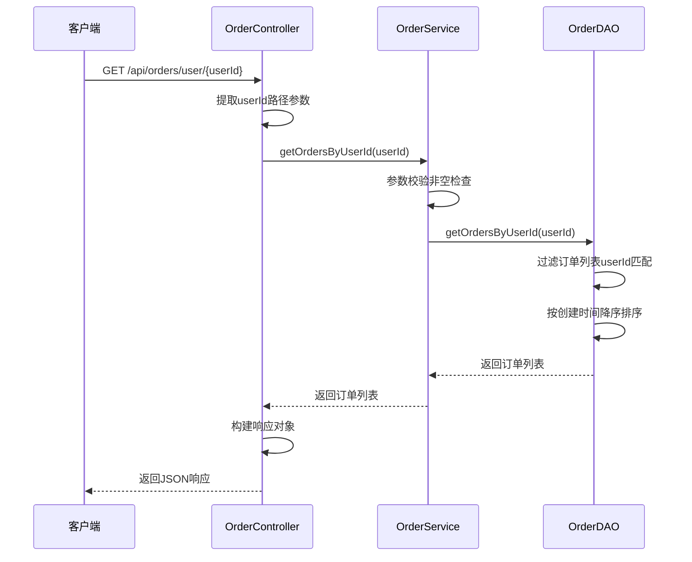
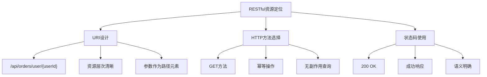
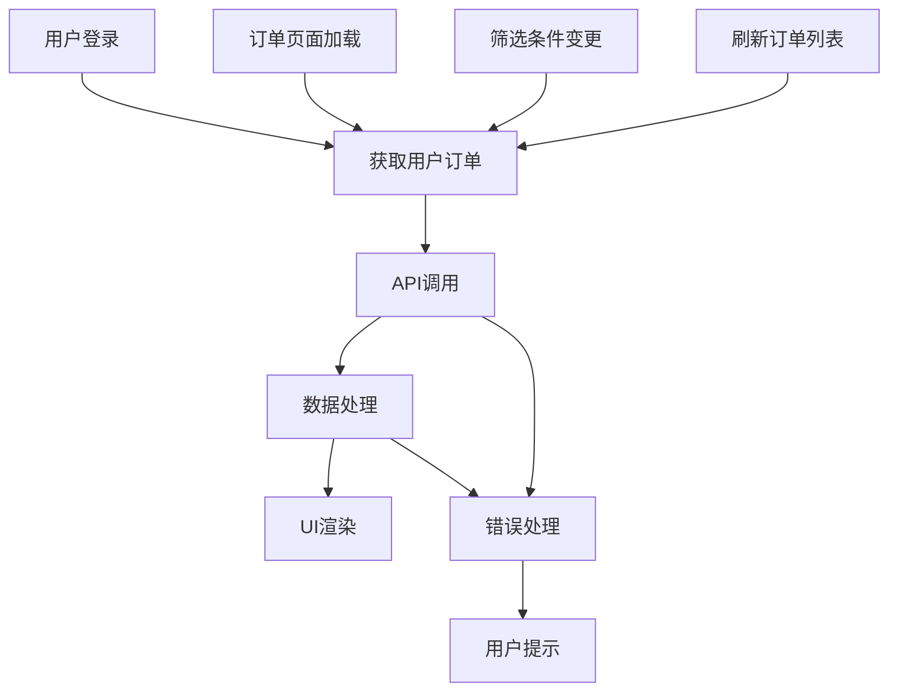
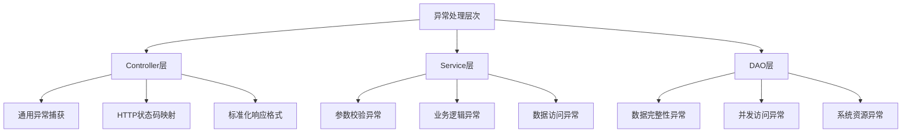

# 按用户查询订单列表接口

<cite>
**本文档中引用的文件**
- [OrderController.java](file://src/main/java/com/example/demo/controller/OrderController.java)
- [OrderService.java](file://src/main/java/com/example/demo/service/OrderService.java)
- [OrderDAO.java](file://src/main/java/com/example/demo/dao/OrderDAO.java)
- [orderService.js](file://frontend/src/services/orderService.js)
- [Order.java](file://src/main/java/com/example/demo/entity/Order.java)
- [OrderServiceTest.java](file://src/test/java/com/example/demo/service/OrderServiceTest.java)
- [OrderDAOTest.java](file://src/test/java/com/example/demo/dao/OrderDAOTest.java)
</cite>

## 目录
1. [简介](#简介)
2. [接口概述](#接口概述)
3. [核心实现分析](#核心实现分析)
4. [数据过滤机制](#数据过滤机制)
5. [响应处理策略](#响应处理策略)
6. [RESTful设计原则](#restful设计原则)
7. [性能优化建议](#性能优化建议)
8. [前端调用示例](#前端调用示例)
9. [错误处理机制](#错误处理机制)
10. [总结](#总结)

## 简介

本文档详细分析了Spring Boot应用中OrderController的`@GetMapping("/user/{userId}")`方法实现，该接口提供了基于用户ID查询订单列表的功能。通过深入分析URL路径参数提取、服务层调用链路、数据过滤逻辑以及统一响应格式等关键环节，展示了一个完整的RESTful API的设计与实现。

## 接口概述

### 接口定义

该接口采用标准的RESTful设计模式，通过HTTP GET方法提供订单查询服务：

- **端点路径**: `/api/orders/user/{userId}`
- **HTTP方法**: GET
- **功能描述**: 根据指定的用户ID获取该用户的所有订单列表
- **返回类型**: JSON格式的响应对象

### 请求参数

| 参数名 | 类型 | 必填 | 描述 |
|--------|------|------|------|
| userId | String | 是 | 用户唯一标识符 |

### 响应格式

接口返回统一的JSON响应格式，包含成功状态、数据内容和统计信息：

```json
{
  "success": true,
  "data": [...],
  "count": 0,
  "message": null
}
```

## 核心实现分析

### Controller层实现

OrderController中的getOrdersByUserId方法是整个调用链路的入口点，负责接收HTTP请求并协调服务层处理：



**图表来源**
- [OrderController.java](file://src/main/java/com/example/demo/controller/OrderController.java#L98-L111)
- [OrderService.java](file://src/main/java/com/example/demo/service/OrderService.java#L98-L104)
- [OrderDAO.java](file://src/main/java/com/example/demo/dao/OrderDAO.java#L219-L232)

### URL路径参数提取

Spring MVC框架通过`@PathVariable`注解自动提取URL路径中的userId参数：

```java
@GetMapping("/user/{userId}")
public ResponseEntity<Map<String, Object>> getOrdersByUserId(@PathVariable String userId)
```

这种设计的优势：
- **语义清晰**: URL直观表达资源关系
- **RESTful规范**: 符合REST架构风格
- **易于缓存**: URL可作为缓存键
- **搜索引擎友好**: 有利于SEO优化

**章节来源**
- [OrderController.java](file://src/main/java/com/example/demo/controller/OrderController.java#L98-L111)

## 数据过滤机制

### 服务层参数校验

OrderService在接收到userId参数后，首先进行严格的非空验证：

```java
// 参数校验
if (userId == null || userId.trim().isEmpty()) {
    throw new IllegalArgumentException("用户ID不能为空");
}
```

这种防御性编程设计确保了：
- **输入合法性**: 防止空值传播到下层
- **用户体验**: 提供明确的错误提示
- **系统稳定性**: 避免潜在的运行时异常

### DAO层精确过滤

OrderDAO采用流式操作实现高效的订单过滤和排序：

```java
return orderMap.values().stream()
    .filter(order -> userId.equals(order.getUserId()))  // 严格匹配用户ID
    .sorted(Comparator.comparing(
        Order::getCreateTime,
        Comparator.nullsLast(Comparator.reverseOrder())
    ))
    .collect(Collectors.toList());
```

过滤逻辑的关键特性：
- **精确匹配**: 使用`equals()`方法确保用户ID完全一致
- **空值安全**: `Comparator.nullsLast()`处理createTime为null的情况
- **性能优化**: 流式操作避免中间集合创建
- **时间倒序**: 最新订单优先显示

**章节来源**
- [OrderService.java](file://src/main/java/com/example/demo/service/OrderService.java#L98-L104)
- [OrderDAO.java](file://src/main/java/com/example/demo/dao/OrderDAO.java#L219-L232)

## 响应处理策略

### 统一响应格式

系统采用统一的响应格式，确保前后端交互的一致性：

```java
Map<String, Object> response = new HashMap<>();
response.put("success", true);
response.put("data", orders);
response.put("count", orders.size());
return ResponseEntity.ok(response);
```

响应结构设计考虑：
- **success字段**: 明确操作结果状态
- **data字段**: 包含实际业务数据
- **count字段**: 提供数据量统计信息
- **message字段**: 保留错误信息空间

### 空列表处理策略

当用户没有订单时，系统返回空数组而非null：

```java
// OrderService层面的处理
if (userId == null || userId.trim().isEmpty()) {
    throw new IllegalArgumentException("用户ID不能为空");
}

// OrderDAO层面的处理
if (userId == null || userId.trim().isEmpty()) {
    return new ArrayList<>();
}
```

这种设计的优势：
- **客户端友好**: 避免null值导致的空指针异常
- **语义明确**: 空数组表示"没有符合条件的数据"
- **一致性保证**: 所有查询都返回数组类型

**章节来源**
- [OrderController.java](file://src/main/java/com/example/demo/controller/OrderController.java#L101-L105)
- [OrderService.java](file://src/main/java/com/example/demo/service/OrderService.java#L100-L102)
- [OrderDAO.java](file://src/main/java/com/example/demo/dao/OrderDAO.java#L221-L222)

## RESTful设计原则

### 资源定位

该接口严格遵循RESTful设计原则：



### 幂等性保证

GET请求具有幂等性特征：
- **多次调用结果一致**: 相同参数返回相同结果
- **无副作用**: 不修改服务器状态
- **可缓存**: 结果可以被缓存

### 版本控制

通过`/api/orders`前缀实现了API版本控制：
- **向后兼容**: 新版本不破坏旧版本功能
- **演进空间**: 支持未来功能扩展
- **清晰边界**: 明确区分不同版本接口

**章节来源**
- [OrderController.java](file://src/main/java/com/example/demo/controller/OrderController.java#L19-L21)

## 性能优化建议

### 分页查询扩展

当前实现采用全量返回策略，对于大数据量场景需要考虑分页优化：

```java
// 建议的分页参数
@GetMapping("/user/{userId}")
public ResponseEntity<Map<String, Object>> getOrdersByUserId(
    @PathVariable String userId,
    @RequestParam(defaultValue = "0") int page,
    @RequestParam(defaultValue = "10") int size) {
    
    // 实现分页逻辑
    List<Order> allOrders = orderService.getOrdersByUserId(userId);
    int total = allOrders.size();
    
    List<Order> pagedOrders = allOrders.stream()
        .skip((long) page * size)
        .limit(size)
        .collect(Collectors.toList());
    
    // 返回分页结果
}
```

### 缓存策略

对于高频查询场景，建议引入缓存机制：

```java
@Cacheable(value = "userOrders", key = "#userId")
public List<Order> getOrdersByUserId(String userId) {
    return orderDAO.getOrdersByUserId(userId);
}
```

### 数据库索引优化

如果使用真实数据库，建议对userId字段建立索引：

```sql
CREATE INDEX idx_order_user_id ON order0713(userId);
```

### 内存优化

当前实现使用ConcurrentHashMap存储订单数据，对于大规模数据：
- **内存占用**: 考虑数据持久化方案
- **并发性能**: 利用ConcurrentHashMap的线程安全性
- **垃圾回收**: 定期清理过期数据

**章节来源**
- [OrderDAO.java](file://src/main/java/com/example/demo/dao/OrderDAO.java#L19-L20)

## 前端调用示例

### Axios封装实现

前端通过orderService.js模块封装了API调用：

```javascript
// 根据用户ID获取订单列表
getOrdersByUserId: (userId) => {
    return api.get(`/orders/user/${userId}`);
}
```

### 调用场景分析

该接口在以下场景中被频繁使用：



### 错误处理最佳实践

前端应实现完善的错误处理机制：

```javascript
try {
    const response = await orderService.getOrdersByUserId(userId);
    if (response.data.success) {
        // 处理成功响应
        displayOrders(response.data.data);
    }
} catch (error) {
    // 处理网络错误或服务器错误
    showErrorMessage('获取订单失败，请稍后重试');
}
```

**章节来源**
- [orderService.js](file://frontend/src/services/orderService.js#L28-L31)

## 错误处理机制

### 异常分类处理

系统实现了多层次的异常处理策略：



### HTTP状态码策略

系统采用适当的HTTP状态码：

| 场景 | 状态码 | 响应内容 |
|------|--------|----------|
| 成功查询 | 200 OK | 正常订单列表 |
| 参数错误 | 400 Bad Request | 参数校验失败 |
| 服务器错误 | 500 Internal Server Error | 系统异常 |

### 错误信息国际化

建议扩展错误信息处理：
- **本地化支持**: 支持多语言错误提示
- **详细日志**: 记录异常堆栈信息
- **用户友好**: 提供可读的错误描述

**章节来源**
- [OrderController.java](file://src/main/java/com/example/demo/controller/OrderController.java#L107-L111)
- [OrderServiceTest.java](file://src/test/java/com/example/demo/service/OrderServiceTest.java#L170-L202)

## 总结

OrderController的`@GetMapping("/user/{userId}")`方法实现体现了现代Web应用开发的最佳实践：

### 设计优势

1. **RESTful架构**: 符合REST设计原则，资源定位清晰
2. **分层架构**: 控制器、服务、数据访问层职责分明
3. **防御性编程**: 多层次参数校验确保系统稳定性
4. **统一响应**: 标准化的JSON响应格式提升开发体验
5. **性能考虑**: 流式操作和空列表优化减少资源消耗

### 技术亮点

- **URL路径参数**: 直观的资源标识方式
- **Lambda表达式**: 简洁的数据处理逻辑
- **Comparator接口**: 灵活的时间排序实现
- **泛型应用**: 类型安全的集合操作

### 改进建议

1. **分页功能**: 支持大数据量场景下的高效查询
2. **缓存机制**: 提升高频查询的响应速度
3. **索引优化**: 数据库层面的性能提升
4. **监控告警**: 关键指标的实时监控

该接口设计为构建可扩展、高性能的电商系统奠定了坚实基础，其设计理念和实现方式值得在类似项目中借鉴和应用。