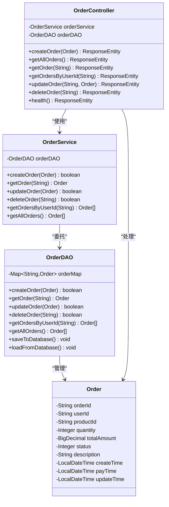
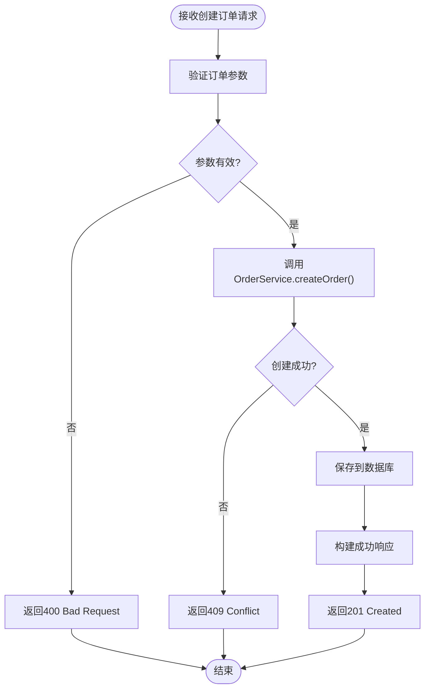
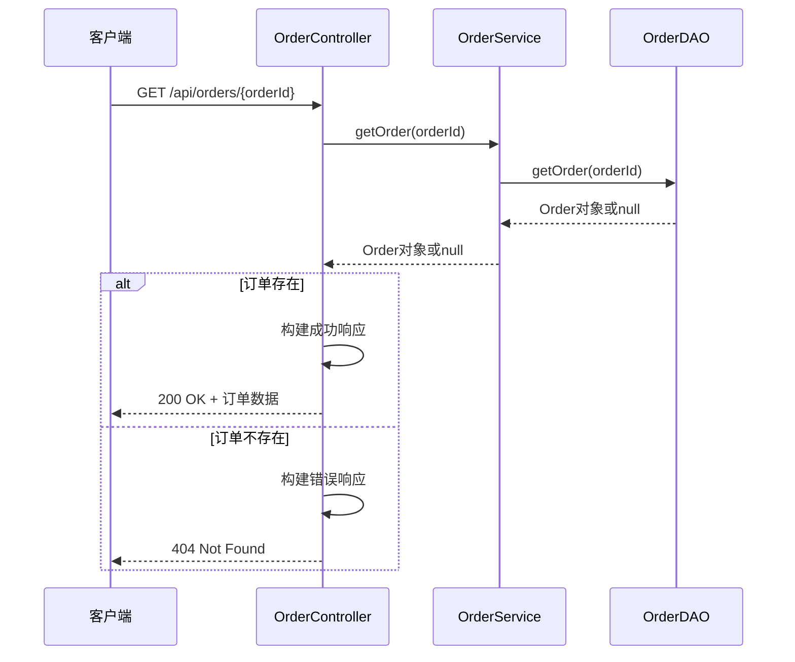
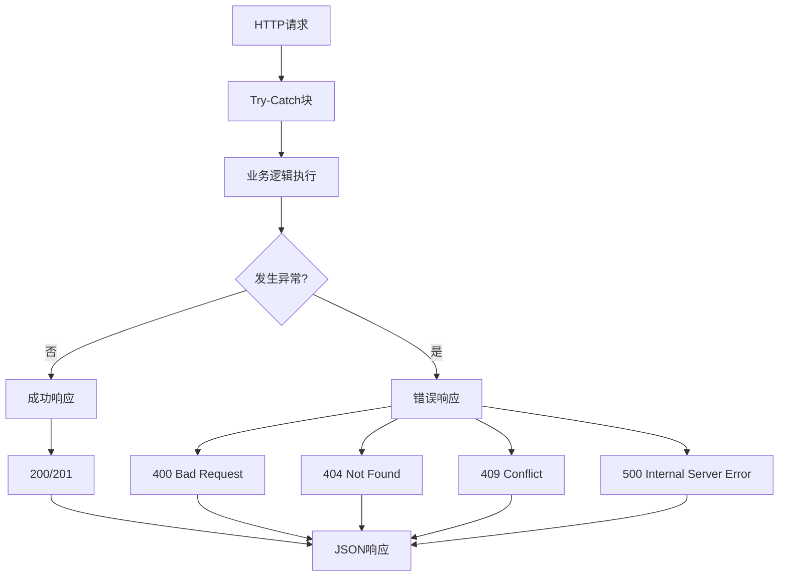
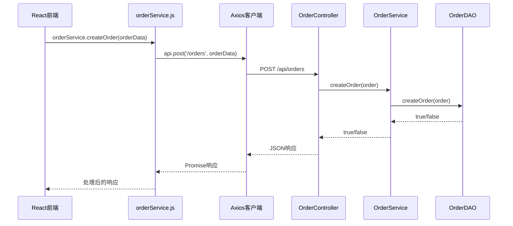

# 控制器层

<cite>
**本文档中引用的文件**
- [OrderController.java](file://src/main/java/com/example/demo/controller/OrderController.java)
- [orderService.js](file://frontend/src/services/orderService.js)
- [WebConfig.java](file://src/main/java/com/example/demo/config/WebConfig.java)
- [Order.java](file://src/main/java/com/example/demo/entity/Order.java)
- [OrderService.java](file://src/main/java/com/example/demo/service/OrderService.java)
- [OrderDAO.java](file://src/main/java/com/example/demo/dao/OrderDAO.java)
- [application.properties](file://src/main/resources/application.properties)
- [OrderControllerIT.java](file://src/test/java/com/example/demo/controller/OrderControllerIT.java)
- [pom.xml](file://pom.xml)
</cite>

## 目录
1. [项目概述](#项目概述)
2. [架构概览](#架构概览)
3. [核心组件分析](#核心组件分析)
4. [RESTful API设计](#restful-api设计)
5. [注解机制详解](#注解机制详解)
6. [HTTP端点详细分析](#http端点详细分析)
7. [异常处理策略](#异常处理策略)
8. [统一响应格式](#统一响应格式)
9. [前端调用关系](#前端调用关系)
10. [API调用示例](#api调用示例)
11. [跨域配置最佳实践](#跨域配置最佳实践)
12. [总结](#总结)

## 项目概述

本项目是一个基于Spring Boot的订单管理系统，采用经典的三层架构模式：控制器层（Controller）、服务层（Service）和数据访问层（DAO）。OrderController作为RESTful API的入口点，负责处理所有与订单相关的HTTP请求，提供完整的CRUD操作和健康检查功能。

### 技术栈特点
- **Spring Boot 2.7.14**：提供现代化的微服务开发框架
- **RESTful API设计**：遵循REST架构风格，提供标准的HTTP接口
- **统一响应格式**：采用Map<String, Object>结构，确保前后端交互的一致性
- **跨域支持**：通过@CrossOrigin注解和全局配置实现CORS支持

## 架构概览

```mermaid
graph TB
subgraph "前端层"
FE[React前端应用]
APIClient[Axios API客户端]
end
subgraph "控制器层"
OC[OrderController<br/>@RestController]
RC[RequestMapping<br/>'/api/orders']
CO[CrossOrigin<br/>"*"]
end
subgraph "服务层"
OS[OrderService<br/>@Service]
Validation[业务校验逻辑]
end
subgraph "数据访问层"
OD[OrderDAO]
Memory[内存存储<br/>ConcurrentHashMap]
DB[(SQLite数据库)]
end
FE --> APIClient
APIClient --> OC
OC --> OS
OS --> OD
OD --> Memory
OD --> DB
OC -.-> RC
OC -.-> CO
```

**图表来源**
- [OrderController.java](file://src/main/java/com/example/demo/controller/OrderController.java#L18-L21)
- [OrderService.java](file://src/main/java/com/example/demo/service/OrderService.java#L13-L14)
- [OrderDAO.java](file://src/main/java/com/example/demo/dao/OrderDAO.java#L18-L21)

**章节来源**
- [OrderController.java](file://src/main/java/com/example/demo/controller/OrderController.java#L1-L173)
- [OrderService.java](file://src/main/java/com/example/demo/service/OrderService.java#L1-L114)
- [OrderDAO.java](file://src/main/java/com/example/demo/dao/OrderDAO.java#L1-L248)

## 核心组件分析

### OrderController核心特性

OrderController作为订单管理系统的RESTful API入口，具有以下核心特性：

1. **依赖注入**：通过@Autowired注解注入OrderService和OrderDAO实例
2. **统一异常处理**：所有API端点都包含try-catch块进行异常捕获
3. **响应状态码管理**：根据业务逻辑返回适当的HTTP状态码
4. **数据验证**：在业务层进行参数校验，确保数据完整性

### 组件关系图



**图表来源**
- [OrderController.java](file://src/main/java/com/example/demo/controller/OrderController.java#L23-L30)
- [OrderService.java](file://src/main/java/com/example/demo/service/OrderService.java#L16-L21)
- [OrderDAO.java](file://src/main/java/com/example/demo/dao/OrderDAO.java#L20-L21)
- [Order.java](file://src/main/java/com/example/demo/entity/Order.java#L10-L39)

**章节来源**
- [OrderController.java](file://src/main/java/com/example/demo/controller/OrderController.java#L23-L30)
- [OrderService.java](file://src/main/java/com/example/demo/service/OrderService.java#L16-L21)
- [OrderDAO.java](file://src/main/java/com/example/demo/dao/OrderDAO.java#L20-L21)

## RESTful API设计

### URL路径规范

OrderController遵循RESTful设计原则，采用层次化的URL结构：

| HTTP方法 | URL路径 | 功能描述 | 请求体 | 响应体 |
|---------|---------|----------|--------|--------|
| GET | `/api/orders` | 获取所有订单列表 | 无 | 包含订单数组的响应对象 |
| GET | `/api/orders/{orderId}` | 获取指定订单详情 | 无 | 包含单个订单的响应对象 |
| GET | `/api/orders/user/{userId}` | 根据用户ID获取订单列表 | 无 | 包含订单数组的响应对象 |
| POST | `/api/orders` | 创建新订单 | Order对象JSON | 包含创建结果的响应对象 |
| PUT | `/api/orders/{orderId}` | 更新指定订单 | Order对象JSON | 包含更新结果的响应对象 |
| DELETE | `/api/orders/{orderId}` | 删除指定订单 | 无 | 包含删除结果的响应对象 |
| GET | `/api/orders/health` | 健康检查 | 无 | 包含健康状态的响应对象 |

### 设计原则

1. **资源导向**：每个URL代表一个具体的资源
2. **动词标准化**：使用标准的HTTP动词表示操作类型
3. **幂等性**：GET、PUT、DELETE操作具有幂等性
4. **可扩展性**：预留了版本控制和子资源的扩展空间

**章节来源**
- [OrderController.java](file://src/main/java/com/example/demo/controller/OrderController.java#L35-L171)

## 注解机制详解

### @RestController注解

@RestController是Spring MVC的核心注解，它结合了@Controller和@ResponseBody的功能：

```java
@RestController
@RequestMapping("/api/orders")
@CrossOrigin(origins = "*")
public class OrderController {
    // 类实现
}
```

**作用机制**：
- **@Controller**：标记这是一个Spring MVC控制器
- **@ResponseBody**：自动将返回值序列化为JSON格式
- **组合注解**：简化控制器定义，提高开发效率

### @RequestMapping注解

```java
@RequestMapping("/api/orders")
```

**作用机制**：
- **基础路径**：为所有端点提供统一的基础路径
- **路径匹配**：支持通配符和表达式匹配
- **HTTP方法限制**：可以限制特定的HTTP方法

### @CrossOrigin注解

```java
@CrossOrigin(origins = "*")
```

**作用机制**：
- **CORS支持**：允许跨域请求访问API
- **通配符配置**：使用"*"允许所有源访问
- **安全性考虑**：生产环境中建议限制具体域名

**章节来源**
- [OrderController.java](file://src/main/java/com/example/demo/controller/OrderController.java#L18-L21)
- [WebConfig.java](file://src/main/java/com/example/demo/config/WebConfig.java#L19-L23)

## HTTP端点详细分析

### POST /api/orders - 创建订单

#### 请求映射
```java
@PostMapping
public ResponseEntity<Map<String, Object>> createOrder(@RequestBody Order order) {
    // 实现逻辑
}
```

#### 参数绑定
- **@RequestBody**：自动将JSON请求体转换为Order对象
- **参数验证**：Order对象包含所有必需字段
- **数据绑定**：Spring自动处理类型转换和字段映射

#### 响应构造逻辑



**图表来源**
- [OrderController.java](file://src/main/java/com/example/demo/controller/OrderController.java#L36-L55)

#### 状态码说明
- **201 Created**：订单创建成功
- **409 Conflict**：订单已存在
- **400 Bad Request**：参数验证失败

### GET /api/orders - 获取所有订单

#### 请求映射
```java
@GetMapping
public ResponseEntity<Map<String, Object>> getAllOrders() {
    // 实现逻辑
}
```

#### 响应结构
```json
{
  "success": true,
  "data": [
    {
      "orderId": "123",
      "userId": "user123",
      "productId": "product456",
      "quantity": 2,
      "totalAmount": 318.00,
      "status": 0,
      "description": "测试订单",
      "createTime": "2024-01-01T10:00:00",
      "payTime": null,
      "updateTime": "2024-01-01T10:05:00"
    }
  ],
  "count": 1
}
```

### GET /api/orders/{orderId} - 获取订单详情

#### 路径参数绑定
```java
@GetMapping("/{orderId}")
public ResponseEntity<Map<String, Object>> getOrder(@PathVariable String orderId) {
    // 实现逻辑
}
```

#### 参数验证流程


**图表来源**
- [OrderController.java](file://src/main/java/com/example/demo/controller/OrderController.java#L80-L92)
- [OrderService.java](file://src/main/java/com/example/demo/service/OrderService.java#L45-L47)
- [OrderDAO.java](file://src/main/java/com/example/demo/dao/OrderDAO.java#L178-L184)

### GET /api/orders/user/{userId} - 根据用户ID获取订单

#### 查询逻辑
```java
@GetMapping("/user/{userId}")
public ResponseEntity<Map<String, Object>> getOrdersByUserId(@PathVariable String userId) {
    // 实现逻辑
}
```

#### 排序规则
- **创建时间降序**：最新的订单排在最前面
- **空列表处理**：当用户没有订单时返回空数组
- **参数校验**：对userId进行非空验证

### PUT /api/orders/{orderId} - 更新订单

#### 请求映射
```java
@PutMapping("/{orderId}")
public ResponseEntity<Map<String, Object>> updateOrder(
        @PathVariable String orderId,
        @RequestBody Order order) {
    // 实现逻辑
}
```

#### 更新规则
1. **状态检查**：已完成订单不能修改
2. **时间戳更新**：自动更新updateTime字段
3. **幂等性保证**：多次调用相同数据不会产生副作用

### DELETE /api/orders/{orderId} - 删除订单

#### 删除规则
```java
@DeleteMapping("/{orderId}")
public ResponseEntity<Map<String, Object>> deleteOrder(@PathVariable String orderId) {
    // 实现逻辑
}
```

#### 业务约束
- **待支付订单**：可以正常删除
- **已支付订单**：不能删除，返回错误信息
- **不存在订单**：返回订单不存在的错误

### GET /api/orders/health - 健康检查

#### 响应格式
```json
{
  "success": true,
  "message": "订单服务运行正常"
}
```

#### 用途
- **服务监控**：前端定期检查服务可用性
- **负载均衡**：代理服务器判断后端服务状态
- **故障检测**：自动化运维系统监控服务健康度

**章节来源**
- [OrderController.java](file://src/main/java/com/example/demo/controller/OrderController.java#L36-L171)

## 异常处理策略

### 统一异常处理机制

OrderController采用统一的异常处理策略，确保所有异常都能得到妥善处理：



**图表来源**
- [OrderController.java](file://src/main/java/com/example/demo/controller/OrderController.java#L38-L55)
- [OrderController.java](file://src/main/java/com/example/demo/controller/OrderController.java#L64-L74)
- [OrderController.java](file://src/main/java/com/example/demo/controller/OrderController.java#L82-L92)

### 异常分类处理

| 异常类型 | 处理方式 | HTTP状态码 | 错误信息 |
|---------|---------|-----------|----------|
| 参数验证失败 | 直接返回错误 | 400 | 具体的验证错误信息 |
| 订单不存在 | 返回未找到 | 404 | "订单不存在" |
| 订单已存在 | 返回冲突 | 409 | "订单已存在" |
| 业务规则违反 | 返回错误 | 400 | 具体的业务错误信息 |
| 系统异常 | 返回服务器错误 | 500 | "内部服务器错误" |

### 业务异常处理

在OrderService中实现了业务层面的异常处理：

```java
// 数量验证
if (order.getQuantity() <= 0) {
    throw new IllegalArgumentException("购买数量必须大于0");
}

// 金额验证  
if (order.getTotalAmount().compareTo(order.getTotalAmount().ZERO) <= 0) {
    throw new IllegalArgumentException("订单金额必须大于0");
}
```

**章节来源**
- [OrderController.java](file://src/main/java/com/example/demo/controller/OrderController.java#L38-L55)
- [OrderController.java](file://src/main/java/com/example/demo/controller/OrderController.java#L64-L74)
- [OrderController.java](file://src/main/java/com/example/demo/controller/OrderController.java#L82-L92)
- [OrderController.java](file://src/main/java/com/example/demo/controller/OrderController.java#L122-L140)
- [OrderController.java](file://src/main/java/com/example/demo/controller/OrderController.java#L148-L159)

## 统一响应格式

### 响应格式设计

所有API端点都采用统一的响应格式，使用Map<String, Object>结构：

```java
Map<String, Object> response = new HashMap<>();
response.put("success", true/false);
response.put("message", "错误信息或成功消息");
response.put("data", responseData);
```

### 响应结构说明

#### 成功响应结构
```json
{
  "success": true,
  "message": "操作成功消息",
  "data": {
    // 具体的数据内容
  }
}
```

#### 错误响应结构
```json
{
  "success": false,
  "message": "错误描述信息",
  "data": null
}
```

#### 特殊情况响应
```json
{
  "success": true,
  "message": "操作成功消息",
  "data": [],  // 空列表
  "count": 0   // 记录数
}
```

### 设计考量

1. **一致性**：所有端点返回相同的结构，便于前端处理
2. **扩展性**：可以轻松添加新的字段而不破坏现有接口
3. **语义明确**：success字段清晰表明操作结果
4. **错误友好**：错误信息包含具体的操作指导

### 状态码映射

| success | HTTP状态码 | 含义 |
|---------|-----------|------|
| true | 200/201 | 操作成功 |
| false | 400/404/409/500 | 操作失败 |

**章节来源**
- [OrderController.java](file://src/main/java/com/example/demo/controller/OrderController.java#L37-L55)
- [OrderController.java](file://src/main/java/com/example/demo/controller/OrderController.java#L63-L74)
- [OrderController.java](file://src/main/java/com/example/demo/controller/OrderController.java#L82-L92)
- [OrderController.java](file://src/main/java/com/example/demo/controller/OrderController.java#L100-L111)
- [OrderController.java](file://src/main/java/com/example/demo/controller/OrderController.java#L121-L140)
- [OrderController.java](file://src/main/java/com/example/demo/controller/OrderController.java#L148-L159)
- [OrderController.java](file://src/main/java/com/example/demo/controller/OrderController.java#L167-L171)

## 前端调用关系

### orderService.js集成

前端通过orderService.js模块与OrderController建立通信：



**图表来源**
- [orderService.js](file://frontend/src/services/orderService.js#L14-L16)
- [OrderController.java](file://src/main/java/com/example/demo/controller/OrderController.java#L36-L55)

### API调用封装

orderService.js提供了简洁的API调用封装：

| 方法名 | HTTP方法 | URL路径 | 参数 | 返回值 |
|-------|---------|---------|------|--------|
| createOrder | POST | /api/orders | orderData | Promise |
| getOrder | GET | /api/orders/{orderId} | orderId | Promise |
| getAllOrders | GET | /api/orders | 无 | Promise |
| getOrdersByUserId | GET | /api/orders/user/{userId} | userId | Promise |
| updateOrder | PUT | /api/orders/{orderId} | orderId, orderData | Promise |
| deleteOrder | DELETE | /api/orders/{orderId} | orderId | Promise |
| healthCheck | GET | /api/orders/health | 无 | Promise |

### 跨域配置

前端通过WebConfig.java配置跨域支持：

```java
@Bean
public WebMvcConfigurer corsConfigurer() {
    return new WebMvcConfigurer() {
        @Override
        public void addCorsMappings(CorsRegistry registry) {
            registry.addMapping("/api/**")
                    .allowedOrigins("*")
                    .allowedMethods("GET", "POST", "PUT", "DELETE", "OPTIONS")
                    .allowedHeaders("*")
                    .maxAge(3600);
        }
    };
}
```

**章节来源**
- [orderService.js](file://frontend/src/services/orderService.js#L1-L49)
- [WebConfig.java](file://src/main/java/com/example/demo/config/WebConfig.java#L14-L26)

## API调用示例

### 创建订单示例

#### 请求
```bash
curl -X POST http://localhost:9090/api/orders \
  -H "Content-Type: application/json" \
  -d '{
    "orderId": "ORD-20240101-001",
    "userId": "USER-20240101-001",
    "productId": "PROD-20240101-001",
    "quantity": 2,
    "totalAmount": 318.00,
    "description": "测试订单"
  }'
```

#### 响应
```json
{
  "success": true,
  "message": "订单创建成功",
  "data": {
    "orderId": "ORD-20240101-001",
    "userId": "USER-20240101-001",
    "productId": "PROD-20240101-001",
    "quantity": 2,
    "totalAmount": 318.00,
    "status": 0,
    "description": "测试订单",
    "createTime": "2024-01-01T10:00:00",
    "payTime": null,
    "updateTime": null
  }
}
```

### 获取订单列表示例

#### 请求
```bash
curl -X GET http://localhost:9090/api/orders
```

#### 响应
```json
{
  "success": true,
  "data": [
    {
      "orderId": "ORD-20240101-001",
      "userId": "USER-20240101-001",
      "productId": "PROD-20240101-001",
      "quantity": 2,
      "totalAmount": 318.00,
      "status": 0,
      "description": "测试订单",
      "createTime": "2024-01-01T10:00:00",
      "payTime": null,
      "updateTime": "2024-01-01T10:05:00"
    }
  ],
  "count": 1
}
```

### 更新订单示例

#### 请求
```bash
curl -X PUT http://localhost:9090/api/orders/ORD-20240101-001 \
  -H "Content-Type: application/json" \
  -d '{
    "quantity": 3,
    "totalAmount": 477.00,
    "status": 1
  }'
```

#### 响应
```json
{
  "success": true,
  "message": "订单更新成功",
  "data": {
    "orderId": "ORD-20240101-001",
    "userId": "USER-20240101-001",
    "productId": "PROD-20240101-001",
    "quantity": 3,
    "totalAmount": 477.00,
    "status": 1,
    "description": "测试订单",
    "createTime": "2024-01-01T10:00:00",
    "payTime": "2024-01-01T10:10:00",
    "updateTime": "2024-01-01T10:15:00"
  }
}
```

### 删除订单示例

#### 请求
```bash
curl -X DELETE http://localhost:9090/api/orders/ORD-20240101-001
```

#### 响应
```json
{
  "success": true,
  "message": "订单删除成功"
}
```

### 健康检查示例

#### 请求
```bash
curl -X GET http://localhost:9090/api/orders/health
```

#### 响应
```json
{
  "success": true,
  "message": "订单服务运行正常"
}
```

**章节来源**
- [OrderControllerIT.java](file://src/test/java/com/example/demo/controller/OrderControllerIT.java#L36-L57)
- [OrderControllerIT.java](file://src/test/java/com/example/demo/controller/OrderControllerIT.java#L113-L121)
- [OrderControllerIT.java](file://src/test/java/com/example/demo/controller/OrderControllerIT.java#L128-L159)
- [OrderControllerIT.java](file://src/test/java/com/example/demo/controller/OrderControllerIT.java#L166-L174)

## 跨域配置最佳实践

### 全局CORS配置

WebConfig.java提供了全局的CORS配置：

```java
@Configuration
public class WebConfig {
    @Bean
    public WebMvcConfigurer corsConfigurer() {
        return new WebMvcConfigurer() {
            @Override
            public void addCorsMappings(CorsRegistry registry) {
                registry.addMapping("/api/**")
                        .allowedOrigins("*")
                        .allowedMethods("GET", "POST", "PUT", "DELETE", "OPTIONS")
                        .allowedHeaders("*")
                        .maxAge(3600);
            }
        };
    }
}
```

### 配置参数说明

| 参数 | 说明 | 示例值 |
|------|------|--------|
| addMapping | 匹配路径 | "/api/**" |
| allowedOrigins | 允许的源 | "*" 或 "http://localhost:3000" |
| allowedMethods | 允许的HTTP方法 | "GET", "POST", "PUT", "DELETE" |
| allowedHeaders | 允许的请求头 | "*" |
| maxAge | 预检请求缓存时间 | 3600秒 |

### 生产环境配置建议

1. **限制源域名**：避免使用"*"，指定具体的前端域名
2. **最小权限原则**：只开放必要的HTTP方法
3. **安全头配置**：配合其他安全措施使用
4. **监控和日志**：记录CORS相关的访问日志

### @CrossOrigin注解使用

OrderController直接使用@CrossOrigin注解：

```java
@RestController
@RequestMapping("/api/orders")
@CrossOrigin(origins = "*")
public class OrderController {
    // 实现
}
```

**优势**：
- **精确控制**：针对特定控制器或方法配置
- **灵活性**：可以为不同端点设置不同的CORS策略
- **性能优化**：减少不必要的全局配置

**章节来源**
- [WebConfig.java](file://src/main/java/com/example/demo/config/WebConfig.java#L14-L26)
- [OrderController.java](file://src/main/java/com/example/demo/controller/OrderController.java#L20)

## 总结

OrderController作为订单管理系统的RESTful API入口，展现了现代Spring Boot应用的最佳实践：

### 核心优势

1. **架构清晰**：三层架构分离关注点，职责明确
2. **API设计规范**：遵循RESTful设计原则，易于理解和维护
3. **异常处理完善**：统一的异常处理机制，提升系统健壮性
4. **响应格式一致**：统一的响应结构，便于前端处理
5. **跨域支持完整**：全局和局部配置相结合，满足各种需求

### 技术亮点

- **依赖注入**：充分利用Spring的IoC容器管理组件生命周期
- **注解驱动**：大量使用Spring注解简化配置和开发
- **类型安全**：强类型的Java语言确保编译时错误检查
- **测试友好**：完善的单元测试和集成测试覆盖

### 应用价值

该实现不仅是一个功能完整的订单管理系统，更是学习Spring Boot RESTful API开发的优秀范例。通过深入分析其实现细节，开发者可以掌握：

- RESTful API的设计原则和最佳实践
- Spring Boot控制器层的开发技巧
- 统一异常处理和响应格式的设计思路
- 前后端分离架构的实现方案
- 跨域配置的安全性和灵活性平衡

这种设计模式适用于各种企业级应用开发场景，为构建可扩展、可维护的微服务架构奠定了坚实基础。