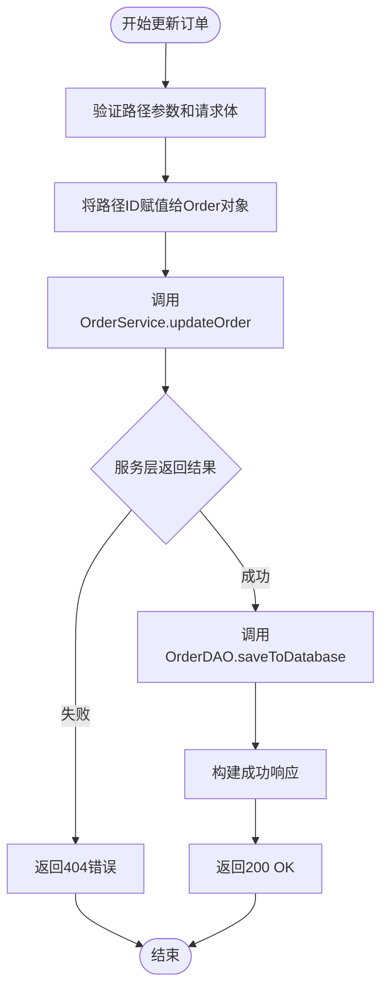
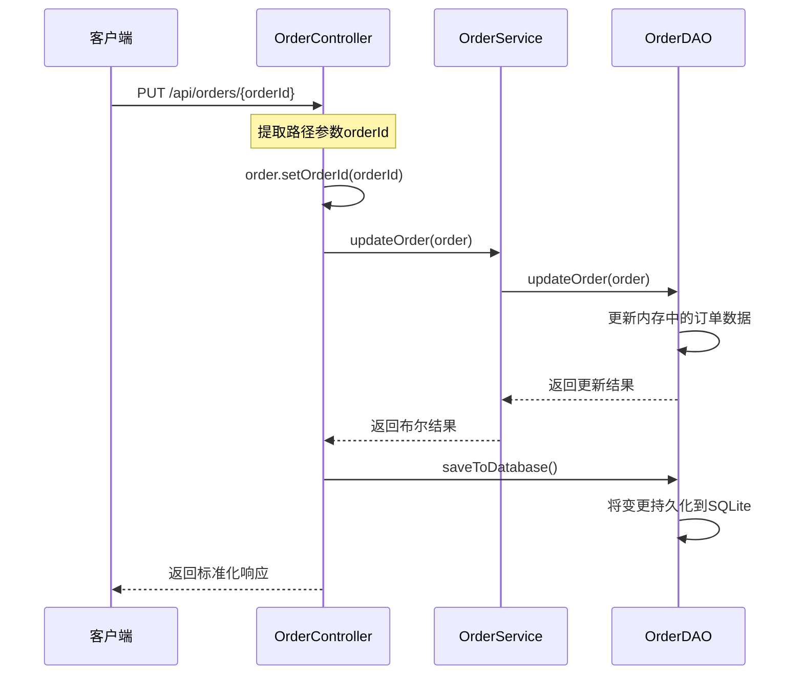
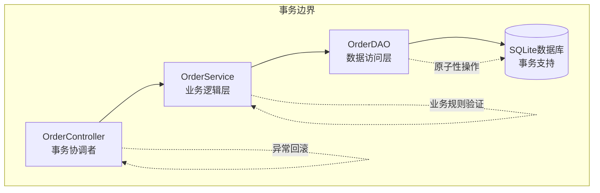
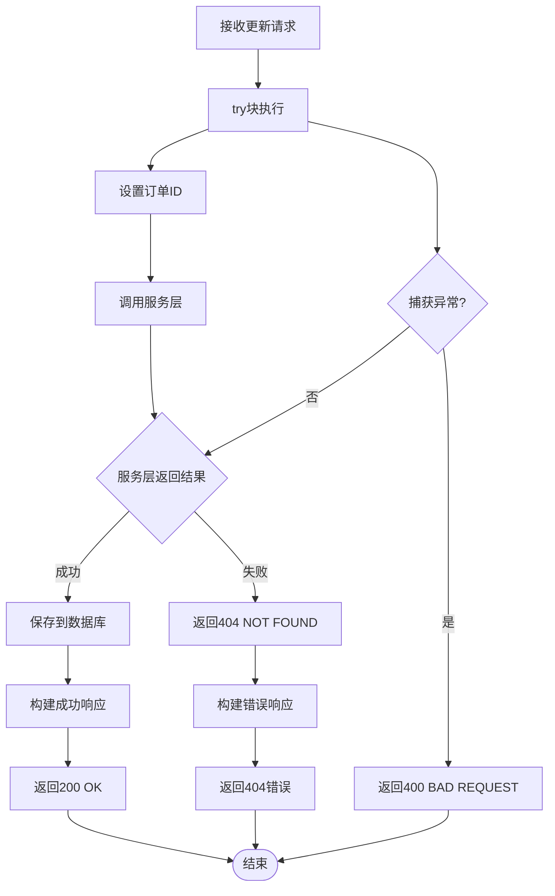
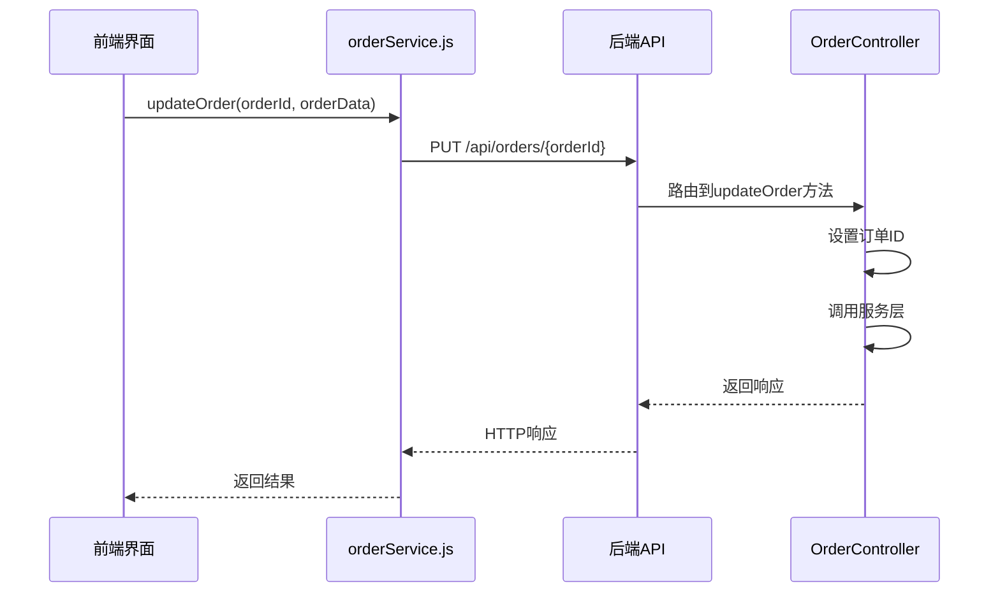
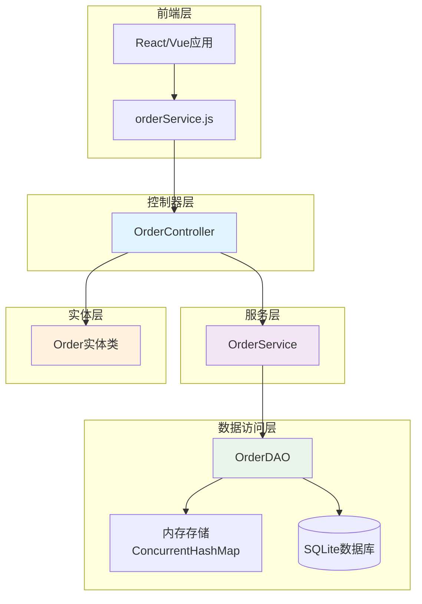
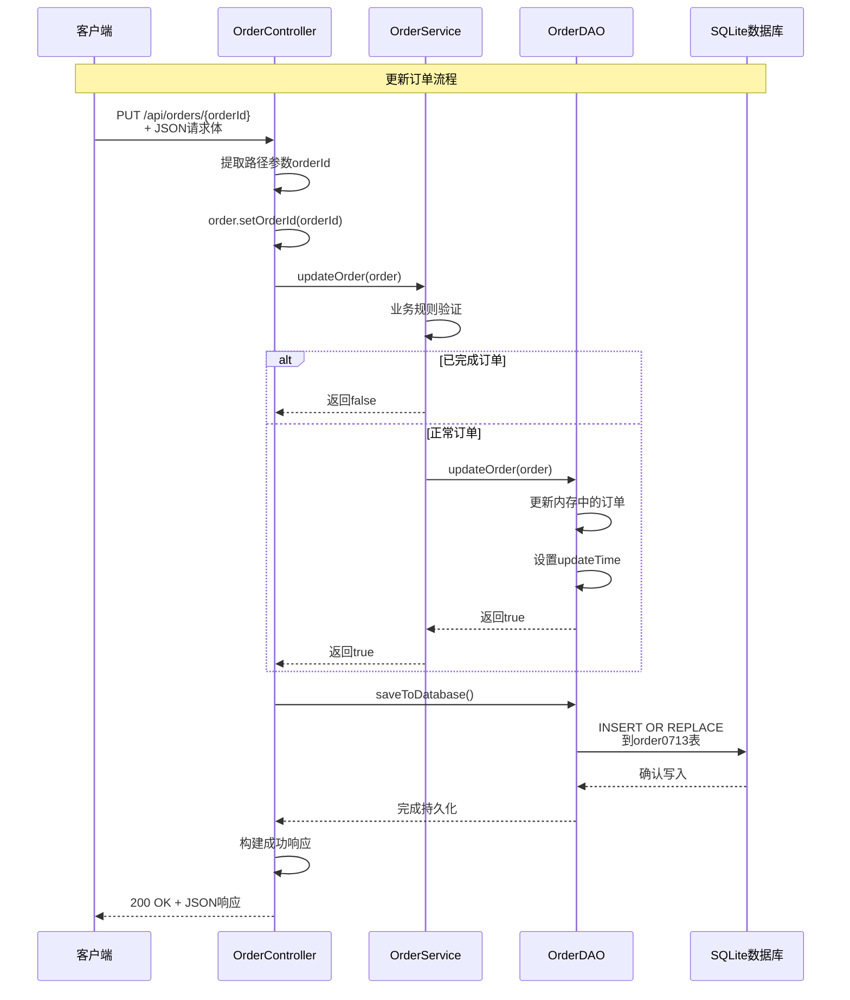

# 更新订单接口

<cite>
**本文档引用的文件**
- [OrderController.java](file://src/main/java/com/example/demo/controller/OrderController.java)
- [OrderService.java](file://src/main/java/com/example/demo/service/OrderService.java)
- [Order.java](file://src/main/java/com/example/demo/entity/Order.java)
- [OrderDAO.java](file://src/main/java/com/example/demo/dao/OrderDAO.java)
- [orderService.js](file://frontend/src/services/orderService.js)
- [OrderControllerIT.java](file://src/test/java/com/example/demo/controller/OrderControllerIT.java)
</cite>

## 目录
1. [概述](#概述)
2. [接口定义](#接口定义)
3. [核心实现机制](#核心实现机制)
4. [路径参数与请求体协同](#路径参数与请求体协同)
5. [事务性考量](#事务性考量)
6. [错误处理逻辑](#错误处理逻辑)
7. [HTTP请求示例](#http请求示例)
8. [前端集成](#前端集成)
9. [架构图](#架构图)
10. [最佳实践](#最佳实践)

## 概述

OrderController中的`@PutMapping("/{orderId}")`方法是订单管理系统的核心更新接口，负责处理订单信息的修改操作。该接口采用RESTful设计原则，通过路径参数传递订单ID，同时接收完整的订单对象作为请求体，实现了资源定位与数据更新的完美结合。

## 接口定义

### 方法签名

```java
@PutMapping("/{orderId}")
public ResponseEntity<Map<String, Object>> updateOrder(
        @PathVariable String orderId,
        @RequestBody Order order)
```

### URL模式
- **基础路径**: `/api/orders`
- **完整URL**: `{baseUrl}/api/orders/{orderId}`
- **HTTP方法**: `PUT`

### 请求参数

| 参数类型 | 名称 | 类型 | 必需 | 描述 |
|---------|------|------|------|------|
| 路径参数 | orderId | String | 是 | 订单唯一标识符 |
| 请求体 | Order对象 | Order | 是 | 包含更新后订单信息的对象 |

## 核心实现机制

### 方法执行流程



**图表来源**
- [OrderController.java](file://src/main/java/com/example/demo/controller/OrderController.java#L114-L141)

### 关键实现步骤

1. **路径参数提取**: 从URL路径中提取订单ID
2. **数据绑定**: 将请求体中的Order对象与路径ID建立关联
3. **业务验证**: 调用服务层进行业务规则校验
4. **数据持久化**: 将内存中的变更同步到数据库
5. **响应构建**: 构建标准化的JSON响应格式

**章节来源**
- [OrderController.java](file://src/main/java/com/example/demo/controller/OrderController.java#L114-L141)

## 路径参数与请求体协同

### 数据绑定机制



**图表来源**
- [OrderController.java](file://src/main/java/com/example/demo/controller/OrderController.java#L123-L124)
- [OrderDAO.java](file://src/main/java/com/example/demo/dao/OrderDAO.java#L191-L199)

### 协同工作原理

路径参数与请求体的协同使用体现了RESTful API设计的最佳实践：

1. **资源定位**: 路径参数明确指定要更新的资源
2. **数据完整性**: 请求体包含完整的订单信息
3. **一致性保证**: 通过`order.setOrderId(orderId)`确保数据一致性

**章节来源**
- [OrderController.java](file://src/main/java/com/example/demo/controller/OrderController.java#L123-L124)

## 事务性考量

### 事务边界设计



**图表来源**
- [OrderController.java](file://src/main/java/com/example/demo/controller/OrderController.java#L125-L127)
- [OrderDAO.java](file://src/main/java/com/example/demo/dao/OrderDAO.java#L51-L78)

### 事务特性

1. **原子性**: 整个更新过程要么全部成功，要么全部失败
2. **一致性**: 通过业务规则验证确保数据一致性
3. **隔离性**: 并发更新时的数据保护
4. **持久性**: 通过`saveToDatabase()`确保数据持久化

### 事务控制点

- **服务层验证**: 在`OrderService.updateOrder()`中进行业务规则校验
- **DAO层操作**: 在`OrderDAO.updateOrder()`中执行数据更新
- **持久化提交**: 在`OrderDAO.saveToDatabase()`中提交事务

**章节来源**
- [OrderController.java](file://src/main/java/com/example/demo/controller/OrderController.java#L125-L127)
- [OrderService.java](file://src/main/java/com/example/demo/service/OrderService.java#L63-L73)

## 错误处理逻辑

### 错误响应机制



**图表来源**
- [OrderController.java](file://src/main/java/com/example/demo/controller/OrderController.java#L122-L139)

### 错误类型与状态码

| 错误场景 | HTTP状态码 | 错误消息 | 处理策略 |
|---------|-----------|----------|----------|
| 订单不存在 | 404 | "订单不存在或无法更新" | 返回未找到错误 |
| 业务规则违反 | 400 | "更新失败: {具体原因}" | 返回客户端错误 |
| 数据库异常 | 400 | "更新失败: {异常信息}" | 返回服务器内部错误 |

### 业务规则约束

1. **已完成订单不可修改**: 状态为3的订单不能被更新
2. **订单存在性检查**: 只能更新已存在的订单
3. **数据完整性验证**: 确保请求体中的数据符合业务规则

**章节来源**
- [OrderController.java](file://src/main/java/com/example/demo/controller/OrderController.java#L128-L134)
- [OrderService.java](file://src/main/java/com/example/demo/service/OrderService.java#L65-L73)

## HTTP请求示例

### 成功更新请求

```http
PUT /api/orders/ORD123456 HTTP/1.1
Host: localhost:9090
Content-Type: application/json
Authorization: Bearer <token>

{
  "userId": "USER001",
  "productId": "PROD123",
  "quantity": 5,
  "totalAmount": 299.99,
  "status": 1,
  "description": "批量采购订单",
  "createTime": "2024-01-15T10:30:00",
  "payTime": "2024-01-15T11:00:00",
  "updateTime": "2024-01-15T11:30:00"
}
```

### 请求头要求

| Header | 值 | 必需 | 描述 |
|--------|---|------|------|
| Content-Type | application/json | 是 | 指定请求体为JSON格式 |
| Authorization | Bearer <token> | 否 | 可选的身份验证令牌 |

### 请求体结构

基于Order实体类的完整JSON结构：

```json
{
  "orderId": "ORD123456",
  "userId": "USER001",
  "productId": "PROD123",
  "quantity": 5,
  "totalAmount": 299.99,
  "status": 1,
  "description": "批量采购订单",
  "createTime": "2024-01-15T10:30:00",
  "payTime": "2024-01-15T11:00:00",
  "updateTime": "2024-01-15T11:30:00"
}
```

### 成功响应示例

```http
HTTP/1.1 200 OK
Content-Type: application/json

{
  "success": true,
  "message": "订单更新成功",
  "data": {
    "orderId": "ORD123456",
    "userId": "USER001",
    "productId": "PROD123",
    "quantity": 5,
    "totalAmount": 299.99,
    "status": 1,
    "description": "批量采购订单",
    "createTime": "2024-01-15T10:30:00",
    "payTime": "2024-01-15T11:00:00",
    "updateTime": "2024-01-15T11:30:00"
  }
}
```

### 错误响应示例

#### 订单不存在

```http
HTTP/1.1 404 Not Found
Content-Type: application/json

{
  "success": false,
  "message": "订单不存在或无法更新",
  "data": null
}
```

#### 业务规则违反

```http
HTTP/1.1 400 Bad Request
Content-Type: application/json

{
  "success": false,
  "message": "更新失败: 已完成订单不能修改",
  "data": null
}
```

## 前端集成

### 前端服务方法

前端通过`orderService.js`中的`updateOrder`方法调用此接口：

```javascript
// 前端调用示例
const updateOrder = async (orderId, orderData) => {
  try {
    const response = await api.put(`/orders/${orderId}`, orderData);
    return response.data;
  } catch (error) {
    console.error('更新订单失败:', error);
    throw error;
  }
};
```

**章节来源**
- [orderService.js](file://frontend/src/services/orderService.js#L34-L36)

### 前端集成流程



**图表来源**
- [orderService.js](file://frontend/src/services/orderService.js#L34-L36)
- [OrderController.java](file://src/main/java/com/example/demo/controller/OrderController.java#L117-L141)

### 前端最佳实践

1. **数据验证**: 在发送请求前验证订单数据的完整性
2. **错误处理**: 实现完善的错误处理机制
3. **用户体验**: 提供更新进度反馈
4. **数据同步**: 更新成功后刷新相关数据

**章节来源**
- [orderService.js](file://frontend/src/services/orderService.js#L34-L36)

## 架构图

### 系统架构概览



**图表来源**
- [OrderController.java](file://src/main/java/com/example/demo/controller/OrderController.java#L1-L30)
- [OrderService.java](file://src/main/java/com/example/demo/service/OrderService.java#L1-L30)
- [OrderDAO.java](file://src/main/java/com/example/demo/dao/OrderDAO.java#L1-L50)

### 更新流程详细图



**图表来源**
- [OrderController.java](file://src/main/java/com/example/demo/controller/OrderController.java#L117-L141)
- [OrderService.java](file://src/main/java/com/example/demo/service/OrderService.java#L63-L73)
- [OrderDAO.java](file://src/main/java/com/example/demo/dao/OrderDAO.java#L191-L199)

## 最佳实践

### 开发建议

1. **数据一致性**: 始终通过`order.setOrderId(orderId)`确保路径ID与请求体一致
2. **业务规则**: 在服务层实现复杂的业务逻辑验证
3. **异常处理**: 实现分层的异常处理机制
4. **性能优化**: 合理使用内存缓存减少数据库访问

### 安全考虑

1. **输入验证**: 对所有输入参数进行严格验证
2. **权限控制**: 实现适当的访问控制机制
3. **审计日志**: 记录重要的更新操作

### 测试策略

1. **单元测试**: 测试控制器、服务层和DAO层的独立功能
2. **集成测试**: 验证整个更新流程的正确性
3. **端到端测试**: 模拟真实用户场景的完整测试

**章节来源**
- [OrderController.java](file://src/main/java/com/example/demo/controller/OrderController.java#L123-L124)
- [OrderService.java](file://src/main/java/com/example/demo/service/OrderService.java#L65-L73)
- [OrderDAO.java](file://src/main/java/com/example/demo/dao/OrderDAO.java#L191-L199)