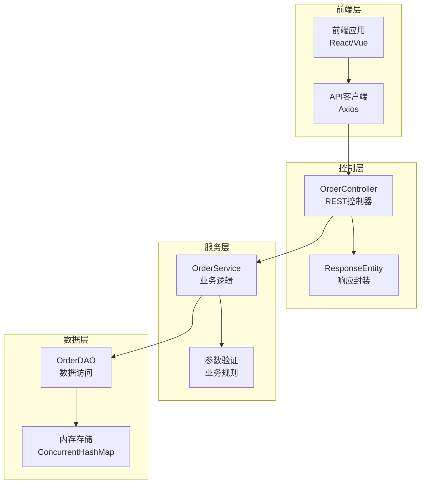
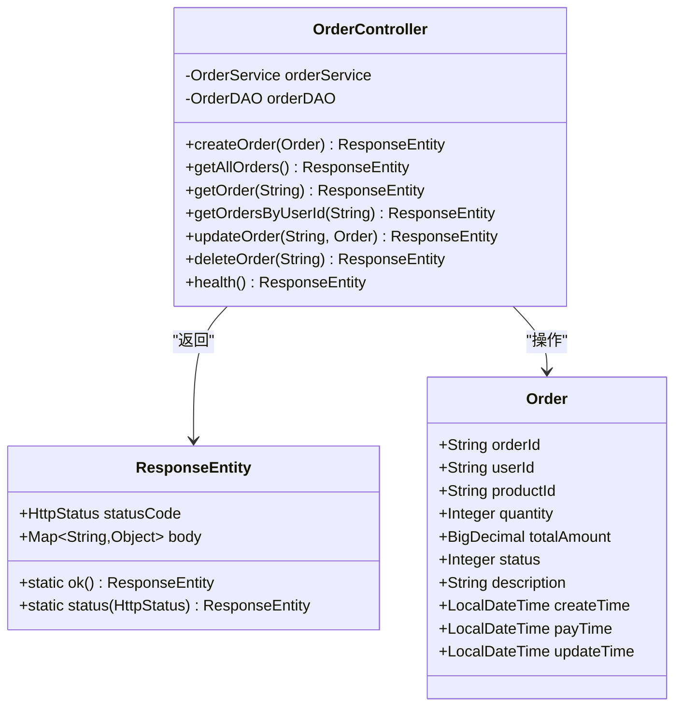
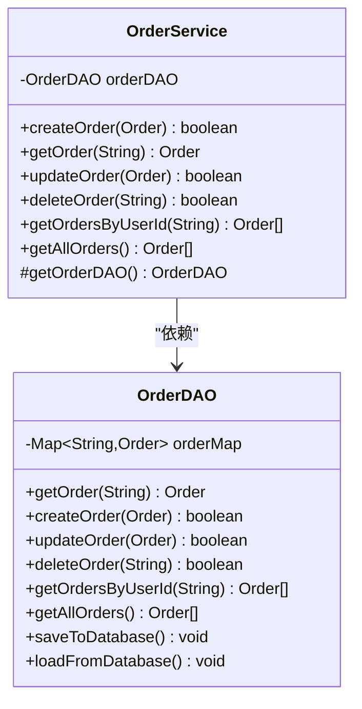
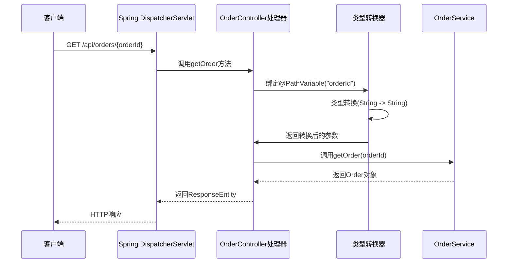
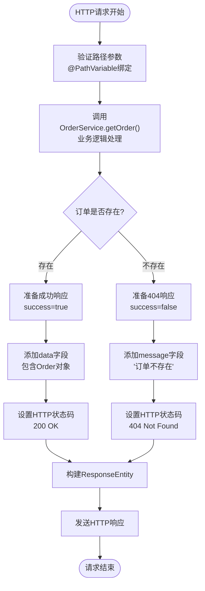
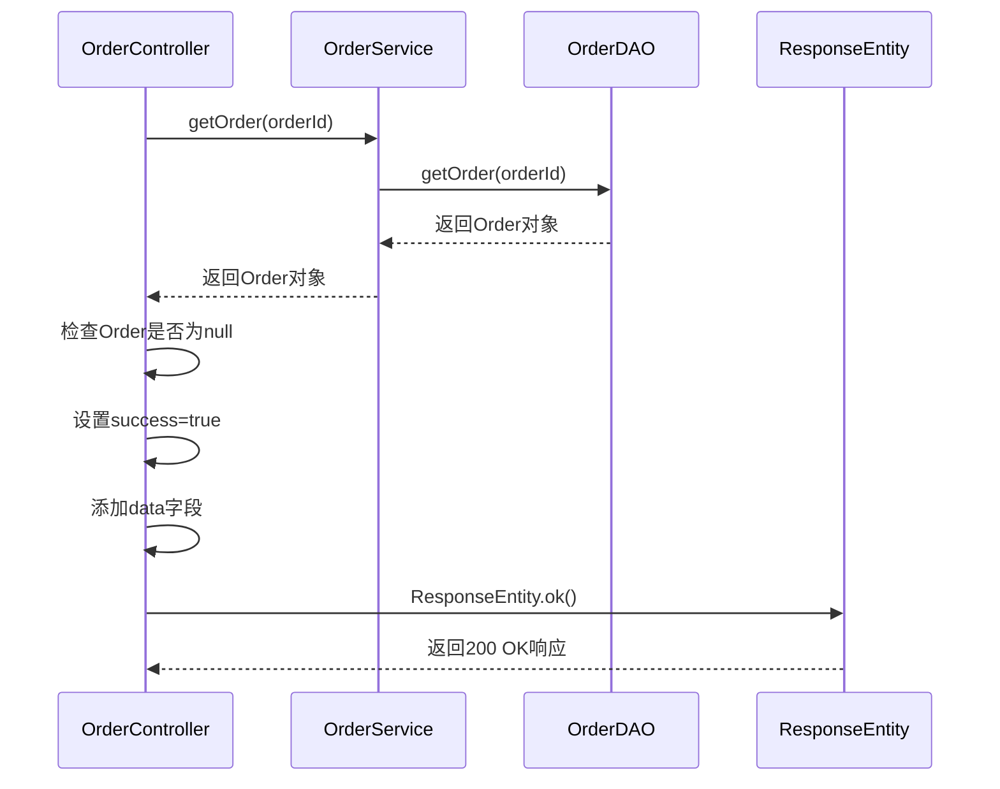
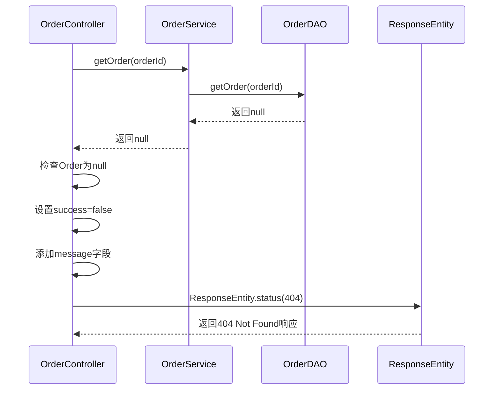
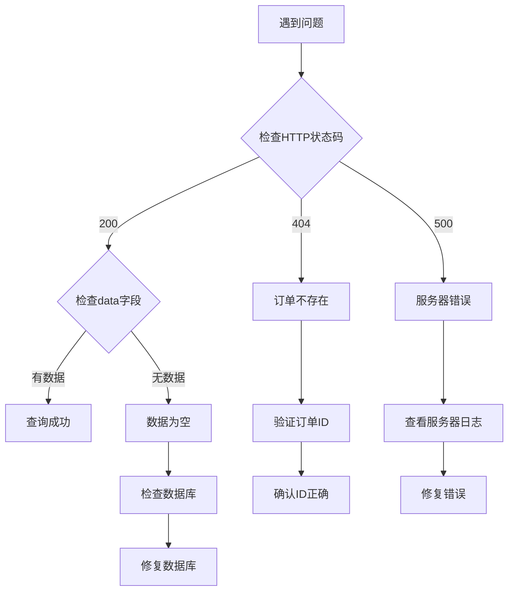
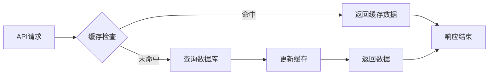

# 查询单个订单接口深度分析文档

<cite>
**本文档引用的文件**
- [OrderController.java](file://src/main/java/com/example/demo/controller/OrderController.java)
- [OrderService.java](file://src/main/java/com/example/demo/service/OrderService.java)
- [Order.java](file://src/main/java/com/example/demo/entity/Order.java)
- [OrderDAO.java](file://src/main/java/com/example/demo/dao/OrderDAO.java)
- [OrderControllerIT.java](file://src/test/java/com/example/demo/controller/OrderControllerIT.java)
- [orderService.js](file://frontend/src/services/orderService.js)
- [application.properties](file://src/main/resources/application.properties)
- [WebConfig.java](file://src/main/java/com/example/demo/config/WebConfig.java)
- [API1111.md](file://API1111.md)
</cite>

## 目录
1. [概述](#概述)
2. [系统架构](#系统架构)
3. [核心组件分析](#核心组件分析)
4. [路径变量绑定机制](#路径变量绑定机制)
5. [业务逻辑调用链路](#业务逻辑调用链路)
6. [响应处理策略](#响应处理策略)
7. [JSON响应结构分析](#json响应结构分析)
8. [API调用示例](#api调用示例)
9. [错误排查指南](#错误排查指南)
10. [性能优化建议](#性能优化建议)

## 概述

本文档深入分析Spring Boot应用中查询单个订单的REST API接口实现，重点关注`OrderController`类中`@GetMapping("/{orderId}")`方法的完整实现流程。该接口采用标准的RESTful设计模式，通过路径变量接收订单ID参数，经过多层业务逻辑处理后返回标准化的JSON响应。

## 系统架构

系统采用经典的三层架构模式，包含控制器层、服务层和数据访问层：



**图表来源**
- [OrderController.java](file://src/main/java/com/example/demo/controller/OrderController.java#L1-L173)
- [OrderService.java](file://src/main/java/com/example/demo/service/OrderService.java#L1-L114)
- [OrderDAO.java](file://src/main/java/com/example/demo/dao/OrderDAO.java#L1-L248)

**章节来源**
- [OrderController.java](file://src/main/java/com/example/demo/controller/OrderController.java#L1-L173)
- [OrderService.java](file://src/main/java/com/example/demo/service/OrderService.java#L1-L114)
- [OrderDAO.java](file://src/main/java/com/example/demo/dao/OrderDAO.java#L1-L248)

## 核心组件分析

### OrderController控制器

`OrderController`是订单管理API的主要入口点，负责处理HTTP请求并返回标准化响应：



**图表来源**
- [OrderController.java](file://src/main/java/com/example/demo/controller/OrderController.java#L21-L30)
- [Order.java](file://src/main/java/com/example/demo/entity/Order.java#L1-L162)

### OrderService业务服务

`OrderService`封装了订单查询的核心业务逻辑，提供类型安全的订单检索功能：



**图表来源**
- [OrderService.java](file://src/main/java/com/example/demo/service/OrderService.java#L15-L21)
- [OrderDAO.java](file://src/main/java/com/example/demo/dao/OrderDAO.java#L19-L21)

**章节来源**
- [OrderController.java](file://src/main/java/com/example/demo/controller/OrderController.java#L21-L30)
- [OrderService.java](file://src/main/java/com/example/demo/service/OrderService.java#L15-L21)
- [OrderDAO.java](file://src/main/java/com/example/demo/dao/OrderDAO.java#L19-L21)

## 路径变量绑定机制

### @PathVariable注解的工作原理

在`OrderController`中，`@GetMapping("/{orderId}")`方法使用`@PathVariable`注解将URL路径中的变量绑定到方法参数：



**图表来源**
- [OrderController.java](file://src/main/java/com/example/demo/controller/OrderController.java#L80-L81)

### 类型转换过程

Spring框架的类型转换机制确保路径变量能够正确转换为目标类型：

1. **路径解析阶段**：Spring MVC解析URL路径，提取`{orderId}`变量
2. **类型匹配阶段**：确定目标参数类型为`String`（OrderController中明确指定）
3. **转换执行阶段**：直接使用原始字符串值，无需额外转换
4. **参数注入阶段**：将转换后的值注入到方法参数

**章节来源**
- [OrderController.java](file://src/main/java/com/example/demo/controller/OrderController.java#L80-L81)

## 业务逻辑调用链路

### 完整调用流程

查询单个订单的业务逻辑遵循严格的分层架构原则：



**图表来源**
- [OrderController.java](file://src/main/java/com/example/demo/controller/OrderController.java#L81-L92)
- [OrderService.java](file://src/main/java/com/example/demo/service/OrderService.java#L45-L47)
- [OrderDAO.java](file://src/main/java/com/example/demo/dao/OrderDAO.java#L182-L184)

### 方法调用层次

具体的调用链路如下：

1. **控制器层**：`OrderController.getOrder(@PathVariable String orderId)`
2. **服务层**：`OrderService.getOrder(String orderId)`
3. **数据访问层**：`OrderDAO.getOrder(String orderId)`

每个层次都有明确的职责分工：
- **控制器层**：处理HTTP请求和响应，进行基本的参数验证
- **服务层**：实现业务逻辑，可能包含复杂的业务规则
- **数据访问层**：负责数据的持久化操作

**章节来源**
- [OrderController.java](file://src/main/java/com/example/demo/controller/OrderController.java#L81-L92)
- [OrderService.java](file://src/main/java/com/example/demo/service/OrderService.java#L45-L47)
- [OrderDAO.java](file://src/main/java/com/example/demo/dao/OrderDAO.java#L182-L184)

## 响应处理策略

### 成功场景处理

当订单查询成功时，系统采用以下响应策略：



**图表来源**
- [OrderController.java](file://src/main/java/com/example/demo/controller/OrderController.java#L83-L88)

### 失败场景处理

当订单不存在时，系统返回适当的错误响应：



**图表来源**
- [OrderController.java](file://src/main/java/com/example/demo/controller/OrderController.java#L89-L92)

### HTTP状态码映射

系统根据业务逻辑结果选择合适的HTTP状态码：

| 业务逻辑结果 | HTTP状态码 | success字段 | message字段 |
|-------------|-----------|------------|------------|
| 订单存在且成功查询 | 200 OK | true | null |
| 订单不存在 | 404 Not Found | false | "订单不存在" |
| 系统异常 | 500 Internal Server Error | false | 异常信息 |

**章节来源**
- [OrderController.java](file://src/main/java/com/example/demo/controller/OrderController.java#L83-L92)

## JSON响应结构分析

### 标准响应格式

系统采用统一的JSON响应格式，包含三个核心字段：

```json
{
  "success": true,
  "data": {
    "orderId": "订单ID",
    "userId": "用户ID",
    "productId": "商品ID",
    "quantity": 1,
    "totalAmount": 99.99,
    "status": 0,
    "description": "订单描述",
    "createTime": "2025-11-11T10:00:00",
    "payTime": null,
    "updateTime": "2025-11-11T10:00:00"
  },
  "message": null
}
```

### 字段详细说明

| 字段名 | 类型 | 必填 | 描述 |
|-------|------|------|------|
| success | boolean | 是 | 操作是否成功的标志 |
| data | object/array | 否 | 实际的业务数据，成功时必填 |
| message | string | 否 | 错误信息或提示信息 |

### 成功响应示例

当查询到有效订单时的响应：

```json
{
  "success": true,
  "data": {
    "orderId": "ORD-20231111-001",
    "userId": "USER-20231111-001",
    "productId": "PROD-20231111-001",
    "quantity": 2,
    "totalAmount": 318.00,
    "status": 1,
    "description": "双十一促销订单",
    "createTime": "2023-11-11T10:00:00",
    "payTime": "2023-11-11T10:05:30",
    "updateTime": "2023-11-11T10:05:30"
  },
  "message": null
}
```

### 失败响应示例

当订单不存在时的响应：

```json
{
  "success": false,
  "data": null,
  "message": "订单不存在"
}
```

**章节来源**
- [OrderController.java](file://src/main/java/com/example/demo/controller/OrderController.java#L83-L92)
- [API1111.md](file://API1111.md#L372-L422)

## API调用示例

### 前端JavaScript调用

前端通过`orderService.js`提供的API接口进行调用：

```javascript
// 获取单个订单详情
orderService.getOrder('ORD-20231111-001')
  .then(response => {
    if (response.data.success) {
      console.log('订单信息:', response.data.data);
    } else {
      console.error('错误:', response.data.message);
    }
  })
  .catch(error => {
    console.error('网络错误:', error);
  });
```

### 原生HTTP请求示例

```bash
# 成功查询现有订单
curl -X GET "http://localhost:9090/api/orders/ORD-20231111-001" \
  -H "Content-Type: application/json"

# 查询不存在的订单
curl -X GET "http://localhost:9090/api/orders/NONEXISTENT-ID" \
  -H "Content-Type: application/json"
```

### Postman测试请求

```http
GET /api/orders/ORD-20231111-001
Host: localhost:9090
Content-Type: application/json
```

**章节来源**
- [orderService.js](file://frontend/src/services/orderService.js#L18-L21)
- [OrderControllerIT.java](file://src/test/java/com/example/demo/controller/OrderControllerIT.java#L127-L160)

## 错误排查指南

### 常见错误类型

#### 1. 无效的订单ID格式

**症状**：服务器返回500内部错误或异常堆栈信息

**原因**：订单ID格式不符合预期，可能是特殊字符或长度问题

**解决方案**：
- 验证订单ID格式是否符合业务规则
- 检查数据库中是否存在该ID的订单记录
- 查看服务器日志获取详细错误信息

#### 2. 订单不存在

**症状**：返回404 Not Found状态码

**原因**：数据库中不存在对应的订单记录

**解决方案**：
- 确认订单ID是否正确
- 检查订单是否已被删除
- 验证订单是否属于当前用户权限范围

#### 3. 数据库连接问题

**症状**：服务器返回500 Internal Server Error

**原因**：OrderDAO无法连接到数据库或查询超时

**解决方案**：
- 检查数据库连接配置
- 验证数据库服务是否正常运行
- 查看数据库连接池状态

### 调试步骤



### 日志分析要点

1. **请求日志**：检查请求路径、参数和时间戳
2. **业务日志**：关注业务逻辑执行情况
3. **异常日志**：分析异常堆栈和错误原因
4. **性能日志**：监控查询响应时间和资源使用

**章节来源**
- [OrderController.java](file://src/main/java/com/example/demo/controller/OrderController.java#L83-L92)
- [OrderDAO.java](file://src/main/java/com/example/demo/dao/OrderDAO.java#L182-L184)

## 性能优化建议

### 缓存策略

对于频繁查询的订单信息，可以考虑引入缓存机制：



### 数据库优化

1. **索引优化**：为`orderId`字段建立主键索引
2. **查询优化**：使用高效的查询语句
3. **连接池配置**：合理配置数据库连接池参数

### 监控指标

建议监控以下关键指标：
- API响应时间
- 请求成功率
- 数据库查询耗时
- 缓存命中率

**章节来源**
- [OrderDAO.java](file://src/main/java/com/example/demo/dao/OrderDAO.java#L182-L184)
- [application.properties](file://src/main/resources/application.properties#L1-L5)

## 总结

查询单个订单接口展现了Spring Boot应用中REST API设计的最佳实践。通过清晰的分层架构、标准化的响应格式和完善的错误处理机制，该接口提供了可靠、易用的数据访问服务。开发者在使用该接口时应注意参数验证、错误处理和性能优化，以确保系统的稳定性和用户体验。