# OrderDAO CRUD操作实现

<cite>
**本文档引用的文件**
- [OrderDAO.java](file://src/main/java/com/example/demo/dao/OrderDAO.java)
- [Order.java](file://src/main/java/com/example/demo/entity/Order.java)
- [OrderService.java](file://src/main/java/com/example/demo/service/OrderService.java)
- [OrderDAOTest.java](file://src/test/java/com/example/demo/dao/OrderDAOTest.java)
- [OrderController.java](file://src/main/java/com/example/demo/controller/OrderController.java)
- [DBUtil.java](file://src/main/java/com/example/demo/dao/DBUtil.java)
</cite>

## 目录
1. [概述](#概述)
2. [系统架构](#系统架构)
3. [核心组件分析](#核心组件分析)
4. [CRUD操作详解](#crud操作详解)
5. [线程安全性保障](#线程安全性保障)
6. [性能优化策略](#性能优化策略)
7. [错误处理机制](#错误处理机制)
8. [测试覆盖分析](#测试覆盖分析)
9. [最佳实践建议](#最佳实践建议)

## 概述

OrderDAO是订单管理系统的核心数据访问对象，采用内存缓存+SQLite持久化的混合存储架构。该实现通过ConcurrentHashMap提供高性能的并发访问能力，同时支持完整的CRUD操作和复杂的查询功能。

### 主要特性

- **线程安全**：基于ConcurrentHashMap实现并发安全的数据访问
- **内存优先**：使用内存Map作为主要存储介质，提供毫秒级响应
- **持久化支持**：通过SQLite数据库实现数据持久化
- **复杂查询**：支持基于用户ID的过滤和时间排序
- **业务规则**：集成订单状态管理和业务约束

## 系统架构

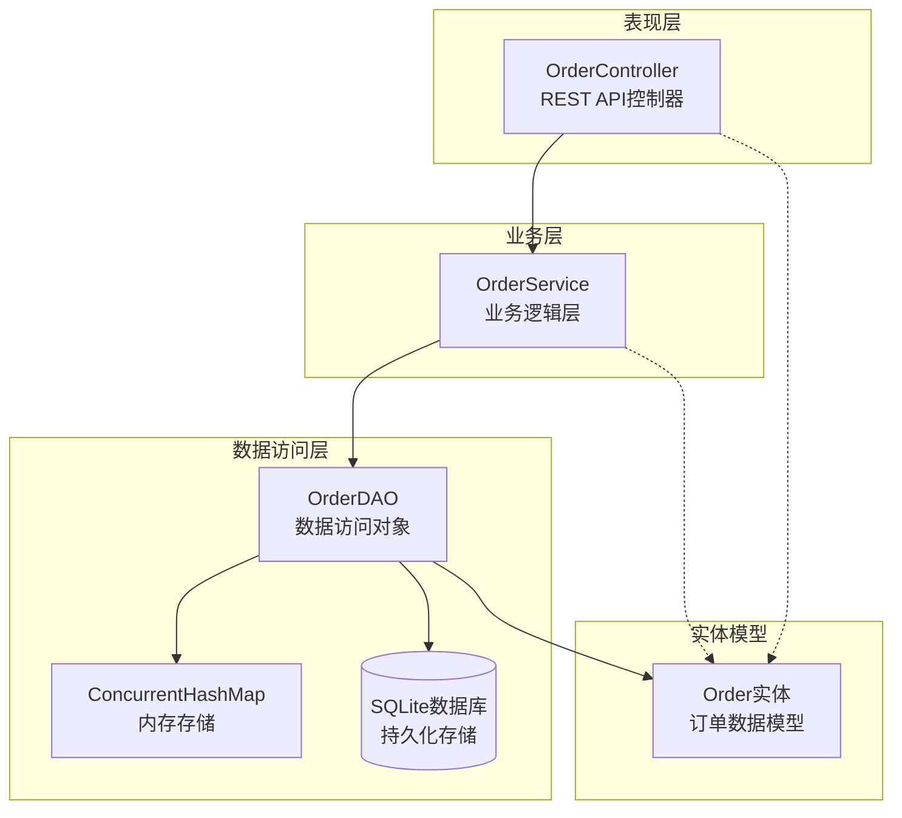

**图表来源**
- [OrderController.java](file://src/main/java/com/example/demo/controller/OrderController.java#L1-L173)
- [OrderService.java](file://src/main/java/com/example/demo/service/OrderService.java#L1-L114)
- [OrderDAO.java](file://src/main/java/com/example/demo/dao/OrderDAO.java#L1-L248)

## 核心组件分析

### Order实体模型

Order实体类定义了订单的核心属性和业务规则：

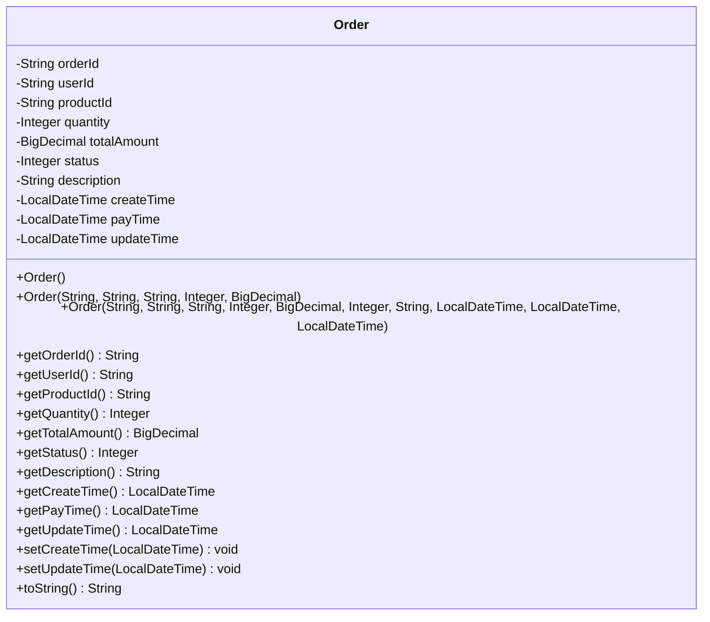

**图表来源**
- [Order.java](file://src/main/java/com/example/demo/entity/Order.java#L1-L162)

### OrderDAO数据访问对象

OrderDAO作为核心的数据访问组件，提供了完整的CRUD操作接口：

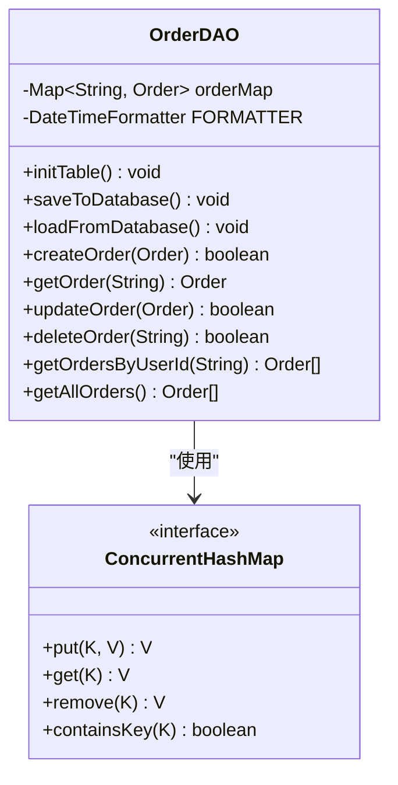

**图表来源**
- [OrderDAO.java](file://src/main/java/com/example/demo/dao/OrderDAO.java#L18-L248)

**节来源**
- [OrderDAO.java](file://src/main/java/com/example/demo/dao/OrderDAO.java#L1-L248)
- [Order.java](file://src/main/java/com/example/demo/entity/Order.java#L1-L162)

## CRUD操作详解

### 创建订单 (createOrder)

createOrder方法实现了订单的创建逻辑，具有以下特点：

#### 订单唯一性保证
- **主键检查**：通过`orderMap.containsKey()`确保订单ID的唯一性
- **幂等性设计**：重复创建相同ID的订单会返回false而不抛出异常
- **自动时间设置**：当`createTime`为null时自动设置当前时间

#### 实现流程图

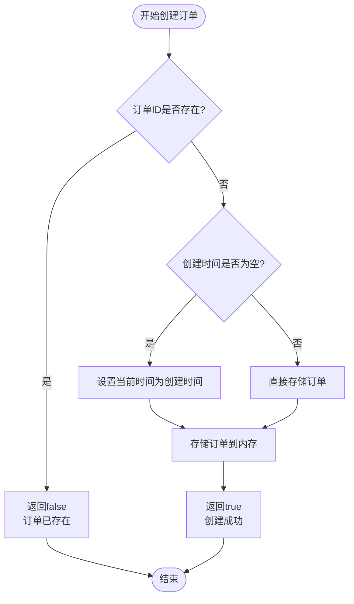

**图表来源**
- [OrderDAO.java](file://src/main/java/com/example/demo/dao/OrderDAO.java#L165-L174)

#### 关键实现细节

| 特性 | 实现方式 | 业务价值 |
|------|----------|----------|
| 唯一性约束 | `containsKey()`检查 | 防止重复订单创建 |
| 自动时间戳 | `LocalDateTime.now()` | 确保时间准确性 |
| 错误处理 | 返回布尔值而非异常 | 提供更好的用户体验 |
| 性能优化 | 内存操作避免IO开销 | 提升响应速度 |

**节来源**
- [OrderDAO.java](file://src/main/java/com/example/demo/dao/OrderDAO.java#L165-L174)

### 获取订单 (getOrder)

getOrder方法基于ConcurrentHashMap提供高效的键值查询：

#### 查询机制
- **直接映射**：通过订单ID直接从ConcurrentHashMap获取
- **O(1)复杂度**：并发哈希表的常数时间查找
- **空值处理**：不存在的订单ID返回null

#### 并发安全保障
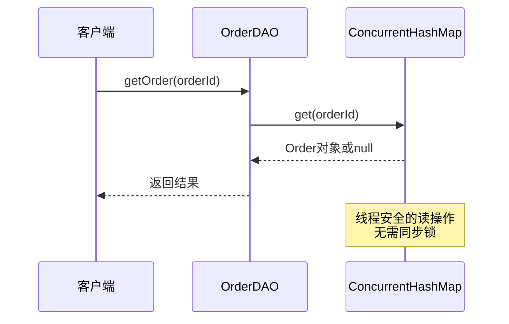

**图表来源**
- [OrderDAO.java](file://src/main/java/com/example/demo/dao/OrderDAO.java#L182-L183)

**节来源**
- [OrderDAO.java](file://src/main/java/com/example/demo/dao/OrderDAO.java#L182-L183)

### 更新订单 (updateOrder)

updateOrder方法实现了订单的更新逻辑，包含自动时间戳刷新：

#### 更新流程
1. **存在性检查**：验证订单是否存在
2. **时间戳更新**：自动设置`updateTime`为当前时间
3. **数据替换**：使用新的订单对象替换旧对象

#### 状态变更控制

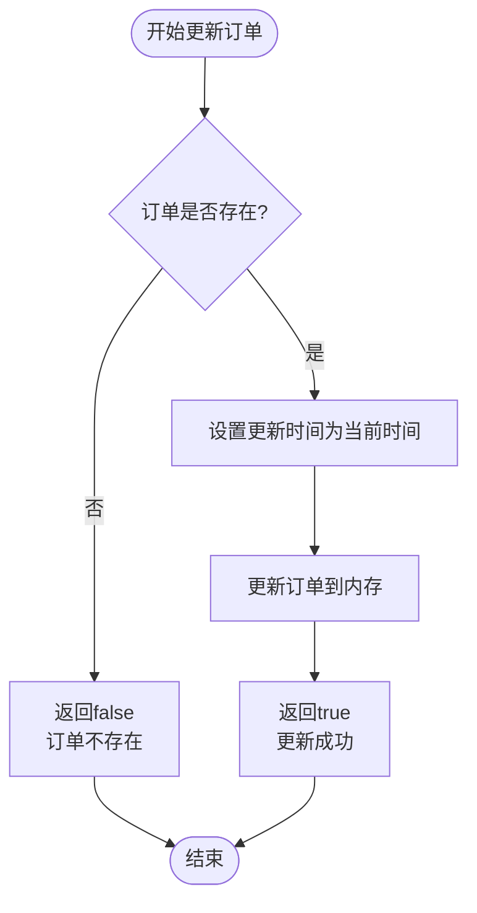

**图表来源**
- [OrderDAO.java](file://src/main/java/com/example/demo/dao/OrderDAO.java#L191-L197)

**节来源**
- [OrderDAO.java](file://src/main/java/com/example/demo/dao/OrderDAO.java#L191-L197)

### 删除订单 (deleteOrder)

deleteOrder方法提供了安全的订单删除功能：

#### 删除策略
- **存在性验证**：确保订单存在才执行删除
- **原子操作**：ConcurrentHashMap的remove操作是原子的
- **不可逆性**：删除后无法恢复

#### 删除条件检查

| 条件 | 检查方式 | 结果 |
|------|----------|------|
| 订单存在 | `containsKey()` | 存在则删除，否则返回false |
| 状态限制 | 业务逻辑检查 | 已支付订单不可删除 |
| 并发安全 | ConcurrentHashMap操作 | 线程安全的删除操作 |

**节来源**
- [OrderDAO.java](file://src/main/java/com/example/demo/dao/OrderDAO.java#L206-L211)

### 查询操作详解

#### 按用户ID查询订单 (getOrdersByUserId)

该方法展示了Java Stream API的强大功能：

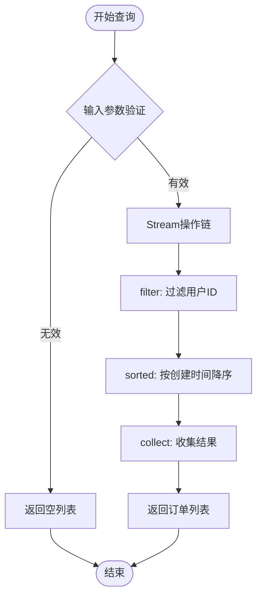

**图表来源**
- [OrderDAO.java](file://src/main/java/com/example/demo/dao/OrderDAO.java#L226-L232)

#### 查询特性分析

| 操作阶段 | 实现方式 | 性能特征 |
|----------|----------|----------|
| 过滤 | `filter(order -> userId.equals(order.getUserId()))` | O(n)遍历，但早期终止 |
| 排序 | `Comparator.comparing(...).reversed()` | O(n log n)时间复杂度 |
| 空值处理 | `Comparator.nullsLast()` | 确保null值排在末尾 |
| 收集 | `Collectors.toList()` | 构建新的列表对象 |

#### 全局订单查询 (getAllOrders)

getAllOrders方法提供系统级别的订单查询：

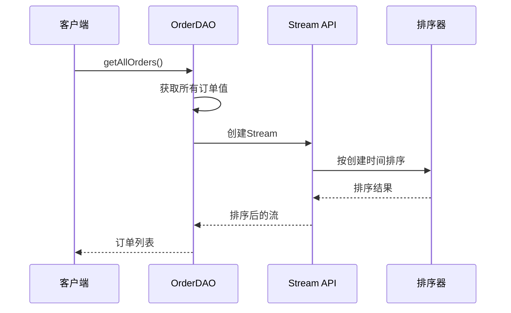

**图表来源**
- [OrderDAO.java](file://src/main/java/com/example/demo/dao/OrderDAO.java#L240-L246)

**节来源**
- [OrderDAO.java](file://src/main/java/com/example/demo/dao/OrderDAO.java#L219-L246)

## 线程安全性保障

### ConcurrentHashMap核心作用

OrderDAO通过ConcurrentHashMap确保所有操作的线程安全性：

#### 并发控制机制

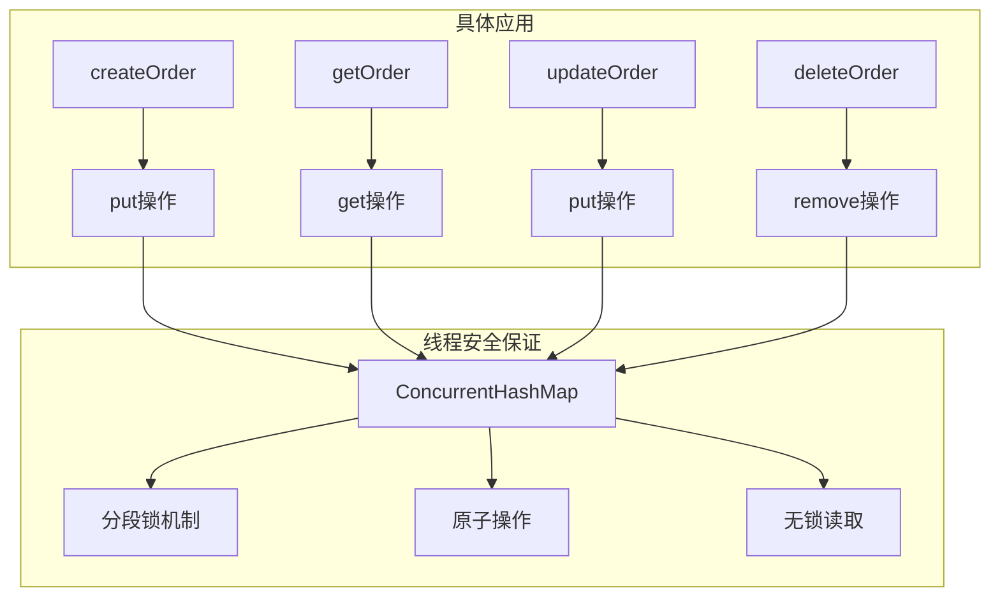

**图表来源**
- [OrderDAO.java](file://src/main/java/com/example/demo/dao/OrderDAO.java#L20)

#### 线程安全特性对比

| 操作类型 | 同步机制 | 并发性能 | 数据一致性 |
|----------|----------|----------|------------|
| 读操作 | 无锁读取 | 高并发性能 | 强一致性 |
| 写操作 | 分段锁 | 中等并发性能 | 弱一致性（最终一致） |
| 批量操作 | 原子操作 | 取决于操作规模 | 最终一致性 |

### 内存与数据库同步

OrderDAO通过以下机制确保内存和数据库的一致性：

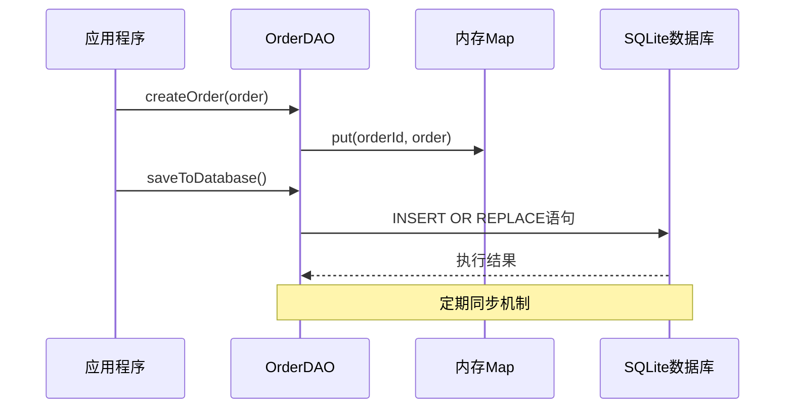

**图表来源**
- [OrderDAO.java](file://src/main/java/com/example/demo/dao/OrderDAO.java#L51-L74)

**节来源**
- [OrderDAO.java](file://src/main/java/com/example/demo/dao/OrderDAO.java#L20-L248)

## 性能优化策略

### 内存优先架构

#### 性能优势分析

| 层级 | 访问方式 | 延迟 | 吞吐量 | 适用场景 |
|------|----------|------|--------|----------|
| 内存 | ConcurrentHashMap | < 1ms | 高 | 频繁查询和更新 |
| 数据库 | SQLite | 1-10ms | 中等 | 持久化存储 |
| 网络 | REST API | 10-50ms | 受限 | 远程调用 |

#### 缓存策略

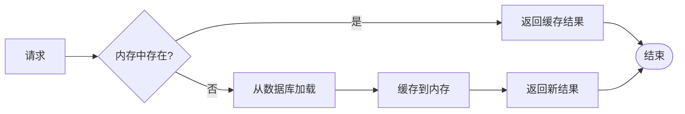

### 查询优化技术

#### Stream API优化

OrderDAO充分利用Java Stream API进行高效查询：

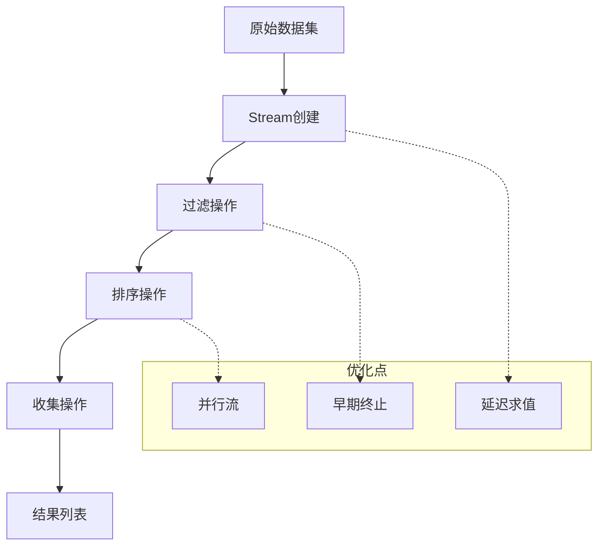

**图表来源**
- [OrderDAO.java](file://src/main/java/com/example/demo/dao/OrderDAO.java#L226-L232)

**节来源**
- [OrderDAO.java](file://src/main/java/com/example/demo/dao/OrderDAO.java#L219-L246)

## 错误处理机制

### 异常处理策略

OrderDAO采用多层次的错误处理机制：

#### 方法级错误处理

| 方法 | 错误类型 | 处理方式 | 返回值 |
|------|----------|----------|--------|
| createOrder | 订单已存在 | 返回false | 布尔值 |
| updateOrder | 订单不存在 | 返回false | 布尔值 |
| deleteOrder | 订单不存在 | 返回false | 布尔值 |
| getOrder | 订单不存在 | 返回null | Order对象 |

#### 数据库异常处理

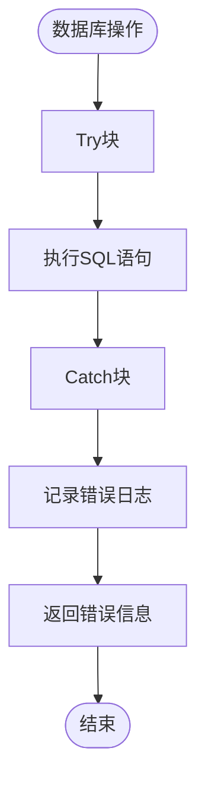

**图表来源**
- [OrderDAO.java](file://src/main/java/com/example/demo/dao/OrderDAO.java#L43-L45)
- [OrderDAO.java](file://src/main/java/com/example/demo/dao/OrderDAO.java#L75-L76)

**节来源**
- [OrderDAO.java](file://src/main/java/com/example/demo/dao/OrderDAO.java#L43-L76)

## 测试覆盖分析

### 单元测试覆盖

OrderDAO的测试覆盖了所有核心功能：

#### 测试分类统计

| 测试类别 | 测试方法 | 覆盖范围 |
|----------|----------|----------|
| 创建操作 | `testCreateOrder_*` | 正常创建、重复创建 |
| 查询操作 | `testGetOrder_*` | 存在和不存在的情况 |
| 更新操作 | `testUpdateOrder_*` | 存在和不存在的情况 |
| 删除操作 | `testDeleteOrder_*` | 存在和不存在的情况 |
| 查询功能 | `testGetOrdersByUserId_*` | 排序、过滤、空值处理 |
| 全局查询 | `testGetAllOrders_*` | 排序和完整性 |

#### 测试数据准备

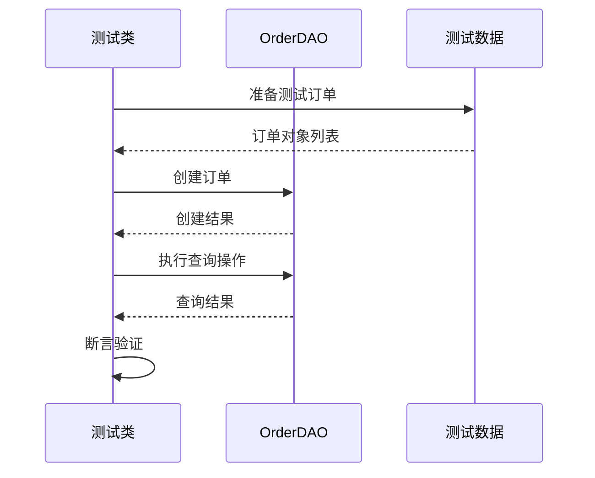

**图表来源**
- [OrderDAOTest.java](file://src/test/java/com/example/demo/dao/OrderDAOTest.java#L26-L238)

**节来源**
- [OrderDAOTest.java](file://src/test/java/com/example/demo/dao/OrderDAOTest.java#L1-L239)

## 最佳实践建议

### 开发建议

#### 1. 订单ID生成策略
- 使用UUID确保唯一性
- 考虑分布式环境下的ID冲突
- 实现ID格式验证

#### 2. 时间戳管理
- 统一使用UTC时间
- 考虑时区转换需求
- 实现时间戳精度控制

#### 3. 并发控制
- 合理使用读写锁
- 避免长时间持有锁
- 实现超时机制

### 性能优化建议

#### 1. 内存管理
- 定期清理过期订单
- 实现LRU缓存策略
- 监控内存使用情况

#### 2. 数据库优化
- 添加适当的索引
- 实现批量操作
- 优化SQL查询语句

#### 3. 网络优化
- 实现请求合并
- 使用连接池
- 添加重试机制

### 监控和维护

#### 关键指标监控
- 内存使用率
- 数据库连接数
- 请求响应时间
- 错误率统计

#### 维护策略
- 定期备份数据
- 监控系统健康状态
- 实现告警机制
- 制定应急预案

**节来源**
- [OrderDAO.java](file://src/main/java/com/example/demo/dao/OrderDAO.java#L1-L248)
- [OrderService.java](file://src/main/java/com/example/demo/service/OrderService.java#L1-L114)
- [OrderController.java](file://src/main/java/com/example/demo/controller/OrderController.java#L1-L173)