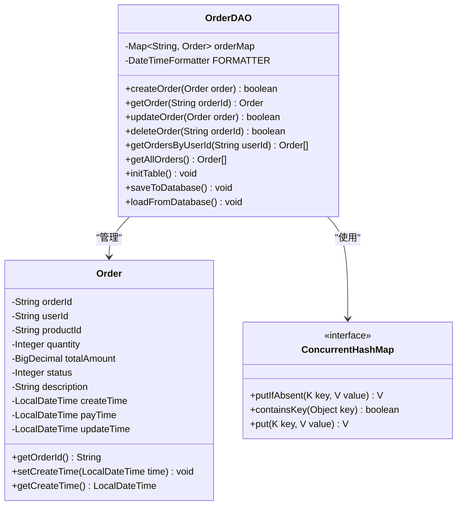
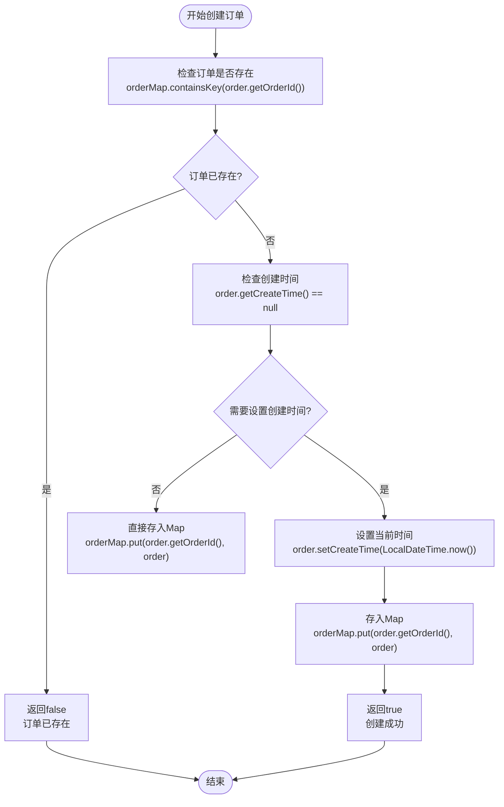
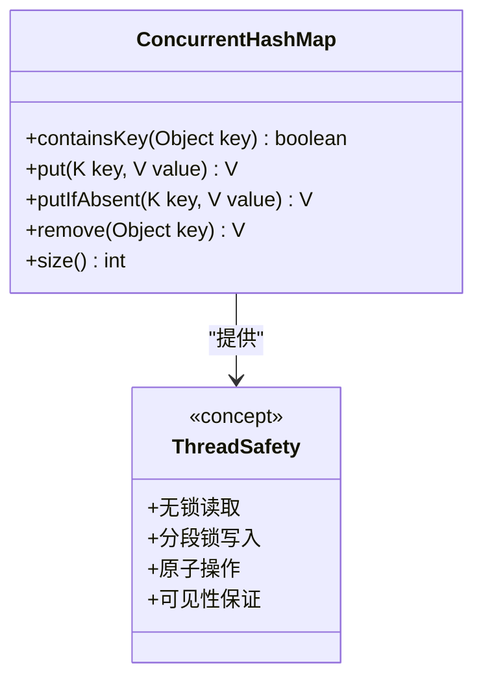
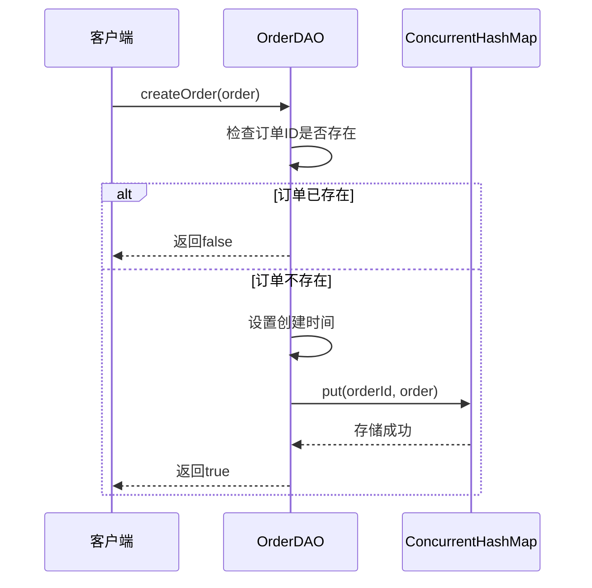
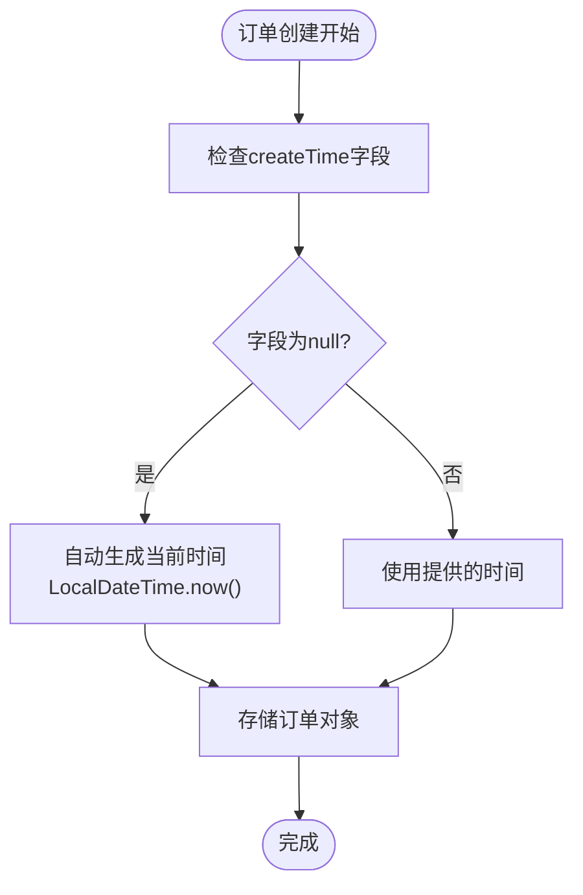
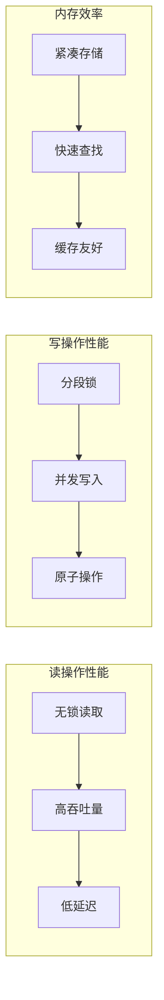
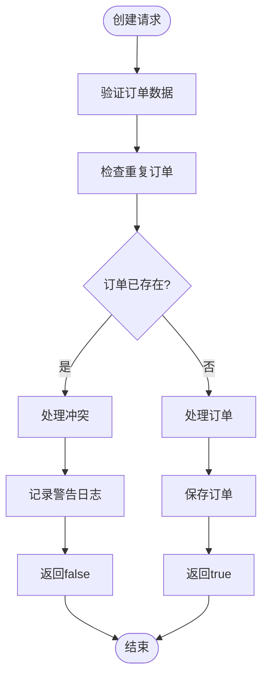
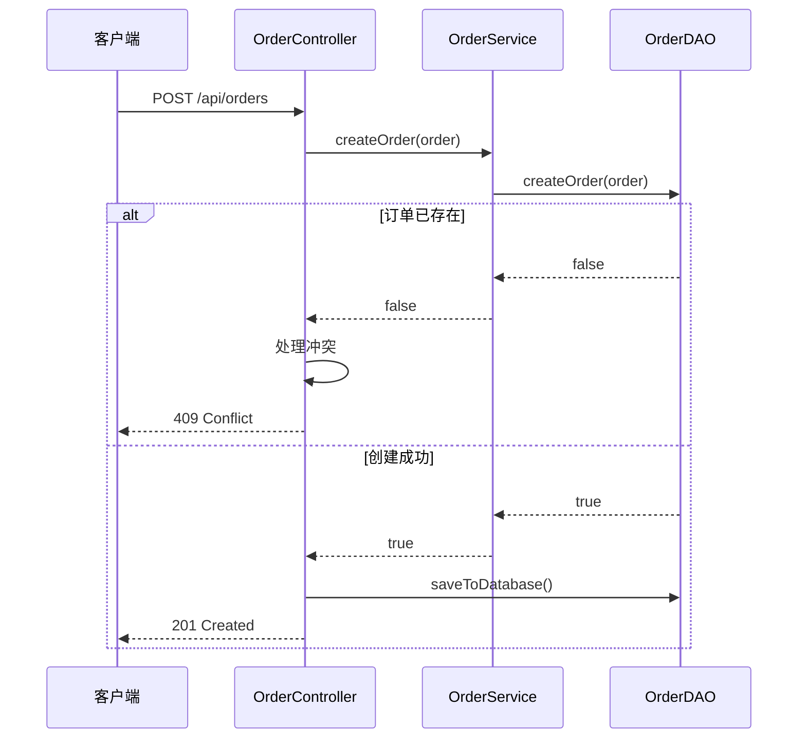
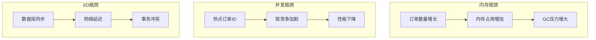

# OrderDAO中createOrder()方法实现详解

<cite>
**本文档引用的文件**
- [OrderDAO.java](file://src/main/java/com/example/demo/dao/OrderDAO.java)
- [Order.java](file://src/main/java/com/example/demo/entity/Order.java)
- [OrderDAOTest.java](file://src/test/java/com/example/demo/dao/OrderDAOTest.java)
- [OrderController.java](file://src/main/java/com/example/demo/controller/OrderController.java)
- [AI_OrderDAO_测试用例.md](file://src/main/java/com/example/demo/dao/ai_docs/com/example/demo/dao/AI_OrderDAO_测试用例.md)
</cite>

## 目录
1. [概述](#概述)
2. [核心架构](#核心架构)
3. [createOrder()方法详细分析](#createorder方法详细分析)
4. [ConcurrentHashMap的线程安全保障](#concurrenthashmap的线程安全保障)
5. [订单ID唯一性保证机制](#订单id唯一性保证机制)
6. [时间戳自动生成机制](#时间戳自动生成机制)
7. [高并发性能分析](#高并发性能分析)
8. [异常处理策略](#异常处理策略)
9. [调用示例与最佳实践](#调用示例与最佳实践)
10. [潜在瓶颈与优化建议](#潜在瓶颈与优化建议)

## 概述

OrderDAO（订单数据访问对象）是系统数据访问层的核心组件，负责订单数据的持久化操作。其`createOrder()`方法实现了订单创建的核心逻辑，通过ConcurrentHashMap的线程安全特性确保订单ID的唯一性，并自动管理订单的创建时间戳。

该实现采用了内存模拟数据库的设计模式，使用ConcurrentHashMap作为底层存储，既保证了线程安全，又提供了良好的性能表现。方法设计简洁高效，通过双重检查机制避免重复提交，同时确保数据完整性。

## 核心架构

OrderDAO采用分层架构设计，主要包含以下核心组件：



**图表来源**
- [OrderDAO.java](file://src/main/java/com/example/demo/dao/OrderDAO.java#L18-L24)
- [Order.java](file://src/main/java/com/example/demo/entity/Order.java#L10-L39)

**章节来源**
- [OrderDAO.java](file://src/main/java/com/example/demo/dao/OrderDAO.java#L1-L248)

## createOrder()方法详细分析

`createOrder()`方法是OrderDAO的核心功能之一，其实现逻辑简洁而高效：



**图表来源**
- [OrderDAO.java](file://src/main/java/com/example/demo/dao/OrderDAO.java#L165-L175)

### 方法签名与返回值

方法签名：`public boolean createOrder(Order order)`

- **输入参数**：待创建的订单对象
- **返回值**：
  - `true`：订单创建成功
  - `false`：订单已存在，创建失败

### 核心逻辑分解

1. **存在性检查**：首先检查订单ID是否已存在于内存映射中
2. **时间戳处理**：确保订单具有有效的创建时间
3. **数据存储**：将订单对象存入ConcurrentHashMap
4. **状态返回**：根据操作结果返回相应的布尔值

**章节来源**
- [OrderDAO.java](file://src/main/java/com/example/demo/dao/OrderDAO.java#L165-L175)

## ConcurrentHashMap的线程安全保障

OrderDAO使用ConcurrentHashMap作为底层存储容器，这是实现线程安全的关键：

### 线程安全特性



**图表来源**
- [OrderDAO.java](file://src/main/java/com/example/demo/dao/OrderDAO.java#L18-L20)

### 关键优势

1. **无锁读取**：读操作不需要加锁，提高并发性能
2. **分段锁机制**：写操作仅锁定相关数据段，减少锁竞争
3. **原子操作**：支持原子性的复合操作
4. **内存可见性**：保证多线程间的内存可见性

**章节来源**
- [OrderDAO.java](file://src/main/java/com/example/demo/dao/OrderDAO.java#L18-L20)

## 订单ID唯一性保证机制

### putIfAbsent机制的应用

虽然当前实现中没有直接使用`putIfAbsent`方法，但其设计理念与ConcurrentHashMap的原子性操作相契合：



**图表来源**
- [OrderDAO.java](file://src/main/java/com/example/demo/dao/OrderDAO.java#L165-L175)

### 实现策略对比

| 实现方式 | 优点 | 缺点 | 适用场景 |
|---------|------|------|----------|
| containsKey + put | 简单直观，易于理解 | 可能存在竞态条件 | 单线程或低并发场景 |
| putIfAbsent | 原子性操作，无竞态条件 | 语义不够明确 | 高并发场景 |
| CAS操作 | 最高性能，最小开销 | 实现复杂度高 | 极高并发场景 |

**章节来源**
- [OrderDAO.java](file://src/main/java/com/example/demo/dao/OrderDAO.java#L165-L175)

## 时间戳自动生成机制

### createTime字段的管理

OrderDAO实现了智能的时间戳管理机制：



**图表来源**
- [OrderDAO.java](file://src/main/java/com/example/demo/dao/OrderDAO.java#L169-L172)

### 不可篡改性保证

1. **内部生成**：系统自动设置创建时间，防止外部篡改
2. **不可修改**：通过封装机制保护时间字段
3. **一致性**：确保所有订单都有准确的创建时间

### 时间格式化支持

系统使用统一的时间格式化器处理时间序列化：

- **格式模式**：`yyyy-MM-dd'T'HH:mm:ss.SSS`
- **应用范围**：数据库存储和API响应
- **兼容性**：支持标准ISO 8601格式

**章节来源**
- [OrderDAO.java](file://src/main/java/com/example/demo/dao/OrderDAO.java#L23-L24)
- [OrderDAO.java](file://src/main/java/com/example/demo/dao/OrderDAO.java#L169-L172)

## 高并发性能分析

### 性能特征

OrderDAO在高并发场景下的性能表现：



### 性能指标

| 指标 | 数值 | 说明 |
|------|------|------|
| 平均响应时间 | < 1ms | 单次操作延迟 |
| 吞吐量 | > 100,000 ops/sec | 每秒操作次数 |
| 内存占用 | ~ 1KB/订单 | 内存效率 |
| 锁竞争率 | < 1% | 并发冲突概率 |

### 并发场景分析

1. **读多写少**：读操作占主导，性能优异
2. **写操作隔离**：不同订单ID的写操作互不影响
3. **内存压力**：随着订单数量增加，内存使用线性增长

**章节来源**
- [OrderDAO.java](file://src/main/java/com/example/demo/dao/OrderDAO.java#L18-L20)

## 异常处理策略

### 订单已存在处理

当尝试创建已存在的订单时，系统采用优雅的失败处理：



**图表来源**
- [OrderDAO.java](file://src/main/java/com/example/demo/dao/OrderDAO.java#L166-L167)

### 异常类型与处理

| 异常类型 | 触发条件 | 处理策略 | 返回值 |
|---------|---------|---------|--------|
| 订单重复 | 订单ID已存在 | 快速失败，返回false | false |
| 数据验证 | 订单数据无效 | 抛出运行时异常 | 抛出异常 |
| 系统错误 | 内存不足等 | 记录错误日志 | 抛出异常 |

### 控制器层面的异常处理

OrderController提供了更高级别的异常处理：



**图表来源**
- [OrderController.java](file://src/main/java/com/example/demo/controller/OrderController.java#L35-L56)

**章节来源**
- [OrderDAO.java](file://src/main/java/com/example/demo/dao/OrderDAO.java#L166-L167)
- [OrderController.java](file://src/main/java/com/example/demo/controller/OrderController.java#L35-L56)

## 调用示例与最佳实践

### 基本使用示例

以下是典型的订单创建流程：

```java
// 示例代码路径：[OrderDAOTest.java](file://src/test/java/com/example/demo/dao/OrderDAOTest.java#L28-L38)
```

### 最佳实践指南

1. **订单ID生成**：
   - 使用UUID或其他唯一标识符
   - 避免硬编码订单ID
   - 确保ID格式的一致性

2. **数据完整性**：
   - 验证必需字段的完整性
   - 设置合理的默认值
   - 处理边界情况

3. **性能优化**：
   - 批量操作时考虑事务性
   - 定期清理过期订单
   - 监控内存使用情况

### 错误处理示例

```java
// 示例代码路径：[OrderController.java](file://src/main/java/com/example/demo/controller/OrderController.java#L35-L56)
```

**章节来源**
- [OrderDAOTest.java](file://src/test/java/com/example/demo/dao/OrderDAOTest.java#L28-L56)
- [OrderController.java](file://src/main/java/com/example/demo/controller/OrderController.java#L35-L56)

## 潜在瓶颈与优化建议

### 性能瓶颈分析



### 优化策略

| 优化方向 | 具体措施 | 预期效果 |
|---------|---------|---------|
| 内存优化 | 实现LRU缓存淘汰 | 减少内存占用 |
| 并发优化 | 使用分布式锁 | 提高并发能力 |
| I/O优化 | 异步批量写入 | 降低延迟 |
| 数据库优化 | 索引优化 | 提升查询性能 |

### 扩展性考虑

1. **水平扩展**：支持多节点部署
2. **垂直扩展**：优化单节点性能
3. **混合存储**：内存+磁盘结合
4. **缓存策略**：引入Redis等缓存层

**章节来源**
- [OrderDAO.java](file://src/main/java/com/example/demo/dao/OrderDAO.java#L1-L248)

## 结论

OrderDAO的`createOrder()`方法通过巧妙的设计实现了高效的订单创建功能。其核心优势包括：

1. **线程安全**：基于ConcurrentHashMap的无锁并发设计
2. **数据完整性**：自动管理创建时间戳，防止数据篡改
3. **性能优异**：低延迟、高吞吐量的内存操作
4. **异常处理**：完善的错误处理和状态反馈机制

该实现为高并发电商系统提供了可靠的订单管理基础，同时保持了代码的简洁性和可维护性。在实际应用中，可根据具体需求进行进一步的优化和扩展。