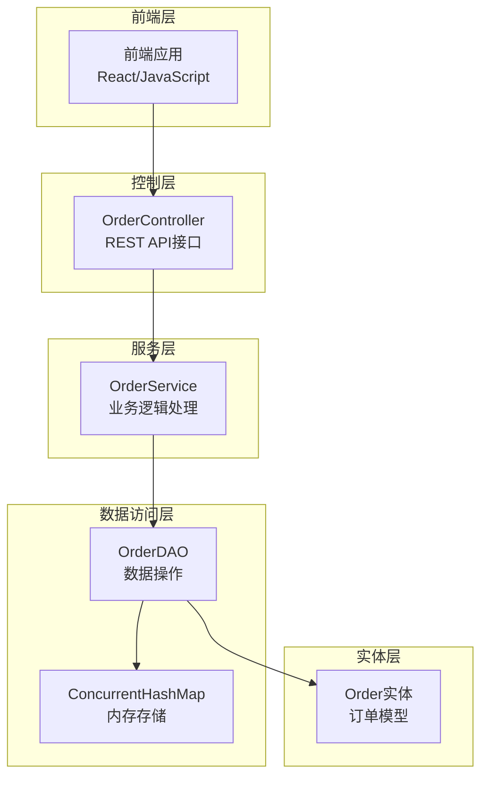
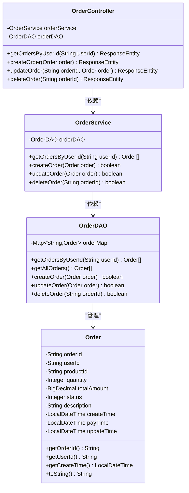
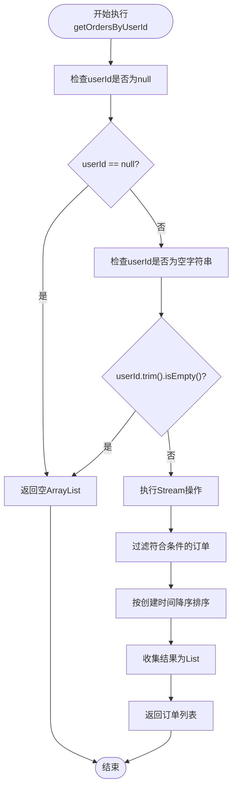
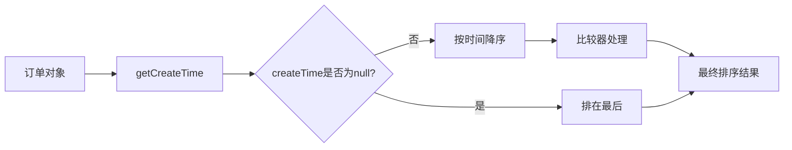
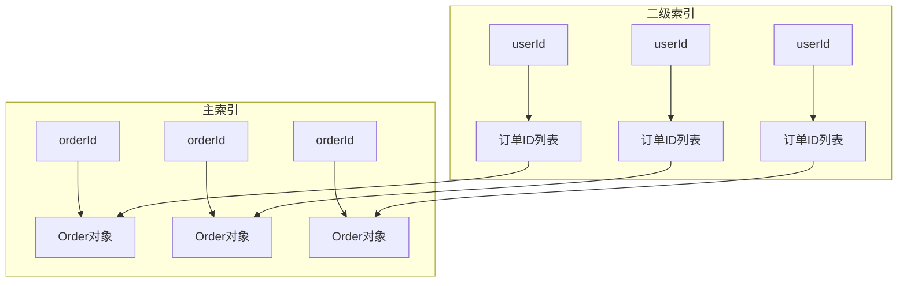
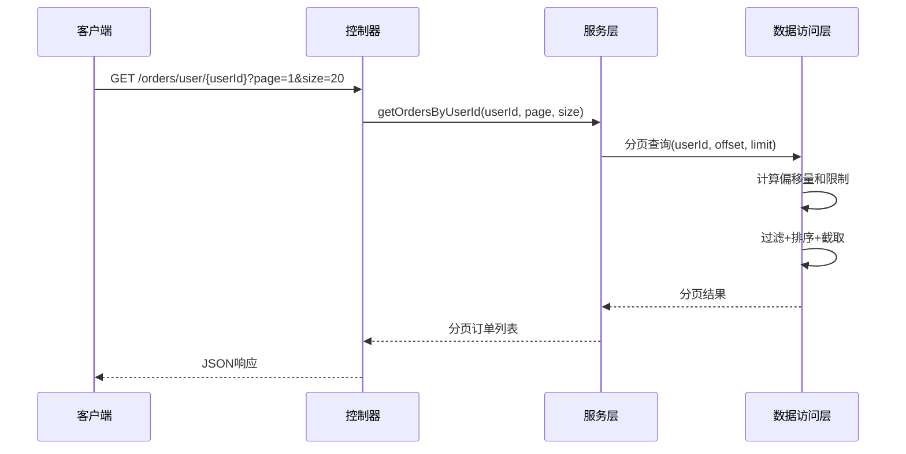

# 按用户ID查询订单列表

<cite>
**本文档引用的文件**
- [OrderDAO.java](file://src/main/java/com/example/demo/dao/OrderDAO.java)
- [OrderService.java](file://src/main/java/com/example/demo/service/OrderService.java)
- [OrderController.java](file://src/main/java/com/example/demo/controller/OrderController.java)
- [Order.java](file://src/main/java/com/example/demo/entity/Order.java)
- [OrderDAOTest.java](file://src/test/java/com/example/demo/dao/OrderDAOTest.java)
- [OrderServiceTest.java](file://src/test/java/com/example/demo/service/OrderServiceTest.java)
</cite>

## 目录
1. [简介](#简介)
2. [项目架构概览](#项目架构概览)
3. [核心组件分析](#核心组件分析)
4. [getOrdersByUserId()方法深度解析](#getordersbyuserid方法深度解析)
5. [Stream操作详解](#stream操作详解)
6. [性能分析与优化建议](#性能分析与优化建议)
7. [测试验证](#测试验证)
8. [最佳实践](#最佳实践)
9. [总结](#总结)

## 简介

本文档深入分析了一个基于Java Stream API的订单查询系统，重点关注`getOrdersByUserId()`方法的实现。该方法通过ConcurrentHashMap存储订单数据，利用Java 8 Stream API对数据进行过滤、排序和收集操作，实现了高效且线程安全的订单查询功能。

系统采用经典的三层架构设计：Controller层处理HTTP请求，Service层封装业务逻辑，DAO层负责数据访问。这种设计模式不仅提高了代码的可维护性，还确保了系统的可扩展性和测试友好性。

## 项目架构概览

系统采用Spring Boot框架构建，遵循MVC架构模式，具有清晰的分层结构：

**图表来源**
- [OrderController.java](file://src/main/java/com/example/demo/controller/OrderController.java#L22-L30)
- [OrderService.java](file://src/main/java/com/example/demo/service/OrderService.java#L15-L21)
- [OrderDAO.java](file://src/main/java/com/example/demo/dao/OrderDAO.java#L19-L20)

**章节来源**
- [OrderController.java](file://src/main/java/com/example/demo/controller/OrderController.java#L1-L173)
- [OrderService.java](file://src/main/java/com/example/demo/service/OrderService.java#L1-L114)
- [OrderDAO.java](file://src/main/java/com/example/demo/dao/OrderDAO.java#L1-L248)

## 核心组件分析

### Order实体类

Order实体类定义了订单的基本属性，包括订单ID、用户ID、商品ID、数量、金额、状态等信息。该类采用了Builder模式和多种构造函数重载，提供了灵活的对象创建方式。

**图表来源**
- [Order.java](file://src/main/java/com/example/demo/entity/Order.java#L9-L162)
- [OrderDAO.java](file://src/main/java/com/example/demo/dao/OrderDAO.java#L18-L248)
- [OrderService.java](file://src/main/java/com/example/demo/service/OrderService.java#L13-L114)
- [OrderController.java](file://src/main/java/com/example/demo/controller/OrderController.java#L22-L173)

### ConcurrentHashMap存储机制

系统使用ConcurrentHashMap作为内存存储容器，这种选择带来了以下优势：

- **线程安全性**：ConcurrentHashMap支持并发读写操作，无需额外的同步机制
- **高性能**：相比Collections.synchronizedMap，ConcurrentHashMap提供了更好的并发性能
- **原子操作**：支持原子性的putIfAbsent、remove等操作
- **内存效率**：相比传统HashMap，在高并发场景下内存占用更合理

**章节来源**
- [OrderDAO.java](file://src/main/java/com/example/demo/dao/OrderDAO.java#L19-L20)

## getOrdersByUserId()方法深度解析

### 方法签名与职责

`getOrdersByUserId()`方法位于OrderDAO类中，承担着根据用户ID查询订单列表的核心职责。该方法的设计体现了单一职责原则，专注于数据查询而不涉及业务逻辑处理。

### 参数验证机制

方法首先执行严格的参数验证，这是防御性编程的重要体现：

**图表来源**
- [OrderDAO.java](file://src/main/java/com/example/demo/dao/OrderDAO.java#L219-L232)

### 数据流处理管道

该方法的核心是基于Java Stream API的数据处理管道，这一设计展现了现代Java编程的最佳实践：

#### 1. 数据源转换
首先将ConcurrentHashMap的values集合转换为Stream：
- `orderMap.values().stream()`：将Map中的所有订单对象转换为Stream流

#### 2. 过滤操作
使用filter操作符进行精确匹配：
- `filter(order -> userId.equals(order.getUserId()))`：严格匹配用户ID，确保查询结果的准确性

#### 3. 排序逻辑
实现复杂的排序策略：
- `Comparator.comparing(Order::getCreateTime)`：基于创建时间进行比较
- `Comparator.nullsLast(Comparator.reverseOrder())`：null值排在最后，降序排列

#### 4. 结果收集
最终将Stream中的元素收集为List：
- `collect(Collectors.toList())`：将流中的元素收集到ArrayList中

**章节来源**
- [OrderDAO.java](file://src/main/java/com/example/demo/dao/OrderDAO.java#L225-L232)

## Stream操作详解

### Stream操作的不可变性

Java Stream API的一个重要特性是不可变性（Immutability），这意味着：

#### 不可变性优势
1. **线程安全**：Stream操作不会修改原始数据，天然支持并发
2. **可组合性**：多个Stream操作可以链式组合，形成复杂的数据处理流程
3. **可测试性**：每个中间操作都是纯函数，易于单元测试
4. **可读性**：声明式的编程风格使代码更具表达力

#### 内存占用分析
Stream操作的内存使用特点：

| 操作阶段 | 内存占用 | 性能影响 | 优化建议 |
|---------|---------|---------|---------|
| Stream创建 | O(1) | 极低 | 无 |
| filter操作 | O(n) | 中等 | 使用并行流 |
| sorted操作 | O(n log n) | 较高 | 考虑索引优化 |
| collect操作 | O(n) | 中等 | 预分配容量 |

### 排序算法实现

排序逻辑采用了复合比较器（Composite Comparator）模式：

**图表来源**
- [OrderDAO.java](file://src/main/java/com/example/demo/dao/OrderDAO.java#L228-L231)

**章节来源**
- [OrderDAO.java](file://src/main/java/com/example/demo/dao/OrderDAO.java#L225-L232)

## 性能分析与优化建议

### 当前实现的性能特征

#### 时间复杂度分析
- **过滤阶段**：O(n)，需要遍历所有订单
- **排序阶段**：O(n log n)，使用TimSort算法
- **总体复杂度**：O(n log n)

#### 空间复杂度分析
- **临时对象**：Stream操作会产生中间对象
- **排序开销**：排序操作需要额外的内存空间
- **结果集合**：最终返回的List占用内存

### 大数据量下的性能挑战

在订单数量达到数万甚至数十万级别时，当前实现可能面临以下问题：

1. **内存占用过高**：所有订单都会被加载到内存中
2. **响应延迟增加**：排序操作的时间复杂度限制了查询速度
3. **GC压力增大**：大量临时对象增加了垃圾回收负担

### 优化建议方案

#### 方案一：引入二级索引

**实现要点**：
- 在ConcurrentHashMap基础上增加ConcurrentSkipListMap
- 维护userId到orderId列表的映射关系
- 查询时先通过二级索引获取订单ID，再从主索引获取完整对象

#### 方案二：分页机制

**实现要点**：
- 添加page和size参数
- 使用skip()和limit()操作进行分页
- 返回分页元数据（total、pages等）

#### 方案三：缓存策略
- **LRU缓存**：缓存热门用户的订单列表
- **TTL缓存**：设置合理的缓存过期时间
- **分布式缓存**：使用Redis等外部缓存

**章节来源**
- [OrderDAO.java](file://src/main/java/com/example/demo/dao/OrderDAO.java#L225-L232)

## 测试验证

### 单元测试覆盖

系统提供了全面的单元测试，验证了`getOrdersByUserId()`方法的各种场景：

#### 正常查询测试
测试验证了方法能够正确返回指定用户的订单列表，并按照创建时间降序排列。

#### 边界条件测试
- **空用户ID**：验证返回空列表
- **null用户ID**：验证返回空列表
- **无效用户ID**：验证返回空列表

#### 排序逻辑测试
特别验证了null值的处理，确保createTime为null的订单会被正确地排在最后。

#### 多用户隔离测试
验证了不同用户之间的订单数据隔离性，确保查询结果只包含指定用户的数据。

**章节来源**
- [OrderDAOTest.java](file://src/test/java/com/example/demo/dao/OrderDAOTest.java#L151-L239)
- [OrderServiceTest.java](file://src/test/java/com/example/demo/service/OrderServiceTest.java#L127-L203)

## 最佳实践

### 代码质量保证

1. **防御性编程**：严格验证输入参数，避免空指针异常
2. **单一职责**：DAO层只负责数据访问，不包含业务逻辑
3. **接口一致性**：保持方法签名和返回值的一致性
4. **异常处理**：提供有意义的异常信息

### 性能优化指导

1. **合理使用Stream**：对于小数据集，考虑直接迭代而非Stream
2. **预估数据规模**：根据预期数据量选择合适的优化策略
3. **监控指标**：关注查询响应时间和内存使用情况
4. **渐进式优化**：从最简单的实现开始，逐步优化

### 可维护性考虑

1. **清晰的命名**：方法和变量名称要具有描述性
2. **适当的注释**：解释复杂的业务逻辑和算法选择
3. **测试覆盖率**：确保关键功能有足够的测试覆盖
4. **文档更新**：及时更新相关技术文档

## 总结

`getOrdersByUserId()`方法展示了现代Java开发的最佳实践，通过合理运用Stream API和ConcurrentHashMap，实现了高效、线程安全的订单查询功能。该实现具有以下特点：

### 技术亮点
- **Stream API的应用**：充分利用Java 8的新特性，代码简洁且功能强大
- **线程安全设计**：使用ConcurrentHashMap确保并发环境下的数据一致性
- **防御性编程**：完善的参数验证和异常处理机制
- **可测试性**：清晰的职责分离和依赖注入，便于单元测试

### 性能考量
虽然当前实现满足基本需求，但在处理大规模数据时可能存在性能瓶颈。建议根据实际业务场景，考虑引入二级索引、分页机制或缓存策略等优化方案。

### 架构优势
三层架构的设计使得系统具有良好的可维护性和可扩展性，为未来的功能扩展和性能优化奠定了坚实基础。

通过深入理解这个方法的实现原理和优化策略，开发者可以更好地应对类似的业务需求，构建高质量的企业级应用系统。