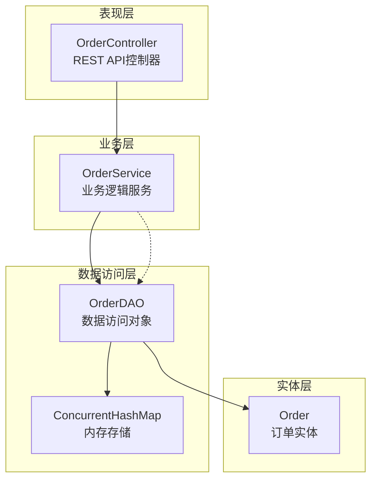
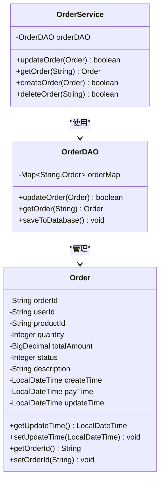
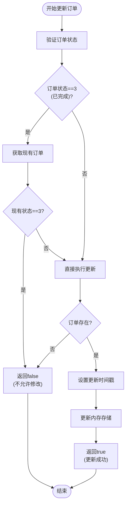
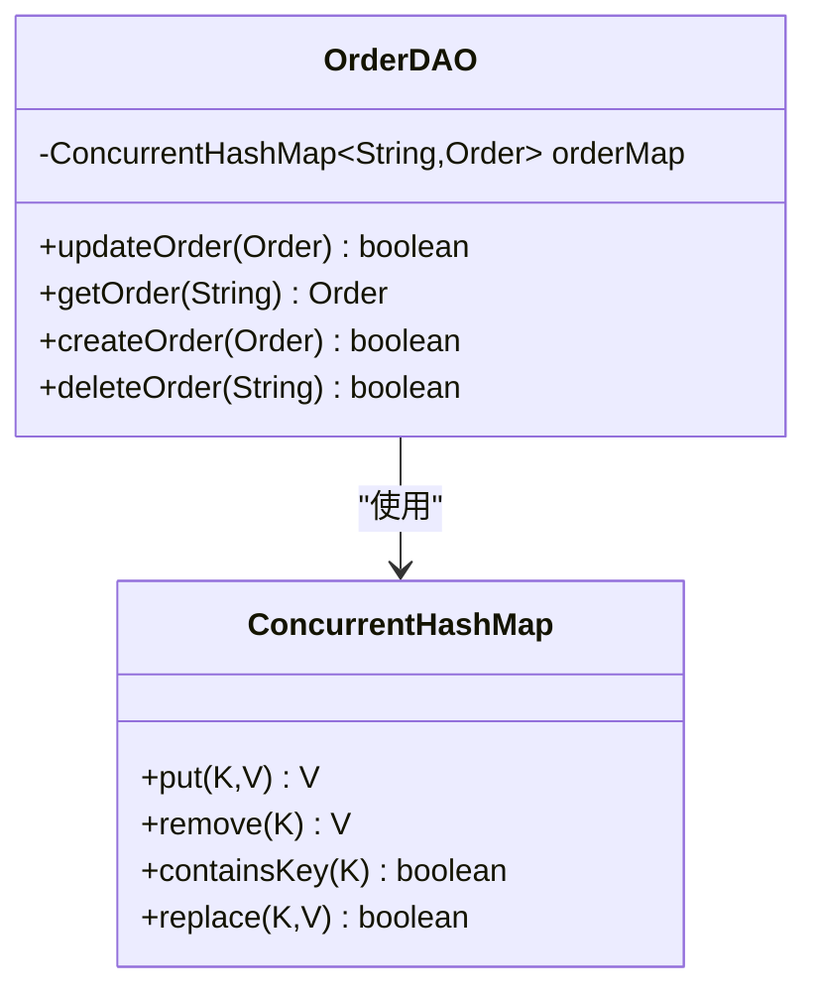
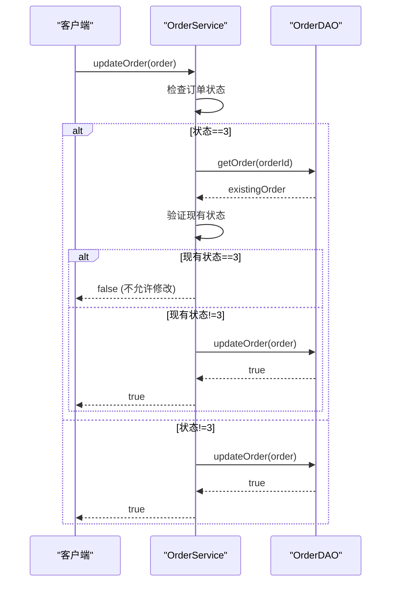
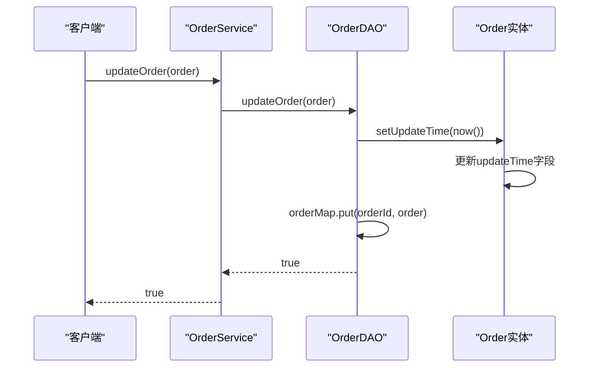
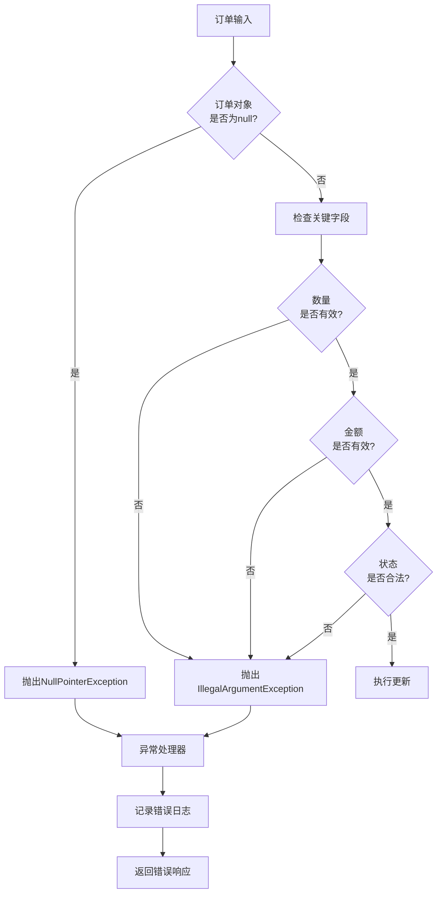
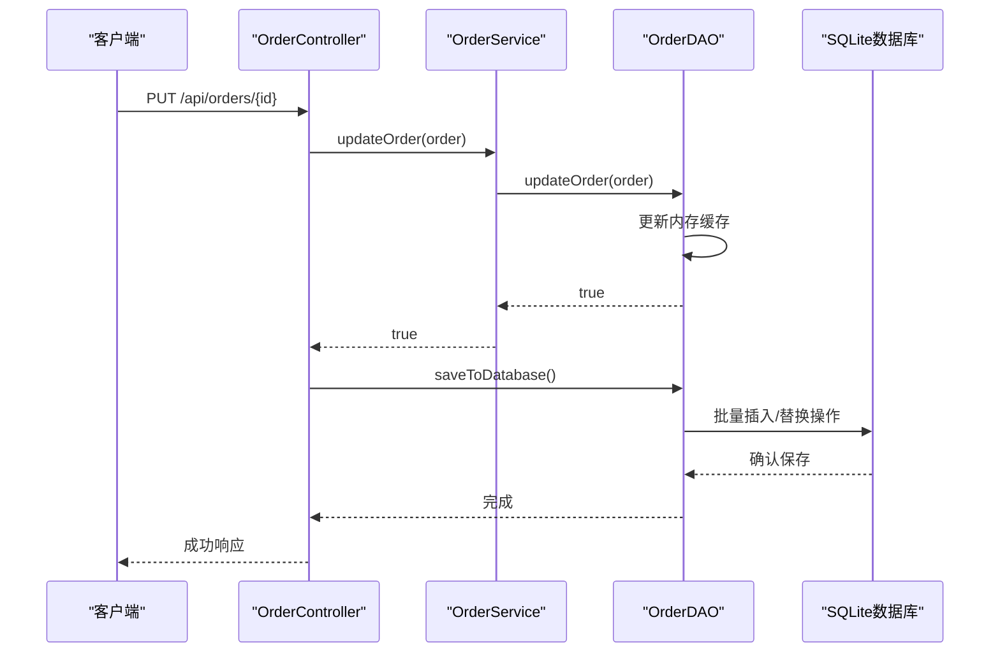

# 更新订单实现

<cite>
**本文档中引用的文件**
- [OrderService.java](file://src/main/java/com/example/demo/service/OrderService.java)
- [OrderDAO.java](file://src/main/java/com/example/demo/dao/OrderDAO.java)
- [Order.java](file://src/main/java/com/example/demo/entity/Order.java)
- [OrderController.java](file://src/main/java/com/example/demo/controller/OrderController.java)
- [OrderServiceTest.java](file://src/test/java/com/example/demo/service/OrderServiceTest.java)
- [OrderDAOTest.java](file://src/test/java/com/example/demo/dao/OrderDAOTest.java)
- [AIOrderServiceTest.java](file://src/test/java/com/example/demo/service/ai_test/AIOrderServiceTest.java)
</cite>

## 目录
1. [概述](#概述)
2. [系统架构](#系统架构)
3. [核心组件分析](#核心组件分析)
4. [updateOrder()方法实现详解](#updateorder方法实现详解)
5. [并发安全性设计](#并发安全性设计)
6. [订单状态验证机制](#订单状态验证机制)
7. [时间戳自动更新](#时间戳自动更新)
8. [错误处理与异常管理](#错误处理与异常管理)
9. [性能优化策略](#性能优化策略)
10. [最佳实践与建议](#最佳实践与建议)

## 概述

本文档详细分析了Spring Boot订单管理系统中`updateOrder()`方法的实现机制。该系统采用分层架构设计，通过服务层和数据访问层的协作，实现了订单信息的更新功能。核心特性包括：

- **自动时间戳更新**：每次更新操作都会自动刷新`updateTime`字段
- **并发安全保障**：使用`ConcurrentHashMap`确保线程安全的原子操作
- **状态验证机制**：严格的订单状态检查，防止非法状态变更
- **空指针防护**：完善的空值检查和异常处理机制

## 系统架构

系统采用经典的三层架构模式，清晰分离关注点：

**图表来源**
- [OrderController.java](file://src/main/java/com/example/demo/controller/OrderController.java#L18-L30)
- [OrderService.java](file://src/main/java/com/example/demo/service/OrderService.java#L14-L21)
- [OrderDAO.java](file://src/main/java/com/example/demo/dao/OrderDAO.java#L18-L20)

## 核心组件分析

### Order实体类设计

Order实体类包含了订单的所有核心属性，其中时间戳字段对于审计追踪至关重要：

**图表来源**
- [Order.java](file://src/main/java/com/example/demo/entity/Order.java#L10-L39)
- [OrderService.java](file://src/main/java/com/example/demo/service/OrderService.java#L14-L21)
- [OrderDAO.java](file://src/main/java/com/example/demo/dao/OrderDAO.java#L18-L20)

**章节来源**
- [Order.java](file://src/main/java/com/example/demo/entity/Order.java#L1-L162)
- [OrderService.java](file://src/main/java/com/example/demo/service/OrderService.java#L1-L114)
- [OrderDAO.java](file://src/main/java/com/example/demo/dao/OrderDAO.java#L1-L248)

## updateOrder()方法实现详解

### 方法调用流程

updateOrder()方法的执行遵循严格的业务逻辑流程：

**图表来源**
- [OrderService.java](file://src/main/java/com/example/demo/service/OrderService.java#L63-L74)

### 核心实现逻辑

updateOrder()方法的核心实现位于OrderService类中，展现了严谨的状态验证和更新控制：

1. **状态检查机制**：当订单状态为3（已完成）时，需要额外验证现有状态
2. **原子性保证**：通过OrderDAO的updateOrder方法确保操作的原子性
3. **失败处理**：明确的失败返回值便于上层调用方处理

**章节来源**
- [OrderService.java](file://src/main/java/com/example/demo/service/OrderService.java#L63-L74)

## 并发安全性设计

### ConcurrentHashMap的使用

系统使用`ConcurrentHashMap`作为内存存储容器，提供了线程安全的并发访问能力：

**图表来源**
- [OrderDAO.java](file://src/main/java/com/example/demo/dao/OrderDAO.java#L18-L20)

### replace操作的原子性

虽然当前实现中没有直接使用`replace`方法，但系统的设计天然支持原子性操作：

- **读取操作**：`getOrder()`方法提供线程安全的读取
- **写入操作**：`updateOrder()`方法确保数据一致性
- **删除操作**：`deleteOrder()`方法保证原子性删除

**章节来源**
- [OrderDAO.java](file://src/main/java/com/example/demo/dao/OrderDAO.java#L191-L199)

## 订单状态验证机制

### 完成状态的特殊处理

系统对已完成订单（状态3）实施特殊的保护机制：

**图表来源**
- [OrderService.java](file://src/main/java/com/example/demo/service/OrderService.java#L65-L71)

### 状态验证规则

| 订单状态 | 新状态 | 是否允许修改 | 备注 |
|---------|--------|-------------|------|
| 0 (待支付) | 任意 | 是 | 允许修改所有字段 |
| 1 (已支付) | 任意 | 是 | 允许修改所有字段 |
| 2 (已发货) | 任意 | 是 | 允许修改所有字段 |
| 3 (已完成) | 3 | 否 | 不允许修改已完成订单 |
| 3 (已完成) | 其他 | 否 | 不允许修改已完成订单 |
| 4 (已取消) | 任意 | 是 | 允许修改所有字段 |

**章节来源**
- [OrderService.java](file://src/main/java/com/example/demo/service/OrderService.java#L65-L71)

## 时间戳自动更新

### updateTime字段的重要性

`updateTime`字段是订单审计追踪的关键组件，记录了每次修改的时间点：

**图表来源**
- [OrderDAO.java](file://src/main/java/com/example/demo/dao/OrderDAO.java#L195-L197)

### 自动时间戳更新机制

OrderDAO的updateOrder方法实现了自动时间戳更新：

1. **时间戳设置**：在更新前自动设置当前时间
2. **原子更新**：确保时间戳和订单数据的一致性
3. **持久化准备**：为后续的数据库保存做好准备

**章节来源**
- [OrderDAO.java](file://src/main/java/com/example/demo/dao/OrderDAO.java#L191-L199)

## 错误处理与异常管理

### 空指针防护机制

系统在多个层面实现了空指针防护：

**图表来源**
- [OrderService.java](file://src/main/java/com/example/demo/service/OrderService.java#L28-L35)

### 异常类型与处理策略

| 异常类型 | 触发条件 | 处理策略 | 返回结果 |
|---------|----------|----------|----------|
| NullPointerException | 订单对象为null | 立即抛出 | 500 Internal Server Error |
| IllegalArgumentException | 数量≤0或金额≤0 | 抛出异常并返回错误信息 | 400 Bad Request |
| RuntimeException | 内部逻辑错误 | 捕获并记录日志 | 500 Internal Server Error |

**章节来源**
- [OrderService.java](file://src/main/java/com/example/demo/service/OrderService.java#L28-L35)
- [OrderController.java](file://src/main/java/com/example/demo/controller/OrderController.java#L122-L140)

## 性能优化策略

### 内存存储的优势

使用ConcurrentHashMap作为内存存储具有以下性能优势：

1. **O(1)查找复杂度**：基于哈希表的快速查找
2. **线程安全**：无需额外的同步机制
3. **内存效率**：相比传统集合更节省内存空间
4. **批量操作支持**：支持高效的批量数据处理

### 数据库同步策略

系统采用延迟同步策略，减少数据库访问频率：

**图表来源**
- [OrderController.java](file://src/main/java/com/example/demo/controller/OrderController.java#L124-L126)
- [OrderDAO.java](file://src/main/java/com/example/demo/dao/OrderDAO.java#L50-L75)

**章节来源**
- [OrderDAO.java](file://src/main/java/com/example/demo/dao/OrderDAO.java#L50-L75)

## 最佳实践与建议

### 开发建议

1. **状态验证**：始终在更新前验证订单状态，特别是已完成订单
2. **时间戳管理**：确保每次更新都自动设置正确的更新时间
3. **异常处理**：实现完善的异常捕获和日志记录机制
4. **并发控制**：利用ConcurrentHashMap的线程安全特性

### 生产环境部署建议

1. **监控指标**：
   - 订单更新成功率
   - 平均响应时间
   - 并发访问量
   - 内存使用情况

2. **性能调优**：
   - 调整ConcurrentHashMap的初始容量
   - 优化数据库批处理大小
   - 实施适当的缓存策略

3. **故障恢复**：
   - 实现定期的数据备份机制
   - 建立完善的监控告警系统
   - 制定详细的灾难恢复计划

### 扩展性考虑

1. **分布式支持**：考虑引入分布式缓存如Redis
2. **事件驱动**：实现基于事件的异步更新机制
3. **版本控制**：为重要订单操作添加版本控制
4. **审计追踪**：建立完整的操作审计日志系统

**章节来源**
- [OrderServiceTest.java](file://src/test/java/com/example/demo/service/OrderServiceTest.java#L107-L125)
- [OrderDAOTest.java](file://src/test/java/com/example/demo/dao/OrderDAOTest.java#L89-L112)

## 结论

Spring Boot订单管理系统通过精心设计的updateOrder()方法，实现了高效、安全、可靠的订单更新功能。系统的核心优势包括：

- **严格的业务规则**：通过状态验证防止非法操作
- **自动化的维护**：时间戳自动更新确保数据完整性
- **强大的并发支持**：ConcurrentHashMap提供线程安全保证
- **完善的错误处理**：多层次的异常防护机制

这种设计不仅满足了当前的业务需求，也为未来的扩展和优化奠定了坚实的基础。开发者在使用和扩展该系统时，应当充分理解这些设计原则和实现细节，以确保系统的稳定性和可维护性。