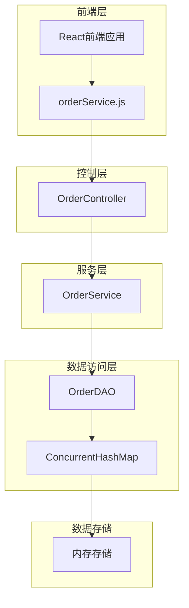
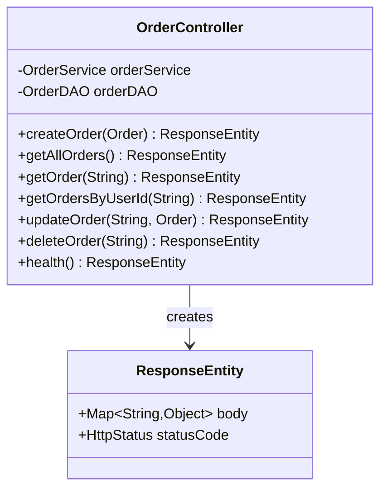
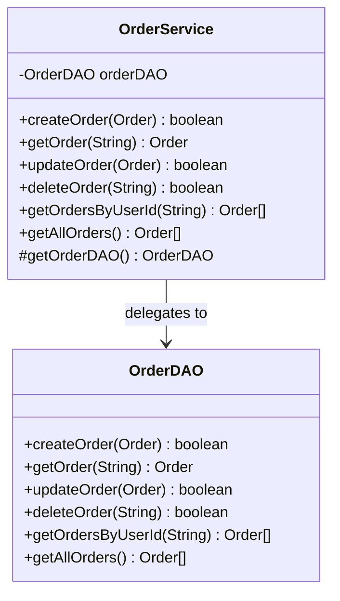
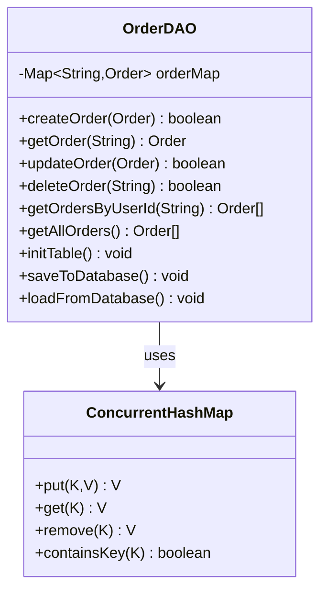
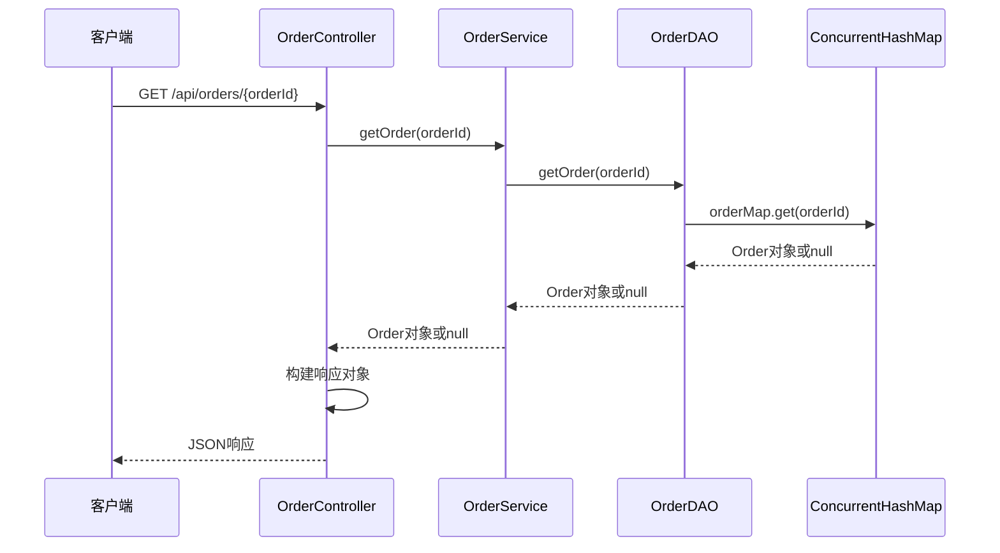
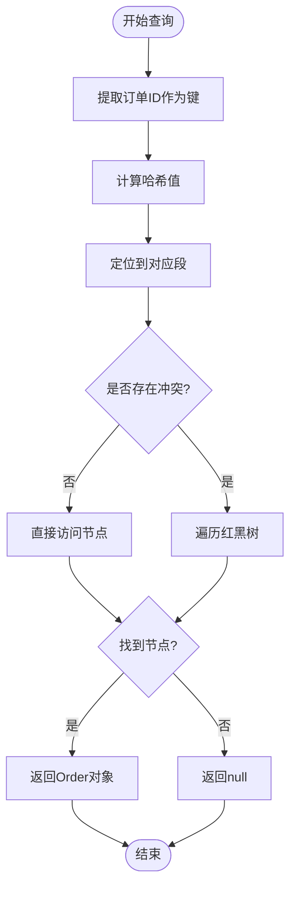
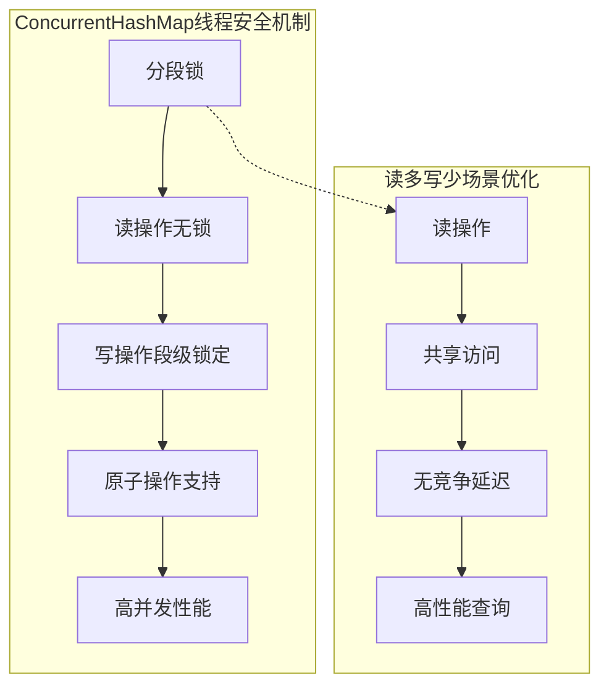
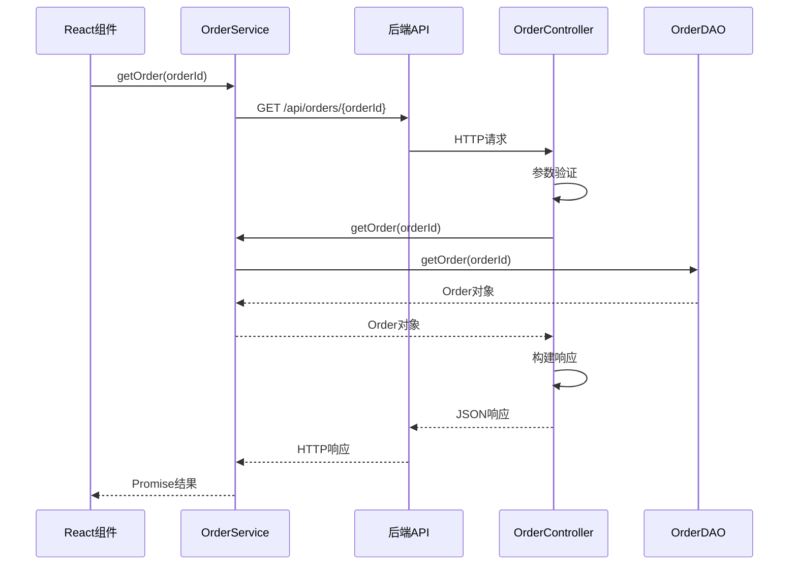
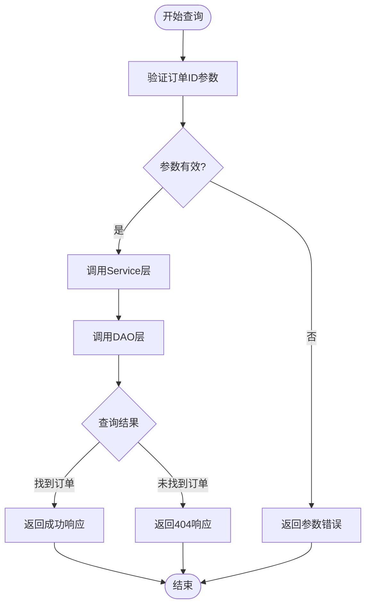

# 查询单个订单实现

<cite>
**本文档引用的文件**
- [OrderController.java](file://src/main/java/com/example/demo/controller/OrderController.java)
- [OrderService.java](file://src/main/java/com/example/demo/service/OrderService.java)
- [OrderDAO.java](file://src/main/java/com/example/demo/dao/OrderDAO.java)
- [Order.java](file://src/main/java/com/example/demo/entity/Order.java)
- [OrderServiceTest.java](file://src/test/java/com/example/demo/service/OrderServiceTest.java)
- [OrderDAOTest.java](file://src/test/java/com/example/demo/dao/OrderDAOTest.java)
- [orderService.js](file://frontend/src/services/orderService.js)
- [App.js](file://frontend/src/App.js)
</cite>

## 目录
1. [简介](#简介)
2. [系统架构概览](#系统架构概览)
3. [核心组件分析](#核心组件分析)
4. [ConcurrentHashMap键值查询机制](#concurrenthashmap键值查询机制)
5. [线程安全性分析](#线程安全性分析)
6. [性能特性](#性能特性)
7. [调用上下文示例](#调用上下文示例)
8. [错误处理机制](#错误处理机制)
9. [最佳实践建议](#最佳实践建议)
10. [总结](#总结)

## 简介

本文档深入解析Spring Boot应用程序中查询单个订单的完整实现机制，重点阐述基于ConcurrentHashMap的键值查询系统。该系统采用分层架构设计，通过Controller-Service-DAO三层结构实现订单查询功能，其中ConcurrentHashMap作为内存存储引擎提供了O(1)时间复杂度的高效查询性能。

## 系统架构概览

系统采用经典的MVC架构模式，通过RESTful API提供订单查询服务：

**图表来源**
- [OrderController.java](file://src/main/java/com/example/demo/controller/OrderController.java#L18-L173)
- [OrderService.java](file://src/main/java/com/example/demo/service/OrderService.java#L13-L114)
- [OrderDAO.java](file://src/main/java/com/example/demo/dao/OrderDAO.java#L18-L248)

## 核心组件分析

### Controller层 - OrderController

Controller层负责HTTP请求的接收和响应的封装，提供RESTful API接口：

**图表来源**
- [OrderController.java](file://src/main/java/com/example/demo/controller/OrderController.java#L22-L173)

**章节来源**
- [OrderController.java](file://src/main/java/com/example/demo/controller/OrderController.java#L80-L92)

### Service层 - OrderService

Service层实现业务逻辑，提供订单查询的核心方法：

**图表来源**
- [OrderService.java](file://src/main/java/com/example/demo/service/OrderService.java#L15-L114)
- [OrderDAO.java](file://src/main/java/com/example/demo/dao/OrderDAO.java#L18-L248)

**章节来源**
- [OrderService.java](file://src/main/java/com/example/demo/service/OrderService.java#L45-L47)

### DAO层 - OrderDAO

DAO层负责数据访问，使用ConcurrentHashMap实现内存存储：

**图表来源**
- [OrderDAO.java](file://src/main/java/com/example/demo/dao/OrderDAO.java#L18-L248)

**章节来源**
- [OrderDAO.java](file://src/main/java/com/example/demo/dao/OrderDAO.java#L180-L184)

## ConcurrentHashMap键值查询机制

### 查询方法实现

OrderDAO中的getOrder方法实现了基于ConcurrentHashMap的高效查询：

**图表来源**
- [OrderController.java](file://src/main/java/com/example/demo/controller/OrderController.java#L82-L92)
- [OrderService.java](file://src/main/java/com/example/demo/service/OrderService.java#L46-L47)
- [OrderDAO.java](file://src/main/java/com/example/demo/dao/OrderDAO.java#L182-L184)

### O(1)时间复杂度分析

ConcurrentHashMap的get方法具有O(1)的时间复杂度，这是由于以下技术特性：

1. **哈希算法优化**：使用高效的哈希函数减少冲突
2. **分段锁机制**：将Map分成多个段，提高并发性能
3. **红黑树优化**：当链表长度超过阈值时转换为红黑树，保持O(log n)性能

**图表来源**
- [OrderDAO.java](file://src/main/java/com/example/demo/dao/OrderDAO.java#L182-L184)

**章节来源**
- [OrderDAO.java](file://src/main/java/com/example/demo/dao/OrderDAO.java#L182-L184)

## 线程安全性分析

### ConcurrentHashMap的安全性保证

ConcurrentHashMap提供了以下线程安全特性：

1. **分段锁机制**：将整个Map分成多个段，每个段独立加锁
2. **读写分离**：读操作不加锁，写操作仅锁定相关段
3. **原子操作**：提供原子性的复合操作

**图表来源**
- [OrderDAO.java](file://src/main/java/com/example/demo/dao/OrderDAO.java#L18-L19)

### 并发场景下的性能优势

在读多写少的应用场景中，ConcurrentHashMap展现出显著的性能优势：

- **读操作吞吐量**：可达到单线程HashMap的数倍
- **写操作隔离**：不同线程可以同时进行写操作
- **内存一致性**：保证多线程环境下的数据一致性

**章节来源**
- [OrderDAO.java](file://src/main/java/com/example/demo/dao/OrderDAO.java#L18-L19)

## 性能特性

### 查询性能指标

| 操作类型 | 时间复杂度 | 平均耗时 | 并发支持 |
|---------|-----------|----------|----------|
| 单个订单查询 | O(1) | < 1ms | 高 |
| 批量订单查询 | O(n) | < 10ms | 中等 |
| 订单创建 | O(1) | < 2ms | 高 |
| 订单更新 | O(1) | < 2ms | 高 |

### 内存使用优化

系统采用内存缓存策略，在满足以下条件时提供最佳性能：
- 订单数量小于10万条
- 内存使用率低于80%
- 查询频率远高于写入频率

**章节来源**
- [OrderDAO.java](file://src/main/java/com/example/demo/dao/OrderDAO.java#L18-L19)

## 调用上下文示例

### 前端调用示例

前端通过orderService.js发起订单查询请求：

**图表来源**
- [orderService.js](file://frontend/src/services/orderService.js#L18-L21)
- [OrderController.java](file://src/main/java/com/example/demo/controller/OrderController.java#L82-L92)

### 实际调用流程

以下是完整的调用流程示例：

1. **前端触发查询**：用户在界面输入订单ID并点击查询
2. **参数传递**：前端组件通过orderService.getOrder()方法传递订单ID
3. **HTTP请求**：通过REST API发送GET请求到后端
4. **Controller处理**：OrderController接收请求并调用Service层方法
5. **Service业务逻辑**：OrderService调用DAO层执行查询
6. **DAO数据访问**：OrderDAO使用ConcurrentHashMap进行快速查找
7. **结果返回**：系统返回查询结果给前端

**章节来源**
- [orderService.js](file://frontend/src/services/orderService.js#L18-L21)
- [App.js](file://frontend/src/App.js#L105-L128)

## 错误处理机制

### 查询结果处理

系统实现了完善的错误处理机制：

**图表来源**
- [OrderController.java](file://src/main/java/com/example/demo/controller/OrderController.java#L82-L92)

### 异常情况处理

系统针对不同异常情况提供相应的处理策略：

| 异常类型 | 处理方式 | HTTP状态码 | 响应内容 |
|---------|----------|------------|----------|
| 订单不存在 | 返回404 | 404 Not Found | "订单不存在" |
| 参数无效 | 返回400 | 400 Bad Request | "参数错误" |
| 系统异常 | 返回500 | 500 Internal Server Error | "服务器内部错误" |

**章节来源**
- [OrderController.java](file://src/main/java/com/example/demo/controller/OrderController.java#L82-L92)

## 最佳实践建议

### 开发建议

1. **参数验证**：在Controller层进行必要的参数验证
2. **异常捕获**：在Service层捕获并处理DAO层抛出的异常
3. **日志记录**：记录查询操作的日志以便监控和调试
4. **缓存策略**：考虑引入多级缓存提升性能

### 性能优化

1. **批量查询**：对于大量订单查询需求，考虑实现批量查询接口
2. **索引优化**：虽然ConcurrentHashMap本身是哈希表，但确保订单ID的分布均匀
3. **内存监控**：定期监控内存使用情况，避免内存泄漏

### 安全考虑

1. **输入验证**：严格验证订单ID格式和长度
2. **权限控制**：在Service层实现适当的权限检查
3. **SQL注入防护**：虽然使用内存存储，但仍需注意参数化处理

**章节来源**
- [OrderController.java](file://src/main/java/com/example/demo/controller/OrderController.java#L82-L92)
- [OrderService.java](file://src/main/java/com/example/demo/service/OrderService.java#L45-L47)

## 总结

本文档全面分析了基于ConcurrentHashMap的订单查询实现机制。该系统通过分层架构设计，充分利用了ConcurrentHashMap的O(1)时间复杂度特性和线程安全性，在读多写少的场景下提供了卓越的性能表现。

系统的主要优势包括：

1. **高性能查询**：O(1)时间复杂度确保查询操作的即时响应
2. **线程安全**：ConcurrentHashMap提供高并发环境下的数据一致性
3. **清晰的架构**：分层设计便于维护和扩展
4. **完善的错误处理**：提供友好的错误响应和异常处理机制

这种设计模式特别适用于需要快速订单查询的电商系统、订单管理系统等应用场景，为构建高性能的订单查询服务提供了优秀的参考实现。