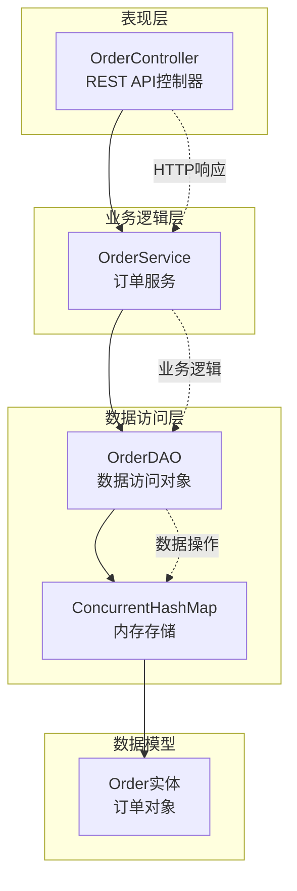
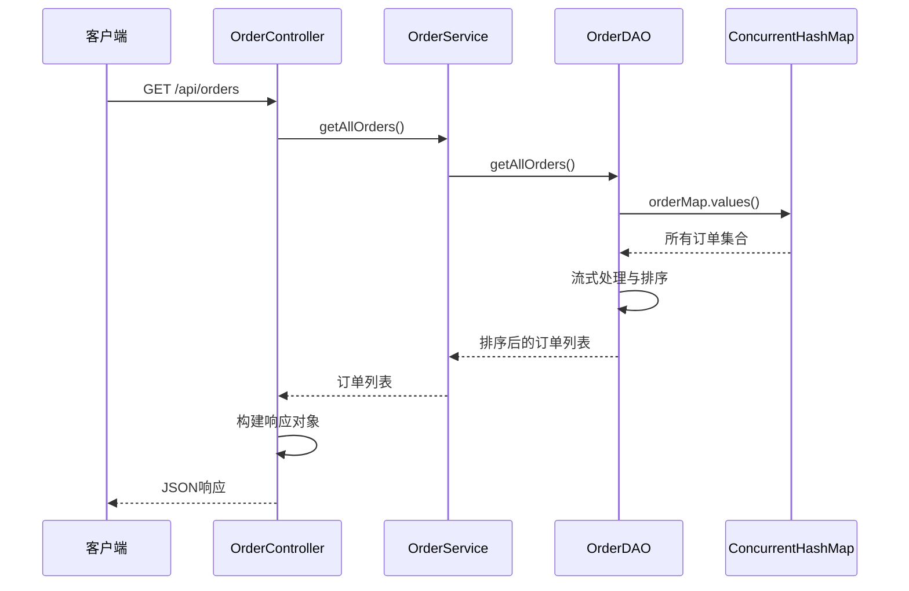
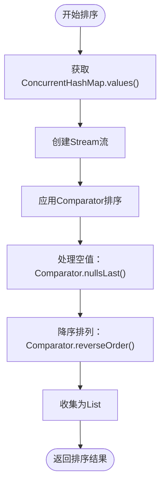
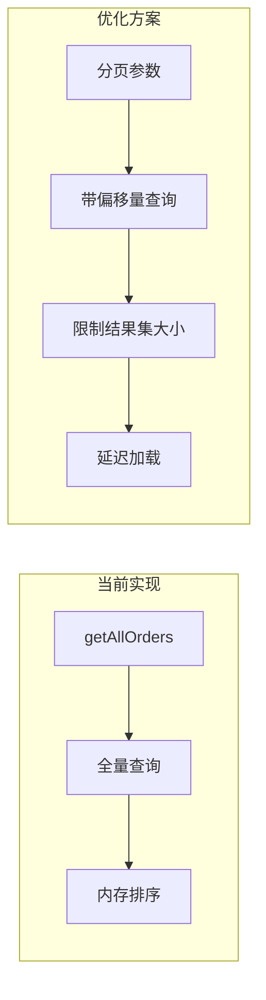
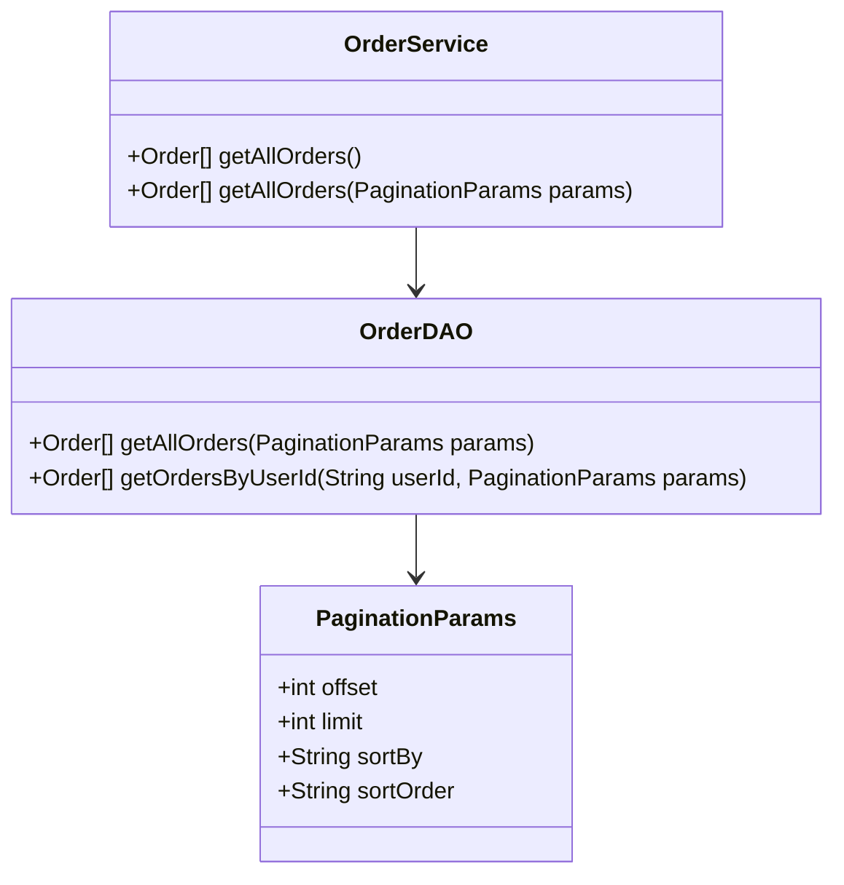
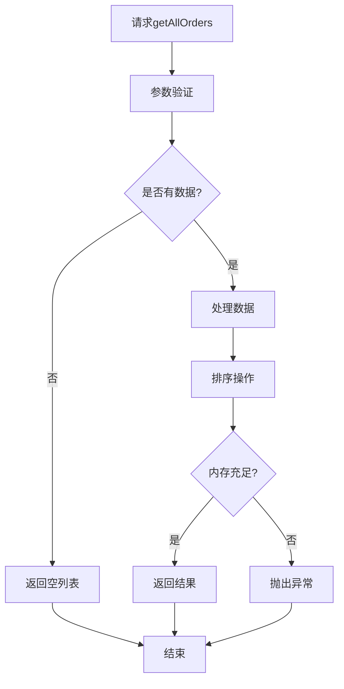

# 获取所有订单实现

<cite>
**本文档中引用的文件**
- [OrderService.java](file://src/main/java/com/example/demo/service/OrderService.java)
- [OrderController.java](file://src/main/java/com/example/demo/controller/OrderController.java)
- [OrderDAO.java](file://src/main/java/com/example/demo/dao/OrderDAO.java)
- [Order.java](file://src/main/java/com/example/demo/entity/Order.java)
- [OrderDAOTest.java](file://src/test/java/com/example/demo/dao/OrderDAOTest.java)
- [OrderServiceTest.java](file://src/test/java/com/example/demo/service/OrderServiceTest.java)
- [AIOrderServiceTest.java](file://src/test/java/com/example/demo/service/ai_test/AIOrderServiceTest.java)
- [DBUtil.java](file://src/main/java/com/example/demo/dao/DBUtil.java)
</cite>

## 目录
1. [概述](#概述)
2. [系统架构](#系统架构)
3. [getAllOrders()方法实现](#getallorders方法实现)
4. [排序机制分析](#排序机制分析)
5. [性能分析与优化建议](#性能分析与优化建议)
6. [扩展性设计](#扩展性设计)
7. [最佳实践建议](#最佳实践建议)
8. [总结](#总结)

## 概述

getAllOrders()方法是订单管理系统中的核心查询功能，负责获取系统中所有的订单记录，并按照创建时间降序排列。该方法采用流式处理和并发安全的数据结构，确保在高并发环境下能够稳定运行。

## 系统架构

**图表来源**
- [OrderController.java](file://src/main/java/com/example/demo/controller/OrderController.java#L22-L173)
- [OrderService.java](file://src/main/java/com/example/demo/service/OrderService.java#L14-L114)
- [OrderDAO.java](file://src/main/java/com/example/demo/dao/OrderDAO.java#L18-L248)

**章节来源**
- [OrderController.java](file://src/main/java/com/example/demo/controller/OrderController.java#L1-L173)
- [OrderService.java](file://src/main/java/com/example/demo/service/OrderService.java#L1-L114)
- [OrderDAO.java](file://src/main/java/com/example/demo/dao/OrderDAO.java#L1-L248)

## getAllOrders()方法实现

### 方法调用链路

getAllOrders()方法的执行遵循经典的三层架构模式：

**图表来源**
- [OrderController.java](file://src/main/java/com/example/demo/controller/OrderController.java#L61-L75)
- [OrderService.java](file://src/main/java/com/example/demo/service/OrderService.java#L110-L113)
- [OrderDAO.java](file://src/main/java/com/example/demo/dao/OrderDAO.java#L238-L247)

### 核心实现逻辑

OrderDAO中的getAllOrders()方法采用以下实现策略：

1. **数据提取阶段**：通过`orderMap.values()`获取ConcurrentHashMap中的所有订单值
2. **流式处理阶段**：使用Java Stream API进行数据处理
3. **排序阶段**：应用Comparator对订单按创建时间降序排列
4. **结果收集阶段**：将处理后的流收集为List返回

**章节来源**
- [OrderDAO.java](file://src/main/java/com/example/demo/dao/OrderDAO.java#L238-L247)

## 排序机制分析

### 排序规则一致性

getAllOrders()方法与getOrdersByUserId()方法采用完全一致的排序规则：

| 排序维度 | 排序方式 | 实现细节 |
|---------|---------|---------|
| 主键字段 | createTime | Order实体的createTime属性 |
| 排序方向 | 降序排列 | Comparator.reverseOrder() |
| 空值处理 | null值排在末尾 | Comparator.nullsLast() |
| 并发安全性 | 线程安全 | 使用ConcurrentHashMap作为底层存储 |

### 排序算法实现

**图表来源**
- [OrderDAO.java](file://src/main/java/com/example/demo/dao/OrderDAO.java#L240-L246)

**章节来源**
- [OrderDAO.java](file://src/main/java/com/example/demo/dao/OrderDAO.java#L225-L247)

## 性能分析与优化建议

### 性能瓶颈分析

随着系统中订单数量的增长，getAllOrders()方法面临以下性能挑战：

| 数据规模 | 时间复杂度 | 空间复杂度 | 性能影响 |
|---------|-----------|-----------|---------|
| N ≤ 1000 | O(N log N) | O(N) | 轻微影响 |
| N ≤ 10000 | O(N log N) | O(N) | 中等影响 |
| N > 10000 | O(N log N) | O(N) | 显著影响 |

### 性能优化策略

#### 1. 分页查询支持

#### 2. 缓存策略

- **LRU缓存**：缓存最近访问的订单列表
- **预计算索引**：维护按时间排序的索引结构
- **增量更新**：只处理新增和修改的订单

#### 3. 异步处理

对于大数据量场景，可以考虑异步处理：
- 后台批量生成订单快照
- 提供实时计算和缓存查询两种模式

**章节来源**
- [OrderDAO.java](file://src/main/java/com/example/demo/dao/OrderDAO.java#L238-L247)

## 扩展性设计

### 分页参数支持方案

为了支持大数据量场景，建议引入分页参数：

**图表来源**
- [OrderDAO.java](file://src/main/java/com/example/demo/dao/OrderDAO.java#L238-L247)

### 未来扩展点

| 扩展功能 | 实现方案 | 性能考量 |
|---------|---------|---------|
| 过滤条件 | 添加查询参数 | 需要索引支持 |
| 排序选项 | 动态排序字段 | 复杂度增加 |
| 导出功能 | 批量导出机制 | 内存压力大 |
| 实时统计 | 增量统计计算 | 实时性要求 |

**章节来源**
- [OrderDAO.java](file://src/main/java/com/example/demo/dao/OrderDAO.java#L238-L247)

## 最佳实践建议

### 使用场景建议

#### 推荐使用场景
- **管理后台查询**：管理员查看所有订单
- **报表生成**：定期生成销售统计报告
- **数据备份**：系统级数据导出

#### 不推荐使用场景
- **前端列表展示**：用户界面订单列表
- **高频查询**：实时交易系统
- **大数据量查询**：订单数超过10万

### 错误处理策略

**图表来源**
- [OrderDAO.java](file://src/main/java/com/example/demo/dao/OrderDAO.java#L238-L247)

**章节来源**
- [OrderController.java](file://src/main/java/com/example/demo/controller/OrderController.java#L61-L75)
- [OrderService.java](file://src/main/java/com/example/demo/service/OrderService.java#L110-L113)

## 总结

getAllOrders()方法作为订单管理系统的核心查询功能，采用了现代Java Stream API和ConcurrentHashMap技术栈，实现了高效、线程安全的订单查询功能。该方法与getOrdersByUserId()方法保持了一致的排序规则，确保了API行为的一致性。

然而，随着系统规模的增长，该方法在大数据量场景下可能面临性能瓶颈。建议在管理后台等低频使用场景中继续使用当前实现，同时考虑引入分页参数、缓存机制和异步处理等优化策略，以提升系统的整体性能和用户体验。

未来的扩展方向包括支持分页查询、动态排序、过滤条件等功能，这些改进将使getAllOrders()方法能够更好地适应不同的业务需求和技术挑战。