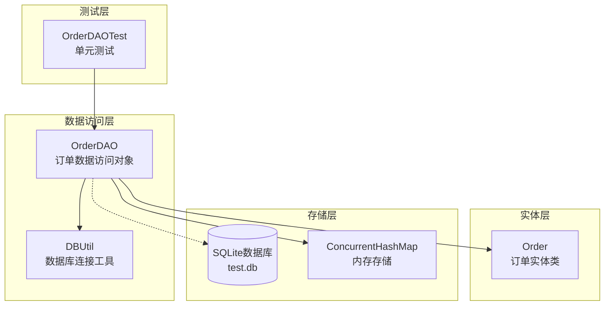
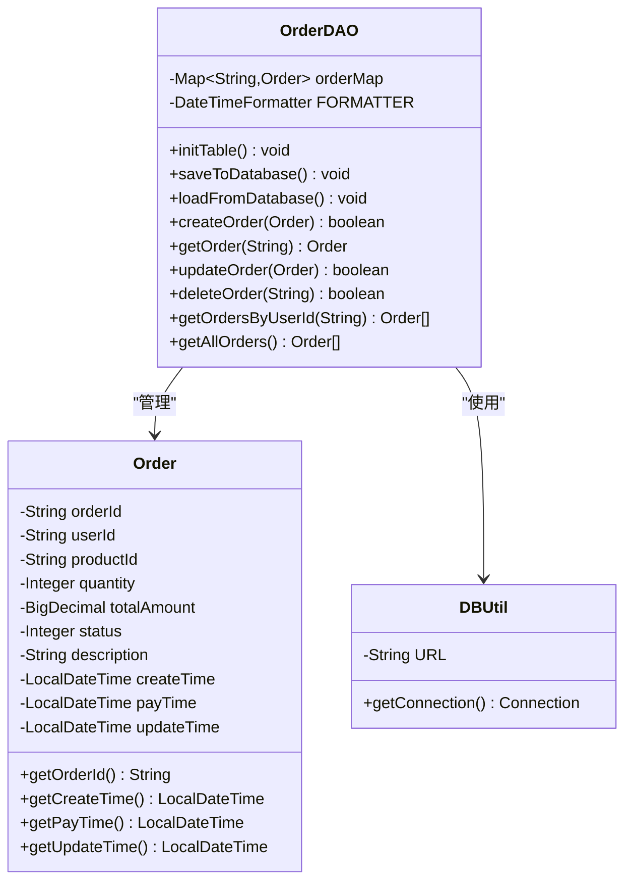
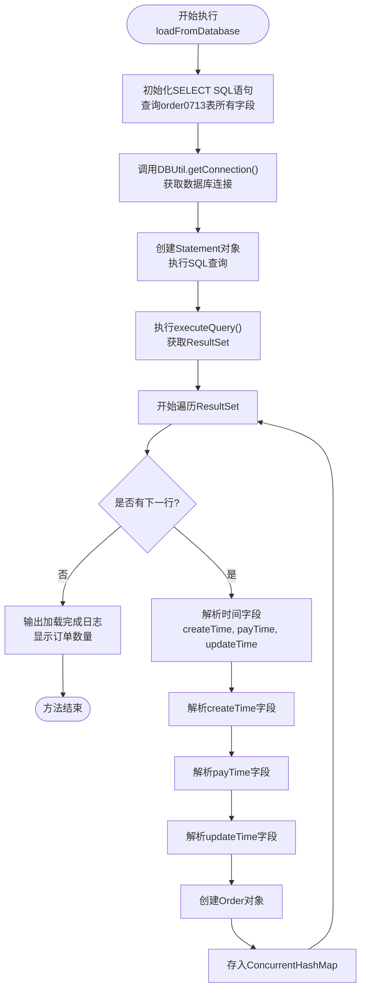
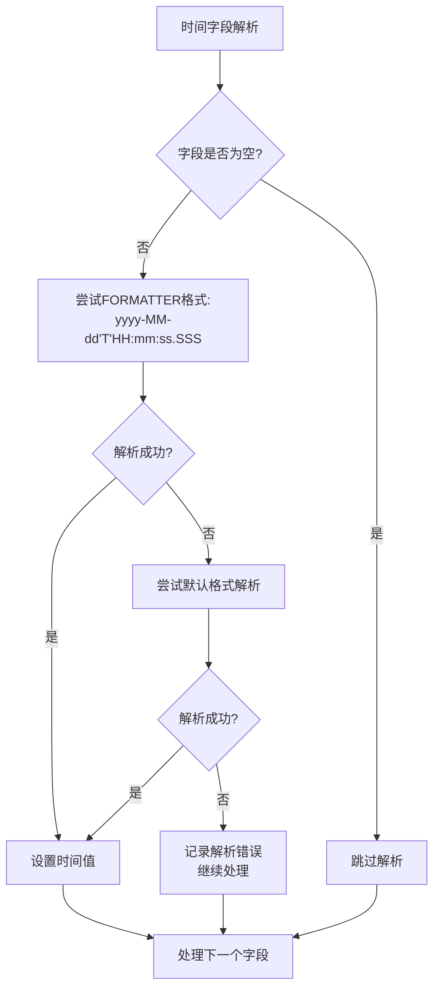
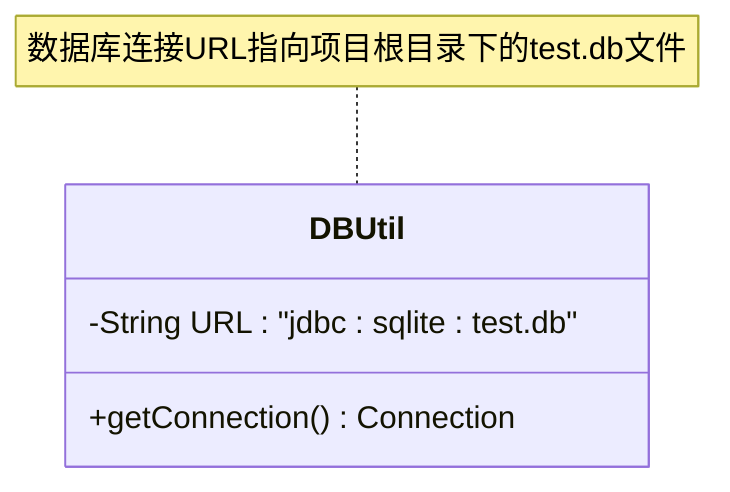
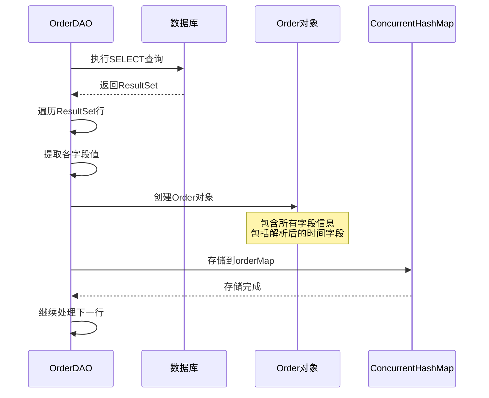
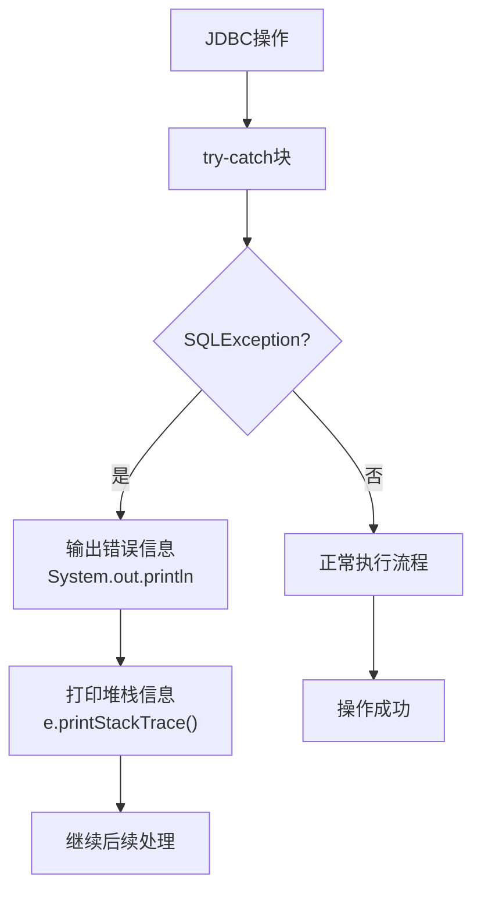

# 数据加载机制

<cite>
**本文档中引用的文件**
- [OrderDAO.java](file://src/main/java/com/example/demo/dao/OrderDAO.java)
- [DBUtil.java](file://src/main/java/com/example/demo/dao/DBUtil.java)
- [Order.java](file://src/main/java/com/example/demo/entity/Order.java)
- [OrderDAOTest.java](file://src/test/java/com/example/demo/dao/OrderDAOTest.java)
</cite>

## 目录
1. [概述](#概述)
2. [项目架构](#项目架构)
3. [核心组件分析](#核心组件分析)
4. [loadFromDatabase()方法深度解析](#loadfromdatabase方法深度解析)
5. [时间字段解析策略](#时间字段解析策略)
6. [数据库连接管理](#数据库连接管理)
7. [数据封装与存储](#数据封装与存储)
8. [异常处理机制](#异常处理机制)
9. [性能考虑](#性能考虑)
10. [测试验证](#测试验证)
11. [总结](#总结)

## 概述

OrderDAO类是系统数据访问层的核心组件，负责订单数据的持久化操作。该类实现了内存与SQLite数据库之间的双向同步机制，其中`loadFromDatabase()`方法作为关键的数据加载入口，负责从SQLite数据库中读取订单数据并构建内存中的订单映射。

## 项目架构



**图表来源**
- [OrderDAO.java](file://src/main/java/com/example/demo/dao/OrderDAO.java#L18-L248)
- [DBUtil.java](file://src/main/java/com/example/demo/dao/DBUtil.java#L1-L19)
- [Order.java](file://src/main/java/com/example/demo/entity/Order.java#L1-L162)

**章节来源**
- [OrderDAO.java](file://src/main/java/com/example/demo/dao/OrderDAO.java#L1-L248)
- [DBUtil.java](file://src/main/java/com/example/demo/dao/DBUtil.java#L1-L19)

## 核心组件分析

### OrderDAO类设计

OrderDAO采用单例模式和线程安全的设计原则，使用`ConcurrentHashMap`作为内存存储容器，确保多线程环境下的数据一致性。



**图表来源**
- [OrderDAO.java](file://src/main/java/com/example/demo/dao/OrderDAO.java#L18-L248)
- [Order.java](file://src/main/java/com/example/demo/entity/Order.java#L9-L162)
- [DBUtil.java](file://src/main/java/com/example/demo/dao/DBUtil.java#L9-L19)

**章节来源**
- [OrderDAO.java](file://src/main/java/com/example/demo/dao/OrderDAO.java#L18-L248)
- [Order.java](file://src/main/java/com/example/demo/entity/Order.java#L9-L162)

## loadFromDatabase()方法深度解析

### 方法执行流程

`loadFromDatabase()`方法是OrderDAO的核心数据加载入口，其执行流程如下：



**图表来源**
- [OrderDAO.java](file://src/main/java/com/example/demo/dao/OrderDAO.java#L83-L153)

### 关键实现细节

#### 1. SQL查询构建
方法首先构建标准的SELECT语句，查询order0713表中的所有必要字段：
- 基础信息：orderId, userId, productId, quantity, totalAmount, status, description
- 时间字段：createTime, payTime, updateTime

#### 2. JDBC资源管理
使用Java 7+的try-with-resources语法，确保数据库资源的自动关闭：
- Connection自动关闭
- Statement自动关闭  
- ResultSet自动关闭

#### 3. 结果集处理
通过`while (rs.next())`循环逐行处理查询结果，每行数据对应一个订单记录。

**章节来源**
- [OrderDAO.java](file://src/main/java/com/example/demo/dao/OrderDAO.java#L83-L153)

## 时间字段解析策略

### 多格式解析机制

OrderDAO对LocalDateTime类型的字段实现了智能的时间格式解析策略，确保不同格式的时间字符串都能被正确解析。



**图表来源**
- [OrderDAO.java](file://src/main/java/com/example/demo/dao/OrderDAO.java#L96-L136)

### 具体解析逻辑

#### 1. 格式化器定义
```java
private static final DateTimeFormatter FORMATTER = DateTimeFormatter.ofPattern("yyyy-MM-dd'T'HH:mm:ss.SSS");
```

#### 2. 解析步骤详解

对于每个时间字段（createTime、payTime、updateTime），执行以下解析流程：

**步骤1：检查字段值**
```java
String timeStr = rs.getString("fieldName");
if (timeStr != null && !timeStr.isEmpty()) {
    // 执行解析逻辑
}
```

**步骤2：优先格式化解析**
```java
try {
    timeValue = LocalDateTime.parse(timeStr, FORMATTER);
} catch (Exception e) {
    // 格式化解析失败，尝试默认解析
}
```

**步骤3：默认格式解析**
```java
try {
    timeValue = LocalDateTime.parse(timeStr);
} catch (Exception e2) {
    // 默认解析也失败，记录错误但不中断
    System.out.println(fieldName + "解析失败: " + timeStr);
}
```

#### 3. 异常处理策略

- **解析失败不影响整体流程**：即使某个时间字段解析失败，也不会中断整个数据加载过程
- **错误信息记录**：通过控制台输出具体的解析失败信息，便于调试
- **空值处理**：跳过空值字段的解析，保持原有null值

**章节来源**
- [OrderDAO.java](file://src/main/java/com/example/demo/dao/OrderDAO.java#L96-L136)

## 数据库连接管理

### DBUtil工具类设计

DBUtil类提供统一的数据库连接管理，采用静态工厂方法模式：



**图表来源**
- [DBUtil.java](file://src/main/java/com/example/demo/dao/DBUtil.java#L9-L19)

### 连接获取机制

#### 1. 连接URL配置
```java
private static final String URL = "jdbc:sqlite:test.db";
```
- 使用相对路径定位数据库文件
- 文件位于项目根目录下
- SQLite数据库文件扩展名为.db

#### 2. 安全连接获取
```java
public static Connection getConnection() throws SQLException {
    return DriverManager.getConnection(URL);
}
```
- 直接调用DriverManager获取连接
- 抛出SQLException异常，上层调用者负责处理
- 不包含任何连接池或超时配置，保持简单性

#### 3. 与OrderDAO的集成

OrderDAO通过以下方式获取数据库连接：
```java
try (Connection conn = DBUtil.getConnection();
     Statement stmt = conn.createStatement();
     ResultSet rs = stmt.executeQuery(sql)) {
    // 数据处理逻辑
}
```

**章节来源**
- [DBUtil.java](file://src/main/java/com/example/demo/dao/DBUtil.java#L16-L18)
- [OrderDAO.java](file://src/main/java/com/example/demo/dao/OrderDAO.java#L86-L88)

## 数据封装与存储

### Order对象创建流程

每次从数据库读取一行记录时，都会创建一个新的Order对象并存入内存映射：



**图表来源**
- [OrderDAO.java](file://src/main/java/com/example/demo/dao/OrderDAO.java#L139-L151)

### 字段映射关系

| 数据库字段 | Order属性 | 类型 | 描述 |
|------------|-----------|------|------|
| orderId | orderId | String | 订单唯一标识符 |
| userId | userId | String | 用户标识符 |
| productId | productId | String | 商品标识符 |
| quantity | quantity | Integer | 购买数量 |
| totalAmount | totalAmount | BigDecimal | 订单总金额 |
| status | status | Integer | 订单状态 |
| description | description | String | 订单描述 |
| createTime | createTime | LocalDateTime | 创建时间 |
| payTime | payTime | LocalDateTime | 支付时间 |
| updateTime | updateTime | LocalDateTime | 更新时间 |

### 并发安全性

- 使用`ConcurrentHashMap`作为内存存储容器
- 支持多线程并发访问
- 自动处理线程安全问题
- 提供高效的并发读写性能

**章节来源**
- [OrderDAO.java](file://src/main/java/com/example/demo/dao/OrderDAO.java#L139-L151)
- [OrderDAO.java](file://src/main/java/com/example/demo/dao/OrderDAO.java#L20-L20)

## 异常处理机制

### JDBC异常处理

OrderDAO对JDBC操作实施了完善的异常处理策略：



**图表来源**
- [OrderDAO.java](file://src/main/java/com/example/demo/dao/OrderDAO.java#L154-L157)

### 异常处理特点

#### 1. 错误信息输出
```java
System.out.println("数据加载失败: " + e.getMessage());
```
- 明确指出操作类型（数据加载）
- 输出具体的错误消息
- 便于问题诊断

#### 2. 堆栈跟踪
```java
e.printStackTrace();
```
- 提供完整的异常堆栈信息
- 包含异常发生的精确位置
- 支持开发人员深入分析问题根源

#### 3. 异常传播
- SQLException被抛出给调用者
- 上层调用者可以根据业务需求决定如何处理
- 保持异常处理的灵活性

**章节来源**
- [OrderDAO.java](file://src/main/java/com/example/demo/dao/OrderDAO.java#L154-L157)

## 性能考虑

### 资源管理优化

#### 1. 自动资源管理
- 使用try-with-resources确保资源及时释放
- 避免Connection、Statement、ResultSet的内存泄漏
- 减少数据库连接的持有时间

#### 2. 批量处理准备
虽然当前实现是一行一行处理，但为未来的批量优化预留了空间：
- ResultSet的逐行处理模式
- 为可能的批量插入做好准备

### 内存使用优化

#### 1. ConcurrentHashMap选择
- 线程安全的并发访问
- 支持高并发读写操作
- 内存使用效率较高

#### 2. 对象生命周期
- 每次处理完一行就创建新的Order对象
- 及时释放不再需要的对象引用
- GC可以有效回收临时对象

### 时间复杂度分析

- **时间复杂度**：O(n)，其中n为数据库记录数
- **空间复杂度**：O(n)，存储所有订单对象
- **主要瓶颈**：数据库I/O操作和时间字段解析

## 测试验证

### 单元测试覆盖

OrderDAOTest类提供了全面的测试覆盖，验证loadFromDatabase方法的各项功能：

#### 1. 基础功能测试
- **测试创建订单**：验证订单创建的基本功能
- **测试获取订单**：验证订单检索功能
- **测试更新订单**：验证订单修改功能
- **测试删除订单**：验证订单删除功能

#### 2. 查询功能测试
- **按用户ID查询**：验证用户订单隔离性和排序功能
- **多用户订单隔离**：验证不同用户订单的独立性
- **时间排序验证**：验证订单按创建时间降序排列

#### 3. 特殊情况测试
- **空值处理**：验证null值字段的正确处理
- **重复订单检测**：验证订单ID唯一性约束
- **边界条件测试**：验证各种边界情况

### 测试数据准备

测试类通过多种方式准备测试数据：
- 使用不同的时间戳验证排序功能
- 创建多用户订单验证隔离性
- 设置null值验证空值处理

**章节来源**
- [OrderDAOTest.java](file://src/test/java/com/example/demo/dao/OrderDAOTest.java#L1-L239)

## 总结

OrderDAO的`loadFromDatabase()`方法实现了一个完整、健壮的数据加载机制，具有以下特点：

### 技术优势

1. **健壮的时间解析**：支持多种时间格式，确保数据兼容性
2. **完善的异常处理**：提供详细的错误信息和堆栈跟踪
3. **线程安全设计**：使用ConcurrentHashMap保证并发安全
4. **资源管理优化**：自动资源管理避免内存泄漏
5. **清晰的架构分离**：DBUtil提供独立的连接管理

### 设计亮点

- **多格式解析策略**：优先使用预定义格式，失败时回退到默认格式
- **渐进式异常处理**：解析失败不影响整体流程
- **灵活的测试覆盖**：全面的单元测试确保功能正确性
- **简洁的API设计**：单一职责，易于理解和维护

### 应用价值

该实现为系统提供了可靠的数据持久化基础，支持：
- 订单数据的内存缓存
- 数据库与内存的双向同步
- 高并发场景下的稳定运行
- 未来功能扩展的技术基础

通过深入分析这个方法的实现细节，我们可以看到这是一个经过精心设计的数据访问层实现，既满足了当前功能需求，又为未来的扩展和优化奠定了良好的基础。