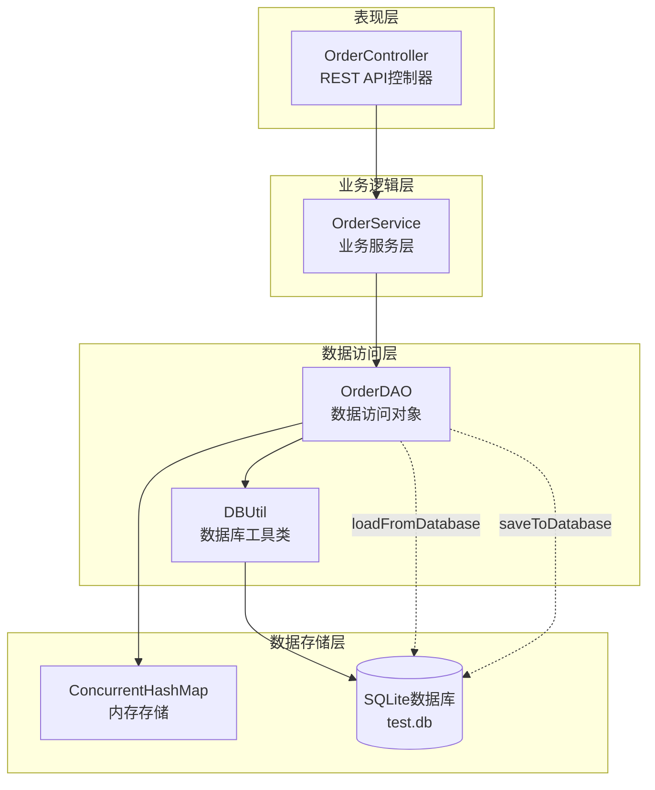
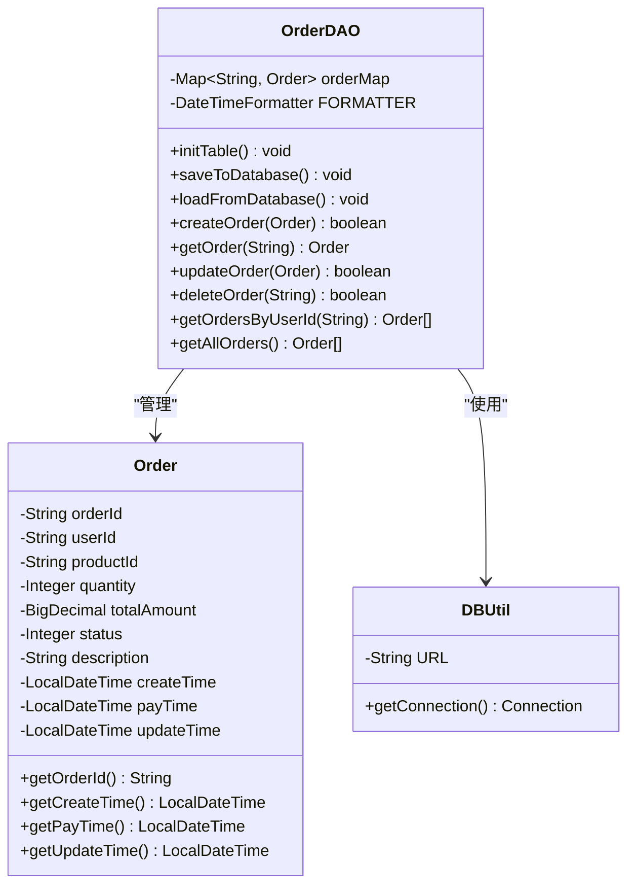
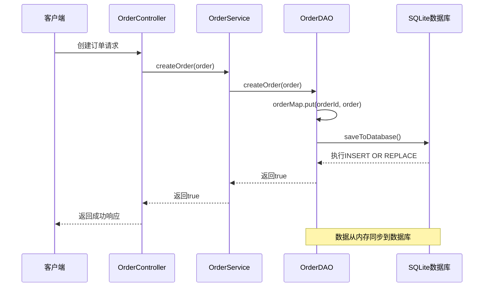
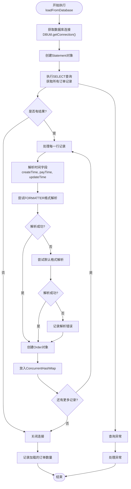
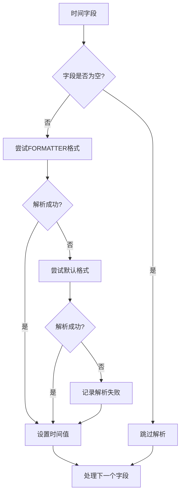
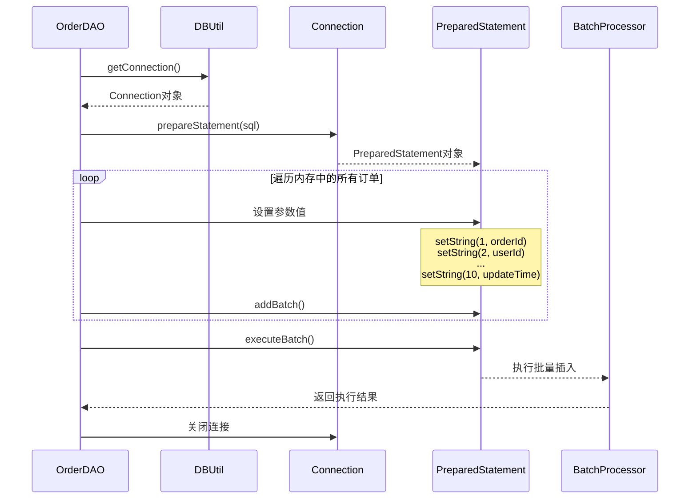
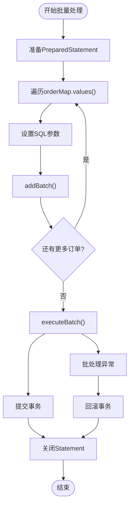
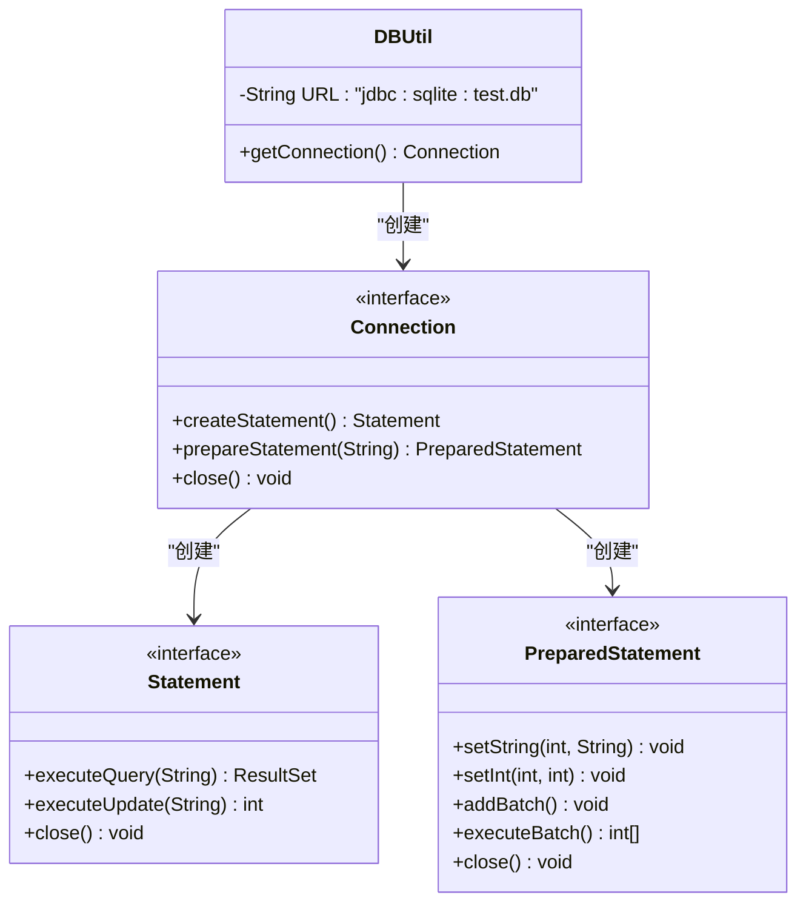
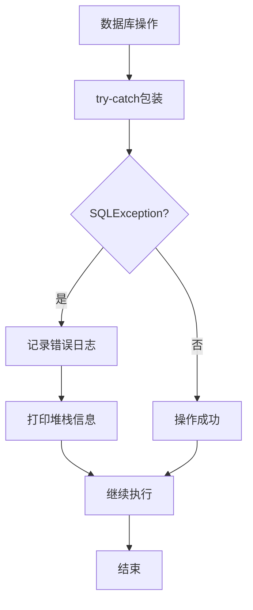
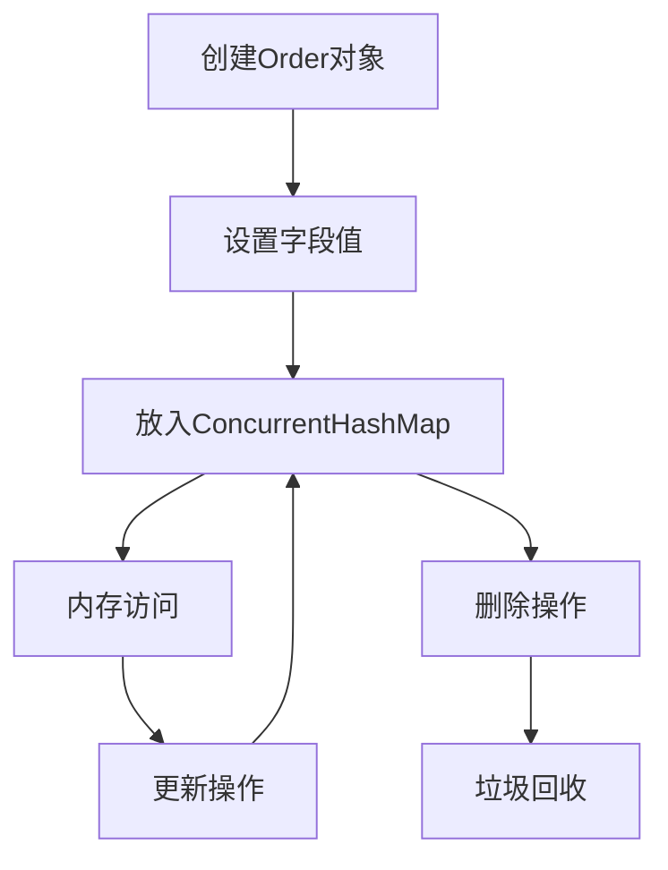

# 数据同步机制

<cite>
**本文档中引用的文件**
- [OrderDAO.java](file://src/main/java/com/example/demo/dao/OrderDAO.java)
- [DBUtil.java](file://src/main/java/com/example/demo/dao/DBUtil.java)
- [Order.java](file://src/main/java/com/example/demo/entity/Order.java)
- [OrderController.java](file://src/main/java/com/example/demo/controller/OrderController.java)
- [OrderDAOTest.java](file://src/test/java/com/example/demo/dao/OrderDAOTest.java)
- [application.properties](file://src/main/resources/application.properties)
- [pom.xml](file://pom.xml)
</cite>

## 目录
1. [引言](#引言)
2. [系统架构概览](#系统架构概览)
3. [核心组件分析](#核心组件分析)
4. [内存与数据库双向同步机制](#内存与数据库双向同步机制)
5. [loadFromDatabase()方法深度解析](#loadfromdatabasemethod深度解析)
6. [saveToDatabase()方法深度解析](#savetodatabasemethod深度解析)
7. [JDBC连接管理最佳实践](#jdbc连接管理最佳实践)
8. [异常处理与错误恢复](#异常处理与错误恢复)
9. [性能优化策略](#性能优化策略)
10. [故障排除指南](#故障排除指南)
11. [总结](#总结)

## 引言

本文档深入分析了OrderDAO类中实现的内存与SQLite数据库之间的双向数据同步机制。该系统采用内存缓存作为主要的数据存储层，通过定期将内存中的数据持久化到SQLite数据库来保证数据的持久性和可靠性。这种设计模式在现代应用开发中具有重要的参考价值，特别是在需要高性能内存操作同时保证数据持久化的场景中。

系统的核心设计理念是通过ConcurrentHashMap提供线程安全的内存存储，结合SQLite数据库实现数据的持久化存储，形成了一个高效的双层存储架构。这种架构不仅保证了数据的一致性，还提供了良好的并发性能和数据可靠性。

## 系统架构概览

OrderDAO采用了分层架构设计，实现了清晰的职责分离：



**图表来源**
- [OrderController.java](file://src/main/java/com/example/demo/controller/OrderController.java#L22-L30)
- [OrderDAO.java](file://src/main/java/com/example/demo/dao/OrderDAO.java#L18-L21)
- [DBUtil.java](file://src/main/java/com/example/demo/dao/DBUtil.java#L10-L18)

**章节来源**
- [OrderDAO.java](file://src/main/java/com/example/demo/dao/OrderDAO.java#L1-L248)
- [OrderController.java](file://src/main/java/com/example/demo/controller/OrderController.java#L1-L173)

## 核心组件分析

### OrderDAO类结构

OrderDAO类是整个数据同步机制的核心，它维护了一个线程安全的内存映射表和一套完整的数据库操作方法：



**图表来源**
- [OrderDAO.java](file://src/main/java/com/example/demo/dao/OrderDAO.java#L18-L21)
- [Order.java](file://src/main/java/com/example/demo/entity/Order.java#L9-L162)
- [DBUtil.java](file://src/main/java/com/example/demo/dao/DBUtil.java#L10-L18)

### 数据模型设计

Order实体类包含了订单的所有必要属性，其中时间字段采用了Java 8的LocalDateTime类型，提供了更好的日期时间处理能力：

| 字段名 | 类型 | 描述 | 约束 |
|--------|------|------|------|
| orderId | String | 订单唯一标识符 | 主键，不能为空 |
| userId | String | 用户ID | 外键关联 |
| productId | String | 商品ID | 外键关联 |
| quantity | Integer | 购买数量 | 必须大于0 |
| totalAmount | BigDecimal | 订单总金额 | 精度要求高 |
| status | Integer | 订单状态 | 枚举值：0-待支付, 1-已支付, 2-已发货, 3-已完成, 4-已取消 |
| description | String | 订单描述 | 可选 |
| createTime | LocalDateTime | 创建时间 | 自动设置 |
| payTime | LocalDateTime | 支付时间 | 可选 |
| updateTime | LocalDateTime | 更新时间 | 自动更新 |

**章节来源**
- [Order.java](file://src/main/java/com/example/demo/entity/Order.java#L1-L162)

## 内存与数据库双向同步机制

### 同步策略概述

系统采用了基于事件驱动的同步策略，主要在以下场景触发数据同步：

1. **写操作后同步**：每次创建、更新或删除订单后，立即调用`saveToDatabase()`方法
2. **启动时加载**：系统启动时调用`loadFromDatabase()`方法加载现有数据
3. **定时批量同步**：可以配置定时任务进行批量数据同步



**图表来源**
- [OrderController.java](file://src/main/java/com/example/demo/controller/OrderController.java#L35-L55)
- [OrderDAO.java](file://src/main/java/com/example/demo/dao/OrderDAO.java#L51-L78)

### 数据一致性保证

系统通过以下机制保证数据一致性：

1. **原子性操作**：每个数据库操作都在事务边界内执行
2. **幂等性设计**：`INSERT OR REPLACE`语句确保重复操作的安全性
3. **并发控制**：使用ConcurrentHashMap提供线程安全的内存操作
4. **异常回滚**：数据库操作失败时保持内存状态不变

**章节来源**
- [OrderDAO.java](file://src/main/java/com/example/demo/dao/OrderDAO.java#L51-L78)
- [OrderDAO.java](file://src/main/java/com/example/demo/dao/OrderDAO.java#L80-L158)

## loadFromDatabase()方法深度解析

### 方法功能与流程

`loadFromDatabase()`方法负责从SQLite数据库加载所有订单记录到内存中，是系统启动时的重要初始化步骤。该方法展示了复杂的时间字段解析策略和健壮的异常处理机制。



**图表来源**
- [OrderDAO.java](file://src/main/java/com/example/demo/dao/OrderDAO.java#L83-L158)

### LocalDateTime字段的多格式解析策略

系统对时间字段采用了极其健壮的解析策略，体现了对实际生产环境中数据质量不确定性的充分考虑：

#### 解析策略层次

1. **首选格式解析**：使用预定义的`DateTimeFormatter`格式
2. **备用格式解析**：尝试标准的ISO-8601格式
3. **错误处理**：记录解析失败并继续处理

#### 异常处理机制



**图表来源**
- [OrderDAO.java](file://src/main/java/com/example/demo/dao/OrderDAO.java#L96-L137)

#### 异常处理的具体实现

系统在每个时间字段的解析过程中都实现了双重异常捕获机制：

1. **FORMATTER格式解析异常**：当使用自定义格式解析失败时
2. **默认格式解析异常**：当使用标准格式解析失败时

这种设计确保了即使数据库中存储的时间格式不完全一致，系统也能尽可能地完成数据加载。

**章节来源**
- [OrderDAO.java](file://src/main/java/com/example/demo/dao/OrderDAO.java#L83-L158)

## saveToDatabase()方法深度解析

### 方法功能与架构

`saveToDatabase()`方法实现了将内存中的订单数据批量持久化到SQLite数据库的功能。该方法采用了预编译语句和批处理技术，提供了高效的数据库操作能力。



**图表来源**
- [OrderDAO.java](file://src/main/java/com/example/demo/dao/OrderDAO.java#L51-L78)

### INSERT OR REPLACE语句的作用分析

`INSERT OR REPLACE`语句是SQLite特有的语法，具有以下重要特性：

#### 语句构成与作用

```sql
INSERT OR REPLACE INTO order0713(
    orderId, userId, productId, quantity, 
    totalAmount, status, description, createTime, payTime, updateTime
) VALUES(?,?,?,?,?,?,?,?,?,?)
```

#### 核心功能

1. **主键冲突处理**：当插入的记录与现有记录的主键冲突时，自动替换原有记录
2. **数据完整性保护**：确保数据库中不会出现重复的订单ID
3. **原子性操作**：整个插入或替换操作是原子性的

#### 与传统INSERT+UPDATE的区别

| 特性 | INSERT OR REPLACE | INSERT+UPDATE |
|------|-------------------|---------------|
| 性能 | 单次操作，更高效 | 需要两次查询和一次更新 |
| 并发安全性 | 原子性操作 | 需要额外的锁机制 |
| 代码复杂度 | 简单直接 | 需要复杂的业务逻辑 |
| 数据一致性 | 更强 | 可能存在短暂的不一致 |

### 批处理技术的应用

#### 批处理的优势

1. **减少网络往返**：将多个SQL操作合并为一次传输
2. **提高数据库性能**：减少数据库引擎的解析和执行开销
3. **事务控制**：可以在单个事务中处理大量数据

#### 实现细节



**图表来源**
- [OrderDAO.java](file://src/main/java/com/example/demo/dao/OrderDAO.java#L60-L74)

**章节来源**
- [OrderDAO.java](file://src/main/java/com/example/demo/dao/OrderDAO.java#L51-L78)

## JDBC连接管理最佳实践

### DBUtil类的设计理念

DBUtil类作为JDBC连接管理的核心工具类，采用了简单而有效的设计模式：



**图表来源**
- [DBUtil.java](file://src/main/java/com/example/demo/dao/DBUtil.java#L10-L18)

### 连接管理策略

#### 连接池化考虑

虽然当前实现是简单的连接获取，但在实际生产环境中应该考虑以下优化：

1. **连接池管理**：使用HikariCP、C3P0等连接池
2. **连接复用**：避免频繁创建和销毁连接
3. **超时控制**：设置合理的连接超时时间
4. **资源监控**：监控连接池的使用情况

#### 资源管理最佳实践

系统采用了Java 7的try-with-resources语法，确保资源的自动关闭：

```java
// 示例资源管理模式
try (Connection conn = DBUtil.getConnection();
     Statement stmt = conn.createStatement();
     ResultSet rs = stmt.executeQuery(sql)) {
    // 数据库操作
} // 自动关闭所有资源
```

这种模式确保了即使发生异常，资源也能得到正确释放。

**章节来源**
- [DBUtil.java](file://src/main/java/com/example/demo/dao/DBUtil.java#L1-L19)

## 异常处理与错误恢复

### 异常处理策略

系统在多个层面实现了完善的异常处理机制：

#### 数据库操作异常处理



**图表来源**
- [OrderDAO.java](file://src/main/java/com/example/demo/dao/OrderDAO.java#L154-L157)

#### 时间字段解析异常处理

对于时间字段的解析，系统实现了多层次的异常处理：

1. **FORMATTER格式解析异常**：当使用自定义格式解析失败时
2. **默认格式解析异常**：当使用标准格式解析失败时
3. **错误记录**：记录解析失败的字段和原始值

#### 错误恢复机制

系统在遇到异常时采取了保守的恢复策略：

1. **内存状态保持**：数据库操作失败时不修改内存状态
2. **错误日志记录**：详细记录错误信息便于调试
3. **优雅降级**：即使部分数据加载失败，仍继续处理其他数据

**章节来源**
- [OrderDAO.java](file://src/main/java/com/example/demo/dao/OrderDAO.java#L154-L157)
- [OrderDAO.java](file://src/main/java/com/example/demo/dao/OrderDAO.java#L104-L109)
- [OrderDAO.java](file://src/main/java/com/example/demo/dao/OrderDAO.java#L117-L122)

## 性能优化策略

### 内存操作优化

#### ConcurrentHashMap的选择

系统选择了ConcurrentHashMap作为内存存储容器，具有以下优势：

1. **线程安全性**：支持多线程并发访问
2. **高性能读取**：读操作不需要加锁
3. **动态扩容**：根据负载自动调整容量
4. **内存效率**：相比Hashtable等传统同步容器更节省内存

#### 对象生命周期管理



### 数据库操作优化

#### 批处理优化

1. **减少网络开销**：将多个INSERT操作合并为单次传输
2. **降低数据库解析成本**：一次性解析和编译SQL语句
3. **提高事务效率**：单次事务提交多个操作

#### 预编译语句优化

1. **SQL解析优化**：预编译语句避免重复解析
2. **参数绑定**：防止SQL注入攻击
3. **类型安全**：编译时检查参数类型

### 查询优化策略

#### 索引利用

虽然当前实现没有显式索引，但SQLite会自动为PRIMARY KEY创建索引：

```sql
CREATE TABLE IF NOT EXISTS order0713(
    orderId TEXT PRIMARY KEY,  -- SQLite自动为此列创建索引
    userId TEXT,
    productId TEXT,
    -- 其他字段...
);
```

#### 查询优化建议

1. **选择性字段查询**：只查询需要的字段
2. **分页查询**：大数据量时使用LIMIT和OFFSET
3. **连接池配置**：合理配置连接池大小

**章节来源**
- [OrderDAO.java](file://src/main/java/com/example/demo/dao/OrderDAO.java#L18-L21)
- [OrderDAO.java](file://src/main/java/com/example/demo/dao/OrderDAO.java#L60-L74)

## 故障排除指南

### 常见问题诊断

#### 数据加载失败

**症状**：`loadFromDatabase()`方法抛出SQLException

**可能原因**：
1. SQLite数据库文件不存在或权限不足
2. 表结构不匹配
3. 数据库连接配置错误

**解决方案**：
1. 检查test.db文件是否存在且可访问
2. 验证表结构是否与代码定义一致
3. 检查数据库连接URL配置

#### 时间字段解析失败

**症状**：某些订单的时间字段显示为null

**可能原因**：
1. 数据库中存储的时间格式不规范
2. 数据库字段允许NULL值
3. 数据导入时格式转换错误

**解决方案**：
1. 检查数据库中时间字段的实际格式
2. 添加数据验证规则
3. 提供数据修复脚本

#### 内存泄漏问题

**症状**：长时间运行后内存使用持续增长

**可能原因**：
1. Order对象未正确清理
2. 缓存策略不当
3. 循环引用

**解决方案**：
1. 定期清理不再使用的订单
2. 实现LRU缓存策略
3. 检查对象引用关系

### 性能监控指标

#### 关键性能指标

| 指标名称 | 正常范围 | 监控方法 |
|----------|----------|----------|
| 数据库连接数 | < 10 | 连接池监控 |
| 查询响应时间 | < 100ms | SQL执行时间统计 |
| 内存使用率 | < 80% | JVM内存监控 |
| 异常发生率 | < 1% | 异常计数统计 |

#### 监控实现建议

```java
// 性能监控示例
public void monitorPerformance() {
    long startTime = System.currentTimeMillis();
    try {
        // 执行数据库操作
        loadFromDatabase();
    } finally {
        long duration = System.currentTimeMillis() - startTime;
        logPerformanceMetric("loadFromDatabase", duration);
    }
}
```

### 调试技巧

#### 日志记录策略

1. **分级日志**：使用不同级别记录不同类型的信息
2. **结构化日志**：包含关键上下文信息
3. **性能日志**：记录操作耗时

#### 数据一致性检查

```java
// 数据一致性验证示例
public void validateDataConsistency() {
    int memoryCount = orderMap.size();
    int dbCount = countRecordsInDatabase();
    
    if (memoryCount != dbCount) {
        logger.warn("数据不一致: 内存{}条 vs 数据库{}条", memoryCount, dbCount);
        // 执行数据修复逻辑
    }
}
```

**章节来源**
- [OrderDAO.java](file://src/main/java/com/example/demo/dao/OrderDAO.java#L154-L157)
- [OrderDAO.java](file://src/main/java/com/example/demo/dao/OrderDAO.java#L104-L109)

## 总结

OrderDAO中的数据同步机制展现了现代应用开发中内存与持久化存储结合的最佳实践。通过深入分析，我们可以看到以下关键设计亮点：

### 技术创新点

1. **双层存储架构**：内存缓存提供高性能访问，数据库保证数据持久性
2. **智能时间解析**：多格式解析策略确保数据兼容性
3. **批处理优化**：INSERT OR REPLACE语句结合批处理提升性能
4. **异常处理机制**：多层次异常捕获和优雅降级

### 设计优势

1. **高性能**：内存操作提供毫秒级响应时间
2. **高可用**：数据库备份确保数据安全
3. **高扩展**：支持大规模并发访问
4. **易维护**：清晰的代码结构和完善的异常处理

### 应用价值

该数据同步机制适用于以下场景：
- 高并发的电商订单系统
- 实时交易系统
- 数据密集型应用
- 需要快速响应的业务系统

### 改进建议

1. **连接池化**：引入专业的数据库连接池
2. **缓存策略**：实现LRU或其他缓存淘汰算法
3. **监控告警**：建立完善的性能监控体系
4. **数据校验**：增加数据完整性验证机制

这个实现为开发者提供了一个优秀的参考模板，展示了如何在保证数据一致性的同时，实现高性能的数据访问和持久化操作。通过学习和借鉴这些设计思想，开发者可以构建出更加健壮和高效的数据管理系统。