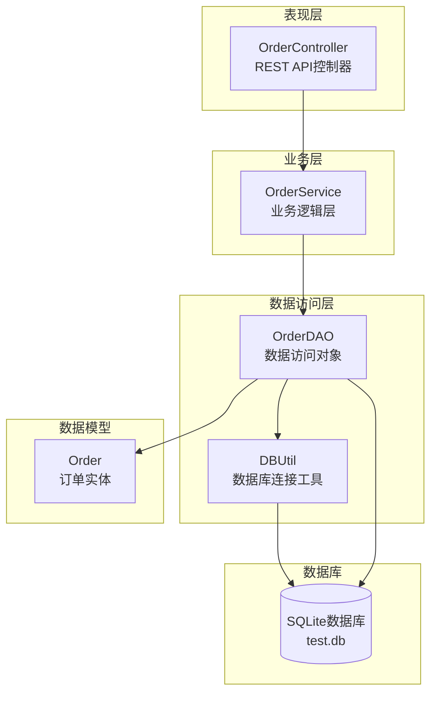
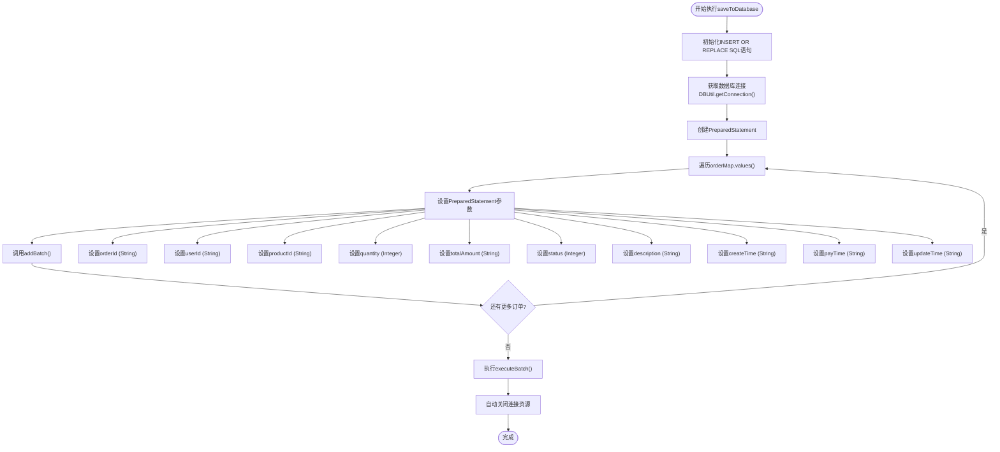
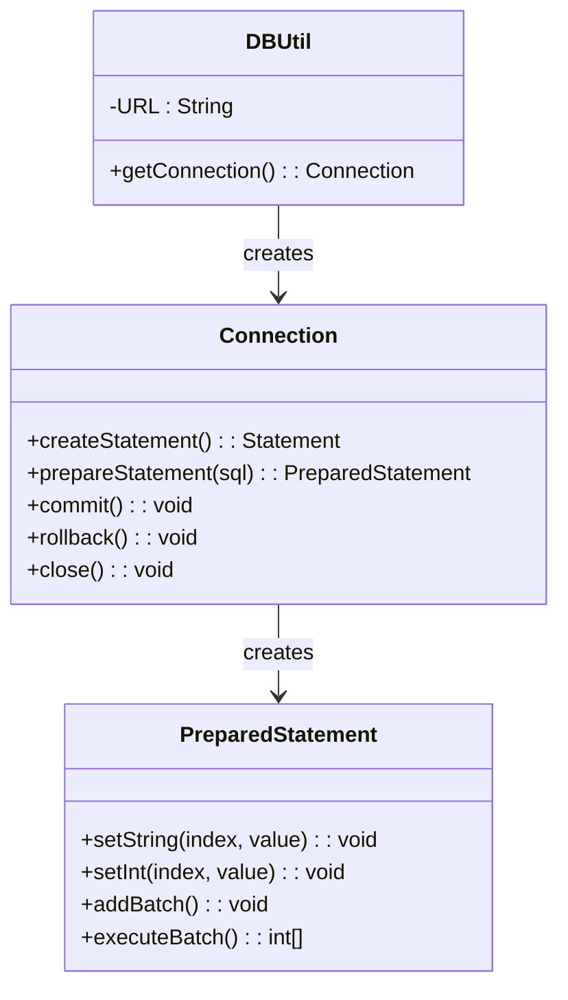
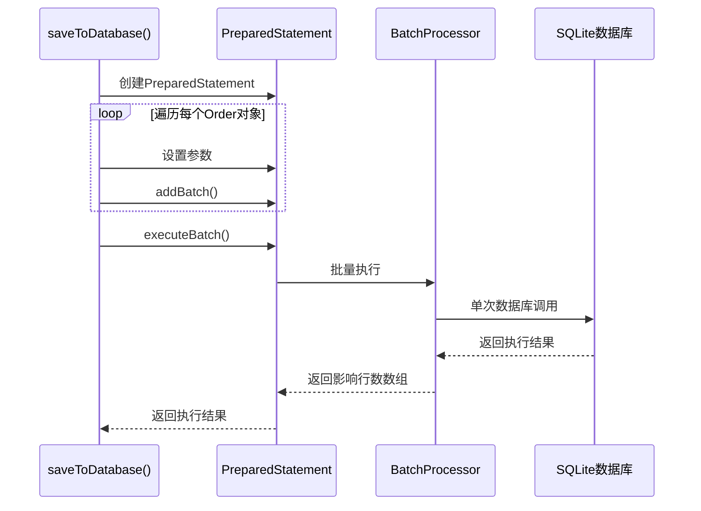
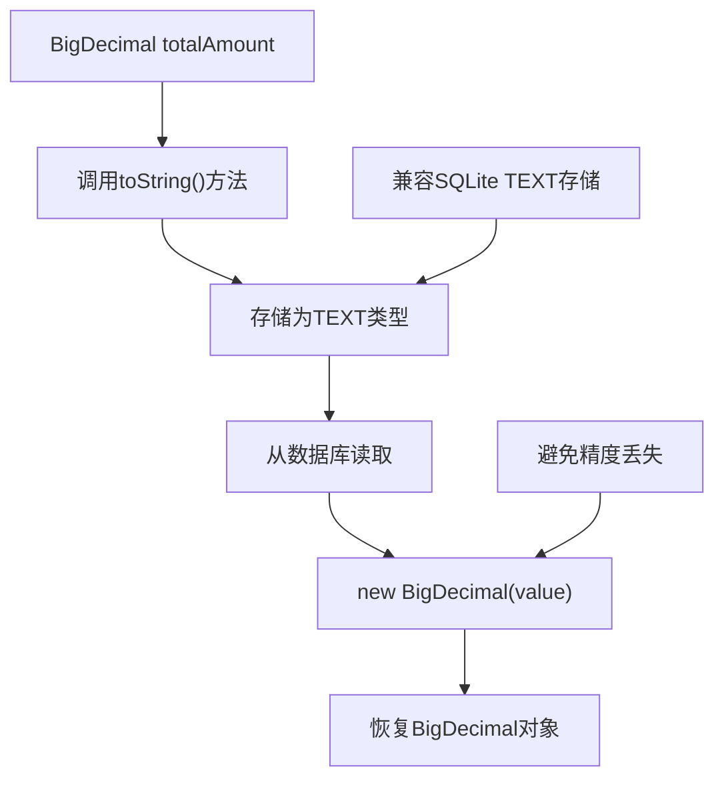
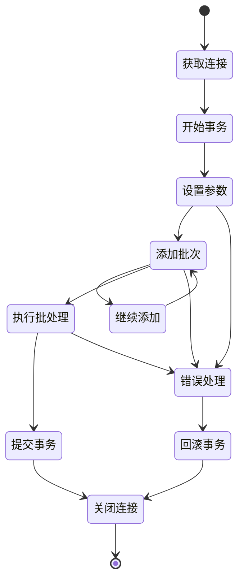

# 数据持久化机制

<cite>
**本文档引用的文件**
- [OrderDAO.java](file://src/main/java/com/example/demo/dao/OrderDAO.java)
- [DBUtil.java](file://src/main/java/com/example/demo/dao/DBUtil.java)
- [Order.java](file://src/main/java/com/example/demo/entity/Order.java)
- [OrderController.java](file://src/main/java/com/example/demo/controller/OrderController.java)
- [OrderDAOTest.java](file://src/test/java/com/example/demo/dao/OrderDAOTest.java)
- [pom.xml](file://pom.xml)
</cite>

## 目录
1. [概述](#概述)
2. [项目架构](#项目架构)
3. [saveToDatabase()方法详解](#savetodatabase方法详解)
4. [数据库连接管理](#数据库连接管理)
5. [预编译SQL语句机制](#预编译sql语句机制)
6. [批处理优化](#批处理优化)
7. [数据类型转换](#数据类型转换)
8. [事务边界控制](#事务边界控制)
9. [错误处理机制](#错误处理机制)
10. [使用场景分析](#使用场景分析)
11. [性能优化建议](#性能优化建议)
12. [总结](#总结)

## 概述

OrderDAO类是系统数据访问层的核心组件，负责订单数据的持久化操作。该类实现了内存与SQLite数据库之间的双向同步机制，其中`saveToDatabase()`方法是数据持久化的关键入口，采用预编译SQL语句和批处理技术实现高效的数据写入。

## 项目架构



**图表来源**
- [OrderController.java](file://src/main/java/com/example/demo/controller/OrderController.java#L23-L30)
- [OrderDAO.java](file://src/main/java/com/example/demo/dao/OrderDAO.java#L18-L21)
- [DBUtil.java](file://src/main/java/com/example/demo/dao/DBUtil.java#L10-L18)

**章节来源**
- [OrderDAO.java](file://src/main/java/com/example/demo/dao/OrderDAO.java#L1-L248)
- [OrderController.java](file://src/main/java/com/example/demo/controller/OrderController.java#L1-L173)

## saveToDatabase()方法详解

### 方法签名与功能

`saveToDatabase()`方法是一个无参数的void方法，负责将内存中的订单数据批量保存到SQLite数据库中。该方法采用"INSERT OR REPLACE"策略，确保数据的一致性和完整性。

### 核心工作流程



**图表来源**
- [OrderDAO.java](file://src/main/java/com/example/demo/dao/OrderDAO.java#L51-L77)

### 关键实现细节

#### 1. SQL语句设计
方法使用"INSERT OR REPLACE"语法，这是SQLite特有的数据操作方式：
- **INSERT**: 当主键不存在时插入新记录
- **REPLACE**: 当主键存在时先删除原记录再插入新记录

这种设计避免了主键冲突问题，同时保持数据的原子性。

#### 2. 连接池管理
通过`try-with-resources`语法确保数据库连接的自动管理：
- 自动关闭Connection对象
- 防止连接泄漏
- 确保资源及时释放

**章节来源**
- [OrderDAO.java](file://src/main/java/com/example/demo/dao/OrderDAO.java#L51-L77)

## 数据库连接管理

### DBUtil工具类设计



**图表来源**
- [DBUtil.java](file://src/main/java/com/example/demo/dao/DBUtil.java#L10-L18)
- [OrderDAO.java](file://src/main/java/com/example/demo/dao/OrderDAO.java#L57-L58)

### 连接配置特点

1. **本地数据库**: 使用相对路径`test.db`，便于部署和维护
2. **连接管理**: 采用自动资源管理，无需手动关闭连接
3. **线程安全**: SQLite本身是线程安全的，配合ConcurrentHashMap确保并发访问安全

**章节来源**
- [DBUtil.java](file://src/main/java/com/example/demo/dao/DBUtil.java#L1-L19)

## 预编译SQL语句机制

### SQL语句结构分析

```sql
INSERT OR REPLACE INTO order0713(
    orderId, userId, productId, quantity, 
    totalAmount, status, description, createTime, payTime, updateTime
) VALUES(?,?,?,?,?,?,?,?,?,?)
```

### 参数绑定策略

| 参数位置 | 数据类型 | 处理方式 | 特殊逻辑 |
|---------|---------|---------|---------|
| 1 | String | pstmt.setString(1, order.getOrderId()) | 直接获取orderId |
| 2 | String | pstmt.setString(2, order.getUserId()) | 直接获取userId |
| 3 | String | pstmt.setString(3, order.getProductId()) | 直接获取productId |
| 4 | Integer | pstmt.setInt(4, order.getQuantity()) | 直接获取quantity |
| 5 | String | pstmt.setString(5, order.getTotalAmount().toString()) | BigDecimal转String |
| 6 | Integer | pstmt.setInt(6, order.getStatus()) | 直接获取status |
| 7 | String | pstmt.setString(7, order.getDescription()) | 直接获取description |
| 8 | String | pstmt.setString(8, order.getCreateTime() != null ? order.getCreateTime().toString() : null) | 时间序列化 |
| 9 | String | pstmt.setString(9, order.getPayTime() != null ? order.getPayTime().toString() : null) | 时间序列化 |
| 10 | String | pstmt.setString(10, order.getUpdateTime() != null ? order.getUpdateTime().toString() : null) | 时间序列化 |

**章节来源**
- [OrderDAO.java](file://src/main/java/com/example/demo/dao/OrderDAO.java#L59-L71)

## 批处理优化

### 批处理执行流程



**图表来源**
- [OrderDAO.java](file://src/main/java/com/example/demo/dao/OrderDAO.java#L71-L74)

### 性能优势

1. **减少网络往返**: 单次executeBatch()调用替代多次execute()调用
2. **降低JDBC开销**: 减少JVM与数据库服务器之间的通信次数
3. **提高吞吐量**: 并发写入能力显著提升
4. **事务一致性**: 批量操作具有原子性特征

**章节来源**
- [OrderDAO.java](file://src/main/java/com/example/demo/dao/OrderDAO.java#L71-L74)

## 数据类型转换

### BigDecimal金额字段处理



**图表来源**
- [OrderDAO.java](file://src/main/java/com/example/demo/dao/OrderDAO.java#L65)

### LocalDateTime时间字段处理

时间字段采用双重序列化策略：

1. **非空值处理**: `order.getCreateTime().toString()`
2. **空值处理**: `null`直接传递给PreparedStatement
3. **数据库存储**: 作为TEXT类型存储

### null值处理逻辑

```java
// 时间字段的null处理
pstmt.setString(8, order.getCreateTime() != null ? order.getCreateTime().toString() : null);
pstmt.setString(9, order.getPayTime() != null ? order.getPayTime().toString() : null);
pstmt.setString(10, order.getUpdateTime() != null ? order.getUpdateTime().toString() : null);
```

**章节来源**
- [OrderDAO.java](file://src/main/java/com/example/demo/dao/OrderDAO.java#L68-L70)

## 事务边界控制

### 自动事务管理



### 资源自动释放机制

1. **Connection自动关闭**: `try-with-resources`确保连接及时释放
2. **PreparedStatement自动关闭**: 同上
3. **ResultSet自动关闭**: 在loadFromDatabase()方法中自动管理
4. **异常安全**: 即使发生异常也能保证资源释放

**章节来源**
- [OrderDAO.java](file://src/main/java/com/example/demo/dao/OrderDAO.java#L57-L77)

## 错误处理机制

### 异常捕获策略

```mermaid
flowchart TD
Start([方法开始]) --> TryBlock["try块执行"]
TryBlock --> ExecSQL["执行SQL操作"]
ExecSQL --> Success{"执行成功?"}
Success --> |是| Commit["提交事务"]
Success --> |否| CatchBlock["catch(SQLException e)"]
CatchBlock --> LogError["System.out.println(\"数据保存失败: \" + e.getMessage())"]
LogError --> Continue["继续执行"]
Commit --> End([方法结束])
Continue --> End
```

### 错误处理特点

1. **静默失败**: 发生异常时仅打印日志，不抛出异常
2. **不影响业务流程**: 即使保存失败，也不会中断正常的业务逻辑
3. **调试友好**: 提供详细的错误信息便于问题定位

**章节来源**
- [OrderDAO.java](file://src/main/java/com/example/demo/dao/OrderDAO.java#L75-L76)

## 使用场景分析

### 主要触发时机

根据代码分析，`saveToDatabase()`方法在以下场景中被调用：

```mermaid
graph LR
subgraph "HTTP请求处理"
CreateOrder[创建订单<br/>POST /api/orders]
UpdateOrder[更新订单<br/>PUT /api/orders/{id}]
DeleteOrder[删除订单<br/>DELETE /api/orders/{id}]
end
subgraph "DAO方法内部"
InitTable[初始化表结构<br/>initTable]
end
CreateOrder --> Save1[orderDAO.saveToDatabase()]
UpdateOrder --> Save2[orderDAO.saveToDatabase()]
DeleteOrder --> Save3[orderDAO.saveToDatabase()]
InitTable --> Save4[orderDAO.saveToDatabase()]
```

**图表来源**
- [OrderController.java](file://src/main/java/com/example/demo/controller/OrderController.java#L40)
- [OrderController.java](file://src/main/java/com/example/demo/controller/OrderController.java#L125)
- [OrderController.java](file://src/main/java/com/example/demo/controller/OrderController.java#L150)

### 应用场景对比

| 场景 | 触发频率 | 数据量 | 性能要求 | 优化策略 |
|------|---------|--------|---------|---------|
| 创建订单 | 高频 | 单条 | 快速响应 | 单条插入 |
| 更新订单 | 中频 | 单条 | 快速响应 | 单条插入 |
| 删除订单 | 中频 | 单条 | 快速响应 | 单条插入 |
| 系统启动 | 低频 | 批量 | 及时性 | 批量加载 |

**章节来源**
- [OrderController.java](file://src/main/java/com/example/demo/controller/OrderController.java#L35-L50)
- [OrderController.java](file://src/main/java/com/example/demo/controller/OrderController.java#L117-L135)
- [OrderController.java](file://src/main/java/com/example/demo/controller/OrderController.java#L146-L155)

## 性能优化建议

### 当前实现的优势

1. **批处理优化**: 使用addBatch()和executeBatch()减少数据库交互
2. **预编译语句**: 避免SQL注入风险，提高执行效率
3. **自动资源管理**: 防止资源泄漏
4. **线程安全**: ConcurrentHashmap确保并发访问安全

### 潜在优化点

1. **批量大小控制**: 可考虑分批处理大量数据
2. **连接池配置**: 对于高并发场景可引入连接池
3. **索引优化**: 为常用查询字段建立索引
4. **异步处理**: 对于非关键路径的操作可考虑异步执行

### 最佳实践建议

1. **定期备份**: 定期调用saveToDatabase()确保数据持久化
2. **监控告警**: 监控数据库连接状态和执行性能
3. **异常处理**: 在生产环境中应增强异常处理机制
4. **数据验证**: 在调用前验证数据完整性

## 总结

OrderDAO的`saveToDatabase()`方法展现了现代Java数据持久化技术的最佳实践：

1. **架构设计**: 清晰的分层架构，职责明确
2. **技术选型**: 合理选择SQLite作为轻量级数据库
3. **性能优化**: 批处理和预编译语句的巧妙运用
4. **资源管理**: 自动化的资源管理和异常处理
5. **扩展性**: 良好的代码结构便于后续功能扩展

该实现不仅满足了当前业务需求，还为未来的性能优化和功能扩展奠定了坚实基础。通过深入理解其实现原理，开发者可以更好地应用类似的技术模式解决实际问题。