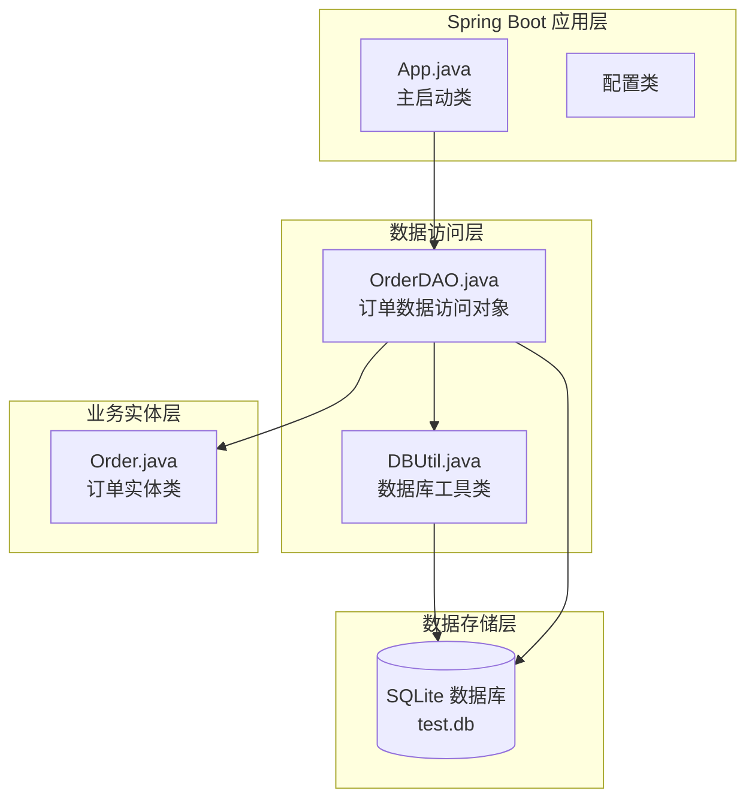
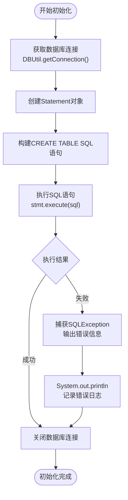
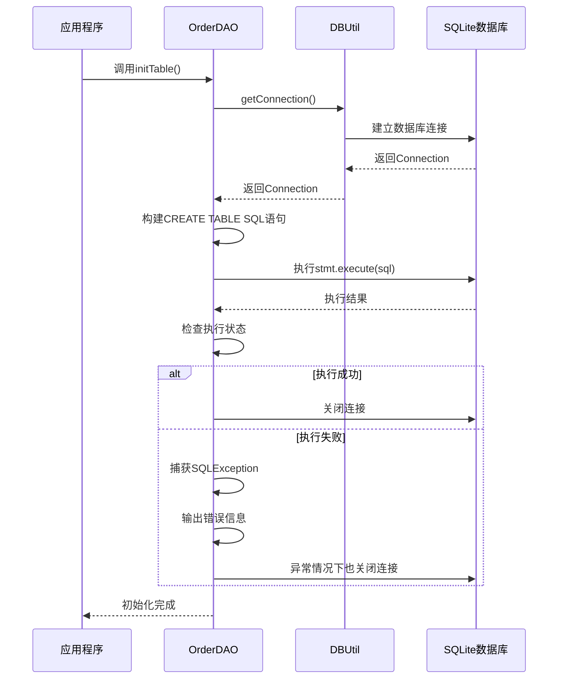
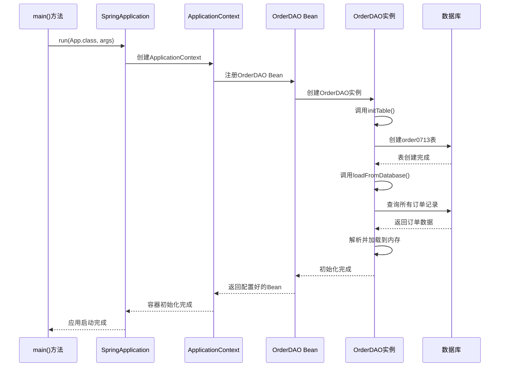
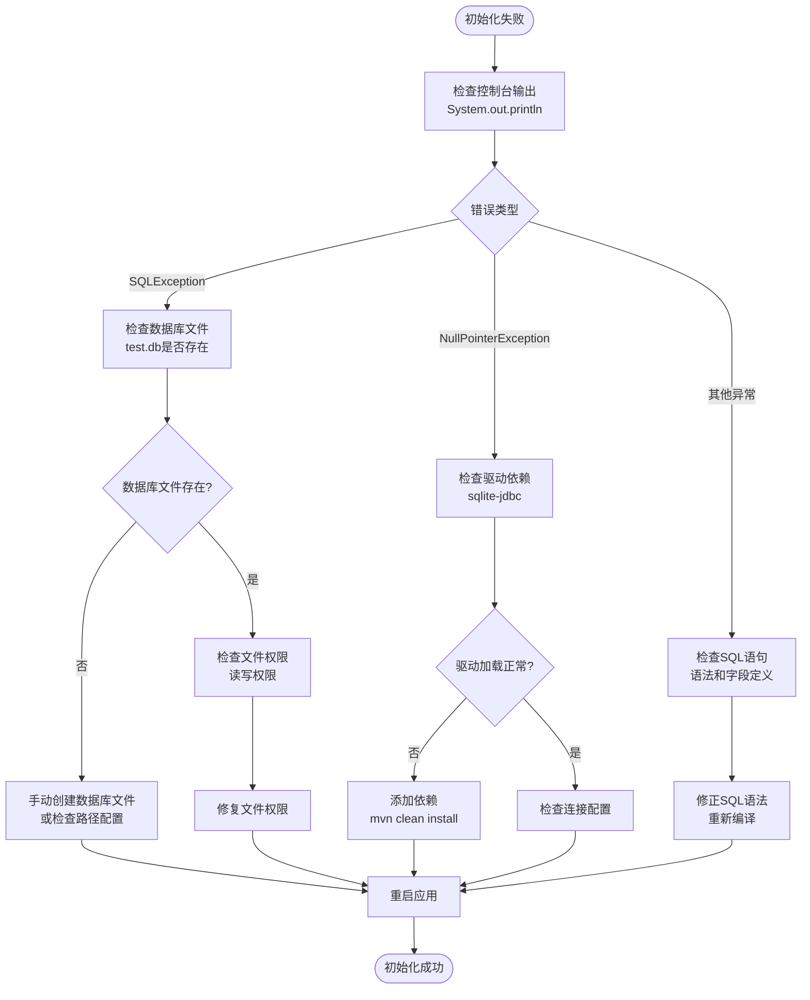

# 数据库初始化

<cite>
**本文档中引用的文件**
- [OrderDAO.java](file://src/main/java/com/example/demo/dao/OrderDAO.java)
- [App.java](file://src/main/java/com/example/demo/App.java)
- [DBUtil.java](file://src/main/java/com/example/demo/dao/DBUtil.java)
- [application.properties](file://src/main/resources/application.properties)
- [Order.java](file://src/main/java/com/example/demo/entity/Order.java)
- [pom.xml](file://pom.xml)
</cite>

## 目录
1. [简介](#简介)
2. [项目架构概览](#项目架构概览)
3. [数据库初始化机制详解](#数据库初始化机制详解)
4. [CREATE TABLE IF NOT EXISTS语句分析](#create-table-if-not-exists语句分析)
5. [order0713表结构设计](#order0713表结构设计)
6. [Spring Boot应用启动初始化流程](#spring-boot应用启动初始化流程)
7. [错误处理与故障排查](#错误处理与故障排查)
8. [最佳实践建议](#最佳实践建议)
9. [总结](#总结)

## 简介

本项目采用SQLite数据库作为持久化存储方案，通过Spring Boot框架实现数据库的自动初始化和管理。核心的数据库初始化机制由OrderDAO类中的initTable()方法实现，该方法负责创建order0713表结构，并确保应用程序启动时数据库环境的正确配置。

## 项目架构概览

项目采用经典的三层架构模式，主要包含以下组件：



**图表来源**
- [App.java](file://src/main/java/com/example/demo/App.java#L1-L24)
- [OrderDAO.java](file://src/main/java/com/example/demo/dao/OrderDAO.java#L1-L248)
- [DBUtil.java](file://src/main/java/com/example/demo/dao/DBUtil.java#L1-L19)

## 数据库初始化机制详解

### initTable()方法核心功能

OrderDAO类中的initTable()方法是整个数据库初始化的核心组件，其主要职责包括：

1. **数据库连接管理**：通过DBUtil工具类获取数据库连接
2. **表结构创建**：执行CREATE TABLE IF NOT EXISTS SQL语句
3. **异常处理**：捕获并处理数据库操作过程中的异常
4. **资源管理**：使用try-with-resources确保数据库连接正确关闭



**图表来源**
- [OrderDAO.java](file://src/main/java/com/example/demo/dao/OrderDAO.java#L28-L46)

**节来源**
- [OrderDAO.java](file://src/main/java/com/example/demo/dao/OrderDAO.java#L28-L46)

### 数据库连接管理

系统通过DBUtil工具类统一管理数据库连接，采用SQLite嵌入式数据库，连接URL指向项目根目录下的test.db文件。

**节来源**
- [DBUtil.java](file://src/main/java/com/example/demo/dao/DBUtil.java#L1-L19)

## CREATE TABLE IF NOT EXISTS语句分析

### SQL语句结构解析

initTable()方法中执行的CREATE TABLE IF NOT EXISTS语句具有以下特点：

```sql
CREATE TABLE IF NOT EXISTS order0713(
    orderId TEXT PRIMARY KEY, 
    userId TEXT, 
    productId TEXT, 
    quantity INTEGER, 
    totalAmount TEXT, 
    status INTEGER, 
    description TEXT, 
    createTime TEXT, 
    payTime TEXT, 
    updateTime TEXT
)
```

### 关键特性说明

1. **IF NOT EXISTS条件**：确保表不存在时才创建，避免重复创建导致的错误
2. **PRIMARY KEY约束**：orderId字段作为主键，保证每条记录的唯一性
3. **字段顺序**：按照业务逻辑重要性和查询频率进行字段排列

### 执行逻辑分析



**图表来源**
- [OrderDAO.java](file://src/main/java/com/example/demo/dao/OrderDAO.java#L28-L46)
- [DBUtil.java](file://src/main/java/com/example/demo/dao/DBUtil.java#L16-L18)

**节来源**
- [OrderDAO.java](file://src/main/java/com/example/demo/dao/OrderDAO.java#L28-L46)

## order0713表结构设计

### 字段设计原则

order0713表的设计遵循以下原则：

1. **数据类型选择**：根据字段的实际用途选择最适合的数据类型
2. **主键设计**：使用orderId作为主键，确保记录唯一性
3. **索引优化**：主键自动建立索引，提高查询性能
4. **可扩展性**：预留足够空间以适应未来需求变化

### 字段详细说明

| 字段名 | 数据类型 | 约束 | 含义 | 存储格式 |
|--------|----------|------|------|----------|
| orderId | TEXT | PRIMARY KEY | 订单唯一标识符 | UUID字符串 |
| userId | TEXT | - | 用户ID | 用户唯一标识 |
| productId | TEXT | - | 商品ID | 商品唯一标识 |
| quantity | INTEGER | - | 购买数量 | 整数值 |
| totalAmount | TEXT | - | 订单总金额 | 字符串格式BigDecimal |
| status | INTEGER | - | 订单状态 | 状态码(0-4) |
| description | TEXT | - | 订单描述 | 文本描述信息 |
| createTime | TEXT | - | 创建时间 | ISO-8601格式字符串 |
| payTime | TEXT | - | 支付时间 | ISO-8601格式字符串 |
| updateTime | TEXT | - | 更新时间 | ISO-8601格式字符串 |

### 时间存储格式分析

系统采用ISO-8601标准的字符串格式存储时间信息：

- **存储格式**："yyyy-MM-dd'T'HH:mm:ss.SSS"
- **示例值**："2024-01-15T14:30:45.123"
- **优势**：
  - 标准化程度高，便于跨平台处理
  - 字符串比较顺序与时间顺序一致
  - 兼容性强，易于调试和查看

**节来源**
- [OrderDAO.java](file://src/main/java/com/example/demo/dao/OrderDAO.java#L23-L41)
- [Order.java](file://src/main/java/com/example/demo/entity/Order.java#L31-L38)

## Spring Boot应用启动初始化流程

### 应用启动序列图



**图表来源**
- [App.java](file://src/main/java/com/example/demo/App.java#L13-L23)

### @Bean注解的作用

App.java中的@Bean注解实现了以下功能：

1. **Bean注册**：将OrderDAO实例注册到Spring容器
2. **生命周期管理**：Spring负责管理Bean的创建和销毁
3. **依赖注入**：其他组件可以通过@Autowired注入OrderDAO
4. **初始化控制**：确保initTable()在Bean创建后立即执行

### 初始化时序分析

```mermaid
gantt
title Spring Boot应用启动初始化时序
dateFormat X
axisFormat %s
section 应用启动阶段
主程序启动 :milestone, m1, 0, 0
Spring容器创建 :active, s1, 0, 2
Bean注册 :active, s2, 2, 4
Bean初始化 :active, s3, 4, 8
section 数据库初始化阶段
OrderDAO创建 :milestone, m2, 4, 4
表结构创建 :active, d1, 4, 6
数据加载 :active, d2, 6, 8
section 应用就绪阶段
应用启动完成 :milestone, m3, 8, 8
```



**节来源**
- [App.java](file://src/main/java/com/example/demo/App.java#L17-L23)

## 错误处理与故障排查

### 异常处理机制

initTable()方法采用简单的异常处理策略：

```java
try (Connection conn = DBUtil.getConnection();
     Statement stmt = conn.createStatement()) {
    // 执行SQL语句
} catch (SQLException e) {
    System.out.println("数据库初始化失败: " + e.getMessage());
}
```

### 常见错误类型及解决方案

| 错误类型 | 可能原因 | 排查步骤 | 解决方案 |
|----------|----------|----------|----------|
| SQLException | 数据库文件权限问题 | 检查test.db文件权限 | 修改文件权限或更换存储位置 |
| SQLException | 数据库驱动未加载 | 检查pom.xml依赖 | 添加sqlite-jdbc依赖 |
| NullPointerException | 连接池配置错误 | 检查DBUtil连接URL | 验证数据库路径配置 |
| SQLSyntaxError | SQL语法错误 | 检查CREATE TABLE语句 | 验证字段定义和约束 |

### 故障排查流程



### 调试建议

1. **启用详细日志**：在application.properties中增加日志级别
2. **断点调试**：在initTable()方法中设置断点
3. **数据库验证**：使用SQLite命令行工具验证表结构
4. **依赖检查**：确认pom.xml中包含正确的SQLite驱动

**节来源**
- [OrderDAO.java](file://src/main/java/com/example/demo/dao/OrderDAO.java#L43-L45)

## 最佳实践建议

### 数据库设计优化

1. **索引策略**：为常用查询字段添加索引
2. **数据类型优化**：考虑使用更精确的数据类型
3. **约束完整性**：添加必要的外键约束
4. **分区策略**：对于大数据量场景考虑表分区

### 性能优化建议

1. **批量操作**：使用PreparedStatement和batch操作
2. **连接池**：考虑使用连接池管理数据库连接
3. **事务管理**：对复杂操作使用事务控制
4. **缓存策略**：结合内存缓存提高查询性能

### 安全性考虑

1. **SQL注入防护**：始终使用PreparedStatement
2. **敏感数据保护**：对敏感信息进行加密存储
3. **访问控制**：限制数据库文件的访问权限
4. **备份策略**：定期备份数据库文件

### 可维护性改进

1. **配置分离**：将数据库配置移到外部配置文件
2. **版本管理**：使用数据库迁移工具管理schema变更
3. **单元测试**：为数据库操作编写单元测试
4. **监控告警**：添加数据库健康检查机制

## 总结

本项目通过精心设计的数据库初始化机制，实现了Spring Boot应用的自动化数据库配置。OrderDAO中的initTable()方法采用简洁而有效的实现方式，确保了应用程序启动时数据库环境的正确建立。

### 核心优势

1. **自动化初始化**：无需手动干预即可完成数据库配置
2. **健壮性设计**：完善的异常处理机制
3. **标准化存储**：采用ISO-8601标准存储时间信息
4. **Spring集成**：完美融入Spring Boot生态系统

### 技术亮点

1. **优雅的错误处理**：简单直接的异常捕获和日志记录
2. **资源管理**：使用try-with-resources确保资源正确释放
3. **配置灵活性**：通过@Bean注解实现灵活的Bean管理
4. **扩展性设计**：为未来的功能扩展预留了良好的基础

这种设计模式不仅适用于当前的订单管理系统，也为类似的Spring Boot项目提供了优秀的参考实现。