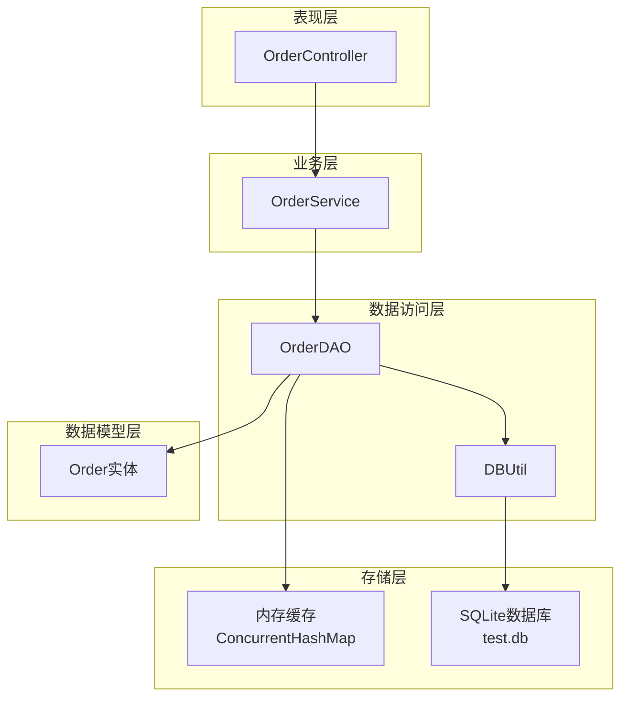
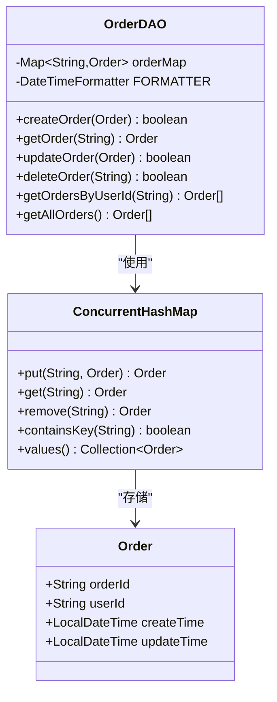
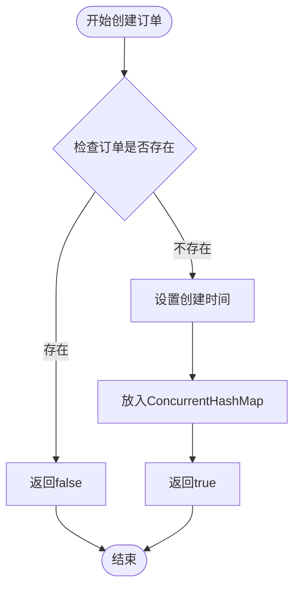
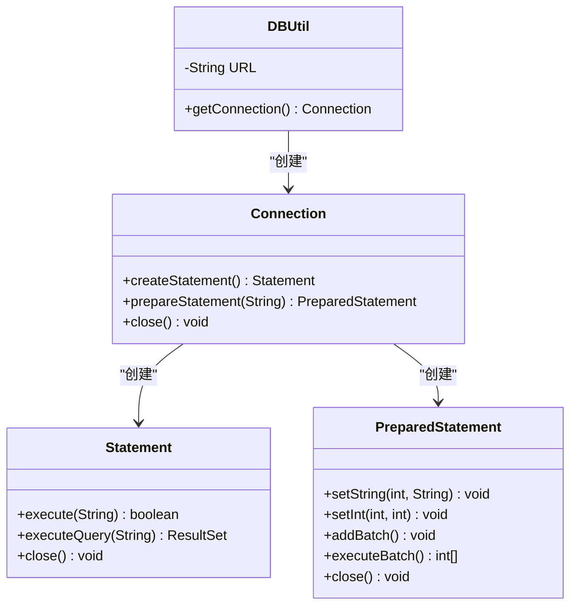
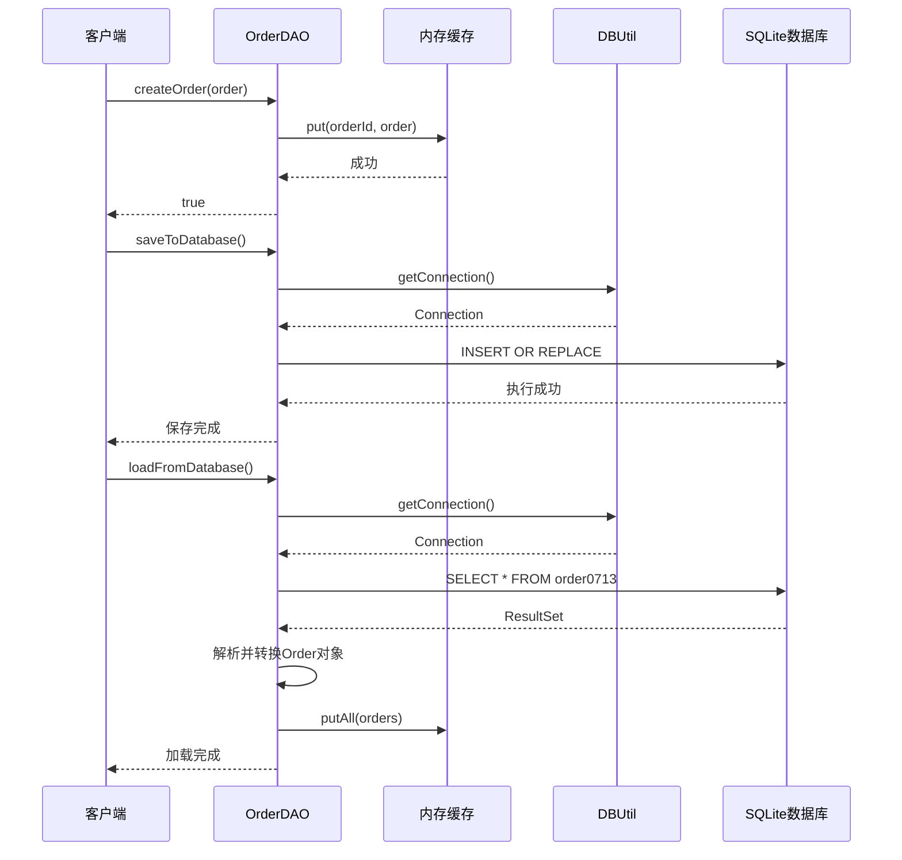
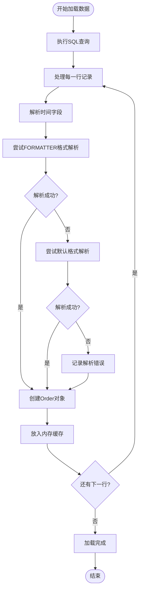
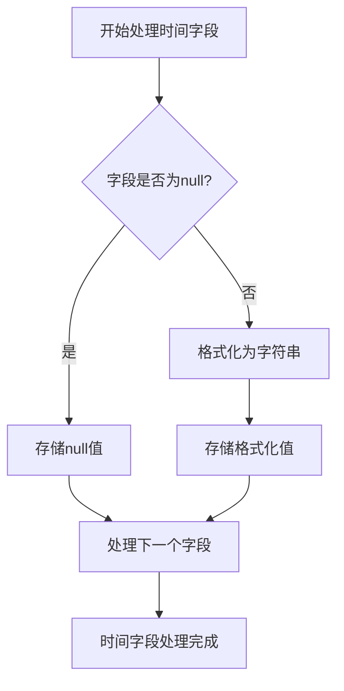
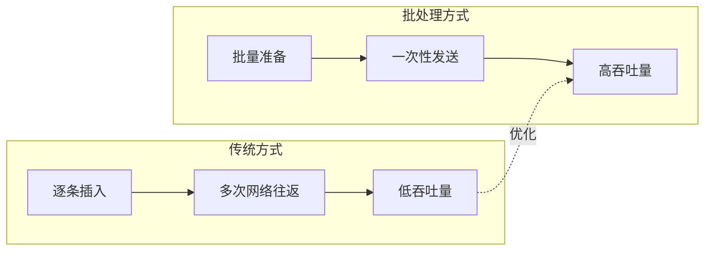
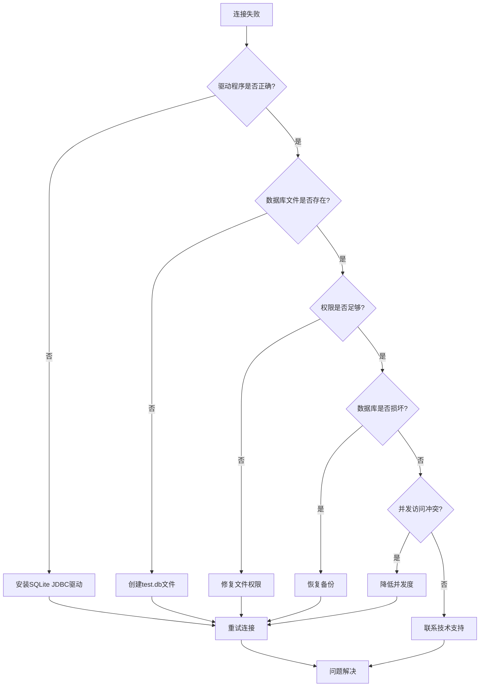

# 数据访问层

<cite>
**本文档中引用的文件**
- [OrderDAO.java](file://src/main/java/com/example/demo/dao/OrderDAO.java)
- [DBUtil.java](file://src/main/java/com/example/demo/dao/DBUtil.java)
- [Order.java](file://src/main/java/com/example/demo/entity/Order.java)
- [pom.xml](file://pom.xml)
- [OrderDAOTest.java](file://src/test/java/com/example/demo/dao/OrderDAOTest.java)
- [application.properties](file://src/main/resources/application.properties)
</cite>

## 目录
1. [引言](#引言)
2. [项目架构概览](#项目架构概览)
3. [核心组件分析](#核心组件分析)
4. [内存缓存机制](#内存缓存机制)
5. [SQLite数据库集成](#sqlite数据库集成)
6. [双重存储策略详解](#双重存储策略详解)
7. [时间字段序列化处理](#时间字段序列化处理)
8. [性能优化与最佳实践](#性能优化与最佳实践)
9. [故障排除指南](#故障排除指南)
10. [总结](#总结)

## 引言

OrderDAO.java是本系统数据访问层的核心组件，采用创新的双重存储策略：同时维护内存缓存和SQLite数据库的同步数据。这种设计既保证了高性能的内存访问，又确保了数据的持久化存储，为订单管理系统提供了可靠的数据持久化解决方案。

该实现巧妙地结合了ConcurrentHashMap的线程安全性优势和SQLite数据库的持久化能力，通过精心设计的JDBC操作实现了高效的数据持久化机制。

## 项目架构概览

系统采用分层架构设计，数据访问层位于业务逻辑层之下，负责处理所有数据持久化操作。

**图表来源**
- [OrderDAO.java](file://src/main/java/com/example/demo/dao/OrderDAO.java#L1-L248)
- [DBUtil.java](file://src/main/java/com/example/demo/dao/DBUtil.java#L1-L19)

**章节来源**
- [OrderDAO.java](file://src/main/java/com/example/demo/dao/OrderDAO.java#L1-L50)
- [DBUtil.java](file://src/main/java/com/example/demo/dao/DBUtil.java#L1-L19)

## 核心组件分析

### OrderDAO类设计

OrderDAO类采用了单一职责原则，专注于订单数据的持久化操作。其核心设计包含以下关键要素：

#### 内存存储容器
- **类型**: `ConcurrentHashMap<String, Order>`
- **特点**: 线程安全、高性能的并发访问
- **用途**: 提供快速的内存级数据访问

#### 时间处理机制
- **格式化器**: `DateTimeFormatter.ofPattern("yyyy-MM-dd'T'HH:mm:ss.SSS")`
- **用途**: 统一的时间格式化和解析标准

#### 数据库连接管理
- **工具类**: DBUtil
- **连接方式**: JDBC连接池模式
- **数据库**: SQLite嵌入式数据库

**章节来源**
- [OrderDAO.java](file://src/main/java/com/example/demo/dao/OrderDAO.java#L18-L24)

## 内存缓存机制

### ConcurrentHashMap线程安全实现

ConcurrentHashMap作为内存缓存的核心数据结构，提供了卓越的并发性能和线程安全性。

**图表来源**
- [OrderDAO.java](file://src/main/java/com/example/demo/dao/OrderDAO.java#L19-L20)
- [Order.java](file://src/main/java/com/example/demo/entity/Order.java#L1-L162)

### 内存操作方法分析

#### 创建订单操作

**图表来源**
- [OrderDAO.java](file://src/main/java/com/example/demo/dao/OrderDAO.java#L165-L175)

#### 查询操作优化
系统实现了高效的内存查询机制：
- **单订单查询**: O(1)时间复杂度的哈希表查找
- **用户订单查询**: 流式操作配合Lambda表达式实现
- **全量查询**: 支持按创建时间降序排列

**章节来源**
- [OrderDAO.java](file://src/main/java/com/example/demo/dao/OrderDAO.java#L165-L247)

## SQLite数据库集成

### 数据库连接管理

DBUtil类提供了简洁而可靠的数据库连接管理功能。

**图表来源**
- [DBUtil.java](file://src/main/java/com/example/demo/dao/DBUtil.java#L10-L18)

### SQL建表语句分析

initTable()方法中的建表语句体现了精心设计的字段结构和约束条件。

#### 字段设计详解

| 字段名 | 数据类型 | 约束条件 | 用途说明 |
|--------|----------|----------|----------|
| orderId | TEXT | PRIMARY KEY | 订单唯一标识符 |
| userId | TEXT | 无 | 关联用户ID |
| productId | TEXT | 无 | 关联商品ID |
| quantity | INTEGER | 无 | 购买数量 |
| totalAmount | TEXT | 无 | 总金额（字符串存储） |
| status | INTEGER | 无 | 订单状态枚举 |
| description | TEXT | 无 | 订单描述信息 |
| createTime | TEXT | 无 | 订单创建时间 |
| payTime | TEXT | 无 | 支付完成时间 |
| updateTime | TEXT | 无 | 最后更新时间 |

#### 状态枚举定义
- **0**: 待支付
- **1**: 已支付  
- **2**: 已发货
- **3**: 已完成
- **4**: 已取消

**章节来源**
- [OrderDAO.java](file://src/main/java/com/example/demo/dao/OrderDAO.java#L28-L46)

## 双重存储策略详解

### 数据持久化流程

系统实现了内存与数据库的双向同步机制，确保数据的一致性和可靠性。

**图表来源**
- [OrderDAO.java](file://src/main/java/com/example/demo/dao/OrderDAO.java#L48-L78)
- [OrderDAO.java](file://src/main/java/com/example/demo/dao/OrderDAO.java#L80-L158)

### JDBC操作实现细节

#### saveToDatabase()方法深度解析

该方法展示了企业级的JDBC编程实践：

1. **预编译语句使用**: 防止SQL注入攻击
2. **批处理优化**: 大幅提升批量插入性能
3. **资源管理**: 使用try-with-resources确保资源释放
4. **异常处理**: 完善的错误处理机制

#### loadFromDatabase()方法实现

该方法包含了复杂的时间字段解析逻辑：

**图表来源**
- [OrderDAO.java](file://src/main/java/com/example/demo/dao/OrderDAO.java#L84-L158)

**章节来源**
- [OrderDAO.java](file://src/main/java/com/example/demo/dao/OrderDAO.java#L48-L158)

## 时间字段序列化处理

### 时间格式化策略

系统采用统一的时间格式化策略，确保时间数据的一致性和可读性。

#### 格式规范
- **标准格式**: `yyyy-MM-dd'T'HH:mm:ss.SSS`
- **用途**: 数据库存储和传输
- **解析优先级**: 标准格式 → 默认格式

#### 序列化处理逻辑

**图表来源**
- [OrderDAO.java](file://src/main/java/com/example/demo/dao/OrderDAO.java#L68-L70)

#### 反序列化容错机制

系统实现了强大的时间字段解析容错机制：

1. **双重解析策略**: 标准格式 → 默认格式
2. **异常捕获**: 完善的异常处理链
3. **日志记录**: 失败解析的详细日志
4. **空值处理**: 自动处理null值情况

**章节来源**
- [OrderDAO.java](file://src/main/java/com/example/demo/dao/OrderDAO.java#L90-L158)

## 性能优化与最佳实践

### JDBC性能优化策略

#### 连接池管理
虽然当前实现使用简单的连接获取方式，但建议考虑以下优化：

1. **连接池实现**: 使用HikariCP或C3P0等连接池
2. **连接复用**: 避免频繁创建和销毁连接
3. **超时设置**: 合理设置连接超时和查询超时

#### 批处理优化

**图表来源**
- [OrderDAO.java](file://src/main/java/com/example/demo/dao/OrderDAO.java#L60-L74)

### 内存管理优化

#### ConcurrentHashMap调优
- **初始容量**: 根据预期数据量设置合理初始容量
- **负载因子**: 保持默认值0.75或根据需要调整
- **并发级别**: 根据实际并发需求调整

#### 内存泄漏防护
- **及时清理**: 定期清理过期订单数据
- **弱引用**: 考虑使用WeakReference避免内存泄漏
- **监控机制**: 实现内存使用监控

### 数据库性能优化

#### 索引策略
- **主键索引**: orderId自动建立主键索引
- **查询优化**: 为常用查询字段建立索引
- **复合索引**: 考虑userId+createTime组合索引

#### SQL优化建议
1. **预编译语句**: 防止SQL注入，提升性能
2. **批处理**: 大量数据操作时使用批处理
3. **事务管理**: 合理使用事务控制数据一致性

**章节来源**
- [OrderDAO.java](file://src/main/java/com/example/demo/dao/OrderDAO.java#L48-L158)
- [pom.xml](file://pom.xml#L54-L59)

## 故障排除指南

### 常见数据库连接问题

#### 连接失败诊断流程

**图表来源**
- [DBUtil.java](file://src/main/java/com/example/demo/dao/DBUtil.java#L16-L18)

#### 错误处理最佳实践

1. **异常分类**: 区分不同类型的异常进行针对性处理
2. **日志记录**: 详细的错误日志便于问题定位
3. **降级策略**: 数据库不可用时的内存模式运行
4. **重试机制**: 实现指数退避的重试策略

### 数据一致性问题

#### 内存与数据库同步问题
- **脏读**: 确保读取操作的原子性
- **丢失更新**: 使用乐观锁或悲观锁机制
- **不一致状态**: 实现补偿机制处理异常情况

#### 数据完整性保障
1. **约束检查**: 在应用层和数据库层双重验证
2. **事务边界**: 明确事务的开始和结束点
3. **回滚机制**: 发生错误时能够回滚到一致状态

**章节来源**
- [OrderDAO.java](file://src/main/java/com/example/demo/dao/OrderDAO.java#L43-L45)
- [OrderDAO.java](file://src/main/java/com/example/demo/dao/OrderDAO.java#L154-L157)

## 总结

OrderDAO.java实现了一个创新且高效的数据持久化解决方案，通过以下关键特性实现了卓越的性能和可靠性：

### 核心优势

1. **双重存储策略**: 内存缓存提供高性能访问，SQLite确保数据持久化
2. **线程安全设计**: ConcurrentHashmap确保多线程环境下的数据一致性
3. **优雅的时间处理**: 统一的时间格式化和强大的解析容错机制
4. **JDBC最佳实践**: 预编译语句、批处理和资源管理的完美结合

### 技术亮点

- **内存级查询性能**: O(1)的单订单查询时间复杂度
- **批量操作优化**: 大幅提升大数据量处理效率
- **异常处理完善**: 全面的错误处理和日志记录机制
- **扩展性强**: 清晰的架构设计便于功能扩展

### 应用价值

该实现不仅满足了当前的业务需求，还为未来的系统扩展奠定了坚实的基础。通过合理的架构设计和性能优化，系统能够在高并发场景下稳定运行，同时保持良好的可维护性和可扩展性。

这种内存与数据库相结合的双重存储策略，为现代Java应用程序的数据持久化提供了一个优秀的参考实现，特别适用于中小型系统的订单管理、用户数据管理和配置数据存储等场景。