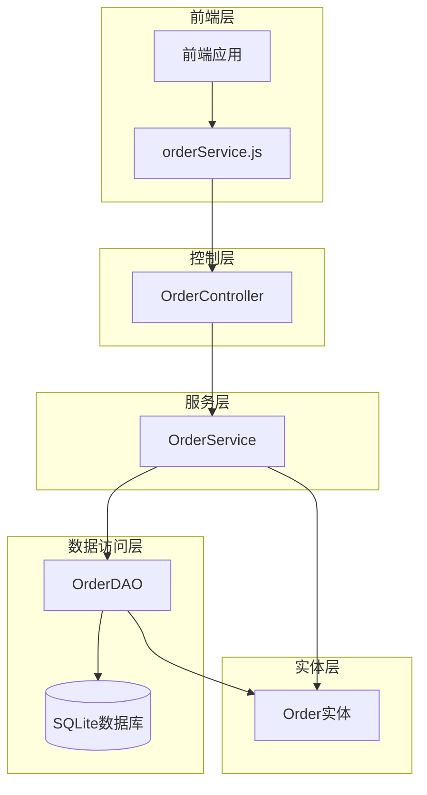
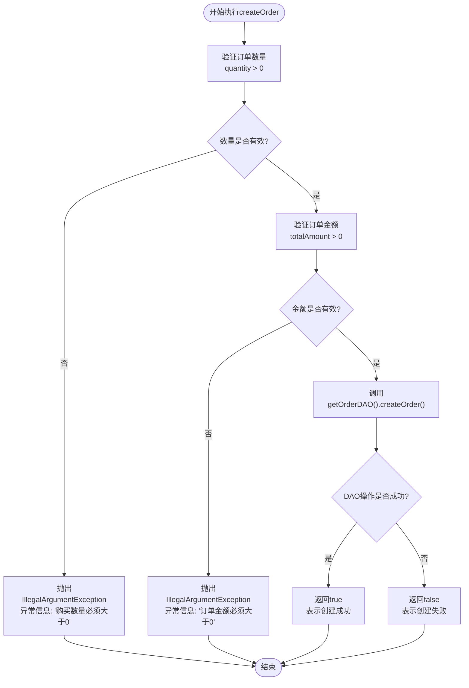
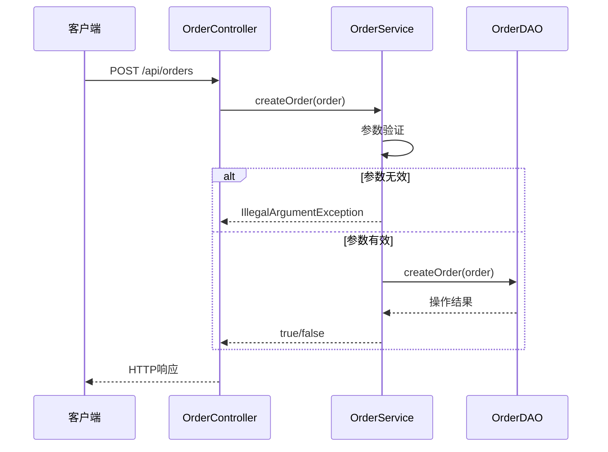
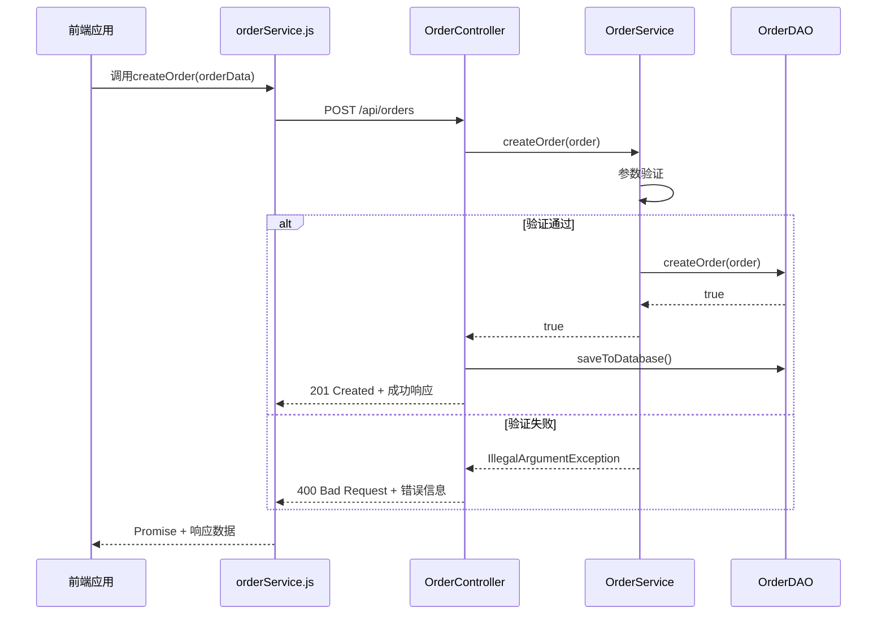
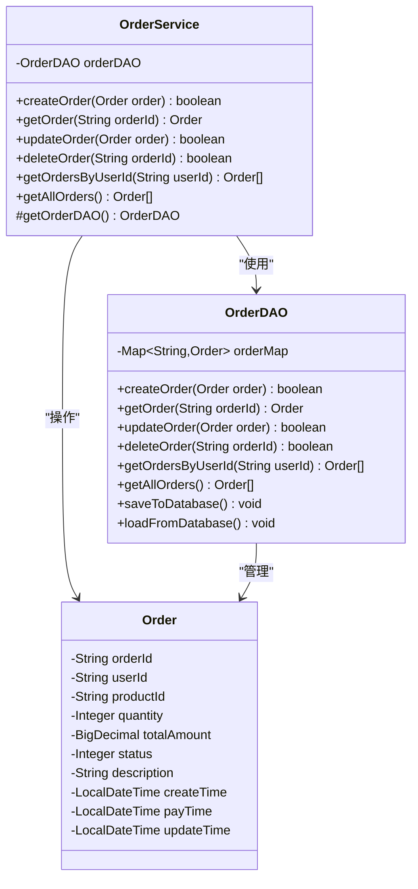

# 创建订单

<cite>
**本文档中引用的文件**
- [OrderService.java](file://src/main/java/com/example/demo/service/OrderService.java)
- [OrderController.java](file://src/main/java/com/example/demo/controller/OrderController.java)
- [orderService.js](file://frontend/src/services/orderService.js)
- [OrderDAO.java](file://src/main/java/com/example/demo/dao/OrderDAO.java)
- [Order.java](file://src/main/java/com/example/demo/entity/Order.java)
- [OrderServiceTest.java](file://src/test/java/com/example/demo/service/OrderServiceTest.java)
- [AIOrderServiceTest.java](file://src/test/java/com/example/demo/service/ai_test/AIOrderServiceTest.java)
</cite>

## 目录
1. [概述](#概述)
2. [系统架构](#系统架构)
3. [createOrder方法详细分析](#createorder方法详细分析)
4. [业务逻辑实现](#业务逻辑实现)
5. [异常处理机制](#异常处理机制)
6. [数据持久化流程](#数据持久化流程)
7. [前后端集成映射](#前后端集成映射)
8. [服务层职责边界](#服务层职责边界)
9. [常见错误场景与调试](#常见错误场景与调试)
10. [最佳实践建议](#最佳实践建议)

## 概述

OrderService中的createOrder方法是订单管理系统的核心业务逻辑组件，负责验证订单数据的有效性并完成订单的创建过程。该方法实现了严格的业务规则校验，确保只有符合要求的订单才能被创建，并提供了完善的异常处理机制来应对各种非法输入情况。

## 系统架构



**图表来源**
- [OrderController.java](file://src/main/java/com/example/demo/controller/OrderController.java#L22-L30)
- [OrderService.java](file://src/main/java/com/example/demo/service/OrderService.java#L14-L21)
- [OrderDAO.java](file://src/main/java/com/example/demo/dao/OrderDAO.java#L18-L21)

## createOrder方法详细分析

### 方法签名与职责

createOrder方法位于OrderService类中，采用以下签名：
```java
public boolean createOrder(Order order)
```

该方法的主要职责包括：
- 对订单数量进行有效性校验（quantity > 0）
- 对订单总金额进行有效性校验（totalAmount > 0）
- 调用底层数据访问层完成数据持久化
- 返回操作结果状态

### 核心业务逻辑



**图表来源**
- [OrderService.java](file://src/main/java/com/example/demo/service/OrderService.java#L28-L37)

**章节来源**
- [OrderService.java](file://src/main/java/com/example/demo/service/OrderService.java#L28-L37)

## 业务逻辑实现

### 订单数量校验规则

方法首先检查订单的购买数量是否大于0：

```java
if (order.getQuantity() <= 0) {
    throw new IllegalArgumentException("购买数量必须大于0");
}
```

这个校验确保：
- 订单必须包含至少一件商品
- 避免创建无效的空订单
- 维护业务逻辑的一致性

### 订单金额校验规则

接着检查订单总金额是否大于0：

```java
if (order.getTotalAmount().compareTo(order.getTotalAmount().ZERO) <= 0) {
    throw new IllegalArgumentException("订单金额必须大于0");
}
```

这个校验确保：
- 订单金额不能为零或负数
- 符合商业逻辑要求
- 防止财务数据异常

### 数据类型处理

方法使用BigDecimal类型的totalAmount，这体现了系统对金融数据精度的重视：
- 避免浮点数精度问题
- 支持精确的货币计算
- 符合金融系统的最佳实践

**章节来源**
- [OrderService.java](file://src/main/java/com/example/demo/service/OrderService.java#L30-L34)
- [Order.java](file://src/main/java/com/example/demo/entity/Order.java#L22-L24)

## 异常处理机制

### IllegalArgumentException异常

当检测到非法参数时，方法会抛出IllegalArgumentException异常：

```java
throw new IllegalArgumentException("购买数量必须大于0");
throw new IllegalArgumentException("订单金额必须大于0");
```

### 异常处理策略

1. **即时验证**：在业务逻辑层进行参数验证
2. **明确错误信息**：提供具体的错误原因
3. **阻止后续操作**：一旦发现非法参数，立即终止执行
4. **保持事务一致性**：未通过验证的请求不会影响数据库状态

### 异常传播路径



**图表来源**
- [OrderController.java](file://src/main/java/com/example/demo/controller/OrderController.java#L36-L55)
- [OrderService.java](file://src/main/java/com/example/demo/service/OrderService.java#L28-L37)

**章节来源**
- [OrderService.java](file://src/main/java/com/example/demo/service/OrderService.java#L30-L34)
- [OrderController.java](file://src/main/java/com/example/demo/controller/OrderController.java#L36-L55)

## 数据持久化流程

### 底层DAO调用

createOrder方法通过getOrderDAO()方法获取OrderDAO实例并调用其createOrder方法：

```java
return getOrderDAO().createOrder(order);
```

### OrderDAO实现细节

OrderDAO的createOrder方法实现如下：

```java
public boolean createOrder(Order order) {
    if (orderMap.containsKey(order.getOrderId())) {
        return false; // 订单已存在
    }
    // 确保创建时间被设置
    if (order.getCreateTime() == null) {
        order.setCreateTime(LocalDateTime.now());
    }
    orderMap.put(order.getOrderId(), order);
    return true;
}
```

### 数据存储机制

系统采用内存Map模拟数据库存储：
- 使用ConcurrentHashMap保证线程安全
- 支持并发访问和操作
- 提供基本的CRUD功能

### 数据持久化时机

实际的数据持久化发生在OrderController中：

```java
boolean success = orderService.createOrder(order);
if (success) {
    orderDAO.saveToDatabase();
    // ...
}
```

**章节来源**
- [OrderService.java](file://src/main/java/com/example/demo/service/OrderService.java#L37-L37)
- [OrderDAO.java](file://src/main/java/com/example/demo/dao/OrderDAO.java#L165-L174)
- [OrderController.java](file://src/main/java/com/example/demo/controller/OrderController.java#L41-L41)

## 前后端集成映射

### 前端调用映射

前端通过orderService.js的createOrder方法发起请求：

```javascript
createOrder: (orderData) => {
    return api.post('/orders', orderData);
}
```

### HTTP请求映射

OrderController中的createOrder方法处理HTTP POST请求：

```java
@PostMapping
public ResponseEntity<Map<String, Object>> createOrder(@RequestBody Order order) {
    // ...
}
```

### 请求响应流程



**图表来源**
- [orderService.js](file://frontend/src/services/orderService.js#L14-L16)
- [OrderController.java](file://src/main/java/com/example/demo/controller/OrderController.java#L36-L55)

**章节来源**
- [orderService.js](file://frontend/src/services/orderService.js#L14-L16)
- [OrderController.java](file://src/main/java/com/example/demo/controller/OrderController.java#L36-L55)

## 服务层职责边界

### OrderService的职责范围

OrderService作为业务逻辑层，承担以下职责：

1. **业务规则验证**：验证订单数量和金额的有效性
2. **业务逻辑处理**：执行订单创建的业务规则
3. **数据转换**：将前端传递的数据转换为业务对象
4. **异常处理**：捕获和处理业务异常

### 与DAO层的协作



**图表来源**
- [OrderService.java](file://src/main/java/com/example/demo/service/OrderService.java#L14-L21)
- [OrderDAO.java](file://src/main/java/com/example/demo/dao/OrderDAO.java#L18-L21)
- [Order.java](file://src/main/java/com/example/demo/entity/Order.java#L9-L162)

### 与Controller层的协作

OrderController负责：
- 接收HTTP请求
- 参数绑定和验证
- 异常处理和响应构建
- 调用OrderService执行业务逻辑

**章节来源**
- [OrderService.java](file://src/main/java/com/example/demo/service/OrderService.java#L14-L21)
- [OrderController.java](file://src/main/java/com/example/demo/controller/OrderController.java#L22-L30)

## 常见错误场景与调试

### 负数量提交场景

**错误场景描述**：
当用户提交数量为0或负数的订单时，系统会抛出IllegalArgumentException异常。

**错误信息**：
```
购买数量必须大于0
```

**调试步骤**：
1. 检查前端表单验证逻辑
2. 查看网络请求中的orderData
3. 在OrderService.createOrder方法中设置断点
4. 验证order.getQuantity()的值

### 零金额或负金额场景

**错误场景描述**：
当订单总金额为0或负数时触发异常。

**错误信息**：
```
订单金额必须大于0
```

**调试步骤**：
1. 检查价格计算逻辑
2. 验证BigDecimal的比较操作
3. 查看totalAmount的赋值过程

### 数据库保存失败场景

**错误场景描述**：
虽然业务验证通过，但数据库保存失败。

**调试步骤**：
1. 检查OrderDAO.saveToDatabase()方法
2. 查看数据库连接状态
3. 验证SQL语句执行情况

### 日志定位方法

**服务层日志**：
```java
// 在OrderService中添加日志
import org.slf4j.Logger;
import org.slf4j.LoggerFactory;

private static final Logger logger = LoggerFactory.getLogger(OrderService.class);

public boolean createOrder(Order order) {
    logger.debug("开始创建订单: {}", order.getOrderId());
    // ... 校验逻辑
    logger.info("订单验证通过，准备调用DAO");
    boolean result = getOrderDAO().createOrder(order);
    logger.debug("DAO操作结果: {}", result);
    return result;
}
```

**控制器层日志**：
```java
// 在OrderController中添加日志
logger.error("创建订单失败: {}", e.getMessage(), e);
```

**章节来源**
- [OrderServiceTest.java](file://src/test/java/com/example/demo/service/OrderServiceTest.java#L59-L94)
- [AIOrderServiceTest.java](file://src/test/java/com/example/demo/service/ai_test/AIOrderServiceTest.java#L59-L118)

## 最佳实践建议

### 参数验证最佳实践

1. **前置验证**：在业务逻辑层进行参数验证
2. **明确错误信息**：提供具体的错误原因和期望值
3. **及时中断**：发现非法参数时立即终止执行
4. **保持一致性**：统一的异常处理策略

### 异常处理最佳实践

1. **使用适当的异常类型**：IllegalArgumentException用于参数验证
2. **提供有意义的错误信息**：帮助开发者快速定位问题
3. **避免异常信息泄露敏感信息**
4. **记录异常日志**：便于问题排查和系统监控

### 性能优化建议

1. **批量操作**：考虑使用OrderDAO.saveToDatabase()进行批量保存
2. **缓存策略**：对于频繁查询的订单数据可以考虑缓存
3. **异步处理**：对于非关键性的数据持久化可以考虑异步处理

### 测试覆盖建议

1. **边界值测试**：测试数量=0、金额=0等边界情况
2. **异常路径测试**：验证各种异常情况的处理
3. **集成测试**：测试完整的端到端流程
4. **性能测试**：验证高并发场景下的系统表现

**章节来源**
- [OrderServiceTest.java](file://src/test/java/com/example/demo/service/OrderServiceTest.java#L59-L94)
- [AIOrderServiceTest.java](file://src/test/java/com/example/demo/service/ai_test/AIOrderServiceTest.java#L59-L118)